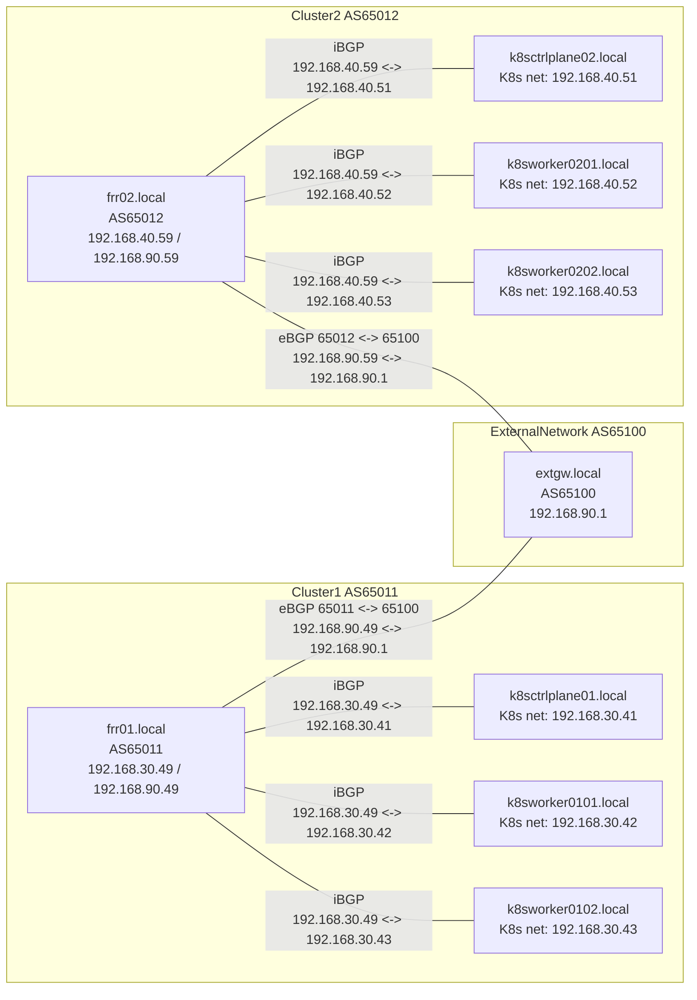

# AnsibleによるDebian Linux (Ubuntu Linux) / Red Hat Enterprise Linux (Alma Linux)環境構築

- [AnsibleによるDebian Linux (Ubuntu Linux) / Red Hat Enterprise Linux (Alma Linux)環境構築](#ansibleによるdebian-linux-ubuntu-linux--red-hat-enterprise-linux-alma-linux環境構築)
  - [ディレクトリ構成](#ディレクトリ構成)
  - [使用法](#使用法)
    - [Makeターゲット](#makeターゲット)
  - [設定方法](#設定方法)
    - [広域設定ファイル (vars/all-config.yml) の設定値](#広域設定ファイル-varsall-configyml-の設定値)
      - [広域設定ファイル基本設定](#広域設定ファイル基本設定)
      - [users\_list定義](#users_list定義)
      - [users\_authorized\_keys定義](#users_authorized_keys定義)
      - [ネットワーク設定](#ネットワーク設定)
      - [クライアントのDomain Name System (DNS) サーバ関連設定](#クライアントのdomain-name-system-dns-サーバ関連設定)
      - [multicast DNS (mDNS) 関連設定](#multicast-dns-mdns-関連設定)
      - [Network Time Protocol (NTP) クライアントの設定](#network-time-protocol-ntp-クライアントの設定)
      - [Domain Name System (DNS) サーバの設定](#domain-name-system-dns-サーバの設定)
      - [Network File System (NFS) サーバの設定](#network-file-system-nfs-サーバの設定)
      - [Network Time Protocol (NTP)サーバの設定](#network-time-protocol-ntpサーバの設定)
      - [プロキシ設定](#プロキシ設定)
      - [Rancher 関連設定](#rancher-関連設定)
      - [Docker Community Edition関連設定](#docker-community-edition関連設定)
        - [コンテナイメージのバックアップ設定](#コンテナイメージのバックアップ設定)
      - [ユーザ設定ファイルスケルトンの生成](#ユーザ設定ファイルスケルトンの生成)
      - [ホームディレクトリのバックアップ](#ホームディレクトリのバックアップ)
      - [Emacsパッケージ関連設定](#emacsパッケージ関連設定)
      - [Lightweight Directory Access Protocol (LDAP) サーバ関連設定](#lightweight-directory-access-protocol-ldap-サーバ関連設定)
      - [Redmine関連設定](#redmine関連設定)
      - [Gitlab関連設定](#gitlab関連設定)
      - [Kubernetes関連設定](#kubernetes関連設定)
        - [K8sクラスタ間の接続設定](#k8sクラスタ間の接続設定)
        - [FRRoutingの設定](#frroutingの設定)
        - [Cilium CNI](#cilium-cni)
        - [Cilium BGP Control Planeの設定](#cilium-bgp-control-planeの設定)
        - [`k8s_bgp`変数の`address_families`の要素を辞書として指定する場合の指定方法](#k8s_bgp変数のaddress_familiesの要素を辞書として指定する場合の指定方法)
        - [Kubernetes ワーカーノード上でFRRによるルート交換を行う場合の設定](#kubernetes-ワーカーノード上でfrrによるルート交換を行う場合の設定)
        - [Multus メタCNI](#multus-メタcni)
        - [Whereabouts CNI](#whereabouts-cni)
        - [Hubble UI](#hubble-ui)
      - [複数コントロールプレインの操作](#複数コントロールプレインの操作)
        - [kubeconfig ファイルの配置と属性](#kubeconfig-ファイルの配置と属性)
        - [`kubeconfig` ファイルの収集](#kubeconfig-ファイルの収集)
          - [RedHat系 の場合](#redhat系-の場合)
          - [Debian 系 の場合](#debian-系-の場合)
        - [共通認証局(Certificate Authority)証明書の確認方法](#共通認証局certificate-authority証明書の確認方法)
        - [Cluster Mesh 用 機密情報を保持するリソース(`Secret`)の確認方法](#cluster-mesh-用-機密情報を保持するリソースsecretの確認方法)
        - [`kubeconfig`の更新と再配布](#kubeconfigの更新と再配布)
          - [`~kube/.kube/config`ファイルに関する補足事項](#kubekubeconfigファイルに関する補足事項)
          - [コンテキスト一覧取得](#コンテキスト一覧取得)
        - [コンテキスト指定による操作対象コントロールプレインの切り替え](#コンテキスト指定による操作対象コントロールプレインの切り替え)
    - [Netgauge](#netgauge)
    - [host\_vars/ ディレクトリ配下のホスト設定ファイル](#host_vars-ディレクトリ配下のホスト設定ファイル)
      - [ホスト設定ファイル中でのネットワークインターフェース設定](#ホスト設定ファイル中でのネットワークインターフェース設定)
  - [用語](#用語)
  - [参考サイト](#参考サイト)

## ディレクトリ構成

```text
.
|-- Makefile      playbook実行, アーカイブ作成用Makefile
|-- Readme.md     本文書
|-- ansible.cfg   playbook実行時の設定
|-- basic.yml     基本サーバ実施ロール定義
|-- devel.yml     開発サーバ実施ロール定義
|-- group_vars    グループ固有の変数
|-- host_vars     ホスト固有の変数定義
|-- inventory/hosts    サーバ種別単位とホスト名の対応関係定義
|-- k8s-ctrl-plane.yml Kubernetes コントロールプレイン実施ロール定義
|-- k8s-worker.yml     Kubernetes ワーカーノード実施ロール定義
|-- kitting            Virtual Machine (VM)イメージ作成関連スクリプト格納ディレクトリ
|-- rancher.yml        Rancherノード実施ロール定義
|-- roles              各種ロール定義
|-- server.yml         管理サーバノード実施ロール定義
|-- site.yml           メインサイト定義
`-- vars               設定関連変数定義
```

## 使用法

シェルのコマンドラインから以下のコマンドを実行することで, ansibleによる構築作業が実施される。

```shell
make
```

実行ログは, `build.log`に格納される。

### Makeターゲット

playbook実行, アーカイブ作成用Makefileでは, 以下のターゲットを指定することが可能。

|ターゲット名|処理内容|
|---|---|
|all, または,run|inventory/hostsに定義されたすべてのホストに対して構築を実施する(デフォルトターゲット)。|
|clean|一時ファイルを削除する。|
|distclean|アーカイブを含めて一時ファイルを削除する。|
|run_ロール名|指定されたロール名のロールをinventory/hostsに定義されたすべてのホストに対して実施する。|
|mk_arc|本playbookのアーカイブを作成する。アーカイブ名は, `ansible-<実行日時>.tgz`となる。<実行日時>は, `西暦年月2桁日2桁 (YYYYMMDD)`形式となる。|
|mk_role_arc <ロールディレクトリ>|指定したロールから構成されるアーカイブを作成する。<ロールディレクトリ>には, `roles/common`のように対象のロールを定義したディレクトリへの相対パスを(`./`を付けずに)指定する。アーカイブ名は, `ansible-<ロール名>-<実行日>.tgz`となる。<実行日>は, `西暦年月2桁日2桁 (YYYYMMDD)`形式となる。例えば, `make mk_role_arc roles/common`を実行した場合は, `ansible-common-<実行日>.tgz`というアーカイブが作成される。|
|cloc|コード行数をclocコマンドを用いて表示する。|

## 設定方法

本playbookでは, 以下のファイルに設定項目を記載する。

1. vars/all-config.yml  広域設定ファイル
2. host_vars/ ディレクトリ配下のホスト設定ファイル
3. vars/packages-rhel.yml RedHat系(AlmaLinuxを想定)パッケージ名定義ファイル
4. vars/packages-ubuntu.yml Debian系(Ubuntuを想定)パッケージ名定義ファイル

本稿では, 上記の内, 1., 2.について述べる。

### 広域設定ファイル (vars/all-config.yml) の設定値

本節では, 広域設定ファイル (vars/all-config.yml) の設定項目について述べる。
広域設定ファイルは, 各ロールのdefaults/main.ymlに記載されているデフォルト値の定義に使用される設定値やそれらのファイル中に記載されているデフォルト値を上書きするための設定値を記載する。

各ロールのdefaults/main.ymlに記載されているデフォルトの設定値を修正する場合は,
**defaults/main.ymlの設定値を変更せず**, vars/all-config.ymlに設定を転記の上,
設定値をvars/all-config.yml側で更新することを推奨する。

#### 広域設定ファイル基本設定

|変数名|意味|設定値の例|
|---|---|---|
|use_vmware|VMware環境上のゲストOSを設定する場合はtrueを指定|true|
|use_xcpng|xcp-ng 用追加パッケージを導入するかを制御します。|false|
|xcpng_xe_guest_utilities_version|xcp-ngゲストエージェントの版数|"8.4.0"|
|xcpng_xe_guest_utilities_release|xcp-ngゲストエージェントのリリース版数|"1"|
|force_reboot|設定作業完了後にリブートする場合はtrueを指定|false|
|common_timezone|タイムゾーンの名前|"Asia/Tokyo"|
|common_disable_cron_mails|Cronジョブ完了後のメール送信を抑止する|true|
|common_selinux_state|Security-Enhanced Linuxの動作モード('enforcing', 'permissive', 'disabled' のいずれかを指定)|"permissive"|
|common_sysctl_user_ptrace_enable|一般ユーザによるptraceを有効化し, straceやプログラムのデバッグを可能にする。|true|
|common_sysctl_user_dmesg_enable|一般ユーザによる`dmesg`コマンドの発行を許可する。|true|
|common_sysctl_inotify_max_user_watches|inotify(7) APIによるファイルシステムイベント監視数の上限値を設定する。|524288|
|enable_firewall|Firewall (firewalld / Uncomplicated Firewall (UFW) ) を使用する場合はtrueを指定|false|
|users_list|作成するユーザのリスト|users_list定義参照|
|sudo_nopasswd_users|パスワード入力なしに, sudoコマンドを実行可能なユーザのリストを指定する|['user1']|
|sudo_nopasswd_groups_extra|パスワード入力なしに, sudoコマンドを実行可能なユーザグループのリストを指定する|['adm', 'cdrom', 'sudo', 'dip', 'plugdev', 'lxd', 'systemd-journal']|
|sudo_nopasswd_groups_autodetect|sudoユーザグループを自動検出する場合はtrueを指定|true|
|sudo_nopasswd_absent|sudoのdrop inファイルを削除する場合はtrueを指定|false|

#### users_list定義

users_listには, 以下の要素からなる辞書のリストを記述する.

- name ログイン名を指定する。
- group プライマリグループ名を指定する。
- password ログインパスワードのパスワードハッシュ(/etc/shadow 互換の SHA-512-crypt 方式)を指定する。 "{{ パスワード文字列'\|password_hash('sha512') }}"と記載する。
- update_password パスワード設定タイミングを指定する。通常, 'on\_create'を指定する。
- shell ログインシェルを指定する (/bin/bash など)。
- home ホームディレクトリ名を指定する。
- comment General Electric Comprehensive Operating Supervisor ( GECOS ) フィールドに書き込むフルネームやコメントを記載する。
- email 電子メールアドレスを記載する。
- github GitHubのアカウント名を記載する。アカウント名を記載すると, 本項目に記載されたGitHubアカウントから公開鍵を取り込み, 作成したユーザのSecure Shell (SSH) 公開鍵として使用する。

記載例は以下の通り。

```yaml
  - { name: 'user1', group: 'user1', password: "{{ 'user1'|password_hash('sha512') }}", update_password: 'on_create', shell: "/bin/zsh", home: "/home/user1", comment: 'Sample User', email: "user1@example.org", github: 'sampleuser' }
```

#### users_authorized_keys定義

ユーザ名文字列から.ssh/authorized_keysに追記する公開鍵文字列のリストへのマッピングを定義する辞書である`users_authorized_keys`変数に, ユーザ名とそのユーザのSSH公開鍵のリストを定義することで, 公開鍵によるSSHログイン可能に設定できる。

`users_authorized_keys`のキーには, `users_list`のユーザ名(`name`キーの値)を指定し, `users_authorized_keys`の値には, OpenSSHの `.ssh/authorized_keys`に登録する公開鍵情報行を記載する。

`users_authorized_keys`の例を以下に示す。

```yaml
# ユーザごとに任意の公開鍵を追記する場合に使用
# 形式: ユーザ名文字列から.ssh/authorized_keysに追記する公開鍵文字列のリストへのマッピング
# users_authorized_keys:
#  "ユーザ名":
#    - "公開鍵文字列1 (.ssh/authorized_keysに追記する形式)"
# 例:
# users_authorized_keys:
#   "alice":
#     - "ssh-ed25519 AAAAC3NzaC1lZDI1NTE5AAAAIExampleKeyForAlice alice@example"
#   "bob":
#     - "ssh-ed25519 AAAAC3NzaC1lZDI1NTE5AAAAIExampleKeyForBobOne bob@example"
#     - "ssh-rsa AAAAB3NzaC1yc2EAAAADAQABAAABAQDBExampleKeyForBobTwo bob@workstation"
```

上記の例では, 以下のようにSSH公開鍵の設定を行う。

- ユーザ "alice"の公開鍵に, `ssh-ed25519 AAAAC3NzaC1lZDI1NTE5AAAAIExampleKeyForAlice alice@example` (ed25519鍵, `AAAAC3NzaC1lZDI1NTE5AAAAIExampleKeyForAlice`を追加, コメントとして, `alice@example`を記載)
- ユーザ "bob"の公開鍵に以下の2つの鍵を追加
  - `ssh-ed25519 AAAAC3NzaC1lZDI1NTE5AAAAIExampleKeyForBobOne bob@example` (ed25519鍵, `AAAAC3NzaC1lZDI1NTE5AAAAIExampleKeyForBobOne`を追加, コメントとして, `bob@example`を記載)
  - `ssh-rsa AAAAB3NzaC1yc2EAAAADAQABAAABAQDBExampleKeyForBobTwo bob@workstation` (RSA鍵, `AAAAB3NzaC1yc2EAAAADAQABAAABAQDBExampleKeyForBobTwo`を追加, コメントとして, `bob@workstation`を記載)

#### ネットワーク設定

以下で管理サーバは, Network Time Protocol (NTP) サーバ, Domain Name System (DNS) サーバ, Lightweight Directory Access Protocol (LDAP) サーバなどを担うホストを表す。
これらの役割を別のホストに割り当てる場合は, それぞれのサーバごとに個別のアドレスやホスト名を設定する。

|変数名|意味|設定値の例|
|---|---|---|
|router_host|ルータのホスト名を指定する|'router'|
|router_ipv4_address|ルータのIPv4アドレスを指定する|"192.168.20.1"|
|router_ipv6_address|ルータのIPv6アドレスを指定する|"fd69:6684:61a:1::1"|
|devserver_ipv4_address|管理サーバのIPv4アドレスを指定する|"192.168.20.11"|
|devserver_ipv6_address|管理サーバのIPv6アドレスを指定する|"fd69:6684:61a:1::11"|
|network_ipv4_prefix_len|物理サーバ/管理用VMネットワークのIPv4ネットワークプレフィクス長|24|
|network_ipv6_prefix_len|物理サーバ/管理用VMネットワークのIPv6ネットワークプレフィクス長|64|
|network_ipv4_prefix|物理サーバ/管理用VMネットワークのIPv4ネットワークのプレフィクスアドレス|"{{router_ipv4_prefix}}"|
|network_ipv6_prefix|物理サーバ/管理用VMネットワークのIPv6ネットワークのプレフィクスアドレス|"{{router_ipv6_prefix}}"|
|network_ipv4_network_address|物理サーバ/管理用VMネットワークのIPv4ネットワークアドレス|"{{router_ipv4_prefix}}.0"|
|network_ipv6_network_address|物理サーバ/管理用VMネットワークのIPv6ネットワークアドレス|"{{router_ipv6_prefix}}"|
|gateway4|IPv4ゲートウエイアドレス|"{{router_ipv4_address}}"|
|gateway6|IPv6ゲートウエイアドレス|"{{router_ipv6_address}}"|
|gpm_mgmt_ipv4_prefix|仮想環境内部管理ネットワークのIPv4ネットワークプレフィクス|"192.168.30"|
|gpm_mgmt_ipv6_prefix|仮想環境内部管理ネットワークのIPv6ネットワークプレフィクス|"fdad:ba50:248b:1::"|
|gpm_mgmt_ipv4_addr_prefix_len|仮想環境内部管理ネットワークのIPv4アドレスプレフィクス長|24|
|gpm_mgmt_ipv6_addr_prefix_len|仮想環境内部管理ネットワークのIPv6アドレスプレフィクス長|64|
|gpm_mgmt_ipv4_network_address|仮想環境内部管理ネットワークのIPv4アドレス|"{{ gpm_mgmt_ipv4_prefix }}.0"|
|gpm_mgmt_ipv6_network_address|仮想環境内部管理ネットワークのIPv6アドレス|"{{ gpm_mgmt_ipv6_prefix }}"|
|gpm_mgmt_ipv4_network_cidr|仮想環境内部管理ネットワークのIPv4ネットワークアドレスCIDR|"{{ gpm_mgmt_ipv4_network_address }}/{{ gpm_mgmt_ipv4_addr_prefix_len }}"|
|gpm_mgmt_ipv6_network_cidr|仮想環境内部管理ネットワークのIPv6ネットワークアドレスCIDR|"{{ gpm_mgmt_ipv6_network_address }}/{{ gpm_mgmt_ipv6_addr_prefix_len }}"|
|gpm_mgmt_router_ipv4_address|仮想環境内部管理ネットワークのIPv4ルータアドレス|"{{ gpm_mgmt_ipv4_prefix }}.17"|
|gpm_mgmt_router_ipv6_address|仮想環境内部管理ネットワークのIPv6ルータアドレス|"{{ gpm_mgmt_ipv6_prefix }}::17"|
|gpm_mgmt_ipv4_network_gateway|仮想環境内部管理ネットワークのIPv4ネットワークゲートウェイアドレス|"{{ gpm_mgmt_router_ipv4_address }}"|
|gpm_mgmt_ipv6_network_gateway|仮想環境内部管理ネットワークのIPv6ネットワークゲートウェイアドレス|"{{ gpm_mgmt_router_ipv6_address }}"|
|mgmt_nic|デフォルトの管理用ネットワークインターフェース名|"ens160"|

#### クライアントのDomain Name System (DNS) サーバ関連設定

|変数名|意味|設定値の例|
|---|---|---|
|ipv4_name_server1|DNSサーバのIPv4アドレス1|"{{devserver_ipv4_address}}"|
|ipv4_name_server2|DNSサーバのIPv4アドレス2|"{{router_ipv4_address}}"|
|ipv6_name_server1|DNSサーバのIPv6アドレス1|"{{devserver_ipv6_address}}"|
|ipv6_name_server2|DNSサーバのIPv6アドレス2|"2606:4700:4700::1111"|
|dns_search|DNSサーチドメインを;で区切って指定する|"example.org;sub.example.org"|

ipv4_name_server1, ipv4_name_server2の両方を設定した場合は両方設定される。ipv4_name_server1, ipv4_name_server2のいずれか一方のみを設定した場合は, その1つのみ設定される。ipv4_name_server1, ipv4_name_server2のいずれも設定しなかった場合は, Dynamic Host Configuration Protocol (DHCP) で取得したDNSサーバが設定される。

実装上は, dns_searchには, DNSサーチドメインをセミコロン(;)またはカンマ(,)で区切って指定するほか, リストで指定することも可能だが, 仕様としては, セミコロン(;)で区切るものとする。

注意:systemd-resolvedが Local Area Network (LAN) 内のドメイン名を外部のDNS ( フォールバックDNS ) に問い合わせに行かないようにするためipv4_name_server1, ipv4_name_server2にはLAN内のDNSサーバを設定する。

dns_host_listに以下の要素からなる辞書のリストを記述することで,
静的IPv4アドレスを持つホストのホスト名とIPv4アドレスをDNSのゾーン情報に記録することが
できる。
ユーザの.ssh/configファイルに`ホスト名.{{dns_domain}}`のホスト情報を追記する。

- name ホスト名 (例:"devserver")
- ipv4_addr IPv4アドレスのプレフィクスを除いた値 (例:192.168.20.11/24の場合, '11')

記載例は以下の通り:

```yaml
dns_host_list
  - { name: 'devserver', ipv4_addr: '11'}
  - { name: 'nas', ipv4_addr: '31'}
```

#### multicast DNS (mDNS) 関連設定

RFC 6762 multicast DNSによる名前解決を行うためのパッケージ(`avahi`, `nss-mdns`など)を導入する場合は,
`mdns_enabled`変数を`true`に設定する。

|変数名|意味|設定値の例|
|---|---|---|
| `mdns_enabled`|RFC 6762 multicast DNSによる名前解決機能(`avahi daemon`など)を利用する場合は, `true`に設定する。規定値は, `false`。|`false`|

また, `mdns_host_list`に以下の要素からなる辞書のリストを記述することで, ユーザの.ssh/configファイルに`ホスト名.local`のホスト情報を追記することができる:

|キー名|設定値|設定値の例|
|---|---|---|
|name|ホスト名を指定する。|'vmlinux1'|

記載例は以下の通り:

```yaml
mdns_host_list:
  - { name: 'vmlinux1'}
  - { name: 'vmlinux2'}
```

`mdns_host_list`の規定値は, 空リスト(`[]`)として定義される。

#### Network Time Protocol (NTP) クライアントの設定

ntp_servers_listにNTPクライアントから参照するNTPサーバのIPアドレス, または, ホスト名をリスト形式で指定する。

記載例は以下の通り:

```yaml
ntp_servers_list:
  - "{{devserver_ipv4_address}}"
  - "ntp.nict.jp"
```

#### Domain Name System (DNS) サーバの設定

以下の項目を設定する。

|変数名|意味|設定値の例|
|---|---|---|
|dns_server|DNSサーバのドメイン名|"devserver.example.org"|
|dns_server_ipv4_address|DNSサーバのIPv4アドレス|"{{devserver_ipv4_address}}"|
|dns_server_ipv6_address|DNSサーバのIPv6アドレス(将来対応)|"{{devserver_ipv6_address}}"|
|dns_domain|DNSドメイン名(末尾のドットを除いて指定)|"example.org"|
|dns_network_ipv4_prefix|IPv4ネットワークプレフィクス(末尾のドットを除いて指定)|"{{ network_ipv4_prefix }}"|
|dns_network|DNSサーバにアクセス可能なホストのIPv4ネットワークアドレス|"{{ network_ipv4_network_address }}"|
|dns_network_ipv4_prefix_len|DNSサーバの所属するネットワークのIPv4アドレスのプレフィクス長|"{{ network_ipv4_prefix_len }}"|
|dns_network_ipv6_prefix|DNSサーバにアクセス可能なホストのIPv6ネットワークアドレス|"{{ network_ipv6_network_address }}"|
|dns_network_ipv6_prefix_len|DNSサーバの所属するネットワークのIPv6アドレスのプレフィクス長|"{{ network_ipv6_prefix_len }}"|
|dns_bind_ipv4_only|BIND を IPv4 のみで待ち受けさせる場合に true|false|
|dns_network_ipv6_prefix_filename|IPv6逆引きゾーンファイル名|"fd69-6684-61a-1"|
|dns_ipv4_reverse|IPv4逆引きゾーンファイル名/ゾーン名|"20.168.192"|
|dns_ipv6_reverse|IPv6逆引きゾーン名|"1.0.0.0.a.1.6.0.4.8.6.6.9.6.d.f"|
|dns_ddns_key_secret|Dynamic DNS updateで使用する。共通鍵(`ddns-confgen -a hmac-sha256 -k ddns-clients`で生成された値を指定)|"Kdi362s+dCkToqo4F+JfwMK6yILQyn1mrqI1xfGqDfk="|
|use_nm_ddns_update_scripts|ip monitorコマンドでIPv6アドレス変更を監視する機能とNetwork Manager dispatcher経由でDynamic DNSでホスト名とIPアドレスをDNSに自動登録する機能を有効にする場合はtrueに設定。|true|

#### Network File System (NFS) サーバの設定

以下の項目を設定する。

|変数名|意味|設定値の例|
|---|---|---|
|nfs_export_directory|NFSで公開するディレクトリ|"/home/nfsshare"|
|nfs_network|NFSのクライアントアドレス(ネットワークアドレスを指定)|"{{ network_ipv4_network_address }}/{{ network_ipv4_prefix_len }}"|
|nfs_options|NFS exportのオプション|"rw,no_root_squash,sync,no_subtree_check,no_wdelay"|

#### Network Time Protocol (NTP)サーバの設定

以下の項目を設定する。

|変数名|意味|設定値の例|
|---|---|---|
|ntp_allow|NTPサーバにアクセス可能なホストが所属するネットワークのネットワークアドレス|"{{ network_ipv4_network_address }}/{{ network_ipv4_prefix_len }}"|

上記の他に, external_ntp_servers_listに参照する外部NTPサーバをリスト形式で指定する。

```yaml
external_ntp_servers_list:
  - ntp.nict.jp
  - jp.pool.ntp.org
  - ntp.jst.mfeed.ad.jp
  - ntp.ring.gr.jp
  - time.google.com
  - time.aws.com
  - ats1.e-timing.ne.jp
  - s2csntp.miz.nao.ac.jp
```

#### プロキシ設定

将来対応予定。

|変数名|意味|設定値の例|
|---|---|---|
|no_proxy|プロキシを使用しないサイトを指定|""|
|proxy_server|プロキシサーバ|""|
|proxy_port|プロキシポート|""|
|proxy_user|プロキシユーザ|""|
|proxy_password|プロキシパスワード|""|

#### Rancher 関連設定

以下の項目を設定する。

|変数名|意味|設定値の例|
|---|---|---|
|rancher_host|Rancherのホスト名|"rancher01"|
|rancher_cert_domain_name|Rancherのドメイン名|"example.org"|
|rancher_cert_subject_country|Rancher証明書の国|"JP"|
|rancher_cert_subject_state|Rancher証明書の州|"XXXX"|
|rancher_cert_subject_locality|Rancher証明書の市町村|"YYYY"|
|rancher_cert_subject_org|Rancher証明書の組織名|"example-org"|
|rancher_wait_host_stopped|Rancherサービス停止を待ち合わせる(接続先)ホスト名/IPアドレス|"127.0.0.1"|
|rancher_wait_host_started|Rancherサービス開始を待ち合わせる(接続先)ホスト名/IPアドレス|"{{ inventory_hostname }}"|
|rancher_wait_timeout|Rancherサービス待ち合わせ時間(単位: 秒)|300|
|rancher_wait_delay|Rancherサービス待ち合わせる際の開始遅延時間(単位: 秒)|5|
|rancher_wait_sleep|Rancherサービス待ち合わせる際の待機間隔(単位: 秒)|2|
|rancher_wait_delegate_to|Rancherサービス待ち合わせる際の接続元ホスト名/IPアドレス|"localhost"|

#### Docker Community Edition関連設定

docker_ce_usersにdocker利用ユーザをリスト形式で指定する。

記載例

```yaml
docker_ce_users:
  - user1
```

##### コンテナイメージのバックアップ設定

`build_docker_ce_backup_container_image`変数を`true`に設定することで, コンテナイメージをバックアップするスクリプトが`/usr/local/bin/backup-containers`に作成される(`build_docker_ce_backup_container_image`変数の規定値は, `false`)。

NFSマウントは以下のように行われる。

```shell
   mount -t nfs {{docker_ce_backup_nfs_server}}:{{docker_ce_backup_nfs_dir}} {{ docker_ce_backup_mount_point }}
```

以下の設定の場合

- docker_ce_backup_nfs_server: "nas.example.org"
- docker_ce_backup_nfs_dir: "/share"
- docker_ce_backup_mount_point: "/mnt"

以下のようにマウントされる:
`mount -t nfs nas.example.org:/share /mnt`

その後, コンテナイメージのバックアップは, マウントポイント配下の
バックアップ配置先ディレクトリ`{{ docker_ce_backup_mount_point }}{{ docker_ce_backup_dir_on_nfs }}`に保存される。

- docker_ce_backup_mount_point: "/mnt"
- docker_ce_backup_dir_on_nfs: "/Linux/containers"

の場合は, /mnt/Linux/containers 配下にバックアップされる

他の設定項目は以下の通り:

|変数名|意味|設定値の例|
|---|---|---|
|docker_ce_backup_rotation|デイリーバックアップの世代数|"5"|
|docker_ce_backup_nfs_server|コンテナイメージのデイリーバックアップ時にマウントするNFSサーバ|"nas.example.org"|
|docker_ce_backup_nfs_dir|マウントする共有ディレクトリ|"/share"|
|docker_ce_backup_mount_point|デイリーバックアップ時のNFSマウントポイント(NFSのマウント/アンマウント時に使用)|"/mnt"|
|docker_ce_backup_dir_on_nfs|デイリーバックアップ時のNFSマウントポイント配下のバックアップ配置先ディレクトリ|"/Linux/containers"|

#### ユーザ設定ファイルスケルトンの生成

以下の変数を設定することで, ユーザ設定ファイルスケルトン(/etc/skel配下のファイル群)の生成有無を指定する:

|変数名|意味|設定値の例|
|---|---|---|
|user_settings_create_bash_skel|Bash用の設定ファイルを作成する場合は true を指定する。規定値は false。|false|
|user_settings_create_zsh_skel|zsh用の設定ファイルを作成する場合は true を指定する。規定値は false。|false|
|user_settings_create_ssh_skel|SSH用の設定ファイルを作成する場合は true を指定する。規定値は false。|false|
|user_settings_create_curl_skel|curl用の設定ファイルを作成する場合は true を指定する。規定値は false。|false|
|user_settings_create_wget_skel|wget用の設定ファイルを作成する場合は true を指定する。規定値は false。|false|
|user_settings_create_screen_skel|screen用の設定ファイルを作成する場合は true を指定する。規定値は false。|false|
|user_settings_create_tmux_skel|tmux用の設定ファイルを作成する場合は true を指定する。規定値は false。|false|
|user_settings_create_aspell_skel|aspell用の設定ファイルを作成する場合は true を指定する。規定値は false。|false|
|user_settings_create_git_skel|Git用の設定ファイル (.gitignore) を /etc/skel に作成する場合は true を指定する。規定値は false。|false|
|user_settings_create_gitignore_on_homedir_skel|デフォルトの .gitignore をホームディレクトリ直下 (/etc/skel/.gitignore) に作成する場合は true を指定する。規定値は false。|false|
|user_settings_create_gdb_skel|GDB用の設定ファイルを作成する場合は true を指定する。規定値は false。|false|
|user_settings_create_emacs_skel|Emacs用の基本設定ファイルを作成する場合は true を指定する。規定値は false。|false|

#### ホームディレクトリのバックアップ

指定したユーザのホームディレクトリをNFSサーバ上にバックアップするためのスクリプトを
`/usr/local/bin/backup-home`として作成する。また, NFSマウントを行うためのスクリプトが,
`/usr/local/sbin/mount-nfs.sh`に作成される。

NFSマウントは以下のように行われる。

```shell
   mount -t nfs {{user_settings_backup_home_nfs_server}}:{{user_settings_backup_home_nfs_dir}} {{ user_settings_backup_home_mount_point }}
```

以下の設定の場合

- user_settings_backup_home_nfs_server: "nas.example.org"
- user_settings_backup_home_nfs_dir: "/share"
- user_settings_backup_home_mount_point: "/mnt"

以下のようにマウントされる:
`mount -t nfs nas.example.org:/share /mnt`

その後, ホームディレクトリのバックアップは, マウントポイント配下の
以下のバックアップ配置先ディレクトリに保存される。

```yaml
 {{ user_settings_backup_home_mount_point }}{{ user_settings_backup_dir_on_nfs }}
```

以下の設定の場合, /mnt/Linux/Devel 配下にバックアップされる。

- user_settings_backup_home_mount_point: "/mnt"
- user_settings_backup_dir_on_nfs: "/Linux/Devel"

バックアップファイル名は, home-{{ user_settings_backup_users_list.item }}-ホスト名-世代数.tar.xz となる。例えば,
ユーザ user1, ホスト名 devserver, 世代数 0の場合, `home-user1-devserver-0.tar.xz`というファイル名でバックアップファイルが作られる。

他の設定項目は以下の通り:

|変数名|意味|設定値の例|
|---|---|---|
|user_settings_backup_home_rotation|バックアップ世代数|2|
|user_settings_backup_home_nfs_server|マウントするNFSサーバ|"nas.example.org"|
|user_settings_backup_home_nfs_dir|マウントする共有ディレクトリ|"/share"|
|user_settings_backup_home_mount_point|デイリーバックアップ時のNFSマウントポイント (NFSのマウント/アンマウント時に使用)|"/mnt"|
|user_settings_backup_dir_on_nfs|デイリーバックアップ時のNFSマウントポイント配下のバックアップ配置先ディレクトリ|"/Linux/Devel"|

バックアップ対象ユーザは, `user_settings_backup_users_list`変数にユーザ名をリストとして指定する。

記載例は以下の通り:

```yaml
user_settings_backup_users_list:
    - user1
```

#### Emacsパッケージ関連設定

ユーザ作成時に導入されるEmacsパッケージのパッケージ名を`create_user_emacs_package_list`にリスト形式で指定する。規定値は, 空リスト(`[]`)として定義される。

記載例は以下の通り:

```yaml
create_user_emacs_package_list:
  - docker
  - dockerfile-mode
  - docker-compose-mode
  - tramp-container
  - counsel-tramp
  - rust-mode
  - csharp-mode
  - auctex
  - cmake-mode
  - migemo
  - plantuml-mode
  - yaml-mode
```

#### Lightweight Directory Access Protocol (LDAP) サーバ関連設定

以下の項目を設定する。

|変数名|意味|設定値の例|
|---|---|---|
|ldap_organization|LDAPの組織名|"user1-private"|
|ldap_domain|LDAPのドメイン名|"example.org"|
|ldap_admin_password|LDAP管理者のパスワード|"ldap"|
|ldap_admin_port|LDAP管理WEB画面ポート番号|10443|
|openldap_wait_host_stopped|OpenLDAPサービス停止を待ち合わせる(接続先)ホスト名/IPアドレス|"127.0.0.1"|
|openldap_wait_host_started|OpenLDAPサービス開始を待ち合わせる(接続先)ホスト名/IPアドレス|"{{ inventory_hostname }}"|
|openldap_wait_timeout|OpenLDAPサービス待ち合わせ時間(単位: 秒)|600|
|openldap_wait_delay|OpenLDAPサービス待ち合わせる際の開始遅延時間(単位: 秒)|5|
|openldap_wait_sleep|OpenLDAPサービス待ち合わせる際の待機間隔(単位: 秒)|2|
|openldap_wait_delegate_to|OpenLDAPサービス待ち合わせる際の接続元ホスト名/IPアドレス|"localhost"|

#### Redmine関連設定

Redmineのデイリーバックアップ関連の設定を記載する。
Redmineのデイリーバックアップについては, `roles/redmine-server/Readme.md`参照。

|変数名|意味|設定値の例|
|---|---|---|
|redmine_backup_rotation|バックアップ世代数|7|
|redmine_backup_nfs_server|マウントするNFSサーバ|"nas.example.org"|
|redmine_backup_nfs_dir|マウントする共有ディレクトリ|"/share"|
|redmine_backup_mount_point|デイリーバックアップ時のNFSマウントポイント(NFSのマウント/アンマウント時に使用)|"/mnt"|
|redmine_backup_dir_on_nfs|NFSマウントポイント配下のRedmineバックアップ配置先ディレクトリ|"/Linux/Redmine"|
|redmine_wait_host_stopped|Redmineサービス停止を待ち合わせる(接続先)ホスト名/IPアドレス|"127.0.0.1"|
|redmine_wait_host_started|Redmineサービス開始を待ち合わせる(接続先)ホスト名/IPアドレス|"{{ inventory_hostname }}"|
|redmine_wait_timeout|Redmineサービス待ち合わせ時間(単位: 秒)|300|
|redmine_wait_delay|Redmineサービス待ち合わせる際の開始遅延時間(単位: 秒)|5|
|redmine_wait_sleep|Redmineサービス待ち合わせる際の待機間隔(単位: 秒)|2|
|redmine_wait_delegate_to|Redmineサービス待ち合わせる際の接続元ホスト名/IPアドレス|"localhost"|

#### Gitlab関連設定

Gitlabの公開URL, イメージファイル関連の設定を記載する。

| 変数名 | 意味 | 設定値の例 |
| --- | --- | --- |
| gitlab_hostname | GitLab WEB UI/Container Registryの公開URL中のホスト名部分を指定。本変数が, 未設定または空文字列の場合, Gitlabの導入を行わない。 | "devserver.example.org" |
| gitlab_https_port | GitLab Web UI (HTTPS) 公開ポート。 | 9443 |
| gitlab_ssh_port | GitLab SSH (リポジトリ操作用) 公開ポート。 | 2224 |
| gitlab_registry_port | コンテナレジストリ公開ポート。 | 5050 |
| gitlab_docker_image | GitLab Omnibus Docker イメージ。公式の推奨に従って, バージョン名を明示してイメージを指定。 | "gitlab/gitlab-ce:18.6.2-ce.0" |
| gitlab_runner_docker_image | GitLab Runner Docker イメージ。GitLab 本体とメジャーバージョン, マイナーバージョンを合わせること。 | "gitlab/gitlab-runner:ubuntu-v18.6.6" |
| gitlab_backup_rotation | デイリーバックアップのローテーション世代数 | 7 |
| gitlab_backup_nfs_server | Gitlabのバックアップバンドルファイルを保存するNFSサーバ | "nfs.example.org" |
| gitlab_backup_nfs_dir | Gitlabのバックアップバンドルファイルを保存するNFSサーバのマウント時に指定する共有ディレクトリ名| "share" |
| gitlab_backup_mount_point | デイリーバックアップ時のNFSマウントポイント(NFSのマウント/アンマウント時に使用) | "/mnt" |
| gitlab_backup_dir_on_nfs | デイリーバックアップ時のNFSマウントポイント配下のバックアップ配置先ディレクトリ | "/gitlab-backups" |
| gitlab_wait_host_stopped | GitLabサービス停止を待ち合わせる(接続先)ホスト名/IPアドレス。| "127.0.0.1" |
| gitlab_wait_host_started | GitLabサービス開始を待ち合わせる(接続先)ホスト名/IPアドレス。 | "{{ inventory_hostname }}" |
| gitlab_wait_timeout | GitLabサービス待ち合わせ時間(単位: 秒)。| 600 |
| gitlab_wait_delay | GitLabサービス待ち合わせる際の開始遅延時間(単位: 秒)。| 5 |
| gitlab_wait_sleep | GitLabサービス待ち合わせる際の待機間隔(単位: 秒)。| 2 |
| gitlab_wait_delegate_to | GitLabサービス待ち合わせる際の接続元ホスト名/IPアドレス。| "localhost" |

上記設定を行うと, 以下のようにGitlab環境が構築される:

|用途|URL/コンテナレジストリ|URL/コンテナレジストリの例|
|---|---|---|
|Gitlab WEB UIのURL|https://`gitlab_hostname`:`gitlab_https_port`|`https://devserver.example.org:9443`|
|Gitlabリポジトリ操作用SSH|ssh://`gitlab_hostname`:`gitlab_ssh_port`|`ssh://devserver.example.org:2224`|
|Gitlab Container Registry|`gitlab_hostname`:`gitlab_registry_port`|`devserver.example.org:5050`|

Gitlabの既定の設定の場合, `8080`ポートや`2222`番ポートが他の用途に使用されている
可能性があるため, 公開ポート番号を変更している。
GitLab Web UI (HTTPS)ポート(`gitlab_https_port`)やGitLab Container Registryのポート(`gitlab_registry_port`)を変更する際は, `roles/gitlab-server/templates/docker-compose.yml.j2`で設定しているGitlabの`external_url`, `registry_external_url`との整合性を保つように設定すること。

#### Kubernetes関連設定

Kubernetes (以下K8sと記す)関連の設定を以下に記載する。

|変数名|意味|設定値の例|
|---|---|---|
|k8s_major_minor|K8s バージョン (先頭にvをつけないことに注意)|"1.31"|
|kubectl_completion_enabled|`true` の場合, `kubectl` の bash / zsh 補完ファイルを生成・配置します。|`true`|
|enable_create_k8s_ca|共通の認証局(`Certificate Authority`)証明書 (`CA`) ( 以下, 共通CA )をロールで生成/再利用する (false の場合は `k8s_common_ca` を必須とする)|true|
|k8s_common_ca|事前に用意した共通CA (`cluster-mesh-ca.crt/.key`) を格納したディレクトリの絶対パス|""|
|k8s_shared_ca_output_dir|共通CAをノード内に展開するディレクトリ|"/etc/kubernetes/pki/shared-ca"|
|k8s_shared_ca_replace_kube_ca|共通CAで `/etc/kubernetes/pki/ca.{crt,key}` を置き換え, `kubeadm init` 時にAPIサーバ証明書などを再発行する|true|
|k8s_kubeadm_config_store|`kubeadm init/join` 用の設定ファイルや CNI values を格納するワークディレクトリ|"{{ ansible_home_dir }}/kubeadm"|
|k8s_kubeadm_ignore_preflight_errors_arg|`kubeadm init/join` 時に無視する preflight エラーの指定|"--ignore-preflight-errors=all"|
|k8s_kubeconfig_system_dir|`k8s-kubeconfig` ロールが `kubeconfig` を配置するシステム側ディレクトリ。既定では `/etc/kubernetes` を使用し, `k8s-kubeconfig` ロール中の `control-plane.yml` / `distribute-workers.yml` が参照する|"/etc/kubernetes"|
|k8s_pod_ipv4_service_subnet|K8sのIPv4サービスネットワークのClassless Inter-Domain Routing ( CIDR )|"10.245.0.0/16"|
|k8s_pod_ipv6_service_subnet|K8sのIPv6サービスネットワークのCIDR|"fdb6:6e92:3cfb:feed::/112"|
|k8s_reserved_system_cpus_default|K8sのシステムCentral Processing Unit ( CPU ) 予約範囲。未定義時は, システム用CPUを予約しない。|"0-1"|
|k8s_worker_enable_nodeport|NodePortによるサービスネットワーク公開を行う場合は, trueに設定(将来対応)|false|
|k8s_worker_nodeport_range|NodePortの範囲|"30000-32767"|
|k8s_api_wait_host|Kubernetes APIサーバの待ち合わせ先(接続先)ホスト名/IPアドレス|"{{ k8s_ctrlplane_endpoint }}"|
|k8s_api_wait_port|Kubernetes APIサーバの待ち合わせ先ポート番号|"{{ k8s_ctrlplane_port }}"|
|k8s_api_wait_timeout|Kubernetes APIサーバ待ち合わせ時間(単位: 秒)|600|
|k8s_api_wait_delay|Kubernetes APIサーバ待ち合わせる際の開始遅延時間(単位: 秒)|2|
|k8s_api_wait_sleep|Kubernetes APIサーバ待ち合わせる際の待機間隔(単位: 秒)|1|
|k8s_api_wait_delegate_to|Kubernetes APIサーバ待ち合わせる際の接続元ホスト名/IPアドレス|"localhost"|
|k8s_containerd_wait_timeout|containerdソケット待ち合わせ時間(単位: 秒)|60|
|k8s_containerd_wait_delegate_to|containerdソケット待ち合わせる際の接続元ホスト名/IPアドレス|"localhost"|
|k8s_operator_authorized_key_list|K8sオペレータアカウント(`kube`)に追加で登録したい公開鍵のリスト。各要素はGitHub 取得分と合わせてソート, 重複排除され, K8sオペレータアカウント(`kube`)の公開鍵に反映されます。|`[]`|
|k8s_operator_github_key_list|K8sオペレータアカウント(`kube`)の公開鍵をGitHubから取得する際の, Githubアカウントを設定するマッピングのリストです。`[ { github: '<アカウント名>' } ]` のようなリストを設定することで, `https://github.com/<account>.keys` から鍵を取得し, K8sオペレータアカウント(`kube`)の公開鍵に追加します。取得した公開鍵は, `k8s_operator_authorized_key_list`の設定値と合わせてソート, 重複排除され, K8sオペレータアカウント(`kube`)の公開鍵に反映されます。|`[]`|
|k8s_helm_completion_enabled|`true` の場合, Helm の bash / zsh 補完ファイルを生成・配置します。|`true`|

共通CA関連の設定値 (`enable_create_k8s_ca`, `k8s_common_ca`, `k8s_shared_ca_output_dir`, `k8s_shared_ca_replace_kube_ca`) を有効にすると, `k8s-shared-ca` ロールが共通CAの生成/取得と配布を行い, `k8s-ctrlplane` ロールは `kubeadm reset` 後に当該共通CAを `/etc/kubernetes/pki/shared-ca/` へ復元した上で `kubeadm init` を実行する。`k8s_shared_ca_replace_kube_ca: true` の場合, API サーバや kube-controller-manager 等の証明書は共通CAで再発行される。 ワーカーノードでは `kubeadm reset` / `kubeadm join` を併せて実施して全ノードが新しいルート共通CAを信頼する状態へ更新する。
このため, クラスタ再構築時はコントロールプレインとワーカーノードの双方を再構築すること。

k8s_operator_github_key_listにk8sの各ノードへログインするために使用する公開鍵を得る方式を表す辞書をリスト形式で指定する。

|キー名|設定値|設定値の例|
|---|---|---|
|github|GitHubのアカウント名を記載する。アカウント名を記載すると, 本項目に記載されたGitHubアカウントから公開鍵を取り込み, 作成したユーザのSSH公開鍵として使用する。|`sampleuser`|

記載例は以下の通り:

```yaml
k8s_operator_github_key_list:
  - { github: 'sampleuser' }
```

その他, Cilium CNI, Multus メタCNI, Whereabouts IPアドレスマネージャの
バージョン, Helmのチャートバージョン, イメージバージョンなどを指定できる。

##### K8sクラスタ間の接続設定

本playbookでは, K8sクラスタ間で共通のServiceネットワークを共有することを想定し, 異なるネットワーク内のK8sクラスタ群をBorder Gateway Protocol (BGP) 広告で相互接続することを想定している(K8sクラスタ間でServiceネットワークを交換するためには, `host_vars/`配下の設定ファイル中で`k8s_bgp`変数を定義し, キー`advertise_services`の設定値を`true`に設定する。本項目の規定値は`false`である)。

- 仮想外部ネットワーク上にFRRouting(FRR)パッケージを動作させ, Serviceネットワーク上への接続は, 当該のFRRouting内部のルータを介して行われる
- 現状のロールでは, FRR 側で `frr_networks_*` に指定したプレフィックスを静的に広告する。
- 各クラスタ内の K8s ノード (もしくは Cilium BGP Control Plane 等) と FRR の間で iBGP を確立し, extgw を介して eBGP でクラスタ間の経路交換を行う。

ネットワーク構成例を以下に示す:



##### FRRoutingの設定

本playbookでは, 自律システム (`Autonomous System`)間でのBGPによる経路制御を[FRRouting](https://frrouting.org/)パッケージを用いて行う。FRRouting関連の設定を以下に記載する。これらの設定は, 各ネットワーク上のFRRoutingを導入した仮想マシンに対する設定値として, `host_vars/`配下のファイル(例:frr01.localなど)に記載する。

K8sを構成するコントロールプレイン, ワーカーノードとは別に,各K8sネットワークごとに独立したVMを, FRRoutingを導入した仮想マシンを構築し, 各K8sネットワーク, 管理ネットワーク, 仮想外部ネットワーク(`extgw`仮想マシンが所属するネットワーク)と接続する仮想NICを用意して構築することを想定している。

|変数名|意味|設定値の例|
|---|---|---|
|`frr_bgp_asn`|BGPで使用する自律システム (`Autonomous System`) 番号(`AS番号`)を指定する。1〜4294967295の整数で設定する。|`65011`|
|`frr_bgp_router_id`|FRRノードを識別するBGP Router-ID (IPv4アドレス形式) を指定する。|`192.168.30.49`|
|`frr_k8s_neighbors`|iBGPでピアリングするK8sノード群を定義する。`addr`(接続先IPv4アドレス) / `asn`(ピアのAS番号) / `desc`(ピアの説明文) を要素に持つ辞書のリストで指定する。|`[{ addr: '192.168.30.41', asn: 65011, desc: 'C1 control-plane' }]`|
|`frr_ebgp_neighbors`|eBGPで接続する外部ピアを定義する。`addr`(接続先IPv4アドレス) / `asn`(ピアのAS番号) / `desc`(ピアの説明文) を要素に持つ辞書のリストで指定する。|`[{ addr: '192.168.90.1', asn: 65100, desc: 'External GW' }]`|
|`frr_networks_v4`|BGPで広告するIPv4プレフィックスをCIDR表記のリストで指定する。|`['192.168.30.0/24', '192.168.90.0/24']`|
|`frr_networks_v6`|BGPで広告するIPv6プレフィックスをCIDR表記のリストで指定する。|`['fd69:6684:61a:2::/64', 'fd69:6684:61a:90::/64']`|

##### Cilium CNI

Cilium Container Network Interface (`CNI`) 関連の設定を以下に記載する。

|変数名|意味|設定値の例|
|---|---|---|
|k8s_cilium_version|Cilium Container Network Interface (`CNI`) のバージョン|`1.16.0`|
|k8s_cilium_helm_chart_version|Cilium Helm Chartのバージョン|`{{ k8s_cilium_version }}`|
|k8s_cilium_image_version|Ciliumコンテナイメージのバージョン|`v{{ k8s_cilium_version }}`|
|k8s_cilium_helm_repo_url|Cilium Helm リポジトリのURL|`https://helm.cilium.io/`|
|k8s_cilium_cli_archive_name|配布する Cilium CLI アーカイブ名|`cilium-linux-amd64.tar.gz`|
|k8s_cilium_cli_download_url|Cilium CLI のダウンロード URL|`https://github.com/cilium/cilium-cli/releases/latest/download/{{ k8s_cilium_cli_archive_name }}`|
|k8s_cilium_cli_checksum_url|Cilium CLI の SHA256 チェックサム取得先|`{{ k8s_cilium_cli_download_url }}.sha256sum`|
|k8s_cilium_cli_completion_enabled|Ciliumのbash/zsh用シェル補完ファイルを生成する。|`true`|
|k8s_cilium_shared_ca_enabled|`k8s-k8s-k8s-cilium-shared-ca` ロールによる `cilium-ca` Secret の生成/更新を有効化する|`false`|
|k8s_cilium_shared_ca_reuse_k8s_ca|`k8s-shared-ca` ロールで生成した共通CAを流用する場合に true を指定する|`false`|
|k8s_cilium_shared_ca_output_dir|共通CAを自動生成する際の出力ディレクトリ|`/etc/kubernetes/pki/k8s-k8s-cilium-shared-ca`|
|k8s_cilium_shared_ca_cert_filename|自動生成する証明書ファイル名|`cilium-ca.crt`|
|k8s_cilium_shared_ca_key_filename|自動生成する秘密鍵ファイル名|`cilium-ca.key`|
|k8s_cilium_shared_ca_secret_name|生成するSecret名|`cilium-ca`|
|k8s_cilium_shared_ca_secret_namespace|Secretを配置するNamespace|`kube-system`|
|k8s_cilium_shared_ca_secret_type|Secretの`type`|`Opaque`|
|k8s_cilium_shared_ca_secret_cert_key|Secretに格納する証明書のキー名|`ca.crt`|
|k8s_cilium_shared_ca_secret_key_key|Secretに格納する秘密鍵のキー名|`ca.key`|
|k8s_cilium_shared_ca_secret_labels|Secretに付与する追加ラベルの辞書|`{"app.kubernetes.io/managed-by": "Helm"}`|
|k8s_cilium_shared_ca_secret_annotations|Secretに付与する追加アノテーションの辞書|`{"meta.helm.sh/release-name": "cilium", "meta.helm.sh/release-namespace": "kube-system"}`|
|k8s_cilium_shared_ca_auto_create|共通CAが存在しない場合にロールが自動生成するか|`true`|
|k8s_cilium_shared_ca_key_size|自動生成する秘密鍵のビット長|`4096`|
|k8s_cilium_shared_ca_valid_days|自動生成する証明書の有効日数|`3650`|
|k8s_cilium_shared_ca_digest|証明書生成時に使用するダイジェスト|`sha256`|
|k8s_cilium_shared_ca_subject|自動生成する証明書のサブジェクト|`/CN=Cilium Cluster Mesh CA`|
|k8s_cilium_clustermesh_secret_enabled|Cluster Mesh 用 Secret の生成/更新を行うか制御する|`true`|
|k8s_cilium_clustermesh_secret_name|Cluster Mesh 用 Secret 名|`cilium-clustermesh`|
|k8s_cilium_clustermesh_secret_namespace|Cluster Mesh 用 Secret を配置する Namespace|`kube-system`|
|k8s_cilium_clustermesh_secret_cert_key|Cluster Mesh 用 Secret に格納する共通CAデータのキー名|`ca.crt`|
|k8s_cilium_clustermesh_secret_tls_cert_key|Cluster Mesh 用 Transport Layer Security (`TLS`) サーバ証明書を格納するキー名|`tls.crt`|
|k8s_cilium_clustermesh_secret_tls_key_key|Cluster Mesh 用 Transport Layer Security (`TLS`) サーバ秘密鍵を格納するキー名|`tls.key`|
|k8s_cilium_clustermesh_secret_labels|Cluster Mesh 用 Secret に付与する追加ラベルの辞書|`{}`|
|k8s_cilium_clustermesh_secret_annotations|Cluster Mesh 用 Secret に付与する追加アノテーションの辞書|`{}`|
|k8s_cilium_clustermesh_tls_subject|Cluster Mesh 用 Transport Layer Security (`TLS`) 証明書のサブジェクト|`/CN=clustermesh-apiserver`|
|k8s_cilium_clustermesh_tls_san_dns|Subject Alternative Name (`SAN`) に追加する DNS 名リスト|`["clustermesh-apiserver.kube-system.svc.cluster.local", "clustermesh-apiserver.kube-system.svc"]`|
|k8s_cilium_clustermesh_tls_valid_days|Transport Layer Security (`TLS`) 証明書の有効日数|`3650`|
|k8s_cilium_clustermesh_tls_cert_filename|生成する Transport Layer Security (`TLS`) 証明書のファイル名|`cilium-clustermesh.crt`|
|k8s_cilium_clustermesh_tls_key_filename|生成する Transport Layer Security (`TLS`) 秘密鍵のファイル名|`cilium-clustermesh.key`|
|k8s_cilium_clustermesh_tls_key_size|Transport Layer Security (`TLS`) 秘密鍵のビット長|`4096`|
|hubble_cli_version|配布する Hubble CLI のバージョン。未指定の場合は内部整合性異常とみなし処理を停止します。|`1.18.3`|
|hubble_cli_github_repo|リリースを参照する GitHub リポジトリ。|`cilium/hubble`|
|hubble_cli_release_tag_prefix|GitHub タグに付与する接頭辞。|`v`|
|hubble_cli_download_url|ダウンロード URL。独自ミラーを利用する場合は, `vars/all-config.yml`内でURLを定義し, 規定値を上書きしてください。|上記パラメータを組み合わせた文字列|

`k8s_cilium_shared_ca_enabled: true` の場合, `k8s-cilium-shared-ca` ロールがコントロールプレインノードで `kubectl apply` を実行し, `kube-system/{{ k8s_cilium_shared_ca_secret_name }}` Secret を共通CAから再生成する。`k8s_cilium_shared_ca_reuse_k8s_ca: true` を指定する際は, 同一ホストで `k8s-shared-ca` ロールを先に実行し, `k8s_shared_ca_cert_path` / `k8s_shared_ca_key_path` の facts を取得しておくこと。`k8s_cilium_shared_ca_reuse_k8s_ca: false` で `k8s_cilium_shared_ca_auto_create: true` の場合はロールが `openssl` を用いて証明書/鍵を自動生成し, `k8s_cilium_shared_ca_output_dir` に配置する。既存の証明書/鍵をそのまま利用する場合は同ディレクトリへ事前配置するか, `k8s_cilium_shared_ca_cert_path` / `k8s_cilium_shared_ca_key_path` へフルパスを指定し, 必要に応じて `k8s_cilium_shared_ca_auto_create: false` を設定する。
`k8s_cilium_shared_ca_cert_path` / `k8s_cilium_shared_ca_key_path` が空文字列でなければ, `k8s_cilium_shared_ca_output_dir` + ファイル名よりも優先的に参照される。`k8s_cilium_shared_ca_auto_create: false` を指定した場合, ロールは証明書/鍵を生成・更新せず既存ファイルの存在を検証するのみで, 見つからない場合はタスクを失敗させる。

Cluster Mesh 用 Secret (`k8s_cilium_clustermesh_secret_enabled: true`) は共通CAで署名した Transport Layer Security (`TLS`) 証明書と秘密鍵, および共通CA証明書を `cilium_clustermesh_secret_*` 系変数の指示に従って保存する。Subject Alternative Name (`SAN`) は既定で `clustermesh-apiserver` Service 名を含むため, クラスタ固有の Service 名を利用する場合は `k8s_cilium_clustermesh_tls_san_dns` を上書きして接続先に合わせる。

##### Cilium BGP Control Planeの設定

本節では, Cilium に組み込まれた BGP デーモン ( Cilium-BGP Control Plane Custom Resource Definition (CRD) )を使い, Kubernetes ノードが外部ルータ (FRRouting など)と BGP セッションを張り, Cilium が管理するルーティング情報を外部に直接広告する機能であるCilium BGP Control Plane機能の設定について述べる。

Cilium BGP Control Planeの設定は, `host_vars`配下のK8sクラスタを構成するコントロールプレイン, ワーカーノードの各設定ファイルに`k8s_bgp`変数を定義することで行う。
`k8s_bgp`変数は, Cilium BGP Control Plane の動作を制御するマッピング(辞書)を定義する。`k8s_bgp`変数のキーと設定値の型,設定値の説明, 設定値の例は, 以下の通り:

| キー | 型 | 説明 | 設定例 |
| --- | --- | --- | --- |
| `enabled` | bool | BGP Control Plane を有効化する | `true` |
| `node_name` | string | CiliumNode Custom Resource (各ノードにおける Cilium の動作設定) に登録するノード名。実機の `k8s_node_name` (kubectl get nodes で確認できる NAME 列の文字列) を指定する | `"k8sctrlplane01"` |
| `local_asn` | int | 当該ノードが用いるローカル自律システム番号 (`Autonomous System Number` 以下, `ASN`) | `65011` |
| `kubeconfig` | string (ファイルパス文字列) | Cilium が Kubernetes API に接続するための `kubeconfig` ファイルのパス名を指定する | `"/etc/kubernetes/admin.conf"` |
| `export_pod_cidr` | bool | Pod CIDR (当該ノードが所属する K8s クラスタ内の Pod 仮想ネットワークのアドレス帯) を BGP で広告する | `true` |
| `advertise_services` | bool | Service CIDR (当該ノードが所属する K8s クラスタ内のサービスネットワーク上の仮想 IP アドレス帯) を BGP で広告する | `false` |
| `address_families` | list[string / dict] | 各 BGP ピアに共通で適用するアドレスファミリ設定のリスト。リストの要素が文字列の場合は `ipv4` / `ipv6` などの BGPが扱うアドレス体系識別子(`Address Family Identifier` (`AFI`) )を指定する。リストの要素を文字列として指定した場合は, 後続アドレスファミリ識別子(`Subsequent Address Family Identifier` (`SAFI`))に`unicast`を指定したものとして扱い, 既定の広告ラベルを紐づける。リストの要素を辞書として指定する場合の指定方法は, 「`k8s_bgp`変数の`address_families`の要素を辞書として指定する場合の指定方法」を参照のこと | `["ipv4", {"afi": "ipv6", "safi": "unicast"}]` |
| `neighbors` | list[dict] | 接続先 BGP ピアのリスト。各要素は下記のサブキーを持つ辞書である | `[...]` |
| `neighbors[].peer_address` | string (CIDR文字列) | BGP ピアのアドレス (CIDR 形式)。 `/32` や `/128` で単一ホストを指定する | `"192.168.30.49/32"` |
| `neighbors[].peer_asn` | int | 対向 BGP ピアの ASN | `65011` |
| `neighbors[].peer_port` | int | BGP ピアと接続するポート番号。通常は `179` を指定する | `179` |
| `neighbors[].hold_time_seconds` | int | BGP Hold Timer。ピアからの Keepalive (ピア間で TCP セッションの有効性確認を行う処理) を待つ最大秒数である | `90` |
| `neighbors[].connect_retry_seconds` | int | ピアへの接続失敗時の再接続までの待ち時間を秒単位で指定する | `15` |

##### `k8s_bgp`変数の`address_families`の要素を辞書として指定する場合の指定方法

`k8s_bgp`変数の`address_families`の要素を辞書として指定する場合, 以下
キーと設定値からなる辞書として設定値を記述する:

| キー | 型 | 説明 |
| --- | --- | --- |
| `afi` | string | アドレス体系識別子を指定する。省略時は `ipv4` を使用する |
| `safi` | string | 後続アドレスファミリ識別子を指定する。省略時は `unicast` を使用する |
| `attributes` | dict | BGP 属性を指定する。辞書の内容は `attributes` セクションとしてそのまま出力される |
| `advertisements` | dict | 当該 AFI/SAFI に適用する広告設定を指定する。CiliumBGPPeerConfig の `families[].advertisements` にそのまま展開されるため, `matchLabels` や `matchExpressions` などのラベルセレクタを含む辞書を記述する (例: `{ "matchLabels": { "bgp.cilium.io/advertisement-group": "custom" } }`) |
| `disable_default_advertisements` | bool | 既定の広告ラベルを無効化する。`true` を指定すると既定ラベルを付与しない |

##### Kubernetes ワーカーノード上でFRRによるルート交換を行う場合の設定

本節では, Kubernetes ワーカーノード上に FRR (Free Range Routing) を導入し, データセンター (以下DCと略す) 代表 FRR への iBGP (Internal Border Gateway Protocol) 広告により Pod/Service ネットワークをデータセンター間で共有するロール (`k8s-worker-frr`) の設定について述べる。

本機能は Cilium native routing モードを前提とし, Cilium BGP Control Plane を使用しない場合の代替ルーティング機能を実現する。

本ロールは, `k8s_bgp.enabled` (Cilium BGP Control Plane の有効化フラグ) が `false` で, かつ, `k8s_worker_frr.enabled` が `true` の場合のみ動作する。

`k8s_worker_frr` 変数は辞書形式で定義し, 以下のキーで動作を制御する:

|変数名|意味|設定値の例|
|---|---|---|
|k8s_worker_frr.enabled|FRR 有効化フラグ。`true` かつ `k8s_bgp.enabled` が `false` の場合のみロールが実行される。既定値は `false`|`true`|
|k8s_worker_frr.local_asn|BGP AS (Autonomous System) 番号。iBGP 構成のため DC 代表 FRR と同一 AS を使用する|`65011`|
|k8s_worker_frr.router_id|BGP Router ID (IPv4 形式)。ワーカーノードの管理ネットワーク側 IPv4 アドレスを指定する|`"192.168.40.42"`|
|k8s_worker_frr.dc_frr_addresses|DC 代表 FRR ノードの IPv4 リスニングアドレス。キーは FRR ノードのホスト名, 値は iBGP リスニングアドレス (IPv4)|`{"frr01.local": "192.168.40.49"}`|
|k8s_worker_frr.dc_frr_addresses_v6|DC 代表 FRR ノードの IPv6 リスニングアドレス。キーは FRR ノードのホスト名, 値は iBGP リスニングアドレス (IPv6)|`{"frr01.local": "fd69:6684:61a:2::49"}`|
|k8s_worker_frr.cluster_name|クラスタ名。`k8s_cilium_cm_cluster_name` と一致させ, `clusters` 辞書からクラスタ固有の Pod/Service CIDR を取得する|`"cluster1"`|
|k8s_worker_frr.advertise_host_route_ipv4|ワーカーノード自身への到達性確保用 IPv4 ホストルート|`"192.168.40.42/32"`|
|k8s_worker_frr.advertise_host_route_ipv6|ワーカーノード自身への到達性確保用 IPv6 ホストルート|`"fd69:6684:61a:2::42/128"`|
|k8s_worker_frr.rfc5549_enabled|RFC 5549 サポート (IPv6 トランスポートで IPv4 Network Layer Reachability Information (NLRI) を運ぶ)。`true` の場合, `dc_frr_addresses_v6` で定義された IPv6 ネイバーも IPv4 address-family で activate し, `capability extended-nexthop` を有効化する。既定値は `false`|`true`|
|k8s_worker_frr.ipv4_transport_ipv6_nlri_enabled|IPv4 トランスポートで IPv6 NLRI を運ぶ設定。`true` の場合, `dc_frr_addresses` で定義された IPv4 ネイバーも IPv6 address-family で activate し, `capability extended-nexthop` を有効化する。`rfc5549_enabled` との同時有効化は想定していない ( 排他的 ) 。既定値は `false`|`true`|
|k8s_worker_frr.route_advertisement_method|経路広告方法の選択。`"static"`: 静的経路定義 + `redistribute static` で BGP に再配送 (カーネルに経路が存在しなくても広告可能)。`"network"`: `network` コマンドで直接広告 (Cilium がカーネルに経路を作成することを前提)。既定値は `"static"`|`"static"`|
|k8s_worker_frr.static_route_interface|静的経路の出力インターフェース。`route_advertisement_method="static"` の場合のみ使用。未設定の場合は `mgmt_nic` 変数を使用 (VMware 環境: `ens160`, Xen環境: `enX0`, その他: `eth0`)|`"ens160"`|
|k8s_worker_frr.prefix_filter.ipv4.pod_min_length|IPv4 Pod ネットワークの最小プレフィックス長。既定値は `24`|`24`|
|k8s_worker_frr.prefix_filter.ipv4.pod_max_length|IPv4 Pod ネットワークの最大プレフィックス長。既定値は `28`|`28`|
|k8s_worker_frr.prefix_filter.ipv4.service_min_length|IPv4 Service ネットワークの最小プレフィックス長。既定値は `16`|`16`|
|k8s_worker_frr.prefix_filter.ipv4.service_max_length|IPv4 Service ネットワークの最大プレフィックス長。既定値は `24`|`24`|
|k8s_worker_frr.prefix_filter.ipv6.pod_min_length|IPv6 Pod ネットワークの最小プレフィックス長。既定値は `56`|`56`|
|k8s_worker_frr.prefix_filter.ipv6.pod_max_length|IPv6 Pod ネットワークの最大プレフィックス長。既定値は `64`|`64`|
|k8s_worker_frr.prefix_filter.ipv6.service_min_length|IPv6 Service ネットワークの最小プレフィックス長。既定値は `112`|`112`|
|k8s_worker_frr.prefix_filter.ipv6.service_max_length|IPv6 Service ネットワークの最大プレフィックス長。既定値は `120`|`120`|
|k8s_worker_frr.kernel_route_filter.ipv4|カーネルへインポートする IPv4 prefix-list 名のリスト。未定義の場合は全 BGP ルートをインポートする|`["PL-V4-KERNEL"]`|
|k8s_worker_frr.kernel_route_filter.ipv6|カーネルへインポートする IPv6 prefix-list 名のリスト。未定義の場合は全 BGP ルートをインポートする|`["PL-V6-KERNEL"]`|
|k8s_worker_frr.clusters.`<cluster_name>`.pod_cidrs_v4|当該のワーカーノードが所属するK8sクラスタの Pod ネットワーク CIDR (IPv4) のリスト|`["10.244.0.0/16"]`|
|k8s_worker_frr.clusters.`<cluster_name>`.service_cidrs_v4|当該のワーカーノードが所属するK8sクラスタの Service ネットワーク CIDR (IPv4) のリスト|`["10.254.0.0/16"]`|
|k8s_worker_frr.clusters.`<cluster_name>`.pod_cidrs_v6|当該のワーカーノードが所属するK8sクラスタの Pod ネットワーク CIDR (IPv6) のリスト|`["fdb6:6e92:3cfb:0200::/56"]`|
|k8s_worker_frr.clusters.`<cluster_name>`.service_cidrs_v6|当該のワーカーノードが所属するK8sクラスタの Service ネットワーク CIDR (IPv6) のリスト|`["fdb6:6e92:3cfb:feed::/112"]`|
|frr_vtysh_users|vtysh を sudo なしで実行可能とするユーザのリスト|`["kube"]`|

本機能を用いた場合, ワーカーノードから DC 代表 FRR への iBGP セッションを確立し, 以下の経路を広告する:

- ワーカーノード自身への到達性確保用IPv4, または, IPv6ホストルート
- 当該のワーカーノードが所属するK8sクラスタの Pod ネットワーク CIDR (IPv4/IPv6)
- 当該のワーカーノードが所属するK8sクラスタの Service ネットワーク CIDR (IPv4/IPv6)

送信する経路は, address-family 別の prefix-list と route-map でフィルタリングされる。また, DC 代表 FRR から学習した BGP ルートをカーネルのルーティングテーブルに反映し, データセンター間の Pod 間通信を実現する。カーネルへのインポートも route-map で制御可能で, デフォルトでは全 BGP ルートを反映する。

設定の詳細や検証方法については, `roles/k8s-worker-frr/Readme.md` を参照。

##### Multus メタCNI

Multus メタCNI関連の設定を以下に記載する。

|変数名|意味|設定値の例|
|---|---|---|
|k8s_multus_enabled|Multus関連タスクを実行するかどうか。`true` で Multus を導入する|`false`|
|k8s_multus_version|Multus CNIのバージョン (上流イメージのタグ, 例: `v4.2.3`)|"v4.2.3"|

##### Whereabouts CNI

Whereabouts CNI関連の設定を以下に記載する。

|変数名|意味|設定値の例|
|---|---|---|
|k8s_whereabouts_enabled|Whereabouts関連タスクを実行するかどうか。`true` で Whereabouts を導入する|`false`|
|k8s_whereabouts_version|Whereabouts CNIのバージョン|"0.9.2"|
|k8s_whereabouts_helm_chart_version|Whereabouts Helm Chartのバージョン|"{{ k8s_whereabouts_version }}"|
|k8s_whereabouts_image_version|Whereaboutsコンテナイメージのバージョン|"{{ k8s_whereabouts_version }}"|
|k8s_whereabouts_ipv4_range_start|セカンダリネットワークのIPv4アドレス範囲の開始アドレス|"172.22.0.10"|
|k8s_whereabouts_ipv4_range_end|セカンダリネットワークのIPv4アドレス範囲の終了アドレス|"172.22.0.50"|
|k8s_whereabouts_ipv6_range_start|セカンダリネットワークのIPv6アドレス範囲の開始アドレス (IPv6 を利用する場合)|"fd00:100::10"|
|k8s_whereabouts_ipv6_range_end|セカンダリネットワークのIPv6アドレス範囲の終了アドレス (IPv6 を利用する場合)|"fd00:100::50"|

##### Hubble UI

Hubble UI関連の設定を以下に記載する。

|変数名|意味|設定値の例|
|---|---|---|
|k8s_hubble_ui_config_dir|Hubble UI設定ファイル格納ディレクトリパス|"{{ k8s_kubeadm_config_store }}/hubble-ui"|
|hubble_ui_enabled|Hubble UI導入関連タスクを実行するかどうか。vars/all-config.ymlやコントロールプレインのhost_varsファイルで, 本変数を`true` に設定した場合は, Hubble UI を導入する。|`false`|
|hubble_ui_version|Hubble UIのバージョン (Cilium Helm Chartのバージョンと同じ)。空文字列の場合は `k8s_cilium_version` を使用|""|
|hubble_ui_service_type|Hubble UI Serviceの公開方法。`NodePort`, `LoadBalancer`, `ClusterIP` から選択。現在は, `NodePort`のみ対応。|`"NodePort"`|
|hubble_ui_nodeport|NodePortを使用する場合のポート番号|`31234`|
|hubble_ui_replicas|Hubble UI Deploymentのレプリカ数|`1`|
|hubble_ui_merge_existing_values|既存のCilium Helm valuesとマージするかどうか。`true`の場合、`helm get values`で取得した既存値と新規設定を統合する。**既存のCilium設定を保護するため、デフォルトで`true`に設定されている。**|`true`|
|hubble_ui_ingress_enabled|Ingressを有効化するかどうか (将来対応予定)|`false`|
|hubble_ui_ingress_hosts|Ingressのホスト名リスト (将来対応予定)|`[]`|
|hubble_ui_ingress_class_name|IngressのClass Name (将来対応予定)|`""`|

#### 複数コントロールプレインの操作

`k8s-kubeconfig` ロールは, 各コントロールプレインで証明書を埋め込んだ `kubeconfig` を生成し, kubeconfigファイル結合ツール(`create-uniq-kubeconfig.py`) で統合した `merged-kubeconfig.conf` (統合 `kubeconfig`)を全ノードに配布する。これにより, 1 つの `kubeconfig` で複数K8sクラスタ のコンテキストを切り替えて操作できる。

本playbookでは Kubernetesオペレータとして, `kube` ユーザを作成する。`kube` ユーザの既定 `kubeconfig` (`~/.kube/config`) を `merged-kubeconfig.conf` へのシンボリックリンクとして作成するため, `kube` ユーザであれば `kubectl` の `--kubeconfig` オプションを省略して, K8sクラスタ のコンテキスト操作を行うことが可能である。

##### kubeconfig ファイルの配置と属性

|ファイル|配置ホスト|所有者/グループ|権限|含まれる情報|
|---|---|---|---|---|
|~kube/.kube/cluster*-embedded.kubeconfig|コントロールプレインのみ|`kube:kube`|`0600`|各コントロールプレイン専用の証明書を内包した `kubeconfig`。共通CA証明書 `/etc/kubernetes/pki/shared-ca/cluster-mesh-ca.crt` (共通CA証明書未使用時は `/etc/kubernetes/pki/ca.crt`), および `/etc/kubernetes/admin.conf` が保持する管理者クライアント証明書と秘密鍵, クラスタ定義 (`clusters`) とユーザー定義 (`users`) とを内包する。統合 `kubeconfig` (`merged-kubeconfig.conf`)の生成に使用される。|
|~kube/.kube/ca-embedded-admin.conf|コントロールプレインのみ|`kube:kube`|`0600`|`/etc/kubernetes/admin.conf` に含まれるクラスタCA証明書, 共通CA証明書 ( `/etc/kubernetes/pki/shared-ca/cluster-mesh-ca.crt` ( 共通CA証明書未使用時は `/etc/kubernetes/pki/ca.crt` ), 管理者クライアント証明書, 管理者クライアント秘密鍵とを内包する。|
|~kube/.kube/merged-kubeconfig.conf|全ノード|`kube:kube`|`0600`|全コントロールプレインのコンテキスト (`kubernetes-admin@<Kubernetes API エンドポイントを識別するための名前>`) を統合した統合 `kubeconfig`。クラスタ定義 (`clusters`), ユーザー定義 (`users`), コンテキスト定義 (`contexts`) をまとめて保持する。|
|~kube/.kube/config (シンボリックリンク)|全ノード|`kube:kube`|`0600`|`kubectl` を`--kubeconfig`オプション無しに, 統合 `kubeconfig`を使用して実行するためのシンボリックリンク。|
|~kube/.kube/config-default|全ノード|`kube:kube`|`0600`|`kubeadm init` 実行時の`kubeconfig`ファイル (`~/.kube/config`) を保存するためのバックアップファイル。統合 `kubeconfig`へのシンボリックリンクを`~/.kube/config`として作成する際に, 既存の `~/.kube/config` が通常ファイルとして存在していた場合にのみ作成される。|
|/etc/kubernetes/ca-embedded-admin.conf|コントロールプレインのみ|`root:root`|`0600`|root 向けに配置する証明書埋め込み `kubeconfig` クラスタCA証明書, 共通CA証明書 ( `/etc/kubernetes/pki/shared-ca/cluster-mesh-ca.crt`, 共通CA証明書未使用時は `/etc/kubernetes/pki/ca.crt` ), 管理者クライアント証明書, 管理者クライアント秘密鍵とを内包する。root 権限での操作時に使用する。|
|/etc/kubernetes/merged-kubeconfig.conf|全ノード|`root:root`|`0600`|全コントロールプレインのコンテキスト (`kubernetes-admin@<Kubernetes API エンドポイントを識別するための名前>`) を統合した統合 `kubeconfig`。クラスタ定義 (`clusters`), ユーザー定義 (`users`), コンテキスト定義 (`contexts`) をまとめて保持する。`sudo KUBECONFIG=/etc/kubernetes/merged-kubeconfig.conf kubectl` を実行することで利用する。|

なお, 制御ノード側では, `~/.ansible/kubeconfig-cache/` (権限 `0700`) に最新の 統合 `kubeconfig` (`merged-kubeconfig.conf`) をキャッシュし, ワーカーノード配布時に再利用する。

##### `kubeconfig` ファイルの収集

本節では, 取得ファイルをローカルの `dest/` に整理し, シンボリックリンクの参照先を記録する手順を, OS 系列ごとに示す。

`kubeconfig ファイルの配置と属性` に挙げたうち, `/etc/kubernetes/ca-embedded-admin.conf` と `/etc/kubernetes/merged-kubeconfig.conf` は, それぞれ `~kube/.kube/ca-embedded-admin.conf` と `~kube/.kube/merged-kubeconfig.conf` と同内容である。不要な権限昇格を避けるため, `~kube/.kube` 配下のファイルのみ収集すれば十分である。

以下の例では, 収集対象コントロールプレインを列挙したファイル (例: `ctrlplane-hosts.txt`) を用意し, `pslurp` / `parallel-slurp`コマンドの実行時に使用する。

```plaintext
k8sctrlplane01.local
k8sctrlplane02.local
```

`pslurp` / `parallel-slurp` は `-L` で指定したディレクトリ配下にホスト名ごとのサブディレクトリを作成し, 取得したファイルを保存する。必要に応じて `-O "-oStrictHostKeyChecking=no"` や `-x "-i <鍵ファイル>"` 等の SSH オプションを付与して環境に合わせる。`pssh` パッケージの導入手順や利用可能なコマンドオプションは [pssh の GitHub リポジトリ](https://github.com/lilydjwg/pssh) を参照すること。

###### RedHat系 の場合

|ファイル|説明|取得コマンド例|
|---|---|---|
|~kube/.kube/cluster*-embedded.kubeconfig|各コントロールプレイン専用の証明書を内包した `kubeconfig`|`pslurp -h ctrlplane-hosts.txt -l kube -L dest "~/.kube/cluster*-embedded.kubeconfig" .`|
|~kube/.kube/ca-embedded-admin.conf|管理者クライアント証明書と秘密鍵を内包した `kubeconfig`|`pslurp -h ctrlplane-hosts.txt -l kube -L dest "~/.kube/ca-embedded-admin.conf" .`|
|~kube/.kube/merged-kubeconfig.conf|全コントロールプレインの`kubeconfig`を統合した統合 `kubeconfig`|`pslurp -h ctrlplane-hosts.txt -l kube -L dest "~/.kube/merged-kubeconfig.conf" .`|
|~kube/.kube/config-default|`kubeadm init` 実行時の`kubeconfig`ファイル (`~/.kube/config`) を保存するための, バックアップファイル。|`pslurp -h ctrlplane-hosts.txt -l kube -L dest "~/.kube/config-default" .`|

###### Debian 系 の場合

Debian 系では `pslurp` が `parallel-slurp` という名称で提供される。引数は同一で利用できる。

|ファイル|説明|取得コマンド例|
|---|---|---|
|~kube/.kube/cluster*-embedded.kubeconfig|各コントロールプレイン専用の証明書を内包した `kubeconfig`|`parallel-slurp -h ctrlplane-hosts.txt -l kube -L dest "~/.kube/cluster*-embedded.kubeconfig" .`|
|~kube/.kube/ca-embedded-admin.conf|管理者クライアント証明書と秘密鍵を内包した `kubeconfig`|`parallel-slurp -h ctrlplane-hosts.txt -l kube -L dest "~/.kube/ca-embedded-admin.conf" .`|
|~kube/.kube/merged-kubeconfig.conf|全コントロールプレインの`kubeconfig`を統合した統合 `kubeconfig`|`parallel-slurp -h ctrlplane-hosts.txt -l kube -L dest "~/.kube/merged-kubeconfig.conf" .`|
|~kube/.kube/config-default|`kubeadm init` 実行時の`kubeconfig`ファイル (`~/.kube/config`) を保存するための, バックアップファイル。|`parallel-slurp -h ctrlplane-hosts.txt -l kube -L dest "~/.kube/config-default" .`|

##### 共通認証局(Certificate Authority)証明書の確認方法

本節では, Cilium Cluster Mesh などで共有する Kubernetes 共通認証局(Certificate Authority)証明書 (CA) ( 以下, 共通CA )がコントロールプレイン間で適切に適用されていることを確認する手順を述べる。

まずコンテキスト名を確認する。

```bash
kubectl config get-contexts
CURRENT   NAME                            CLUSTER    AUTHINFO             NAMESPACE
*         kubernetes-admin@kubernetes     cluster1   kubernetes-admin
          kubernetes-admin@kubernetes-2   cluster2   kubernetes-admin-2
```

上記の`NAME`列に出力されている文字列をコンテキスト名(`<context>`)として使用する。
以下のコマンドを各コントロールプレインで実行し, 出力されるハッシュ値がコントロールプレイン間で一致することを確認する。

```bash
kubectl --context <context> -n kube-system get secret cilium-ca -o jsonpath='{.data.ca\.crt}' | base64 -d | sha256sum
```

##### Cluster Mesh 用 機密情報を保持するリソース(`Secret`)の確認方法

本節では, Cluster Mesh 用 機密情報を保持するリソース(`Secret`) `cilium-clustermesh`がコントロールプレイン間で適切に適用されていることを確認する手順を述べる。

まずコンテキスト名を確認する。

```bash
kubectl config get-contexts
CURRENT   NAME                            CLUSTER    AUTHINFO             NAMESPACE
*         kubernetes-admin@kubernetes     cluster1   kubernetes-admin
          kubernetes-admin@kubernetes-2   cluster2   kubernetes-admin-2
```

上記の`NAME`列に出力されている文字列をコンテキスト名(`<context>`)として使用する。以下のコマンドを各コントロールプレインで実行し, 出力されるハッシュ値がコントロールプレイン間で一致することを確認する。

```bash
kubectl --context <context> -n kube-system get secret cilium-clustermesh -o jsonpath='{.data.tls\.crt}' | base64 -d | openssl x509 -noout -text
```

##### `kubeconfig`の更新と再配布

- **コントロールプレインの更新**:
  `inventory/hosts`の`k8s_ctrl_plane`の項目に集約対象となるコントロールプレインのホスト名を記載したうえで, コントロールプレインの`kubeconfig`を更新するMake ターゲット(`update-ctrlplane-kubeconfig`)を実行し, すべてのコントロールプレインノードに対して, 埋め込みファイル生成と`kubeconfig`の統合とを行う。

  ```shell
  make update-ctrlplane-kubeconfig
  ```

- **ワーカーノードへの再配布**:
  `inventory/hosts`の`k8s_worker`の項目に配布対象となるワーカノードのホスト名を記載したうえで, コントロールプレインで統合された統合 `kubeconfig` (`merged-kubeconfig.conf`) を各ワーカーに配布する Make ターゲット (`update-worker-kubeconfig`)を実行する。`update-worker-kubeconfig` は直前の手順で最新化された 統合 `kubeconfig` (`merged-kubeconfig.conf`) をコントロールプレインから取得するため, 事前に `make update-ctrlplane-kubeconfig` を完了していることが前提となる。

  ```shell
  make update-worker-kubeconfig
  ```

###### `~kube/.kube/config`ファイルに関する補足事項

本playbookの`k8s-kubeconfig` ロールは `~kube/.kube/config` を 統合 `kubeconfig` (`merged-kubeconfig.conf`) へのシンボリックリンクに置き換え, 旧ファイルを `config-default` として退避する。

手動で差し替える必要はないが, 独自に編集する場合はロール再実行時に同リンクへ戻される点に注意する。

###### コンテキスト一覧取得

統合 `kubeconfig` (`merged-kubeconfig.conf`)中のコンテキスト一覧は, `kube` ユーザでログインした状態で以下を実行することで取得する。

```shell
kubectl config get-contexts --kubeconfig=~/.kube/merged-kubeconfig.conf
CURRENT   NAME                            CLUSTER    AUTHINFO             NAMESPACE
*         kubernetes-admin@kubernetes     cluster1   kubernetes-admin
          kubernetes-admin@kubernetes-2   cluster2   kubernetes-admin-2
```

`NAME` 列には コンテキスト名が表示される。
`CLUSTER` 列は これらは Kubernetes API エンドポイントを識別するための名前が表示される。本プレイブックでは, Cilium Cluster Meshを設定する場合, かつ, `hosts_vars`配下の各ホスト定義ファイル中に`k8s_cilium_cm_cluster_name`変数が定義されている場合は, `k8s_cilium_cm_cluster_name`変数で定義されたCilium Cluster Meshのクラスタ名が設定される。

##### コンテキスト指定による操作対象コントロールプレインの切り替え

取得したコンテキスト名を `kubectl config use-context` で切り替える。
`kube` ユーザでログインして, コンテキスト指定により操作対象コントロールプレインを切り替える例を以下に示す:

```shell
kubectl config use-context kubernetes-admin@kubernetes-2
Switched to context "kubernetes-admin@kubernetes-2".
kubectl get nodes
NAME             STATUS   ROLES           AGE     VERSION
k8sctrlplane02   Ready    control-plane   7h47m   v1.31.14
k8sworker0201    Ready    <none>          6h57m   v1.31.14
k8sworker0202    Ready    <none>          6h57m   v1.31.14
kubectl config use-context kubernetes-admin@kubernetes
Switched to context "kubernetes-admin@kubernetes".
kubectl get nodes
NAME             STATUS   ROLES           AGE     VERSION
k8sctrlplane01   Ready    control-plane   7h52m   v1.31.13
k8sworker0101    Ready    <none>          7h7m    v1.31.13
k8sworker0102    Ready    <none>          7h31m   v1.31.13
```

### Netgauge

ネットワーク性能測定ツールであるNetgauge関連の設定を以下に記載する。

|変数名|意味|設定値の例|
|---|---|---|
|netgauge_version|Netgaugeのバージョン|"2.4.6"|
|netgauge_dir|Netgaugeインストールディレクトリ|"/opt/netgauge"|
|netgauge_configure|Netgauge configureオプション|"--with-mpi=no --prefix={{ netgauge_dir }}"|

### host_vars/ ディレクトリ配下のホスト設定ファイル

host_varsには主にネットワークインターフェースの設定やK8s関連の設定を記載する。

host_varsに記載がないホストについては, dhcpv4によるアドレス割り当て, vars/all-config.ymlに記載されているDNS関連情報に基づいてネットワークの設定が行われる。

K8sノードは, 管理用ネットワークと運用ネットワーク(K8sのPod, サービスを動かすための
ネットワーク)の2つのネットワークに接続されたマルチホーム構成であることを想定している。

|変数名|意味|設定値の例|
|---|---|---|
|mgmt_nic|管理用のネットワークインターフェース名|"ens160"|
|k8s_ctrlplane_host|Kubernetes コントロールプレインのホスト名|"k8sctrlplane01.local"|
|k8s_ctrlplane_endpoint|K8sコントロールプレインのAPI広告エンドポイントアドレス|"fd69:6684:61a:1::41"|
|k8s_kubelet_nic|K8sのkubeletが使用するNetwork Interface Card (NIC) を指定, 未指定時はmgmt_nicが使用される。運用ネットワーク(K8sネットワーク)内でK8s間の通信を閉じるなら, K8sネットワーク側のNICを指定する。|"ens192"|
|k8s_pod_ipv4_network_cidr|K8s IPv4 PodネットワークアドレスのCIDR|"10.244.0.0/16"|
|k8s_pod_ipv6_network_cidr|K8s IPv6 PodネットワークアドレスのCIDR|"fdb6:6e92:3cfb:0100::/56"|
|k8s_cilium_cm_cluster_name|Cilium Cluster Meshのクラスタ名|"cluster1"|
|k8s_cilium_cm_cluster_id|Cilium Cluster MeshのクラスタID|1|
|k8s_whereabouts_ipv4_range_start|Whereaboutsのセカンダリネットワークのアドレスレンジ開始アドレス(IPv4)。 コントロールプレイン用ホスト設定ファイルで設定する。|"192.168.20.100"|
|k8s_whereabouts_ipv4_range_end|Whereaboutsのセカンダリネットワークのアドレスレンジ終了アドレス(IPv4)。 コントロールプレイン用ホスト設定ファイルで設定する。|"192.168.20.254"|
|k8s_whereabouts_ipv6_range_start|Whereaboutsのセカンダリネットワークのアドレスレンジ開始アドレス(IPv6)。 コントロールプレイン用ホスト設定ファイルで設定する。|"fd69:6684:61a:3::100"|
|k8s_whereabouts_ipv6_range_end|Whereaboutsのセカンダリネットワークのアドレスレンジ終了アドレス(IPv6)。 コントロールプレイン用ホスト設定ファイルで設定する。|"fd69:6684:61a:3::254"|

#### ホスト設定ファイル中でのネットワークインターフェース設定

複数のNICを持ったマシンにおける各NICの設定値をnetif_list変数に設定する。
netif_list変数は, 以下の要素からなる辞書のリストである。

|キー名|設定値|設定値の例|
|---|---|---|
|netif|インターフェース名|"ens192"|
|mac|インターフェースのMAC アドレス(省略可)。インターフェースのMAC アドレスを指定すると, インターフェース名を対象のNICに対して固定するよう設定される。|"00:50:56:57:36:71"|
|static_ipv4_addr|静的 IPv4 アドレス(省略可)|"192.168.20.41"|
|network_ipv4_prefix_len|IPv4 プレフィックス長(省略可)|24|
|gateway4|IPv4 デフォルトゲートウェイ (省略可)|"192.168.20.1"|
|static_ipv6_addr|静的 IPv6 アドレス (省略可)|"fd69:6684:61a:1::41"|
|network_ipv6_prefix_len|IPv6 プレフィックス長 (省略可)|64|
|gateway6|IPv6 デフォルトゲートウェイ(省略可)|"fd69:6684:61a:1::1"|
|ignore_auto_ipv4_dns|DHCPから自動取得した IPv4 DNS サーバを無視する(true/false) (省略可)|true|
|ignore_auto_ipv6_dns|DHCPから自動取得した IPv6 DNS サーバを無視する(true/false) (省略可)|true|
|name_server_ipv4_1|優先 IPv4 DNS サーバ (省略可)|"1.1.1.1"|
|name_server_ipv4_2|セカンダリ IPv4 DNS サーバ (省略可)|"8.8.8.8"|
|name_server_ipv6_1|優先 IPv6 DNS サーバ (省略可)|"2606:4700:4700::1111"|
|name_server_ipv6_2|セカンダリ IPv6 DNS サーバ (省略可)|"2001:4860:4860::8888"|
|dns_search|DNS サーチドメイン ( セミコロン区切りの文字列 )(省略可)|"example.org;sub.example.org"|
|route_metric_ipv4|IPv4の経路メトリック|300|
|route_metric_ipv6|IPv6の経路メトリック|300|

- 静的 IP アドレスが設定されていないインターフェースは DHCP で取得する
- DNS サーバが指定されていない場合は自動取得した DNS サーバを使用する
- DNS サーチドメインが指定されていない場合は自動取得したサーチドメインを使用する
- グローバル変数 ipv4_name_server1, ipv4_name_server2, ipv6_name_server1, ipv6_name_server2 が
  定義されている場合は, 各インターフェースの DNS サーバ指定がない場合に使用する
- DNSサーバ項目の出力有無については, 以下のロジックで決定する。
   1. 各インターフェースの ignore_auto_ipv4_dns, ignore_auto_ipv6_dns フラグを確認する
   2. フラグが true の場合は, name_server_ipv4_1, name_server_ipv4_2,
      name_server_ipv6_1, name_server_ipv6_2 の値を確認し, 設定されていれば
      それらをDNSサーバのリストに追加する
   3. DNSサーバのリストを事前に算出し, ネームサーバの項目出力要否を判断の上, DNSサーバの設定を出力する。IPv4 DNSサーバが一切設定されていない場合は DHCP を, IPv6 DNSサーバが一切設定されていない場合は Router Advertisement (RA) / DHCPv6 を使用する (ignore_auto_* の設定に関わらず受け入れる)。
- DNS サーチドメインの決定ロジック
  netif_listのdns_searchを優先し, 無ければvars/all-config.ymlで設定された
  dns_search変数の値を採用する。どちらも無ければ設定しない。

ルートメトリックについては, ネットワークの設計方針に応じて適切に設定する。
例えば, 運用系ネットワークを通して外部ネットワークにつなぐ場合は, 運用系NIC以外のNICのメトリックを高めに設定する。

## 用語

- Application Programming Interface ( API ) : ソフトウェア間連携のための呼び出し規約, インターフェース。
- Classless Inter-Domain Routing ( CIDR ) : IP アドレスの表記と経路集約の方式 ( 例: 10.0.0.0/16 ) 。
- Central Processing Unit ( CPU ) : 中央演算処理装置。
- Domain Name System ( DNS ) : コンピュータネットワーク上のホスト名や電子メールのアドレスに使われるドメイン名と, IPアドレスとの対応づけ ( 正引き, 逆引き ) を管理するシステム。
- Dynamic Host Configuration Protocol ( DHCP ) : IPv4 端末にアドレス等のネットワーク設定を自動配布する通信規約。
- Dynamic Host Configuration Protocol for IPv6  ( DHCPv6 ) : IPv6 向けの DHCP。
- General Electric Comprehensive Operating Supervisor (GECOS)フィールド: /etc/passwd のコメント欄 ( フルネーム等 ) を表すフィールド名。
- Internet Control Message Protocol ( ICMP ) : IP通信における誤りの通知や通信に関する情報の通知などのために使用される通信規約。
- Internet Protocol ( IP ) :インターネットでデータを送受信するための通信規約。
- Kubernetes ( K8s ) : コンテナオーケストレーションのためのプラットフォーム。
- Lightweight Directory Access Protocol ( LDAP ) : ネットワーク内のユーザー, デバイス, ファイルなどの情報を一元管理し, 検索や認証を行うための通信規約。
- Local Area Network ( LAN ) : 建物やフロア等の限定範囲で構成されるローカルネットワーク。
- Multicast DNS ( mDNS ) : ユニキャストDNSサーバーが存在しない環境において, ローカルリンク上でDNSに類似した 操作を実行する機能を提供するための通信規約。
- Network File System ( NFS ) : ネットワーク経由でファイルを共有するための通信規約。
- Network Interface Card ( NIC ) : ネットワークに接続するためのハードウェア。
- Network Time Protocol ( NTP ) : ネットワークに接続されたコンピューターなどの機器の時計を, 正確な時刻に同期させるための通信規約。
- Router Advertisement ( RA ) : IPv6 のプレフィクスやデフォルトルータ情報を周知する ICMPv6 通信規約。
- Security-Enhanced Linux ( SELinux ) : カーネルレベルの強制アクセス制御によりプロセス／リソース隔離を強化する仕組み。
- Secure Shell (SSH): リモートログイン／ファイル転送／コマンド実行のための暗号化プロトコル, および, コマンド。
- Uncomplicated Firewall ( UFW ) : Linux のパケットフィルタ ( iptables / nftables ) を簡便に操作するためのフロントエンド。Ubuntu Linuxで使用されるファイアウォール機能を提供するパッケージ。
- Virtual Machine ( VM ) : 物理マシン上で仮想的に動作する計算機環境。

## 参考サイト

- [【Ansible】メンテナンスしやすいPlaybookの書き方](https://densan-hoshigumi.com/server/playbook-maintainability)
- [Ansible 変数の優先順位と書き方をまとめてみた](https://qiita.com/answer_d/items/b8a87aff8762527fb319)
- [[Ansible] service モジュールの基本的な使い方 ( サービスの起動・停止・
  自動起動の有効化など )](https://tekunabe.hatenablog.jp/entry/2019/02/24/ansible_service_intro)
- [【Ansible】with_itemsループまとめ](https://qiita.com/Tocyuki/items/3efdf4cfcfd9bea056d9)
- [Jinja2: Check If Variable ? Empty | Exists | Defined | True](https://www.shellhacks.com/jinja2-check-if-variable-empty-exists-defined-true/)
jinja2で変数定義の有無の確認と中身が空で無いことの確認方法
- [Ansible UNIX タイムスタンプを任意の日付時刻フォーマットに変換する strftime](https://tekunabe.hatenablog.jp/entry/2021/01/11/ansible_ts_datetime)
テンプレート中での時刻取得 ( roles/common/templates/_bshrc.proxy.j2 な
どの記述の参考にした )
- [k8s クラスタを気軽に遊べる環境を作っている](https://nabeop.hatenablog.com/entry/2019/07/27/165036), [vagrant-k8s-metallb](https://github.com/nabeo/vagrant-k8s-metallb) 実験用K8sクラスタの構成方法について参考にした。
- [RFC 6762 multicast DNS](https://tex2e.github.io/rfc-translater/html/rfc6762.html) multicast DNSのRFC
