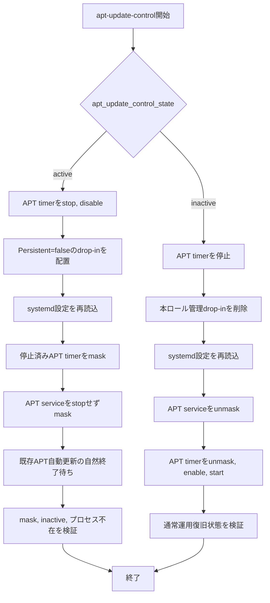

# apt-update-control ロール

APT自動更新の抑止と通常運用復旧を担当するロールです。

## 目次

- [apt-update-control ロール](#apt-update-control-ロール)
  - [目次](#目次)
  - [用語](#用語)
  - [概要](#概要)
  - [前提条件](#前提条件)
  - [実行方法](#実行方法)
  - [主要変数](#主要変数)
    - [vars/all-config.yml](#varsall-configyml)
      - [既定値の利用を推奨する変数](#既定値の利用を推奨する変数)
  - [テンプレートと生成ファイル](#テンプレートと生成ファイル)
  - [実行フロー](#実行フロー)
  - [検証ポイント](#検証ポイント)
    - [検証の前提条件](#検証の前提条件)
    - [検証環境の設定](#検証環境の設定)
    - [検証コマンドと期待結果](#検証コマンドと期待結果)
      - [1. APT自動更新抑止状態の確認](#1-apt自動更新抑止状態の確認)
      - [2. 通常運用復旧状態の確認](#2-通常運用復旧状態の確認)
  - [トラブルシューティング](#トラブルシューティング)
    - [1. APT自動更新の終了待ちで停止する場合](#1-apt自動更新の終了待ちで停止する場合)
    - [2. Playbook異常終了後もAPT自動更新が抑止されたままの場合](#2-playbook異常終了後もapt自動更新が抑止されたままの場合)
  - [注意事項](#注意事項)
  - [参考資料](#参考資料)
    - [公式ドキュメント](#公式ドキュメント)
    - [関連ロール](#関連ロール)


## 用語

| 正式名称 | 略称 | 意味 |
| --- | --- | --- |
| ユーザ | - | 機能を利用する人, 又は識別された利用主体。 |
| ツール | - | 特定作業を実行するための機能や道具。 |
| リソース | - | 処理に必要な計算機資源やデータ。 |
| クラスタ | - | 複数の機器を連携させて一体運用する構成。 |
| ディストリビューション | - | 基本ソフトウェアと関連部品をまとめた配布形態。 |
| コンテナイメージ | - | コンテナ実行に必要な内容をまとめた保存形式。 |
| プログラム | - | 計算機に処理をさせるための命令列。 |
| コミュニティ | - | 共通目的のもとで継続的に活動する利用者集団。 |
| プラグイン | - | 既存機能へ追加機能を組み込むための拡張部品。 |
| サービスアカウント (Service Account) | - | 自動処理中でサービスを呼び出す側のプログラムを識別するための識別情報。 |
| コンテナランタイム | - | コンテナを起動, 停止, 管理する実行基盤。 |
| リクエスト | - | 処理実行や情報取得を要求する操作。 |
| コントローラ | - | 対象状態を監視し, 期待状態へ調整する制御機能。 |
| メタデータ | - | 対象データの属性や説明を示す付加情報。 |
| バックエンド | - | 利用者画面の背後で処理を実行する側。 |
| ストレージ | - | データを保存する仕組み。 |
| インストール | - | ソフトウェアを導入して利用可能にする作業。 |
| マシン | - | 処理を実行する計算機。 |
| プロビジョニング | - | 利用開始に必要な設定や資源を準備する作業。 |
| ルーティング | - | 宛先までの経路を選択して転送する処理。 |
| オブジェクト | - | ひとかたまりとして扱うデータ単位。 |
| エージェント | - | 指示に従って処理を代行する構成要素。 |
| ストア | - | データや成果物を保存する場所。 |
| ジャーナル | - | 時系列の記録を保持する仕組み。 |
| アカウント | - | 利用者や処理主体を識別する登録情報。 |
| エンドポイント | - | 通信の接続先を表す識別点。 |
| パターン | - | 繰り返し現れる構造や記述形式。 |
| パケット | - | ネットワークで転送するデータ単位。 |
| カーネル | - | 基本ソフトウェアの中核機能。 |
| シェル | - | コマンド入力で計算機を操作する仕組み。 |
| Playbook | - | 自動化処理の実行手順を記述したファイル。 |
| Canonical | - | Ubuntu を提供する組織名。 |
| Key-Value | - | キーと値の組で情報を表す方式。 |
| Internet Protocol | IP | ネットワーク上で宛先を識別し, データを届けるための通信手順。 |
| Structured Query Language | SQL | データベースを操作するための記述言語。 |
| Hypertext Transfer Protocol | HTTP | World Wide Webで情報をやり取りする通信手順。 |
| Hypertext Transfer Protocol Secure | HTTPS | 通信内容を暗号化してWorld Wide Web通信を行う方式。 |
| RPM Package Manager | RPM | RPM形式パッケージの導入, 更新, 削除, 情報参照を行う仕組み。 |
| Virtual Machine | VM | 物理計算機上で動作する仮想的な計算機。 |
| localhost | - | 同一機器自身を指す名前。 |
| root | - | Unix 系システムの最上位権限を持つ管理者識別子。 |
| ソフトウェア | - | 情報処理システムで使用するプログラム, 手順, 規則及び関連文書の全体又は一部分。 |
| システム | - | 複数の要素が連携して目的を実現する仕組み全体。 |
| アプリケーション | - | 利用者の目的を実現するために動作するソフトウェア。 |
| パッケージ | - | ソフトウェア導入に必要なファイルをまとめた配布単位。 |
| リポジトリ | - | ソフトウェアや設定情報を保管し, 取得できるようにした管理場所。 |
| コマンド | - | 実行者が計算機へ処理を指示するための命令。 |
| ホスト | - | 管理対象として識別される個別の計算機。 |
| サーバ | - | 他の機器や利用者へ機能やデータを提供する計算機, 又はその役割。 |
| ノード | - | ネットワークに接続された機器または処理単位。 |
| コンテナ | - | アプリケーションを動かす隔離された実行単位。 |
| ネットワーク | - | 機器同士を接続してデータをやり取りする仕組み。 |
| アドレス | - | 宛先や所在を識別するための情報。 |
| プロトコル | - | 通信やデータ交換の手順を定めた取り決め。 |
| ディレクトリ | - | ファイルを階層的に整理するための入れ物。 |
| ログ | - | 処理の結果や状態を時系列で記録した情報。 |
| コード | - | 処理内容を記述した文字列。 |
| Kubernetes | K8s | コンテナを管理する基盤ソフトウェア。 |
| Pod | - | Kubernetes でコンテナをまとめて管理する最小単位。 |
| Linux | - | 多くの機器で使われる, 基本ソフトウェアの系統。 |
| Debian | - | コミュニティ主導で開発される Linux ディストリビューション。 |
| Ubuntu | - | Canonical が提供する Debian 系の Linux ディストリビューション。 |
| Docker | - | コンテナイメージやコンテナの作成, 実行, 管理を行うコマンド。 |
| Ansible | - | 設定の同一化や導入作業を所定の手順に従って自動化する仕組み。 |
| World Wide Web | WWW | ネットワーク上で文書や情報を相互参照できる仕組み。 |
| Service | - | サービスの英語表記。 |
| Node | - | ノードの英語表記。 |
| Makefile | - | 実行手順を定義したファイル。 |
| Application Programming Interface | API | アプリケーション同士が機能やデータをやり取りするための取り決め。 |
| Uniform Resource Locator | URL | World Wide Web上の資源の場所を示す文字列。 |
| Host Variables | host_vars | ホスト単位の設定値を格納する変数定義。 |
| Ansible Inventory | inventory | 実行対象ホストの一覧と接続情報を管理する定義。 |
| Ansible Task | task | 自動化処理の最小単位となる実行項目。 |
| ansible-playbookコマンド | - | Ansible Playbook を実行して自動構成処理を適用するコマンド。 |
| 制御ホスト | - | Playbook を実行し, 他ホストへの処理指示を行う管理用ホスト。 |
| 対象ホスト | - | Playbook による設定変更や導入処理の適用先となるホスト。 |
| Advanced Package Tool | APT | Debian 系のパッケージ管理ツール。 |
| systemd | - | Linux システムの初期化とサービス管理を行う仕組み。 |
| systemd unit | - | systemd が起動, 停止, 時刻指定実行などの対象として管理する設定単位。 |
| systemd service | - | systemd がプログラムの起動と終了を管理する設定単位。 |
| systemd timer | - | systemd が時刻又は経過時間を条件として別の systemd unit を起動する仕組み。 |
| systemd mask | - | systemd のサービスやターゲットを完全に起動できない状態へ設定する操作のこと。通常の disable が自動起動だけを無効にするのに対して, mask は手動起動や他サービスからの起動も防止する。 |
| systemd unmask | - | systemd のサービスやターゲットを起動可能な状態へ設定する操作のこと。systemd mask によって, 手動起動や他サービスからの起動も防止された状態を解除するための操作。 |
| drop-in ファイル | - | 既存の設定本体を直接変更せず, 追加の設定断片として読み込ませる補助設定ファイル。 |
| プロセス | - | 実行中のプログラムを管理する単位。 |
| unattended-upgrades | - | Ubuntu で更新パッケージを自動導入する仕組み。 |
| systemctlコマンド | - | systemd が管理する systemd unit の状態変更や状態確認を行うコマンド。 |
| pgrepコマンド | pgrep | 実行中のプロセスを名前又はコマンド行の条件で検索するコマンド。 |
| GNU Make | Make | Makefile に記載した手順をターゲット名で実行する仕組み。 |
| Makeターゲット | - | Makefile で名前を付けて定義した実行手順。 |
| Ansible Role | role | 関連する Ansible Task, 変数, ファイルを一つの機能単位としてまとめる仕組み。 |

## 概要

`apt-update-control`ロールは, Ubuntu/Debian系ホストでPlaybook実行中のAPT自動更新を抑止し, 構築処理が正常完了した後にディストリビューション既定のAPT自動更新経路へ戻す機能を提供します。

`active`では`apt-daily.timer`と`apt-daily-upgrade.timer`を先に停止して無効化し, `Persistent=false`のdrop-in ファイルを設定してsystemdへ再読込した後にtimerをsystemd maskします。その後, `apt-daily.service`と`apt-daily-upgrade.service`へstop要求を送らずsystemd maskを設定し, 既に開始済みのAPT自動更新は自然終了させます。trigger先serviceをmaskする前にtimerを停止することで, activeなtimerがtrigger先を失ってfailedへ遷移することを防止します。Playbookが途中で異常終了した場合や対象ホストが再起動した場合も, 管理者が明示的に`inactive`を実行するまでAPT自動更新抑止を維持します。

`inactive`では本ロールが設定したsystemd maskとdrop-in ファイルを解除し, APT timerを有効化して起動します。`apt-daily.service`と`apt-daily-upgrade.service`はAPT timerから必要時に起動されるため, 本ロールから直接起動しません。

本ロールは`apt-update-guard`ロールから呼び出されるほか, 個別roleを再適用する場合にMakeターゲットから単独実行できます。

本ロール作成の背景は, [roles/apt-update-guard](../apt-update-guard/Readme.md)を参照ください。

## 前提条件

- Ubuntu/Debian系対象ホストでsystemdが利用可能であること。
- Ubuntu/Debian系対象ホストで`apt-daily.service`, `apt-daily-upgrade.service`, `apt-daily.timer`, `apt-daily-upgrade.timer`が提供されていること。
- `timeout`, `systemctl`, `pgrep`コマンドが利用可能であること。
- `apt_update_control_state`は呼び出し元で`active`又は`inactive`のいずれかを明示すること。

## 実行方法

`site.yml`からは`apt-update-guard`ロールを介して呼び出します。個別roleの再適用前後に本ロールだけを操作する場合は, 制御ホストで次のMakeターゲットを使用します。

```bash
make run_apt_update_control_activate
make run_apt_update_control_deactivate
```

`run_apt_update_control_activate`はAPT自動更新を抑止し, 既に実行中のAPT自動更新が自然終了するまで待ちます。個別roleの再適用中に処理が異常終了した場合は`run_apt_update_control_deactivate`を自動実行せず, systemd maskを維持します。

`run_apt_update_control_deactivate`は, 個別roleの適用が正常完了したことを運用者が確認した後に実行します。

## 主要変数

### vars/all-config.yml

#### 既定値の利用を推奨する変数

| 変数名 | 意味 | 既定値 | 設定例 |
| --- | --- | --- | --- |
| `apt_update_control_command_timeout_seconds` | systemd unit状態確認とプロセス確認の1回のコマンド実行時間を秒単位で指定します。 | `10` | `10` |
| `apt_update_control_wait_retry_count` | 実行中APT自動更新の終了確認を再試行する回数を指定します。 | `360` | `360` |
| `apt_update_control_wait_retry_delay_seconds` | 実行中APT自動更新の終了確認を再試行する間隔を秒単位で指定します。 | `5` | `5` |
| `apt_update_control_service_units` | 実行中の場合は自然終了させ, 構築期間中の新規起動だけをsystemd maskで禁止するAPT serviceを指定します。 | `apt-daily.service`, `apt-daily-upgrade.service` | 既定値を使用 |
| `apt_update_control_timer_units` | `active`時に停止, 無効化, systemd maskを設定し, `inactive`時に有効化して起動するAPT timerを指定します。 | `apt-daily.timer`, `apt-daily-upgrade.timer` | 既定値を使用 |
| `apt_update_control_persistent_dropin_name` | 構築期間中にAPT timerの補完実行を無効化する本ロール専用drop-in ファイル名を指定します。 | `"90-ansible-apt-update-guard.conf"` | `"90-ansible-apt-update-guard.conf"` |

典型的な環境では既定値を使用します。APT自動更新の終了に長時間を要する環境では, 再試行回数又は再試行間隔を増やします。値を小さくし過ぎると, 正常に処理中のAPT自動更新を待ち切れず本ロールが失敗します。

設定例を次に示します。

```yaml
1: apt_update_control_command_timeout_seconds: 10
2: apt_update_control_wait_retry_count: 360
3: apt_update_control_wait_retry_delay_seconds: 5
```

| 行番号 | 設定値 | 有効になる動作 | 補足事項 |
| --- | --- | --- | --- |
| 1 | `apt_update_control_command_timeout_seconds: 10` | 1回の状態確認を10秒で打ち切ります。 | 外部コマンドが復帰しない場合にPlaybook全体が停止することを防止します。 |
| 2 | `apt_update_control_wait_retry_count: 360` | 状態確認を最大360回実行します。 | 小さ過ぎる値では正常なAPT自動更新処理を待ち切れません。 |
| 3 | `apt_update_control_wait_retry_delay_seconds: 5` | 再試行間隔を5秒に設定します。 | 小さ過ぎる値では対象ホストへの状態確認回数が増加します。 |

## テンプレートと生成ファイル

本ロールはJinja2テンプレートを使用しません。`active`時に次のdrop-in ファイルを生成し, `inactive`時に本ロールが生成したファイルだけを削除します。

| 生成ファイル | 生成条件 | 内容 |
| --- | --- | --- |
| `/etc/systemd/system/apt-daily.timer.d/90-ansible-apt-update-guard.conf` | `apt_update_control_state: "active"` | `[Timer]`の`Persistent=false`を設定します。 |
| `/etc/systemd/system/apt-daily-upgrade.timer.d/90-ansible-apt-update-guard.conf` | `apt_update_control_state: "active"` | `[Timer]`の`Persistent=false`を設定します。 |

`files`ディレクトリから対象ホストへ配置するファイルはありません。

## 実行フロー



- `tasks/check-units.yml`は対象systemd unitが提供済み又は本ロールによるsystemd mask状態であることを確認します。
- `tasks/activate.yml`はAPT timerの停止と無効化, drop-in ファイル配置, systemd設定の再読込, APT timerのsystemd mask, APT serviceのsystemd maskの順に実行します。trigger先serviceをmaskする前にtimerを停止することで, timerがtrigger先を失ってfailedへ遷移することを防止します。
- `tasks/wait-running-update.yml`は既に実行中のAPT serviceと`/usr/bin/unattended-upgrade`, `apt.systemd.daily`プロセスの自然終了を待ちます。`unattended-upgrade-shutdown`は更新処理ではないため待機対象に含めません。
- `tasks/verify-active-state.yml`は全対象systemd unitが`masked`かつ`inactive`であり, 関連プロセスが存在しないことを確認します。
- `tasks/deactivate.yml`はdrop-in ファイル削除, systemd mask解除, APT timerの有効化と起動を実行します。
- `tasks/verify-inactive-state.yml`はsystemd maskが解除され, APT timerが`enabled`かつ`active`であることを確認します。

## 検証ポイント

### 検証の前提条件

検証を始める前に, 次の条件が満たされていることを確認します。

- 制御ホストで`Makefile`と`apt-update-control.yml`を利用可能であること。
- Ubuntu/Debian系対象ホストで対象systemd unitが提供されていること。

### 検証環境の設定

本節では, 検証用の設定内容について説明します。

通常は既定値を使用するため, 検証用の`host_vars`又は`vars/all-config.yml`の追加設定は不要です。

### 検証コマンドと期待結果

#### 1. APT自動更新抑止状態の確認

**実施対象ホスト**: Ubuntu/Debian系対象ホスト

**実行するコマンド**:

```bash
systemctl show -p LoadState -p ActiveState apt-daily.service apt-daily-upgrade.service apt-daily.timer apt-daily-upgrade.timer
pgrep -af '/usr/bin/unattended-upgrade([[:space:]]|$)'
pgrep -af '/usr/lib/apt/apt\.systemd\.daily([[:space:]]|$)'
```

**期待される出力**:

4つのsystemd unitで`LoadState=masked`と`ActiveState=inactive`が表示されます。2つの`pgrep`コマンドは該当プロセスを表示せず終了状態1となります。

**実行結果の例**:

```bash
$ systemctl show -p LoadState -p ActiveState apt-daily.timer
LoadState=masked
ActiveState=inactive
```

**確認ポイント**:

- `LoadState=masked`であることで, 再起動後も新しいAPT自動更新を起動できない状態であることを確認します。
- `ActiveState=inactive`であることで, mask設定前から実行中だったAPT自動更新が終了済みであることを確認します。
- `pgrep`が該当プロセスを表示しないことで, `/usr/bin/unattended-upgrade`と`apt.systemd.daily`が残存していないことを確認します。

#### 2. 通常運用復旧状態の確認

**実施対象ホスト**: Ubuntu/Debian系対象ホスト

**実行するコマンド**:

```bash
systemctl show -p LoadState apt-daily.service apt-daily-upgrade.service apt-daily.timer apt-daily-upgrade.timer
systemctl is-enabled apt-daily.timer
systemctl is-active apt-daily.timer
systemctl is-enabled apt-daily-upgrade.timer
systemctl is-active apt-daily-upgrade.timer
```

**期待される出力**:

4つのsystemd unitで`LoadState=loaded`が表示され, 2つのAPT timerで`enabled`と`active`が表示されます。

**実行結果の例**:

```bash
$ systemctl is-enabled apt-daily.timer
enabled
$ systemctl is-active apt-daily.timer
active
```

**確認ポイント**:

- `LoadState=loaded`であることで, 本ロールによるsystemd maskが解除されていることを確認します。
- APT timerが`enabled`かつ`active`であることで, ディストリビューション既定のAPT自動更新経路へ復旧していることを確認します。

## トラブルシューティング

### 1. APT自動更新の終了待ちで停止する場合

**実施対象ホスト**: Ubuntu/Debian系対象ホスト

**実行するコマンド**:

```bash
systemctl status apt-daily.service apt-daily-upgrade.service --no-pager
pgrep -af '/usr/bin/unattended-upgrade([[:space:]]|$)'
pgrep -af '/usr/lib/apt/apt\.systemd\.daily([[:space:]]|$)'
```

**確認ポイント**:

- `systemctl status`の出力から実行中又は失敗状態のsystemd serviceを確認します。
- `pgrep`の出力から`/usr/bin/unattended-upgrade`と`apt.systemd.daily`だけが終了待ち対象となり, `unattended-upgrade-shutdown`が対象外であることを確認します。
- 本ロールは実行中のAPT serviceへstop要求を送らないため, 処理内容を確認して自然終了を待ちます。

### 2. Playbook異常終了後もAPT自動更新が抑止されたままの場合

**実施対象ホスト**: 制御ホスト

**実行するコマンド**:

```bash
make run_apt_update_control_activate
```

**確認ポイント**:

- 異常終了後にsystemd maskが残ることは意図した動作です。
- 作業を再開する前に`run_apt_update_control_activate`を再実行し, 抑止状態を再確認します。
- 構築処理が正常完了した後だけ`make run_apt_update_control_deactivate`を実行します。

## 注意事項

- `active`は実行中の`apt-daily.service`又は`apt-daily-upgrade.service`を強制停止しません。現在の処理を自然終了させてから成功します。
- systemd maskは永続設定として`/etc/systemd/system`へ反映されるため, Playbook異常終了又は対象ホスト再起動後も`inactive`を実行するまで維持されます。
- `inactive`は正常な構築完了後だけ実行します。障害発生時に自動解除しません。
- 本ロールはAPTロックファイル全般の解放待ちや対象ホストの再起動を実施しません。`site.yml`全体では`apt-update-guard`ロールがこれらを担当します。
- `apt-update-control.yml`とMakeターゲットを使用した個別role再適用では, `active`と`inactive`の実行判断は運用者が行います。

## 参考資料

### 公式ドキュメント

- [Ansible公式文書](https://docs.ansible.com/ansible/latest/index.html)
- [ansible.builtin.systemd module](https://docs.ansible.com/ansible/latest/collections/ansible/builtin/systemd_module.html)
- [systemctl](https://www.freedesktop.org/software/systemd/man/latest/systemctl.html)
- [systemd.timer](https://www.freedesktop.org/software/systemd/man/latest/systemd.timer.html)
- [systemd.unit](https://www.freedesktop.org/software/systemd/man/latest/systemd.unit.html)
- [Ubuntu自動セキュリティ更新](https://documentation.ubuntu.com/security/security-updates/)
- [pgrep](https://man7.org/linux/man-pages/man1/pgrep.1.html)
- [GNU Make](https://www.gnu.org/software/make/manual/make.html)

### 関連ロール

- [roles/apt-update-guard](../apt-update-guard/Readme.md): `site.yml`実行期間全体のAPT自動更新抑止, APTロック確認, 共通再起動処理を担当します。
