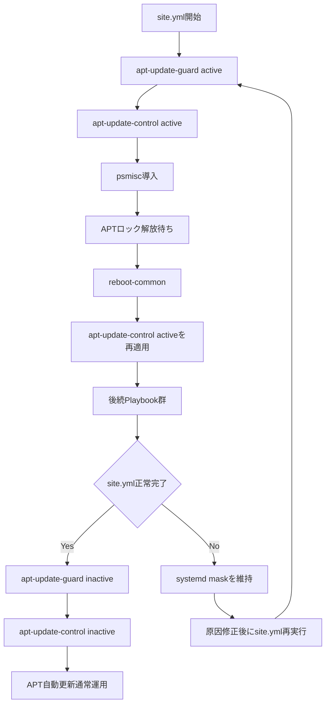

# apt-update-guard ロール

本ロールは, `site.yml`実行中のAPT自動更新との競合を防止し, Playbook全体の安定動作を支援するための共通ロールです。

## 目次

- [apt-update-guard ロール](#apt-update-guard-ロール)
  - [目次](#目次)
  - [用語](#用語)
  - [概要](#概要)
    - [本ロール作成の背景](#本ロール作成の背景)
  - [前提条件](#前提条件)
  - [実行方法](#実行方法)
  - [主要変数](#主要変数)
    - [vars/all-config.yml](#varsall-configyml)
      - [既定値の利用を推奨する変数](#既定値の利用を推奨する変数)
  - [テンプレートと生成ファイル](#テンプレートと生成ファイル)
  - [実行フロー](#実行フロー)
    - [`active`時の処理](#active時の処理)
    - [`inactive`時の処理](#inactive時の処理)
  - [検証ポイント](#検証ポイント)
    - [検証の前提条件](#検証の前提条件)
    - [検証環境の設定](#検証環境の設定)
    - [検証コマンドと期待結果](#検証コマンドと期待結果)
      - [1. `active`状態のAPT自動更新抑止確認](#1-active状態のapt自動更新抑止確認)
      - [2. `inactive`状態の通常運用復旧確認](#2-inactive状態の通常運用復旧確認)
  - [トラブルシューティング](#トラブルシューティング)
    - [1. Playbook失敗後にAPT自動更新が抑止されたままの場合](#1-playbook失敗後にapt自動更新が抑止されたままの場合)
    - [2. APTロック解放待ちで停止する場合](#2-aptロック解放待ちで停止する場合)
  - [注意事項](#注意事項)
  - [参考資料](#参考資料)
    - [公式ドキュメント](#公式ドキュメント)
    - [関連ロール](#関連ロール)

## 用語

| 正式名称 | 略称 | 意味 |
| --- | --- | --- |
| ユーザ | - | 機能を利用する人, 又は識別された利用主体。 |
| ツール | - | 特定作業を実行するための機能や道具。 |
| リソース | - | 処理に必要な計算機資源やデータ。 |
| クラスタ | - | 複数の機器を連携させて一体運用する構成。 |
| ディストリビューション | - | 基本ソフトウェアと関連部品をまとめた配布形態。 |
| コンテナイメージ | - | コンテナ実行に必要な内容をまとめた保存形式。 |
| プログラム | - | 計算機に処理をさせるための命令列。 |
| コミュニティ | - | 共通目的のもとで継続的に活動する利用者集団。 |
| プラグイン | - | 既存機能へ追加機能を組み込むための拡張部品。 |
| サービスアカウント (Service Account) | - | 自動処理中でサービスを呼び出す側のプログラムを識別するための識別情報。 |
| コンテナランタイム | - | コンテナを起動, 停止, 管理する実行基盤。 |
| リクエスト | - | 処理実行や情報取得を要求する操作。 |
| コントローラ | - | 対象状態を監視し, 期待状態へ調整する制御機能。 |
| メタデータ | - | 対象データの属性や説明を示す付加情報。 |
| バックエンド | - | 利用者画面の背後で処理を実行する側。 |
| ストレージ | - | データを保存する仕組み。 |
| インストール | - | ソフトウェアを導入して利用可能にする作業。 |
| マシン | - | 処理を実行する計算機。 |
| プロビジョニング | - | 利用開始に必要な設定や資源を準備する作業。 |
| ルーティング | - | 宛先までの経路を選択して転送する処理。 |
| オブジェクト | - | ひとかたまりとして扱うデータ単位。 |
| エージェント | - | 指示に従って処理を代行する構成要素。 |
| ストア | - | データや成果物を保存する場所。 |
| ジャーナル | - | 時系列の記録を保持する仕組み。 |
| アカウント | - | 利用者や処理主体を識別する登録情報。 |
| エンドポイント | - | 通信の接続先を表す識別点。 |
| パターン | - | 繰り返し現れる構造や記述形式。 |
| パケット | - | ネットワークで転送するデータ単位。 |
| カーネル | - | 基本ソフトウェアの中核機能。 |
| シェル | - | コマンド入力で計算機を操作する仕組み。 |
| Playbook | - | 自動化処理の実行手順を記述したファイル。 |
| Canonical | - | Ubuntu を提供する組織名。 |
| Key-Value | - | キーと値の組で情報を表す方式。 |
| Internet Protocol | IP | ネットワーク上で宛先を識別し, データを届けるための通信手順。 |
| Structured Query Language | SQL | データベースを操作するための記述言語。 |
| Hypertext Transfer Protocol | HTTP | World Wide Webで情報をやり取りする通信手順。 |
| Hypertext Transfer Protocol Secure | HTTPS | 通信内容を暗号化してWorld Wide Web通信を行う方式。 |
| RPM Package Manager | RPM | RPM形式パッケージの導入, 更新, 削除, 情報参照を行う仕組み。 |
| Virtual Machine | VM | 物理計算機上で動作する仮想的な計算機。 |
| localhost | - | 同一機器自身を指す名前。 |
| root | - | Unix 系システムの最上位権限を持つ管理者識別子。 |
| ソフトウェア | - | 情報処理システムで使用するプログラム, 手順, 規則及び関連文書の全体又は一部分。 |
| システム | - | 複数の要素が連携して目的を実現する仕組み全体。 |
| アプリケーション | - | 利用者の目的を実現するために動作するソフトウェア。 |
| パッケージ | - | ソフトウェア導入に必要なファイルをまとめた配布単位。 |
| リポジトリ | - | ソフトウェアや設定情報を保管し, 取得できるようにした管理場所。 |
| コマンド | - | 実行者が計算機へ処理を指示するための命令。 |
| ホスト | - | 管理対象として識別される個別の計算機。 |
| サーバ | - | 他の機器や利用者へ機能やデータを提供する計算機, 又はその役割。 |
| ノード | - | ネットワークに接続された機器または処理単位。 |
| コンテナ | - | アプリケーションを動かす隔離された実行単位。 |
| ネットワーク | - | 機器同士を接続してデータをやり取りする仕組み。 |
| アドレス | - | 宛先や所在を識別するための情報。 |
| プロトコル | - | 通信やデータ交換の手順を定めた取り決め。 |
| ディレクトリ | - | ファイルを階層的に整理するための入れ物。 |
| ログ | - | 処理の結果や状態を時系列で記録した情報。 |
| コード | - | 処理内容を記述した文字列。 |
| Kubernetes | K8s | コンテナを管理する基盤ソフトウェア。 |
| Pod | - | Kubernetes でコンテナをまとめて管理する最小単位。 |
| Linux | - | 多くの機器で使われる, 基本ソフトウェアの系統。 |
| Debian | - | コミュニティ主導で開発される Linux ディストリビューション。 |
| Ubuntu | - | Canonical が提供する Debian 系の Linux ディストリビューション。 |
| Docker | - | コンテナイメージやコンテナの作成, 実行, 管理を行うコマンド。 |
| Ansible | - | 設定の同一化や導入作業を所定の手順に従って自動化する仕組み。 |
| World Wide Web | WWW | ネットワーク上で文書や情報を相互参照できる仕組み。 |
| Service | - | サービスの英語表記。 |
| Node | - | ノードの英語表記。 |
| Makefile | - | 実行手順を定義したファイル。 |
| Application Programming Interface | API | アプリケーション同士が機能やデータをやり取りするための取り決め。 |
| Uniform Resource Locator | URL | World Wide Web上の資源の場所を示す文字列。 |
| Host Variables | host_vars | ホスト単位の設定値を格納する変数定義。 |
| Ansible Inventory | inventory | 実行対象ホストの一覧と接続情報を管理する定義。 |
| Ansible Task | task | 自動化処理の最小単位となる実行項目。 |
| ansible-playbookコマンド | - | Ansible Playbook を実行して自動構成処理を適用するコマンド。 |
| 制御ホスト | - | Playbook を実行し, 他ホストへの処理指示を行う管理用ホスト。 |
| 対象ホスト | - | Playbook による設定変更や導入処理の適用先となるホスト。 |
| Advanced Package Tool | APT | Debian 系のパッケージ管理ツール。 |
| Red Hat Enterprise Linux | RHEL | Red Hatが提供する企業向けLinuxディストリビューション。 |
| systemd | - | Linux システムの初期化とサービス管理を行う仕組み。 |
| systemd unit | - | systemd が起動, 停止, 時刻指定実行などの対象として管理する設定単位。 |
| systemd timer | - | systemd が時刻又は経過時間を条件として別の systemd unit を起動する仕組み。 |
| systemd mask | - | systemd のサービスやターゲットを完全に起動できない状態へ設定する操作のこと。通常の disable が自動起動だけを無効にするのに対して, mask は手動起動や他サービスからの起動も防止する。 |
| systemd unmask | - | systemd のサービスやターゲットを起動可能な状態へ設定する操作のこと。systemd mask によって, 手動起動や他サービスからの起動も防止された状態を解除するための操作。 |
| drop-in ファイル | - | 既存の設定本体を直接変更せず, 追加の設定断片として読み込ませる補助設定ファイル。 |
| Multicast DNS | mDNS | 同一ネットワーク内の名前解決方式。 |
| Avahi | - | Linux で mDNS と DNS-SD を提供するソフトウェア。 |
| NetworkManager | - | RHEL 系でネットワークを管理するサービス。 |
| netplan | - | Debian/Ubuntu 系でネットワーク設定を生成する仕組み。 |
| Ansible Handler | handler | 設定変更時など特定条件でのみ実行する後続処理。 |
| プロセス | - | 実行中のプログラムを管理する単位。 |
| unattended-upgrades | - | Ubuntu で更新パッケージを自動導入する仕組み。 |
| APTロック | - | APT又は関連処理が同時更新を防止するために使用する排他制御用ファイル。 |
| systemctlコマンド | - | systemdが管理するサービスの状態を確認するコマンド。 |
| journalctlコマンド | journalctl | サービスが記録したログを確認するコマンド。 |
| pgrepコマンド | pgrep | 実行中のプロセスを名前などの条件で検索するコマンド。 |
| fuserコマンド | fuser | ファイルを使用しているプロセスを確認するコマンド。 |

## 概要

`apt-update-guard`ロールは, `site.yml`全体の構築期間中にAPT自動更新が割り込むことを防止する高位制御を提供します。APT systemd unitのsystemd mask, APT timerの停止と復旧, 実行中APT自動更新の自然終了待ちは`apt-update-control`ロールへ委譲します。

`active`では`apt-update-control`を実行した後にAPTロック解放を確認し, `reboot-common`ロールへ再起動を委譲します。再起動後に`apt-update-control`を再適用してsystemd maskが維持されていることを確認します。`site.yml`が途中で異常終了した場合は最終`inactive`処理へ到達しないため, systemd maskを維持します。

`inactive`は`site.yml`が最終playまで正常完了した場合だけ実行し, `apt-update-control`へディストリビューション既定のAPT自動更新運用への復旧を委譲します。

### 本ロール作成の背景

実行中の`apt-daily-upgrade.service`へstop要求を送った後も`unattended-upgr`と`apt.systemd.daily`が残存し, systemd関連パッケージ更新に伴うsystemd再実行と`systemd-networkd`再起動が発生することがあります。この時, AvahiのmDNS名競合が発生し, ホスト名が`-2.local`へ変更されることがあります。

本現象が発生すると, `inventory/hosts`に記載されたホスト名での接続が不可能となり, playbookが中断される問題が発生します。

この問題を解決するために, 本ロールでは, `apt-update-control`ロールを用いて, APT serviceへstop要求を送らず, systemd maskで新しいactivationだけを禁止し, 既存APT自動更新を自然終了させます。

上記処理終了後にAPTロック解放を確認してから再起動へ進むよう制御することで, 上記の問題が発生しないようするしています。

## 前提条件

- `site.yml`が対象ホストのfactsを取得済みであること。
- Ubuntu/Debian系ホストでsystemdが利用可能であること。
- `apt-update-control`ロールが利用可能であること。
- `reboot-common`ロールが利用可能であること。
- `apt_update_guard_state`は呼び出し元で`active`又は`inactive`のいずれかを明示すること。

## 実行方法

本ロールは`site.yml`から2回呼び出します。

- `site.yml`開始時に`apt_update_guard_state: "active"`を指定し, 構築期間中のAPT自動更新抑止を確立します。
- `site.yml`最終playで`apt_update_guard_state: "inactive"`を指定し, 全構築処理が正常完了した場合だけディストリビューション既定のAPT自動更新運用へ戻します。

`site.yml`が途中で異常終了した場合は`inactive`を実行しません。原因を修正して`site.yml`を再実行すると, 冒頭の`active`で既存systemd maskを再適用し, 抑止状態を再確認します。

個別roleの再適用前後にAPT自動更新制御だけを操作する場合は, `apt-update-control`ロール用Makeターゲットを使用します。

```bash
make run_apt_update_control_activate
make run_apt_update_control_deactivate
```

## 主要変数

### vars/all-config.yml

#### 既定値の利用を推奨する変数

| 変数名 | 意味 | 既定値 | 設定例 |
| --- | --- | --- | --- |
| `apt_update_guard_wait_timeout_seconds` | APTロック解放待ちの最大時間を秒単位で指定します。 | `1800` | `1800` |
| `apt_update_guard_wait_interval_seconds` | APTロック解放待ちの確認間隔を秒単位で指定します。 | `5` | `5` |
| `apt_update_guard_command_timeout_seconds` | `fuser`コマンド1回の実行時間を秒単位で制限します。 | `10` | `10` |
| `apt_update_guard_lock_files` | APTロック解放確認対象を指定します。 | `/var/lib/dpkg/lock-frontend`, `/var/lib/dpkg/lock`, `/var/cache/apt/archives/lock`, `/var/lib/apt/lists/lock` | 既定値を使用 |
| `apt_update_guard_reboot_timeout_seconds` | guard確立時に`reboot-common`へ渡す再起動完了待ち時間を秒単位で指定します。 | `reboot_timeout_sec`, 未定義又は空の場合`600` | `600` |

典型的な環境では既定値を使用します。APTロック保持処理が長時間継続する環境では, `apt_update_guard_wait_timeout_seconds`を増やします。

設定例を次に示します。

```yaml
1: apt_update_guard_wait_timeout_seconds: 1800
2: apt_update_guard_wait_interval_seconds: 5
3: apt_update_guard_command_timeout_seconds: 10
4: apt_update_guard_reboot_timeout_seconds: 600
```

| 行番号 | 設定値 | 有効になる動作 | 補足事項 |
| --- | --- | --- | --- |
| 1 | `apt_update_guard_wait_timeout_seconds: 1800` | APTロック解放を最大1800秒の範囲で待機します。 | 小さ過ぎる値では正常なAPT処理の終了を待ち切れません。 |
| 2 | `apt_update_guard_wait_interval_seconds: 5` | APTロック状態を5秒間隔で再確認します。 | 小さ過ぎる値では確認回数が増加します。 |
| 3 | `apt_update_guard_command_timeout_seconds: 10` | `fuser`コマンド1回を10秒で打ち切ります。 | コマンドが復帰しない場合にPlaybook全体が停止することを防止します。 |
| 4 | `apt_update_guard_reboot_timeout_seconds: 600` | guard確立用再起動を最大600秒待機します。 | 小さ過ぎる値では正常な再起動を待ち切れません。 |

`apt-update-control`ロールの待機回数, 待機間隔, systemd unit一覧は`apt-update-control`ロールの主要変数を使用します。

## テンプレートと生成ファイル

本ロール自身はテンプレート, `files`ディレクトリ由来ファイル, systemd drop-in ファイルを生成しません。APT timer用drop-in ファイルは`apt-update-control`ロールが管理します。

## 実行フロー



- `tasks/activate.yml`は`apt-update-control`へAPT自動更新抑止を委譲し, APTロック解放確認, `reboot-common`, 再起動後の抑止再適用を実行します。
- `tasks/deactivate.yml`は正常完了時のAPT自動更新復旧を`apt-update-control`へ委譲します。
- `apt-update-control`ロールはsystemd maskとAPT timer停止, 実行中APT自動更新の自然終了待ち, 通常運用復旧を担当します。
- `reboot-common`ロールはguard確立後の共通再起動と接続再確立を担当します。

### `active`時の処理

1. `apt-update-control`ロールを`active`で実行し, APT自動更新unitのsystemd mask, APT timer停止, 実行中APT自動更新の自然終了待ちを実行します。
2. `psmisc`を導入し, `fuser`でAPTロックが解放されていることを確認します。
3. `reboot-common`ロールへ再起動を委譲します。同一Ansible実行中は1回だけ実行します。
4. 再起動後に`apt-update-control`ロールを再度`active`で実行し, persistentなsystemd maskが維持されていることを確認します。
5. `apt_update_guard_active: true`を実行時factとして記録します。

### `inactive`時の処理

1. `apt-update-control`ロールを`inactive`で実行し, 本ロール群が設定したsystemd maskとdrop-in ファイルを解除します。
2. `apt-daily.timer`と`apt-daily-upgrade.timer`を有効化して起動し, ディストリビューション既定のAPT自動更新経路へ戻します。
3. `apt_update_guard_active`と`apt_update_guard_reboot_done`を`false`へ戻します。

## 検証ポイント

### 検証の前提条件

検証を始める前に, 次の条件が満たされていることを確認します。

- `site.yml`を実行可能な制御ホストであること。
- Ubuntu/Debian系対象ホストで`apt-update-control`ロールの対象systemd unitが利用可能であること。
- `reboot-common`ロールが利用可能であること。

### 検証環境の設定

本節では, 検証用の設定内容について説明します。

通常は既定値を使用するため, 検証用の`host_vars`又は`vars/all-config.yml`の追加設定は不要です。

### 検証コマンドと期待結果

#### 1. `active`状態のAPT自動更新抑止確認

**実施対象ホスト**: Ubuntu/Debian系対象ホスト

**実行するコマンド**:

```bash
systemctl show -p LoadState -p ActiveState apt-daily.service apt-daily-upgrade.service apt-daily.timer apt-daily-upgrade.timer
pgrep -a unattended-upgr
pgrep -af '/usr/lib/apt/apt\.systemd\.daily([[:space:]]|$)'
fuser /var/lib/dpkg/lock-frontend /var/lib/dpkg/lock /var/cache/apt/archives/lock /var/lib/apt/lists/lock
```

**期待される出力**:

4つのAPT systemd unitで`LoadState=masked`と`ActiveState=inactive`が表示されます。`pgrep`と`fuser`は対象を表示せず終了します。

**実行結果の例**:

```bash
$ systemctl show -p LoadState -p ActiveState apt-daily-upgrade.service
LoadState=masked
ActiveState=inactive
```

**確認ポイント**:

- `LoadState=masked`と`ActiveState=inactive`により, APT自動更新が再起動を跨いでも起動不能であり, 既存更新処理も終了済みであることを確認します。
- `pgrep`と`fuser`が対象を表示しないことで, APT自動更新プロセスとAPTロック保持者が残存していないことを確認します。

#### 2. `inactive`状態の通常運用復旧確認

**実施対象ホスト**: Ubuntu/Debian系対象ホスト

**実行するコマンド**:

```bash
systemctl show -p LoadState apt-daily.service apt-daily-upgrade.service apt-daily.timer apt-daily-upgrade.timer
systemctl is-enabled apt-daily.timer
systemctl is-active apt-daily.timer
systemctl is-enabled apt-daily-upgrade.timer
systemctl is-active apt-daily-upgrade.timer
```

**期待される出力**:

4つのAPT systemd unitで`LoadState=loaded`が表示され, 2つのAPT timerで`enabled`と`active`が表示されます。

**実行結果の例**:

```bash
$ systemctl is-enabled apt-daily-upgrade.timer
enabled
$ systemctl is-active apt-daily-upgrade.timer
active
```

**確認ポイント**:

- systemd maskが解除されていることで, 通常のAPT自動更新起動経路へ戻っていることを確認します。
- APT timerが`enabled`かつ`active`であることで, 正常完了後の通常運用復旧を確認します。

## トラブルシューティング

### 1. Playbook失敗後にAPT自動更新が抑止されたままの場合

**実施対象ホスト**: 制御ホスト

**実行するコマンド**:

```bash
make run_apt_update_control_activate
```

**確認ポイント**:

- `site.yml`途中失敗時は最終`inactive`へ到達しないため, systemd maskが残ることは意図した動作です。
- 原因修正後に`site.yml`を再実行する場合は, 冒頭の`active`がsystemd maskを再適用して状態を再確認します。
- 個別roleだけを再適用する場合は, 作業前に`make run_apt_update_control_activate`を実行します。

### 2. APTロック解放待ちで停止する場合

**実施対象ホスト**: Ubuntu/Debian系対象ホスト

**実行するコマンド**:

```bash
fuser /var/lib/dpkg/lock-frontend /var/lib/dpkg/lock /var/cache/apt/archives/lock /var/lib/apt/lists/lock
```

**確認ポイント**:

- `fuser`がプロセス番号を表示する場合は, APT自動更新以外のAPT又はdpkg処理を含むロック保持者が存在することを確認します。
- ロック保持処理の原因を確認し, 強制終了せず正常終了後にPlaybookを再実行します。

## 注意事項

- 本ロールは`site.yml`開始時と正常終了時に対で呼び出すことを前提とします。
- `site.yml`途中失敗時にsystemd maskを解除する後処理は実行しません。異常終了後もAPT自動更新抑止を維持することが仕様です。
- `active`時の再起動は同一Ansible実行中に1回だけ実施し, `reboot-common`へ処理を委譲します。`site.yml`を別のAnsible実行として再実行した場合は再度実行されます。
- 個別role再適用時は`apt-update-control`用Makeターゲットを運用者が明示的に実行します。
- mDNS自己登録問題への対処としてAvahi設定を変更しません。今回確認した原因であるAPT自動更新制御の方式だけを変更します。

## 参考資料

### 公式ドキュメント

- [Ansible公式文書](https://docs.ansible.com/ansible/latest/index.html)
- [Ansible include_role module](https://docs.ansible.com/ansible/latest/collections/ansible/builtin/include_role_module.html)
- [Ansible systemd module](https://docs.ansible.com/ansible/latest/collections/ansible/builtin/systemd_module.html)
- [Ansible reboot module](https://docs.ansible.com/ansible/latest/collections/ansible/builtin/reboot_module.html)
- [Ubuntu自動セキュリティ更新](https://documentation.ubuntu.com/security/security-updates/)
- [systemctl](https://www.freedesktop.org/software/systemd/man/latest/systemctl.html)
- [systemd.timer](https://www.freedesktop.org/software/systemd/man/latest/systemd.timer.html)
- [systemd.unit](https://www.freedesktop.org/software/systemd/man/latest/systemd.unit.html)

### 関連ロール

- [apt-update-controlロール](../apt-update-control/Readme.md): APT systemd unitのsystemd mask, APT timer停止と復旧, 実行中APT自動更新の自然終了待ちを担当します。
- [commonロール](../common/Readme.md): 静的ネットワーク設定, Avahi導入, ネットワーク設定反映とAvahi再起動順序を説明します。
- [reboot-commonロール](../reboot-common/Readme.md): 本ロールから委譲する共通再起動処理を説明します。
