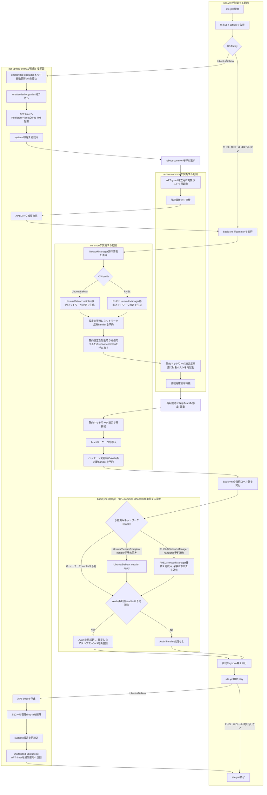

# apt-update-guard ロール

本ロールは, `site.yml`実行中のAPT自動更新との競合を防止し, Playbook全体の安定動作を支援するための共通ロールです。

## 目次

- [apt-update-guard ロール](#apt-update-guard-ロール)
  - [目次](#目次)
  - [用語](#用語)
  - [概要](#概要)
  - [前提条件](#前提条件)
  - [実行方法](#実行方法)
  - [主要変数](#主要変数)
  - [テンプレートと生成ファイル](#テンプレートと生成ファイル)
  - [実行フロー](#実行フロー)
    - [`active`時の処理](#active時の処理)
    - [`inactive`時の処理](#inactive時の処理)
    - [mDNS自己登録問題との関係](#mdns自己登録問題との関係)
  - [検証ポイント](#検証ポイント)
    - [検証の前提条件](#検証の前提条件)
    - [検証環境の設定](#検証環境の設定)
    - [検証コマンドと期待結果](#検証コマンドと期待結果)
      - [1. `active`状態のAPT自動更新抑止確認](#1-active状態のapt自動更新抑止確認)
      - [2. `inactive`状態の通常運用復旧確認](#2-inactive状態の通常運用復旧確認)
      - [3. RHEL系で本ロールが実行されないことの確認](#3-rhel系で本ロールが実行されないことの確認)
  - [トラブルシューティング](#トラブルシューティング)
    - [1. Playbook失敗後にAPT自動更新が停止したままの場合](#1-playbook失敗後にapt自動更新が停止したままの場合)
    - [2. unattended-upgrades終了待ちで停止する場合](#2-unattended-upgrades終了待ちで停止する場合)
    - [3. APTロック解放待ちで停止する場合](#3-aptロック解放待ちで停止する場合)
  - [注意事項](#注意事項)
  - [参考資料](#参考資料)
    - [公式ドキュメント](#公式ドキュメント)
    - [関連ロール](#関連ロール)

## 用語

| 正式名称 | 略称 | 意味 |
| --- | --- | --- |
| ユーザ | - | 機能を利用する人, 又は識別された利用主体。 |
| ツール | - | 特定作業を実行するための機能や道具。 |
| リソース | - | 処理に必要な計算機資源やデータ。 |
| クラスタ | - | 複数の機器を連携させて一体運用する構成。 |
| ディストリビューション | - | 基本ソフトウェアと関連部品をまとめた配布形態。 |
| コンテナイメージ | - | コンテナ実行に必要な内容をまとめた保存形式。 |
| プログラム | - | 計算機に処理をさせるための命令列。 |
| コミュニティ | - | 共通目的のもとで継続的に活動する利用者集団。 |
| プラグイン | - | 既存機能へ追加機能を組み込むための拡張部品。 |
| サービスアカウント (Service Account) | - | 自動処理中でサービスを呼び出す側のプログラムを識別するための識別情報。 |
| コンテナランタイム | - | コンテナを起動, 停止, 管理する実行基盤。 |
| リクエスト | - | 処理実行や情報取得を要求する操作。 |
| コントローラ | - | 対象状態を監視し, 期待状態へ調整する制御機能。 |
| メタデータ | - | 対象データの属性や説明を示す付加情報。 |
| バックエンド | - | 利用者画面の背後で処理を実行する側。 |
| ストレージ | - | データを保存する仕組み。 |
| インストール | - | ソフトウェアを導入して利用可能にする作業。 |
| マシン | - | 処理を実行する計算機。 |
| プロビジョニング | - | 利用開始に必要な設定や資源を準備する作業。 |
| ルーティング | - | 宛先までの経路を選択して転送する処理。 |
| オブジェクト | - | ひとかたまりとして扱うデータ単位。 |
| エージェント | - | 指示に従って処理を代行する構成要素。 |
| ストア | - | データや成果物を保存する場所。 |
| ジャーナル | - | 時系列の記録を保持する仕組み。 |
| アカウント | - | 利用者や処理主体を識別する登録情報。 |
| エンドポイント | - | 通信の接続先を表す識別点。 |
| パターン | - | 繰り返し現れる構造や記述形式。 |
| パケット | - | ネットワークで転送するデータ単位。 |
| カーネル | - | 基本ソフトウェアの中核機能。 |
| シェル | - | コマンド入力で計算機を操作する仕組み。 |
| Playbook | - | 自動化処理の実行手順を記述したファイル。 |
| Canonical | - | Ubuntu を提供する組織名。 |
| Key-Value | - | キーと値の組で情報を表す方式。 |
| Internet Protocol | IP | ネットワーク上で宛先を識別し, データを届けるための通信手順。 |
| Structured Query Language | SQL | データベースを操作するための記述言語。 |
| Hypertext Transfer Protocol | HTTP | World Wide Webで情報をやり取りする通信手順。 |
| Hypertext Transfer Protocol Secure | HTTPS | 通信内容を暗号化してWorld Wide Web通信を行う方式。 |
| RPM Package Manager | RPM | RPM形式パッケージの導入, 更新, 削除, 情報参照を行う仕組み。 |
| Virtual Machine | VM | 物理計算機上で動作する仮想的な計算機。 |
| localhost | - | 同一機器自身を指す名前。 |
| root | - | Unix 系システムの最上位権限を持つ管理者識別子。 |
| ソフトウェア | - | 情報処理システムで使用するプログラム, 手順, 規則及び関連文書の全体又は一部分。 |
| システム | - | 複数の要素が連携して目的を実現する仕組み全体。 |
| アプリケーション | - | 利用者の目的を実現するために動作するソフトウェア。 |
| パッケージ | - | ソフトウェア導入に必要なファイルをまとめた配布単位。 |
| リポジトリ | - | ソフトウェアや設定情報を保管し, 取得できるようにした管理場所。 |
| コマンド | - | 実行者が計算機へ処理を指示するための命令。 |
| ホスト | - | 管理対象として識別される個別の計算機。 |
| サーバ | - | 他の機器や利用者へ機能やデータを提供する計算機, 又はその役割。 |
| ノード | - | ネットワークに接続された機器または処理単位。 |
| コンテナ | - | アプリケーションを動かす隔離された実行単位。 |
| ネットワーク | - | 機器同士を接続してデータをやり取りする仕組み。 |
| アドレス | - | 宛先や所在を識別するための情報。 |
| プロトコル | - | 通信やデータ交換の手順を定めた取り決め。 |
| ディレクトリ | - | ファイルを階層的に整理するための入れ物。 |
| ログ | - | 処理の結果や状態を時系列で記録した情報。 |
| コード | - | 処理内容を記述した文字列。 |
| Kubernetes | K8s | コンテナを管理する基盤ソフトウェア。 |
| Pod | - | Kubernetes でコンテナをまとめて管理する最小単位。 |
| Linux | - | 多くの機器で使われる, 基本ソフトウェアの系統。 |
| Debian | - | コミュニティ主導で開発される Linux ディストリビューション。 |
| Ubuntu | - | Canonical が提供する Debian 系の Linux ディストリビューション。 |
| Docker | - | コンテナイメージやコンテナの作成, 実行, 管理を行うコマンド。 |
| Ansible | - | 設定の同一化や導入作業を所定の手順に従って自動化する仕組み。 |
| World Wide Web | WWW | ネットワーク上で文書や情報を相互参照できる仕組み。 |
| Service | - | サービスの英語表記。 |
| Node | - | ノードの英語表記。 |
| Makefile | - | 実行手順を定義したファイル。 |
| Application Programming Interface | API | アプリケーション同士が機能やデータをやり取りするための取り決め。 |
| Uniform Resource Locator | URL | World Wide Web上の資源の場所を示す文字列。 |
| Host Variables | host_vars | ホスト単位の設定値を格納する変数定義。 |
| Ansible Inventory | inventory | 実行対象ホストの一覧と接続情報を管理する定義。 |
| Ansible Task | task | 自動化処理の最小単位となる実行項目。 |
| ansible-playbookコマンド | - | Ansible Playbook を実行して自動構成処理を適用するコマンド。 |
| 制御ホスト | - | Playbook を実行し, 他ホストへの処理指示を行う管理用ホスト。 |
| 対象ホスト | - | Playbook による設定変更や導入処理の適用先となるホスト。 |
| Advanced Package Tool | APT | Debian 系のパッケージ管理ツール。 |
| Red Hat Enterprise Linux | RHEL | Red Hatが提供する企業向けLinuxディストリビューション。 |
| systemd | - | Linux システムの初期化とサービス管理を行う仕組み。 |
| systemd unit | - | systemd が起動, 停止, 時刻指定実行などの対象として管理する設定単位。 |
| systemd timer | - | systemd が時刻又は経過時間を条件として別の systemd unit を起動する仕組み。 |
| drop-in ファイル | - | 既存の設定本体を直接変更せず, 追加の設定断片として読み込ませる補助設定ファイル。 |
| Multicast DNS | mDNS | 同一ネットワーク内の名前解決方式。 |
| Avahi | - | Linux で mDNS と DNS-SD を提供するソフトウェア。 |
| NetworkManager | - | RHEL 系でネットワークを管理するサービス。 |
| netplan | - | Debian/Ubuntu 系でネットワーク設定を生成する仕組み。 |
| Ansible Handler | handler | 設定変更時など特定条件でのみ実行する後続処理。 |
| プロセス | - | 実行中のプログラムを管理する単位。 |
| unattended-upgrades | - | Ubuntu で更新パッケージを自動導入する仕組み。 |
| APTロック | - | APT又は関連処理が同時更新を防止するために使用する排他制御用ファイル。 |
| systemctlコマンド | - | systemdが管理するサービスの状態を確認するコマンド。 |
| journalctlコマンド | journalctl | サービスが記録したログを確認するコマンド。 |
| pgrepコマンド | pgrep | 実行中のプロセスを名前などの条件で検索するコマンド。 |
| fuserコマンド | fuser | ファイルを使用しているプロセスを確認するコマンド。 |

## 概要

`apt-update-guard`ロールは, `site.yml`から呼び出され, Ubuntu/Debian系ホストでAPT自動更新処理がAnsible Playbook実行中へ割り込むことを防止するための共通機能を提供します。

本ロールは利用者が単独でAPT運用を変更するための操作手順を提供することを主目的としません。`reboot-common`ロールと同様に, 複数のPlaybookとロールから構成される`site.yml`を安定して実行するための内部機能として使用します。

本ロールが直接担当する範囲はUbuntu/Debian系のAPT自動更新制御です。mDNS自己登録の安定化は本ロールだけで実現するものではなく, `common`ロールによる静的ネットワーク設定, `reboot-common`ロールによる再起動, `common`ロールのhandlerによるネットワーク設定反映後のAvahi再起動と組み合わせて実現します。

RHEL系ではAPTを使用しないため, `site.yml`は本ロールを実行せず通常のPlaybook処理へ進みます。これにより, Ubuntu/Debian系とRHEL系の双方で同じ`site.yml`を使用しながら, OS固有の処理だけを分岐させます。

## 前提条件

- `site.yml`が対象ホストのfactsを取得済みであること。
- Ubuntu/Debian系ホストでsystemdが利用可能であること。
- Ubuntu/Debian系ホストで`unattended-upgrades`, `apt-daily.timer`, `apt-daily-upgrade.timer`が利用可能であること。
- `reboot-common`ロールが利用可能であること。
- `apt_update_guard_state`は呼び出し元で`active`又は`inactive`のいずれかを明示すること。

## 実行方法

本ロールは`site.yml`から次の2回呼び出します。

1. `site.yml`開始時に全ホストのfactsを取得した後, Ubuntu/Debian系ホストへ`apt_update_guard_state: "active"`を指定して呼び出します。
2. 全Playbook処理が正常完了した後, `site.yml`最終playからUbuntu/Debian系ホストへ`apt_update_guard_state: "inactive"`を指定して呼び出します。

RHEL系ホストでは`ansible_facts.os_family == "Debian"`を満たさないため, 本ロールを実行しません。

Playbookが途中で失敗し, `site.yml`最終playへ到達しなかった場合は, APT自動更新抑止を解除しません。これは失敗後の調査又は再実行中にAPT自動更新が再介入することを防止するための意図した動作です。

## 主要変数

| 変数名 | 意味 | 既定値 | 設定例 |
| --- | --- | --- | --- |
| `apt_update_guard_state` | 本ロールの動作状態を指定します。`active`はAPT自動更新抑止を確立し, `inactive`は通常運用へ復旧します。 | `""` | `"active"` |
| `apt_update_guard_wait_timeout_seconds` | unattended-upgrades終了待ちとAPTロック解放待ちの最大時間を秒単位で指定します。 | `1800` | `1800` |
| `apt_update_guard_wait_interval_seconds` | unattended-upgrades終了待ちとAPTロック解放待ちの確認間隔を秒単位で指定します。 | `5` | `5` |
| `apt_update_guard_command_timeout_seconds` | `pgrep`と`fuser`の1回の実行時間上限を秒単位で指定します。 | `10` | `10` |
| `apt_update_guard_units_to_stop` | `active`時に停止, 無効化するAPT自動更新用systemd unitを指定します。 | `apt-daily.service`, `apt-daily-upgrade.service`, `apt-daily.timer`, `apt-daily-upgrade.timer` | 既定値を使用 |
| `apt_update_guard_timers_to_restore` | `inactive`時に通常運用へ復旧するsystemd timerを指定します。 | `apt-daily.timer`, `apt-daily-upgrade.timer` | 既定値を使用 |
| `apt_update_guard_lock_files` | APTロック解放確認対象のファイルを指定します。 | `/var/lib/dpkg/lock-frontend`など4ファイル | 既定値を使用 |
| `apt_update_guard_persistent_dropin_name` | APT timerの`Persistent`動作を一時抑止する本ロール専用drop-inファイル名を指定します。 | `"90-ansible-apt-update-guard.conf"` | `"90-ansible-apt-update-guard.conf"` |
| `apt_update_guard_reboot_timeout_seconds` | guard確立時に`reboot-common`へ渡す再起動完了待ち時間を秒単位で指定します。 | `reboot_timeout_sec`, 未定義又は空の場合`600` | `600` |

## テンプレートと生成ファイル

本ロールはJinja2テンプレートを使用しません。`active`時にsystemd timerごとに次のdrop-inファイルを生成し, `inactive`時に本ロールが生成したファイルだけを削除します。

| 生成ファイル | 生成条件 | 内容 |
| --- | --- | --- |
| `/etc/systemd/system/apt-daily.timer.d/90-ansible-apt-update-guard.conf` | `apt_update_guard_state: "active"` | `[Timer]`の`Persistent=false`を設定します。 |
| `/etc/systemd/system/apt-daily-upgrade.timer.d/90-ansible-apt-update-guard.conf` | `apt_update_guard_state: "active"` | `[Timer]`の`Persistent=false`を設定します。 |

利用者が別目的で配置したdrop-inファイルは削除しません。本ロールは`apt_update_guard_persistent_dropin_name`で指定したファイルだけを管理します。

## 実行フロー

次の構成図は, mDNS自己登録の安定化を含む`site.yml`全体の流れと, 本ロール, `common`ロール, `reboot-common`ロール, `common`ロールのhandlerの責務境界を示します。



### `active`時の処理

1. `unattended-upgrades`とAPT自動更新用systemd unitを停止, 無効化します。
2. 停止要求後も残っている`unattended-upgrades`プロセスの終了を待ちます。
3. `apt-daily.timer`と`apt-daily-upgrade.timer`へ`Persistent=false`のdrop-inファイルを配置します。
4. systemdへdrop-inファイルを再読込させます。
5. `reboot-common`ロールへ再起動を委譲し, systemd又はudev更新後の状態から後続処理を開始できるようにします。同一Ansible実行中は1回だけ実行します。
6. `fuser`を使用してAPTロックが解放されていることを確認します。
7. `apt_update_guard_active: true`を実行時factとして記録します。

### `inactive`時の処理

1. APT timerを停止します。
2. 本ロールが作成した`90-ansible-apt-update-guard.conf`だけを削除します。
3. systemdへdrop-in削除結果を再読込させます。
4. `unattended-upgrades`, `apt-daily.timer`, `apt-daily-upgrade.timer`を通常運用へ復旧します。
5. `apt_update_guard_active`と`apt_update_guard_reboot_done`を`false`へ戻します。

### mDNS自己登録問題との関係

Ubuntu/Debian系では, 起動直後のAPT自動更新によってsystemd又はudevが更新される処理と, ネットワーク設定変更, Avahiの起動又は再起動が重なると, Avahiが自ホストのmDNS名を競合相手として認識する可能性があります。本ロールはAPT自動更新の割り込みを抑止する部分を担当します。

静的ネットワークアドレスへの切替とAvahiの処理順序は`common`ロールが担当します。初回構築では静的ネットワーク設定を生成した後に`reboot-common`で再起動し, 静的アドレスで再接続した後にAvahiパッケージを導入します。Avahiが既に導入済みの場合は, この再起動によってAvahiも停止, 起動され, 静的ネットワーク設定でmDNS登録を開始します。

ネットワーク設定ファイルに変更がある場合は, `common`ロールがUbuntu/Debian系では`netplan_apply`, RHEL系では`nm_reload_and_activate`のhandlerを予約します。Avahiパッケージの導入又は更新によって`avahi_restarted_and_enabled`も予約された場合は, handler定義順によりネットワーク設定反映を先に完了し, その後にAvahiを再起動します。ネットワーク設定変更だけを理由としてAvahi handlerを直接予約する実装ではありません。

RHEL系はAPT自動更新抑止の対象ではありませんが, 静的ネットワーク設定を生成した後に再起動して確定済みアドレスへ移行し, Avahi導入又は更新時にはネットワーク設定反映handlerをAvahi再起動handlerより先に実行する構造はUbuntu/Debian系と共通です。

## 検証ポイント

### 検証の前提条件

検証を始める前に, 次の条件が満たされていることを確認します。

- `site.yml`を実行可能な制御ホストであること。
- Ubuntu/Debian系対象ホストで`unattended-upgrades`とAPT timerが利用可能であること。
- RHEL系対象ホストを同じ`site.yml`へ含める場合は, RHEL系ホストで本ロールがskipされることを確認可能であること。

### 検証環境の設定

本節では, 検証用の設定内容について説明します。

本ロールは`site.yml`から状態を指定して呼び出すため, 通常は利用者が追加の`host_vars`又は`vars/all-config.yml`を設定する必要はありません。待機時間を変更する必要がある場合だけ, 対象ホストの`host_vars`で`apt_update_guard_wait_timeout_seconds`などを上書きします。

### 検証コマンドと期待結果

#### 1. `active`状態のAPT自動更新抑止確認

**実施対象ホスト**: Ubuntu/Debian系対象ホスト

**実行するコマンド**:

```bash
systemctl is-enabled unattended-upgrades || true
systemctl is-active unattended-upgrades || true
systemctl is-enabled apt-daily.timer || true
systemctl is-enabled apt-daily-upgrade.timer || true
cat /etc/systemd/system/apt-daily.timer.d/90-ansible-apt-update-guard.conf
cat /etc/systemd/system/apt-daily-upgrade.timer.d/90-ansible-apt-update-guard.conf
```

**期待される出力**:

```text
disabled
inactive
disabled
disabled
[Timer]
Persistent=false
[Timer]
Persistent=false
```

**実行結果の例**:

```bash
$ systemctl is-active unattended-upgrades || true
inactive
$ cat /etc/systemd/system/apt-daily.timer.d/90-ansible-apt-update-guard.conf
[Timer]
Persistent=false
```

**確認ポイント**:

- `unattended-upgrades`とAPT timerが停止, 無効化されていることで, 後続Playbook実行中にAPT自動更新が再介入しない状態であることを確認します。
- drop-inファイルの`Persistent=false`により, 再起動後に過去の実行予定を補完実行しない状態であることを確認します。

#### 2. `inactive`状態の通常運用復旧確認

**実施対象ホスト**: Ubuntu/Debian系対象ホスト

**実行するコマンド**:

```bash
systemctl is-enabled unattended-upgrades
systemctl is-active unattended-upgrades
systemctl is-enabled apt-daily.timer
systemctl is-active apt-daily.timer
systemctl is-enabled apt-daily-upgrade.timer
systemctl is-active apt-daily-upgrade.timer
test ! -e /etc/systemd/system/apt-daily.timer.d/90-ansible-apt-update-guard.conf
test ! -e /etc/systemd/system/apt-daily-upgrade.timer.d/90-ansible-apt-update-guard.conf
```

**期待される出力**:

```text
enabled
active
enabled
active
enabled
active
```

`test`コマンドは両方とも終了状態0となります。

**実行結果の例**:

```bash
$ systemctl is-enabled apt-daily.timer
 enabled
$ systemctl is-active apt-daily.timer
active
```

**確認ポイント**:

- `unattended-upgrades`とAPT timerが有効, 実行状態へ戻っていることで, `site.yml`正常完了後に通常のAPT自動更新運用へ復旧していることを確認します。
- 本ロール管理drop-inファイルが存在しないことで, 一時的な`Persistent=false`設定が残存していないことを確認します。

#### 3. RHEL系で本ロールが実行されないことの確認

**実施対象ホスト**: 制御ホスト

**実行するコマンド**:

```bash
grep -n -E 'apt-update-guard|false_condition.*os_family.*Debian' build.log
```

**期待される出力**:

```text
skipping: [<RHEL系ホスト>] ... false_condition ... ansible_facts.os_family == "Debian"
```

**実行結果の例**:

```text
skipping: [k8sctrlplane02.local] => {
    "false_condition": "ansible_facts.os_family == \"Debian\""
}
```

**確認ポイント**:

- RHEL系ホストが`Debian`条件でskipされていることで, APT固有処理がRHEL系へ適用されていないことを確認します。

## トラブルシューティング

### 1. Playbook失敗後にAPT自動更新が停止したままの場合

**実施対象ホスト**: 制御ホスト

**実行するコマンド**:

```bash
ansible-playbook -i inventory/hosts site.yml --tags apt-update-guard
```

**確認ポイント**:

- Playbook途中失敗時は`site.yml`最終playへ到達しないため, guardが`active`のまま残ることは意図した動作です。
- 原因を解消して`site.yml`を再実行し, 最終playまで正常完了させることで`inactive`処理を実行します。

### 2. unattended-upgrades終了待ちで停止する場合

**実施対象ホスト**: Ubuntu/Debian系対象ホスト

**実行するコマンド**:

```bash
pgrep -a unattended-upgr
journalctl -u unattended-upgrades -n 100 --no-pager
```

**確認ポイント**:

- `pgrep`の出力に`unattended-upgr`が残っている場合は, 自動更新処理が終了していないことを確認します。
- `journalctl`の出力から更新処理が停止している原因を確認します。

### 3. APTロック解放待ちで停止する場合

**実施対象ホスト**: Ubuntu/Debian系対象ホスト

**実行するコマンド**:

```bash
fuser /var/lib/dpkg/lock-frontend /var/lib/dpkg/lock /var/cache/apt/archives/lock /var/lib/apt/lists/lock
```

**確認ポイント**:

- `fuser`がプロセス番号を表示する場合は, 表示されたプロセスがAPTロックを保持していることを確認します。
- ロック保持処理の終了を確認した後にPlaybookを再実行します。

## 注意事項

- 本ロールはUbuntu/Debian系のAPT自動更新制御だけを担当します。RHEL系のパッケージ更新機能は変更しません。
- 本ロールは`site.yml`の開始時と正常終了時に対で呼び出すことを前提とします。
- `active`時の再起動は同一Ansible実行中に1回だけ実施し, `reboot-common`へ処理を委譲します。
- `inactive`時は本ロールが作成したdrop-inファイルだけを削除し, 利用者が作成した別のdrop-inファイルは変更しません。
- 本ロール専用drop-inファイルは`90-ansible-apt-update-guard.conf`を使用します。利用者又は緊急運用向けの後順位設定と衝突しないよう, 本ロールでは`99-`で始まる新規drop-inファイル名を使用しません。
- mDNS自己登録の安定化では, 本ロールのAPT自動更新抑止だけでなく, `common`ロールと`reboot-common`ロールによる静的ネットワーク設定, 再起動, Avahi再起動順序も前提となります。

## 参考資料

### 公式ドキュメント

- [Ansible公式文書](https://docs.ansible.com/ansible/latest/index.html)
- [Ansible include_role module](https://docs.ansible.com/ansible/latest/collections/ansible/builtin/include_role_module.html)
- [Ansible systemd module](https://docs.ansible.com/ansible/latest/collections/ansible/builtin/systemd_module.html)
- [Ansible reboot module](https://docs.ansible.com/ansible/latest/collections/ansible/builtin/reboot_module.html)
- [Ubuntu自動セキュリティ更新](https://documentation.ubuntu.com/security/security-updates/)
- [systemd.timer](https://www.freedesktop.org/software/systemd/man/latest/systemd.timer.html)
- [systemd.unit](https://www.freedesktop.org/software/systemd/man/latest/systemd.unit.html)
- [Avahi](https://avahi.org/)

### 関連ロール

- [commonロール](../common/Readme.md): 静的ネットワーク設定, Avahi導入, ネットワーク設定反映とAvahi再起動順序を説明します。
- [reboot-commonロール](../reboot-common/Readme.md): 本ロールと`common`ロールから委譲する共通再起動処理を説明します。
