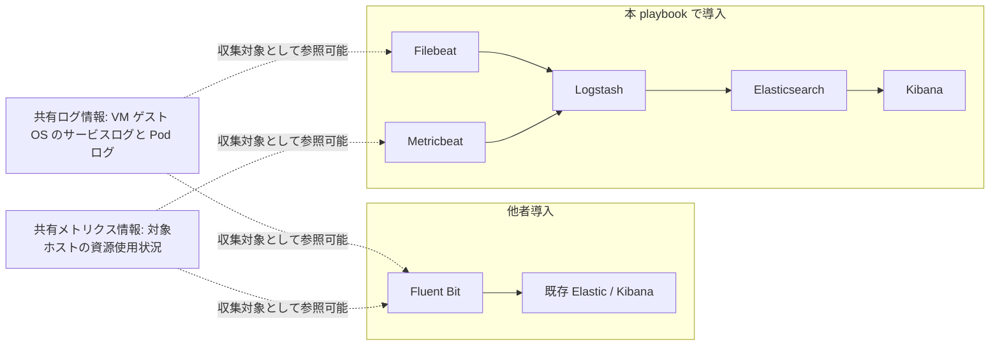
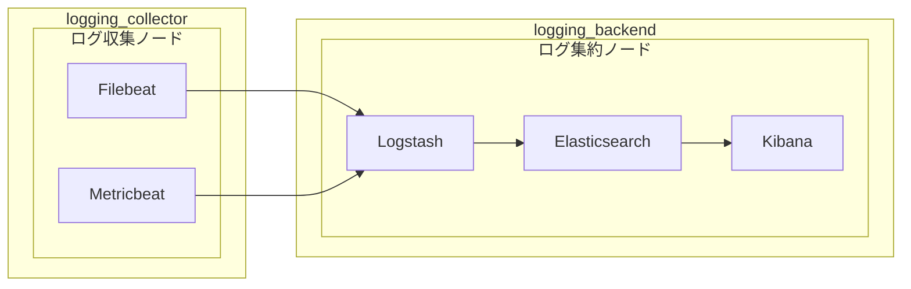

# Elasticsearch ロール

本ロールは, 本 playbook で導入する Elasticsearch を, 本 playbook で導入する Kibana, Logstash, Filebeat, Metricbeat と組み合わせて運用するためのロールです。

## 目次

- [Elasticsearch ロール](#elasticsearch-ロール)
  - [目次](#目次)
  - [用語](#用語)
  - [概要](#概要)
    - [前提条件](#前提条件)
    - [基本仕様](#基本仕様)
    - [設計背景と非干渉条件](#設計背景と非干渉条件)
    - [Elasticsearch関連コンポーネント構成図](#elasticsearch関連コンポーネント構成図)
    - [Elasticsearch関連コンポーネントの役割](#elasticsearch関連コンポーネントの役割)
    - [inventory group と Elasticsearch 関連コンポーネントの関係](#inventory-group-と-elasticsearch-関連コンポーネントの関係)
    - [Elasticsearch 関連コンポーネントの導入方式](#elasticsearch-関連コンポーネントの導入方式)
    - [本ロールで実施する主な処理](#本ロールで実施する主な処理)
  - [実行方法](#実行方法)
    - [Makefile ターゲットによる実行](#makefile-ターゲットによる実行)
    - [ansible-playbook による role 単位実行](#ansible-playbook-による-role-単位実行)
  - [主要変数](#主要変数)
    - [基本設定](#基本設定)
    - [コンテナイメージと接続設定](#コンテナイメージと接続設定)
    - [コンテナ起動確認関連設定](#コンテナ起動確認関連設定)
    - [バックアップ/リストア関連設定](#バックアップリストア関連設定)
    - [変数設定例](#変数設定例)
      - [host\_vars の設定例](#host_vars-の設定例)
      - [vars/all-config.yml の設定例](#varsall-configyml-の設定例)
    - [ログ対象を追加する手順](#ログ対象を追加する手順)
  - [バックアップ/リストア運用](#バックアップリストア運用)
    - [導入されるスクリプト仕様](#導入されるスクリプト仕様)
    - [バックアップ実行スクリプトのコマンドラインオプション](#バックアップ実行スクリプトのコマンドラインオプション)
    - [リストア実行スクリプトのコマンドラインオプション](#リストア実行スクリプトのコマンドラインオプション)
    - [バックアップ実行手順](#バックアップ実行手順)
    - [リストア実行手順](#リストア実行手順)
    - [定期バックアップ実行手順](#定期バックアップ実行手順)
  - [テンプレートと生成ファイル](#テンプレートと生成ファイル)
  - [展開されるコンテナの仕様](#展開されるコンテナの仕様)
    - [ポート公開](#ポート公開)
    - [ファイルバインド](#ファイルバインド)
    - [ネットワーク定義](#ネットワーク定義)
    - [ファイルバインドに関する補足事項](#ファイルバインドに関する補足事項)
    - [公開ポートに関する補足事項](#公開ポートに関する補足事項)
  - [実行フロー](#実行フロー)
  - [検証ポイント](#検証ポイント)
    - [検証の前提条件](#検証の前提条件)
    - [検証環境の設定](#検証環境の設定)
    - [検証コマンドと期待結果](#検証コマンドと期待結果)
      - [1. Elasticsearch 待受確認](#1-elasticsearch-待受確認)
      - [2. クラスタ状態確認](#2-クラスタ状態確認)
    - [異常時の確認項目](#異常時の確認項目)
      - [1. ポート競合の確認](#1-ポート競合の確認)
      - [2. ネットワーク作成状態の確認](#2-ネットワーク作成状態の確認)
      - [3. 設定ファイル生成状態の確認](#3-設定ファイル生成状態の確認)
      - [4. Docker Compose 定義生成状態の確認](#4-docker-compose-定義生成状態の確認)
      - [5. コンテナログのエラー確認](#5-コンテナログのエラー確認)
  - [トラブルシューティング](#トラブルシューティング)
    - [1. Elasticsearch が起動しない場合](#1-elasticsearch-が起動しない場合)
    - [2. `curl` で応答しない場合](#2-curl-で応答しない場合)
    - [3. クラスタ状態が `yellow` 又は `green` にならない場合](#3-クラスタ状態が-yellow-又は-green-にならない場合)
    - [4. 他者導入の Fluent Bit へ影響があるように見える場合](#4-他者導入の-fluent-bit-へ影響があるように見える場合)
    - [5. Kibana 起動直後に `.kibana_task_manager` の 503 警告が出る場合](#5-kibana-起動直後に-kibana_task_manager-の-503-警告が出る場合)
  - [注意事項](#注意事項)
  - [参考資料](#参考資料)
    - [公式ドキュメント](#公式ドキュメント)

## 用語

| 正式名称 | 略称 | 意味 |
| --- | --- | --- |
| Elasticsearch | - | 検索と集約を担当するサーバソフトウェア。 |
| Snapshot Repository | - | Elasticsearch がバックアップデータを保存する場所として参照する保存先の定義。 |
| snapshot | - | ある時点の Elasticsearch データを復旧可能な形で保存したバックアップ単位。 |
| Snapshot API | - | Elasticsearch の snapshot 作成, 一覧取得, 削除, 復元を行う操作手順。 |
| Kibana | - | Elasticsearchに保存されたデータを可視化し, 参照するソフトウェア。 |
| Logstash | - | 受信したデータを整形し, 送信先へ転送するソフトウェア。 |
| Filebeat | - | ログファイルを収集し, 送信先へ転送するエージェント。 |
| Metricbeat | - | メトリクスを収集して送信するエージェント。 |
| コンテナイメージ | - | コンテナ実行に必要な内容をまとめた保存形式。 |
| コンテナ | - | アプリケーションを動かす隔離された実行単位。 |
| Docker | - | コンテナイメージやコンテナの作成, 実行, 管理を行うコマンド。 |
| Docker Compose | - | 複数のコンテナ定義をまとめて作成, 起動, 停止, 更新する仕組み。 |
| compose project 名 | - | Docker Compose によって展開される個々のアプリケーションを識別する名前です。展開されたコンテナ, ネットワーク, ボリュームなどのリソースをグループ化し, 他のアプリケーション又は別途展開された同じアプリケーションと区別するために用います。 |
| Ansible | - | 設定の同一化や導入作業を所定の手順に従って自動化する仕組み。 |
| Playbook | - | 自動化処理の実行手順を記述したファイル。 |
| Host Variables | host_vars | ホスト単位の設定値を格納する変数定義。 |
| Ansible Inventory | inventory | 実行対象ホストの一覧と接続情報を管理する定義。 |
| inventory group | - | Ansible Inventory内で同じ役割の対象ホストをまとめる識別単位。 |
| single-node | - | Elasticsearch を単一ノード構成で構成する方式。コンテナイメージを用いた導入時に典型的に用いられる。 |
| 制御ホスト | - | Playbook を実行し, 他ホストへの処理指示を行う管理用ホスト。 |
| 対象ホスト | - | Playbook による設定変更や導入処理の適用先となるホスト。 |
| ホスト | - | 管理対象として識別される個別の計算機。 |
| サーバ | - | 他の機器や利用者へ機能やデータを提供する計算機, 又はその役割。 |
| ネットワーク | - | 機器同士を接続してデータをやり取りする仕組み。 |
| ディレクトリ | - | ファイルを階層的に整理するための入れ物。 |
| ログ | - | 処理の結果や状態を時系列で記録した情報。 |
| メトリクス | - | ホストやサービスの状態を数値で表した観測情報。 |
| データ | - | 処理や保存の対象となる情報。 |
| ポート | - | 通信の出入口を識別する番号または接点。 |
| Uniform Resource Locator | URL | World Wide Web上の資源の場所を示す文字列。 |
| Hypertext Transfer Protocol | HTTP | World Wide Webで情報をやり取りする通信手順。 |
| Internet Protocol | IP | ネットワーク上で宛先を識別し, データを届けるための通信手順。 |
| World Wide Web | WWW | ネットワーク上で文書や情報を相互参照できる仕組み。 |
| Fully Qualified Domain Name | FQDN | 末尾まで省略せず書いた完全なドメイン名。 |
| Operating System | OS | 計算機の基本機能を管理し, アプリケーションを動作させる基盤ソフトウェア。 |
| Linux | - | 多くの機器で使われる, 基本ソフトウェアの系統。 |
| ディストリビューション | - | 基本ソフトウェアと関連部品をまとめた配布形態。 |
| コミュニティ | - | 共通目的のもとで継続的に活動する利用者集団。 |
| Debian | - | コミュニティ主導で開発される Linux ディストリビューション。 |
| Red Hat | - | Red Hat Enterprise Linuxなどを提供する組織。 |
| Red Hat Enterprise Linux | RHEL | Red Hatが提供する企業向けLinuxディストリビューション。 |
| host metrics | - | リソース使用状況など, ログ収集対象となるホスト群から収集する情報。 |
| root | - | Unix 系システムの最上位権限を持つ管理者識別子。 |
| ループ | - | 同じ処理を繰り返すこと。 |
| バックエンド | - | 利用者画面の背後で処理を実行する側。 |
| メタデータ | - | 対象データの属性や説明を示す付加情報。 |
| リソース | - | 処理に必要な計算機資源やデータ。 |
| コマンド | - | 実行者が計算機へ処理を指示するための命令。 |
| ansible-playbookコマンド | ansible-playbook | Ansible Playbook を実行して自動構成処理を適用するコマンド。 |
| sudoコマンド | sudo | 一時的に管理者権限でコマンドを実行するためのコマンド。 |
| makeコマンド | make | Makefile に定義された処理を実行するコマンド。 |
| curlコマンド | curl | URL を指定して通信結果を取得するコマンド。 |
| 環境変数 | - | 実行時の動作を調整するために外部から渡す設定値。 |
| cron | - | 指定した時刻や周期でコマンドを自動実行する仕組み。 |
## 概要

### 前提条件

本 playbook を実行する前提条件は, 次のとおりです。

- 対象ホストが, `inventory/hosts` ファイル中の `logging_backend` グループに登録されていること。
- 対象ホストの OS は, Debian 系又は RHEL 系であること。
- 対象ホストで Docker と Docker Compose が利用可能であること。
- 対象ホストで `sudo`によるディレクトリ作成とコンテナ起動が可能であること。
- `elastic_search_http_port` に設定するポート番号が, 既存サービスで使用するポート番号と競合しないこと。

### 基本仕様

本ロールで Elasticsearch を導入する際の仕様は, 次のとおりです。

- コンテナイメージは `docker.elastic.co/elasticsearch/elasticsearch:8.17.3` を使用すること。
- クラスタ名は `shared-logs` とすること。
- ノード名は, 対象ホスト名を用いること。
- Elasticsearch は `0.0.0.0:9200` で待受し, TCPプロトコルのポート番号9200番 を使用すること。
- ノード探索方式は `single-node` とすること。
- 認証機能とノード間通信の暗号化は無効とすること。
- 設定, データ, ログは, 本 playbook で導入する専用ディレクトリへ分離すること。
- 送信経路は, 本 playbook で導入する Logstash を経由すること。

### 設計背景と非干渉条件

本ロールでは, 他者導入の Fluent Bit などと干渉しないように独立したメトリクス収集機能を構成します:

- 他者導入の Fluent Bit 設定を変更しないこと。
- 他者導入の Elastic, Kibana, Logstash を変更しないこと。
- 既存ポートを再利用しないこと。
- 既存永続化ディレクトリを再利用しないこと。
- 既存サービスの定義や所有関係を変更しないこと。
- 共有ログ情報を削除しないこと。
- 共有メトリクス情報を削除しないこと。
- 本 playbook で導入する compose project 名, ネットワーク名, inventory group は, 他者導入の設定と分離すること。

### Elasticsearch関連コンポーネント構成図

本ロールでは, VM ゲスト OS のサービスログと Pod ログ, および対象ホストの資源使用状況を共有情報とし, 他者導入側と本 playbook 側の双方が参照可能となるよう Elasticsearch を構成します(下図参照):





### Elasticsearch関連コンポーネントの役割

各Elasticsearch関連コンポーネントの役割は以下の表の通りです:

| コンポーネント | 収集対象 | 送信先 | 主な責務 |
| --- | --- | --- | --- |
| Filebeat | 共有ログ情報(VM ゲスト OS のサービスログ と Pod ログ) | Logstash | ログを収集し, メタデータを付与して送信します。 |
| Metricbeat | 共有メトリクス情報 (対象ホストの資源使用状況) | Logstash | メトリクスを収集し, 送信します。 |
| Logstash | Filebeat と Metricbeat の送信内容 | Elasticsearch | 受信, 整形, 振り分けを担います。 |
| Elasticsearch | Logstash が整形して送信したデータ | Kibana | データの保存と検索を担います。 |
| Kibana | Elasticsearch に保存されたデータ | 利用者画面 | 可視化と閲覧操作を担います。 |

### inventory group と Elasticsearch 関連コンポーネントの関係

本節では, inventory group とその上で動作するコンポーネントの対応関係を図と表で示します。

Elasticsearch 関連コンポーネントに関するinventory groupは以下の2種類に分類されます:

1. `logging_backend` : Filebeat と Metricbeat の送信を受け, データを整形し, 保存し, 画面で可視化する機能を提供するホストです。
2. `logging_collector` : VM ゲスト OS のサービスログ, Pod ログ, cgroup 由来の資源使用状況, host metrics を収集するホストです。

inventory group, ノード, ノード上で動作するコンポーネントの包含関係を箱で示し, コンポーネント間のデータフローを矢印で表した関係図を以下に示します:



上記の図は, 単純化のため, `logging_collector`, `logging_backend`のそれぞれ単一ノード構成で記載していますが, `logging_collector`, `logging_backend` のそれぞれのinventory groupに複数のノードを含めることが可能です。

### Elasticsearch 関連コンポーネントの導入方式


本playbookでは, `logging_backend`に導入するElasticsearch 関連コンポーネントは, Elasticの公式コンテナイメージを展開する方式で導入し, `logging_collector` に導入するElasticsearch 関連コンポーネントは, Elasticの公式のソースコードを元に, RPMパッケージやDEBパッケージを作成し, 対象ホストに導入します。

inventory group, ノード種別, 当該ノード種別のホスト上で動作するElasticsearch 関連コンポーネント, Elasticsearch 関連コンポーネントの導入方式の関係は以下の表の通りです:

| inventory group | ノード種別 | 動作するコンポーネント |パッケージ導入方式|
| --- | --- | --- | --- |
| `logging_backend` | ログ集約ノード | Logstash, Elasticsearch, Kibana | コンテナイメージを展開 |
| `logging_collector` | ログ収集ノード | Filebeat, Metricbeat | RPM/DEB形式のパッケージを導入 |

将来的なOS版数変更の影響を軽減するため, Kubernetesクラスタ外の運用管理ノードとしてログ集約ノードを用意することを想定し, ログ集約ノードに導入するコンポーネントは, コンテナイメージを用いてコンポーネントを導入する方針としています。

本playbookでは, Kubernetes(K8s)クラスタ上のPodのログなどを収集することを想定しています。K8sクラスタの動作に必要となるcontainerdなどのContainer Runtime Interface (CRI)とElasticsearch 関連コンポーネントを動作させるために用いるDockerなどのCRIとを混在させることにより発生するトラブルを防止する観点から, ログ収集ノード上で動作するコンポーネントは, OSディストリビューションに導入可能なRPM/DEBパッケージを作成の上, OS環境(VM上のゲストOS環境)にパッケージを導入する方針としています。

### 本ロールで実施する主な処理

本ロールでは, 次の処理を実施します。

1. `docker compose` が利用可能であることを確認します。
2. 本 playbook で導入するディレクトリを作成します。
3. Elasticsearch の設定ファイルと Docker Compose 定義を生成します。
4. Elasticsearch コンテナを起動します。
5. 起動後にポート待機と応答確認を行います。

## 実行方法

### Makefile ターゲットによる実行

制御ホストで次のコマンドを実行します。

```bash
make run_logging_backend
```

このコマンドは, `logging_backend` グループに対して本 playbook で導入する Elasticsearch, Kibana, Logstash を実行します。

### ansible-playbook による role 単位実行

制御ホストで次のコマンドを実行します。

```bash
ansible-playbook -i inventory/hosts logging-backend.yml
```

このコマンドは, `logging_backend` グループに対して本 playbook で導入する Elasticsearch, Kibana, Logstash を実行します。

## 主要変数

### 基本設定

| 変数名 | 意味 | 既定値 | 設定例 |
| --- | --- | --- | --- |
| `elastic_search_enabled` | Elasticsearch ロールの有効化フラグ。 | `true` | `true` |
| `elastic_search_compose_dir` | Docker Compose 定義と関連ファイルを配置するディレクトリ。 | `/srv/elastic-search` | `/srv/elastic-search` |
| `elastic_search_compose_file` | Docker Compose 定義のファイルパス。 | `{{ elastic_search_compose_dir }}/docker-compose.yml` | `/srv/elastic-search/docker-compose.yml` |
| `elastic_search_config_dir` | Elasticsearch 設定ファイルを配置するディレクトリ。 | `{{ elastic_search_compose_dir }}/config` | `/srv/elastic-search/config` |
| `elastic_search_config_file` | Elasticsearch 設定ファイルのパス。 | `{{ elastic_search_config_dir }}/elasticsearch.yml` | `/srv/elastic-search/config/elasticsearch.yml` |
| `elastic_search_data_dir` | Elasticsearch データを配置するディレクトリ。 | `{{ elastic_search_compose_dir }}/data` | `/srv/elastic-search/data` |
| `elastic_search_logs_dir` | Elasticsearch ログを配置するディレクトリ。 | `{{ elastic_search_compose_dir }}/logs` | `/srv/elastic-search/logs` |
| `elastic_search_network_name` | Docker ネットワーク名。 | `elastic-backend` | `elastic-backend` |
| `elastic_search_container_name` | Elasticsearch コンテナ名。 | `elasticsearch` | `elasticsearch` |
| `elastic_search_vm_max_map_count` | Elasticsearch の起動前提として設定する `vm.max_map_count` の値。 | `262144` | `262144` |
| `elastic_search_sysctl_dropin_file` | `vm.max_map_count` を設定する sysctl ドロップインファイルの配置先。 | `/etc/sysctl.d/90-elasticsearch.conf` | `/etc/sysctl.d/90-elasticsearch.conf` |

`elastic_search_vm_max_map_count`の値は, Elasticsearch Guideの[Maximum map count check](https://www.elastic.co/guide/en/elasticsearch/reference/8.17/bootstrap-checks-max-map-count.html)の指定値を元に設定しています。

### コンテナイメージと接続設定

| 変数名 | 意味 | 既定値 | 設定例 |
| --- | --- | --- | --- |
| `elastic_search_image` | Elasticsearch のコンテナイメージ名。 | `docker.elastic.co/elasticsearch/elasticsearch:8.17.3` | `docker.elastic.co/elasticsearch/elasticsearch:8.17.3` |
| `elastic_search_cluster_name` | Elasticsearch のクラスタ名。 | `shared-logs` | `shared-logs` |
| `elastic_search_node_name` | Elasticsearch ノード名。IPアドレス, または, ホスト名 (FQDN形式) で記載する。 | `対象ホスト` | `elasticsearch01.local` |
| `elastic_search_discovery_type` | 単一ノード起動時の探索方式。 | `single-node` | `single-node` |
| `elastic_search_http_host` | Elasticsearch の HTTP 待受アドレス。 | `0.0.0.0` | `0.0.0.0` |
| `elastic_search_http_port` | Elasticsearch の HTTP 待受ポート。 | `9200` | `9200` |
| `elastic_search_java_opts` | Elasticsearch の Java オプション。 | `-Xms512m -Xmx512m` | `-Xms512m -Xmx512m` |

### コンテナ起動確認関連設定

| 変数名 | 意味 | 既定値 | 設定例 |
| --- | --- | --- | --- |
| `elastic_search_wait_host` | 起動確認で待機する接続先ホスト。 | `127.0.0.1` | `127.0.0.1` |
| `elastic_search_wait_delegate_to` | 起動確認を実行する接続元ホスト。 | `対象ホスト` | `{{ inventory_hostname }}` |
| `elastic_search_wait_timeout` | 起動確認のタイムアウト時間。 | `120` | `120` |
| `elastic_search_wait_delay` | 起動確認の開始遅延時間。 | `5` | `5` |
| `elastic_search_wait_sleep` | 起動確認の待機間隔。 | `2` | `2` |
| `elastic_search_wait_retries` | 起動確認の再試行回数。 | `60` | `60` |

### バックアップ/リストア関連設定

| 変数名 | 意味 | 既定値 | 設定例 |
| --- | --- | --- | --- |
| `elastic_search_enable_backup_script` | バックアップ/リストア関連スクリプトを生成するかを制御するフラグ。 | `false` | `true` |
| `elastic_search_scripts_dir` | バックアップ/リストア関連スクリプトを配置するディレクトリ。 | `{{ elastic_search_compose_dir }}/scripts` | `/srv/elastic-search/scripts` |
| `elastic_search_backup_dir` | バックアップデータを保管するディレクトリ。 | `{{ elastic_search_compose_dir }}/backup` | `/srv/elastic-search/backup` |
| `elastic_search_snapshot_repository` | Elasticsearch の snapshot repository 名。 | `elastic-backup-repo` | `elastic-backup-repo` |
| `elastic_search_snapshot_repo_path_host` | snapshot repository のホスト側ディレクトリ。 | `{{ elastic_search_backup_dir }}/snapshot-repo` | `/srv/elastic-search/backup/snapshot-repo` |
| `elastic_search_snapshot_repo_path_container` | snapshot repository のコンテナ側ディレクトリ。 | `/usr/share/elasticsearch/snapshot-repo` | `/usr/share/elasticsearch/snapshot-repo` |
| `elastic_search_backup_name_prefix` | 生成する snapshot 名の接頭辞。 | `elastic-snapshot` | `elastic-snapshot` |
| `elastic_search_backup_retention` | 保持する snapshot 世代数。 | `7` | `14` |
| `elastic_search_python_command` | Python 実装本体を起動するコマンド。 | `/usr/bin/python3` | `/usr/bin/python3` |
| `elastic_search_backup_script_path` | バックアップ実行ラッパースクリプトの配置先。 | `{{ elastic_search_scripts_dir }}/backup-elasticsearch-data.sh` | `/srv/elastic-search/scripts/backup-elasticsearch-data.sh` |
| `elastic_search_restore_script_path` | リストア実行ラッパースクリプトの配置先。 | `{{ elastic_search_scripts_dir }}/restore-elasticsearch-data.sh` | `/srv/elastic-search/scripts/restore-elasticsearch-data.sh` |
| `elastic_search_daily_backup_script_path` | 日次バックアップ実行ラッパースクリプトの配置先。 | `{{ elastic_search_scripts_dir }}/daily-backup-elasticsearch.sh` | `/srv/elastic-search/scripts/daily-backup-elasticsearch.sh` |
| `elastic_search_daily_backup_extra_args` | 日次バックアップラッパーからバックアップ実行へ引き渡す追加引数。 | `""` | `--retention 14` |

### 変数設定例

#### host_vars の設定例

ホスト固有に変える値を `host_vars/elastic-search01.local.yml` に記載します。

```yaml
1: elastic_search_enabled: true
2: elastic_search_node_name: "elastic-search01.local"
3: elastic_search_wait_delegate_to: "{{ inventory_hostname }}"
```

| 行番号 | 設定値 | 有効になる動作 | 設定背景(未設定時/誤設定時の問題と防止理由) |
| --- | --- | --- | --- |
| 1 | `elastic_search_enabled: true` | Elasticsearch ロールを有効化し, ディレクトリ作成, 設定生成, コンテナ起動, 起動確認を実行します。 | `false` の場合は Elasticsearch ロールの処理が実行されず, 期待した導入結果を得られないためです。 |
| 2 | `elastic_search_node_name: "elastic-search01.local"` | Elasticsearch ノード名を `elastic-search01.local` として設定し, クラスタ状態確認で識別可能にします。 | ノード名が未設定又は誤設定の場合, 運用時の識別性が低下し, 障害切り分けが難しくなるためです。 |
| 3 | `elastic_search_wait_delegate_to: "{{ inventory_hostname }}"` | 起動確認タスクを対象ホスト自身から実行します。 | 到達不能な接続元を設定した場合, 起動済みでも待受確認に失敗し, ロール実行が異常終了するためです。 |

この例では, ノード名を対象ホスト名に合わせ, 起動確認の接続元を対象ホスト自身にします。

#### vars/all-config.yml の設定例

全ホスト共通の値を `vars/all-config.yml` に記載します。

```yaml
1: elastic_search_enabled: true
2: elastic_search_compose_dir: "/srv/elastic-search"
3: elastic_search_network_name: "elastic-backend"
4: elastic_search_image: "docker.elastic.co/elasticsearch/elasticsearch:8.17.3"
5: elastic_search_cluster_name: "shared-logs"
6: elastic_search_http_host: "0.0.0.0"
7: elastic_search_http_port: 9200
8: elastic_search_java_opts: "-Xms512m -Xmx512m"
9: elastic_search_wait_host: "127.0.0.1"
10: elastic_search_wait_timeout: 120
11: elastic_search_wait_delay: 5
12: elastic_search_wait_sleep: 2
13: elastic_search_wait_retries: 60
```

| 行番号 | 設定値 | 有効になる動作 | 設定背景(未設定時/誤設定時の問題と防止理由) |
| --- | --- | --- | --- |
| 1 | `elastic_search_enabled: true` | Elasticsearch ロールを有効化し, 共通設定にもとづく導入処理を実行します。 | `false` の場合は共通設定が存在しても導入処理が実行されず, 設定の反映漏れが発生するためです。 |
| 2 | `elastic_search_compose_dir: "/srv/elastic-search"` | Docker Compose 定義, 設定, データ, ログの保存先基準ディレクトリを `/srv/elastic-search` に統一します。 | 未設定又は誤設定の場合, 生成先の分散や競合が発生し, 保守作業で誤操作が起きやすくなるためです。 |
| 3 | `elastic_search_network_name: "elastic-backend"` | Elasticsearch が参加する外部ネットワーク名を `elastic-backend` に設定します。 | 関連コンテナ群と異なるネットワーク名を設定した場合, 相互接続に失敗するためです。 |
| 4 | `elastic_search_image: "docker.elastic.co/elasticsearch/elasticsearch:8.17.3"` | 起動する Elasticsearch のコンテナイメージ版数を指定します。 | 未設定又は誤設定の場合, 想定外の版数差異により互換性問題が発生するためです。 |
| 5 | `elastic_search_cluster_name: "shared-logs"` | クラスタ名を `shared-logs` に設定し, 関連コンポーネントとの前提を一致させます。 | クラスタ名不一致により, 監視や運用手順で対象を識別できなくなるためです。 |
| 6-7 | `elastic_search_http_host: "0.0.0.0"`, `elastic_search_http_port: 9200` | Elasticsearch の HTTP 待受を `0.0.0.0:9200` に設定し, 対象ホストから利用可能にします。 | 未設定又は誤設定の場合, 待受先アドレスやポートが期待値と一致せず, 接続確認が失敗するためです。 |
| 8 | `elastic_search_java_opts: "-Xms512m -Xmx512m"` | JVM の初期ヒープ, 最大ヒープをともに `512m` に設定します。 | 過小設定では性能低下, 過大設定ではメモリ圧迫を招き, 安定運用を阻害するためです。 |
| 9-13 | `elastic_search_wait_host: "127.0.0.1"`, `elastic_search_wait_timeout: 120`, `elastic_search_wait_delay: 5`, `elastic_search_wait_sleep: 2`, `elastic_search_wait_retries: 60` | 起動確認の接続先と再試行条件を定義し, 起動直後の待受未完了を吸収して到達性を検証します。 | これらが未設定又は不適切な場合, 起動直後の一時的な応答遅延を異常と誤判定し, ロール実行が失敗するためです。 |

この例では, 本 playbook で導入する側の共通値を一箇所へ集約します。

### ログ対象を追加する手順

ログ対象を追加する際に次の順で更新します。

1. Filebeat の入力パスを追加します。
2. 必要なら Filebeat のメタデータ設定を追加します。
3. Logstash の受け口と振り分け条件を更新します。
4. 必要なら Metricbeat の収集周期や対象を調整します。
5. `ansible-lint` と起動確認を通す。

## バックアップ/リストア運用

本節では, 運用者視点で本ロールが生成するバックアップ/リストア用スクリプトの使い方を示します。

### 導入されるスクリプト仕様

本ロールで `elastic_search_enable_backup_script: true` を設定した場合は, 次のスクリプトを導入します。

導入する Python スクリプトは標準ライブラリのみを使用するため, 追加の pip パッケージ導入は不要です。

| スクリプト | 配置先(既定) | 仕様 |
| --- | --- | --- |
| backup-elasticsearch-data.py | /srv/elastic-search/scripts/backup-elasticsearch-data.py | Snapshot Repository の登録確認, snapshot 作成, 世代整理を実装する Python 本体。 |
| restore-elasticsearch-data.py | /srv/elastic-search/scripts/restore-elasticsearch-data.py | 指定した snapshot からの復元を実装する Python 本体。必要に応じて既存 index を削除する。 |
| backup-elasticsearch-data.sh | /srv/elastic-search/scripts/backup-elasticsearch-data.sh | バックアップ Python 本体を呼び出す実行ラッパー。 |
| restore-elasticsearch-data.sh | /srv/elastic-search/scripts/restore-elasticsearch-data.sh | リストア Python 本体を呼び出す実行ラッパー。 |
| daily-backup-elasticsearch.sh | /srv/elastic-search/scripts/daily-backup-elasticsearch.sh | 日次実行向けラッパー。cron から呼び出す用途を想定する。 |

### バックアップ実行スクリプトのコマンドラインオプション

バックアップ実行スクリプト(backup-elasticsearch-data.sh)のコマンドラインオプションは, 以下の通りです。

| オプション | 規定値 | 意味 | 指定例 |
| --- | --- | --- | --- |
| --endpoint | `http://127.0.0.1:9200` | 接続先 Elasticsearch URL を指定します。 | --endpoint http://127.0.0.1:9200 |
| --repository | `elastic-backup-repo` | Snapshot Repository 名を指定します。 | --repository elastic-backup-repo |
| --repository-path | `/usr/share/elasticsearch/snapshot-repo` | Snapshot Repository のコンテナ側パスを指定します。 | --repository-path /usr/share/elasticsearch/snapshot-repo |
| --snapshot-prefix | `elastic-snapshot` | 生成する snapshot 名の接頭辞を指定します。 | --snapshot-prefix elastic-snapshot |
| --retention | `7` | 保持世代数を指定します。 | --retention 14 |
| --timeout-seconds | `120` | HTTP タイムアウト秒数を指定します。 | --timeout-seconds 180 |
| --verbose | `false` | 詳細ログを有効化します。指定時に `true` 扱いとなります。 | --verbose |

### リストア実行スクリプトのコマンドラインオプション

リストア実行スクリプト(restore-elasticsearch-data.sh)のコマンドラインオプションは, 以下の通りです。

| オプション | 規定値 | 意味 | 指定例 |
| --- | --- | --- | --- |
| --endpoint | `http://127.0.0.1:9200` | 接続先 Elasticsearch URL を指定します。 | --endpoint http://127.0.0.1:9200 |
| --repository | `elastic-backup-repo` | 復元元の Snapshot Repository 名を指定します。 | --repository elastic-backup-repo |
| --snapshot-name | なし(必須) | 復元対象の snapshot 名を指定します。 | --snapshot-name elastic-snapshot-20260803-030000 |
| --timeout-seconds | `120` | HTTP タイムアウト秒数を指定します。 | --timeout-seconds 180 |
| --delete-existing | `false` | 復元前に既存 index を削除します。指定時に `true` 扱いとなります。 | --delete-existing |
| --verbose | `false` | 詳細ログを有効化します。指定時に `true` 扱いとなります。 | --verbose |

### バックアップ実行手順

運用者は次のコマンドを対象ホストで実行します。

```bash
/srv/elastic-search/scripts/backup-elasticsearch-data.sh
```

このコマンドは, Snapshot Repository の登録確認, snapshot 作成, 保持世代を超えた snapshot の削除を順に実行します。

### リストア実行手順

運用者は復元対象の snapshot 名を指定して, 次のコマンドを対象ホストで実行します。

```bash
/srv/elastic-search/scripts/restore-elasticsearch-data.sh --snapshot-name elastic-snapshot-20260803-030000
```

既存 index を削除してから復元する場合は, `--delete-existing` を追加します。

```bash
/srv/elastic-search/scripts/restore-elasticsearch-data.sh --snapshot-name elastic-snapshot-20260803-030000 --delete-existing
```

### 定期バックアップ実行手順

日次実行用ラッパースクリプトは次のコマンドです。

```bash
/srv/elastic-search/scripts/daily-backup-elasticsearch.sh
```

本ロールは crontab エントリを自動作成せず, 運用者責任で登録する方針です。定期実行する場合は, 対象ホスト上で crontab へ手動登録します。`crontab -e` コマンドを実行し, 次のようなエントリを登録します。本例では, 午前3時にバックアップ処理を実施します:

```text
0 3 * * * /srv/elastic-search/scripts/daily-backup-elasticsearch.sh
```

登録後は, 次のコマンドで反映状態を確認します。

```bash
crontab -l
```

実行例:
```bash
$ crontab -l
# Edit this file to introduce tasks to be run by cron.
#
# Each task to run has to be defined through a single line
# indicating with different fields when the task will be run
# and what command to run for the task
#
# To define the time you can provide concrete values for
# minute (m), hour (h), day of month (dom), month (mon),
# and day of week (dow) or use '*' in these fields (for 'any').
#
# Notice that tasks will be started based on the cron's system
# daemon's notion of time and timezones.
#
# Output of the crontab jobs (including errors) is sent through
# email to the user the crontab file belongs to (unless redirected).
#
# For example, you can run a backup of all your user accounts
# at 5 a.m every week with:
# 0 5 * * 1 tar -zcf /var/backups/home.tgz /home/
#
# For more information see the manual pages of crontab(5) and cron(8)
#
# m h  dom mon dow   command
0 3 * * * /srv/elastic-search/scripts/daily-backup-elasticsearch.sh
```

## テンプレートと生成ファイル

| テンプレート | 生成先 (括弧内は規定) | 用途 | 主な内容 |
| --- | --- | --- | --- |
| `templates/elasticsearch.yml.j2` | `{{ elastic_search_config_file }}` (規定: `/srv/elastic-search/config/elasticsearch.yml`) | Elasticsearch の設定ファイルを生成します。 | クラスタ名, ノード名, 待受アドレス, 待受ポート, 探索方式, セキュリティ設定。 |
| `templates/docker-compose.yml.j2` | `{{ elastic_search_compose_file }}` (規定: `/srv/elastic-search/docker-compose.yml`) | Elasticsearch の Docker Compose 定義を生成します。 | コンテナイメージ, コンテナ名, ボリューム, ポート公開, 起動確認, ネットワーク。 |
| `templates/90-elasticsearch.conf.j2` | `{{ elastic_search_sysctl_dropin_file }}` (規定: `/etc/sysctl.d/90-elasticsearch.conf`) | `vm.max_map_count` を設定する sysctl ドロップインファイルを生成します。 | `vm.max_map_count={{ elastic_search_vm_max_map_count }}` の設定行。 |
| `templates/backup-elasticsearch-data.py.j2` | `{{ elastic_search_backup_python_script_path }}` (規定: `/srv/elastic-search/scripts/backup-elasticsearch-data.py`) | Snapshot API を使ってバックアップと世代整理を行う Python スクリプトを生成します。 | repository 登録, snapshot 作成, 保持世代を超えた snapshot 削除。 |
| `templates/restore-elasticsearch-data.py.j2` | `{{ elastic_search_restore_python_script_path }}` (規定: `/srv/elastic-search/scripts/restore-elasticsearch-data.py`) | Snapshot API を使ってリストアを行う Python スクリプトを生成します。 | snapshot 指定リストア, 既存 index 削除オプション。 |
| `templates/backup-elasticsearch-data.sh.j2` | `{{ elastic_search_backup_script_path }}` (規定: `/srv/elastic-search/scripts/backup-elasticsearch-data.sh`) | バックアップ Python 実装を呼び出すラッパースクリプトを生成します。 | Python 実装への引数透過。 |
| `templates/restore-elasticsearch-data.sh.j2` | `{{ elastic_search_restore_script_path }}` (規定: `/srv/elastic-search/scripts/restore-elasticsearch-data.sh`) | リストア Python 実装を呼び出すラッパースクリプトを生成します。 | Python 実装への引数透過。 |
| `templates/daily-backup-elasticsearch.sh.j2` | `{{ elastic_search_daily_backup_script_path }}` (規定: `/srv/elastic-search/scripts/daily-backup-elasticsearch.sh`) | 日次バックアップ実行用ラッパースクリプトを生成します。 | cron からバックアップ実行ラッパーを呼び出す。 |

`elasticsearch.yml.j2` は, Elasticsearch コンテナ内の設定用ファイルを展開します。`docker-compose.yml.j2` は, コンテナイメージ, コンテナ名, ボリューム, ポート公開, ネットワークの設定ファイルを展開します。`backup-elasticsearch-data.py.j2` と `restore-elasticsearch-data.py.j2` は Snapshot API を呼び出す実装本体であり, `.sh.j2` は運用者が扱う呼び出しインターフェースです。

## 展開されるコンテナの仕様

### ポート公開

| ホスト側待受 | コンテナ側待受 | プロトコル | 用途 |
| --- | --- | --- | --- |
| `{{ elastic_search_http_host }}:{{ elastic_search_http_port }}` (既定: `0.0.0.0:9200`) | `{{ elastic_search_http_port }}` (既定: `9200`) | TCP | Elasticsearch の HTTP エンドポイントを対象ホスト側から利用可能にします。 |

`templates/docker-compose.yml.j2` では, Elasticsearch コンテナの HTTP ポートを次の形式で公開します:

- `{{ elastic_search_http_host }}:{{ elastic_search_http_port }}:{{ elastic_search_http_port }}` (既定: `0.0.0.0:9200:9200`)

既定値は, 対象ホスト上のすべてのネットワークインターフェースで TCPプロトコルのポート番号9200番 を待受し, 同じポート番号で Elasticsearch コンテナへ転送する設定であることを意味します。

### ファイルバインド

`templates/docker-compose.yml.j2` では, ホスト側のファイルやディレクトリを以下のようにコンテナ内から使用可能とするように設定します:

| ホスト側 | コンテナ側 | モード | 用途 |
| --- | --- | --- | --- |
| `{{ elastic_search_config_file }}` (既定: `/srv/elastic-search/config/elasticsearch.yml`) | `/usr/share/elasticsearch/config/elasticsearch.yml` | `ro` | ホスト側のElasticsearch の設定ファイルをコンテナ内から参照可能します。コンテナ内から当該のファイルを破壊不可能なように読み取り専用でコンテナ側に公開します。 |
| `{{ elastic_search_data_dir }}` (既定: `/srv/elastic-search/data`) | `/usr/share/elasticsearch/data` | `rw` | インデックスを永続化し, コンテナの再作成時でも当該のインデックスデータを継続的に利用可能にします。 |
| `{{ elastic_search_logs_dir }}` (既定: `/srv/elastic-search/logs`) | `/usr/share/elasticsearch/logs` | `rw` | Elasticsearch のログを永続化し, コンテナの動作が停止した場合でもホスト上からログ情報を参照可能にします。 |
| `{{ elastic_search_snapshot_repo_path_host }}` (既定: `/srv/elastic-search/backup/snapshot-repo`) | `{{ elastic_search_snapshot_repo_path_container }}` (既定: `/usr/share/elasticsearch/snapshot-repo`) | `rw` | Snapshot Repository の保存先をホスト側へ永続化し, バックアップ/リストア処理で参照可能にします。 |

既定値は, 設定ファイルをホスト上の `/srv/elastic-search/config/elasticsearch.yml` から読み込み, インデックスをホスト上の `/srv/elastic-search/data`, ログをホスト上の `/srv/elastic-search/logs` に保存する設定です。

### ネットワーク定義

`templates/docker-compose.yml.j2` では, `elastic_backend` ネットワークを定義し, `external: true` で既存ネットワークを利用します。実体として参照するネットワーク名は `{{ elastic_search_network_name }}` (既定: `elastic-backend`) です。

既定値は, `elastic-backend` という外部ネットワーク(ホスト側ネットワーク)へ Elasticsearch コンテナを参加させるためのネットワークを作成し, 同一のホスト側ネットワークを通して, 関連コンテナと通信する設定です。なお, `elastic-backend` が既に存在する場合は, 既設の `elastic-backend` ネットワークを使用します。

### ファイルバインドに関する補足事項

- 本ロールは, 設定ファイル, データ, ログの保存先をホスト側へ分離し, コンテナ再作成後もデータを保持することを保証します。
- 本ロールは, 設定ファイルを読み取り専用でコンテナへ渡し, コンテナ内の処理によって設定ファイルが書き換わらないことを保証します。
- 本ロールは, 規定値を使用する場合に `/srv/elastic-search` 配下へ設定, データ, ログを集約し, 配置先の一貫性を維持することを保証します。

### 公開ポートに関する補足事項

- 本ロールは, 公開ポート設定にもとづいて Elasticsearch の HTTP エンドポイントに対して対象ホスト側からアクセス可能になることを待ち合わせることで, 正常にポート公開がなされていることを確認, 保証します。
- 本ロールは, 起動後に公開ポート経由で接続確認を実施し, クラスタ状態が 検索や保存の基本機能は利用できるが一部の予備コピーが未配置である状態 ( Elasticsearchの用語でいう `yellow` 状態 ), または, 予備コピーを含む全データ配置が完了している状態 ( Elasticsearchの用語でいう `green` 状態 ) になるまで待機することで, Elasticsearchが利用可能な状態になることを保証します。
- 規定値を使用する場合は `0.0.0.0:9200` で待受します。外部からの接続元を限定したい場合は, `elastic_search_http_host` に `127.0.0.1` などの値を設定することで, 待受先アドレスを制限することも可能です。

## 実行フロー

1. [tasks/load-params.yml](tasks/load-params.yml) で OS 別パラメータと共通変数を読み込みます。
2. [tasks/validate.yml](tasks/validate.yml) で導入前提, パス, コンテナイメージ名, ポート, OS 条件を確認します。
3. [tasks/package.yml](tasks/package.yml) で Docker Compose が利用可能であることを確認します。
4. [tasks/directory.yml](tasks/directory.yml) で compose 用ディレクトリと設定, データ, ログの配置先を作成します。
5. [tasks/user_group.yml](tasks/user_group.yml) で実行ユーザとグループを作成し, ディレクトリ所有権を調整します。
6. [tasks/config.yml](tasks/config.yml) で [templates/elasticsearch.yml.j2](templates/elasticsearch.yml.j2) と [templates/docker-compose.yml.j2](templates/docker-compose.yml.j2) を配置します。`elastic_search_enable_backup_script` が `true` の場合は, [templates/backup-elasticsearch-data.py.j2](templates/backup-elasticsearch-data.py.j2), [templates/restore-elasticsearch-data.py.j2](templates/restore-elasticsearch-data.py.j2), [templates/backup-elasticsearch-data.sh.j2](templates/backup-elasticsearch-data.sh.j2), [templates/restore-elasticsearch-data.sh.j2](templates/restore-elasticsearch-data.sh.j2), [templates/daily-backup-elasticsearch.sh.j2](templates/daily-backup-elasticsearch.sh.j2) も配置します。設定ファイルまたは Compose 定義の更新時は `elasticsearch_restart_service` を通知し, [handlers/main.yml](handlers/main.yml) から読み込む [handlers/restart-service.yml](handlers/restart-service.yml) でコンテナを再作成します。
7. [tasks/service.yml](tasks/service.yml) で backend 専用ネットワークを確認または作成し, `docker compose up -d --remove-orphans` により Elasticsearch コンテナを起動します。
8. [tasks/verify.yml](tasks/verify.yml) で `wait_for` によるポート待機と, `uri` による `/_cluster/health` の応答確認を実施し, クラスタ状態が `yellow` または `green` であることを検証します。

## 検証ポイント

### 検証の前提条件

検証を始める前に, 次の条件が満たされていることを確認します。

- 対象ホストで Docker と Docker Compose が利用できること。
- `elastic_search_http_port` に設定したポートが他のサービスで使われていないこと。
- `elastic_search_compose_dir` 配下を作成できること。
- `logging_backend` グループに対象ホストが登録されていること。

### 検証環境の設定

検証用の host_vars と vars/all-config.yml を次の値で整えます。

```yaml
1: elastic_search_compose_dir: "/srv/elastic-search"
2: elastic_search_network_name: "elastic-backend"
3: elastic_search_http_host: "0.0.0.0"
4: elastic_search_http_port: 9200
5: elastic_search_wait_host: "127.0.0.1"
6: elastic_search_wait_delegate_to: "{{ inventory_hostname }}"
```

| 行番号 | 設定値 | 有効になる動作 | 設定背景(未設定時/誤設定時の問題と防止理由) |
| --- | --- | --- | --- |
| 1 | `elastic_search_compose_dir: "/srv/elastic-search"` | 検証時に生成される設定, データ, ログの保存先を `/srv/elastic-search` 基準へ統一します。 | 保存先が分散すると検証対象ファイルの追跡が困難になり, 検証漏れが発生するためです。 |
| 2 | `elastic_search_network_name: "elastic-backend"` | 検証対象の Elasticsearch を想定ネットワークへ参加させ, 関連コンテナとの通信経路を確立します。 | ネットワーク名不一致により接続検証が失敗し, 問題の原因切り分けが困難になるためです。 |
| 3-4 | `elastic_search_http_host: "0.0.0.0"`, `elastic_search_http_port: 9200` | `0.0.0.0:9200` で待受し, HTTP 接続確認を実行可能にします。 | 待受先アドレス又はポートが不一致の場合, 検証コマンドが接続不能となり, 導入結果を判定できないためです。 |
| 5-6 | `elastic_search_wait_host: "127.0.0.1"`, `elastic_search_wait_delegate_to: "{{ inventory_hostname }}"` | 対象ホスト自身から `127.0.0.1` 宛に起動確認を実行します。 | 接続元又は接続先が不適切な場合, Elasticsearch が起動済みでも待受確認が失敗し, 誤検知を招くためです。 |

この設定により, 本 playbook で導入する Elasticsearch が対象ホスト上で待受し, 自己確認が可能になります。

### 検証コマンドと期待結果

#### 1. Elasticsearch 待受確認

**実施対象ホスト**: `logging_backend` グループに属する対象ホスト

**コマンド**:

```bash
curl -sS http://127.0.0.1:9200/
```

**期待される出力**:

```plaintext
{"name":"elasticsearch","cluster_name":"shared-logs",...}
```

**確認ポイント**:

- `http://127.0.0.1:9200/` へ接続できること。
- 応答本文に Elasticsearch の情報 (`name`, `cluster_name`) が含まれること。

#### 2. クラスタ状態確認

**実施対象ホスト**: `logging_backend` グループに属する対象ホスト

**コマンド**:

```bash
curl -sS "http://127.0.0.1:9200/_cluster/health?wait_for_status=yellow&timeout=60s"
```

**期待される出力**:

```plaintext
{"cluster_name":"shared-logs","status":"yellow",...}
```

**確認ポイント**:

- `status` が `yellow` 又は `green` であること。
- タイムアウト (`timeout=60s`) 以内に応答すること。

### 異常時の確認項目

#### 1. ポート競合の確認

**実施対象ホスト**: `logging_backend` グループに属する対象ホスト

**コマンド**:

```bash
ss -ltnp | grep ':9200 '
```

**実行結果の例**:
```bash
$ ss -ltnp | grep ':9200 '
LISTEN 0      4096         0.0.0.0:9200       0.0.0.0:*
```

**確認ポイント**:

- TCPプロトコルのポート番号9200番 が待受状態であること。
- Elasticsearch コンテナの公開ポートとして待受していること。
- 想定外の別プロセスが同一ポートを占有していないこと。

#### 2. ネットワーク作成状態の確認

**実施対象ホスト**: `logging_backend` グループに属する対象ホスト

**コマンド**:

```bash
docker network ls --format '{{.Name}}' | grep -x 'elastic-backend'
```

**実行結果の例**:
```bash
$ docker network ls --format '{{.Name}}' | grep -x 'elastic-backend'
elastic-backend
```

**確認ポイント**:

- `elastic_search_network_name` の設定先ネットワークが存在すること。
- 規定値を使用する場合は, `elastic-backend` が存在すること。

#### 3. 設定ファイル生成状態の確認

**実施対象ホスト**: `logging_backend` グループに属する対象ホスト

**コマンド**:

```bash
ls -l /srv/elastic-search/config/elasticsearch.yml
```

**実行結果の例**:
```bash
$ ls -l /srv/elastic-search/config/elasticsearch.yml
-rw-r--r--. 1 root root 1622 Aug  3 11:42 /srv/elastic-search/config/elasticsearch.yml
```

**確認ポイント**:

- `elastic_search_config_file` に設定したファイルが存在すること。
- 規定値を使用する場合の確認先は `/srv/elastic-search/config/elasticsearch.yml` であること。
- ファイルが 0 バイトではないこと。

#### 4. Docker Compose 定義生成状態の確認

**実施対象ホスト**: `logging_backend` グループに属する対象ホスト

**コマンド**:

```bash
ls -l /srv/elastic-search/docker-compose.yml
```

**実行結果の例**:
```bash
$ ls -l /srv/elastic-search/docker-compose.yml
-rw-r--r--. 1 root root 2504 Aug  3 11:42 /srv/elastic-search/docker-compose.yml
```

**確認ポイント**:

- `elastic_search_compose_file` に設定したファイルが存在すること。
- 規定値を使用する場合の確認先は `/srv/elastic-search/docker-compose.yml` であること。
- ファイルが 0 バイトではないこと。

#### 5. コンテナログのエラー確認

**実施対象ホスト**: `logging_backend` グループに属する対象ホスト

**コマンド**:

```bash
docker logs --tail 200 elasticsearch 2>&1 | grep -E '"log.level"[[:space:]]*:[[:space:]]*"(WARN|ERROR|FATAL)"'
```

**実行結果の例**:
```bash
$ docker logs --tail 200 elasticsearch 2>&1 | grep -E '"log.level"[[:space:]]*:[[:space:]]*"(WARN|ERROR|FATAL)"'
```


**確認ポイント**:

- 設定読込失敗, 起動失敗, ポート競合に関するエラーメッセージが出ていないこと。
- `elastic_search_container_name` を変更している場合は, 変更後のコンテナ名を指定して確認すること。

## トラブルシューティング

### 1. Elasticsearch が起動しない場合

**実施対象ホスト**: `logging_backend` グループに属する対象ホスト

**コマンド**:

```bash
docker ps -a --filter name=elasticsearch
docker logs --tail 200 elasticsearch 2>&1 | grep -E '"log.level"[[:space:]]*:[[:space:]]*"(WARN|ERROR|FATAL)"'
docker compose -f /srv/elastic-search/docker-compose.yml config
ls -ld /srv/elastic-search /srv/elastic-search/config /srv/elastic-search/data /srv/elastic-search/logs
```

**確認ポイント**:

- コンテナ状態が `Up` であること。
- ログに設定読込失敗, イメージ取得失敗, 起動失敗が出ていないこと。
- Compose 定義の構文確認が成功すること。
- 規定値を使用する場合, `/srv/elastic-search` 配下へ読み書き可能な権限があること。

### 2. `curl` で応答しない場合

**実施対象ホスト**: `logging_backend` グループに属する対象ホスト

**コマンド**:

```bash
docker ps --filter name=elasticsearch
ss -ltnp | grep ':9200 '
curl -v --max-time 5 http://127.0.0.1:9200/
```

**確認ポイント**:

- Elasticsearch コンテナが起動中であること。
- TCPプロトコルのポート番号9200番 で待受していること。
- `curl` が接続エラーではなく HTTP 応答を返すこと。

### 3. クラスタ状態が `yellow` 又は `green` にならない場合

**実施対象ホスト**: `logging_backend` グループに属する対象ホスト

**コマンド**:

```bash
curl -sS 'http://127.0.0.1:9200/_cluster/health?pretty'
curl -sS 'http://127.0.0.1:9200/_cat/nodes?v'
docker logs --tail 200 elasticsearch 2>&1 | grep -E '"log.level"[[:space:]]*:[[:space:]]*"(WARN|ERROR|FATAL)"'
```

**確認ポイント**:

- `_cluster/health` の `cluster_name` が `shared-logs` であること。
- ノード一覧で想定したノード名が表示されること。
- ログにデータパス異常, ディスク不足, 起動時エラーが出ていないこと。

### 4. 他者導入の Fluent Bit へ影響があるように見える場合

**実施対象ホスト**: `logging_backend` グループと既存導入側の対象ホスト

**コマンド**:

```bash
docker network ls
docker ps --format 'table {{.Names}}\t{{.Ports}}\t{{.Networks}}'
ls -ld /srv/elastic-search
```

**確認ポイント**:

- 本 playbook 側のネットワーク名が `elastic-backend` として分離されていること。
- 公開ポート `0.0.0.0:9200` が他者導入側のポートと競合していないこと。
- 規定値を使用する場合, 本 playbook 側のデータ配置先が `/srv/elastic-search` 配下で分離されていること。

### 5. Kibana 起動直後に `.kibana_task_manager` の 503 警告が出る場合

**実施対象ホスト**: `logging_backend` グループに属する対象ホスト

**コマンド**:

```bash
curl -sS 'http://127.0.0.1:9200/_cluster/health?pretty'
curl -sS 'http://127.0.0.1:9200/_cat/indices/.kibana*?v'
curl -sS 'http://127.0.0.1:5601/api/status'
```

**確認ポイント**:

- `_cluster/health` の `status` が `green` または `yellow` であること。
- `/_cat/indices/.kibana*?v` の `.kibana_task_manager_*` を含む index の `health` が `green` または `yellow` であること。
- `/api/status` の応答本文に `"level":"available"` が含まれること。
- 上記を満たす場合は, Kibana 起動直後の初期化処理に伴う一時的な 503 警告として扱うこと。
- 数分経過後も同じ警告が継続する場合は, Elasticsearch と Kibana のログを再確認すること。

## 注意事項

- 既存のサービスで使用されているポートやディレクトリと衝突しないような設定を実施すること。
- ネットワーク名と compose project 名を他のDocker composeから展開されるコンテナと衝突しないようにすること。
- `elastic_search_data_dir`, `elastic_search_logs_dir`, `elastic_search_snapshot_repo_path_host` の所有者は, Elasticsearchコンテナイメージ仕様で固定される実行ユーザIDと実行グループID(既定では 1000:1000)に合わせること。これらの値はコンテナイメージ仕様により決定されるため, コンテナイメージの仕様変更に伴って変更が必要となる。実行ユーザIDは, `elasticsearch_user_id` 変数, 実行グループIDは, `elasticsearch_group_id` 変数を修正することで変更する。
- Elasticsearch のデータ保全のため, cron による定期バックアップを実施する運用方針を採用することを推奨します。
- 定期バックアップで作成したバックアップデータについて, 世代管理, 保存先分離, 復旧手順の定期検証を実施することが望ましいです。

## 参考資料

### 公式ドキュメント

- [Elasticsearch Reference](https://www.elastic.co/guide/en/elasticsearch/reference/8.17/index.html)
- [Maximum map count check](https://www.elastic.co/guide/en/elasticsearch/reference/8.17/bootstrap-checks-max-map-count.html)
- [Kibana Guide](https://www.elastic.co/guide/en/kibana/8.17/index.html)
- [Logstash Reference](https://www.elastic.co/guide/en/logstash/8.17/index.html)
- [Filebeat Reference](https://www.elastic.co/guide/en/beats/filebeat/8.17/index.html)
- [Metricbeat Reference](https://www.elastic.co/guide/en/beats/metricbeat/8.17/index.html)
- [Docker Compose documentation](https://docs.docker.com/compose/)
- [Ansible documentation](https://docs.ansible.com/ansible/latest/)
