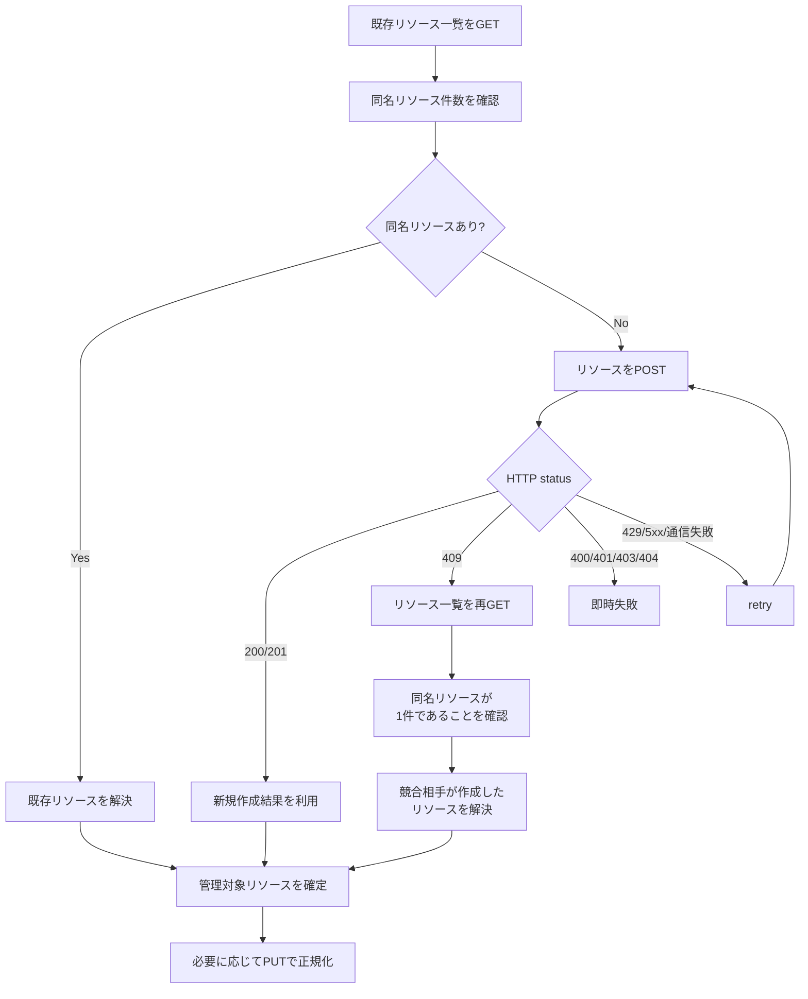
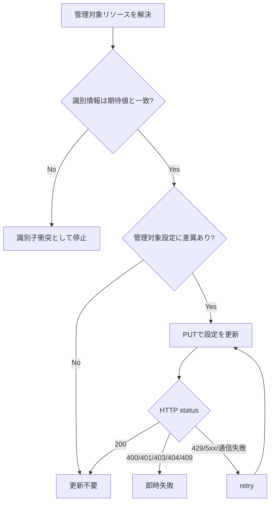
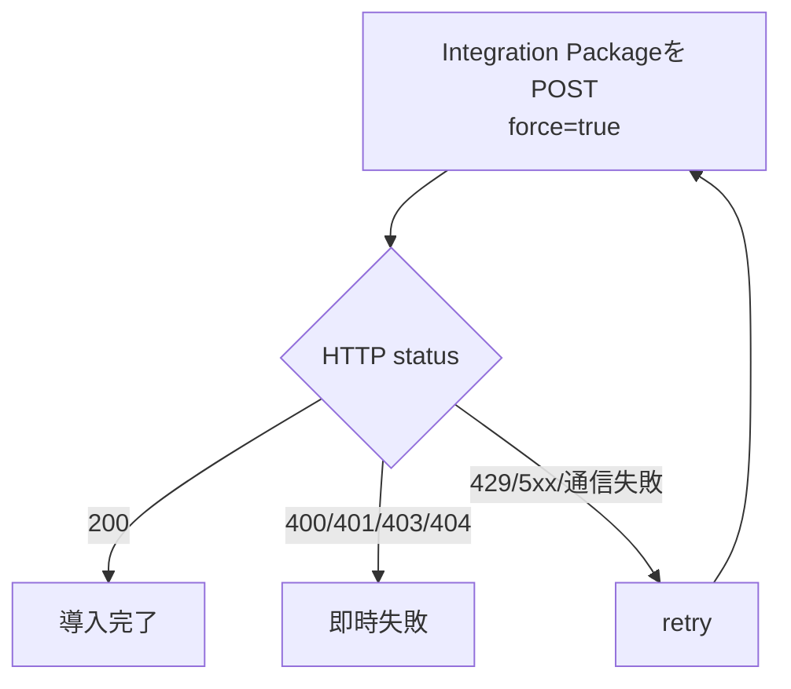

# fleet-bootstrap ロール

本ロールは, Kibana の Fleet API へ接続して Logstashを送信先とするFleet Output, 5種類のElastic Agent ポリシー, Package Policy及びEnrollment Tokenを作成又は更新するための初期化ロールです。5種類のElastic Agent ポリシーは, ホスト監視, Kubernetesシステム監視, Kubernetesワークロード監視, Kubernetesクラスタ監視及びKubernetes API監査ログ収集に対応します。加えて, Logstashの下流にあるElasticsearchに対して `_cluster/health` を対象ホスト上での疎通確認と外部ホストからの疎通確認に分けて確認し, 接続先の到達性も同時に検証します。`fleet-server` と `fleet-bootstrap` を同一 `ansible-playbook` 実行で連続適用することを前提とし, Fleet Server ロール側で設定された Fleet API 呼び出し用のキーを用いて, Fleet APIに接続し, Fleet Serverの設定を行います。
本ロールでは, コンテナ起動やサービス管理は行わず, 既存の Fleet Serverの設定作業のみを実施します。

## 目次

- [fleet-bootstrap ロール](#fleet-bootstrap-ロール)
  - [目次](#目次)
  - [用語](#用語)
  - [概要](#概要)
    - [Elastic Agentポリシー構成種別ごとの採取対象](#elastic-agentポリシー構成種別ごとの採取対象)
      - [host構成種別](#host構成種別)
      - [k8s\_system構成種別](#k8s_system構成種別)
      - [k8s\_workload構成種別](#k8s_workload構成種別)
      - [k8s\_cluster構成種別](#k8s_cluster構成種別)
      - [k8s\_audit構成種別](#k8s_audit構成種別)
        - [Kubernetes統合のクラスタ状態情報](#kubernetes統合のクラスタ状態情報)
        - [現行で採取対象外の情報](#現行で採取対象外の情報)
        - [現行で採取対象外の設定項目](#現行で採取対象外の設定項目)
  - [前提条件](#前提条件)
  - [実行方法](#実行方法)
    - [fleet-bootstrapロールの実行方法](#fleet-bootstrapロールの実行方法)
  - [主要変数](#主要変数)
    - [各ロール固有の利用者入力値](#各ロール固有の利用者入力値)
      - [必須入力値](#必須入力値)
      - [任意入力値](#任意入力値)
      - [設定先別の利用者入力値](#設定先別の利用者入力値)
        - [vars/all-config.yml に設定する項目](#varsall-configyml-に設定する項目)
        - [host\_vars に設定する項目](#host_vars-に設定する項目)
    - [Elastic Stack間共有設定値](#elastic-stack間共有設定値)
    - [設定例](#設定例)
  - [テンプレートと生成ファイル](#テンプレートと生成ファイル)
  - [実行フロー](#実行フロー)
  - [検証ポイント](#検証ポイント)
    - [検証の前提条件](#検証の前提条件)
    - [検証環境の設定](#検証環境の設定)
    - [検証コマンドと期待結果](#検証コマンドと期待結果)
      - [1. Kibana の Fleet API から生成結果を確認](#1-kibana-の-fleet-api-から生成結果を確認)
      - [2. Fleet Output 用 Elasticsearch hosts の対象ホスト上での疎通確認を確認](#2-fleet-output-用-elasticsearch-hosts-の対象ホスト上での疎通確認を確認)
      - [3. Fleet Output 用 Elasticsearch hosts の外部ホストからの疎通確認を確認](#3-fleet-output-用-elasticsearch-hosts-の外部ホストからの疎通確認を確認)
  - [トラブルシューティング](#トラブルシューティング)
    - [1. API キー未設定または不正値で実行に失敗する場合](#1-api-キー未設定または不正値で実行に失敗する場合)
    - [2. Kibana への接続に失敗する場合](#2-kibana-への接続に失敗する場合)
    - [3. KibanaのFleet APIでPOST処理がtimeoutする場合](#3-kibanaのfleet-apiでpost処理がtimeoutする場合)
    - [4. Output, Policy, 認証情報の作成後に一覧に反映されない場合](#4-output-policy-認証情報の作成後に一覧に反映されない場合)
    - [5. Elasticsearch hosts の health check に失敗する場合](#5-elasticsearch-hosts-の-health-check-に失敗する場合)
    - [6. Enrollment Token共有ファイルの保存に失敗する場合](#6-enrollment-token共有ファイルの保存に失敗する場合)
  - [注意事項](#注意事項)
  - [付録](#付録)
    - [Fleet APIリソースの冪等管理](#fleet-apiリソースの冪等管理)
      - [名前付きリソースの作成と409 Conflictの回復](#名前付きリソースの作成と409-conflictの回復)
      - [既存リソースの正規化](#既存リソースの正規化)
      - [Integration Package導入処理](#integration-package導入処理)
      - [HTTP APIエラー時の再試行方針](#http-apiエラー時の再試行方針)
  - [参考資料](#参考資料)
    - [公式ドキュメント](#公式ドキュメント)
    - [関連ロール](#関連ロール)

## 用語

| 正式名称 | 略称 | 意味 |
| --- | --- | --- |
| Ansible | - | 設定の同一化や導入作業を所定の手順に従って自動化する仕組み。 |
| Playbook | - | 自動化処理の実行手順を記述したファイル。 |
| Helm Chart | - | Helmで導入するKubernetesリソース定義のまとまり。 |
| rollout | - | Deploymentなどの更新適用状況を確認する処理。 |
| kubeconfig | - | Kubernetes API接続先と認証情報を記述した設定ファイル。 |
| hostPath | - | Podがノード上のファイルパスを直接参照するためのボリューム定義。 |
| preset | - | Helm valuesで導入構成を選択する設定項目。 |
| clusterWide | - | Kubernetesクラスタ全体を対象として共通処理を実行するためのHelm valuesで指定する導入構成の選択値。 |
| perNode | - | Kubernetesを構成するノードで実施する処理を実行するためのHelm valuesで指定する導入構成の選択値。 |
| kube-state-metrics | - | Elastic StackでKubernetesリソース状態を収集するために利用するメトリクス公開コンポーネント。 |
| Elasticsearch | - | ログやメトリクス情報を集約, 検索するためのサーバソフトウェア。 |
| Elasticsearchのセキュリティ機能 | - | Elasticsearchへの接続者を認証し, 利用者に付与した権限に基づいて実行可能な操作を制御する機能。 |
| Snapshot Repository | - | Elasticsearch がバックアップデータを保存する場所として参照する保存先の定義。 |
| snapshot | - | ある時点の Elasticsearch データを復旧可能な形で保存したバックアップ単位。 |
| Snapshot API | - | Elasticsearch の snapshot 作成, 一覧取得, 削除, 復元を行う操作手順。 |
| Kibana | - | Elasticsearchに保存されたデータを可視化し, 参照するソフトウェア。 |
| Logstash | - | 受信したデータを整形し, 送信先へ転送するソフトウェア。 |
| Fleet Server | - | Elastic Agent の管理通信を受け付けるサーバ機能。 |
| Elastic Agent | - | ログやメトリクスを収集して送信する実行要素。 |
| Fleet Output | - | Elastic Agent が送信先として利用する出力設定。 |
| Elastic Agent ポリシー | - | Fleetが管理し, Elastic Agentのデータ収集方法と動作を定める設定情報。 |
| Enrollment Token | - | Elastic AgentがFleet Serverへの登録を許可されていることを確認し, 登録先のElastic Agent ポリシーを特定するための登録用認証情報。 |
| Enrollment Token共有ファイル | - | Fleet BootstrapがEnrollment Tokenを制御ホスト上へ保存し, Elastic Agent本体ロールがFleet Serverへの登録時に読み込む権限`0600`のYAMLファイル。 |
| Fleet Serverサービスアカウントトークンファイル | - | Fleet ServerがElasticsearchへ接続するためのサービスアカウントトークンを対象ホスト上へ保存し, Fleet Serverコンテナが起動時に読み込む権限`0600`のファイル。 |
| Classless Inter-Domain Routing | CIDR | Internet Protocolアドレスの範囲を先頭アドレスと接頭辞長で表す方式。 |
| Docker bridge network | Dockerブリッジネットワーク | 同一対象ホスト上のコンテナ間通信に使用する仮想的なネットワーク。 |
| Network Address Translation | NAT | 通信時にIPアドレスを変換する処理。 |
| systemd | - | Linux上でサービスの起動順序と実行状態を管理するソフトウェア。 |
| pipeline | - | 入力, 整形, 出力の処理順を定義する Logstash の設定単位。 |
| Elastic Agent入力 | - | Elastic Agentからデータストリーム情報を保持したイベントを受信するLogstashの入力機能。 |
| Host Variables | host_vars | ホスト単位の設定値を格納する変数定義。 |
| Ansible Inventory | inventory | 実行対象ホストの一覧と接続情報を管理する定義。 |
| inventory group | - | Ansible Inventory内で同じ役割の対象ホストをまとめる識別単位。 |
| single-node | - | Elasticsearch を単一ノード構成で構成する方式。コンテナイメージを用いた導入時に典型的に用いられる。 |
| Hypertext Transfer Protocol | HTTP | World Wide Webで情報をやり取りする通信手順。 |
| Internet Protocol | IP | ネットワーク上で宛先を識別し, データを届けるための通信手順。 |
| World Wide Web | WWW | ネットワーク上で文書や情報を相互参照できる仕組み。 |
| Uniform Resource Locator | URL | World Wide Web上の資源の場所を示す文字列。 |
| Fully Qualified Domain Name | FQDN | 末尾まで省略せず書いた完全なドメイン名。 |
| Operating System | OS | 計算機の基本機能を管理し, アプリケーションを動作させる基盤ソフトウェア。 |
| Linux | - | 多くの機器で使われる, 基本ソフトウェアの系統。 |
| Debian | - | コミュニティ主導で開発される Linux ディストリビューション。 |
| Red Hat | - | Red Hat Enterprise Linuxなどを提供する組織。 |
| Red Hat Enterprise Linux | RHEL | Red Hatが提供する企業向けLinuxディストリビューション。 |
| root | - | Unix 系システムの最上位権限を持つ管理者識別子。 |
| cron | - | 指定した時刻や周期でコマンドを自動実行する仕組み。 |
| Ansible Playbook | Playbook | Ansibleで実行する処理の順序と対象を記述したファイル。 |
| iptables | - | Linux の IPv4 パケットフィルタ設定ツール。 |
| ip6tables | - | Linux の IPv6 パケットフィルタ設定ツール。 |
| Python | - | スクリプティングやアプリケーション開発を手早く実施するために用いられる高水準プログラミング言語の一種。 |
| Canonical | - | Ubuntu を提供する組織名。 |
| Structured Query Language | SQL | データベースを操作するための記述言語。 |
| RPM Package Manager | RPM | RPM形式パッケージの導入, 更新, 削除, 情報参照を行う仕組み。 |
| Virtual Machine | VM | 物理計算機上で動作する仮想的な計算機。 |
| Central Processing Unit | CPU | 計算処理を実行する中核部品。 |
| Hypertext Transfer Protocol Secure | HTTPS | 通信内容を暗号化してWorld Wide Web通信を行う方式。 |
| localhost | - | 同一機器自身を指す名前。 |
| Kubernetes | K8s | コンテナを管理する基盤ソフトウェア。 |
| Kubernetes API監査機能 ( Kubernetes API Audit )| - | Kubernetesクラスター内の一連の行動を記録するセキュリティに関連した時系列の記録を提供する機能。 |
| Pod | - | Kubernetes でコンテナをまとめて管理する最小単位。 |
| Ubuntu | - | Canonical が提供する Debian 系の Linux ディストリビューション。 |
| Service | - | サービスの英語表記。 |
| Node | - | ノードの英語表記。 |
| Package Policy | - | Elastic Agent ポリシーへ追加する収集内容と統合パッケージの設定。 |
| Application Programming Interface | API | アプリケーション同士が機能やデータをやり取りするための取り決め。 |
| Ansible Task | task | 自動化処理の最小単位となる実行項目。 |
| Elastic Stack | - | Elasticsearch, Kibana, Logstash, Fleet Server, Fleet Bootstrap, Elastic Agent などで構成される, 収集, 蓄積, 検索, 可視化を行うソフトウェア群。 |
| YAML | - | 設定を読みやすい形式で表す記述方法。 |
| Makefile | - | 実行手順を定義したファイル。 |
| Key-Value | - | キーと値の組で情報を表す方式。 |
| Elasticsearchのサービスアカウントトークン ( Elasticsearch Service Account Token ) | - | Elasticsearchが提供するサービスアカウントに紐付く認証情報。 |
| Fleet Bootstrap | - | Fleet API を使用して Fleet の初期設定と Enrollment Token 共有を実施する初期化ロール。 |
| Deployment | - | Kubernetesで複数のPodの作成, 更新, 維持を管理するリソース。 |
| DaemonSet | - | Kubernetesで各ノードへPodを常駐配置するリソース。 |
| ConfigMap | - | 設定値をキーと値の組で保存するKubernetesリソース。 |
| Secret | - | 秘密情報を保存するKubernetesリソース。 |
| Service Account | - | Kubernetes上でPodがAPIを利用する主体を識別する情報。 |
| ロール | - | Ansible における処理のまとまり。 |
| System統合 | - | Elastic Agentが対象ホストのログとメトリクス情報を収集するための統合パッケージ。 |
| Custom Logs統合 | - | Elastic Agentが指定されたログファイルからテキストを収集するための統合パッケージ。 |
| インデックス | - | Elasticsearch に保存するデータの格納先識別単位。 |
| コンテナイメージ | - | コンテナ実行に必要な内容をまとめた保存形式。 |
| コンテナ | - | アプリケーションを動かす隔離された実行単位。 |
| ホスト | - | 管理対象として識別される個別の計算機。 |
| 制御ホスト | - | Playbook を実行し, 他ホストへの処理指示を行う管理用ホスト。 |
| 対象ホスト | - | Playbook による設定変更や導入処理の適用先となるホスト。 |
| サーバ | - | 他の機器や利用者へ機能やデータを提供する計算機, 又はその役割。 |
| ネットワーク | - | 機器同士を接続してデータをやり取りする仕組み。 |
| ディレクトリ | - | ファイルを階層的に整理するための入れ物。 |
| ログ | - | 処理の結果や状態を時系列で記録した情報。 |
| メトリクス | - | ホストやサービスの状態を数値で表した観測情報。 |
| データ | - | 処理や保存の対象となる情報。 |
| ポート | - | 通信の出入口を識別する番号または接点。 |
| URL スキーム | - | URL の先頭で通信方式を示す部分。例: `http`, `https`。 |
| ランタイムエンドポイント ( rumtime endpoint ) | - | 対象ホスト上で所定のサービスが動作していることを確認するための疎通確認に用いるエンドポイントです。ここでのエンドポイントは, <接続先ホスト名>と<接続先ポート番号>の組から構成されるURLになります。本ロールで規定した変数により明示的に指定されたエンドポイントがあればその値を採用し, 未指定の場合は, 対象ホスト名とポート番号からエンドポイントを組み立てます。 |
| 対象ホスト上での疎通確認 | - | 対象ホスト上で自ホスト(localhost)を指定して待ち受け先ポートへの疎通確認を実施すること。確認対象のサービスが対象ホスト上で起動していることを確認します。 |
| 外部ホストからの疎通確認 | - | 対象ホスト以外のホストから対象ホストを指定して待ち受け先ポートへの疎通確認を実施すること。確認対象のサービスがネットワーク接続を含めて適切に設定され, サービス受付可能な状態になっていることを確認します。 |
| ディストリビューション | - | 基本ソフトウェアと関連部品をまとめた配布形態。 |
| コミュニティ | - | 共通目的のもとで継続的に活動する利用者集団。 |
| ホストメトリクス ( host metrics ) | - | リソース使用状況など, ログ収集対象となるホスト群から収集する情報。 |
| ループ | - | 同じ処理を繰り返すこと。 |
| バックエンド | - | 利用者画面の背後で処理を実行する側。 |
| メタデータ | - | 対象データの属性や説明を示す付加情報。 |
| リソース | - | 処理に必要な計算機資源やデータ。 |
| コマンド | - | 実行者が計算機へ処理を指示するための命令。 |
| サービス | - | 機能を利用者や他システムへ提供する仕組み。 |
| ユーザ | - | 機能を利用する人, 又は識別された利用主体。 |
| ツール | - | 特定作業を実行するための機能や道具。 |
| Elasticsearch のクラスタ | - | 複数の Elasticsearch ノードを連携させて一体運用する構成。 |
| プログラム | - | 計算機に処理をさせるための命令列。 |
| プラグイン | - | 既存機能へ追加機能を組み込むための拡張部品。 |
| コンテナランタイム | - | コンテナを起動, 停止, 管理する実行基盤。 |
| リクエスト | - | 処理実行や情報取得を要求する操作。 |
| コントローラ | - | 対象状態を監視し, 期待状態へ調整する制御機能。 |
| ストレージ | - | データを保存する仕組み。 |
| インストール | - | ソフトウェアを導入して利用可能にする作業。 |
| マシン | - | 処理を実行する計算機。 |
| プロビジョニング | - | 利用開始に必要な設定や資源を準備する作業。 |
| ルーティング | - | 宛先までの経路を選択して転送する処理。 |
| オブジェクト | - | ひとかたまりとして扱うデータ単位。 |
| エージェント | - | 指示に従って処理を代行する構成要素。 |
| ストア | - | データや成果物を保存する場所。 |
| ジャーナル | - | 時系列の記録を保持する仕組み。 |
| アカウント | - | 利用者や処理主体を識別する登録情報。 |
| エンドポイント | - | 通信の接続先を表す識別点。 |
| パターン | - | 繰り返し現れる構造や記述形式。 |
| パケット | - | ネットワークで転送するデータ単位。 |
| カーネル | - | 基本ソフトウェアの中核機能。 |
| シェル | - | コマンド入力で計算機を操作する仕組み。 |
| ソフトウェア | - | 情報処理システムで使用するプログラム, 手順, 規則及び関連文書の全体又は一部分。 |
| システム | - | 複数の要素が連携して目的を実現する仕組み全体。 |
| アプリケーション | - | 利用者の目的を実現するために動作するソフトウェア。 |
| パッケージ | - | ソフトウェア導入に必要なファイルをまとめた配布単位。 |
| リポジトリ | - | ソフトウェアや設定情報を保管し, 取得できるようにした管理場所。 |
| ノード | - | ネットワークに接続された機器または処理単位。 |
| アドレス | - | 宛先や所在を識別するための情報。 |
| プロトコル | - | 通信やデータ交換の手順を定めた取り決め。 |
| コード | - | 処理内容を記述した文字列。 |
| ファイルシステム | - | 記憶装置上のファイルとディレクトリを管理する仕組み。 |
| プロセス | - | 実行中のプログラムを管理する単位。 |
| 名前空間 ( namespace ) | - | Kubernetes内部でリソースを論理的に分離する単位。 |
| サービスアカウント (Service Account) | - | 自動処理中でサービスを呼び出す側のプログラムを識別するための識別情報。 |
| Elastic Agentポリシー構成種別 | - | Fleet Bootstrap ロールの `fleet_bootstrap_agent_policy_profiles` で管理する `host`, `k8s_system`, `k8s_workload`, `k8s_cluster` の4種類を指す, Elastic Stack固有の分類単位。 |
| 統合パッケージ | - | Elastic Agentへデータの収集方法と収集項目を追加するためのパッケージ。 |
| Docker Compose | - | 複数のコンテナ定義をまとめて作成, 起動, 停止, 更新する仕組み。 |
| Docker Compose 定義ファイル | - | Docker Compose が参照するコンテナ構成の定義ファイル。 |
| compose project 名 | - | Docker Compose によって展開される個々のアプリケーションを識別する名前です。展開されたコンテナ, ネットワーク, ボリュームなどのリソースをグループ化し, 他のアプリケーション又は別途展開された同じアプリケーションと区別するために用います。 |
| Helm導入識別名 ( Helm release ) | - | Helm が管理する導入単位を識別する名前。 |
| values ファイル | - | Helm Chartへ渡す設定値を定義したYAMLファイル。 |
| ansible-playbookコマンド | ansible-playbook | Ansible Playbook を実行して自動構成処理を適用するコマンド。 |
| Docker | - | コンテナイメージやコンテナの作成, 実行, 管理を行うコマンド。 |
| sudoコマンド | sudo | 一時的に管理者権限でコマンドを実行するためのコマンド。 |
| makeコマンド | make | Makefile に定義された処理を実行するコマンド。 |
| curlコマンド | curl | URL を指定して通信結果を取得するコマンド。 |
| 環境変数 | - | 実行時の動作を調整するために外部から渡す設定値。 |
| dockerコマンド | - | Dockerブリッジネットワークを作成及び確認するコマンド。 |
| iptablesコマンド | - | IPパケットの通過条件とNAT規則を確認するコマンド。 |
| ip6tablesコマンド | - | IPv6パケットの通過条件とNAT規則を確認するコマンド。 |
| systemctlコマンド | - | systemdが管理するサービスの状態を確認するコマンド。 |
| jqコマンド | jq | JSON 形式のデータから必要な項目だけを抽出して表示するコマンド。 |
| yqコマンド | yq | YAML 形式のデータから必要な項目だけを抽出して表示するコマンド。 |
| statコマンド | stat | ファイルの権限, 大きさ及び名前を表示するコマンド。 |
| journalctlコマンド | journalctl | サービスが記録したログを確認するコマンド。 |
| elastic-agentコマンド | elastic-agent | Elastic Agentの版数確認や管理処理を実行するコマンド。 |
| Helm | - | Kubernetes向けパッケージを導入, 更新, 削除するコマンド。 |
| helmコマンド | helm | Kubernetes向けパッケージの導入, 更新, 状態確認を実施するコマンド。 |
| kubectlコマンド | kubectl | Kubernetes API と通信してリソースを操作, 参照するコマンド。 |
| grepコマンド | grep | テキストの中から条件に一致する行を抽出するコマンド。 |
| tailコマンド | tail | テキストの末尾側を表示するコマンド。 |

## 概要

本ロールは, KibanaのFleet APIを使用してFleetの初期設定を行います。本ロールの担当作業は次のとおりです:

- KibanaのFleet APIを使用して, Fleet APIを使用できる状態にします。
- KibanaのFleet APIを使用し, KibanaのFleet機能を利用できる状態へ初期化します。
  - Fleet Server接続先とデータ送信先を設定します。
    - Fleetに既定のFleet Server host設定が存在しない場合は, `fleet_bootstrap_fleet_server_host_name`変数で指定した名称と`fleet_bootstrap_fleet_server_host_urls_explicit`変数で指定した接続先一覧を使用して作成します。
      - `fleet_bootstrap_fleet_server_host_urls_explicit`変数で接続先一覧を指定していない場合は, Fleet Serverロールが設定した接続先を使用します。
    - Elastic Agentが収集したデータとElastic Agent自身の監視データをLogstashへ送信するFleet Outputを作成又は更新し, 両方の既定出力に設定します。
      - Fleet Server専用Elasticsearch Outputを作成又は更新し, Fleet Server用Elastic Agent ポリシーへ設定します。
  - Elastic Agentのデータ収集設定を準備します。
    - Fleet Server統合, System統合及びCustom Logs統合を導入します。
    - Elastic Stack間で共有するFleet Server用Elastic Agent ポリシーIDを使用してポリシーを作成又は再利用し, Fleet Server統合を関連付けます。
    - ホスト監視, Kubernetesシステム監視, Kubernetesワークロード監視, Kubernetesクラスタ監視及びKubernetes API監査ログ収集に使用する5種類のElastic Agent ポリシーを作成又は再利用します。
      - ホスト監視では, 対象ホストのCPU使用状況, データを一時保持する領域の使用状況及び指定したホスト上のログを収集します。
      - Kubernetesシステム監視では, ホスト監視の収集対象に加えて, Kubernetesノードのファイルシステムとプロセスの情報及びKubernetesの`kube-system`名前空間に属するコンテナのログを収集します。
      - Kubernetesワークロード監視では, Kubernetesシステム監視の収集対象に加えて, Kubernetesの`kube-system`名前空間に属さないコンテナのログを収集します。
      - Kubernetesクラスタ監視では, Kubernetesクラスタの状態情報を収集します。
      - Kubernetes API監査ログ収集では, control-planeノード上の`/var/log/kubernetes/audit/audit.log`を`audit-logs-filestream`入力から収集します。
    - 各Elastic Agent ポリシーの条件に応じてSystem統合を作成又は更新し, Custom Logs統合のPackage Policyを作成又は更新します。
  - Elastic Agentの登録情報を準備します。
    - 各Elastic Agent ポリシーのEnrollment Tokenを作成又は再利用し, 既存Enrollment Tokenを再利用する場合はFleet APIから秘密値を取得します。
  - KibanaのFleet機能の初期設定結果を検証します。
    - Fleet Output, Fleet Server用を含むElastic Agent ポリシー, Package Policy及びEnrollment Tokenが期待した状態であることをFleet APIで検証します。
- 5種類のElastic Agent ポリシーに対応するEnrollment TokenをEnrollment Token共有ファイルへ保存します。
- Logstashの下流にあるElasticsearchへの対象ホスト上での疎通確認を実施し, 指定時は外部ホストからの疎通確認も実施します。
5種類の通常Agent用Elastic Agent ポリシーは個別の出力IDを持たず, 既定のLogstash Outputを継承します。Fleet Server統合の追加時だけFleet Server専用Elasticsearch Outputを一時的な既定出力に設定し, 統合追加後にLogstash Outputを既定出力へ戻します。この切替により, Basicライセンスで通常AgentはLogstashへ送信し, Fleet Serverは専用Elasticsearch Outputを使用してElasticsearchへ直接接続します。

本ロールの実行結果及び成果物を使用して, Fleet ServerロールとElastic Agentロールは次の作業を実施します。

- Fleet Serverロールは, Fleet Bootstrapロールが管理するPackage Policyを含むElastic Agent ポリシーをElastic Agentへ配布します。
- Elastic Agentロールは, 対象ホストで収集するログやメトリクス情報の集合に応じてEnrollment TokenをEnrollment Token共有ファイル内の辞書から選択し, Fleet Serverへ登録します。
- 登録されたElastic Agentは, Fleet ServerからElastic Agent ポリシーを取得します。

`fleet_bootstrap_enrollment_token_file`に関する説明は, 本書の「用語」節の「Enrollment Token共有ファイル」及び「テンプレートと生成ファイル」節を参照してください。

### Elastic Agentポリシー構成種別ごとの採取対象

本ロールの `fleet_bootstrap_agent_policy_profiles` で定義する5種類のElastic Agentポリシー構成種別は, `include_system`, `include_k8s_system`, `include_k8s_workload`, `include_k8s_cluster`, `include_k8s_audit` の組み合わせによって, 各Policyに追加されるPackage Policyの構成を切り替えます。

本節の「採取に必要な設定」のうち, 利用者が設定する項目の設定先は「主要変数」節の「設定先別の利用者入力値」で定義します。`include_system`, `include_k8s_system`, `include_k8s_workload`, `include_k8s_cluster`, `include_k8s_audit` は, `vars/logging-backend-common.yml` の `fleet_bootstrap_agent_policy_profiles` でロール内部既定値として管理します。

#### host構成種別

| 区分 | 採取内容 | 採取に必要な設定 | 設定先 |
| --- | --- | --- | --- |
| 現行で採取する情報 | System統合によるホストの基本メトリクス情報及びCustom Logs統合で指定したログファイル。 | `include_system: true`, `include_k8s_system: false`, `include_k8s_workload: false`, `logging_elastic_agent_host_log_input_enabled`。 | `include_*` は `vars/logging-backend-common.yml` の `fleet_bootstrap_agent_policy_profiles`。`logging_elastic_agent_host_log_input_enabled` は「主要変数」節の「設定先別の利用者入力値」を参照してください。 |
| 現行で採取対象外の情報 | Kubernetesコンテナログ及びKubernetesクラスタ状態情報。 | `include_k8s_system: false`, `include_k8s_workload: false`, `include_k8s_cluster: false`。 | `vars/logging-backend-common.yml` の `fleet_bootstrap_agent_policy_profiles`。 |

#### k8s_system構成種別

| 区分 | 採取内容 | 採取に必要な設定 | 設定先 |
| --- | --- | --- | --- |
| 現行で採取する情報 | host構成種別の採取情報に加えて, Kubernetesの`kube-system`名前空間に属するコンテナログ。 | `include_system: true`, `include_k8s_system: true`, `logging_elastic_agent_k8s_system_kube_system_logs_input_enabled`。 | `include_*` は `vars/logging-backend-common.yml` の `fleet_bootstrap_agent_policy_profiles`。`logging_elastic_agent_k8s_system_kube_system_logs_input_enabled` は「主要変数」節の「設定先別の利用者入力値」を参照してください。 |
| 現行で採取対象外の情報 | `kube-system`名前空間以外のKubernetesワークロードログ及びKubernetesクラスタ状態情報。 | `include_k8s_workload: false`, `include_k8s_cluster: false`。 | `vars/logging-backend-common.yml` の `fleet_bootstrap_agent_policy_profiles`。 |

#### k8s_workload構成種別

| 区分 | 採取内容 | 採取に必要な設定 | 設定先 |
| --- | --- | --- | --- |
| 現行で採取する情報 | k8s_system構成種別の採取情報に加えて, `kube-system`名前空間以外のKubernetesワークロードログ。 | `include_system: true`, `include_k8s_system: true`, `include_k8s_workload: true`, `logging_elastic_agent_k8s_workload_log_input_enabled`。 | `include_*` は `vars/logging-backend-common.yml` の `fleet_bootstrap_agent_policy_profiles`。`logging_elastic_agent_k8s_workload_log_input_enabled` は「主要変数」節の「設定先別の利用者入力値」を参照してください。 |
| 現行で採取対象外の情報 | Kubernetesクラスタ状態情報。 | `include_k8s_cluster: false`。 | `vars/logging-backend-common.yml` の `fleet_bootstrap_agent_policy_profiles`。 |

#### k8s_cluster構成種別

| 区分 | 採取内容 | 採取に必要な設定 | 設定先 |
| --- | --- | --- | --- |
| 現行で採取する情報 | Custom Logs統合で指定したログファイルに加えて, Kubernetes統合のクラスタ状態情報。詳細は本節の「Kubernetes統合のクラスタ状態情報」を参照してください。 | `include_system: false`, `include_k8s_system: false`, `include_k8s_workload: false`, `include_k8s_cluster: true`, `logging_elastic_agent_host_log_input_enabled: true`, `logging_backend_elastic_agent_k8s_cluster_package_policy_enabled: true`。必要に応じて `logging_elastic_agent_k8s_cluster_metrics_period` を指定します。 | `include_*` は `vars/logging-backend-common.yml` の `fleet_bootstrap_agent_policy_profiles`。`logging_elastic_agent_*` は「主要変数」節の「設定先別の利用者入力値」を参照してください。 |
| 現行で採取対象外の情報 | Kubernetes統合で無効化している入力情報及びSystem統合の情報。詳細は本節の「現行で採取対象外の情報」を参照してください。 | 無効化対象の設定項目は本節の「現行で採取対象外の設定項目」を参照してください。 | [roles/fleet-bootstrap/tasks/configure-kubernetes-package-policy.yml](roles/fleet-bootstrap/tasks/configure-kubernetes-package-policy.yml) の既定実装で制御します。 |

`k8s_cluster` 構成種別向けのKubernetes統合Package Policyは, 本ロールの実装で自動作成又は自動更新します。`logging_backend_elastic_agent_k8s_cluster_package_policy_enabled` の既定値は `true` であり, `include_k8s_cluster: true` の構成種別が存在する場合にKubernetesクラスタ状態情報を収集するPackage Policyを作成します。

#### k8s_audit構成種別

| 区分 | 採取内容 | 採取に必要な設定 | 設定先 |
| --- | --- | --- | --- |
| 現行で採取する情報 | Kubernetes API監査ログ。Kubernetes統合の`audit-logs-filestream`入力で`/hostfs/var/log/kubernetes/audit/audit.log`を収集し, `kubernetes.audit_logs`データ集合へ格納します。 | `include_system: false`, `include_k8s_system: false`, `include_k8s_workload: false`, `include_k8s_cluster: false`, `include_k8s_audit: true`, `logging_backend_elastic_agent_k8s_audit_package_policy_enabled: true`。 | `include_*`は`vars/logging-backend-common.yml`の`fleet_bootstrap_agent_policy_profiles`。Package Policy設定は「主要変数」節を参照してください。 |
| 現行で採取対象外の情報 | System統合, Custom Logs統合, Kubernetesクラスタ状態メトリクス, Kubernetes event, Kubernetes container logs及びクラウドAudit入力。 | Audit用Package PolicyでAudit filestream以外の入力を明示的に無効化します。 | [roles/fleet-bootstrap/tasks/configure-kubernetes-audit-package-policy.yml](tasks/configure-kubernetes-audit-package-policy.yml)で制御します。 |

`k8s_audit`構成種別では, `logging_backend_elastic_agent_k8s_audit_data_stream_namespace`をPackage Policyの名前空間へ設定します。既定値は`k8s_system`であり, Data Streamは`logs-kubernetes.audit_logs-k8s_system`になります。Audit用Elastic Agent自身の監視対象は`logging_backend_elastic_agent_k8s_audit_monitoring_enabled`, `logging_backend_elastic_agent_k8s_audit_monitoring_logs_enabled`, `logging_backend_elastic_agent_k8s_audit_monitoring_metrics_enabled`で制御します。


##### Kubernetes統合のクラスタ状態情報

[主要変数](#主要変数)に記載している`fleet_bootstrap_k8s_state_`で始まる変数, `fleet_bootstrap_k8s_event_enabled`変数の設定値に応じて, 以下の情報を採取するように設定します:

- `kubernetes.state_deployment`
- `kubernetes.state_statefulset`
- `kubernetes.state_pod`
- `kubernetes.state_node`
- `kubernetes.state_namespace`
- `kubernetes.event`
- `kubernetes.state_daemonset`
- `kubernetes.state_replicaset`
- `kubernetes.state_job`
- `kubernetes.state_storageclass`
- `kubernetes.state_persistentvolume`
- `kubernetes.state_persistentvolumeclaim`
- `kubernetes.state_resourcequota`
- `kubernetes.state_service`
- `kubernetes.state_cronjob`

各項目の意味は, 本書の「[公式ドキュメント](#公式ドキュメント)」節に記載している「統合パッケージ (Elastic integrations)」を参照してください。

##### 現行で採取対象外の情報

本ロールでは, Kubernetes統合から以下のクラスタ状態情報を採取しないように設定します:

- `kubernetes.container`
- `kubernetes.pod`
- `kubernetes.node`
- `kubernetes.volume`
- `kubernetes.system`
- `kubernetes.container_logs`
- `kubernetes.audit_logs`
- System統合で取得するホスト情報

各項目の意味は, 本書の「[公式ドキュメント](#公式ドキュメント)」節に記載している「統合パッケージ (Elastic integrations)」及び「System integration」を参照してください。

##### 現行で採取対象外の設定項目

Kubernetes統合の入力は, Package Policy で未指定の場合に Fleet が有効として扱います。このため, 採取対象外の情報は入力単位で無効化しています。他のロールで収集するログとの重複収集を回避するため, 以下の入力の収集を無効化しています:

- kubelet-kubernetes/metrics: `kubernetes.container`, `kubernetes.pod`, `kubernetes.node`, `kubernetes.volume`, `kubernetes.system` を含み, System統合で収集するホスト情報(例: CPU, メモリ, ファイルシステム, プロセス)と重複するためです。
- container-logs-filestream: `kubernetes.container_logs` を含み, `k8s_system` 構成種別及び `k8s_workload` 構成種別で Custom Logs統合から収集する Kubernetesコンテナログと重複するためです。

重複回避以外の理由で無効化している項目は次のとおりです:

- kube-apiserver-kubernetes/metrics, kube-proxy-kubernetes/metrics, kube-scheduler-kubernetes/metrics, kube-controller-manager-kubernetes/metrics: コントロールプレーンノードの各コンポーネントへの接続設定を本ロールで管理していないためです。
- audit-logs-filestream, audit-logs-aws-cloudwatch, audit-logs-azure-eventhub, audit-logs-gcp-pubsub: `k8s_cluster`構成種別ではKubernetes API監査ログを収集しないためです。監査ログは`k8s_audit`構成種別の専用Kubernetes統合Package Policyで`audit-logs-filestream`だけを有効化して収集します。

各設定項目の意味は, 本書の「[公式ドキュメント](#公式ドキュメント)」節に記載している「統合パッケージ (Elastic integrations)」を参照してください。

## 前提条件

- Kibana の Fleet API へ接続できること。
- 本フェーズの運用では, 単一の `ansible-playbook` 実行で `fleet-server,fleet-bootstrap` を連続適用すること。
- 同一実行内で Fleet Server 側が設定した `fleet_bootstrap_kibana_api_key` を本ロールが利用できること。単独検証時は, Kibana で作成した KibanaのFleet API用の API キーを `host_vars` へ直接設定すること。全対象ホストで同一値を運用する場合だけ `vars/all-config.yml` へ設定すること。
- Elasticsearchのセキュリティ機能が有効な場合は, `elastic_search_security_username` と `elastic_search_bootstrap_password` が利用可能であること。
- [roles/fleet-bootstrap/defaults/main.yml](roles/fleet-bootstrap/defaults/main.yml) に定義した変数を適切に上書きできること。
- Fleet Server の準備後に本ロールを実行すること。
- `fleet_bootstrap_enrollment_token_file`の共通既定値が制御ホスト上の絶対パスとして解決されること。
- `fleet_bootstrap_kibana_url_explicit` と `fleet_bootstrap_elasticsearch_endpoints_explicit` を未設定で運用する場合は, 対象ホスト自身の `127.0.0.1:5601` と `127.0.0.1:9200` に到達可能であること。

## 実行方法

### fleet-bootstrapロールの実行方法

制御ホストで次のいずれかを実行します。

logging backend全体を構成し, Fleet BootstrapによるEnrollment Token共有ファイルの保存まで完了する場合は, 次のコマンドを実行します。

```bash
make run_logging_backend
```

Fleet ServerとFleet Bootstrapだけを連続適用する場合は, 次のコマンドを実行します。

```bash
make run_fleet_bootstrap
```

`make run_fleet_bootstrap` は, 単一の `ansible-playbook` 実行で `fleet-server,fleet-bootstrap` を順に適用します。

```bash
ansible-playbook -i inventory/hosts logging-backend.yml --tags "fleet-server,fleet-bootstrap"
```

`fleet_bootstrap_enrollment_token_file`で指定したEnrollment Token共有ファイルがすでに存在する場合は, 既存のEnrollment Token共有ファイルを再利用し, 最新のEnrollment Token辞書で内容を更新します。

## 主要変数

### 各ロール固有の利用者入力値

#### 必須入力値

| 変数名 | 意味 | 既定値 | 設定例 |
| --- | --- | --- | --- |
| `fleet_bootstrap_output_name` | Elastic Agentの収集データをLogstashへ送信するFleet Outputの名称。 | 空文字列 | `main-logstash-output` |
| `fleet_bootstrap_policy_name` | ホスト監視用Elastic Agent ポリシーの名称。 | 空文字列 | `linux-host-policy` |
| `fleet_bootstrap_enrollment_token_name` | ホスト監視用Enrollment Tokenの名称。 | 空文字列 | `linux-host-token` |

`fleet_bootstrap_kibana_api_key`は, `fleet-server`と本ロールを同一の`ansible-playbook`実行で連続適用する場合はFleet Serverが生成します。本ロールだけを実行する場合は, 有効なAPIキーを明示設定します。

#### 任意入力値

| 変数名 | 意味 | 既定値 | 設定例 |
| --- | --- | --- | --- |
| `fleet_bootstrap_enabled` | Fleet Server導入時の初期化処理実施指示フラグ。Fleet Server導入時の初期化処理を実施する場合は, `true`に設定する。 | `true` | `true` |
| `fleet_bootstrap_kibana_url_explicit` | Kibana の Fleet API 接続先明示指定値。未設定時は対象ホスト上の `http://127.0.0.1:5601` を使用する。 | 空文字列 | `https://kibana.example.org:5601` |
| `fleet_bootstrap_kibana_tls_mode` | Kibana APIのエンドポイントURLスキームが`https`の場合に参照するTLS検証モード。指定可能な値は, [Elasticsearchロールの共有設定値](../elasticsearch/Readme.md#共有設定値に関する補足説明)を参照する。 | `logging_backend_default_tls_mode`の指定値。 | `none` |
| `fleet_bootstrap_kibana_api_key` | Kibanaに設定するKibanaのFleet API用APIキー。`host_vars`に設定することを推奨し, 全対象ホストで同一値を使用する場合だけ`vars/all-config.yml`に設定する。 | 空文字列 | `"your-api-key"` |
| `fleet_bootstrap_kibana_timeout_seconds` | Kibana の Fleet API 接続タイムアウト秒数。package registry 待ちを考慮して長めに設定する。 | `180` | `240` |
| `fleet_bootstrap_kibana_retries` | 外部 API 呼び出しの再試行回数 | `3` | `5` |
| `fleet_bootstrap_kibana_retry_interval_seconds` | 外部 API 呼び出しの再試行間隔秒数 | `5` | `10` |
| `fleet_bootstrap_system_package_version` | System統合パッケージの版数。 | `2.4.0` | `2.4.0` |
| `fleet_bootstrap_filestream_package_version` | Custom Logs統合パッケージの版数。 | `1.2.0` | `1.2.0` |
| `fleet_bootstrap_fleet_server_package_version` | Fleet Server統合パッケージの版数。 | `1.6.1` | `1.6.1` |
| `fleet_bootstrap_kubernetes_package_version` | Kubernetes統合パッケージの版数。 | `1.83.1` | `1.83.1` |
| `fleet_bootstrap_fleet_server_output_name` | Fleet Server用Elastic Agent ポリシーが使用するElasticsearch Outputの名称。 | `fleet-server-elasticsearch-output` | `fleet-server-elasticsearch-output` |
| `fleet_bootstrap_fleet_server_elasticsearch_hosts_explicit` | Fleet Server専用Elasticsearch Outputの送信先一覧明示指定値。未設定時はFleet Serverロールが解決したElasticsearch接続先を使用する。 | 空リスト | [`https://elasticsearch.example.org:9200`] |
| `fleet_bootstrap_enrollment_token_list_page_size` | 既存Enrollment Tokenの検索と検証で一覧APIから取得する最大件数。`1`から`10000`までを指定する。 | `10000` | `10000` |
| `fleet_bootstrap_logstash_hosts_explicit` | Fleet Outputに設定するLogstash接続先一覧明示指定値。未設定時は共通接続先ホストのポート番号5044番を使用する。 | 空リスト | [`logstash.example.org:5044`] |
| `fleet_bootstrap_elasticsearch_endpoints_explicit` | Logstashの下流にあるElasticsearchの疎通確認先一覧明示指定値。未設定時は対象ホスト上の `http://127.0.0.1:9200` を使用する。 | 空リスト | [`https://elasticsearch:9200`] |
| `fleet_bootstrap_fleet_server_host_name` | Fleet Server host 設定へ登録する名称。 | `default-fleet-server-host` | `default-fleet-server-host` |
| `fleet_bootstrap_fleet_server_host_urls_explicit` | Fleet Server host 設定へ登録する接続先一覧明示指定値。未設定時は Fleet Server のランタイムエンドポイント URL を使用する。 | 空リスト | [`https://fleet.example.org:8220`] |
| `fleet_bootstrap_enrollment_token_file` | Enrollment Token共有ファイルの制御ホスト上の絶対パス。 | `{{ playbook_dir }}/group_vars/logging_collector/enrollment-token.yml` | `{{ playbook_dir }}/group_vars/logging_collector/enrollment-token.yml` |
| `fleet_bootstrap_k8s_state_deployment_enabled` | Kubernetes統合Packageからdeployment情報を収集する場合は, trueを指定する。 | `true` | `true` |
| `fleet_bootstrap_k8s_state_statefulset_enabled` | Kubernetes統合Packageからstatefulset情報を収集する場合は, trueを指定する。 | `true` | `true` |
| `fleet_bootstrap_k8s_state_pod_enabled` | Kubernetes統合Packageからpod情報を収集する場合は, trueを指定する。 | `true` | `true` |
| `fleet_bootstrap_k8s_state_node_enabled` | Kubernetes統合Packageからnode情報を収集する場合は, trueを指定する。 | `true` | `true` |
| `fleet_bootstrap_k8s_state_namespace_enabled` | Kubernetes統合Packageからnamespace情報を収集する場合は, trueを指定する。 | `true` | `true` |
| `fleet_bootstrap_k8s_event_enabled` | eventを収集する場合は, trueを指定する。 | `true` | `true` |
| `fleet_bootstrap_k8s_state_daemonset_enabled` | Kubernetes統合Packageからdaemonset情報を収集する場合は, trueを指定する。 | `true` | `true` |
| `fleet_bootstrap_k8s_state_replicaset_enabled` | Kubernetes統合Packageからreplicaset情報を収集する場合は, trueを指定する。 | `true` | `true` |
| `fleet_bootstrap_k8s_state_job_enabled` | Kubernetes統合Packageからjob情報を収集する場合は, trueを指定する。 | `true` | `true` |
| `fleet_bootstrap_k8s_state_storageclass_enabled` | Kubernetes統合Packageからstorageclass情報を収集する場合は, trueを指定する。 | `true` | `true` |
| `fleet_bootstrap_k8s_state_persistentvolume_enabled` | Kubernetes統合Packageからpersistentvolume情報を収集する場合は, trueを指定する。 | `true` | `true` |
| `fleet_bootstrap_k8s_state_persistentvolumeclaim_enabled` | Kubernetes統合Packageからpersistentvolumeclaim情報を収集する場合は, trueを指定する。 | `true` | `true` |
| `fleet_bootstrap_k8s_state_resourcequota_enabled` | Kubernetes統合Packageからresourcequota情報を収集する場合は, trueを指定する。 | `true` | `true` |
| `fleet_bootstrap_k8s_state_service_enabled` | Kubernetes統合Packageからservice情報を収集する場合は, trueを指定する。 | `true` | `true` |
| `fleet_bootstrap_k8s_state_cronjob` | Kubernetes統合Packageからcronjob情報を収集する場合は, trueを指定する。 | `false` | `true` |
| `fleet_bootstrap_debug_auth_diagnostics` | 認証切り分け用の補助 debug 出力有無。通常運用では `false` のままとする。 | `false` | `true` |

#### 設定先別の利用者入力値

利用者入力値のうち, Elastic Agentポリシー構成種別ごとの採取設定に使用する変数は設定先ごとに次のとおり管理します。

##### vars/all-config.yml に設定する項目

全対象ホストで同一値を使用する場合は, `vars/all-config.yml` に設定します。

| 変数名 | 適用対象 | 用途 | 既定値 | 設定例 |
| --- | --- | --- | --- | --- |
| `logging_elastic_agent_host_log_input_enabled` | `host`, `k8s_cluster` | Custom Logs統合の入力設定を有効化又は無効化します。 | `true` | `true` |
| `logging_elastic_agent_k8s_system_kube_system_logs_input_enabled` | `k8s_system` | `kube-system`名前空間コンテナログの入力設定を有効化又は無効化します。 | `true` | `true` |
| `logging_elastic_agent_k8s_system_kube_system_log_paths` | `k8s_system` | `kube-system`名前空間コンテナログを収集するファイルパス一覧を指定します。 | `['/var/log/containers/*_kube-system_*.log']` | `['/var/log/containers/*_kube-system_*.log']` |
| `logging_elastic_agent_k8s_workload_log_input_enabled` | `k8s_workload` | `kube-system`名前空間以外のコンテナログ入力設定を有効化又は無効化します。 | `true` | `true` |
| `logging_backend_elastic_agent_k8s_cluster_package_policy_enabled` | `k8s_cluster` | Kubernetes統合Package Policyの作成又は更新を切り替えます。 | `true` | `true` |
| `logging_backend_elastic_agent_k8s_audit_package_policy_enabled` | `k8s_audit` | Kubernetes API監査ログ用Kubernetes統合Package Policyの作成又は更新を切り替えます。 | `true` | `true` |
| `logging_backend_elastic_agent_k8s_audit_data_stream_namespace` | `k8s_audit` | Kubernetes API監査ログのData Stream名前空間を指定します。 | `k8s_system` | `k8s_system` |
| `logging_backend_elastic_agent_k8s_audit_monitoring_enabled` | `k8s_audit` | Audit用Elastic Agent自身の監視を有効化します。 | 利用者設定 | `true` |
| `logging_backend_elastic_agent_k8s_audit_monitoring_logs_enabled` | `k8s_audit` | Audit用Elastic Agent自身の監視ログを有効化します。 | 利用者設定 | `true` |
| `logging_backend_elastic_agent_k8s_audit_monitoring_metrics_enabled` | `k8s_audit` | Audit用Elastic Agent自身の監視メトリクスを有効化します。 | 利用者設定 | `true` |
| `logging_elastic_agent_k8s_cluster_metrics_period` | `k8s_cluster` | Kubernetesクラスタ状態情報メトリクスの収集周期を指定します。 | `"10s"` | `"30s"` |

##### host_vars に設定する項目

本ロールの利用者入力値は, 原則として `vars/all-config.yml` に設定します。`host_vars` に設定するのは, ホストごとに値を変える場合と, `fleet_bootstrap_kibana_api_key` を単独実行時に設定する場合だけです。上表と同名の変数を `host_vars` に設定する場合は, `vars/all-config.yml` 側の同名定義を削除した上で設定します。

| 変数名 | 適用対象 | 用途 | 既定値 | 設定例 |
| --- | --- | --- | --- | --- |
| `logging_elastic_agent_host_log_input_enabled` | `host`, `k8s_cluster` | 特定ホストだけCustom Logs統合の入力設定を切り替える場合に使用します。 | `true` | `false` |
| `logging_elastic_agent_k8s_system_kube_system_logs_input_enabled` | `k8s_system` | 特定ホストだけ`kube-system`名前空間コンテナログ設定を切り替える場合に使用します。 | `true` | `false` |
| `logging_elastic_agent_k8s_system_kube_system_log_paths` | `k8s_system` | 特定ホストだけ`kube-system`名前空間コンテナログを収集するファイルパス一覧を変更する場合に使用します。 | `['/var/log/containers/*_kube-system_*.log']` | `['/var/log/containers/*_kube-system_*.log']` |
| `logging_elastic_agent_k8s_workload_log_input_enabled` | `k8s_workload` | 特定ホストだけ`kube-system`名前空間以外のコンテナログ設定を切り替える場合に使用します。 | `true` | `false` |
| `logging_backend_elastic_agent_k8s_cluster_package_policy_enabled` | `k8s_cluster` | 特定の実行対象だけKubernetes統合Package Policyの作成又は更新を切り替える場合に使用します。 | `true` | `true` |
| `logging_elastic_agent_k8s_cluster_metrics_period` | `k8s_cluster` | 特定ホストだけKubernetesクラスタ状態情報メトリクス周期を変更する場合に使用します。 | `"10s"` | `"30s"` |

### Elastic Stack間共有設定値

共有設定値の意味, 設定要否, 既定値及び設定例は, [Elasticsearchロールの共有設定値](../elasticsearch/Readme.md#varsall-configymlに設定するelastic-stack間共有設定値)を参照します。Fleet Bootstrapでは, 共通の接続先ホスト, URLスキーム, TLS検証モード, 複数接続先の方式混在禁止及び外部ホストからの疎通確認設定が影響します。

### 設定例

`vars/all-config.yml`に設定する値の例です。既定値のままで動作する項目は記載しません。

```yaml
1: fleet_bootstrap_enabled: true
2: fleet_bootstrap_output_name: "main-logstash-output"
3: fleet_bootstrap_policy_name: "linux-host-policy"
4: fleet_bootstrap_enrollment_token_name: "linux-host-token"
5: logging_backend_elastic_agent_k8s_cluster_package_policy_enabled: true
6: logging_backend_elastic_agent_k8s_audit_package_policy_enabled: true
7: logging_backend_elastic_agent_k8s_audit_data_stream_namespace: "k8s_system"
8: logging_backend_elastic_agent_k8s_audit_monitoring_enabled: true
9: logging_backend_elastic_agent_k8s_audit_monitoring_logs_enabled: true
10: logging_backend_elastic_agent_k8s_audit_monitoring_metrics_enabled: true
```

| 行番号 | 設定値 | 有効になる動作 | 設定背景(未設定時/誤設定時の問題と防止理由) |
| --- | --- | --- | --- |
| 1 | fleet_bootstrap_enabled: true | 本ロールを実行します。 | `false` を設定した場合はFleetの初期化を実施せず, Elastic Agentの登録に必要なEnrollment Tokenが作成されないためです。 |
| 2-4 | fleet_bootstrap_output_name, fleet_bootstrap_policy_name, fleet_bootstrap_enrollment_token_name | 作成又は再利用するFleet Output, Elastic Agent ポリシー, Enrollment Token の名称を指定します。 | これらの既定値は空文字列であり, 未設定の場合は実行時に停止するためです。 |
| 5 | logging_backend_elastic_agent_k8s_cluster_package_policy_enabled: true | k8s_cluster構成種別向けKubernetes統合Package Policyを作成又は更新します。 | 既定値は `true` であり, 未設定時にもPackage Policyを作成できるようにするためです。 |
| 6 | logging_backend_elastic_agent_k8s_audit_package_policy_enabled: true | k8s_audit構成種別向けKubernetes統合Package Policyを作成又は更新します。 | Audit用Package Policyを無効化すると`elastic-agent-k8s-audit`へ監査ログ収集設定が配布されないためです。 |
| 7 | logging_backend_elastic_agent_k8s_audit_data_stream_namespace: "k8s_system" | Kubernetes API監査ログを`k8s_system`名前空間のData Streamへ格納します。 | `logs-kubernetes.audit_logs-k8s_system`として既存のKubernetesシステム系データと同じ論理名前空間で検索するためです。 |
| 8-10 | logging_backend_elastic_agent_k8s_audit_monitoring_* | Audit用Elastic Agent自身の監視, 監視ログ及び監視メトリクスを有効化します。 | 監査ログ収集用Agent自体の稼働状態をFleetから確認できるようにするためです。 |

接続先の指定と認証情報については, 次のとおり既定動作を使用します。

- `fleet_bootstrap_kibana_url_explicit` は, 未設定時に対象ホスト上の `http://127.0.0.1:5601` を使用します。別ホスト上の Kibana を使用する場合だけ設定します。
- `fleet_bootstrap_elasticsearch_endpoints_explicit` は, 未設定時に対象ホスト上の `http://127.0.0.1:9200` を使用します。別ホスト上の Elasticsearch を使用する場合だけ設定します。
- `fleet_bootstrap_kibana_api_key` は, `fleet-server` と本ロールを同一の `ansible-playbook` 実行で連続適用する場合にFleet Serverが生成します。本ロールだけを単独実行する場合だけ, 秘密情報として `host_vars` へ設定します。

## テンプレートと生成ファイル

| 種別 | 入力 | 出力 | 目的 |
| --- | --- | --- | --- |
| タスク生成 | [roles/fleet-bootstrap/tasks/config.yml](roles/fleet-bootstrap/tasks/config.yml) | 既存または新規の Fleet Output, Elastic Agent ポリシー, Package Policy及びEnrollment Token | Kibana の Fleet API を呼び出して初期化対象を設定する。 |
| タスク生成 | [roles/fleet-bootstrap/tasks/install-kubernetes-integration.yml](roles/fleet-bootstrap/tasks/install-kubernetes-integration.yml) | Kubernetes統合パッケージ導入状態 | `include_k8s_cluster: true`のポリシー構成種別が存在する場合にKubernetes統合パッケージを導入する。現行実装では`include_k8s_audit`単独を導入条件に含めていない。 |
| タスク生成 | [roles/fleet-bootstrap/tasks/configure-kubernetes-package-policy.yml](roles/fleet-bootstrap/tasks/configure-kubernetes-package-policy.yml) | k8s_cluster構成種別向けKubernetes統合Package Policy | Kubernetesクラスタ状態情報収集用のストリームを有効化し, 不要な入力を無効化したPackage Policyを作成又は更新する。 |
| タスク生成 | [roles/fleet-bootstrap/tasks/configure-kubernetes-audit-package-policy.yml](roles/fleet-bootstrap/tasks/configure-kubernetes-audit-package-policy.yml) | k8s_audit構成種別向けKubernetes統合Package Policy | `audit-logs-filestream`の`kubernetes.audit_logs`だけを有効化し, その他のKubernetes入力を無効化したPackage Policyを作成又は更新する。 |
| タスク生成 | [roles/fleet-bootstrap/tasks/configure-fleet-server-policy.yml](roles/fleet-bootstrap/tasks/configure-fleet-server-policy.yml) | Fleet Server用Elastic Agent ポリシー及びFleet Server統合 | Fleet Server用Elastic Agent ポリシーを指定IDで作成し, Fleet Server統合を設定する。 |
| Enrollment Token共有ファイル | 5種類のEnrollment Token | `group_vars/logging_collector/enrollment-token.yml` | Elastic Agentへ渡す`elastic_agent_enrollment_tokens`辞書を制御ホスト上へ権限`0600`で保存する。 |
| 変数定義 | [roles/fleet-bootstrap/defaults/main.yml](roles/fleet-bootstrap/defaults/main.yml) | 制御用変数 | 接続先, 既定名, タイムアウト, TLS 設定を提供する。 |

## 実行フロー

1. [roles/fleet-bootstrap/tasks/main.yml](roles/fleet-bootstrap/tasks/main.yml) で各タスクファイルを読み込みます。
2. [roles/fleet-bootstrap/tasks/config.yml](roles/fleet-bootstrap/tasks/config.yml) で Fleet Bootstrap の実行可否と API キー設定を確認します。
3. [roles/fleet-bootstrap/tasks/config.yml](roles/fleet-bootstrap/tasks/config.yml) で KibanaのFleet機能の初期化API を呼び出して, GUI がなくても利用できる前提を整えます。
4. [roles/fleet-bootstrap/tasks/config.yml](roles/fleet-bootstrap/tasks/config.yml) で Fleet Server host 設定を一覧取得し, 既定 host が存在しない場合にのみ作成します。
5. [roles/fleet-bootstrap/tasks/config.yml](roles/fleet-bootstrap/tasks/config.yml) で Fleet Output を一覧取得し, 指定名の既定Logstash Outputが存在しない場合は作成し, 既存設定がLogstash出力の期待値と異なる場合は更新します。
6. [roles/fleet-bootstrap/tasks/config.yml](roles/fleet-bootstrap/tasks/config.yml)でFleet Server統合, System統合及びCustom Logs統合を導入し, `include_k8s_cluster: true`の構成種別がある場合はKubernetes統合も導入します。現行の既定プロファイル一覧には`k8s_cluster`構成種別が存在するため, 続く`k8s_audit` Package Policy作成時にもKubernetes統合パッケージを利用できます。
7. [roles/fleet-bootstrap/tasks/configure-fleet-server-policy.yml](roles/fleet-bootstrap/tasks/configure-fleet-server-policy.yml) でFleet Server専用Elasticsearch Outputを一時的な既定出力に設定し, Fleet Server用Elastic Agent ポリシーを指定IDで作成又は再利用してFleet Server統合を設定した後, Logstash Outputを既定出力へ戻します。Fleet Server自身のAgent IDが空の場合は, 統合追加前に生成された不完全な登録情報を除去してコンテナを再起動します。
8. 5種類の通常Agent用Elastic Agent ポリシーを作成又は再利用し, 各ポリシーの条件に応じてSystem統合, Custom Logs統合, k8s_cluster構成種別向けKubernetes統合又はk8s_audit構成種別向けKubernetes監査ログPackage Policyを作成又は更新します。
9. `fleet_bootstrap_enrollment_token_list_page_size`件までEnrollment Tokenを一覧取得し, 各Elastic Agent ポリシーにKibanaが`指定名 (UUID)`形式で保存したEnrollment Tokenが存在しない場合にのみ作成します。
10. 既存Enrollment Tokenを再利用する場合は, 一覧APIからIDを取得し, 個別取得APIからEnrollment Tokenの秘密値を取得します。
11. 5種類のEnrollment Tokenを辞書として制御ホスト上のEnrollment Token共有ファイルへ権限`0600`で保存し, 保存後にEnrollment Token共有ファイルの種別と権限を検証します。
12. [roles/fleet-bootstrap/tasks/verify.yml](roles/fleet-bootstrap/tasks/verify.yml) で Fleet Output, Fleet Server用を含むElastic Agent ポリシー, Package Policy及びEnrollment Tokenの存在を Fleet API で確認し, 有効化設定に応じてk8s_cluster構成種別及びk8s_audit構成種別向けKubernetes統合Package Policyの入力・ストリーム状態も確認します。
13. [roles/fleet-bootstrap/tasks/verify.yml](roles/fleet-bootstrap/tasks/verify.yml) で Logstashの下流にあるElasticsearchの対象ホスト上での疎通確認と, `logging_verify_external_enabled: true` 時の外部ホストからの疎通確認を `_cluster/health` で確認します。
14. 生成または既存利用された ID と認証情報を, 以後の処理で参照できるようにします。

## 検証ポイント

### 検証の前提条件

検証を始める前に, 次の条件が満たされていることを確認します。

- Kibana の Fleet API へ接続できること。
- 本ロールで利用する API キーが host_vars に直接設定済みであること。全対象ホストで同一値を運用する場合だけ vars/all-config.yml に設定済みであること。
- [roles/fleet-bootstrap/tasks/config.yml](roles/fleet-bootstrap/tasks/config.yml) で作成する対象名が, 既存のKibanaのFleet機能の構成と衝突しないこと。
- 制御ホストで Ansible と ansible-lint が利用できること。
- 制御ホスト上の`fleet_bootstrap_enrollment_token_file`で指定した親ディレクトリへEnrollment Token共有ファイルを作成できること。

### 検証環境の設定

本節では, 検証用の設定内容について説明します。既定値のままで動作する項目は設定しません。

**検証用の vars/all-config.yml**:

```yaml
1: fleet_bootstrap_enabled: true
2: fleet_bootstrap_output_name: "main-logstash-output"
3: fleet_bootstrap_policy_name: "linux-host-policy"
4: fleet_bootstrap_enrollment_token_name: "linux-host-token"
5: logging_backend_elastic_agent_k8s_cluster_package_policy_enabled: true
6: logging_backend_elastic_agent_k8s_audit_package_policy_enabled: true
7: logging_backend_elastic_agent_k8s_audit_data_stream_namespace: "k8s_system"
8: logging_backend_elastic_agent_k8s_audit_monitoring_enabled: true
9: logging_backend_elastic_agent_k8s_audit_monitoring_logs_enabled: true
10: logging_backend_elastic_agent_k8s_audit_monitoring_metrics_enabled: true
```

| 行番号 | 設定値 | 有効になる動作 | 設定背景(未設定時/誤設定時の問題と防止理由) |
| --- | --- | --- | --- |
| 1 | fleet_bootstrap_enabled: true | 本ロールを実行します。 | `false` を設定した場合はFleetの初期化を実施せず, 検証対象のFleet OutputとElastic Agent ポリシーが作成されないためです。 |
| 2-4 | fleet_bootstrap_output_name, fleet_bootstrap_policy_name, fleet_bootstrap_enrollment_token_name | 検証で確認するFleet Output, Elastic Agent ポリシー, Enrollment Token の名称を指定します。 | これらの既定値は空文字列であり, 未設定の場合は実行時に停止し, 検証手順を実行できないためです。 |
| 5 | logging_backend_elastic_agent_k8s_cluster_package_policy_enabled: true | k8s_cluster構成種別向けKubernetes統合Package Policyを検証対象に含めます。 | 既定値は `true` であり, 未設定時にも作成結果を検証できるようにするためです。 |
| 6 | logging_backend_elastic_agent_k8s_audit_package_policy_enabled: true | k8s_audit構成種別向けKubernetes統合Package Policyを検証対象に含めます。 | Kubernetes API監査ログ収集用Package Policyの作成結果を検証するためです。 |
| 7 | logging_backend_elastic_agent_k8s_audit_data_stream_namespace: "k8s_system" | Kubernetes API監査ログのData Stream名前空間を`k8s_system`に設定します。 | `logs-kubernetes.audit_logs-k8s_system`への格納を検証するためです。 |
| 8-10 | logging_backend_elastic_agent_k8s_audit_monitoring_* | Audit用Elastic Agent自身の監視, 監視ログ及び監視メトリクスを有効化します。 | Fleet上でAudit用Elastic Agentの稼働状態を確認できる検証条件にするためです。 |

この設定により, 本ロールで使用するKibanaのFleet機能の対象名が明確になり, 検証手順を実行しやすくなります。Kibana 及び Elasticsearch の接続先は, 対象ホスト上の `http://127.0.0.1:5601` と `http://127.0.0.1:9200` を使用します。

### 検証コマンドと期待結果

#### 1. Kibana の Fleet API から生成結果を確認

**実施対象ホスト**: 制御ホスト

**実行するコマンド**:

```bash
curl -k -H "Authorization: ApiKey ${KIBANA_FLEET_API_KEY}" -H "kbn-xsrf: 1" "https://127.0.0.1:5601/api/fleet/outputs"
```

**期待される出力**:

```plaintext
{"items":[{"name":"main-logstash-output",...}],"total":1,...}
```

**実行結果の例**:

```bash
$ curl -k -H "Authorization: ApiKey ${KIBANA_FLEET_API_KEY}" -H "kbn-xsrf: 1" "https://127.0.0.1:5601/api/fleet/outputs"
{"items":[{"id":"output-id-1","name":"main-logstash-output"}],"total":1,"page":1,"perPage":20}
```

**確認ポイント**:

- 指定した Output 名が一覧に表示されること。
- 生成済みの Policy や認証情報も同様に確認できること。

#### 2. Fleet Output 用 Elasticsearch hosts の対象ホスト上での疎通確認を確認

**実施対象ホスト**: 対象ホスト

**実行するコマンド**:

以下の`DUMMY_ELASTIC_PASSWORD`を`elastic_search_bootstrap_password`の設定値に変更して実行してください。

```bash
curl -sS -u 'elastic:DUMMY_ELASTIC_PASSWORD' "http://127.0.0.1:9200/_cluster/health?wait_for_status=yellow&timeout=60s"
```

**期待される出力**:

```plaintext
{"cluster_name":"shared-logs","status":"yellow",...}
```

**実行結果の例**:
```bash
$ curl -sS -u 'elastic:elastic' 'http://127.0.0.1:9200/_cluster/health?wait_for_status=yellow&timeout=60s'
{"cluster_name":"shared-logs","status":"yellow","timed_out":false,"number_of_nodes":1,"number_of_data_nodes":1,"active_primary_shards":56,"active_shards":56,"relocating_shards":0,"initializing_shards":0,"unassigned_shards":18,"unassigned_primary_shards":0,"delayed_unassigned_shards":0,"number_of_pending_tasks":0,"number_of_in_flight_fetch":0,"task_max_waiting_in_queue_millis":0,"active_shards_percent_as_number":75.67567567567568}
```

**確認ポイント**:

- `fleet_bootstrap_elasticsearch_hosts` に設定した各 URL へ `/_cluster/health` 要求を送信した応答が得られること。
- 応答 JSON の `status` が, Elasticsearch のクラスタ状態が 検索や保存の基本機能は利用できるが一部の予備コピーが未配置である状態 ( `yellow` 状態), または, 予備コピーを含む全データ配置が完了している状態 ( `green` 状態) であること。

#### 3. Fleet Output 用 Elasticsearch hosts の外部ホストからの疎通確認を確認

**実施対象ホスト**: `logging_backend` グループ以外のホスト

**実行するコマンド**:

以下の`DUMMY_ELASTIC_PASSWORD`を`elastic_search_bootstrap_password`の設定値に変更し, `<Elasticsearch導入先ホスト>`の部分をElasticsearch導入先ホストにそれぞれ変更して実行してください。

```bash
curl -sS -u 'elastic:DUMMY_ELASTIC_PASSWORD' 'http://<Elasticsearch導入先ホスト>:9200/_cluster/health?wait_for_status=yellow&timeout=60s'
```

**期待される出力**:

```plaintext
{"cluster_name":"shared-logs","status":"yellow",...}
```

**実行結果の例**:
```bash
curl -sS -u 'elastic:elastic' 'http://observer01.example.org:9200/_cluster/health?wait_for_status=yellow&timeout=60s'
{"cluster_name":"shared-logs","status":"yellow","timed_out":false,"number_of_nodes":1,"number_of_data_nodes":1,"active_primary_shards":56,"active_shards":56,"relocating_shards":0,"initializing_shards":0,"unassigned_shards":18,"unassigned_primary_shards":0,"delayed_unassigned_shards":0,"number_of_pending_tasks":0,"number_of_in_flight_fetch":0,"task_max_waiting_in_queue_millis":0,"active_shards_percent_as_number":75.67567567567568}
```

**確認ポイント**:

- 外部ホストから `fleet_bootstrap_elasticsearch_hosts` に設定した各 URL へ `/_cluster/health` 要求を送信した応答が得られること。
- 応答 JSON の `status` が, Elasticsearch のクラスタ状態が 検索や保存の基本機能は利用できるが一部の予備コピーが未配置である状態 ( `yellow` 状態), または, 予備コピーを含む全データ配置が完了している状態 ( `green` 状態) であること。

## トラブルシューティング

### 1. API キー未設定または不正値で実行に失敗する場合

- 現象: API キーが未設定の状態で本ロールを実行すると, [roles/fleet-bootstrap/tasks/config.yml](roles/fleet-bootstrap/tasks/config.yml) で停止します。
- 対処: Kibana で作成した KibanaのFleet API用の API キーを原則として host_vars に直接設定してください。全対象ホストで同一値を運用する場合だけ vars/all-config.yml へ設定してください。又は `fleet-server,fleet-bootstrap` を同一 `ansible-playbook` 実行で適用して Fleet Server 側の共有値を引き継ぐ方法を使用してください。

### 2. Kibana への接続に失敗する場合

- 現象: Kibana の Fleet API へ接続できず, リクエストが失敗します。
- 対処: `fleet_bootstrap_kibana_url_explicit` を未設定で運用している場合は, 対象ホスト上の `127.0.0.1:5601` に Kibana が待受していることを確認してください。別ホスト上の Kibana を使用する構成では, `fleet_bootstrap_kibana_url_explicit` を明示設定してください。

### 3. KibanaのFleet APIでPOST処理がtimeoutする場合

- 現象: `api/fleet/setup` や `api/fleet/agent_policies` が timeout して停止します。
- 対処: package registry 応答待ちで KibanaのFleet機能の初期化が長時間化することがあるため, `fleet_bootstrap_kibana_timeout_seconds` を 180 秒以上へ調整してください。

### 4. Output, Policy, 認証情報の作成後に一覧に反映されない場合

- 現象: 作成処理は成功しているように見えても, Fleet API の一覧に反映されません。
- 対処: Kibana の Fleet API が利用可能であることを確認し, 作成対象の名前や接続先が正しいこと, および default Fleet Server host 設定が作成済みであることを確認してください。

### 5. Elasticsearch hosts の health check に失敗する場合

- 現象: `fleet_bootstrap_elasticsearch_hosts` の `/_cluster/health` が 200 で応答しません。
- 対処: `fleet_bootstrap_elasticsearch_endpoints_explicit` が正しい URL であること, Elasticsearchのセキュリティ機能が有効な場合は `elastic_search_security_username` と `elastic_search_bootstrap_password` が利用可能であること, そして対象ホストで Elasticsearch が稼働していることを確認してください。

### 6. Enrollment Token共有ファイルの保存に失敗する場合

- 現象: `fleet_bootstrap_enrollment_token_file`が未定義, 空文字列又は相対パスの場合, 又は保存後のEnrollment Token共有ファイルが通常ファイルかつ権限`0600`でない場合に停止します。
- 対処: `vars/logging-backend-common.yml`の共通既定値が制御ホスト上の絶対パスとして解決されることを確認してください。保存先を変更する場合は, `vars/all-config.yml`へ制御ホスト上の絶対パスを指定してください。本ロールは一覧APIで既存Enrollment TokenのIDを特定した後, 個別取得APIから秘密値を取得します。個別取得APIが既存Enrollment Tokenを返さない場合は, Fleet上の同名Enrollment Tokenの状態とFleet APIの応答を確認してください。

## 注意事項

- 本ロールは KibanaのFleet機能の初期化を行うための処理であり, コンテナ起動やサービス管理は実施しません。
- Enrollment Token共有ファイルの保存先は [vars/logging-backend-common.yml](../../vars/logging-backend-common.yml) の共通既定値を使用し, 保存先を変更する場合だけ [vars/all-config.yml](../../vars/all-config.yml) の`fleet_bootstrap_enrollment_token_file`で上書きしてください。
- 既存のKibanaのFleet機能の構成が存在する場合は, 同名の Output, Elastic Agent ポリシー, 認証情報を再利用するように動作します。
- Enrollment Token共有ファイルはFleet上の5種類のEnrollment Tokenと一致する内容へ更新します。
- 認証切り分け用の debug 出力が必要な場合は, `fleet_bootstrap_debug_auth_diagnostics: true` を一時的に指定してください。通常運用では `fleet_bootstrap_debug_auth_diagnostics: false` を維持してください。

## 付録

### Fleet APIリソースの冪等管理

本ロールでは,Fleet APIを使用してOutput,Fleet Server host,Agent Policy,Package Policy及びEnrollment Token等の名前付きリソースを作成又は更新します。

Playbook再実行時の重複作成を防止するとともに,存在確認から作成までの間に同名リソースが作成された場合の競合を回復できるように,存在確認,作成,再取得及び更新を組み合わせて管理します。

#### 名前付きリソースの作成と409 Conflictの回復

名前付きFleetリソースは,原則として以下の処理で管理します。



`409 Conflict`は単純に成功として扱いません。競合発生後に一覧を再取得し,期待するリソースが一意に存在することを確認した上で,そのリソースを後続処理へ引き継ぎます。

この処理は主に以下のリソースで使用します。

| リソース | 識別方法 | `409 Conflict`発生時 |
| --- | --- | --- |
| Fleet Output | `name` | 再取得後に一意性を確認し,必要な設定へ更新 |
| Fleet Server Elasticsearch Output | `name` | 再取得後に一意性を確認し,必要な設定へ更新 |
| Fleet Server host | `name` | 再取得後に一意性を確認し,必要な設定へ更新 |
| Agent Policy | `name`又は固定ID | 再取得後に期待するPolicyを確認 |
| Package Policy | `name` | 再取得後に`package.name`,`policy_id`も確認 |
| Enrollment Token | `policy_id`及び管理名 | 再取得後に一意性を確認 |

#### 既存リソースの正規化

既存リソースが存在する場合は,単に存在することだけをもって正常とは判断せず,Ansibleで指定した設定との差異を確認します。

設定差異がある場合はFleet APIの`PUT`を使用して現在のPlaybook設定へ正規化します。



Package Policyについては,同名であっても以下が異なる場合は別用途のPolicyとの識別子衝突として処理を停止します。

- `package.name`
- `policy_id`

この場合,別用途のPackage PolicyをAnsibleが自動的に上書きすることはありません。

#### Integration Package導入処理

System,Filestream,Fleet Server及びKubernetes Integration Packageは,名前付きFleetリソースの新規作成処理とは異なり,指定versionのPackageを`force: true`で導入します。

この処理では`409 Conflict`を競合回復対象とはしません。



Kubernetes Integration Packageは,`k8s_cluster`又は`k8s_audit`構成種別のいずれかを使用する場合に導入します。

#### HTTP APIエラー時の再試行方針

Fleet API呼び出しでは,HTTP応答を恒久エラーと一時エラーに分類して再試行を制御します。

| 応答 | GET | POST | PUT |
| --- | --- | --- | --- |
| `200` | 成功 | 成功 | 成功 |
| `201` | - | 成功 | - |
| `400`, `401`, `403`, `404` | 即時失敗 | 即時失敗 | 即時失敗 |
| `409` | 原則使用しない | 競合回復処理がある場合は再取得 | 即時失敗 |
| `429` | retry | retry | retry |
| `500`, `502`, `503`, `504` | retry | retry | retry |
| timeout, connection error | retry | retry | retry |

POSTで`409 Conflict`を回復対象とする場合でも,同一要求をそのまま再送するのではなく,一覧を再取得して競合相手が作成したリソースの存在と一意性を確認します。

## 参考資料

### 公式ドキュメント

- [Fleet API docs](https://www.elastic.co/docs/reference/fleet/fleet-api-docs)
- [Fleet enrollment tokens](https://www.elastic.co/docs/reference/fleet/fleet-enrollment-tokens)
- [Service accounts and tokens](https://www.elastic.co/guide/en/elasticsearch/reference/current/service-accounts.html)
- [Fleet agent policies](https://www.elastic.co/docs/reference/fleet/agent-policy)
- [統合パッケージ (Elastic integrations)](https://www.elastic.co/docs/reference/integrations/)
- [Fleet integration policies](https://www.elastic.co/docs/reference/fleet/integration-level-outputs)
- [System integration](https://www.elastic.co/docs/reference/integrations/system)
- [Custom Logs integration](https://www.elastic.co/docs/reference/integrations/filestream)
- [Fleet outputs](https://www.elastic.co/docs/reference/fleet/fleet-settings#output-settings)
- [Fleet and Elastic Agent Guide](https://www.elastic.co/guide/en/fleet/current/index.html)
- [Kibana Guide](https://www.elastic.co/guide/en/kibana/current/index.html)
- [Elasticsearch Reference](https://www.elastic.co/guide/en/elasticsearch/reference/current/index.html)
- [Secure the Elastic Stack](https://www.elastic.co/guide/en/elasticsearch/reference/8.17/secure-cluster.html)
- [Ansible documentation](https://docs.ansible.com/ansible/latest/)
- [statコマンド](https://www.gnu.org/software/coreutils/manual/html_node/stat-invocation.html)
- [ansible-playbook command](https://docs.ansible.com/ansible/latest/cli/ansible-playbook.html)
- [curl Manual](https://curl.se/docs/manpage.html)
- [ssh command](https://man.openbsd.org/ssh)

### 関連ロール

- [roles/elasticsearch/Readme.md](../elasticsearch/Readme.md) Elasticsearch関連コンポーネント全体の仕様についての解説を記載しています。以下の内容について確認する場合に参照します。
  - 設計背景と非干渉条件
  - Elasticsearch 関連コンポーネント構成図
  - 各コンテナの役割分担
  - inventory group と展開されるコンテナとの対応関係
