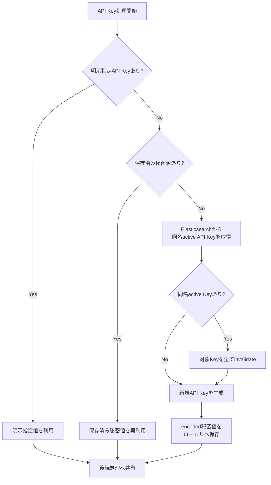
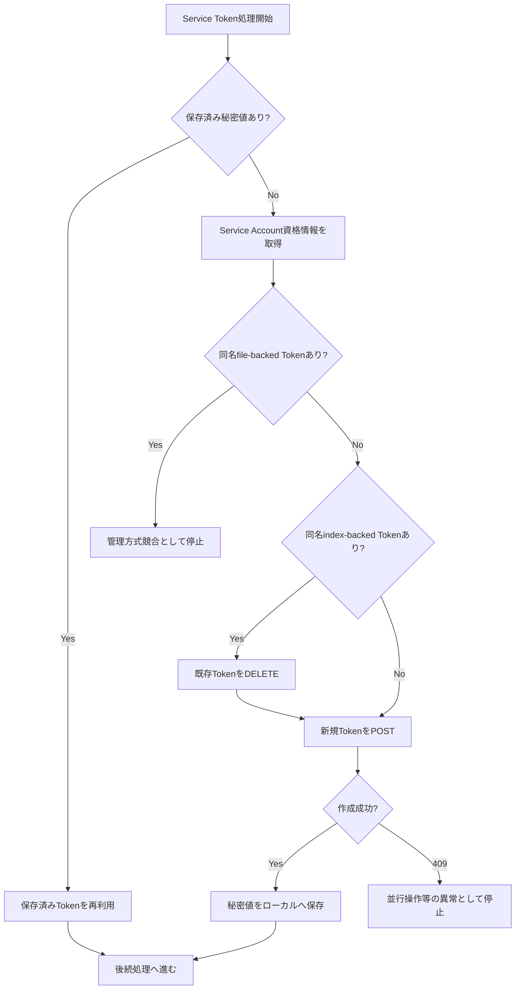

# fleet-server ロール

本ロールは, Elastic Agent コンテナを Fleet Server モードで起動するロールです。

## 目次

- [fleet-server ロール](#fleet-server-ロール)
  - [目次](#目次)
  - [用語](#用語)
  - [概要](#概要)
    - [Kubernetes API監査ログ収集用Elastic Agentとの関係](#kubernetes-api監査ログ収集用elastic-agentとの関係)
  - [前提条件](#前提条件)
  - [実行方法](#実行方法)
  - [主要変数](#主要変数)
    - [各ロール固有の利用者入力値](#各ロール固有の利用者入力値)
      - [条件付き必須入力値](#条件付き必須入力値)
      - [任意入力値](#任意入力値)
    - [Elastic Stack間共有設定値](#elastic-stack間共有設定値)
    - [変数設定例](#変数設定例)
      - [vars/all-config.ymlによる認証情報の上書き例](#varsall-configymlによる認証情報の上書き例)
      - [vars/all-config.yml の設定例](#varsall-configyml-の設定例)
  - [テンプレートと生成ファイル](#テンプレートと生成ファイル)
  - [実行フロー](#実行フロー)
  - [検証ポイント](#検証ポイント)
    - [検証の前提条件](#検証の前提条件)
    - [検証環境の設定](#検証環境の設定)
    - [検証コマンドと期待結果](#検証コマンドと期待結果)
      - [1. Fleet Server コンテナ稼働状態確認](#1-fleet-server-コンテナ稼働状態確認)
      - [2. Fleet Server 公開ポート待受確認](#2-fleet-server-公開ポート待受確認)
      - [3. Fleet Serverサービスアカウントトークンファイル存在確認](#3-fleet-serverサービスアカウントトークンファイル存在確認)
    - [異常時の確認項目](#異常時の確認項目)
      - [1. コンテナ起動失敗時の確認](#1-コンテナ起動失敗時の確認)
      - [2. ポート待受状態の確認](#2-ポート待受状態の確認)
      - [3. Fleet Serverサービスアカウントトークンファイル生成状態の確認](#3-fleet-serverサービスアカウントトークンファイル生成状態の確認)
  - [トラブルシューティング](#トラブルシューティング)
    - [1. 必須変数不足または不正値で検証に失敗する場合](#1-必須変数不足または不正値で検証に失敗する場合)
    - [2. サービスアカウントトークン発行で 400 エラーが発生する場合](#2-サービスアカウントトークン発行で-400-エラーが発生する場合)
    - [3. Elasticsearch の起動状態を確認中に接続に失敗する場合](#3-elasticsearch-の起動状態を確認中に接続に失敗する場合)
    - [4. サービスアカウントトークン自動発行が失敗する場合](#4-サービスアカウントトークン自動発行が失敗する場合)
  - [注意事項](#注意事項)
  - [付録](#付録)
    - [Fleet Server認証情報の管理論理](#fleet-server認証情報の管理論理)
      - [Kibana API Keyの管理](#kibana-api-keyの管理)
      - [Service Tokenの管理](#service-tokenの管理)
      - [HTTP APIエラー時の再試行方針](#http-apiエラー時の再試行方針)
  - [参考資料](#参考資料)
    - [公式ドキュメント](#公式ドキュメント)
    - [関連ロール](#関連ロール)

## 用語

| 正式名称 | 略称 | 意味 |
| --- | --- | --- |
| Ansible | - | 設定の同一化や導入作業を所定の手順に従って自動化する仕組み。 |
| Playbook | - | 自動化処理の実行手順を記述したファイル。 |
| Helm Chart | - | Helmで導入するKubernetesリソース定義のまとまり。 |
| rollout | - | Deploymentなどの更新適用状況を確認する処理。 |
| kubeconfig | - | Kubernetes API接続先と認証情報を記述した設定ファイル。 |
| hostPath | - | Podがノード上のファイルパスを直接参照するためのボリューム定義。 |
| preset | - | Helm valuesで導入構成を選択する設定項目。 |
| clusterWide | - | Kubernetesクラスタ全体を対象として共通処理を実行するためのHelm valuesで指定する導入構成の選択値。 |
| perNode | - | Kubernetesを構成するノードで実施する処理を実行するためのHelm valuesで指定する導入構成の選択値。 |
| kube-state-metrics | - | Elastic StackでKubernetesリソース状態を収集するために利用するメトリクス公開コンポーネント。 |
| Elasticsearch | - | ログやメトリクス情報を集約, 検索するためのサーバソフトウェア。 |
| Elasticsearchのセキュリティ機能 | - | Elasticsearchへの接続者を認証し, 利用者に付与した権限に基づいて実行可能な操作を制御する機能。 |
| Snapshot Repository | - | Elasticsearch がバックアップデータを保存する場所として参照する保存先の定義。 |
| snapshot | - | ある時点の Elasticsearch データを復旧可能な形で保存したバックアップ単位。 |
| Snapshot API | - | Elasticsearch の snapshot 作成, 一覧取得, 削除, 復元を行う操作手順。 |
| Kibana | - | Elasticsearchに保存されたデータを可視化し, 参照するソフトウェア。 |
| Logstash | - | 受信したデータを整形し, 送信先へ転送するソフトウェア。 |
| Fleet Server | - | Elastic Agent の管理通信を受け付けるサーバ機能。 |
| Elastic Agent | - | ログやメトリクスを収集して送信する実行要素。 |
| Fleet Output | - | Elastic Agent が送信先として利用する出力設定。 |
| Elastic Agent ポリシー | - | Fleetが管理し, Elastic Agentのデータ収集方法と動作を定める設定情報。 |
| Enrollment Token | - | Elastic AgentがFleet Serverへの登録を許可されていることを確認し, 登録先のElastic Agent ポリシーを特定するための登録用認証情報。 |
| Enrollment Token共有ファイル | - | Fleet BootstrapがEnrollment Tokenを制御ホスト上へ保存し, Elastic Agent本体ロールがFleet Serverへの登録時に読み込む権限`0600`のYAMLファイル。 |
| Fleet Serverサービスアカウントトークンファイル | - | Fleet ServerがElasticsearchへ接続するためのサービスアカウントトークンを対象ホスト上へ保存し, Fleet Serverコンテナが起動時に読み込む権限`0600`のファイル。 |
| Classless Inter-Domain Routing | CIDR | Internet Protocolアドレスの範囲を先頭アドレスと接頭辞長で表す方式。 |
| Docker bridge network | Dockerブリッジネットワーク | 同一対象ホスト上のコンテナ間通信に使用する仮想的なネットワーク。 |
| Network Address Translation | NAT | 通信時にIPアドレスを変換する処理。 |
| systemd | - | Linux上でサービスの起動順序と実行状態を管理するソフトウェア。 |
| pipeline | - | 入力, 整形, 出力の処理順を定義する Logstash の設定単位。 |
| Elastic Agent入力 | - | Elastic Agentからデータストリーム情報を保持したイベントを受信するLogstashの入力機能。 |
| Host Variables | host_vars | ホスト単位の設定値を格納する変数定義。 |
| Ansible Inventory | inventory | 実行対象ホストの一覧と接続情報を管理する定義。 |
| inventory group | - | Ansible Inventory内で同じ役割の対象ホストをまとめる識別単位。 |
| single-node | - | Elasticsearch を単一ノード構成で構成する方式。コンテナイメージを用いた導入時に典型的に用いられる。 |
| Hypertext Transfer Protocol | HTTP | World Wide Webで情報をやり取りする通信手順。 |
| Internet Protocol | IP | ネットワーク上で宛先を識別し, データを届けるための通信手順。 |
| World Wide Web | WWW | ネットワーク上で文書や情報を相互参照できる仕組み。 |
| Uniform Resource Locator | URL | World Wide Web上の資源の場所を示す文字列。 |
| Fully Qualified Domain Name | FQDN | 末尾まで省略せず書いた完全なドメイン名。 |
| Operating System | OS | 計算機の基本機能を管理し, アプリケーションを動作させる基盤ソフトウェア。 |
| Linux | - | 多くの機器で使われる, 基本ソフトウェアの系統。 |
| Debian | - | コミュニティ主導で開発される Linux ディストリビューション。 |
| Red Hat | - | Red Hat Enterprise Linuxなどを提供する組織。 |
| Red Hat Enterprise Linux | RHEL | Red Hatが提供する企業向けLinuxディストリビューション。 |
| root | - | Unix 系システムの最上位権限を持つ管理者識別子。 |
| cron | - | 指定した時刻や周期でコマンドを自動実行する仕組み。 |
| Ansible Playbook | Playbook | Ansibleで実行する処理の順序と対象を記述したファイル。 |
| iptables | - | Linux の IPv4 パケットフィルタ設定ツール。 |
| ip6tables | - | Linux の IPv6 パケットフィルタ設定ツール。 |
| Python | - | スクリプティングやアプリケーション開発を手早く実施するために用いられる高水準プログラミング言語の一種。 |
| Canonical | - | Ubuntu を提供する組織名。 |
| Structured Query Language | SQL | データベースを操作するための記述言語。 |
| RPM Package Manager | RPM | RPM形式パッケージの導入, 更新, 削除, 情報参照を行う仕組み。 |
| Virtual Machine | VM | 物理計算機上で動作する仮想的な計算機。 |
| Central Processing Unit | CPU | 計算処理を実行する中核部品。 |
| Hypertext Transfer Protocol Secure | HTTPS | 通信内容を暗号化してWorld Wide Web通信を行う方式。 |
| localhost | - | 同一機器自身を指す名前。 |
| Kubernetes | K8s | コンテナを管理する基盤ソフトウェア。 |
| Kubernetes API監査機能 ( Kubernetes API Audit )| - | Kubernetesクラスター内の一連の行動を記録するセキュリティに関連した時系列の記録を提供する機能。 |
| Pod | - | Kubernetes でコンテナをまとめて管理する最小単位。 |
| Ubuntu | - | Canonical が提供する Debian 系の Linux ディストリビューション。 |
| Service | - | サービスの英語表記。 |
| Node | - | ノードの英語表記。 |
| Package Policy | - | Elastic Agent ポリシーへ追加する収集内容と統合パッケージの設定。 |
| Application Programming Interface | API | アプリケーション同士が機能やデータをやり取りするための取り決め。 |
| Ansible Task | task | 自動化処理の最小単位となる実行項目。 |
| Elastic Stack | - | Elasticsearch, Kibana, Logstash, Fleet Server, Fleet Bootstrap, Elastic Agent などで構成される, 収集, 蓄積, 検索, 可視化を行うソフトウェア群。 |
| YAML | - | 設定を読みやすい形式で表す記述方法。 |
| Makefile | - | 実行手順を定義したファイル。 |
| Key-Value | - | キーと値の組で情報を表す方式。 |
| Elasticsearchのサービスアカウントトークン ( Elasticsearch Service Account Token ) | - | Elasticsearchが提供するサービスアカウントに紐付く認証情報。 |
| Fleet Bootstrap | - | Fleet API を使用して Fleet の初期設定と Enrollment Token 共有を実施する初期化ロール。 |
| Deployment | - | Kubernetesで複数のPodの作成, 更新, 維持を管理するリソース。 |
| DaemonSet | - | Kubernetesで各ノードへPodを常駐配置するリソース。 |
| ConfigMap | - | 設定値をキーと値の組で保存するKubernetesリソース。 |
| Secret | - | 秘密情報を保存するKubernetesリソース。 |
| Service Account | - | Kubernetes上でPodがAPIを利用する主体を識別する情報。 |
| ロール | - | Ansible における処理のまとまり。 |
| System統合 | - | Elastic Agentが対象ホストのログとメトリクス情報を収集するための統合パッケージ。 |
| Custom Logs統合 | - | Elastic Agentが指定されたログファイルからテキストを収集するための統合パッケージ。 |
| インデックス | - | Elasticsearch に保存するデータの格納先識別単位。 |
| コンテナイメージ | - | コンテナ実行に必要な内容をまとめた保存形式。 |
| コンテナ | - | アプリケーションを動かす隔離された実行単位。 |
| ホスト | - | 管理対象として識別される個別の計算機。 |
| 制御ホスト | - | Playbook を実行し, 他ホストへの処理指示を行う管理用ホスト。 |
| 対象ホスト | - | Playbook による設定変更や導入処理の適用先となるホスト。 |
| サーバ | - | 他の機器や利用者へ機能やデータを提供する計算機, 又はその役割。 |
| ネットワーク | - | 機器同士を接続してデータをやり取りする仕組み。 |
| ディレクトリ | - | ファイルを階層的に整理するための入れ物。 |
| ログ | - | 処理の結果や状態を時系列で記録した情報。 |
| メトリクス | - | ホストやサービスの状態を数値で表した観測情報。 |
| データ | - | 処理や保存の対象となる情報。 |
| ポート | - | 通信の出入口を識別する番号または接点。 |
| URL スキーム | - | URL の先頭で通信方式を示す部分。例: `http`, `https`。 |
| ランタイムエンドポイント ( rumtime endpoint ) | - | 対象ホスト上で所定のサービスが動作していることを確認するための疎通確認に用いるエンドポイントです。ここでのエンドポイントは, <接続先ホスト名>と<接続先ポート番号>の組から構成されるURLになります。本ロールで規定した変数により明示的に指定されたエンドポイントがあればその値を採用し, 未指定の場合は, 対象ホスト名とポート番号からエンドポイントを組み立てます。 |
| 対象ホスト上での疎通確認 | - | 対象ホスト上で自ホスト(localhost)を指定して待ち受け先ポートへの疎通確認を実施すること。確認対象のサービスが対象ホスト上で起動していることを確認します。 |
| 外部ホストからの疎通確認 | - | 対象ホスト以外のホストから対象ホストを指定して待ち受け先ポートへの疎通確認を実施すること。確認対象のサービスがネットワーク接続を含めて適切に設定され, サービス受付可能な状態になっていることを確認します。 |
| ディストリビューション | - | 基本ソフトウェアと関連部品をまとめた配布形態。 |
| コミュニティ | - | 共通目的のもとで継続的に活動する利用者集団。 |
| ホストメトリクス ( host metrics ) | - | リソース使用状況など, ログ収集対象となるホスト群から収集する情報。 |
| ループ | - | 同じ処理を繰り返すこと。 |
| バックエンド | - | 利用者画面の背後で処理を実行する側。 |
| メタデータ | - | 対象データの属性や説明を示す付加情報。 |
| リソース | - | 処理に必要な計算機資源やデータ。 |
| コマンド | - | 実行者が計算機へ処理を指示するための命令。 |
| サービス | - | 機能を利用者や他システムへ提供する仕組み。 |
| ユーザ | - | 機能を利用する人, 又は識別された利用主体。 |
| ツール | - | 特定作業を実行するための機能や道具。 |
| Elasticsearch のクラスタ | - | 複数の Elasticsearch ノードを連携させて一体運用する構成。 |
| プログラム | - | 計算機に処理をさせるための命令列。 |
| プラグイン | - | 既存機能へ追加機能を組み込むための拡張部品。 |
| コンテナランタイム | - | コンテナを起動, 停止, 管理する実行基盤。 |
| リクエスト | - | 処理実行や情報取得を要求する操作。 |
| コントローラ | - | 対象状態を監視し, 期待状態へ調整する制御機能。 |
| ストレージ | - | データを保存する仕組み。 |
| インストール | - | ソフトウェアを導入して利用可能にする作業。 |
| マシン | - | 処理を実行する計算機。 |
| プロビジョニング | - | 利用開始に必要な設定や資源を準備する作業。 |
| ルーティング | - | 宛先までの経路を選択して転送する処理。 |
| オブジェクト | - | ひとかたまりとして扱うデータ単位。 |
| エージェント | - | 指示に従って処理を代行する構成要素。 |
| ストア | - | データや成果物を保存する場所。 |
| ジャーナル | - | 時系列の記録を保持する仕組み。 |
| アカウント | - | 利用者や処理主体を識別する登録情報。 |
| エンドポイント | - | 通信の接続先を表す識別点。 |
| パターン | - | 繰り返し現れる構造や記述形式。 |
| パケット | - | ネットワークで転送するデータ単位。 |
| カーネル | - | 基本ソフトウェアの中核機能。 |
| シェル | - | コマンド入力で計算機を操作する仕組み。 |
| ソフトウェア | - | 情報処理システムで使用するプログラム, 手順, 規則及び関連文書の全体又は一部分。 |
| システム | - | 複数の要素が連携して目的を実現する仕組み全体。 |
| アプリケーション | - | 利用者の目的を実現するために動作するソフトウェア。 |
| パッケージ | - | ソフトウェア導入に必要なファイルをまとめた配布単位。 |
| リポジトリ | - | ソフトウェアや設定情報を保管し, 取得できるようにした管理場所。 |
| ノード | - | ネットワークに接続された機器または処理単位。 |
| アドレス | - | 宛先や所在を識別するための情報。 |
| プロトコル | - | 通信やデータ交換の手順を定めた取り決め。 |
| コード | - | 処理内容を記述した文字列。 |
| ファイルシステム | - | 記憶装置上のファイルとディレクトリを管理する仕組み。 |
| プロセス | - | 実行中のプログラムを管理する単位。 |
| 名前空間 ( namespace ) | - | Kubernetes内部でリソースを論理的に分離する単位。 |
| サービスアカウント (Service Account) | - | 自動処理中でサービスを呼び出す側のプログラムを識別するための識別情報。 |
| Elastic Agentポリシー構成種別 | - | Fleet Bootstrap ロールの `fleet_bootstrap_agent_policy_profiles` で管理する `host`, `k8s_system`, `k8s_workload`, `k8s_cluster`, `k8s_audit`の5種類を指す,Elastic Stack固有の分類単位。 |
| 統合パッケージ | - | Elastic Agentへデータの収集方法と収集項目を追加するためのパッケージ。 |
| Docker Compose | - | 複数のコンテナ定義をまとめて作成, 起動, 停止, 更新する仕組み。 |
| Docker Compose 定義ファイル | - | Docker Compose が参照するコンテナ構成の定義ファイル。 |
| compose project 名 | - | Docker Compose によって展開される個々のアプリケーションを識別する名前です。展開されたコンテナ, ネットワーク, ボリュームなどのリソースをグループ化し, 他のアプリケーション又は別途展開された同じアプリケーションと区別するために用います。 |
| Helm導入識別名 ( Helm release ) | - | Helm が管理する導入単位を識別する名前。 |
| values ファイル | - | Helm Chartへ渡す設定値を定義したYAMLファイル。 |
| ansible-playbookコマンド | ansible-playbook | Ansible Playbook を実行して自動構成処理を適用するコマンド。 |
| Docker | - | コンテナイメージやコンテナの作成, 実行, 管理を行うコマンド。 |
| sudoコマンド | sudo | 一時的に管理者権限でコマンドを実行するためのコマンド。 |
| makeコマンド | make | Makefile に定義された処理を実行するコマンド。 |
| curlコマンド | curl | URL を指定して通信結果を取得するコマンド。 |
| 環境変数 | - | 実行時の動作を調整するために外部から渡す設定値。 |
| dockerコマンド | - | Dockerブリッジネットワークを作成及び確認するコマンド。 |
| iptablesコマンド | - | IPパケットの通過条件とNAT規則を確認するコマンド。 |
| ip6tablesコマンド | - | IPv6パケットの通過条件とNAT規則を確認するコマンド。 |
| systemctlコマンド | - | systemdが管理するサービスの状態を確認するコマンド。 |
| jqコマンド | jq | JSON 形式のデータから必要な項目だけを抽出して表示するコマンド。 |
| yqコマンド | yq | YAML 形式のデータから必要な項目だけを抽出して表示するコマンド。 |
| statコマンド | stat | ファイルの権限, 大きさ及び名前を表示するコマンド。 |
| journalctlコマンド | journalctl | サービスが記録したログを確認するコマンド。 |
| elastic-agentコマンド | elastic-agent | Elastic Agentの版数確認や管理処理を実行するコマンド。 |
| Helm | - | Kubernetes向けパッケージを導入, 更新, 削除するコマンド。 |
| helmコマンド | helm | Kubernetes向けパッケージの導入, 更新, 状態確認を実施するコマンド。 |
| kubectlコマンド | kubectl | Kubernetes API と通信してリソースを操作, 参照するコマンド。 |
| grepコマンド | grep | テキストの中から条件に一致する行を抽出するコマンド。 |
| tailコマンド | tail | テキストの末尾側を表示するコマンド。 |

## 概要

本ロールは, 対象ホスト上に Fleet Server 用 Docker Compose 定義ファイルを生成し, サービスアカウントトークンを参照してコンテナを起動します。Fleet Serverは, このコンテナ設定に指定されたElasticsearch接続先を使用し, 通常のElastic Agent向け既定Logstashを経由せずにElasticsearchへ直接接続します。Fleet Serverサービスアカウントトークンファイルが未配置の場合は, 変数設定により Elasticsearch API でサービスアカウントトークンを自動発行できます。Elasticsearchのセキュリティ機能が有効な場合は, Fleet Bootstrap が後続で利用する Kibana API キーも生成して同一 playbook 実行内で共有します。`fleet-server` と `fleet-bootstrap` を同一 `ansible-playbook` 実行で連続適用することを前提とし, 本ロールが設定するAPI キー ( `fleet_bootstrap_kibana_api_key`変数で設定) を Fleet Bootstrap ロール側で引き継ぎます。引き継いだ API キーを使用して, Fleet Bootstrap 側の `roles/fleet-bootstrap/tasks/verify.yml` で Fleet Output 登録先ホストの対象ホスト上での疎通確認と外部ホストからの疎通確認を実行します。起動後は待受ポートとコンテナ稼働状態を検証します。

### Kubernetes API監査ログ収集用Elastic Agentとの関係

`elastic-agent-k8s-audit`が導入するElastic Agentも本ロールのFleet Serverへ登録されます。Fleet Bootstrapが作成する`k8s_audit`構成種別のElastic AgentポリシーとEnrollment Tokenを使用し, Fleet ServerからKubernetes統合の監査ログ収集設定を取得します。Audit用Agentの収集データは通常Agentと同じFleet既定Logstash Outputへ送信し, Fleet Server自身だけは専用Elasticsearch Outputを使用します。

## 前提条件

- 対象ホストで Docker と Docker Compose が利用可能であること。
- 対象ホストで `docker` コマンドを管理者権限で実行可能であること。
- Elasticsearch と Kibana の接続先が, 対象ホストから到達可能であること。
- `host_vars` または共通変数で, Fleet Server 用変数が定義済みであること。

## 実行方法

制御ホストで次のいずれかを実行します。

```bash
make run_fleet_server
```

```bash
ansible-playbook -i inventory/hosts logging-backend.yml --tags "fleet-server"
```

Fleet Bootstrap まで続けて再実行する場合は, 次を使用してください。

```bash
make run_fleet_bootstrap
```

```bash
ansible-playbook -i inventory/hosts logging-backend.yml --tags "fleet-server,fleet-bootstrap"
```

`fleet-server` と `fleet-bootstrap` を別々の `ansible-playbook` 実行へ分割すると, Fleet Server が生成した API キー共有値を Fleet Bootstrap へ引き継げません。

## 主要変数

### 各ロール固有の利用者入力値

#### 条件付き必須入力値

利用者が必ず設定するFleet Server固有変数はありません。認証情報を明示しない場合は, Elasticsearchの認証情報を共通派生値として使用します。

#### 任意入力値

| 変数名 | 意味 | 既定値 | 設定例 |
| --- | --- | --- | --- |
| `logging_fleet_server_enabled` | ロール実行可否を指定するフラグ変数 | `true` | `true` |
| `fleet_server_endpoint_url_explicit` | Fleet Server のランタイムエンドポイント明示指定値。未指定時は `logging_backend_resolved_host` と `fleet_server_port` から組み立てる。 | 空文字列 | `https://fleet.example.org:8220` |
| `fleet_server_tls_mode` | ランタイムエンドポイントのURLスキームが`https`の場合に参照するTLS検証モード。指定可能な値は, [Elasticsearchロールの共有設定値](../elasticsearch/Readme.md#共有設定値に関する補足説明)を参照する。 | `logging_backend_default_tls_mode`の指定値。 | `none` |
| `fleet_server_token_issue_timeout_seconds` | サービスアカウントトークン発行APIの接続タイムアウト秒数 | `30` | `30` |
| `fleet_server_token_issue_retries` | サービスアカウントトークン発行APIの再試行回数 | `3` | `3` |
| `fleet_server_token_issue_retry_interval_seconds` | サービスアカウントトークン発行APIの再試行待機秒数 | `5` | `5` |
| `fleet_server_kibana_api_key_expiration` | Fleet Bootstrap 共有用 Kibana API キーの有効期限指定値。未設定時は expiration を送らない。 | 空文字列 | `24h` |
| `fleet_server_token_issue_username` | サービスアカウントトークン発行APIへ接続する利用者名。 | `elastic_search_security_username`の指定値。 | `elastic` |
| `fleet_server_token_issue_password` | サービスアカウントトークン発行APIへ接続するパスワード。 | `elastic_search_bootstrap_password`の指定値。 | `DUMMY_ELASTIC_PASSWORD` |
| `fleet_server_kibana_auth_username` | Fleet Bootstrap共有用Kibana APIキーの生成時にElasticsearch APIへ接続する利用者名。 | `elastic_search_security_username`の指定値。 | `elastic` |
| `fleet_server_kibana_auth_password` | Fleet Bootstrap共有用Kibana APIキーの生成時にElasticsearch APIへ接続するパスワード。 | `elastic_search_bootstrap_password`の指定値。 | `DUMMY_ELASTIC_PASSWORD` |

### Elastic Stack間共有設定値

共有設定値の意味, 設定要否, 既定値及び設定例は, [Elasticsearchロールの共有設定値](../elasticsearch/Readme.md#varsall-configymlに設定するelastic-stack間共有設定値)を参照します。Fleet Serverでは, 共通の版数, Dockerブリッジネットワーク, Elasticsearch接続先, URLスキーム及びTLS検証モードが影響します。


### 変数設定例

#### vars/all-config.ymlによる認証情報の上書き例

Elasticsearchの認証情報と異なる値を使用する場合に限り, `vars/all-config.yml`へ次の値を記載します。

```yaml
1: fleet_server_token_issue_username: "elastic"
2: fleet_server_token_issue_password: "DUMMY_ELASTIC_PASSWORD"
3: fleet_server_kibana_auth_username: "elastic"
4: fleet_server_kibana_auth_password: "DUMMY_ELASTIC_PASSWORD"
```

| 行番号 | 設定値 | 有効になる動作 | 設定背景(未設定時/誤設定時の問題と防止理由) |
| --- | --- | --- | --- |
| 1-2 | `fleet_server_token_issue_username: "elastic"`, `fleet_server_token_issue_password: "DUMMY_ELASTIC_PASSWORD"` | サービスアカウントトークン自動発行 API の認証情報を指定します。 | Elasticsearchのセキュリティ機能が有効な場合に認証情報が不足又は不一致であると, トークン自動発行が失敗するためです。 |
| 3-4 | `fleet_server_kibana_auth_username: "elastic"`, `fleet_server_kibana_auth_password: "DUMMY_ELASTIC_PASSWORD"` | Kibana API キー生成時に Elasticsearch API へ接続する認証情報を指定します。 | 認証情報が未設定又は誤設定の場合, Fleet Bootstrap 連携用 API キーの生成又は再利用が失敗するためです。 |

この例を省略した場合は, `elastic_search_security_username`と`elastic_search_bootstrap_password`の指定値を使用します。

#### vars/all-config.yml の設定例

全ホスト共通の値を `vars/all-config.yml` に記載します。
`logging_backend_*` は `host_vars` に重複定義せず, この節の例のように `vars/all-config.yml` のみに記載します。

```yaml
1: logging_fleet_server_enabled: true
2: fleet_server_endpoint_url_explicit: "https://fleet.example.org:8220"
3: fleet_server_tls_mode: "full"
4: fleet_server_kibana_api_key_expiration: "24h"
```

| 行番号 | 設定値 | 有効になる動作 | 設定背景(未設定時/誤設定時の問題と防止理由) |
| --- | --- | --- | --- |
| 1 | `logging_fleet_server_enabled: true` | Fleet Server ロールを有効化し, 共通設定にもとづく導入処理を実行します。 | `false` の場合は Fleet Server ロールの処理が実行されず, 期待した導入結果を得られないためです。 |
| 2-3 | `fleet_server_endpoint_url_explicit: "https://fleet.example.org:8220"`, `fleet_server_tls_mode: "full"` | Fleet Serverの公開接続先を指定し, HTTPS証明書を検証します。 | 接続先又はTLS検証モードが誤っている場合は, Elastic Agentの登録及び疎通確認が失敗するためです。 |
| 4 | `fleet_server_kibana_api_key_expiration: "24h"` | Fleet Bootstrap 連携用 Kibana API キーの有効期限を `24h` に設定します。 | 未設定時は既定の有効期限運用に依存し, 誤設定時は API キーの再利用計画と整合しないためです。 |

この例では, 本 playbook で導入する側の共通値を一箇所へ集約します。

## テンプレートと生成ファイル

| 種別 | 入力 | 出力 | 目的 |
| --- | --- | --- | --- |
| テンプレート | `templates/docker-compose.yml.j2` | `{{ fleet_server_runtime_compose_file }}` (既定: `{{ fleet_server_compose_dir }}/docker-compose.yml`) | Fleet Server の Docker Compose 定義ファイルを生成する。 |
| タスク生成 | `tasks/token.yml` | `{{ fleet_server_runtime_service_token_path }}` (既定: `{{ fleet_server_compose_dir }}/secrets/fleet-server-service-token`) | Fleet Serverサービスアカウントトークンファイルをコンテナ実行ユーザの所有物として権限`0400`で保存する。 |
| タスク生成 | `tasks/directory.yml` | `{{ fleet_server_compose_dir }}` (既定: `/opt/fleet-server`), `{{ fleet_server_runtime_state_dir }}` (既定: `{{ fleet_server_compose_dir }}/state`) | 実行に必要なディレクトリを作成する。 |

## 実行フロー

1. [tasks/load-params.yml](tasks/load-params.yml) で OS 別パラメータと共通変数を読み込みます。
2. [tasks/validate.yml](tasks/validate.yml) で必須変数, パス, ポート範囲を確認します。
3. [tasks/package.yml](tasks/package.yml) で Docker と Docker Compose コマンドの利用可否を確認します。
4. [tasks/directory.yml](tasks/directory.yml) で Compose 配置先, state, Fleet Serverサービスアカウントトークンファイル格納先のディレクトリを作成します。
5. [tasks/token.yml](tasks/token.yml) で既存のFleet Serverサービスアカウントトークンファイルを確認し, 必要時は Elasticsearch API でサービスアカウントトークンを発行して同ファイルへ保存します。
6. [tasks/api-key.yml](tasks/api-key.yml) で Fleet Bootstrap 共有用の Kibana API キーを再利用または生成します。expiration は明示設定時のみ Elasticsearch API へ送信します。
7. [tasks/config.yml](tasks/config.yml) で [templates/docker-compose.yml.j2](templates/docker-compose.yml.j2) を配置し, `FLEET_ENROLL=1`による自己登録を指定します。Docker Compose 定義ファイルの更新時は fleet_server_restart_service を通知し, [handlers/main.yml](handlers/main.yml) から読み込む [handlers/restart-service.yml](handlers/restart-service.yml) でコンテナ再起動処理を実行します。
8. [tasks/service.yml](tasks/service.yml) でdocker-network-elastic-stackロールが作成したbackend用ネットワークの存在確認, 既存コンテナ整理, `docker compose up -d`によるFleet Serverコンテナ起動を実行します。
9. [tasks/verify.yml](tasks/verify.yml) で サービス提供ポートの待機と, `docker container inspect` によるコンテナ稼働状態確認を実施し, Fleet Server が起動済みであることを検証します。Fleet Bootstrapが有効な場合は`missing config fleet.agent.id`だけを後続処理で回復する一時状態として許容し, それ以外の異常状態では処理を停止します。
10. 同一 `ansible-playbook` 実行で `fleet-bootstrap` を続けて適用することで, `tasks/api-key.yml` で設定した `fleet_bootstrap_kibana_api_key` が Fleet Bootstrap の Fleet API 呼び出しと Elasticsearch hosts health 確認(対象ホスト上での疎通確認/外部ホストからの疎通確認)に引き継がれます。

## 検証ポイント

### 検証の前提条件

検証を始める前に, 次の条件が満たされていることを確認します:

- 対象ホストで Fleet Server コンテナが起動済みであること。
- 対象ホストで `docker` コマンドを実行可能であること。
- 対象ホストで `sudo` コマンドにより管理者権限でコマンドを実行可能であること。
- `fleet_server_port` に設定したポートが他のサービスで使用されていないこと。
- `fleet_server_compose_dir` 配下に Compose 定義ファイルと状態ディレクトリを作成できること。
- `fleet_server_compose_dir` 配下の `secrets/fleet-server-service-token` へFleet Serverサービスアカウントトークンファイルを配置できること。
- Elasticsearch との接続先が名前解決可能であること。

### 検証環境の設定

検証用の host_vars, または, vars/all-config.yml を以下のように設定します。

```yaml
1: fleet_server_endpoint_url_explicit: "https://fleet.example.org:8220"
2: fleet_server_tls_mode: "full"
```

| 行番号 | 設定値 | 有効になる動作 | 設定背景(未設定時/誤設定時の問題) |
| --- | --- | --- | --- |
| 1-2 | `fleet_server_endpoint_url_explicit: "https://fleet.example.org:8220"`, `fleet_server_tls_mode: "full"` | Fleet Serverの公開接続先を指定し, HTTPS証明書を検証します。 | 接続先又はTLS検証モードが誤っている場合は, Elastic Agentの登録及び疎通確認が失敗します。 |

この設定により, 本 playbook で導入する Fleet Server が対象ホスト上で待受し, 自己確認が可能になります。

### 検証コマンドと期待結果

#### 1. Fleet Server コンテナ稼働状態確認

**実施対象ホスト**: 対象ホスト

**実行するコマンド**:

```bash
docker container inspect fleet-server --format '{{.State.Running}}'
```

**期待される出力**:

```plaintext
true
```

**実行結果の例**:

```bash
$ docker container inspect fleet-server --format '{{.State.Running}}'
true
```

**確認ポイント**:

- コンテナが起動済みであること。
- `true` が返されること。

#### 2. Fleet Server 公開ポート待受確認

**実施対象ホスト**: 対象ホスト

**実行するコマンド**:

```bash
ss -lntp | grep ':8220 '
```

**期待される出力**:

```plaintext
LISTEN 0      4096         0.0.0.0:8220       0.0.0.0:*
```

**実行結果の例**:

```bash
$ ss -lntp | grep ':8220 '
LISTEN 0      4096         0.0.0.0:8220       0.0.0.0:*
```

**確認ポイント**:

- 指定したポートで待受していること。
- `:8220` を含む待受行が表示されること。

#### 3. Fleet Serverサービスアカウントトークンファイル存在確認

**実施対象ホスト**: 対象ホスト

**実行するコマンド**:

```bash
sudo test -f /opt/fleet-server/secrets/fleet-server-service-token && echo OK
```

**期待される出力**:

```plaintext
OK
```

**実行結果の例**:

```bash
$ sudo test -f /opt/fleet-server/secrets/fleet-server-service-token
&& echo OK
OK
```

**確認ポイント**:

- Fleet Serverサービスアカウントトークンファイルが配置済みであること。
- `OK` が表示されること。

### 異常時の確認項目

#### 1. コンテナ起動失敗時の確認

**実施対象ホスト**: 対象ホスト

**実行するコマンド**:

```bash
docker compose -f /opt/fleet-server/docker-compose.yml ps --no-trunc
```

**期待される出力**:

```plaintext
fleet-server  Up
```

**実行結果の例**:

```bash
$ docker compose -f /opt/fleet-server/docker-compose.yml ps --no-trunc
NAME           IMAGE                                                  COMMAND                                               SERVICE        CREATED          STATUS          PORTS
fleet-server   docker.elastic.co/elastic-agent/elastic-agent:8.19.19   "/usr/bin/tini -- /usr/local/bin/docker-entrypoint"   fleet-server   14 minutes ago   Up 14 minutes   0.0.0.0:8220->8220/tcp
```

**確認ポイント**:

- コンテナが `Up` 状態であること。
- 表示されたサービス名が `fleet-server` であること。

#### 2. ポート待受状態の確認

**実施対象ホスト**: 対象ホスト

**実行するコマンド**:

```bash
ss -lntp | grep ':8220 '
```

**期待される出力**:

```plaintext
LISTEN 0      4096         0.0.0.0:8220       0.0.0.0:*
```

**実行結果の例**:

```bash
$ ss -lntp | grep ':8220 '
LISTEN 0      4096         0.0.0.0:8220       0.0.0.0:*
```

**確認ポイント**:

- 出力が空でないこと。
- `ss` コマンドの出力に表示される `LISTEN` 行のポート番号 `:8220` を確認し, Fleet Server の待受ポートが確立されていること。

#### 3. Fleet Serverサービスアカウントトークンファイル生成状態の確認

**実施対象ホスト**: 対象ホスト

**実行するコマンド**:

```bash
sudo ls -ln /opt/fleet-server/secrets/fleet-server-service-token
```

**期待される出力**:

```plaintext
-r--------. 1 1000 1000 101 Aug  4 22:32 /opt/fleet-server/secrets/fleet-server-service-token
```

**実行結果の例**:

```bash
$ sudo ls -ln /opt/fleet-server/secrets/fleet-server-service-token
-r--------. 1 1000 1000 100 Aug  6 00:39 /opt/fleet-server/secrets/fleet-server-service-token
```

**確認ポイント**:

- Fleet Serverサービスアカウントトークンファイルが存在すること。
- `ls` コマンドの出力にFleet Serverサービスアカウントトークンファイルのパスが表示されること。
- `ls` コマンドの出力中のファイルサイズが 0 バイトではないこと。


## トラブルシューティング

### 1. 必須変数不足または不正値で検証に失敗する場合

- 現象: `Required fleet-server variables are missing or invalid.` が表示される。
- 対処: `fleet_server_image`, `fleet_server_container_name`, `fleet_server_compose_dir`, `fleet_server_service_token_container_path`, `logging_backend_container_user`, `fleet_server_policy_id`, `fleet_server_port` の設定値を確認し, 未定義, 空文字列, 範囲外ポート番号がないことを確認する。加えて, runtime 算出元である `logging_backend_host` と `elastic_search_http_port` が正しく設定されていることを確認する。

### 2. サービスアカウントトークン発行で 400 エラーが発生する場合

- 現象: `invalid service token name` が表示される。
- 対処:
  1. Fleet Server または Kibana へ接続できる環境で, まず接続先とエンドポイントが適切であることを確認する。
     - 実施コマンド例:
       以下の`DUMMY_ELASTIC_PASSWORD`を`elastic_search_bootstrap_password`の設定値に変更して実行してください:
       ```bash
       curl -u elastic:DUMMY_ELASTIC_PASSWORD http://<kibana-host>:5601/api/fleet/agent_policies
       ```
     - 確認事項:
       - `{"error":"no handler found for uri [/api/fleet/agent_policies] and method [GET]"}` のような応答が返る場合は, 接続先が Elasticsearch の 9200 ポートまたは誤った URL になっている可能性がある。
      - その場合は, 接続先を Kibana または Fleet Server サービスの URL に変更する。
      - `{"items":[],"total":0,"page":1,"perPage":20}` のように空の結果が返る場合は, その時点では Fleet Server 側に Elastic Agent ポリシーが登録されていない可能性がある。
  2. 取得結果に `fleet_server_policy_id` で設定した Elastic Agent ポリシー識別子が含まれることを確認する。
     - 実施コマンド例:
       以下の`DUMMY_ELASTIC_PASSWORD`を`elastic_search_bootstrap_password`の設定値に変更して実行してください:
       ```bash
       curl -u elastic:DUMMY_ELASTIC_PASSWORD http://<kibana-host>:5601/api/fleet/agent_policies | jq '.items[]?.id'
       ```
     - 確認事項:
       - 取得結果に `fleet_server_policy_id` で設定した値が表示されること。
      - 表示されない場合は, `fleet_server_policy_id` の設定値を正しい Elastic Agent ポリシー識別子に変更する。

### 3. Elasticsearch の起動状態を確認中に接続に失敗する場合

- 現象: `Connection reset by peer` や `Connection refused` が断続的に表示される。
- 対処: Elasticsearch 起動直後の初期化待ちで再試行中の可能性があるため, `fleet_server_wait_timeout` と `fleet_server_wait_retries` を確認する。

### 4. サービスアカウントトークン自動発行が失敗する場合

- 現象: 本ロール実行時に, `Failed to create service account token. Please check credentials and Elasticsearch connectivity.`メッセージが表示されplaybookの実行が停止する
- 対処: 共通派生値が参照する`elastic_search_security_username`, `elastic_search_bootstrap_password`を確認する。Fleet Server固有の認証情報が必要な場合は, `fleet_server_token_issue_username`, `fleet_server_token_issue_password`を`vars/all-config.yml`で上書きする。また, Elasticsearchとの接続状態を確認する。確認コマンドは以下のとおりである。
  - 実施コマンド例:
    以下の`DUMMY_ELASTIC_PASSWORD`を`elastic_search_bootstrap_password`の設定値に変更して実行してください:
    ```bash
    curl -u elastic:DUMMY_ELASTIC_PASSWORD http://<elasticsearch-host>:9200/_cluster/health
    ```
  - 実行結果例:
    ```json
    {"cluster_name":"shared-logs","status":"yellow","timed_out":false,"number_of_nodes":1,"number_of_data_nodes":1,"active_primary_shards":33,"active_shards":33,"relocating_shards":0,"initializing_shards":0,"unassigned_shards":2,"unassigned_primary_shards":0,"delayed_unassigned_shards":0,"number_of_pending_tasks":0,"number_of_in_flight_fetch":0,"task_max_waiting_in_queue_millis":0,"active_shards_percent_as_number":94.28571428571428}
    ```
  - 確認事項:
    - `cluster_name` と `status` が表示され, Elasticsearch へ接続できていること。
    - `status` 項目が, Elasticsearch のクラスタ状態が 検索や保存の基本機能は利用できるが一部の予備コピーが未配置である状態 ( `yellow` 状態 ), または, 予備コピーを含む全データ配置が完了している状態 ( `green` 状態 ) になること。
    - 接続できない場合は, `fleet_server_elasticsearch_host` や `fleet_server_elasticsearch_port` の設定値を確認し正しいホスト名やIPアドレス, ポート番号を設定する。

## 注意事項

- `fleet_server_service_token_auto_create: true` を使用する場合, `fleet_server_token_issue_password` は平文で保持されるため, 運用管理者はファイル権限と保管場所を適切に管理する必要があります。
- 本ロールの初期化責務はFleet Bootstrap用Kibana APIキーの供給までです。本ロールが対象ホスト上で管理するFleet Serverサービスアカウントトークンファイルと異なり, Enrollment Tokenの作成, 再利用及び制御ホスト上のEnrollment Token共有ファイルへの保存は後続のFleet Bootstrapが担当します。
- Docker Compose 定義ファイルでは`FLEET_ENROLL=1`を指定し, Fleet Serverコンテナの起動時に自己登録を実行します。後続のFleet Bootstrapが有効な場合に限り, Fleet Server統合の設定前に発生する`missing config fleet.agent.id`状態を一時的に許容します。Fleet BootstrapはFleet Server統合を設定した後, 識別子が未生成の登録状態だけを除去してコンテナを再起動し, 状態APIが`HEALTHY`を返すまで検証します。


## 付録

### Fleet Server認証情報の管理論理

本ロールでは,Fleet Server及び後続の`fleet-bootstrap`ロールが使用する認証情報として,Kibana/Fleet API呼び出し用API KeyとFleet Server Service Tokenを管理します。

これらの秘密値は,Elasticsearch上に資格情報本体が残っていても作成後に秘密値を再取得できないため,ローカルに保存した秘密値の有無を基準として再利用又は再生成を判断します。

#### Kibana API Keyの管理

Kibana/Fleet API呼び出し用API Keyは,以下の優先順位で解決します。

1. 利用者が明示的に指定したAPI Key
2. ローカルに保存済みのAPI Key秘密値
3. Elasticsearch Security APIで新規生成したAPI Key

ローカル秘密値を喪失している一方で,Elasticsearch上に同名の有効なAPI Keyが残っている場合は,秘密値を再取得できないため,同名の有効なAPI Keyを全て無効化してから新しいAPI Keyを生成します。



API Keyを新規生成した場合は,作成APIの応答から取得した`encoded`値をFleet Serverの秘密情報ディレクトリへ保存し,再実行時に再利用します。

同名の有効なAPI Keyが複数存在する場合も,ローカル秘密値を喪失している場合は全て無効化し,管理対象のAPI Keyを1つだけ再生成します。

#### Service Tokenの管理

Fleet Server Service Tokenについても,ローカルに保存した秘密値が存在する場合はその値を再利用します。

ローカル秘密値を喪失した場合は,Elasticsearch上のFleet Server Service Accountの資格情報を確認します。

REST APIで作成された同名のindex-backed Service Tokenが残っている場合は,そのTokenを削除してから新しいTokenを生成します。

同名のfile-backed Service Tokenが存在する場合は,本ロールの管理対象と管理方式が競合しているため,自動的な削除や上書きは行わず処理を停止します。



同一Fleet Serverに対するPlaybookの並列実行は正常ケースとして想定しません。このため,Service Tokenの新規生成時に`409 Conflict`が返された場合は自動回復せず異常として処理を停止します。

#### HTTP APIエラー時の再試行方針

Elasticsearch Security APIへの要求では,HTTP応答を恒久エラーと一時エラーに分類して再試行を制御します。

| 応答 | 処理 |
| --- | --- |
| `200`, `201` | 正常終了 |
| `400`, `401`, `403`, `404` | 同一要求を再試行しても改善しないため即時失敗 |
| `409` | APIごとの処理論理に従う。Service Token新規生成では即時失敗 |
| `429` | 一時的な負荷又は制限として再試行 |
| `500`, `502`, `503`, `504` | 一時的なサーバ障害として再試行 |
| timeout, connection error | 一時的な通信障害として再試行 |

## 参考資料

### 公式ドキュメント

- [Ansible Documentation](https://docs.ansible.com/ansible/latest/index.html)
- [Ansible Playbooks](https://docs.ansible.com/ansible/latest/playbook_guide/playbooks_intro.html)
- [ansible-playbook command](https://docs.ansible.com/ansible/latest/cli/ansible-playbook.html)
- [GNU Make Manual](https://www.gnu.org/software/make/manual/make.html)
- [Docker Documentation](https://docs.docker.com/)
- [Docker Compose file reference](https://docs.docker.com/reference/compose-file/)
- [Fleet and Elastic Agent Guide](https://www.elastic.co/guide/en/fleet/current/index.html)
- [Elastic Agent container deployment](https://www.elastic.co/guide/en/fleet/current/elastic-agent-container.html)
- [Fleet Server reference](https://www.elastic.co/guide/en/fleet/current/fleet-server.html)
- [Elasticsearch Reference](https://www.elastic.co/guide/en/elasticsearch/reference/current/index.html)
- [Secure the Elastic Stack](https://www.elastic.co/guide/en/elasticsearch/reference/8.17/secure-cluster.html)
- [Kibana Guide](https://www.elastic.co/guide/en/kibana/current/index.html)
- [Service accounts and tokens](https://www.elastic.co/guide/en/elasticsearch/reference/current/service-accounts.html)
- [Enrollment Token](https://www.elastic.co/docs/reference/fleet/fleet-enrollment-tokens)
- [HTTP Semantics](https://www.rfc-editor.org/rfc/rfc9110)
- [URI Generic Syntax](https://www.rfc-editor.org/rfc/rfc3986)
- [jq Manual](https://jqlang.github.io/jq/manual/)

### 関連ロール

- [roles/elasticsearch/Readme.md](../elasticsearch/Readme.md) Elasticsearch関連コンポーネント全体の仕様についての解説を記載しています。以下の内容について確認する場合に参照します。
  - 設計背景と非干渉条件
  - Elasticsearch 関連コンポーネント構成図
  - 各コンテナの役割分担
  - inventory group と展開されるコンテナとの対応関係
