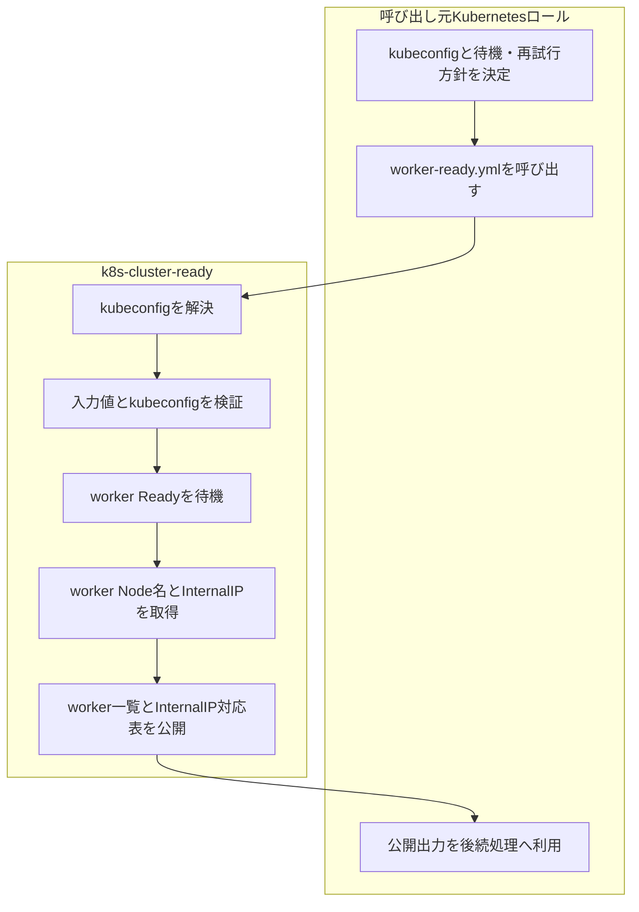

# k8s-cluster-ready ロール

本ロールは, Kubernetesクラスタへcluster-wideコンポーネントを導入する前にworker NodeのReady状態を確認し, worker Node名とInternalIPの対応を共通形式で取得するための共通ロールです。

## 目次

- [k8s-cluster-ready ロール](#k8s-cluster-ready-ロール)
  - [目次](#目次)
  - [用語](#用語)
  - [概要](#概要)
  - [前提条件](#前提条件)
  - [呼び出し元ロールからの使用方法](#呼び出し元ロールからの使用方法)
    - [4.1 呼び出し元ロール作成者が実施する作業](#41-呼び出し元ロール作成者が実施する作業)
    - [4.2 トップディレクトリの`site.yml`で実施する通常のKubernetesクラスタ構築処理で使用する場合](#42-トップディレクトリのsiteymlで実施する通常のkubernetesクラスタ構築処理で使用する場合)
    - [4.3 他ロールから共通taskとして使用する場合](#43-他ロールから共通taskとして使用する場合)
  - [主要変数](#主要変数)
  - [テンプレートと生成ファイル](#テンプレートと生成ファイル)
  - [実行フロー](#実行フロー)
  - [検証ポイント](#検証ポイント)
    - [1. worker NodeのReady状態確認](#1-worker-nodeのready状態確認)
    - [2. worker Node名とInternalIP取得確認](#2-worker-node名とinternalip取得確認)
    - [3. kubeconfigフォールバック確認](#3-kubeconfigフォールバック確認)
  - [トラブルシューティング](#トラブルシューティング)
    - [1. kubeconfigが存在せず停止する場合](#1-kubeconfigが存在せず停止する場合)
    - [2. worker Ready待機でtimeoutする場合](#2-worker-ready待機でtimeoutする場合)
    - [3. worker Nodeが0件で停止する場合](#3-worker-nodeが0件で停止する場合)
    - [4. worker検出API要求が失敗する場合](#4-worker検出api要求が失敗する場合)
    - [5. InternalIPを取得できない場合](#5-internalipを取得できない場合)
  - [注意事項](#注意事項)
  - [参考資料](#参考資料)
    - [公式ドキュメント](#公式ドキュメント)

## 用語

| 正式名称 | 略称 | 意味 |
| --- | --- | --- |
| ユーザ | - | 機能を利用する人, 又は識別された利用主体。 |
| ツール | - | 特定作業を実行するための機能や道具。 |
| リソース | - | 処理に必要な計算機資源やデータ。 |
| クラスタ | - | 複数の機器を連携させて一体運用する構成。 |
| ディストリビューション | - | 基本ソフトウェアと関連部品をまとめた配布形態。 |
| コンテナイメージ | - | コンテナ実行に必要な内容をまとめた保存形式。 |
| プログラム | - | 計算機に処理をさせるための命令列。 |
| コミュニティ | - | 共通目的のもとで継続的に活動する利用者集団。 |
| プラグイン | - | 既存機能へ追加機能を組み込むための拡張部品。 |
| サービスアカウント (Service Account) | - | 自動処理中でサービスを呼び出す側のプログラムを識別するための識別情報。 |
| コンテナランタイム | - | コンテナを起動, 停止, 管理する実行基盤。 |
| リクエスト | - | 処理実行や情報取得を要求する操作。 |
| コントローラ | - | 対象状態を監視し, 期待状態へ調整する制御機能。 |
| メタデータ | - | 対象データの属性や説明を示す付加情報。 |
| バックエンド | - | 利用者画面の背後で処理を実行する側。 |
| ストレージ | - | データを保存する仕組み。 |
| インストール | - | ソフトウェアを導入して利用可能にする作業。 |
| マシン | - | 処理を実行する計算機。 |
| プロビジョニング | - | 利用開始に必要な設定や資源を準備する作業。 |
| ルーティング | - | 宛先までの経路を選択して転送する処理。 |
| オブジェクト | - | ひとかたまりとして扱うデータ単位。 |
| エージェント | - | 指示に従って処理を代行する構成要素。 |
| ストア | - | データや成果物を保存する場所。 |
| ジャーナル | - | 時系列の記録を保持する仕組み。 |
| アカウント | - | 利用者や処理主体を識別する登録情報。 |
| エンドポイント | - | 通信の接続先を表す識別点。 |
| パターン | - | 繰り返し現れる構造や記述形式。 |
| パケット | - | ネットワークで転送するデータ単位。 |
| カーネル | - | 基本ソフトウェアの中核機能。 |
| シェル | - | コマンド入力で計算機を操作する仕組み。 |
| Playbook | - | 自動化処理の実行手順を記述したファイル。 |
| Canonical | - | Ubuntu を提供する組織名。 |
| Key-Value | - | キーと値の組で情報を表す方式。 |
| Internet Protocol | IP | ネットワーク上で宛先を識別し, データを届けるための通信手順。 |
| Structured Query Language | SQL | データベースを操作するための記述言語。 |
| Hypertext Transfer Protocol | HTTP | World Wide Webで情報をやり取りする通信手順。 |
| Hypertext Transfer Protocol Secure | HTTPS | 通信内容を暗号化してWorld Wide Web通信を行う方式。 |
| RPM Package Manager | RPM | RPM形式パッケージの導入, 更新, 削除, 情報参照を行う仕組み。 |
| Virtual Machine | VM | 物理計算機上で動作する仮想的な計算機。 |
| localhost | - | 同一機器自身を指す名前。 |
| root | - | Unix 系システムの最上位権限を持つ管理者識別子。 |
| ソフトウェア | - | 情報処理システムで使用するプログラム, 手順, 規則及び関連文書の全体又は一部分。 |
| システム | - | 複数の要素が連携して目的を実現する仕組み全体。 |
| アプリケーション | - | 利用者の目的を実現するために動作するソフトウェア。 |
| パッケージ | - | ソフトウェア導入に必要なファイルをまとめた配布単位。 |
| リポジトリ | - | ソフトウェアや設定情報を保管し, 取得できるようにした管理場所。 |
| コマンド | - | 実行者が計算機へ処理を指示するための命令。 |
| ホスト | - | 管理対象として識別される個別の計算機。 |
| サーバ | - | 他の機器や利用者へ機能やデータを提供する計算機, 又はその役割。 |
| ノード | - | ネットワークに接続された機器または処理単位。 |
| コンテナ | - | アプリケーションを動かす隔離された実行単位。 |
| ネットワーク | - | 機器同士を接続してデータをやり取りする仕組み。 |
| アドレス | - | 宛先や所在を識別するための情報。 |
| プロトコル | - | 通信やデータ交換の手順を定めた取り決め。 |
| ディレクトリ | - | ファイルを階層的に整理するための入れ物。 |
| ログ | - | 処理の結果や状態を時系列で記録した情報。 |
| コード | - | 処理内容を記述した文字列。 |
| Kubernetes | K8s | コンテナを管理する基盤ソフトウェア。 |
| Pod | - | Kubernetes でコンテナをまとめて管理する最小単位。 |
| Linux | - | 多くの機器で使われる, 基本ソフトウェアの系統。 |
| Debian | - | コミュニティ主導で開発される Linux ディストリビューション。 |
| Ubuntu | - | Canonical が提供する Debian 系の Linux ディストリビューション。 |
| Docker | - | コンテナイメージやコンテナの作成, 実行, 管理を行うコマンド。 |
| Ansible | - | 設定の同一化や導入作業を所定の手順に従って自動化する仕組み。 |
| World Wide Web | WWW | ネットワーク上で文書や情報を相互参照できる仕組み。 |
| Service | - | サービスの英語表記。 |
| Node | - | ノードの英語表記。 |
| Makefile | - | 実行手順を定義したファイル。 |
| Application Programming Interface | API | アプリケーション同士が機能やデータをやり取りするための取り決め。 |
| Uniform Resource Locator | URL | World Wide Web上の資源の場所を示す文字列。 |
| Host Variables | host_vars | ホスト単位の設定値を格納する変数定義。 |
| Ansible Inventory | inventory | 実行対象ホストの一覧と接続情報を管理する定義。 |
| Ansible Task | task | 自動化処理の最小単位となる実行項目。 |
| ansible-playbookコマンド | - | Ansible Playbook を実行して自動構成処理を適用するコマンド。 |
| 制御ホスト | - | Playbook を実行し, 他ホストへの処理指示を行う管理用ホスト。 |
| 対象ホスト | - | Playbook による設定変更や導入処理の適用先となるホスト。 |
| control plane ノード | - | Kubernetes の制御機能を担うノード。 |
| worker ノード | - | Kubernetes 上で動作するアプリケーションを実行するノード。 |
| kubeconfig | - | Kubernetes API接続先と認証情報を記述した設定ファイル。 |
| kubectl | - | Kubernetesクラスタを操作するためのコマンドラインツール。 |
| InternalIP | - | Kubernetes Nodeの`status.addresses`で`type: InternalIP`として公開されるノード内部通信用IPアドレス。 |
| adapter | - | 呼び出し元の既存インターフェースと共通機能のインターフェースの差を吸収する変換処理。 |

## 概要

`k8s-cluster-ready`は, worker Nodeの状態確認処理を複数のKubernetes関連ロールから再利用するための共通ロールです。

本ロールの責務は次の通りです。

- control plane Nodeを除外したworker NodeがReady条件を満たすまで待機します。
- Kubernetes APIからworker Node名とInternalIPを1回の要求で取得します。
- worker Node名のlistを`k8s_cluster_ready_worker_hosts`として公開します。
- worker Node名をキー, 接続先InternalIPを値とするdictを`k8s_cluster_ready_worker_node_internal_ip_map`として公開します。
- InternalIPを取得できないworker Nodeでは, worker Node名自身を接続先のフォールバック値として使用します。
- timeout, retry, Ready待機失敗時の停止可否を呼び出し元から指定できるようにします。

本ロールは, worker Nodeを使用するパッケージに固有処理や後続処理を実装しません。呼び出し元ロールは, 本ロールの公開出力を使用して各ロール固有の処理を継続します。

## 前提条件

- 対象Kubernetesクラスタのcontrol planeが構築済みで, Kubernetes APIへ接続できること。
- worker Nodeが対象クラスタへ登録済みであること。
- 本ロールを実行する対象ホストで`kubectl`を実行可能であること。
- `k8s_cluster_ready_kubeconfig_path`又はフォールバック先の`k8s_admin_kubeconfig_path`が, 対象ホスト上の通常ファイルとして存在すること。
- `kubectl get nodes`を実行できる権限をkubeconfigの認証主体が持つこと。

## 呼び出し元ロールからの使用方法

### 4.1 呼び出し元ロール作成者が実施する作業

呼び出し元ロール作成者は, 次の作業を実施します。

1. worker状態確認に使用するkubeconfigを決定します。
2. Ready待機の有効化, timeout, retry, timeout時の停止可否を決定します。
3. worker検出API要求のtimeoutとretry方針を決定します。
4. トップディレクトリの`site.yml`で実施する通常のKubernetesクラスタ構築順序の一部としてworker NodeがReadyとなることを待ち合わせる用途では, Playbookの`roles`から`k8s-cluster-ready`を呼び出します。
5. 他ロール内部の共通taskとして利用する場合は, `ansible.builtin.include_role`で`tasks_from: worker-ready.yml`を指定します。
6. 他ロール内部の共通taskとして利用した場合は, 本ロールから設定される`k8s_cluster_ready_worker_hosts`と`k8s_cluster_ready_worker_node_internal_ip_map`を後続処理で利用することが可能です。

公開入力変数は[主要変数](#主要変数)に記載します。

### 4.2 トップディレクトリの`site.yml`で実施する通常のKubernetesクラスタ構築処理で使用する場合

通常のクラスタ構築では, `k8s-management.yml`の`roles`から本ロール全体を実行します。現在の`k8s-management.yml`では, MultusやWhereaboutsなどのcluster-wideコンポーネントを導入する前に本ロールを配置しています。

Playbookへの記載例を次に示します。

```yaml
1: - name: Configure Kubernetes management components
2:   hosts: k8s_management
3:   become: true
4:   roles:
5:     - role: k8s-cluster-ready
6:       tags: k8s-cluster-ready
7:     - role: k8s-multus
8:       tags: k8s-multus
```

上記例の各行での記載内容は次の通りです。

| 行番号 | 設定項目 | 設定内容 | 設定例 |
| --- | --- | --- | --- |
| 1-4 | Playとroles定義 | Kubernetes管理系ロールを実行するPlayと`roles`を定義します。 | `hosts: k8s_management` |
| 5-6 | worker Ready確認 | cluster-wideコンポーネントより前に`k8s-cluster-ready`を実行します。 | `role: k8s-cluster-ready` |
| 7-8 | 後続ロール | worker Ready確認後にworker Nodeを利用するロールを実行します。 | `role: k8s-multus` |

この方式では`tasks/main.yml`が実行されます。通常クラスタ構築順序の同期点として利用するための方式であり, 公開出力変数を別ロールへ直接受け渡すことを主目的としません。

### 4.3 他ロールから共通taskとして使用する場合

worker Node名, Ready状態, InternalIPを後続処理で使用するロールは, `worker-ready.yml`を共通taskとして呼び出します。

呼び出し例を次に示します。

```yaml
1: - name: Discover worker hosts with k8s-cluster-ready
2:   vars:
3:     k8s_cluster_ready_kubeconfig_path: "{{ runtime_kubeconfig_path }}"
4:     k8s_cluster_ready_wait_for_worker_ready_enabled: true
5:     k8s_cluster_ready_wait_for_worker_ready_timeout_seconds: 180
6:     k8s_cluster_ready_wait_for_worker_ready_fail_on_timeout: true
7:     k8s_cluster_ready_wait_retry_enabled: true
8:     k8s_cluster_ready_wait_retries: 3
9:     k8s_cluster_ready_wait_retry_interval_seconds: 5
10:     k8s_cluster_ready_worker_discovery_request_timeout_seconds: 10
11:     k8s_cluster_ready_worker_discovery_retry_enabled: true
12:     k8s_cluster_ready_worker_discovery_retries: 3
13:     k8s_cluster_ready_worker_discovery_retry_interval_seconds: 5
14:   block:
15:     - name: Run k8s-cluster-ready worker discovery
16:       ansible.builtin.include_role:
17:         name: k8s-cluster-ready
18:         tasks_from: worker-ready.yml
```

上記例の各行での記載内容は次の通りです。

| 行番号 | 設定項目 | 設定内容 | 設定例 |
| --- | --- | --- | --- |
| 1-3 | kubeconfig | 対象クラスタへ接続するkubeconfigを呼び出し元で解決して渡します。 | `runtime_kubeconfig_path` |
| 4-9 | Ready待機 | Ready待機の有効化, timeout, 失敗時の停止可否, retry条件を指定します。 | `timeout_seconds: 180` |
| 10-13 | worker検出 | worker Node取得要求のtimeoutとretry条件を指定します。 | `request_timeout_seconds: 10` |
| 14-18 | 共通task呼び出し | `include_role`で`worker-ready.yml`だけを実行します。 | `tasks_from: worker-ready.yml` |

`worker-ready.yml`は, `resolve-runtime-vars.yml` → `validate.yml` → `wait-worker-ready.yml` → `discover-worker-hosts.yml`の順に処理します。

呼び出し後に利用できる公開出力変数は次の通りです。

| 変数名 | 値の型 | 内容 | 値の例 |
| --- | --- | --- | --- |
| `k8s_cluster_ready_worker_hosts` | list | 検出したworker Node名を格納します。 | `['k8sworker0101.local', 'k8sworker0102.local']` |
| `k8s_cluster_ready_worker_node_internal_ip_map` | dict | worker Node名をキーとし, InternalIPを取得できた場合はそのアドレスを, 取得できない場合はworker Node名を値として設定します。 | `{'k8sworker0101.local': '192.168.30.42'}` |

`k8s_cluster_ready_worker_hosts`の要素形式は次の通りです。

| 項目 | 値の型 | 値の内容 | 値の例 |
| --- | --- | --- | --- |
| 要素 | string | worker Node名を設定します。 | `k8sworker0101.local` |

`k8s_cluster_ready_worker_node_internal_ip_map`のデータ形式は次の通りです。

| キー | 値の型 | 値の内容 | 値の例 |
| --- | --- | --- | --- |
| `k8sworker0101.local` | string | worker NodeのInternalIPを設定します。InternalIPを取得できない場合は, worker Node名を設定します。 | InternalIPを取得できた場合: `192.168.30.42` / InternalIPを取得できない場合: `k8sworker0101.local` |
| `k8sworker0102.local` | string | worker NodeのInternalIPを設定します。InternalIPを取得できない場合は, worker Node名を設定します。 | InternalIPを取得できた場合: `192.168.30.43` / InternalIPを取得できない場合: `k8sworker0102.local` |

## 主要変数

本節には, 呼び出し元ロール作成者が設定する公開入力変数だけを記載します。

| 変数名 | 意味 | 既定値 | 設定例 |
| --- | --- | --- | --- |
| `k8s_cluster_ready_kubeconfig_path` | worker状態確認に使用するkubeconfigを指定します。空の場合は`k8s_admin_kubeconfig_path`へフォールバックします。 | `""` | `"/etc/kubernetes/admin.conf"` |
| `k8s_cluster_ready_wait_for_worker_ready_enabled` | worker検出前にReady条件を待機する場合に`true`を指定します。 | `true` | `true` |
| `k8s_cluster_ready_wait_for_worker_ready_timeout_seconds` | worker Ready待機1回あたりのtimeout秒数を指定します。 | `180` | `180` |
| `k8s_cluster_ready_wait_for_worker_ready_fail_on_timeout` | Ready待機失敗時に処理を停止する場合に`true`を指定します。 | `true` | `true` |
| `k8s_cluster_ready_wait_retry_enabled` | Ready待機コマンドの終了コードが0以外の場合に再試行する場合は`true`を指定します。 | `true` | `true` |
| `k8s_cluster_ready_wait_retries` | Ready待機コマンドの最大試行回数を指定します。 | `3` | `3` |
| `k8s_cluster_ready_wait_retry_interval_seconds` | Ready待機コマンドの試行間隔秒数を指定します。 | `5` | `5` |
| `k8s_cluster_ready_worker_discovery_request_timeout_seconds` | worker検出API要求1回あたりのtimeout秒数を指定します。 | `10` | `10` |
| `k8s_cluster_ready_worker_discovery_retry_enabled` | worker検出コマンドを再試行する場合に`true`を指定します。 | `true` | `true` |
| `k8s_cluster_ready_worker_discovery_retries` | worker検出コマンドの最大試行回数を指定します。 | `3` | `3` |
| `k8s_cluster_ready_worker_discovery_retry_interval_seconds` | worker検出コマンドの試行間隔秒数を指定します。 | `5` | `5` |

## テンプレートと生成ファイル

本ロールはテンプレートから設定ファイルを生成しません。`worker-ready.yml`の実行結果はAnsible factとして呼び出し元へ公開します。

## 実行フロー

通常クラスタ構築時と共通task利用時の責務範囲を次に示します。



本ロールはworker状態確認と公開出力生成までを責務とし, 公開出力を使ったイメージ配布, Helm導入, ネットワーク設定などのパッケージ固有処理は呼び出し元ロールの責務です。

## 検証ポイント

### 1. worker NodeのReady状態確認

**実施対象ホスト**: `k8s_management`グループの対象ホスト

**実行するコマンド**:

```bash
kubectl --kubeconfig /etc/kubernetes/admin.conf get nodes -l '!node-role.kubernetes.io/control-plane'
```

**期待される出力**:

control plane以外のworker Nodeが表示され, `STATUS`が`Ready`になります。

**実行結果の例**:

```text
NAME                   STATUS   ROLES    AGE   VERSION
k8sworker0101.local    Ready    <none>   10m   v1.31.x
k8sworker0102.local    Ready    <none>   10m   v1.31.x
```

**確認ポイント**:

- control plane Nodeが一覧に含まれないこと。
- 対象worker Nodeがすべて`Ready`であること。

### 2. worker Node名とInternalIP取得確認

**実施対象ホスト**: `k8s_management`グループの対象ホスト

**実行するコマンド**:

```bash
kubectl --kubeconfig /etc/kubernetes/admin.conf get nodes \
  --selector='!node-role.kubernetes.io/control-plane' \
  -o 'custom-columns=NAME:.metadata.name,INTERNAL_IPS:.status.addresses[?(@.type=="InternalIP")].address' \
  --no-headers
```

**期待される出力**:

各worker NodeについてNode名とInternalIPが表示されます。

**実行結果の例**:

```text
k8sworker0101.local   192.168.30.42
k8sworker0102.local   192.168.30.43
```

**確認ポイント**:

- worker Node名がKubernetes Node名と一致すること。
- InternalIPが取得できるworkerでは接続先として使用するIPアドレスが表示されること。

### 3. kubeconfigフォールバック確認

**実施対象ホスト**: `k8s_management`グループの対象ホスト

**実行するコマンド**:

```bash
test -f /etc/kubernetes/admin.conf && echo OK
```

**期待される出力**:

```text
OK
```

**実行結果の例**:

```text
OK
```

**確認ポイント**:

- `k8s_cluster_ready_kubeconfig_path`が空の場合のフォールバック先が通常ファイルとして存在すること。

## トラブルシューティング

### 1. kubeconfigが存在せず停止する場合

**実施対象ホスト**: `k8s_management`グループの対象ホスト

**実行するコマンド**:

```bash
sudo ls -l /etc/kubernetes/admin.conf
```

**実行結果の例**:

```text
$ sudo ls -l /etc/kubernetes/admin.conf
-rw------- 1 root root 7130  8月 30 13:25 /etc/kubernetes/admin.conf
```

**確認ポイント**:

- `k8s_cluster_ready_kubeconfig_path`又は`k8s_admin_kubeconfig_path`が正しいこと。
- 対象ホスト上にkubeconfigが配置されていること。

### 2. worker Ready待機でtimeoutする場合

**実施対象ホスト**: `k8s_management`グループの対象ホスト

**実行するコマンド**:

```bash
sudo kubectl --kubeconfig /etc/kubernetes/admin.conf get nodes
```

**実行結果の例**:

```text
$ sudo kubectl --kubeconfig /etc/kubernetes/admin.conf get nodes
NAME             STATUS   ROLES           AGE     VERSION
k8sctrlplane01   Ready    control-plane   7h49m   v1.31.14
k8sworker0101    Ready    <none>          7h30m   v1.31.14
k8sworker0102    Ready    <none>          7h30m   v1.31.14
```

**確認ポイント**:

- worker Nodeがクラスタへ登録済みであること。
- kubeletとCNIの状態を確認し, `NotReady`の原因を先に解消すること。
- Ready待機コマンドが終了コード0以外で終了した場合は, `k8s_cluster_ready_wait_retry_enabled`が`true`であれば`k8s_cluster_ready_wait_retries`の回数まで再試行されること。
- 単に起動時間が不足している場合のみ`k8s_cluster_ready_wait_for_worker_ready_timeout_seconds`を見直すこと。

### 3. worker Nodeが0件で停止する場合

**実施対象ホスト**: `k8s_management`グループの対象ホスト

**実行するコマンド**:

```bash
sudo kubectl --kubeconfig /etc/kubernetes/admin.conf get nodes \
  --selector='!node-role.kubernetes.io/control-plane'
```

**実行結果の例**:

```text
$ sudo kubectl --kubeconfig /etc/kubernetes/admin.conf get nodes \
  --selector='!node-role.kubernetes.io/control-plane'
NAME            STATUS   ROLES    AGE     VERSION
k8sworker0101   Ready    <none>   7h31m   v1.31.14
k8sworker0102   Ready    <none>   7h30m   v1.31.14
```

**確認ポイント**:

- worker Nodeが対象クラスタへjoin済みであること。
- worker Nodeへ`node-role.kubernetes.io/control-plane`ラベルが誤設定されていないこと。

### 4. worker検出API要求が失敗する場合

**実施対象ホスト**: `k8s_management`グループの対象ホスト

**実行するコマンド**:

```bash
sudo kubectl --request-timeout=10s --kubeconfig /etc/kubernetes/admin.conf get nodes
```

**実行結果の例**:

```text
Unable to connect to the server: context deadline exceeded
```

**確認ポイント**:

- Kubernetes API endpointへ到達できること。
- kubeconfigのserver設定と認証情報が有効であること。
- API応答が一時的に遅い場合だけretry回数やrequest timeoutを見直すこと。

### 5. InternalIPを取得できない場合

**実施対象ホスト**: `k8s_management`グループの対象ホスト

**実行するコマンド**:

```bash
sudo kubectl --kubeconfig /etc/kubernetes/admin.conf get node k8sworker0101 \
  -o jsonpath='{.status.addresses}'
```

**実行結果の例**:

```text
$ sudo kubectl --kubeconfig /etc/kubernetes/admin.conf get node k8sworker0101   -o jsonpath='{.status.addresses}'
[{"address":"fdad:ba50:248b:1::42","type":"InternalIP"},{"address":"192.168.30.42","type":"InternalIP"},{"address":"k8sworker0101","type":"Hostname"}]
```

**確認ポイント**:

- `type: InternalIP`のaddressがNode statusに存在するか確認すること。
- InternalIPが存在しない場合, 本ロールの公開dictではworker Node名自身を値として使用すること。
- 呼び出し元ロールがNode名による接続を許容できるか確認すること。

## 注意事項

- `worker-ready.yml`は呼び出し元ロール向けの共通taskです。パッケージ固有処理を追加しないでください。
- worker選択条件は`!node-role.kubernetes.io/control-plane`です。control plane以外のNodeをworkerとして扱います。
- InternalIPが複数取得された場合は, Kubernetes API出力の先頭候補を代表接続先として使用します。
- InternalIPを取得できない場合はworker Node名へフォールバックします。呼び出し元はNode名で接続可能な名前解決環境を必要に応じて用意してください。
- `k8s_cluster_ready_worker_hosts`と`k8s_cluster_ready_worker_node_internal_ip_map`は呼び出しごとに再構築されます。

## 参考資料

本ロールを共通taskとして利用する実装例は次のREADMEを参照してください。

- [`k8s-register-image`](../k8s-register-image/Readme.md): worker Node自動検出を本ロールへ委譲し, 公開出力をイメージ配布処理へ変換するadapter実装例。
- [`k8s-multus`](../k8s-multus/Readme.md): 通常の`k8s-management.yml`実行順序で本ロールのReady確認後に導入されるロール。
- [`k8s-whereabouts`](../k8s-whereabouts/Readme.md): Multus導入後に実行されるcluster-wideコンポーネントの例。

### 公式ドキュメント

- [Kubernetes Nodes](https://kubernetes.io/docs/concepts/architecture/nodes/)
- [kubectl wait](https://kubernetes.io/docs/reference/kubectl/generated/kubectl_wait/)
- [kubectl get](https://kubernetes.io/docs/reference/kubectl/generated/kubectl_get/)
