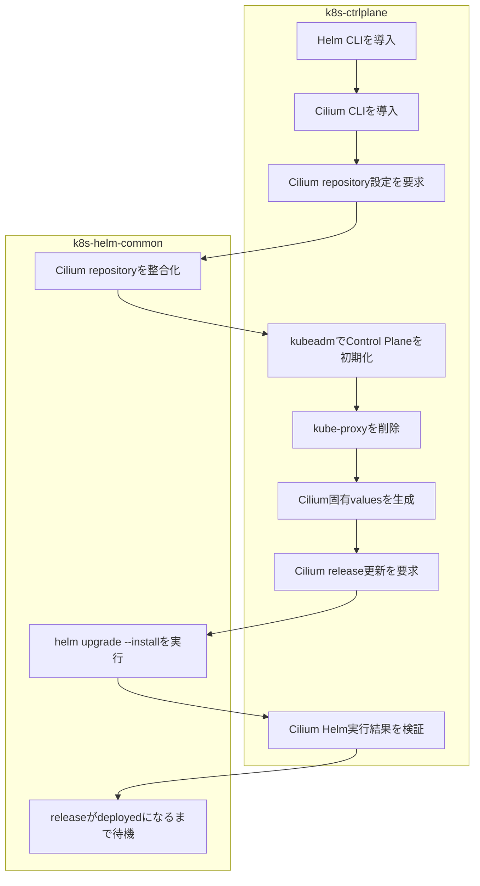

# k8s-ctrlplane ロール

本ロールは, Kubernetes コントロールプレーンノードを構築するロールです。

## 目次

- [k8s-ctrlplane ロール](#k8s-ctrlplane-ロール)
  - [目次](#目次)
  - [用語](#用語)
  - [概要](#概要)
  - [主な処理](#主な処理)
  - [前提条件](#前提条件)
  - [実行方法](#実行方法)
    - [Makeターゲットを使用する場合](#makeターゲットを使用する場合)
  - [主要変数](#主要変数)
    - [API待機・kubeadm関連](#api待機kubeadm関連)
    - [Kubernetes API監査関連](#kubernetes-api監査関連)
    - [Cilium/Helm関連](#ciliumhelm関連)
    - [Cilium BGP/Cluster Mesh関連](#cilium-bgpcluster-mesh関連)
    - [共有CA関連](#共有ca関連)
    - [firewall/補完/オペレータ関連](#firewall補完オペレータ関連)
  - [設定例](#設定例)
    - [パターン 1: IPv4優先デュアルスタック (基本)](#パターン-1-ipv4優先デュアルスタック-基本)
    - [パターン 2: IPv6優先デュアルスタック](#パターン-2-ipv6優先デュアルスタック)
    - [パターン 3: Cluster Mesh 用埋め込み kubeconfig を生成](#パターン-3-cluster-mesh-用埋め込み-kubeconfig-を生成)
    - [パターン 4: Cilium BGP Control Plane を有効化](#パターン-4-cilium-bgp-control-plane-を有効化)
  - [テンプレートと生成ファイル](#テンプレートと生成ファイル)
  - [実行フロー](#実行フロー)
    - [Helm操作の責務分界](#helm操作の責務分界)
    - [ステップ1: 変数読み込み](#ステップ1-変数読み込み)
    - [ステップ2: ディレクトリ準備](#ステップ2-ディレクトリ準備)
    - [ステップ3: 予約タスク読み込み](#ステップ3-予約タスク読み込み)
    - [ステップ4: ファイアウォール構成](#ステップ4-ファイアウォール構成)
    - [ステップ5: Helm/Cilium CLI と補完構成](#ステップ5-helmcilium-cli-と補完構成)
    - [ステップ6: kubeadm 初期化](#ステップ6-kubeadm-初期化)
    - [ステップ7: Cilium 導入](#ステップ7-cilium-導入)
    - [ステップ8: Cilium BGP Control Plane (任意)](#ステップ8-cilium-bgp-control-plane-任意)
    - [ステップ9: Cluster Mesh ツール配布](#ステップ9-cluster-mesh-ツール配布)
    - [デフォルト動作](#デフォルト動作)
    - [OS 差異](#os-差異)
  - [検証ポイント](#検証ポイント)
    - [パターン A: 基本構成](#パターン-a-基本構成)
    - [パターン B: デュアルスタック順序確認 (IPv4優先デュアルスタック / IPv6優先デュアルスタック)](#パターン-b-デュアルスタック順序確認-ipv4優先デュアルスタック--ipv6優先デュアルスタック)
    - [パターン C: Cluster Mesh ツール生成](#パターン-c-cluster-mesh-ツール生成)
    - [パターン D: Cilium BGP Control Plane 適用時確認](#パターン-d-cilium-bgp-control-plane-適用時確認)
  - [トラブルシューティング](#トラブルシューティング)
    - [1. kubeadm init が失敗する場合](#1-kubeadm-init-が失敗する場合)
    - [2. Cilium が起動しない場合](#2-cilium-が起動しない場合)
    - [3. firewall 設定が反映されない場合](#3-firewall-設定が反映されない場合)
    - [4. Cluster Mesh 用埋め込み kubeconfig 生成に失敗する場合](#4-cluster-mesh-用埋め込み-kubeconfig-生成に失敗する場合)
    - [5. BGP マニフェスト適用で失敗する場合](#5-bgp-マニフェスト適用で失敗する場合)
  - [注意事項](#注意事項)
  - [参考資料](#参考資料)
    - [公式ドキュメント](#公式ドキュメント)

## 用語

| 正式名称 | 略称 | 意味 |
| --- | --- | --- |
| ユーザ | - | 機能を利用する人, 又は識別された利用主体。 |
| ツール | - | 特定作業を実行するための機能や道具。 |
| リソース | - | 処理に必要な計算機資源やデータ。 |
| クラスタ | - | 複数の機器を連携させて一体運用する構成。 |
| ディストリビューション | - | 基本ソフトウェアと関連部品をまとめた配布形態。 |
| コンテナイメージ | - | コンテナ実行に必要な内容をまとめた保存形式。 |
| プログラム | - | 計算機に処理をさせるための命令列。 |
| コミュニティ | - | 共通目的のもとで継続的に活動する利用者集団。 |
| プラグイン | - | 既存機能へ追加機能を組み込むための拡張部品。 |
| サービスアカウント (Service Account) | - | 自動処理中でサービスを呼び出す側のプログラムを識別するための識別情報。 Kubernetesでは, 人間以外の実体をKubernetesクラスタ内で一意に識別するために用いられるアカウントのことを指す。 アプリケーションPod, システムコンポーネント, および, Kubernetesクラスター内外の実体に紐づけられたServiceAccountの認証情報を通して, これらの実体を互いに識別する。 |
| コンテナランタイム | - | コンテナを起動, 停止, 管理する実行基盤。 |
| リクエスト | - | 処理実行や情報取得を要求する操作。 |
| コントローラ | - | 対象状態を監視し, 期待状態へ調整する制御機能。 |
| メタデータ | - | 対象データの属性や説明を示す付加情報。 |
| バックエンド | - | 利用者画面の背後で処理を実行する側。 |
| ストレージ | - | データを保存する仕組み。 |
| インストール | - | ソフトウェアを導入して利用可能にする作業。 |
| マシン | - | 処理を実行する計算機。 |
| プロビジョニング | - | 利用開始に必要な設定や資源を準備する作業。 |
| ルーティング | - | 宛先までの経路を選択して転送する処理。 |
| オブジェクト | - | ひとかたまりとして扱うデータ単位。 |
| エージェント | - | 指示に従って処理を代行する構成要素。 |
| ストア | - | データや成果物を保存する場所。 |
| ジャーナル | - | 時系列の記録を保持する仕組み。 |
| アカウント | - | 利用者や処理主体を識別する登録情報。 |
| エンドポイント | - | 通信の接続先を表す識別点。 |
| パターン | - | 繰り返し現れる構造や記述形式。 |
| パケット | - | ネットワークで転送するデータ単位。 |
| カーネル | - | 基本ソフトウェアの中核機能。 |
| シェル | - | コマンド入力で計算機を操作する仕組み。 |
| Playbook | - | 自動化処理の実行手順を記述したファイル。 |
| Canonical | - | Ubuntu を提供する組織名。 |
| Key-Value | - | キーと値の組で情報を表す方式。 |
| Internet Protocol | IP | ネットワーク上で宛先を識別し, データを届けるための通信手順。 |
| Structured Query Language | SQL | データベースを操作するための記述言語。 |
| Hypertext Transfer Protocol | HTTP | World Wide Webで情報をやり取りする通信手順。 |
| Hypertext Transfer Protocol Secure | HTTPS | 通信内容を暗号化してWorld Wide Web通信を行う方式。 |
| RPM Package Manager | RPM | RPM形式パッケージの導入, 更新, 削除, 情報参照を行う仕組み。 |
| Virtual Machine | VM | 物理計算機上で動作する仮想的な計算機。 |
| localhost | - | 同一機器自身を指す名前。 |
| root | - | Unix 系システムの最上位権限を持つ管理者識別子。 |
| ソフトウェア | - | 情報処理システムで使用するプログラム, 手順, 規則及び関連文書の全体又は一部分。 |
| システム | - | 複数の要素が連携して目的を実現する仕組み全体。 |
| アプリケーション | - | 利用者の目的を実現するために動作するソフトウェア。 |
| パッケージ | - | ソフトウェア導入に必要なファイルをまとめた配布単位。 |
| リポジトリ | - | ソフトウェアや設定情報を保管し, 取得できるようにした管理場所。 |
| コマンド | - | 実行者が計算機へ処理を指示するための命令。 |
| ホスト | - | 管理対象として識別される個別の計算機。 |
| サーバ | - | 他の機器や利用者へ機能やデータを提供する計算機, 又はその役割。 |
| ノード | - | ネットワークに接続された機器または処理単位。 |
| コンテナ | - | アプリケーションを動かす隔離された実行単位。 |
| ネットワーク | - | 機器同士を接続してデータをやり取りする仕組み。 |
| アドレス | - | 宛先や所在を識別するための情報。 |
| プロトコル | - | 通信やデータ交換の手順を定めた取り決め。 |
| ディレクトリ | - | ファイルを階層的に整理するための入れ物。 |
| ログ | - | 処理の結果や状態を時系列で記録した情報。 |
| コード | - | 処理内容を記述した文字列。 |
| Kubernetes | K8s | コンテナを管理する基盤ソフトウェア。 |
| Pod | - | Kubernetes でコンテナをまとめて管理する最小単位。 |
| Linux | - | 多くの機器で使われる, 基本ソフトウェアの系統。 |
| Debian | - | コミュニティ主導で開発される Linux ディストリビューション。 |
| Ubuntu | - | Canonical が提供する Debian 系の Linux ディストリビューション。 |
| Docker | - | コンテナイメージやコンテナの作成, 実行, 管理を行うコマンド。 |
| Ansible | - | 設定の同一化や導入作業を所定の手順に従って自動化する仕組み。 |
| World Wide Web | WWW | ネットワーク上で文書や情報を相互参照できる仕組み。 |
| Service | - | サービスの英語表記。 |
| Node | - | ノードの英語表記。 |
| Makefile | - | 実行手順を定義したファイル。 |
| Application Programming Interface | API | アプリケーション同士が機能やデータをやり取りするための取り決め。 |
| Uniform Resource Locator | URL | World Wide Web上の資源の場所を示す文字列。 |
| Application Programming Interface | API | アプリケーション同士が機能やデータをやり取りするための取り決め。 |
| Custom Resource Definition | CRD | Kubernetes APIを拡張してユーザ独自のリソース種別を定義する仕組み。 |
| Role-Based Access Control | RBAC | ユーザやサービスアカウントが実行可能な操作を役割(Role)で制限する仕組み。 |
| Service Account | - | Kubernetes内部でPodが他のリソースにアクセスする際に用いる仮想的なアカウント。 |
| ClusterRole | - | Kubernetesクラスタ全体に適用される権限の集合。 |
| ClusterRoleBinding | - | ClusterRoleをユーザやサービスアカウントに紐付ける仕組み。 |
| Role | - | 特定の名前空間内で有効な権限の集合。 |
| RoleBinding | - | Roleをユーザやサービスアカウントに紐付ける仕組み。 |
| 名前空間 ( namespace ) | - | Kubernetes内部でリソースを論理的に分離する単位。 |
| ポッド ( Pod ) | - | Kubernetes上で動作するコンテナの最小単位。 |
| デーモンセット ( DaemonSet ) | - | Kubernetesクラスタ内の全ノード(または指定した一部のノード)で必ずPodを1つずつ起動させるリソース。 |
| デプロイメント ( Deployment ) | - | 指定した数のPodを維持し, ローリングアップデート等を管理するリソース。 |
| StatefulSet | - | 状態を持つアプリケーションのPodを順序付けて管理するリソース。 |
| サービス ( Service ) | - | Podへのアクセスを抽象化し, 負荷分散やサービスディスカバリを提供するリソース。 |
| Ingress | - | Kubernetesクラスタ外部からHTTP/HTTPS通信を受け付け, 内部のServiceへルーティングする仕組み。 |
| コンフィグマップ ( ConfigMap ) | - | 設定情報を保持し, Podへ環境変数やファイルとして注入するリソース。 |
| シークレット ( Secret ) | - | 機密情報を保持し, Podへ安全に注入するリソース。 |
| PersistentVolume | PV | Kubernetesクラスタ内で利用可能なストレージリソースを表すオブジェクト。 |
| PersistentVolumeClaim | PVC | ユーザがPVを要求する際に利用するリソース。 |
| StorageClass | - | 動的にPVをプロビジョニングする際のストレージ種別を定義するリソース。 |
| Kubernetes ノード ( Kubernetes Node ) | - | Kubernetesクラスタを構成する物理マシンまたは仮想マシン。 |
| コントロールプレーンノード ( Control Plane Node ) | - | Kubernetesクラスタ全体を管理, 制御する中枢ノード群。kube-apiserver, kube-controller-manager, kube-schedulerなどが動作します。 |
| ワーカノード ( Worker Node ) | - | 実際にアプリケーションのPodを実行するノード。 |
| kube-apiserver | - | KubernetesのAPIリクエストを受け付け, etcdへの読み書きを仲介するコンポーネント。 |
| kube-controller-manager | - | Deployment, ReplicaSetなど各種コントローラを実行し, Kubernetesクラスタの状態を監視, 調整するコンポーネント。 |
| kube-scheduler | - | 新規作成されたPodを適切なNodeへ配置するコンポーネント。 |
| kubelet | - | 各Node上で動作し, Podの起動, 停止, 監視を行うエージェント。 |
| kube-proxy | - | 各Node上でServiceのネットワークルールを管理するコンポーネント。 |
| etcd | - | KubernetesのKubernetesクラスタ状態を保存する分散Key-Valueストア。 |
| Container Network Interface | CNI | コンテナ間のネットワーク接続を標準化するプラグイン仕様。 |
| Kubernetes API監査機能 ( Kubernetes API Audit )| - | Kubernetesクラスター内の一連の行動を記録するセキュリティに関連した時系列の記録を提供する機能。 |
| Cilium | - | eBPFを活用した高性能なCNIプラグイン。ネットワークポリシーやサービスメッシュ機能を提供します。 |
| Hubble | - | Ciliumが処理するネットワーク通信の状態を観測する機能。 |
| Hubble Relay | - | 各ノードのHubble情報を集約し, Hubble CLIなどから参照できるようにする構成要素。 |
| Hubble UI | - | Hubbleが収集した通信情報をWebブラウザで参照するための利用者画面。 |
| Extended Berkeley Packet Filter | eBPF | Linux カーネル内で安全にプログラムを実行する仕組み。高性能なパケット処理や観測機能の実装に利用される。 |
| Serviceエンドポイント ( Service Endpoint ) | - | Serviceのバックエンドとして通信を受けるPod, または, 当該の通信を受けるPodに加え, 当該の通信を受けるPodへ通信を届けるためのネットワーク上の転送先情報全体を指す。 |
| Serviceエンドポイント情報 ( Service Endpoint Information ) | - | Serviceエンドポイントを特定して転送先を決めるための情報。主にバックエンドPodのIPアドレス, ポート番号, プロトコル, 所属クラスタ名(またはクラスタ識別子)で構成される。 |
| Multus | - | 複数のCNIプラグインを同時に使用できるようにするメタCNIプラグイン。 |
| Container Runtime Interface | CRI | Kubernetesがコンテナランタイムと通信するための標準インターフェース。 |
| containerd | - | Dockerから分離された軽量なコンテナランタイム。 |
| kubeadm | - | Kubernetesクラスタの初期構築と管理を支援する公式ツール。 |
| kubectl | - | Kubernetesクラスタを操作するためのコマンドラインツール。 |
| Helm | - | Kubernetesアプリケーションのパッケージ管理ツール。Chart形式でアプリケーションを配布, インストールします。 |
| Chart | - | Helmで管理されるアプリケーションパッケージの単位。Kubernetes Manifestのテンプレート集。 |
| Operator | - | アプリケーション固有の運用知識をコードで自動化するKubernetesの拡張パターン。 |
| Custom Resource | CR | CRDで定義されたユーザ独自のリソースの実体。 |
| Admission Controller | - | APIリクエストがetcdに保存される前に検証, 変更を行うプラグイン。 |
| Network Policy | - | Pod間の通信を制御するファイアウォールルールを定義するリソース。 |
| Label | - | リソースに付与するKey-Value形式のメタデータ。リソースの分類, 検索に利用される。 |
| Selector | - | Labelを利用してリソースを選択する条件式。 |
| Annotation | - | リソースに付与するKey-Value形式の補足情報。ツールやコントローラが参照するメタデータ。 |
| Taint | - | Kubernetes ノードに設定する特殊なマークで, 特定の条件を満たさないPodの配置を拒否します。 |
| Toleration | - | PodがTaintを持つNodeへ配置されることを許可する設定。 |
| Border Gateway Protocol | BGP | 自律システム間で経路情報を交換する経路制御方式。 |
| Classless Inter-Domain Routing | CIDR | IP アドレスとネットワークプレフィックス長を組み合わせた表記法。 |
| Command Line Interface | CLI | 文字入力で操作する利用者向け操作方式。 |
| Network Interface Card | NIC | 計算機をネットワークへ接続するための装置または機能。 |
| Operating System | OS | 計算機の基本機能を管理し, アプリケーションを動作させる基盤ソフトウェア。 |
| Red Hat Enterprise Linux | RHEL | Red Hatが提供する企業向けLinuxディストリビューション。 |
| Uncomplicated Firewall | UFW | 簡易な操作で設定できるパケット制御機能。 |
| Host Variables | host_vars | ホスト単位の設定値を格納する変数定義。 |
| Current | CURRENT | 現在値を示す表示項目。 |
| Desired | DESIRED | 期待値を示す表示項目。 |
| Pod CIDR List | POD-CIDRS | Pod に割り当てた IP 範囲の一覧。 |
| Ready | READY | 処理を実行可能な状態を示す表示。 |
| Status | STATUS | 現在状態を示す表示。 |
| ansible-playbookコマンド | - | Ansible Playbook を実行して自動構成処理を適用するコマンド。 |
| `cat` | - | ファイル内容を標準出力へ表示するコマンド。 |
| `grep` | - | テキストから条件に一致する行を抽出するコマンド。 |
| `helm` | - | Kubernetesアプリケーションのパッケージ管理ツール。Chart形式でアプリケーションを配布, インストールします。 |
| `ls` | - | ファイルやディレクトリの一覧を表示するコマンド。 |
| makeコマンド | make | Makefile に定義された処理を実行するコマンド。 |
| 対象ホスト | - | Playbook による設定変更や導入処理の適用先となるホスト。 |
| sudoコマンド | sudo | 一時的に管理者権限でコマンドを実行するためのコマンド。 |

## 概要

Kubernetes コントロールプレーンノードを構築するロールです。`k8s-common` で整えた共通前提の上に, kubeadm 設定の生成と実行, Cilium の導入, Cluster Mesh 用 kubeconfig 生成ツールの配布, Helm/Cilium CLI 環境整備を行います。IPv4/IPv6 デュアルスタックを前提にしており, 再実行にも対応するよう設計されています。

## 主な処理

- **kubeadm 設定と再初期化**: APIファミリに合わせて Pod/Service CIDR を並べ替え, `kubeadm reset` と `kubeadm init` を実行します。`service IP family ... must match public address family ...` の不整合を回避するための処理です。
- **Cilium 導入**: `kubeProxyReplacement=true`, `routingMode=native`, `autoDirectNodeRoutes=true`, `ipv4NativeRoutingCIDR`, `ipv6NativeRoutingCIDR` を values に反映し, kube-proxy を削除して Cilium を導入します。
- **Cluster Mesh 連携**: 条件を満たす場合, 共有CAの存在を検証して埋め込み kubeconfig を生成します。不足時は明示的に失敗させます。
- **BGP Control Plane**: `k8s_bgp.enabled=true` の場合に限り, BGP関連CRDの利用可能状態を待機してからマニフェストを適用します。
- **補完/運用ツール**: Helm/Cilium 補完ファイルと Cluster Mesh 用運用ツールを配布します。

## 前提条件

- **Linux OS**: Debian/Ubuntu 系 (Ubuntu 24.04を想定) または RHEL9系 (Rocky Linux, AlmaLinux など, AlmaLinux 9.6を想定)
- **前段ロール**: `k8s-common` を先に実行済みであること
- **実行権限**: root または sudo 実行権限
- **クラスタ変数**: `k8s_ctrlplane_endpoint`, `k8s_ctrlplane_port`, `k8s_cilium_version`, Pod/Service CIDR 変数を定義済みであること
- **ネットワーク**: 複数 NIC 構成では API 到達先 NIC と `k8s_ctrlplane_endpoint` の整合を確認すること

`config.yml` は `kubeadm reset` を含むため, 既存クラスタへ適用する場合は停止計画とバックアップ計画を事前に準備してください。

## 実行方法

### Makeターゲットを使用する場合

以下のコマンドを実行します。

```bash
make run_k8s_ctrl_plane
```

本ターゲットは, Kubernetesコントロールプレーン構築用playbookを既定のインベントリと実行オプションで実行します。

## 主要変数

### API待機・kubeadm関連

Kubernetes API Server の待機条件および kubeadm の共通内部設定は [k8s-common ロール](../k8s-common/Readme.md) を参照してください。

| 変数名 | 既定値 | 説明 |
| --- | --- | --- |
| `k8s_ctrlplane_endpoint` | host_vars で指定 | Control Plane API の広告アドレス。 |
| `k8s_kubeadm_config_store` | `/home/ansible/kubeadm` | kubeadm/Cilium 設定生成の基点ディレクトリ。 |
| `k8s_pod_ipv4_network_cidr` / `k8s_pod_ipv6_network_cidr` | 必須 | Pod ネットワーク CIDR。 |
| `k8s_pod_ipv4_service_subnet` / `k8s_pod_ipv6_service_subnet` | 必須 | Service CIDR。 |

### Kubernetes API監査関連

Kubernetes API監査機能関連の設定変数を以下に示す:

| 変数名 | 既定値 | 説明 |
| --- | --- | --- |
| `k8s_audit_enabled` | `false` | Kubernetes API監査機能を有効化する。 |
| `k8s_audit_policy_path` | `/etc/kubernetes/audit-policy.yaml` | 監査ポリシーファイルのパス。 |
| `k8s_audit_log_dir` | `/var/log/kubernetes/audit` | 監査ログ格納ディレクトリ。 |
| `k8s_audit_log_path` | `/var/log/kubernetes/audit/audit.log` | 監査ログファイルのパス。 |
| `k8s_audit_log_max_age` | `30` | 古い監査ログを保持する最大日数 (単位:日)。 |
| `k8s_audit_log_max_backup` | `20` | 保持する監査ログファイルの最大数 (単位:個)。 |
| `k8s_audit_log_max_size` | `200` | ローテーション前の1ファイルの最大サイズ (単位:MiB)。 |

これらの変数は, `vars/all-config.yml`に設定し, K8sコントロールプレーンノードの設定時に同じ設置値で導入させるようにすることを推奨する。

`vars/all-config.yml`での設定例:

```yaml
# =============================================================
# Kubernetes API監査設定 (Kubernetes利用時のオプション)
# Kubernetes API ServerのAudit機能に関する設定
# Kubernetes API ServerのAudit機能:
#   https://kubernetes.io/docs/tasks/debug/debug-cluster/audit/
# =============================================================
# Kubernetes API監査機能を有効にする場合は true を指定する
k8s_audit_enabled: true
#
# Kubernetes API監査ポリシーファイルのパス
k8s_audit_policy_path: "/etc/kubernetes/audit-policy.yaml"
#
# Kubernetes API監査ログ格納ディレクトリ
k8s_audit_log_dir: "/var/log/kubernetes/audit"
#
# Kubernetes API監査ログファイルのパス
k8s_audit_log_path: "/var/log/kubernetes/audit/audit.log"
#
# Kubernetes API監査ログを保持する最大日数 (単位:日)
k8s_audit_log_max_age: 30
#
# Kubernetes API監査ログとして保持する最大ファイル数 (単位:個)
k8s_audit_log_max_backup: 20
#
# Kubernetes API監査ログ1ファイルの最大サイズ (単位: MiB)
k8s_audit_log_max_size: 200
```

### Cilium/Helm関連

| 変数名 | 既定値 | 説明 |
| --- | --- | --- |
| `k8s_helm_version` | 未定義 | 未定義または `latest` で最新版を導入。 |
| `k8s_helm_cli_completion_enabled` | `true` | Helm 補完の生成有効化。 |
| `k8s_ctrlplane_helm_clear_repositories_enabled` | `false` | `true`の場合はCilium repositoryの登録前に共通Helm操作ユーザの全repositoryを削除します。既定値`false`では既存repositoryを保持します。 |
| `k8s_cilium_version` | 必須 | Cilium ベースバージョン。 |
| `k8s_cilium_helm_chart_version` | `1.18.9` | Cilium Helm Chart バージョン。 |
| `k8s_cilium_image_version` | `v1.18.9` | Cilium イメージタグ。 |
| `k8s_cilium_helm_repo_url` | `https://helm.cilium.io/` | Cilium Helm リポジトリURL。 |
| `k8s_cilium_cli_completion_enabled` | `true` | Cilium CLI 補完の生成有効化。 |
| `k8s_cilium_shared_ca_enabled` | `false` | `k8s-cilium-shared-ca` の実行可否。 |
| `k8s_cilium_bgp_control_plane_enabled` | 未定義 | Helm values の `bgpControlPlane.enabled` を明示制御。未定義時は `k8s_bgp.enabled` に連動。 |

### Cilium BGP/Cluster Mesh関連

Cluster Mesh で使用する埋め込み kubeconfig の生成仕様は [k8s-kubeconfig ロール](../k8s-kubeconfig/Readme.md) を参照してください。本ロールでは Cluster Mesh 固有のクラスタ名, クラスタ ID および共有 CA 連携を設定します。

| 変数名 | 既定値 | 説明 |
| --- | --- | --- |
| `k8s_bgp` | (未定義) | BGP Control Plane 設定マッピング。`enabled: true` のとき `neighbors` が必須。 |
| `k8s_cilium_cm_cluster_name` | 未定義 | Cluster Mesh クラスタ名。 |
| `k8s_cilium_cm_cluster_id` | 未定義 | Cluster Mesh クラスタID。 |

### 共有CA関連

| 変数名 | 既定値 | 説明 |
| --- | --- | --- |
| `k8s_shared_ca_replace_kube_ca` | `false` | `kubeadm reset` 後の `/etc/kubernetes/pki/ca.*` の置換可否。 |
| `k8s_shared_ca_source_cert` / `k8s_shared_ca_source_key` | 未定義 | 共有CAの入力ソース。 |
| `k8s_shared_ca_cert_path` / `k8s_shared_ca_key_path` | 未定義 | 共有CAの配置先。 |
| `k8s_shared_ca_output_dir` | 未定義 | 共有CA配置ディレクトリ。 |

### firewall/補完/オペレータ関連

| 変数名 | 既定値 | 説明 |
| --- | --- | --- |
| `enable_firewall` | `false` | `true` で firewall 構成を実行。 |
| `firewall_backend` | Debian/Ubuntu: `['ufw']`, RHEL: `['firewalld']` | `ufw` または `firewalld`。 |
| `k8s_control_plane_ports` | 6443,10250,10257,10259,2379-2380 | 開放ポート一覧。 |
| `k8s_operator_user` | `kube` | オペレータユーザ。 |
| `k8s_node_setup_tools_docs_dir` | `/opt/k8snodes/docs` | ドキュメント配置ディレクトリ。 |
| `reboot_timeout_sec` | `600` | 再起動待機タイムアウト(秒)。 |

## 設定例

### パターン 1: IPv4優先デュアルスタック (基本)

```yaml
# host_vars/k8sctrlplane01.local
k8s_ctrlplane_endpoint: 192.168.20.41
k8s_ctrlplane_port: 6443
k8s_cilium_version: "1.18.9"
k8s_pod_ipv4_network_cidr: "10.244.0.0/16"
k8s_pod_ipv6_network_cidr: "fdb6:6e92:3cfb::/56"
k8s_pod_ipv4_service_subnet: "10.254.0.0/16"
k8s_pod_ipv6_service_subnet: "fdb6:6e92:3cfb:feed::/112"
enable_firewall: true
firewall_backend:
  - ufw
```

### パターン 2: IPv6優先デュアルスタック

```yaml
# host_vars/k8sctrlplane01.local
k8s_ctrlplane_endpoint: "fdb6:6e92:3cfb:1::41"
k8s_ctrlplane_port: 6443
k8s_cilium_version: "1.18.9"
k8s_pod_ipv4_network_cidr: "10.244.0.0/16"
k8s_pod_ipv6_network_cidr: "fdb6:6e92:3cfb::/56"
k8s_pod_ipv4_service_subnet: "10.254.0.0/16"
k8s_pod_ipv6_service_subnet: "fdb6:6e92:3cfb:feed::/112"
```

### パターン 3: Cluster Mesh 用埋め込み kubeconfig を生成

```yaml
# host_vars/k8sctrlplane01.local
k8s_cilium_cm_cluster_name: cluster1
k8s_cilium_cm_cluster_id: 1
k8s_embed_kubeconfig_shared_ca_path: /etc/kubernetes/pki/ca.crt
k8s_cilium_shared_ca_enabled: true
```

### パターン 4: Cilium BGP Control Plane を有効化

```yaml
# host_vars/k8sctrlplane01.local
k8s_bgp:
  enabled: true
  node_name: k8sctrlplane01
  local_asn: 65011
  kubeconfig: /etc/kubernetes/admin.conf
  export_pod_cidr: true
  advertise_services: false
  neighbors:
    - peer_address: 192.168.30.49/32
      peer_asn: 65011
      peer_port: 179
      hold_time_seconds: 90
      connect_retry_seconds: 15
```

## テンプレートと生成ファイル

本ロールでは以下のテンプレート / ファイルを出力します:
主な展開先ホストは, 委譲先(`k8s_bgp.apply_delegate` で指定したホスト, 既定は, 対象ホスト) です。

| テンプレートファイル名 | 出力先パス | 説明 |
| --- | --- | --- |
| `roles/k8s-common/templates/cilium-bgp-resources.yml.j2` | `/home/ansible/kubeadm/cilium/bgp/cilium-bgp-resources-<node-suffix>.yml` | Cilium BGP Control Plane の ClusterConfig, PeerConfig, Advertisement 定義を生成するマニフェストです。 |
| `cilium-install.yml.j2` | `/home/ansible/kubeadm/cilium/cilium-install.yml` | Cilium の導入パラメタを固定化し, クラスタ全体で一貫したネットワーク設定を適用する values マニフェストです。 |
| `create-embedded-kubeconfig.py.j2` | `/opt/k8snodes/sbin/create-embedded-kubeconfig.py` | 証明書を埋め込んだ配布用 kubeconfig を生成し, ノード間移送時の依存ファイルを減らすためのスクリプトです。 |
| `Readme-create-embedded-kubeconfig-JP.md` | `/opt/k8snodes/docs/Readme-create-embedded-kubeconfig-JP.md` | 埋め込み kubeconfig の作成手順と運用上の注意点を記載したドキュメントです。 |
| `ctrlplane-kubeadm.config.j2` | `/home/ansible/kubeadm/ctrlplane-kubeadm.config.yml` | コントロールプレーン初期化時の API サーバ, etcd, ネットワーク設定を定義する kubeadm 設定です。 |

`<node-suffix>` には, `k8s_bgp.node_name` が設定されている場合はその値, 未設定の場合は対象ホストの `ansible_hostname` が使われます。いずれも, 小文字化したうえで英小文字, 数字, ハイフン以外の文字を `-` に置換した文字列として展開されます。

## 実行フロー

### Helm操作の責務分界

本ロールはCilium固有の設定生成と導入順序を管理し, Helm repository操作とHelm release操作そのものは`k8s-helm-common`へ委譲します。`k8s-helm-common`はパッケージ固有のvaluesやCilium固有の復旧判断を持たず, 共通Helm操作だけを担当します。

通常動作では`k8s_ctrlplane_helm_clear_repositories_enabled: false`を使用し, Cilium repositoryだけを指定URLへ整合化します。クラスタ再構築時に旧環境のHelm repositoryをすべて削除してから再登録する互換動作が必要な場合だけ, `k8s_ctrlplane_helm_clear_repositories_enabled: true`を明示的に設定します。

| ロール | 責務 |
| --- | --- |
| `k8s-ctrlplane` | Helm/Cilium CLI導入, Cilium repository操作要求, Cilium固有values生成, kube-proxy削除, Cilium release更新要求, Cilium固有結果検証 |
| `k8s-helm-common` | 指定repositoryの整合化, 共通Helm操作ユーザでの`helm upgrade --install`, timeout/retry制御, Helm release状態待機・確認 |



### ステップ1: 変数読み込み

1. `load-params.yml` が OS別パッケージ変数 (`vars/packages-*.yml`) と共通変数 (`vars/cross-distro.yml`, `vars/all-config.yml`, `vars/k8s-api-address.yml`) を読み込みます。

### ステップ2: ディレクトリ準備

2. `directory.yml` が `k8s_cilium_config_dir`, `k8s_multus_config_dir`, `k8s_whereabouts_config_dir` を作成します (Multus/Whereabouts は本ロールでは作成のみ)。

### ステップ3: 予約タスク読み込み

3. `package.yml`, `user_group.yml`, `service.yml` を読み込みます (現時点では処理なしのプレースホルダ)。

### ステップ4: ファイアウォール構成

4. `config-k8sctrlplane-firewall.yml` が `enable_firewall` と `firewall_backend` に応じて UFW または firewalld を構成し, 6443/tcp, 10250/tcp, 10257/tcp, 10259/tcp, 2379-2380/tcp を開放します。

### ステップ5: Helm/Cilium CLI と補完構成

5. `install-helm.yml` が Helm CLI を導入します。`k8s_helm_version` が未定義または `latest` なら公式スクリプト経由, 明示バージョン指定時はアーカイブを取得して配置します。
6. `install-cilium-cli.yml` が Cilium CLI のアーカイブとチェックサムを取得し, 検証後にCLIを配置します。
7. `config-helm.yml` が`k8s-helm-common`の`repository.yml`を呼び出し, `k8s_runtime_helm_execution_users`で指定された共通Helm実行ユーザの設定に対して`cilium` repositoryだけを指定URLへ整合化します。他componentが登録したrepositoryは削除しません。
8. `config-k8s-helm-shell-completion.yml` が `k8s_helm_cli_completion_enabled: true` のとき Helm 補完を配置します。
9. `config-k8s-cilium-shell-completion.yml` が `k8s_cilium_cli_completion_enabled: true` のとき Cilium CLI 補完を配置します。

### ステップ6: kubeadm 初期化

10. `k8s_audit_enabled: true` の場合, `config-k8s-audit.yml` が Kubernetes API監査ポリシーファイルと監査ログ格納ディレクトリを作成します。
11. `config.yml` が API ファミリ (IPv4/IPv6) を判定し, Pod/Service CIDR を API ファミリ順に並べ替えて `ctrlplane-kubeadm.config.yml` を生成します。
12. 同タスクが `kubeadm reset -f` 後に `kubelet` 停止, `/etc/kubernetes/manifests` 削除, `/var/lib/kubelet/cpu_manager_state` 削除を実行します。
13. `k8s_shared_ca_*` 変数が定義されている場合は共有CAを復元し, `k8s_shared_ca_replace_kube_ca: true` のとき `/etc/kubernetes/pki/ca.crt` と `/etc/kubernetes/pki/ca.key` を置換します。
14. `kubeadm init --config ...` を実行し, containerd/kubelet を有効化します。その後 `admin.conf` を root, ansible, `k8s_operator_user` に配布して再起動します。

### ステップ7: Cilium 導入

15. `config-cilium.yml` が API サーバ起動を待機し, `kubernetes-admin` へ cluster-admin 権限を付与します。
16. 同タスクが kube-proxy のDaemonSet/ConfigMapと関連iptablesルールを削除します。
17. `k8s_cilium_shared_ca_enabled: true` の場合は `k8s-cilium-shared-ca` ロールを実行してCilium用共有CA Secretを整備します。
18. `cilium-install.yml` を生成し, HubbleとHubble Relayを有効化し, Hubble UIを無効化した初期Cilium valuesを設定します。Hubble UIはworker参加後の`k8s-hubble-ui`ロールで有効化します。
19. `k8s-helm-common`の`upgrade.yml`へCilium release更新を委譲します。初回Control Plane構築ではworker参加前でもrelease作成を完了できるようHelm readiness待機を無効化し, `upgrade.yml`成功後に`wait-release.yml`でreleaseが`deployed`になったことを確認します。

### ステップ8: Cilium BGP Control Plane (任意)

20. `config-cilium-bgp-cplane.yml` は `k8s_bgp.enabled: true` のホストだけで実行されます。
21. 同タスクは `k8s-common/templates/cilium-bgp-resources.yml.j2` を参照してマニフェストを生成し, Cilium BGP関連CRD (Advertisement/PeerConfig/ClusterConfig) の出現を待ってから `kubectl apply` します。

### ステップ9: Cluster Mesh ツール配布

22. `config-cluster-mesh-tools.yml` が `create-embedded-kubeconfig.py` と手順書を配布します。
23. `k8s_cilium_cm_cluster_name` と `k8s_cilium_cm_cluster_id` が有効な場合, 共有CAファイルの存在を確認し, 埋め込み kubeconfig を生成して所有者を `k8s_operator_user` に調整します。

### デフォルト動作

| 条件 | 結果 |
| --- | --- |
| `enable_firewall: false` | `config-k8sctrlplane-firewall.yml` をスキップします。 |
| `k8s_helm_version` 未定義 | Helm は最新版を導入します。 |
| `k8s_helm_cli_completion_enabled: true` | Helm 補完ファイルを生成・配置します。 |
| `k8s_cilium_cli_completion_enabled: true` | Cilium CLI 補完ファイルを生成・配置します。 |
| `k8s_bgp` が未定義 | `config-cilium-bgp-cplane.yml` をスキップします。 |
| `k8s_bgp.enabled: true` | BGP マニフェストを生成し, CRD待機後に `kubectl apply` を実行します。 |
| `k8s_cilium_cm_cluster_name` または `k8s_cilium_cm_cluster_id` が未定義 | 埋め込み kubeconfig 生成をスキップします。 |
| `k8s_shared_ca_replace_kube_ca: true` | `kubeadm reset` 後に `/etc/kubernetes/pki/ca.*` を共有CAで置換します。 |

### OS 差異

| 項目 | Debian/Ubuntu 系 | RHEL 系 |
| --- | --- | --- |
| パッケージマネージャー | `apt` | `yum` / `dnf` |
| firewall 実装 | UFW (`ufw allow`) | firewalld (`firewall-cmd --permanent --add-port`) |
| firewall 再読込 | `ufw reload` | `firewall-cmd --reload` |
| Helm zsh 補完パス | `/usr/share/zsh/vendor-completions/_helm` | `/usr/share/zsh/site-functions/_helm` |
| Cilium zsh 補完パス | `/usr/share/zsh/vendor-completions/_cilium` | `/usr/share/zsh/site-functions/_cilium` |
| `etc_default_dir` | `/etc/default` | `/etc/sysconfig` |

## 検証ポイント

### パターン A: 基本構成

**目的**: kubeadm, Cilium, Helm, firewall, kubeconfig 配布の基本動作が正常であることを確認します。

**実行コマンド**:

```bash
# 1. コントロールプレーン状態
kubectl --kubeconfig /etc/kubernetes/admin.conf get nodes -o wide

# 2. Cilium 状態
kubectl -n kube-system get ds cilium
cilium status

# 3. Helm リリース
helm list -n kube-system

# 4. kubeconfig 配布
ls -la /root/.kube/config
ls -la /home/ansible/.kube/config
ls -la /home/kube/.kube/config
```

**コマンド出力例**:

```text
# 1. コントロールプレーン状態
NAME             STATUS   ROLES           AGE   VERSION    INTERNAL-IP
k8sctrlplane01   Ready    control-plane   18h   v1.31.14   fdad:ba50:248b:1::41

# 2. Cilium 状態
NAME     DESIRED   CURRENT   READY   UP-TO-DATE   AVAILABLE
cilium   3         3         3       3            3

# 3. Helm リリース
NAME            NAMESPACE     STATUS    CHART         APP VERSION
cilium          kube-system   deployed  cilium-1.18.9 1.18.9
multus-cni      kube-system   deployed  multus-cni-4.2.3 v4.2.3
whereabouts     kube-system   deployed  whereabouts-chart-0.9.2 v0.9.2

# 4. kubeconfig 配布
-rw------- 1 root    root    ... /root/.kube/config
-rw-r--r-- 1 ansible ansible ... /home/ansible/.kube/config
lrwxrwxrwx 1 root    root    ... /home/kube/.kube/config -> merged-kubeconfig.conf
```

**確認ポイント**:

- k8sctrlplane01 の STATUS が Ready であること
- cilium デーモンセットの DESIRED/CURRENT/READY が一致すること
- helm list に cilium が deployed で存在すること
- /root, /home/ansible, /home/kube の kubeconfig が存在すること

### パターン B: デュアルスタック順序確認 (IPv4優先デュアルスタック / IPv6優先デュアルスタック)

**目的**: デュアルスタック環境で, APIエンドポイントで指定されたIPアドレスファミリを優先し, Pod CIDRおよびService CIDRが正しい順序で適用されていることを確認します。

**実行コマンド**:

```bash
kubectl get nodes -o custom-columns=NAME:.metadata.name,POD-CIDRS:.spec.podCIDRs
kubectl cluster-info dump | grep service-cluster-ip-range
```

**コマンド出力例**:

```text
# Node podCIDRs の確認 (IPv6優先デュアルスタック)
NAME             POD-CIDRS
k8sctrlplane01   [fdb6:6e92:3cfb:200::/64 10.244.0.0/24]

# Node podCIDRs の確認 (IPv4優先デュアルスタック)
NAME             POD-CIDRS
k8sctrlplane01   [10.244.0.0/24 fdb6:6e92:3cfb:200::/64]

# service-cluster-ip-range の確認 (IPv6優先デュアルスタック)
--service-cluster-ip-range=fdb6:6e92:3cfb:feed::/112,10.254.0.0/16

# service-cluster-ip-range の確認 (IPv4優先デュアルスタック)
--service-cluster-ip-range=10.254.0.0/16,fdb6:6e92:3cfb:feed::/112
```

**確認ポイント**:

- IPv6優先デュアルスタックでは POD-CIDRS が IPv6,IPv4 の順序であること
- IPv4優先デュアルスタックでは POD-CIDRS が IPv4,IPv6 の順序であること
- IPv6優先デュアルスタックでは service-cluster-ip-range が IPv6,IPv4 の順序であること
- IPv4優先デュアルスタックでは service-cluster-ip-range が IPv4,IPv6 の順序であること

### パターン C: Cluster Mesh ツール生成

**前提**: `k8s_cilium_cm_cluster_name` と `k8s_cilium_cm_cluster_id` を定義済み。

**実行コマンド**:

```bash
# 1. スクリプトとドキュメントの配置
ls -la /opt/k8snodes/sbin/create-embedded-kubeconfig.py
ls -la /opt/k8snodes/docs/Readme-create-embedded-kubeconfig-JP.md

# 2. 生成結果
ls -la /home/kube/.kube/*-embedded.kubeconfig

# 3. 生成 kubeconfig の利用
kubectl --kubeconfig /home/kube/.kube/<cluster>-embedded.kubeconfig cluster-info
```

**コマンド出力例**:

```text
# 1. スクリプトとドキュメントの配置
-rwxr-xr-x 1 root root ... /opt/k8snodes/sbin/create-embedded-kubeconfig.py
-rw-r--r-- 1 root root ... /opt/k8snodes/docs/Readme-create-embedded-kubeconfig-JP.md

# 2. 生成結果
-rw------- 1 kube kube ... /home/kube/.kube/cluster1-embedded.kubeconfig
```

**確認ポイント**:

- create-embedded-kubeconfig.py と手順書が所定パスに存在すること
- cluster1-embedded.kubeconfig が生成済みであること
- 必要に応じて kubectl --kubeconfig /home/kube/.kube/cluster1-embedded.kubeconfig cluster-info が成功すること

### パターン D: Cilium BGP Control Plane 適用時確認

**実行コマンド**:

```bash
# 1. BGP 関連 CRD の存在確認
sudo -n kubectl --kubeconfig /etc/kubernetes/admin.conf get crd | \
  grep -E 'ciliumbgpadvertisements|ciliumbgppeerconfigs|ciliumbgpclusterconfigs'

# 2. BGP マニフェスト出力先確認
sudo -n ls -la /home/ansible/kubeadm/cilium/bgp
```

**確認ポイント**:

- `ciliumbgpadvertisements.cilium.io`, `ciliumbgppeerconfigs.cilium.io`, `ciliumbgpclusterconfigs.cilium.io` が表示されること
- `/home/ansible/kubeadm/cilium/bgp/` 配下に `cilium-bgp-resources-<node>.yml` が存在すること
- 必要に応じて `kubectl get ciliumbgpclusterconfigs -A` / `kubectl get ciliumbgppeerconfigs -A` / `kubectl get ciliumbgpadvertisements -A` を追加実行し, BGP リソースが作成済みであること

## トラブルシューティング

### 1. kubeadm init が失敗する場合

**実施対象ホスト**: コントロールプレーンノード

**実行するコマンド**:

```bash
cat /home/ansible/kubeadm/ctrlplane-kubeadm.config.yml
```

**確認ポイント**:

- 症状: `kubeadm init` が `service IP family ... must match public address family ...` で失敗していること。
- 原因: APIエンドポイントのアドレスファミリと Service CIDR の順序が不一致であること。
- 対処: `k8s_ctrlplane_endpoint` と Pod/Service CIDR 変数を見直し, 修正後にロールを再実行すること。

### 2. Cilium が起動しない場合

**実施対象ホスト**: コントロールプレーンノード

**実行するコマンド**:

```bash
kubectl -n kube-system get pods -l k8s-app=cilium
kubectl -n kube-system logs ds/cilium --tail=200
cat /home/ansible/kubeadm/cilium/cilium-install.yml
sudo -u ansible helm status cilium -n kube-system \
  --kubeconfig /home/ansible/.kube/config
```

**確認ポイント**:

- 症状: `kubectl -n kube-system get pods` で cilium Pod が `CrashLoopBackOff` になっていること。
- 原因: `k8sServiceHost`, native routing CIDR, kube-proxy 削除順序の不整合があること。
- 対処: values設定, API到達性, Helm release状態を確認し, 原因を修正してからロールを再実行すること。Cilium releaseは`k8s-helm-common`の`upgrade.yml`により`helm upgrade --install`で整合化されるため, 通常の再実行で事前にreleaseを削除する必要はありません。

### 3. firewall 設定が反映されない場合

**実施対象ホスト**: コントロールプレーンノード

**実行するコマンド**:

```bash
# Debian/Ubuntu
sudo ufw status verbose

# RHEL
sudo firewall-cmd --list-ports
```

**確認ポイント**:

- 症状: 6443/tcp などの必要ポートへ外部から到達できないこと。
- 原因: `enable_firewall` が `false` である, または `firewall_backend` の指定が実環境と不整合であること。
- 対処: 変数設定を修正し, ロールを再実行すること。

### 4. Cluster Mesh 用埋め込み kubeconfig 生成に失敗する場合

**実施対象ホスト**: コントロールプレーンノード

**実行するコマンド**:

```bash
ls -la /etc/kubernetes/pki/ca.crt
```

**確認ポイント**:

- 症状: `Abort when shared CA certificate is missing` で処理が停止していること。
- 原因: 共有CAファイルが未生成である, または読み取り権限不足であること。
- 対処: `k8s-shared-ca` と `k8s-cilium-shared-ca` の生成結果を確認してから再実行すること。

### 5. BGP マニフェスト適用で失敗する場合

**実施対象ホスト**: コントロールプレーンノード

**実行するコマンド**:

```bash
kubectl get crd ciliumbgpadvertisements.cilium.io
kubectl get crd ciliumbgppeerconfigs.cilium.io
kubectl get crd ciliumbgpclusterconfigs.cilium.io
```

**確認ポイント**:

- 症状: `k8s_bgp.neighbors must not be empty` が表示される, または CRD 未検出で失敗していること。
- 原因: `k8s_bgp` 設定不足, もしくは Cilium 側 CRD (`ciliumbgpadvertisements.cilium.io`, `ciliumbgppeerconfigs.cilium.io`, `ciliumbgpclusterconfigs.cilium.io`) が未準備であること。
- 対処: `k8s_bgp.neighbors` を含む BGP 変数を修正し, Cilium が CRD を作成済みであることを確認して再実行すること。

## 注意事項

- **破壊的操作**: `config.yml` は `kubeadm reset` を実行します。既存クラスタ適用時は必ず停止計画を立ててください。
- **Helm repository操作**: `config-helm.yml` は`k8s-helm-common`へ処理を委譲し, `k8s_ctrlplane_helm_clear_repositories_enabled: false`の既定動作では`cilium` repositoryだけを指定URLへ整合化します。他componentが登録したrepositoryは削除しません。
- **全repository削除互換オプション**: `k8s_ctrlplane_helm_clear_repositories_enabled`の既定値は`false`です。通常運用では既存repositoryを保持します。クラスタ再構築時に旧環境のHelm repositoryをすべて削除する互換動作が必要な場合だけ, `host_vars`または`vars/all-config.yml`で`true`を明示的に設定してください。`true`にすると共通Helm操作ユーザに登録されたCilium以外のrepositoryも削除対象になるため, 通常運用では有効化しません。
- **Hubble初期設定**: Cilium初期導入ではHubbleとHubble Relayを有効化し, Hubble UIは無効化します。Hubble Relayの実行時状態はMultus/Whereabouts構築後の`k8s-cilium-verify`で検証し, Hubble UIは後続の`k8s-hubble-ui`で有効化します。
- **再実行時の Cilium**: Cilium releaseは`k8s-helm-common`の`upgrade.yml`を介して`helm upgrade --install`で整合化します。同名releaseが存在することだけを理由に事前削除する必要はありません。
- **ロール依存**: 本ロールは `k8s-common` 実行後を前提とし, Helm repository/release操作では`k8s-helm-common`を利用します。
- **テンプレート依存**: Cilium BGP Control Plane のマニフェスト生成は, `k8s-common/templates/cilium-bgp-resources.yml.j2` を参照する実装です。`k8s-ctrlplane` 側実装は `k8s-common` 側テンプレートに依存しています。
- **共有CA依存**: `k8s_cilium_shared_ca_enabled: true` の場合, `k8s-cilium-shared-ca` の実行結果が前提になります。
- **補完無効化**: `k8s_helm_cli_completion_enabled: false` または `k8s_cilium_cli_completion_enabled: false` でシェル用補完ファイル生成をスキップできます。

## 参考資料

### 公式ドキュメント

- [Kubernetes](https://kubernetes.io/docs/home/)
- [kubeadm](https://kubernetes.io/docs/reference/setup-tools/kubeadm/)
- [Kubernetes API監査機能](https://kubernetes.io/docs/tasks/debug/debug-cluster/audit/)
- [Cilium - Setting up Hubble Observability](https://docs.cilium.io/en/stable/observability/hubble/setup/)
