# k8s-helm-common ロール

本ロールは, Kubernetes関連ロールで使用するHelm操作を共通化するための内部共通ロールです。

## 目次

- [k8s-helm-common ロール](#k8s-helm-common-ロール)
  - [目次](#目次)
  - [用語](#用語)
  - [概要](#概要)
  - [本ロールの動作仕様](#本ロールの動作仕様)
    - [前提条件](#前提条件)
    - [実行方法](#実行方法)
    - [主要変数](#主要変数)
    - [テンプレートと生成ファイル](#テンプレートと生成ファイル)
    - [実行フロー](#実行フロー)
    - [呼び出し元ロールとの責務分界](#呼び出し元ロールとの責務分界)
  - [k8s-helm-commonの公開インターフェース](#k8s-helm-commonの公開インターフェース)
    - [公開インターフェース一覧](#公開インターフェース一覧)
    - [`repository.yml`](#repositoryyml)
      - [`repository.yml`インターフェースの提供機能](#repositoryymlインターフェースの提供機能)
      - [`repository.yml`インターフェースの入力変数一覧](#repositoryymlインターフェースの入力変数一覧)
      - [`repository.yml`インターフェースの出力/返却変数一覧](#repositoryymlインターフェースの出力返却変数一覧)
      - [`repository.yml`インターフェースの具体的な使用例](#repositoryymlインターフェースの具体的な使用例)
        - [`repository.yml`の既存ロールでの具体例](#repositoryymlの既存ロールでの具体例)
    - [`clear-repositories.yml`](#clear-repositoriesyml)
      - [`clear-repositories.yml`インターフェースの提供機能](#clear-repositoriesymlインターフェースの提供機能)
      - [`clear-repositories.yml`の入力変数一覧](#clear-repositoriesymlの入力変数一覧)
      - [`clear-repositories.yml`の出力/返却変数一覧](#clear-repositoriesymlの出力返却変数一覧)
      - [`clear-repositories.yml`の具体的な使用例](#clear-repositoriesymlの具体的な使用例)
        - [`clear-repositories.yml`の既存ロールでの具体例](#clear-repositoriesymlの既存ロールでの具体例)
    - [`template.yml`](#templateyml)
      - [`template.yml`インターフェースの提供機能](#templateymlインターフェースの提供機能)
      - [`template.yml`インターフェースの入力変数一覧](#templateymlインターフェースの入力変数一覧)
      - [`template.yml`インターフェースの出力/返却変数一覧](#templateymlインターフェースの出力返却変数一覧)
      - [`template.yml`インターフェースの具体的な使用例](#templateymlインターフェースの具体的な使用例)
        - [`template.yml`の既存ロールでの具体例](#templateymlの既存ロールでの具体例)
    - [`upgrade.yml`](#upgradeyml)
      - [`upgrade.yml`インターフェースの提供機能](#upgradeymlインターフェースの提供機能)
      - [`upgrade.yml`インターフェースの入力変数一覧](#upgradeymlインターフェースの入力変数一覧)
      - [`upgrade.yml`インターフェースの出力/返却変数一覧](#upgradeymlインターフェースの出力返却変数一覧)
      - [`upgrade.yml`インターフェースの具体的な使用例](#upgradeymlインターフェースの具体的な使用例)
        - [`upgrade.yml`の既存ロールでの具体例](#upgradeymlの既存ロールでの具体例)
    - [`status.yml`](#statusyml)
      - [`status.yml`インターフェースの提供機能](#statusymlインターフェースの提供機能)
      - [`status.yml`インターフェースの入力変数一覧](#statusymlインターフェースの入力変数一覧)
      - [`status.yml`インターフェースの出力/返却変数一覧](#statusymlインターフェースの出力返却変数一覧)
      - [`status.yml`インターフェースの具体的な使用例](#statusymlインターフェースの具体的な使用例)
        - [`status.yml`の既存ロールでの具体例](#statusymlの既存ロールでの具体例)
    - [`get-values.yml`](#get-valuesyml)
      - [`get-values.yml`インターフェースの提供機能](#get-valuesymlインターフェースの提供機能)
      - [`get-values.yml`インターフェースの入力変数一覧](#get-valuesymlインターフェースの入力変数一覧)
      - [`get-values.yml`インターフェースの出力/返却変数一覧](#get-valuesymlインターフェースの出力返却変数一覧)
      - [`get-values.yml`インターフェースの具体的な使用例](#get-valuesymlインターフェースの具体的な使用例)
        - [`get-values.yml`の既存ロールでの具体例](#get-valuesymlの既存ロールでの具体例)
    - [`history.yml`](#historyyml)
      - [`history.yml`インターフェースの提供機能](#historyymlインターフェースの提供機能)
      - [`history.yml`インターフェースの入力変数一覧](#historyymlインターフェースの入力変数一覧)
      - [`history.yml`インターフェースの出力/返却変数一覧](#historyymlインターフェースの出力返却変数一覧)
      - [`history.yml`インターフェースの具体的な使用例](#historyymlインターフェースの具体的な使用例)
        - [`history.yml`の現行リポジトリでの利用状況](#historyymlの現行リポジトリでの利用状況)
    - [`rollback.yml`](#rollbackyml)
      - [`rollback.yml`インターフェースの提供機能](#rollbackymlインターフェースの提供機能)
      - [`rollback.yml`インターフェースの入力変数一覧](#rollbackymlインターフェースの入力変数一覧)
      - [`rollback.yml`インターフェースの出力/返却変数一覧](#rollbackymlインターフェースの出力返却変数一覧)
      - [`rollback.yml`インターフェースの具体的な使用例](#rollbackymlインターフェースの具体的な使用例)
        - [`rollback.yml`の現行リポジトリでの利用状況](#rollbackymlの現行リポジトリでの利用状況)
    - [`uninstall.yml`](#uninstallyml)
      - [`uninstall.yml`インターフェースの提供機能](#uninstallymlインターフェースの提供機能)
      - [`uninstall.yml`インターフェースの入力変数一覧](#uninstallymlインターフェースの入力変数一覧)
      - [`uninstall.yml`インターフェースの出力/返却変数一覧](#uninstallymlインターフェースの出力返却変数一覧)
      - [`uninstall.yml`インターフェースの具体的な使用例](#uninstallymlインターフェースの具体的な使用例)
        - [`uninstall.yml`の現行リポジトリでの利用状況](#uninstallymlの現行リポジトリでの利用状況)
    - [`wait-release.yml`](#wait-releaseyml)
      - [`wait-release.yml`インターフェースの提供機能](#wait-releaseymlインターフェースの提供機能)
      - [`wait-release.yml`インターフェースの入力変数一覧](#wait-releaseymlインターフェースの入力変数一覧)
      - [`wait-release.yml`インターフェースの出力/返却変数一覧](#wait-releaseymlインターフェースの出力返却変数一覧)
      - [`wait-release.yml`インターフェースの具体的な使用例](#wait-releaseymlインターフェースの具体的な使用例)
        - [`wait-release.yml`の既存ロールでの具体例](#wait-releaseymlの既存ロールでの具体例)
  - [呼び出し元ロールからの使用方法](#呼び出し元ロールからの使用方法)
    - [呼び出し元ロール作成者が実施する作業](#呼び出し元ロール作成者が実施する作業)
    - [ロールの基本ファイル構成](#ロールの基本ファイル構成)
    - [`roles/role-templ`からの新規ロール作成](#rolesrole-templからの新規ロール作成)
      - [`tasks/main.yml`の既存ロールでの具体例](#tasksmainymlの既存ロールでの具体例)
    - [`load-params.yml`の設定](#load-paramsymlの設定)
      - [`load-params.yml`の既存ロールでの具体例](#load-paramsymlの既存ロールでの具体例)
    - [ロール間共通変数の定義](#ロール間共通変数の定義)
      - [ロール間共通変数の既存実装例](#ロール間共通変数の既存実装例)
    - [実行時設定値の算出](#実行時設定値の算出)
      - [`resolve-runtime-vars.yml`の既存ロールでの具体例](#resolve-runtime-varsymlの既存ロールでの具体例)
    - [valuesファイルの生成](#valuesファイルの生成)
      - [valuesファイル生成の既存ロールでの具体例](#valuesファイル生成の既存ロールでの具体例)
    - [Helm repositoryの設定](#helm-repositoryの設定)
      - [Helm repository設定の既存ロールでの具体例](#helm-repository設定の既存ロールでの具体例)
    - [`k8s-helm-common`への入力値の設定](#k8s-helm-commonへの入力値の設定)
      - [`k8s-helm-common`入力変換の既存ロールでの具体例](#k8s-helm-common入力変換の既存ロールでの具体例)
  - [導入方式別の実装例](#導入方式別の実装例)
    - [repository上の既存Helm Chartを使用する場合](#repository上の既存helm-chartを使用する場合)
    - [既存Helm Chartを使用して導入後検証を行う場合](#既存helm-chartを使用して導入後検証を行う場合)
      - [既存Helm Chart + 導入後検証の具体例](#既存helm-chart--導入後検証の具体例)
    - [独自Helm Chartを使用する場合](#独自helm-chartを使用する場合)
      - [独自Helm Chart導入の具体例](#独自helm-chart導入の具体例)
    - [既存Helm導入識別名の設定を変更する場合](#既存helm導入識別名の設定を変更する場合)
      - [既存Helm導入識別名設定変更の具体例](#既存helm導入識別名設定変更の具体例)
  - [トラブルシューティング](#トラブルシューティング)
    - [1. Helm kubeconfig file does not exist or is not a regular fileで停止する場合](#1-helm-kubeconfig-file-does-not-exist-or-is-not-a-regular-fileで停止する場合)
    - [2. Helm runtime user cannot read kubeconfigで停止する場合](#2-helm-runtime-user-cannot-read-kubeconfigで停止する場合)
    - [3. `upgrade.yml`実行後に`k8s_helm_upgrade_result.rc`が非0となる場合](#3-upgradeyml実行後にk8s_helm_upgrade_resultrcが非0となる場合)
    - [4. `wait-release.yml`で`deployed`状態にならない場合](#4-wait-releaseymlでdeployed状態にならない場合)
  - [注意事項](#注意事項)
  - [付録](#付録)
    - [`verify.yml`の設計指針](#verifyymlの設計指針)
      - [`verify.yml`の責務](#verifyymlの責務)
      - [`verify.yml`共通処理の実装例](#verifyyml共通処理の実装例)
      - [Kubernetes資源の検証順序](#kubernetes資源の検証順序)
      - [DaemonSetの検証](#daemonsetの検証)
        - [DaemonSet検証の標準パターン](#daemonset検証の標準パターン)
        - [DaemonSet検証の具体例](#daemonset検証の具体例)
      - [Deploymentの検証](#deploymentの検証)
        - [Deployment検証の標準パターン](#deployment検証の標準パターン)
        - [Deployment検証の具体例](#deployment検証の具体例)
        - [複数Deployment検証の具体例](#複数deployment検証の具体例)
      - [Podの検証](#podの検証)
        - [Pod検証の標準パターン](#pod検証の標準パターン)
        - [Pod検証の具体例](#pod検証の具体例)
      - [StatefulSet等のその他資源の扱い](#statefulset等のその他資源の扱い)
      - [timeoutとretryの設計](#timeoutとretryの設計)
      - [検証失敗時の扱い](#検証失敗時の扱い)
    - [HTTP API応答別の処理指針](#http-api応答別の処理指針)
      - [HTTP API処理の基本原則](#http-api処理の基本原則)
      - [HTTP状態コードごとの原則](#http状態コードごとの原則)
      - [変更操作失敗後の状態再確認](#変更操作失敗後の状態再確認)
      - [名前付き資源作成時の409 Conflict回復例](#名前付き資源作成時の409-conflict回復例)
        - [`fleet-bootstrap`ロールの409 Conflict具体例](#fleet-bootstrapロールの409-conflict具体例)
  - [参考資料](#参考資料)
    - [公式ドキュメント](#公式ドキュメント)
    - [関連ロール](#関連ロール)


## 用語

| 正式名称 | 略称 | 意味 |
| --- | --- | --- |
| ユーザ | - | 機能を利用する人, 又は識別された利用主体。 |
| ツール | - | 特定作業を実行するための機能や道具。 |
| リソース | - | 処理に必要な計算機資源やデータ。 |
| クラスタ | - | 複数の機器を連携させて一体運用する構成。 |
| ディストリビューション | - | 基本ソフトウェアと関連部品をまとめた配布形態。 |
| コンテナイメージ | - | コンテナ実行に必要な内容をまとめた保存形式。 |
| プログラム | - | 計算機に処理をさせるための命令列。 |
| コミュニティ | - | 共通目的のもとで継続的に活動する利用者集団。 |
| プラグイン | - | 既存機能へ追加機能を組み込むための拡張部品。 |
| サービスアカウント (Service Account) | - | 自動処理中でサービスを呼び出す側のプログラムを識別するための識別情報。 |
| コンテナランタイム | - | コンテナを起動, 停止, 管理する実行基盤。 |
| リクエスト | - | 処理実行や情報取得を要求する操作。 |
| コントローラ | - | 対象状態を監視し, 期待状態へ調整する制御機能。 |
| メタデータ | - | 対象データの属性や説明を示す付加情報。 |
| バックエンド | - | 利用者画面の背後で処理を実行する側。 |
| ストレージ | - | データを保存する仕組み。 |
| インストール | - | ソフトウェアを導入して利用可能にする作業。 |
| マシン | - | 処理を実行する計算機。 |
| プロビジョニング | - | 利用開始に必要な設定や資源を準備する作業。 |
| ルーティング | - | 宛先までの経路を選択して転送する処理。 |
| オブジェクト | - | ひとかたまりとして扱うデータ単位。 |
| エージェント | - | 指示に従って処理を代行する構成要素。 |
| ストア | - | データや成果物を保存する場所。 |
| ジャーナル | - | 時系列の記録を保持する仕組み。 |
| アカウント | - | 利用者や処理主体を識別する登録情報。 |
| エンドポイント | - | 通信の接続先を表す識別点。 |
| パターン | - | 繰り返し現れる構造や記述形式。 |
| パケット | - | ネットワークで転送するデータ単位。 |
| カーネル | - | 基本ソフトウェアの中核機能。 |
| シェル | - | コマンド入力で計算機を操作する仕組み。 |
| Playbook | - | 自動化処理の実行手順を記述したファイル。 |
| Canonical | - | Ubuntu を提供する組織名。 |
| Key-Value | - | キーと値の組で情報を表す方式。 |
| Internet Protocol | IP | ネットワーク上で宛先を識別し, データを届けるための通信手順。 |
| Structured Query Language | SQL | データベースを操作するための記述言語。 |
| Hypertext Transfer Protocol | HTTP | World Wide Webで情報をやり取りする通信手順。 |
| Hypertext Transfer Protocol Secure | HTTPS | 通信内容を暗号化してWorld Wide Web通信を行う方式。 |
| RPM Package Manager | RPM | RPM形式パッケージの導入, 更新, 削除, 情報参照を行う仕組み。 |
| Virtual Machine | VM | 物理計算機上で動作する仮想的な計算機。 |
| localhost | - | 同一機器自身を指す名前。 |
| root | - | Unix 系システムの最上位権限を持つ管理者識別子。 |
| ソフトウェア | - | 情報処理システムで使用するプログラム, 手順, 規則及び関連文書の全体又は一部分。 |
| システム | - | 複数の要素が連携して目的を実現する仕組み全体。 |
| アプリケーション | - | 利用者の目的を実現するために動作するソフトウェア。 |
| パッケージ | - | ソフトウェア導入に必要なファイルをまとめた配布単位。 |
| リポジトリ | - | ソフトウェアや設定情報を保管し, 取得できるようにした管理場所。 |
| コマンド | - | 実行者が計算機へ処理を指示するための命令。 |
| ホスト | - | 管理対象として識別される個別の計算機。 |
| サーバ | - | 他の機器や利用者へ機能やデータを提供する計算機, 又はその役割。 |
| ノード | - | ネットワークに接続された機器または処理単位。 |
| コンテナ | - | アプリケーションを動かす隔離された実行単位。 |
| ネットワーク | - | 機器同士を接続してデータをやり取りする仕組み。 |
| アドレス | - | 宛先や所在を識別するための情報。 |
| プロトコル | - | 通信やデータ交換の手順を定めた取り決め。 |
| ディレクトリ | - | ファイルを階層的に整理するための入れ物。 |
| ログ | - | 処理の結果や状態を時系列で記録した情報。 |
| コード | - | 処理内容を記述した文字列。 |
| Kubernetes | K8s | コンテナを管理する基盤ソフトウェア。 |
| Pod | - | Kubernetes でコンテナをまとめて管理する最小単位。 |
| Linux | - | 多くの機器で使われる, 基本ソフトウェアの系統。 |
| Debian | - | コミュニティ主導で開発される Linux ディストリビューション。 |
| Ubuntu | - | Canonical が提供する Debian 系の Linux ディストリビューション。 |
| Docker | - | コンテナイメージやコンテナの作成, 実行, 管理を行うコマンド。 |
| Ansible | - | 設定の同一化や導入作業を所定の手順に従って自動化する仕組み。 |
| World Wide Web | WWW | ネットワーク上で文書や情報を相互参照できる仕組み。 |
| Service | - | サービスの英語表記。 |
| Node | - | ノードの英語表記。 |
| Makefile | - | 実行手順を定義したファイル。 |
| Application Programming Interface | API | アプリケーション同士が機能やデータをやり取りするための取り決め。 |
| Uniform Resource Locator | URL | World Wide Web上の資源の場所を示す文字列。 |
| Host Variables | host_vars | ホスト単位の設定値を格納する変数定義。 |
| Ansible Inventory | inventory | 実行対象ホストの一覧と接続情報を管理する定義。 |
| Ansible Task | task | 自動化処理の最小単位となる実行項目。 |
| ansible-playbookコマンド | - | Ansible Playbook を実行して自動構成処理を適用するコマンド。 |
| 制御ホスト | - | Playbook を実行し, 他ホストへの処理指示を行う管理用ホスト。 |
| 対象ホスト | - | Playbook による設定変更や導入処理の適用先となるホスト。 |
| Helm | - | Kubernetes向けパッケージを導入, 更新, 削除するコマンド。 |
| Helm Chart | - | Helmで導入するKubernetesリソース定義のまとまり。 |
| Helm導入識別名 ( Helm release ) | - | Helm が管理する導入単位を識別する名前。 |
| `kubeconfig` | - | Kubernetes 接続設定ファイルを指す名称。kubectl などが参照する。 |
| シンボリックリンク | - | 別のファイル又はディレクトリを参照するために作成する特殊なファイル。 |
| helmコマンド | helm | Kubernetes向けパッケージの導入, 更新, 状態確認を実施するコマンド。 |
| Secure Shell | SSH | 遠隔の計算機へ安全に接続して操作する方式。 |
| ロール | - | Ansible における処理のまとまり。 |
| Yet Another Markup Language | YAML | 設定を読みやすい形式で表す記述方法。 |
| 名前空間 ( namespace ) | - | Kubernetes内部でリソースを論理的に分離する単位。 |
| デーモンセット ( DaemonSet ) | - | Kubernetesクラスタ内の全ノード又は指定した一部のノードでPodを常駐させるリソース。 |
| デプロイメント ( Deployment ) | - | 指定した数のPodを維持し, 更新を管理するリソース。 |
| StatefulSet | - | 状態を持つアプリケーションのPodを順序付けて管理するリソース。 |
| Open Container Initiative | OCI | コンテナ形式と実行方式の標準仕様を策定する団体及びその仕様群。 |
| values ファイル | - | Helm Chartへ渡す設定値を定義したYAMLファイル。 |
| Helm repository | - | Helm Chartを保管し, helmコマンドから取得できるようにした管理場所。 |
| Helm revision | - | Helm導入識別名の導入又は更新履歴を識別する番号。 |
| Ansible check mode | - | 実際の変更を行わず, 実行予定の処理を確認するAnsibleの実行方式。 |
| GNU timeoutコマンド | timeout | 指定した時間を上限として別のコマンドを実行するコマンド。 |
| インターフェース | - | 他の処理から機能を利用するために定めた呼び出し方法と入出力の取り決め。 |
| HTTP状態コード | - | HTTP応答で処理結果の種類を数値で示す情報。 |
| Retry-After | - | HTTP要求を再送するまでの待ち時間を応答側から示すHTTPの情報。 |

## 概要

`k8s-helm-common`ロールは, Kubernetes関連ロールから共通利用するHelm操作を集約する内部共通ロールです。本ロールは, Helm repositoryの設定, Helm Chartの事前描画, Helm導入識別名の導入・更新, 状態取得, values取得, 履歴取得, 復旧, 削除, `deployed`状態までの待機を公開インターフェースとして提供します。

本Readme.mdは, `k8s-helm-common`を使用してHelm Chartを導入又は更新するロールを作成する開発者向けリファレンスマニュアルです。Helm操作の実装を呼び出し元ロールごとに重複させず, 入力検証, 時間制限, 再試行, Helm実行ユーザ, `kubeconfig`の扱いを共通化することを目的とします。

本Readme.mdの実装例は, 特定Helm Chartへ依存しない`example_*`変数を使用した標準パターンを示したうえで, 現行リポジトリに対応する既存実装が存在する場合は実ロールの具体例を併記します。具体例の前には何を実現する処理であるかを説明し, コード例の直後には各行又は処理単位の意味と設定背景を表で説明します。

現行リポジトリに該当する実利用例が存在しない機能については, 標準パターンだけを示します。

## 本ロールの動作仕様

### 前提条件

本ロールの公開インターフェースを使用する場合は, 次の条件を満たす必要があります。

- Kubernetes関連ロールで`vars/k8s-config-common.yml`と`vars/k8s-api-address.yml`を読み込んでいること。
- Helm操作を実行する対象ホストで`helm`と`timeout`を実行できること。
- `kubeconfig`を使用する公開インターフェースでは, 呼び出し元ロールが絶対パスを指定していること。
- `kubeconfig`は通常ファイル, 又は通常ファイルを参照するシンボリックリンクであること。
- Helm操作を実行するユーザから`kubeconfig`を読み取れること。

Helm Chart固有の前提条件は本ロールでは規定しません。呼び出し元ロール側で対象Helm Chartの公式文書を確認し, 必要なKubernetes資源, 名前空間, 外部サービス等の前提条件を定義します。

### 実行方法

本ロールは他のロールから呼び出されることで使用します。単独実行は想定しません。

### 主要変数

本節には, 本ロールを使用するロールの作成者又は利用者が必要に応じて変更する設定値だけを記載します。公開インターフェース内部で生成する一時値, 実行時設定値, Ansibleの処理結果は主要変数には含めません。

| 変数名 | 意味 | 既定値 | 設定例 |
| --- | --- | --- | --- |
| `k8s_helm_timeout_seconds` | Helm操作1回の時間上限を秒単位で指定します。 | `300` | `600` |
| `k8s_helm_retries` | 再実行可能なHelm操作の最大試行回数を指定します。 | `3` | `5` |
| `k8s_helm_retry_interval_seconds` | 変更操作失敗後の再試行間隔を秒単位で指定します。 | `5` | `10` |
| `k8s_helm_request_interval_seconds` | 状態取得等を再実行する際の要求間隔を秒単位で指定します。 | `5` | `10` |
| `k8s_helm_get_values_all` | `get-values.yml`でHelm Chart既定値を含むvaluesを取得する場合に`true`を指定します。 | `false` | `true` |
| `k8s_helm_wait` | `upgrade.yml`でHelmがKubernetes資源の準備完了を待つ場合に`true`を指定します。 | `true` | `false` |

`k8s_helm_timeout_seconds`, `k8s_helm_retries`, `k8s_helm_retry_interval_seconds`, `k8s_helm_request_interval_seconds`は, 原則として既定値を使用する場合は変更する必要がありません。導入対象のHelm Chart, Kubernetes環境, Helm repository又は外部サービスの応答特性に応じて, 必要な場合だけ変更します。

`k8s_runtime_helm_operator_user`は, `vars/k8s-config-common.yml`で`k8s_runtime_helm_execution_users`から導出されるhelmコマンドを実行するユーザを表す変数であり, 既定では`ansible`ユーザになります。

### テンプレートと生成ファイル

本ロール自身はHelm Chart固有のvaluesファイルを生成しません。valuesファイルは呼び出し元ロールが生成し, 公開インターフェースへファイルパスを渡します。

独自Helm Chartを使用する場合も, Helm Chart原本の管理と対象ホストへの配置は呼び出し元ロールが担当します。本ロールは, 対象ホスト上でhelmコマンドから参照可能なHelm Chartのパスを入力として受け取ります。

### 実行フロー

標準的なHelm導入処理の流れを次に示します。

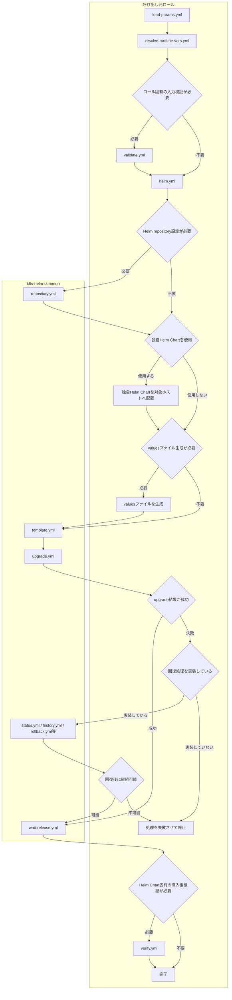

`template.yml`はKubernetes資源を変更せずHelm Chartを事前描画します。`upgrade.yml`は変更操作であり, Helm操作失敗時も実行結果を呼び出し元へ返すため, 呼び出し元ロールは成功結果を確認するか, 明示的な回復処理へ接続する必要があります。

### 呼び出し元ロールとの責務分界

呼び出し元ロールと本ロールの責務分界を次に示します。

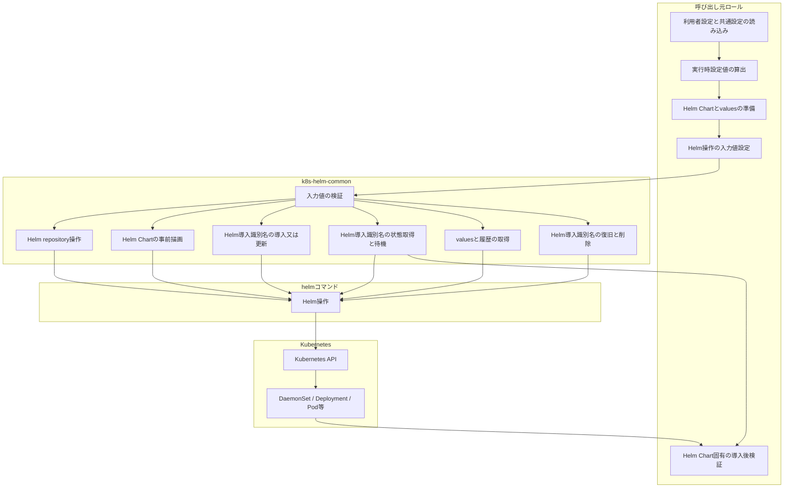

呼び出し元ロールは, Helm Chart固有の設定値算出, valuesファイル生成, 独自Helm Chart配置, 導入後のKubernetes資源検証を担当します。本ロールは, Helm操作に共通する入力検証とhelmコマンド実行を担当します。

`wait-release.yml`と呼び出し元ロールの`verify.yml`の責務は異なります。

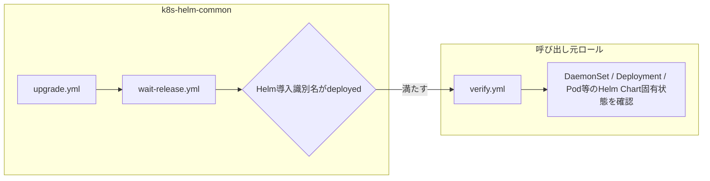

`wait-release.yml`はHelm導入識別名自身が`deployed`状態であることを確認します。DaemonSet, Deployment, Pod等のHelm Chart固有の完了条件は呼び出し元ロールの`verify.yml`で確認します。

## k8s-helm-commonの公開インターフェース

### 公開インターフェース一覧

本ロールが外部へ提供する公開インターフェースを次に示します。`validate.yml`, `build-values-argv.yml`, `repository-user.yml`は公開インターフェースから呼び出す内部処理であり, 呼び出し元ロールから直接使用する対象には含めません。

| 分類 | 公開インターフェース | 提供機能 |
| --- | --- | --- |
| Helm repository操作 | `repository.yml` | 指定したOSユーザごとに対象Helm repositoryを指定された名前とURLへ設定します。 |
| Helm repository操作 | `clear-repositories.yml` | 指定したOSユーザに登録されているHelm repositoryをすべて削除します。 |
| Helm Chart事前確認 | `template.yml` | Helm ChartとvaluesをKubernetesへ適用せずに事前描画します。 |
| Helm導入識別名の導入・更新 | `upgrade.yml` | `helm upgrade --install`を実行します。 |
| Helm導入識別名の状態確認 | `status.yml` | Helm導入識別名の存在, 状態, Helm revisionを取得します。 |
| Helm導入識別名の状態確認 | `wait-release.yml` | Helm導入識別名が`deployed`状態になるまで待機します。 |
| 設定・履歴取得 | `get-values.yml` | 既存Helm導入識別名のvaluesをYAML形式で取得します。 |
| 設定・履歴取得 | `history.yml` | Helm revision履歴を取得します。 |
| 復旧 | `rollback.yml` | 明示指定したHelm revisionへ戻します。 |
| 削除 | `uninstall.yml` | Helm導入識別名を削除します。 |

### `repository.yml`

#### `repository.yml`インターフェースの提供機能

指定したHelm repositoryを`k8s_helm_repository_users`に指定したOSユーザごとに設定します。対象Helm repositoryが存在しない場合は追加し, 同名Helm repositoryのURLが異なる場合は更新し, 最後に対象Helm repositoryの情報を更新します。

#### `repository.yml`インターフェースの入力変数一覧

| 変数名 | 意味 | 必須 | 設定主体 |
| --- | --- | --- | --- |
| `k8s_helm_repository_name` | 設定するHelm repository名です。 | 必須 | 呼び出し元ロール |
| `k8s_helm_repository_url` | 設定するHelm repositoryのURLです。 | 必須 | 呼び出し元ロール |
| `k8s_helm_repository_users` | Helm repositoryを設定するOSユーザ一覧です。 | 必須 | 呼び出し元ロール |
| `k8s_helm_operation_timeout_seconds` | 1回の外部コマンドの時間上限です。 | 必須 | 呼び出し元ロールが主要変数から設定 |
| `k8s_helm_operation_retries` | 再実行可能処理の最大試行回数です。 | 必須 | 呼び出し元ロールが主要変数から設定 |
| `k8s_helm_operation_retry_interval_seconds` | 変更操作失敗後の再試行間隔です。 | 必須 | 呼び出し元ロールが主要変数から設定 |
| `k8s_helm_operation_request_interval_seconds` | 状態取得等の要求間隔です。 | 必須 | 呼び出し元ロールが主要変数から設定 |

#### `repository.yml`インターフェースの出力/返却変数一覧

呼び出し元ロールで利用する公開出力変数はありません。内部処理で生成するHelm repository状態は公開仕様としません。

#### `repository.yml`インターフェースの具体的な使用例

```yaml
1: - name: Configure example Helm repository
2:   ansible.builtin.include_role:
3:     name: k8s-helm-common
4:     tasks_from: repository.yml
5:   vars:
6:     k8s_helm_repository_name: "{{ example_runtime_helm_repo_name }}"
7:     k8s_helm_repository_url: "{{ example_runtime_helm_repo_url }}"
8:     k8s_helm_repository_users: "{{ k8s_runtime_helm_execution_users }}"
9:     k8s_helm_operation_timeout_seconds: "{{ example_runtime_helm_timeout_seconds }}"
10:     k8s_helm_operation_retries: "{{ example_runtime_helm_retries }}"
11:     k8s_helm_operation_retry_interval_seconds: "{{ example_runtime_helm_retry_interval_seconds }}"
12:     k8s_helm_operation_request_interval_seconds: "{{ example_runtime_helm_request_interval_seconds }}"
```

| 行番号 | 設定値 | 有効になる動作 | 設定背景(未設定時/誤設定時の問題と防止理由) |
| --- | --- | --- | --- |
| 2-4 | `include_role`と`tasks_from: repository.yml` | Helm repository共通処理を呼び出します。 | 呼び出し元ロールへHelm repository操作を重複実装しないためです。 |
| 6-8 | Helm repository名, URL, OSユーザ一覧 | 対象OSユーザごとに同一のHelm repositoryを設定します。 | repository名, URL又はユーザを誤ると別のHelm設定を変更するためです。 |
| 9-12 | 時間制御値 | 外部コマンドに時間上限と再試行条件を適用します。 | 外部通信停止によるPlaybook停止と過剰な再試行を防止するためです。 |

##### `repository.yml`の既存ロールでの具体例

`elastic-agent-k8s`ロールでは, Elastic Agent Helm Chartを取得する`elastic` repositoryをHelm実行ユーザ一覧へ設定します。呼び出し元ロールで解決済みのrepository名, URL, Helm実行ユーザ, 時間制御値を`k8s-helm-common`へ渡し, repositoryの存在確認, URL整合, index更新を共通処理へ委譲しています。

```yaml
1: - name: Reconcile Helm repository for elastic-agent-k8s
2:   vars:
3:     k8s_helm_repository_name: "{{ elastic_agent_k8s_runtime_helm_repo_name }}"
4:     k8s_helm_repository_url: "{{ elastic_agent_k8s_runtime_helm_repo_url }}"
5:     k8s_helm_repository_users: "{{ k8s_runtime_helm_execution_users }}"
6:     k8s_helm_operation_timeout_seconds: >-
7:       {{ elastic_agent_k8s_runtime_helm_timeout_seconds }}
8:     k8s_helm_operation_retries: >-
9:       {{ elastic_agent_k8s_runtime_helm_retries }}
10:     k8s_helm_operation_retry_interval_seconds: >-
11:       {{ elastic_agent_k8s_runtime_helm_retry_interval_seconds }}
12:     k8s_helm_operation_request_interval_seconds: >-
13:       {{ elastic_agent_k8s_runtime_helm_request_interval_seconds }}
14:   block:
15:     - name: Reconcile Helm repository with common role
16:       ansible.builtin.include_role:
17:         name: k8s-helm-common
18:         tasks_from: repository.yml
```

| 行番号 | 設定値 | 有効になる動作 | 設定背景(未設定時/誤設定時の問題と防止理由) |
| --- | --- | --- | --- |
| 1-5 | Elastic Agent用repository情報 | 実行時に確定したrepository名, URL, Helm実行ユーザを共通処理へ渡します。 | 製品固有値を`k8s-helm-common`内部へ持ち込まないためです。 |
| 6-13 | Helm時間制御値 | Elastic Agentロールの調整値をrepository操作へ適用します。 | 外部通信停止や過剰再試行を呼び出し元ロールの設定で制御するためです。 |
| 14-18 | `tasks_from: repository.yml` | repository操作だけを`k8s-helm-common`へ委譲します。 | 呼び出し元ロールへrepository操作を重複実装しないためです。 |

### `clear-repositories.yml`

#### `clear-repositories.yml`インターフェースの提供機能

`k8s_helm_repository_users`に指定した各OSユーザに登録されているHelm repositoryをすべて削除し, 削除後にHelm repositoryが残っていないことを確認します。本インターフェースは`k8s-ctrlplane`ロールでHelm実行環境を初期化する用途を想定した破壊的操作です。

#### `clear-repositories.yml`の入力変数一覧

| 変数名 | 意味 | 必須 | 設定主体 |
| --- | --- | --- | --- |
| `k8s_helm_repository_users` | 全Helm repositoryを削除するOSユーザ一覧です。 | 必須 | 呼び出し元ロール |
| `k8s_helm_operation_timeout_seconds` | 1回の外部コマンドの時間上限です。 | 必須 | 呼び出し元ロールが主要変数から設定 |
| `k8s_helm_operation_retries` | 状態取得等の最大試行回数です。 | 必須 | 呼び出し元ロールが主要変数から設定 |
| `k8s_helm_operation_retry_interval_seconds` | 変更操作に適用する再試行間隔です。 | 必須 | 呼び出し元ロールが主要変数から設定 |
| `k8s_helm_operation_request_interval_seconds` | 状態取得の要求間隔です。 | 必須 | 呼び出し元ロールが主要変数から設定 |

#### `clear-repositories.yml`の出力/返却変数一覧

呼び出し元ロールで利用する公開出力変数はありません。

#### `clear-repositories.yml`の具体的な使用例

```yaml
1: - name: Clear Helm repositories
2:   ansible.builtin.include_role:
3:     name: k8s-helm-common
4:     tasks_from: clear-repositories.yml
5:   vars:
6:     k8s_helm_repository_users: "{{ k8s_runtime_helm_execution_users }}"
7:     k8s_helm_operation_timeout_seconds: "{{ k8s_helm_timeout_seconds }}"
8:     k8s_helm_operation_retries: "{{ k8s_helm_retries }}"
9:     k8s_helm_operation_retry_interval_seconds: "{{ k8s_helm_retry_interval_seconds }}"
10:     k8s_helm_operation_request_interval_seconds: "{{ k8s_helm_request_interval_seconds }}"
```

| 行番号 | 設定値 | 有効になる動作 | 設定背景(未設定時/誤設定時の問題と防止理由) |
| --- | --- | --- | --- |
| 2-4 | `tasks_from: clear-repositories.yml` | 指定OSユーザの全Helm repositoryを削除します。 | 通常のHelm Chart導入で使用する個別repository設定と誤認しないためです。 |
| 6 | OSユーザ一覧 | 削除対象のHelm設定を所有するOSユーザを指定します。 | 誤ったOSユーザを指定すると意図しないHelm repositoryを削除するためです。 |
| 7-10 | 時間制御値 | 状態取得の停止を防止します。 | 外部コマンド停止時にPlaybook全体が無期限に停止することを防止するためです。 |

##### `clear-repositories.yml`の既存ロールでの具体例

`k8s-ctrlplane`ロールでは, Control Plane再構築時に既存Helm repository設定を引き継がない互換動作を利用者が明示した場合だけ, Helm実行ユーザに登録された全repositoryを削除します。通常のChart導入処理では使用せず, `k8s_ctrlplane_helm_clear_repositories_enabled`が`true`の場合だけ実行します。

```yaml
1: - name: Clear Helm repositories via k8s-helm-common
2:   vars:
3:     k8s_helm_repository_users: "{{ k8s_runtime_helm_execution_users }}"
4:     k8s_helm_operation_timeout_seconds: "{{ k8s_helm_timeout_seconds }}"
5:     k8s_helm_operation_retries: "{{ k8s_helm_retries }}"
6:     k8s_helm_operation_retry_interval_seconds: "{{ k8s_helm_retry_interval_seconds }}"
7:     k8s_helm_operation_request_interval_seconds: "{{ k8s_helm_request_interval_seconds }}"
8:   when: k8s_ctrlplane_helm_clear_repositories_enabled
9:   block:
10:     - name: Clear Helm repositories with common role
11:       ansible.builtin.include_role:
12:         name: k8s-helm-common
13:         tasks_from: clear-repositories.yml
```

| 行番号 | 設定値 | 有効になる動作 | 設定背景(未設定時/誤設定時の問題と防止理由) |
| --- | --- | --- | --- |
| 3 | Helm実行ユーザ一覧 | 指定ユーザが所有するHelm repository設定を削除対象にします。 | 別ユーザのHelm設定を誤って対象にしないためです。 |
| 4-7 | 共通Helm時間制御値 | repository状態取得と削除確認へ共通時間制御を適用します。 | 外部コマンド停止時の無期限待機を防止するためです。 |
| 8 | `k8s_ctrlplane_helm_clear_repositories_enabled` | 明示的に有効化された場合だけ破壊的操作を行います。 | 通常導入時に既存repositoryを誤削除しないためです。 |
| 10-13 | `clear-repositories.yml` | 全repository削除処理を共通ロールへ委譲します。 | 破壊的な互換処理を呼び出し元へ重複実装しないためです。 |

### `template.yml`

#### `template.yml`インターフェースの提供機能

`helm template`を実行し, Helm Chartとvaluesファイルの組み合わせをKubernetesへ適用せずに事前描画します。Ansible check modeでも描画処理を実行します。

#### `template.yml`インターフェースの入力変数一覧

| 変数名 | 意味 | 必須 | 設定主体 |
| --- | --- | --- | --- |
| `k8s_helm_release_name` | 描画時に使用するHelm導入識別名です。 | 必須 | 呼び出し元ロール |
| `k8s_helm_namespace` | 対象の名前空間です。 | 必須 | 呼び出し元ロール |
| `k8s_helm_chart_ref` | repository, OCI又は対象ホスト上のローカルHelm Chart参照先です。 | 必須 | 呼び出し元ロール |
| `k8s_helm_chart_version` | Helm Chart版数です。空文字列の場合は版数指定を省略します。 | 任意 | 呼び出し元ロール |
| `k8s_helm_kubeconfig_path` | HelmがKubernetes API接続に使用する`kubeconfig`の絶対パスです。 | 必須 | 呼び出し元ロール |
| `k8s_helm_values_files` | valuesファイル一覧です。指定順を保持してHelmへ渡します。 | 任意 | 呼び出し元ロール |
| `k8s_helm_operation_timeout_seconds` | 1回の外部コマンドの時間上限です。 | 必須 | 呼び出し元ロールが主要変数から設定 |
| `k8s_helm_operation_retries` | 状態取得等の最大試行回数です。 | 必須 | 呼び出し元ロールが主要変数から設定 |
| `k8s_helm_operation_retry_interval_seconds` | 変更操作用の再試行間隔です。 | 必須 | 呼び出し元ロールが主要変数から設定 |
| `k8s_helm_operation_request_interval_seconds` | 読み取り処理の要求間隔です。 | 必須 | 呼び出し元ロールが主要変数から設定 |

#### `template.yml`インターフェースの出力/返却変数一覧

| 変数名 | 内容 | 利用目的 |
| --- | --- | --- |
| `k8s_helm_template_result` | `helm template`の実行結果です。`stdout`に描画したKubernetes定義を格納します。 | Helm Chart固有の事前検証又は障害切り分けに使用します。 |

#### `template.yml`インターフェースの具体的な使用例

```yaml
1: - name: Render example Helm template
2:   ansible.builtin.include_role:
3:     name: k8s-helm-common
4:     tasks_from: template.yml
5:   vars:
6:     k8s_helm_release_name: "{{ example_runtime_release_name }}"
7:     k8s_helm_namespace: "{{ example_runtime_namespace }}"
8:     k8s_helm_chart_ref: "{{ example_runtime_chart_ref }}"
9:     k8s_helm_chart_version: "{{ example_runtime_chart_version }}"
10:     k8s_helm_kubeconfig_path: "{{ example_runtime_kubeconfig_path }}"
11:     k8s_helm_values_files:
12:       - "{{ example_runtime_values_file }}"
13:     k8s_helm_operation_timeout_seconds: "{{ example_runtime_helm_timeout_seconds }}"
14:     k8s_helm_operation_retries: "{{ example_runtime_helm_retries }}"
15:     k8s_helm_operation_retry_interval_seconds: "{{ example_runtime_helm_retry_interval_seconds }}"
16:     k8s_helm_operation_request_interval_seconds: "{{ example_runtime_helm_request_interval_seconds }}"
```

| 行番号 | 設定値 | 有効になる動作 | 設定背景(未設定時/誤設定時の問題と防止理由) |
| --- | --- | --- | --- |
| 6-10 | Helm導入識別名, 名前空間, Helm Chart, 版数, `kubeconfig` | 対象Helm Chartを指定したKubernetes接続情報で描画します。 | 実際の導入対象と異なる条件で事前確認することを防止するためです。 |
| 11-12 | valuesファイル一覧 | 指定順にvaluesをHelmへ渡します。 | valuesの順序が上書き結果へ影響するためです。 |
| 13-16 | 時間制御値 | Helm描画処理へ時間上限を設定します。 | Helm処理停止によるPlaybook停止を防止するためです。 |

##### `template.yml`の既存ロールでの具体例

`netshoot-no-portscan`ロールでは, リポジトリ内で管理する独自Helm Chartを対象ホストへ配置した後, 実導入と同じChart, namespace, `kubeconfig`, valuesを使用して`template.yml`を呼び出します。ローカルChartのため`k8s_helm_chart_version`は空文字列とし, `Chart.yaml`側の版数を使用します。

```yaml
1: - name: Render netshoot Helm template
2:   vars:
3:     k8s_helm_release_name: "{{ netshoot_runtime_release_name }}"
4:     k8s_helm_namespace: "{{ netshoot_runtime_namespace }}"
5:     k8s_helm_chart_ref: "{{ netshoot_runtime_chart_dir }}"
6:     k8s_helm_chart_version: ""
7:     k8s_helm_kubeconfig_path: "{{ netshoot_runtime_kubeconfig_path }}"
8:     k8s_helm_values_files:
9:       - "{{ netshoot_runtime_values_file_path }}"
10:     k8s_helm_operation_timeout_seconds: "{{ netshoot_runtime_helm_timeout_seconds }}"
11:     k8s_helm_operation_retries: "{{ netshoot_runtime_helm_retries }}"
12:     k8s_helm_operation_retry_interval_seconds: "{{ netshoot_runtime_helm_retry_interval_seconds }}"
13:     k8s_helm_operation_request_interval_seconds: "{{ netshoot_runtime_helm_request_interval_seconds }}"
14:   block:
15:     - name: Render netshoot Helm template with common role
16:       ansible.builtin.include_role:
17:         name: k8s-helm-common
18:         tasks_from: template.yml
```

| 行番号 | 設定値 | 有効になる動作 | 設定背景(未設定時/誤設定時の問題と防止理由) |
| --- | --- | --- | --- |
| 3-5 | release, namespace, local Chart path | 実導入対象と同じChartを事前描画します。 | 事前確認と実導入で対象がずれることを防止するためです。 |
| 6 | 空のChart版数 | `--version`を付けずローカルChartを描画します。 | repository Chart向け版数指定をローカルChartへ誤適用しないためです。 |
| 7-9 | kubeconfigとvalues | 実導入時と同じ接続先とvaluesを使用します。 | template成功後に異なる入力でupgradeすることを防止するためです。 |
| 10-13 | 時間制御値 | Helm描画処理へロール固有の制限値を渡します。 | 描画処理停止によるPlaybook停止を防止するためです。 |
| 15-18 | `template.yml` | Helm Chart事前描画を共通ロールへ委譲します。 | 呼び出し元へ`helm template`実装を重複させないためです。 |

### `upgrade.yml`

#### `upgrade.yml`インターフェースの提供機能

`helm upgrade --install`を実行してHelm導入識別名を導入又は更新します。本処理はHelm revisionを変更するためAnsible check modeでは実行しません。Helm操作失敗時も結果を呼び出し元へ返すため, 呼び出し元ロールは`k8s_helm_upgrade_result.rc`を確認するか回復処理を実装します。

#### `upgrade.yml`インターフェースの入力変数一覧

| 変数名 | 意味 | 必須 | 設定主体 |
| --- | --- | --- | --- |
| `k8s_helm_release_name` | 導入又は更新するHelm導入識別名です。 | 必須 | 呼び出し元ロール |
| `k8s_helm_namespace` | 対象の名前空間です。 | 必須 | 呼び出し元ロール |
| `k8s_helm_chart_ref` | 使用するHelm Chart参照先です。 | 必須 | 呼び出し元ロール |
| `k8s_helm_chart_version` | Helm Chart版数です。 | 任意 | 呼び出し元ロール |
| `k8s_helm_kubeconfig_path` | Helmが使用する`kubeconfig`の絶対パスです。 | 必須 | 呼び出し元ロール |
| `k8s_helm_values_files` | valuesファイル一覧です。 | 任意 | 呼び出し元ロール |
| `k8s_helm_create_namespace` | 対象名前空間が存在しない場合に作成する場合は`true`を指定します。 | 必須 | 呼び出し元ロール |
| `k8s_helm_wait` | Helm側の待機を有効にする場合は`true`を指定します。 | 任意(既定値`true`) | 利用者設定又は呼び出し元ロール |
| `k8s_helm_operation_timeout_seconds` | 1回の外部コマンドの時間上限です。 | 必須 | 呼び出し元ロールが主要変数から設定 |
| `k8s_helm_operation_retries` | 共通の試行回数です。`upgrade.yml`自体は変更操作を自動再試行しません。 | 必須 | 呼び出し元ロールが主要変数から設定 |
| `k8s_helm_operation_retry_interval_seconds` | 共通の変更操作再試行間隔です。 | 必須 | 呼び出し元ロールが主要変数から設定 |
| `k8s_helm_operation_request_interval_seconds` | 共通の状態取得要求間隔です。 | 必須 | 呼び出し元ロールが主要変数から設定 |

#### `upgrade.yml`インターフェースの出力/返却変数一覧

| 変数名 | 内容 | 利用目的 |
| --- | --- | --- |
| `k8s_helm_upgrade_result` | `helm upgrade --install`の実行結果です。 | `rc`を確認して成功判定又は回復処理へ接続します。 |

#### `upgrade.yml`インターフェースの具体的な使用例

```yaml
1: - name: Install or upgrade example Helm release
2:   ansible.builtin.include_role:
3:     name: k8s-helm-common
4:     tasks_from: upgrade.yml
5:   vars:
6:     k8s_helm_release_name: "{{ example_runtime_release_name }}"
7:     k8s_helm_namespace: "{{ example_runtime_namespace }}"
8:     k8s_helm_chart_ref: "{{ example_runtime_chart_ref }}"
9:     k8s_helm_chart_version: "{{ example_runtime_chart_version }}"
10:     k8s_helm_kubeconfig_path: "{{ example_runtime_kubeconfig_path }}"
11:     k8s_helm_values_files: ["{{ example_runtime_values_file }}"]
12:     k8s_helm_create_namespace: false
13:     k8s_helm_wait: true
14:     k8s_helm_operation_timeout_seconds: "{{ example_runtime_helm_timeout_seconds }}"
15:     k8s_helm_operation_retries: "{{ example_runtime_helm_retries }}"
16:     k8s_helm_operation_retry_interval_seconds: "{{ example_runtime_helm_retry_interval_seconds }}"
17:     k8s_helm_operation_request_interval_seconds: "{{ example_runtime_helm_request_interval_seconds }}"
18:
19: - name: Validate example Helm upgrade result
20:   ansible.builtin.assert:
21:     that:
22:       - k8s_helm_upgrade_result.rc | default(1) | int == 0
23:   when: not ansible_check_mode
```

| 行番号 | 設定値 | 有効になる動作 | 設定背景(未設定時/誤設定時の問題と防止理由) |
| --- | --- | --- | --- |
| 2-17 | `upgrade.yml`への入力 | 指定したHelm導入識別名を導入又は更新します。 | 対象Helm ChartとKubernetes接続情報を明示して誤操作を防止するためです。 |
| 12-13 | 名前空間作成指定とHelm待機指定 | Helm導入時の付随動作を制御します。 | 対象Helm Chartの導入仕様に応じた動作を明示するためです。 |
| 19-23 | `k8s_helm_upgrade_result.rc` | 自動回復処理を持たない場合に失敗を明示します。 | `upgrade.yml`は失敗結果を呼び出し元へ返すため, 判定を省略すると後続処理が誤って継続するためです。 |

##### `upgrade.yml`の既存ロールでの具体例

`netshoot-no-portscan`ロールでは, `template.yml`で確認済みのChart, namespace, `kubeconfig`, valuesと同じ入力を`upgrade.yml`へ渡します。`upgrade.yml`は失敗結果を呼び出し元へ返すため, 直後の`assert`で`k8s_helm_upgrade_result.rc`を確認しています。

```yaml
1: - name: Install or upgrade netshoot
2:   vars:
3:     k8s_helm_release_name: "{{ netshoot_runtime_release_name }}"
4:     k8s_helm_namespace: "{{ netshoot_runtime_namespace }}"
5:     k8s_helm_chart_ref: "{{ netshoot_runtime_chart_dir }}"
6:     k8s_helm_chart_version: ""
7:     k8s_helm_kubeconfig_path: "{{ netshoot_runtime_kubeconfig_path }}"
8:     k8s_helm_values_files:
9:       - "{{ netshoot_runtime_values_file_path }}"
10:     k8s_helm_create_namespace: true
11:     k8s_helm_wait: true
12:     k8s_helm_operation_timeout_seconds: "{{ netshoot_runtime_helm_timeout_seconds }}"
13:     k8s_helm_operation_retries: "{{ netshoot_runtime_helm_retries }}"
14:     k8s_helm_operation_retry_interval_seconds: "{{ netshoot_runtime_helm_retry_interval_seconds }}"
15:     k8s_helm_operation_request_interval_seconds: "{{ netshoot_runtime_helm_request_interval_seconds }}"
16:   block:
17:     - name: Install or upgrade netshoot with common Helm role
18:       ansible.builtin.include_role:
19:         name: k8s-helm-common
20:         tasks_from: upgrade.yml
21:
22: - name: Validate netshoot Helm upgrade result
23:   ansible.builtin.assert:
24:     that:
25:       - k8s_helm_upgrade_result.rc | default(1) | int == 0
26:   when: not ansible_check_mode
```

| 行番号 | 設定値 | 有効になる動作 | 設定背景(未設定時/誤設定時の問題と防止理由) |
| --- | --- | --- | --- |
| 3-9 | template済みHelm入力 | 事前描画と同じChart条件で導入又は更新します。 | templateとupgradeの入力差異による未検証変更を防止するためです。 |
| 10-11 | namespace作成とHelm待機 | netshoot導入に必要なHelm動作を有効化します。 | Chart固有の導入条件を呼び出し元で明示するためです。 |
| 12-15 | 時間制御値 | upgrade実行条件を呼び出し元から指定します。 | Chartごとの実行時間特性を共通ロールへ埋め込まないためです。 |
| 17-20 | `upgrade.yml` | `helm upgrade --install`を共通ロールへ委譲します。 | Helm変更操作を共通化するためです。 |
| 22-26 | `k8s_helm_upgrade_result.rc` | 自動回復処理を持たないため非0終了時に停止します。 | `upgrade.yml`が`failed_when: false`で結果を返す仕様に対応するためです。 |

### `status.yml`

#### `status.yml`インターフェースの提供機能

Helm導入識別名の存在状態を確認し, 存在する場合は`helm status`から状態とHelm revisionを取得します。Helm導入識別名が存在しない場合は, 本ロール独自の共通状態として`absent`とHelm revision `0`を返します。

#### `status.yml`インターフェースの入力変数一覧

| 変数名 | 意味 | 必須 | 設定主体 |
| --- | --- | --- | --- |
| `k8s_helm_release_name` | 状態を取得するHelm導入識別名です。 | 必須 | 呼び出し元ロール |
| `k8s_helm_namespace` | 対象の名前空間です。 | 必須 | 呼び出し元ロール |
| `k8s_helm_kubeconfig_path` | Helmが使用する`kubeconfig`です。 | 必須 | 呼び出し元ロール |
| `k8s_helm_operation_timeout_seconds` | 1回の外部コマンドの時間上限です。 | 必須 | 呼び出し元ロールが主要変数から設定 |
| `k8s_helm_operation_retries` | 状態取得の最大試行回数です。 | 必須 | 呼び出し元ロールが主要変数から設定 |
| `k8s_helm_operation_retry_interval_seconds` | 共通の変更操作再試行間隔です。 | 必須 | 呼び出し元ロールが主要変数から設定 |
| `k8s_helm_operation_request_interval_seconds` | 状態取得の要求間隔です。 | 必須 | 呼び出し元ロールが主要変数から設定 |

#### `status.yml`インターフェースの出力/返却変数一覧

| 変数名 | 内容 | 利用目的 |
| --- | --- | --- |
| `k8s_helm_release_exists` | Helm導入識別名が存在する場合は`true`, 不存在の場合は`false`です。 | 存在有無に応じた後続処理の分岐に使用します。 |
| `k8s_helm_release_state` | Helmの状態です。不在時は`absent`です。 | `deployed`, `failed`, `pending-upgrade`等の状態判定に使用します。 |
| `k8s_helm_release_revision` | 現在のHelm revisionです。不在時は`0`です。 | 履歴確認や回復処理の判断に使用します。 |
| `k8s_helm_status_result` | `helm status`の実行結果です。不在時は空の辞書です。 | 詳細な障害切り分けが必要な場合に使用します。 |

#### `status.yml`インターフェースの具体的な使用例

```yaml
1: - name: Get example Helm release status
2:   ansible.builtin.include_role:
3:     name: k8s-helm-common
4:     tasks_from: status.yml
5:   vars:
6:     k8s_helm_release_name: "{{ example_runtime_release_name }}"
7:     k8s_helm_namespace: "{{ example_runtime_namespace }}"
8:     k8s_helm_kubeconfig_path: "{{ example_runtime_kubeconfig_path }}"
9:     k8s_helm_operation_timeout_seconds: "{{ example_runtime_helm_timeout_seconds }}"
10:     k8s_helm_operation_retries: "{{ example_runtime_helm_retries }}"
11:     k8s_helm_operation_retry_interval_seconds: "{{ example_runtime_helm_retry_interval_seconds }}"
12:     k8s_helm_operation_request_interval_seconds: "{{ example_runtime_helm_request_interval_seconds }}"
```

| 行番号 | 設定値 | 有効になる動作 | 設定背景(未設定時/誤設定時の問題と防止理由) |
| --- | --- | --- | --- |
| 2-8 | 状態取得対象 | 指定したHelm導入識別名だけを取得します。 | 別のHelm導入識別名の状態を後続処理へ渡すことを防止するためです。 |
| 9-12 | 時間制御値 | 一時的なAPI通信失敗を再試行します。 | 一時障害を即時の恒久障害として扱わないためです。 |

##### `status.yml`の既存ロールでの具体例

`k8s-whereabouts`ロールでは, 導入後検証の先頭でWhereabouts Helm導入識別名の存在と状態を取得するため`status.yml`を使用しています。取得結果の`k8s_helm_release_exists`と`k8s_helm_release_state`を後続`assert`で確認します。

```yaml
1: - name: Get Whereabouts Helm release status
2:   ansible.builtin.include_role:
3:     name: k8s-helm-common
4:     tasks_from: status.yml
5:   vars:
6:     k8s_helm_release_name: "{{ k8s_whereabouts_runtime_release_name }}"
7:     k8s_helm_namespace: "{{ k8s_whereabouts_runtime_namespace }}"
8:     k8s_helm_kubeconfig_path: "{{ k8s_whereabouts_runtime_kubeconfig_path }}"
9:     k8s_helm_operation_timeout_seconds: "{{ k8s_whereabouts_runtime_helm_timeout_seconds }}"
10:     k8s_helm_operation_retries: "{{ k8s_whereabouts_runtime_helm_retries }}"
11:     k8s_helm_operation_retry_interval_seconds: "{{ k8s_whereabouts_runtime_helm_retry_interval_seconds }}"
12:     k8s_helm_operation_request_interval_seconds: "{{ k8s_whereabouts_runtime_helm_request_interval_seconds }}"
13:   when: not (ansible_check_mode | bool)
14:
15: - name: Assert Whereabouts Helm release is deployed
16:   ansible.builtin.assert:
17:     that:
18:       - k8s_helm_release_exists | default(false) | bool
19:       - (k8s_helm_release_state | default('', true) | string | lower) == 'deployed'
20:   when: not (ansible_check_mode | bool)
```

| 行番号 | 設定値 | 有効になる動作 | 設定背景(未設定時/誤設定時の問題と防止理由) |
| --- | --- | --- | --- |
| 1-4 | `status.yml` | Whereabouts Helm導入識別名の存在, 状態, revisionを取得します。 | `helm status`相当の処理を呼び出し元へ重複実装しないためです。 |
| 6-12 | Whereabouts runtime入力 | 実導入時と同じrelease, namespace, kubeconfig, 時間制御値を使用します。 | 別release又は別クラスタを検証しないためです。 |
| 15-19 | 公開出力の確認 | releaseが存在し`deployed`であることを確認します。 | `status.yml`の取得結果をChart固有の検証前提へ利用する具体例です。 |
| 13,20 | check mode判定 | 通常実行時だけ実クラスタ状態を確認します。 | check modeで未適用の状態を失敗扱いしないためです。 |

この例は現行`k8s-whereabouts`ロールの実装を示すものです。新規ロールでは本Readme.mdで定める`upgrade.yml` -> `wait-release.yml` -> `verify.yml`の責務分界を優先し, `wait-release.yml`成功後の`verify.yml`でHelm導入識別名の`deployed`状態を重複確認しません。`status.yml`は, 導入前の存在判定, 既存releaseの状態分岐, 回復処理等, 呼び出し元ロール自身がHelm release状態を必要とする場合に使用します。

### `get-values.yml`

#### `get-values.yml`インターフェースの提供機能

`helm get values`を使用して既存Helm導入識別名のvaluesをYAML形式で取得します。`k8s_helm_get_values_all=true`の場合はHelm Chart既定値を含むvaluesを取得します。

#### `get-values.yml`インターフェースの入力変数一覧

| 変数名 | 意味 | 必須 | 設定主体 |
| --- | --- | --- | --- |
| `k8s_helm_release_name` | valuesを取得するHelm導入識別名です。 | 必須 | 呼び出し元ロール |
| `k8s_helm_namespace` | 対象の名前空間です。 | 必須 | 呼び出し元ロール |
| `k8s_helm_kubeconfig_path` | Helmが使用する`kubeconfig`です。 | 必須 | 呼び出し元ロール |
| `k8s_helm_get_values_all` | Helm Chart既定値を含める場合は`true`です。 | 任意(既定値`false`) | 利用者設定又は呼び出し元ロール |
| `k8s_helm_operation_timeout_seconds` | 1回の外部コマンドの時間上限です。 | 必須 | 呼び出し元ロールが主要変数から設定 |
| `k8s_helm_operation_retries` | 最大試行回数です。 | 必須 | 呼び出し元ロールが主要変数から設定 |
| `k8s_helm_operation_retry_interval_seconds` | 共通の変更操作再試行間隔です。 | 必須 | 呼び出し元ロールが主要変数から設定 |
| `k8s_helm_operation_request_interval_seconds` | 状態取得の要求間隔です。 | 必須 | 呼び出し元ロールが主要変数から設定 |

#### `get-values.yml`インターフェースの出力/返却変数一覧

| 変数名 | 内容 | 利用目的 |
| --- | --- | --- |
| `k8s_helm_release_values_yaml` | 取得したvaluesのYAML文字列です。 | 既存設定を保持した更新処理等で使用します。 |

#### `get-values.yml`インターフェースの具体的な使用例

```yaml
1: - name: Get example Helm release values
2:   ansible.builtin.include_role:
3:     name: k8s-helm-common
4:     tasks_from: get-values.yml
5:   vars:
6:     k8s_helm_release_name: "{{ example_runtime_release_name }}"
7:     k8s_helm_namespace: "{{ example_runtime_namespace }}"
8:     k8s_helm_kubeconfig_path: "{{ example_runtime_kubeconfig_path }}"
9:     k8s_helm_get_values_all: false
10:     k8s_helm_operation_timeout_seconds: "{{ example_runtime_helm_timeout_seconds }}"
11:     k8s_helm_operation_retries: "{{ example_runtime_helm_retries }}"
12:     k8s_helm_operation_retry_interval_seconds: "{{ example_runtime_helm_retry_interval_seconds }}"
13:     k8s_helm_operation_request_interval_seconds: "{{ example_runtime_helm_request_interval_seconds }}"
```

| 行番号 | 設定値 | 有効になる動作 | 設定背景(未設定時/誤設定時の問題と防止理由) |
| --- | --- | --- | --- |
| 6-8 | 既存Helm導入識別名と接続先 | 対象Helm導入識別名のvaluesを取得します。 | 別のHelm導入識別名の設定を更新材料として使用することを防止するためです。 |
| 9 | `k8s_helm_get_values_all: false` | 利用者が設定したvaluesだけを取得します。 | 既存設定の保持方法に合わせて取得範囲を明示するためです。 |
| 10-13 | 時間制御値 | 読み取り処理に時間上限と再試行を適用します。 | 一時的なAPI通信失敗へ対応するためです。 |

##### `get-values.yml`の既存ロールでの具体例

`k8s-hubble-ui`ロールでは, 既存Cilium Helm導入識別名へHubble UI設定を追加する際に, 利用者が設定済みの既存valuesを保持するため`get-values.yml`を使用します。`k8s_helm_get_values_all: false`として利用者設定valuesだけを取得し, 後続処理でHubble UI用valuesとマージします。

```yaml
1: - name: Get existing Cilium Helm values via k8s-helm-common
2:   vars:
3:     k8s_helm_release_name: "{{ k8s_hubble_ui_runtime_release_name }}"
4:     k8s_helm_namespace: "{{ k8s_hubble_ui_runtime_namespace }}"
5:     k8s_helm_kubeconfig_path: "{{ k8s_hubble_ui_runtime_kubeconfig_path }}"
6:     k8s_helm_get_values_all: false
7:     k8s_helm_operation_timeout_seconds: "{{ k8s_hubble_ui_runtime_helm_timeout_seconds }}"
8:     k8s_helm_operation_retries: "{{ k8s_hubble_ui_runtime_helm_retries }}"
9:     k8s_helm_operation_retry_interval_seconds: "{{ k8s_hubble_ui_runtime_helm_retry_interval_seconds }}"
10:     k8s_helm_operation_request_interval_seconds: "{{ k8s_hubble_ui_runtime_helm_request_interval_seconds }}"
11:   when: hubble_ui_merge_existing_values | default(false)
12:   block:
13:     - name: Get Cilium Helm values with common role
14:       ansible.builtin.include_role:
15:         name: k8s-helm-common
16:         tasks_from: get-values.yml
17:
18: - name: Save existing values to file
19:   ansible.builtin.copy:
20:     content: "{{ k8s_helm_release_values_yaml }}"
21:     dest: "{{ k8s_hubble_ui_config_dir }}/cilium-existing-values.yml"
22:     mode: '0644'
```

| 行番号 | 設定値 | 有効になる動作 | 設定背景(未設定時/誤設定時の問題と防止理由) |
| --- | --- | --- | --- |
| 3-5 | Cilium release情報 | 更新対象の既存Cilium導入識別名からvaluesを取得します。 | 別releaseのvaluesを更新材料に使用しないためです。 |
| 6 | `k8s_helm_get_values_all: false` | 利用者が設定したvaluesだけを取得します。 | Chart既定値まで固定化して将来のChart既定値変更を妨げないためです。 |
| 7-10 | 時間制御値 | values取得処理へ上限付き再試行条件を適用します。 | Kubernetes API/Helm通信の一時失敗に対応するためです。 |
| 11-16 | 条件付き`get-values.yml` | 既存valuesを保持する設定の場合だけ取得します。 | マージ不要時の余分な状態取得を避けるためです。 |
| 18-22 | `k8s_helm_release_values_yaml` | 共通ロールの公開出力をマージ用ファイルへ保存します。 | 取得結果を後続の具体的な設定変更処理へ接続するためです。 |

### `history.yml`

#### `history.yml`インターフェースの提供機能

`helm history`を使用してHelm revision履歴を取得します。対象Helm導入識別名が存在しない場合はHelmがエラーを返すため, 必要に応じて`status.yml`で存在を確認してから呼び出します。

#### `history.yml`インターフェースの入力変数一覧

| 変数名 | 意味 | 必須 | 設定主体 |
| --- | --- | --- | --- |
| `k8s_helm_release_name` | 履歴を取得するHelm導入識別名です。 | 必須 | 呼び出し元ロール |
| `k8s_helm_namespace` | 対象の名前空間です。 | 必須 | 呼び出し元ロール |
| `k8s_helm_kubeconfig_path` | Helmが使用する`kubeconfig`です。 | 必須 | 呼び出し元ロール |
| `k8s_helm_operation_timeout_seconds` | 外部コマンドの時間上限です。 | 必須 | 呼び出し元ロールが主要変数から設定 |
| `k8s_helm_operation_retries` | 最大試行回数です。 | 必須 | 呼び出し元ロールが主要変数から設定 |
| `k8s_helm_operation_retry_interval_seconds` | 共通の変更操作再試行間隔です。 | 必須 | 呼び出し元ロールが主要変数から設定 |
| `k8s_helm_operation_request_interval_seconds` | 状態取得の要求間隔です。 | 必須 | 呼び出し元ロールが主要変数から設定 |

#### `history.yml`インターフェースの出力/返却変数一覧

| 変数名 | 内容 | 利用目的 |
| --- | --- | --- |
| `k8s_helm_release_history` | Helm revision履歴を表すリストです。 | 失敗時の回復方針や復旧対象Helm revisionの判断材料に使用します。 |

#### `history.yml`インターフェースの具体的な使用例

```yaml
1: - name: Get example Helm release history
2:   ansible.builtin.include_role:
3:     name: k8s-helm-common
4:     tasks_from: history.yml
5:   vars:
6:     k8s_helm_release_name: "{{ example_runtime_release_name }}"
7:     k8s_helm_namespace: "{{ example_runtime_namespace }}"
8:     k8s_helm_kubeconfig_path: "{{ example_runtime_kubeconfig_path }}"
9:     k8s_helm_operation_timeout_seconds: "{{ example_runtime_helm_timeout_seconds }}"
10:     k8s_helm_operation_retries: "{{ example_runtime_helm_retries }}"
11:     k8s_helm_operation_retry_interval_seconds: "{{ example_runtime_helm_retry_interval_seconds }}"
12:     k8s_helm_operation_request_interval_seconds: "{{ example_runtime_helm_request_interval_seconds }}"
```

| 行番号 | 設定値 | 有効になる動作 | 設定背景(未設定時/誤設定時の問題と防止理由) |
| --- | --- | --- | --- |
| 2-8 | 履歴取得対象 | 対象Helm導入識別名のHelm revision履歴を取得します。 | 回復対象ではないHelm導入識別名の履歴を使用することを防止するためです。 |
| 9-12 | 時間制御値 | 履歴取得へ時間上限と再試行を適用します。 | 一時的なKubernetes API通信失敗へ対応するためです。 |

##### `history.yml`の現行リポジトリでの利用状況

現行リポジトリには`history.yml`を直接呼び出すロールはありません。Helm更新失敗時に復旧対象revisionを判断する処理を新設する場合は, 先に`status.yml`で対象Helm導入識別名の存在を確認し, 本節の標準パターンで`k8s_helm_release_history`を取得して回復方針を決定することを推奨します。

### `rollback.yml`

#### `rollback.yml`インターフェースの提供機能

指定した1以上のHelm revisionへHelm導入識別名を戻します。復旧対象を省略又は`0`にしてHelm側へ直前Helm revisionの選択を委ねる使い方は許可しません。本処理は変更結果が不明な状態で同じ復旧操作を再実行すると新しいHelm revisionを重複生成する可能性があるため, 自動再試行しません。

#### `rollback.yml`インターフェースの入力変数一覧

| 変数名 | 意味 | 必須 | 設定主体 |
| --- | --- | --- | --- |
| `k8s_helm_release_name` | 復旧するHelm導入識別名です。 | 必須 | 呼び出し元ロール |
| `k8s_helm_namespace` | 対象の名前空間です。 | 必須 | 呼び出し元ロール |
| `k8s_helm_kubeconfig_path` | Helmが使用する`kubeconfig`です。 | 必須 | 呼び出し元ロール |
| `k8s_helm_rollback_revision` | 復旧先のHelm revisionです。1以上の10進整数を指定します。 | 必須 | 呼び出し元ロール |
| `k8s_helm_operation_timeout_seconds` | 外部コマンドの時間上限です。 | 必須 | 呼び出し元ロールが主要変数から設定 |
| `k8s_helm_operation_retries` | 共通の試行回数です。`rollback.yml`自体は自動再試行しません。 | 必須 | 呼び出し元ロールが主要変数から設定 |
| `k8s_helm_operation_retry_interval_seconds` | 共通の変更操作再試行間隔です。 | 必須 | 呼び出し元ロールが主要変数から設定 |
| `k8s_helm_operation_request_interval_seconds` | 共通の状態取得要求間隔です。 | 必須 | 呼び出し元ロールが主要変数から設定 |

#### `rollback.yml`インターフェースの出力/返却変数一覧

| 変数名 | 内容 | 利用目的 |
| --- | --- | --- |
| `k8s_helm_rollback_result` | `helm rollback`の実行結果です。 | 復旧結果の記録と障害切り分けに使用します。 |

#### `rollback.yml`インターフェースの具体的な使用例

```yaml
1: - name: Roll back example Helm release
2:   ansible.builtin.include_role:
3:     name: k8s-helm-common
4:     tasks_from: rollback.yml
5:   vars:
6:     k8s_helm_release_name: "{{ example_runtime_release_name }}"
7:     k8s_helm_namespace: "{{ example_runtime_namespace }}"
8:     k8s_helm_kubeconfig_path: "{{ example_runtime_kubeconfig_path }}"
9:     k8s_helm_rollback_revision: 3
10:     k8s_helm_operation_timeout_seconds: "{{ example_runtime_helm_timeout_seconds }}"
11:     k8s_helm_operation_retries: "{{ example_runtime_helm_retries }}"
12:     k8s_helm_operation_retry_interval_seconds: "{{ example_runtime_helm_retry_interval_seconds }}"
13:     k8s_helm_operation_request_interval_seconds: "{{ example_runtime_helm_request_interval_seconds }}"
```

| 行番号 | 設定値 | 有効になる動作 | 設定背景(未設定時/誤設定時の問題と防止理由) |
| --- | --- | --- | --- |
| 6-9 | 対象Helm導入識別名とHelm revision | 指定Helm revisionへ戻します。 | 復旧先を暗黙選択すると意図しない状態へ戻る可能性があるためです。 |
| 10-13 | 時間制御値 | Helm処理へ時間上限を適用します。 | helmコマンド停止によるPlaybook停止を防止するためです。 |

##### `rollback.yml`の現行リポジトリでの利用状況

現行リポジトリには`rollback.yml`を直接呼び出すロールはありません。そのため, 具体的な既存ロール例は記載しません。回復処理を新設する場合は, `status.yml`と必要に応じて`history.yml`で現在状態と復旧対象revisionを確定し, 明示的な正数revisionだけを`rollback.yml`へ渡します。

### `uninstall.yml`

#### `uninstall.yml`インターフェースの提供機能

対象Helm導入識別名の状態を`status.yml`で取得し, 存在する場合だけ`helm uninstall --ignore-not-found --wait`を実行します。不在の場合は変更を行いません。削除成功後は共通のHelm導入識別名状態を`absent`へ更新します。

#### `uninstall.yml`インターフェースの入力変数一覧

| 変数名 | 意味 | 必須 | 設定主体 |
| --- | --- | --- | --- |
| `k8s_helm_release_name` | 削除するHelm導入識別名です。 | 必須 | 呼び出し元ロール |
| `k8s_helm_namespace` | 対象の名前空間です。 | 必須 | 呼び出し元ロール |
| `k8s_helm_kubeconfig_path` | Helmが使用する`kubeconfig`です。 | 必須 | 呼び出し元ロール |
| `k8s_helm_operation_timeout_seconds` | 外部コマンドの時間上限です。 | 必須 | 呼び出し元ロールが主要変数から設定 |
| `k8s_helm_operation_retries` | 削除操作の最大試行回数です。 | 必須 | 呼び出し元ロールが主要変数から設定 |
| `k8s_helm_operation_retry_interval_seconds` | 削除失敗後の再試行間隔です。 | 必須 | 呼び出し元ロールが主要変数から設定 |
| `k8s_helm_operation_request_interval_seconds` | 事前状態取得の要求間隔です。 | 必須 | 呼び出し元ロールが主要変数から設定 |

#### `uninstall.yml`インターフェースの出力/返却変数一覧

| 変数名 | 内容 | 利用目的 |
| --- | --- | --- |
| `k8s_helm_uninstall_result` | `helm uninstall`の実行結果です。 | 削除結果の記録と障害切り分けに使用します。 |
| `k8s_helm_release_exists` | 削除成功後は`false`です。 | 後続処理へ不存在状態を渡します。 |
| `k8s_helm_release_state` | 削除成功後は`absent`です。 | 後続処理へ共通状態を渡します。 |
| `k8s_helm_release_revision` | 削除成功後は`0`です。 | 削除前Helm revisionの誤使用を防止します。 |
| `k8s_helm_status_result` | 削除成功後は空の辞書です。 | 削除前の状態取得結果の誤使用を防止します。 |

#### `uninstall.yml`インターフェースの具体的な使用例

```yaml
1: - name: Uninstall example Helm release
2:   ansible.builtin.include_role:
3:     name: k8s-helm-common
4:     tasks_from: uninstall.yml
5:   vars:
6:     k8s_helm_release_name: "{{ example_runtime_release_name }}"
7:     k8s_helm_namespace: "{{ example_runtime_namespace }}"
8:     k8s_helm_kubeconfig_path: "{{ example_runtime_kubeconfig_path }}"
9:     k8s_helm_operation_timeout_seconds: "{{ example_runtime_helm_timeout_seconds }}"
10:     k8s_helm_operation_retries: "{{ example_runtime_helm_retries }}"
11:     k8s_helm_operation_retry_interval_seconds: "{{ example_runtime_helm_retry_interval_seconds }}"
12:     k8s_helm_operation_request_interval_seconds: "{{ example_runtime_helm_request_interval_seconds }}"
```

| 行番号 | 設定値 | 有効になる動作 | 設定背景(未設定時/誤設定時の問題と防止理由) |
| --- | --- | --- | --- |
| 2-8 | 削除対象 | 対象Helm導入識別名が存在する場合だけ削除します。 | 不存在を異常扱いせず再実行可能な削除処理にするためです。 |
| 9-12 | 時間制御値 | 削除操作の停止防止と上限付き再試行を行います。 | Kubernetes API又はhelmコマンドの一時障害へ対応するためです。 |

##### `uninstall.yml`の現行リポジトリでの利用状況

現行リポジトリには`uninstall.yml`を直接呼び出すロールはありません。そのため, 具体的な既存ロール例は記載しません。Helm導入識別名の削除機能を新設する場合は, 本節の標準パターンを使用し, 削除後に返される`k8s_helm_release_exists=false`, `k8s_helm_release_state=absent`, `k8s_helm_release_revision=0`を後続処理の共通状態として使用します。

### `wait-release.yml`

#### `wait-release.yml`インターフェースの提供機能

`helm status`を繰り返し実行し, Helm導入識別名が`deployed`状態になるまで待機します。DaemonSet, Deployment, Pod等のHelm Chart固有の状態は確認しません。Ansible check modeでは先行変更を実行しないため本待機処理も実行しません。

#### `wait-release.yml`インターフェースの入力変数一覧

| 変数名 | 意味 | 必須 | 設定主体 |
| --- | --- | --- | --- |
| `k8s_helm_release_name` | 待機対象のHelm導入識別名です。 | 必須 | 呼び出し元ロール |
| `k8s_helm_namespace` | 対象の名前空間です。 | 必須 | 呼び出し元ロール |
| `k8s_helm_kubeconfig_path` | Helmが使用する`kubeconfig`です。 | 必須 | 呼び出し元ロール |
| `k8s_helm_operation_timeout_seconds` | 1回の状態取得の時間上限です。 | 必須 | 呼び出し元ロールが主要変数から設定 |
| `k8s_helm_operation_retries` | 状態取得の最大試行回数です。 | 必須 | 呼び出し元ロールが主要変数から設定 |
| `k8s_helm_operation_retry_interval_seconds` | 共通の変更操作再試行間隔です。 | 必須 | 呼び出し元ロールが主要変数から設定 |
| `k8s_helm_operation_request_interval_seconds` | 状態取得の要求間隔です。 | 必須 | 呼び出し元ロールが主要変数から設定 |

#### `wait-release.yml`インターフェースの出力/返却変数一覧

| 変数名 | 内容 | 利用目的 |
| --- | --- | --- |
| `k8s_helm_release_exists` | 成功時は`true`です。 | 後続処理へ存在状態を渡します。 |
| `k8s_helm_release_state` | 成功時は`deployed`です。 | Helm導入識別名の最終状態を渡します。 |
| `k8s_helm_release_revision` | 成功時のHelm revisionです。 | 後続の履歴確認等で使用します。 |
| `k8s_helm_status_result` | 最終`helm status`実行結果です。 | 詳細確認又は障害切り分けに使用します。 |

#### `wait-release.yml`インターフェースの具体的な使用例

```yaml
1: - name: Wait for example Helm release
2:   ansible.builtin.include_role:
3:     name: k8s-helm-common
4:     tasks_from: wait-release.yml
5:   vars:
6:     k8s_helm_release_name: "{{ example_runtime_release_name }}"
7:     k8s_helm_namespace: "{{ example_runtime_namespace }}"
8:     k8s_helm_kubeconfig_path: "{{ example_runtime_kubeconfig_path }}"
9:     k8s_helm_operation_timeout_seconds: "{{ example_runtime_helm_timeout_seconds }}"
10:     k8s_helm_operation_retries: "{{ example_runtime_helm_retries }}"
11:     k8s_helm_operation_retry_interval_seconds: "{{ example_runtime_helm_retry_interval_seconds }}"
12:     k8s_helm_operation_request_interval_seconds: "{{ example_runtime_helm_request_interval_seconds }}"
```

| 行番号 | 設定値 | 有効になる動作 | 設定背景(未設定時/誤設定時の問題と防止理由) |
| --- | --- | --- | --- |
| 2-8 | 待機対象 | 指定Helm導入識別名の状態を確認します。 | 別のHelm導入識別名の状態を完了条件に使用することを防止するためです。 |
| 9-12 | 時間制御値 | `deployed`状態になるまで上限付きで状態取得します。 | 更新途中の状態を即時失敗とせず, 無期限待機も防止するためです。 |

##### `wait-release.yml`の既存ロールでの具体例

`netshoot-no-portscan`ロールでは, `upgrade.yml`の成功確認後にHelm導入識別名の最終post-conditionとして`wait-release.yml`を呼び出します。Chart固有Podの正常性検証とは分離し, Helm導入識別名自身が`deployed`になるまでの待機だけを共通ロールへ委譲しています。

```yaml
1: - name: Wait for netshoot Helm release
2:   vars:
3:     k8s_helm_release_name: "{{ netshoot_runtime_release_name }}"
4:     k8s_helm_namespace: "{{ netshoot_runtime_namespace }}"
5:     k8s_helm_kubeconfig_path: "{{ netshoot_runtime_kubeconfig_path }}"
6:     k8s_helm_operation_timeout_seconds: "{{ netshoot_runtime_helm_timeout_seconds }}"
7:     k8s_helm_operation_retries: "{{ netshoot_runtime_helm_retries }}"
8:     k8s_helm_operation_retry_interval_seconds: "{{ netshoot_runtime_helm_retry_interval_seconds }}"
9:     k8s_helm_operation_request_interval_seconds: "{{ netshoot_runtime_helm_request_interval_seconds }}"
10:   block:
11:     - name: Wait for netshoot Helm release with common role
12:       ansible.builtin.include_role:
13:         name: k8s-helm-common
14:         tasks_from: wait-release.yml
```

| 行番号 | 設定値 | 有効になる動作 | 設定背景(未設定時/誤設定時の問題と防止理由) |
| --- | --- | --- | --- |
| 3-5 | release, namespace, kubeconfig | upgradeしたnetshoot導入識別名と同じ対象を待機します。 | 別releaseの状態をpost-conditionとして誤確認しないためです。 |
| 6-9 | 時間制御値 | 状態取得の時間上限と再試行条件を指定します。 | `deployed`待機の無期限化を防止するためです。 |
| 11-14 | `wait-release.yml` | Helm導入識別名の`deployed`待機を共通ロールへ委譲します。 | Chart固有readinessとHelm release状態確認を分離するためです。 |

## 呼び出し元ロールからの使用方法

### 呼び出し元ロール作成者が実施する作業

Helmを使用する新規ロールを作成する場合は, 次の順序を基本とします。

1. `roles/role-templ`をコピーして新規ロールを作成します。
2. `role-templ`由来のファイルとディレクトリを削除しません。
3. ロール固有で利用者が調整する値を`defaults/main.yml`へ定義します。
4. `tasks/load-params.yml`でKubernetes関連共通設定の読み込みを有効化します。
5. 複数ロール間で共通利用する内部定義又は導出値が必要な場合は, `vars/<機能群>-common.yml`を作成し, `tasks/load-params.yml`から読み込みます。
6. `tasks/resolve-runtime-vars.yml`を作成し, 後続処理で使用する実行時設定値を算出します。
7. ロール固有の入力条件を事前検証する必要がある場合は`tasks/validate.yml`を作成します。
8. 独自Helm Chart又はvaluesファイルが必要な場合は, Helm Chart原本, valuesテンプレート, 配置処理, 生成処理を作成します。
9. Helm操作は原則として`tasks/helm.yml`へ実装します。
10. `helm.yml`の処理量が増える場合は, Helm repository設定, Helm Chart配置, values生成, 事前描画, 導入・更新, 回復, 待機等の責務単位でサブタスク化します。
11. Helm Chart固有の導入後検証が必要な場合は`tasks/verify.yml`を作成します。
12. `tasks/main.yml`へ新規taskファイルの呼び出しを依存関係上必要な位置へ追加します。`role-templ`由来の既存`include_tasks`は削除, 置換, 並べ替えません。

### ロールの基本ファイル構成

標準構造を次に示します。コメントを付けた追加ファイルは, 導入方式と責務に応じて作成します。

```text
roles/<role-name>/
|-- Readme.md
|-- defaults/
|   `-- main.yml
|-- files/
|   |-- .gitkeep
|   `-- <chart-name>/                 # 独自Helm Chart使用時
|-- handlers/
|   `-- main.yml
|-- tasks/
|   |-- config.yml
|   |-- directory.yml
|   |-- load-params.yml
|   |-- main.yml
|   |-- package.yml
|   |-- service.yml
|   |-- user_group.yml
|   |-- resolve-runtime-vars.yml      # 原則追加
|   |-- helm.yml                      # 原則追加
|   |-- validate.yml                  # ロール固有入力検証が必要な場合
|   |-- helm-repository.yml           # Helm repositoryを使用する場合
|   |-- prepare-helm.yml              # 独自Helm Chart配置を分離する場合
|   |-- render-values.yml             # values生成を分離する場合
|   |-- helm-template.yml             # 事前描画処理を分離する場合
|   |-- helm-upgrade.yml              # 導入・更新処理を分離する場合
|   |-- helm-recover.yml              # 回復処理を実装する場合
|   |-- helm-wait.yml                 # 待機処理を分離する場合
|   `-- verify.yml                    # Helm Chart固有検証が必要な場合
|-- templates/
|   |-- .gitkeep
|   `-- values.yaml.j2                # values生成時
`-- vars/
    `-- main.yml
```

新規ロールではHelm操作を`tasks/helm.yml`に実装します。

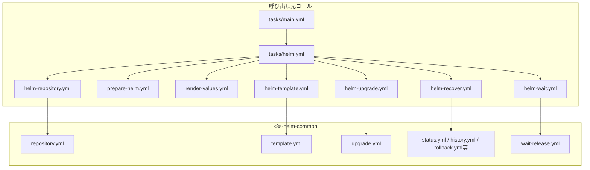

`helm.yml`から呼び出すサブタスクは必要な場合だけ作成します。すべてのサブタスクを機械的に作成する必要はありません。

### `roles/role-templ`からの新規ロール作成

ロール作成者は次の作業を実施します。

1. `roles/role-templ`を新しいロール名へコピーします。
2. コピーしたファイルとディレクトリを保持します。
3. `tasks/main.yml`へ, `resolve-runtime-vars.yml`, `helm.yml`, `verify.yml`等の新規処理を依存関係上必要な位置に追加します。`role-templ`由来の既存`include_tasks`は削除, 置換, 並べ替えません。

`tasks/main.yml`への追加例を次に示します。実際の追加位置はロール固有の依存関係に従います。

```yaml
1: # Helmによる導入又は更新を共通処理から実行する。
2: - name: "Helm"
3:   ansible.builtin.include_tasks: helm.yml
4:
5: # Helm導入後にHelm Chart固有のKubernetes資源を確認する。
6: - name: "Verify"
7:   ansible.builtin.include_tasks: verify.yml
8:   when: example_enabled | default(false) | bool
```

| 行番号 | 設定値 | 有効になる動作 | 設定背景(未設定時/誤設定時の問題と防止理由) |
| --- | --- | --- | --- |
| 2-3 | `helm.yml`の読み込み | Helm操作を独立した責務として実行します。 | `config.yml`等へHelm操作が混在して保守性が低下することを防止するためです。 |
| 6-8 | `verify.yml`の条件付き読み込み | 有効時だけHelm Chart固有検証を実行します。 | Helm導入識別名の状態確認とHelm Chart固有の正常条件を分離するためです。 |

#### `tasks/main.yml`の既存ロールでの具体例

`k8s-multus`ロールでは, `role-templ`由来の既存task読み込みを保持したまま, Helm経由でMultusを導入する場合に必要な`resolve-runtime-vars.yml`と`helm.yml`を依存関係上必要な位置へ追加しています。独自Chartとvaluesを`config-multus.yml`で準備した後に`helm.yml`を実行する点が重要です。

```yaml
1: - name: "Load Params"
2:   ansible.builtin.include_tasks: load-params.yml
3: - name: "Package"
4:   ansible.builtin.include_tasks: package.yml
5: - name: "Directory"
6:   ansible.builtin.include_tasks: directory.yml
7: - name: "User Group"
8:   ansible.builtin.include_tasks: user_group.yml
9: - name: "Service"
10:   ansible.builtin.include_tasks: service.yml
11:
12: - name: "Resolve Runtime Vars"
13:   ansible.builtin.include_tasks: resolve-runtime-vars.yml
14:   when:
15:     - k8s_multus_enabled | default(false) | bool
16:     - not (k8s_multus_kubectl_apply_enabled | default(false) | bool)
17:
18: - name: "Config Multus"
19:   ansible.builtin.include_tasks: config-multus.yml
20:   when:
21:     - k8s_multus_enabled | default(false)
22:     - not (k8s_multus_kubectl_apply_enabled | default(false))
23:
24: - name: "Helm Multus"
25:   ansible.builtin.include_tasks: helm.yml
26:   when:
27:     - k8s_multus_enabled | default(false) | bool
28:     - not (k8s_multus_kubectl_apply_enabled | default(false) | bool)
29:     - not ansible_check_mode
```

| 行番号 | 設定値 | 有効になる動作 | 設定背景(未設定時/誤設定時の問題と防止理由) |
| --- | --- | --- | --- |
| 1-10 | `role-templ`由来task | 既存の標準task読み込みを保持します。 | 新規Helm処理追加のために既存構造を削除又は並べ替えないためです。 |
| 12-16 | `resolve-runtime-vars.yml` | Helm導入時だけMultus固有runtime値を先に解決します。 | 後続のChart配置とHelm処理で同じ値を使用するためです。 |
| 18-22 | `config-multus.yml` | local ChartとvaluesをHelm実行前に準備します。 | `template.yml`と`upgrade.yml`が対象ホスト上の実ファイルを参照できるようにするためです。 |
| 24-29 | `helm.yml` | 準備完了後に共通Helm処理を呼び出します。 | Chart準備前にHelm操作を開始することとcheck modeで実変更することを防止するためです。 |

### `load-params.yml`の設定

Kubernetes関連ロールでは, `role-templ`でコメントアウトされている`vars/k8s-config-common.yml`と`vars/k8s-api-address.yml`の読み込みを有効化します。複数ロール間の共通値が必要な場合は, `vars/<機能群>-common.yml`を`k8s-config-common.yml`の直後, `all-config.yml`の前で読み込みます。

ロール作成者は次の作業を実施します。

1. 既存のパッケージ名とディストリビューション差異吸収用変数の読み込みを保持します。
2. `k8s-config-common.yml`の読み込みを有効化します。
3. 必要な場合だけ`<機能群>-common.yml`を追加します。
4. `all-config.yml`の読み込み位置を変更しません。
5. `k8s-api-address.yml`を`all-config.yml`の後で読み込みます。

共有変数読込部の例を次に示します。

```yaml
1: # kubernetes関連設定読み込み
2: - name: Include k8s common config vars
3:   ansible.builtin.include_vars: "{{ playbook_dir }}/vars/k8s-config-common.yml"
4:
5: # 本機能を構成する複数ロール間の共通設定読み込み
6: - name: Include example common vars
7:   ansible.builtin.include_vars: "{{ playbook_dir }}/vars/example-common.yml"
8:
9: # 共通設定読み込み
10: - name: Include config vars
11:   ansible.builtin.include_vars: "{{ playbook_dir }}/vars/all-config.yml"
12:
13: # Kubernetes API広告アドレス設定読み込み
14: - name: Include K8s API address vars
15:   ansible.builtin.include_vars: "{{ playbook_dir }}/vars/k8s-api-address.yml"
```

| 行番号 | 設定値 | 有効になる動作 | 設定背景(未設定時/誤設定時の問題と防止理由) |
| --- | --- | --- | --- |
| 2-3 | `k8s-config-common.yml` | KubernetesとHelmの共通設定を読み込みます。 | Helm共通設定値とHelm実行ユーザの導出値を利用可能にするためです。 |
| 6-7 | `example-common.yml` | 複数ロール間の内部共通値を読み込みます。 | 同じ意味の値を各ロールへ重複定義することを防止するためです。 |
| 10-11 | `all-config.yml` | 利用者の共通設定を読み込みます。 | 利用者設定による上書きを共通設定へ反映するためです。 |
| 14-15 | `k8s-api-address.yml` | 共通設定確定後にKubernetes API関連値を読み込みます。 | 利用者設定が確定する前の値からKubernetes API関連値を決定することを防止するためです。 |

#### `load-params.yml`の既存ロールでの具体例

`elastic-agent-k8s`ロールでは, `role-templ`由来のパッケージ名・ディストリビューション差異吸収用変数を保持し, Kubernetes共通設定の後にElastic Stack関連ロール共通の`logging-backend-common.yml`を読み込み, その後に利用者設定`all-config.yml`とKubernetes API設定を読み込んでいます。

```yaml
1: - name: Include ubuntu package names
2:   ansible.builtin.include_vars: "{{ playbook_dir }}/vars/packages-ubuntu.yml"
3:   when: ansible_facts.os_family == 'Debian'
4:
5: - name: Include RHEL package names
6:   ansible.builtin.include_vars: "{{ playbook_dir }}/vars/packages-rhel.yml"
7:   when: ansible_facts.os_family == 'RedHat'
8:
9: - name: Include cross-distro.yml
10:   ansible.builtin.include_vars: "{{ playbook_dir }}/vars/cross-distro.yml"
11:
12: - name: Include k8s common config vars
13:   ansible.builtin.include_vars: "{{ playbook_dir }}/vars/k8s-config-common.yml"
14:
15: - name: Include logging backend common vars
16:   ansible.builtin.include_vars: "{{ playbook_dir }}/vars/logging-backend-common.yml"
17:
18: - name: Include config vars
19:   ansible.builtin.include_vars: "{{ playbook_dir }}/vars/all-config.yml"
20:
21: - name: Include K8s API address vars
22:   ansible.builtin.include_vars: "{{ playbook_dir }}/vars/k8s-api-address.yml"
```

| 行番号 | 設定値 | 有効になる動作 | 設定背景(未設定時/誤設定時の問題と防止理由) |
| --- | --- | --- | --- |
| 1-10 | パッケージ名とcross-distro設定 | `role-templ`由来の既存読み込みを保持します。 | Helm対応追加によって既存ロール初期化処理を失わないためです。 |
| 12-13 | `k8s-config-common.yml` | Kubernetes/Helm共通値を読み込みます。 | Helm実行ユーザや共通時間制御値を利用可能にするためです。 |
| 15-16 | `logging-backend-common.yml` | Elastic Stack関連ロールの共通内部値を読み込みます。 | Chart版数等を関連ロールで重複定義しないためです。 |
| 18-19 | `all-config.yml` | 利用者設定を読み込みます。 | 環境固有の設定値を共通値へ反映するためです。 |
| 21-22 | `k8s-api-address.yml` | 共通設定確定後にKubernetes API関連値を解決します。 | 未確定の利用者設定からAPI値を導出しないためです。 |

### ロール間共通変数の定義

`vars/<機能群>-common.yml`には, 複数ロールで共有し, 利用者へ直接設定させない内部共通値と, 他の設定値から一意に導出できる値を定義します。利用者が環境に応じて変更する値は`vars/all-config.yml`又はロール固有の`defaults/main.yml`へ配置します。

ロール作成者は次の基準で配置先を判断します。

1. `defaults/main.yml`: そのロールだけで使用し, 利用者が必要に応じて`vars/all-config.yml`や`host_vars`に値を定義することで変更する変数の規定値を定義します。
2. `vars/all-config.yml`: Playbook全体又は複数機能に対して利用者が設定する値です。
3. `host_vars`: 特定のホストに対して利用者が設定する値です。
4. `vars/<機能群>-common.yml`: 複数ロールで共有する内部定義又は他の設定から一意に導出できる値です。
5. `resolve-runtime-vars.yml`: 実行対象ホストの状態, OSユーザ情報, ファイル状態等を確認しなければ決定できない値を算出します。

共通変数定義の例を次に示します。

```yaml
1: # Helm Chart版数は機能群全体で使用するソフトウェア版数から導出する。
2: example_chart_version: "{{ example_stack_version }}"
3:
4: # 同じ機能群の関連ロールが共通利用する名前空間を定義する。
5: example_namespace: "example-system"
```

| 行番号 | 設定値 | 有効になる動作 | 設定背景(未設定時/誤設定時の問題と防止理由) |
| --- | --- | --- | --- |
| 2 | `example_chart_version` | 利用者が指定した共通版数からHelm Chart版数を導出します。 | 同一版数を複数ロールへ個別設定して不一致になることを防止するためです。 |
| 5 | `example_namespace` | 関連ロール間で同じ名前空間を使用します。 | 同じ機能群の資源が別の名前空間へ分散することを防止するためです。 |

#### ロール間共通変数の既存実装例

Elastic Stack関連ロールでは, `vars/logging-backend-common.yml`でElastic Stack全体の版数を`logging_backend_elastic_stack_version`として定義し, `elastic-agent-k8s`のHelm Chart版数をその値から一意に導出しています。利用者が同じ版数を複数ロールへ個別設定する必要をなくす具体例です。

```yaml
1: # Elastic Stack関連コンポーネントが共通利用する版数。
2: logging_backend_elastic_stack_version: "8.19.19"
3:
4: # Elastic Agent for Kubernetes の Helm リポジトリ名。
5: elastic_agent_k8s_helm_repo_name: "elastic"
6: # Elastic Agent for Kubernetes の Helm リポジトリURL。
7: elastic_agent_k8s_helm_repo_url: "https://helm.elastic.co"
8: # Elastic Agent for Kubernetes の Helm Chart 名。
9: elastic_agent_k8s_chart_name: "elastic-agent"
10: # Elastic Agent for Kubernetes の Helm Chart バージョン。
11: elastic_agent_k8s_chart_version: "{{ logging_backend_elastic_stack_version }}"
12: # Elastic Agent for Kubernetes を導入する Kubernetes 名前空間。
13: elastic_agent_k8s_namespace: "kube-system"
```

| 行番号 | 設定値 | 有効になる動作 | 設定背景(未設定時/誤設定時の問題と防止理由) |
| --- | --- | --- | --- |
| 2 | `logging_backend_elastic_stack_version` | Elastic Stack関連ロールが共通利用する版数を1か所で定義します。 | コンポーネント間の版数不一致を防止するためです。 |
| 5-9 | repository/Chartの共通内部定義 | Elastic Agent Helm Chartの取得先とChart名を関連処理で共有します。 | 同じ固定値の重複定義を防止するためです。 |
| 11 | `elastic_agent_k8s_chart_version` | 共通Elastic Stack版数からChart版数を導出します。 | 利用者に同じ版数を二重設定させないためです。 |
| 13 | `elastic_agent_k8s_namespace` | Elastic Agentの配置先namespaceを共通内部値として定義します。 | 関連task間でnamespaceが不一致になることを防止するためです。 |

### 実行時設定値の算出

`resolve-runtime-vars.yml`では, 読み込み済みの利用者設定と共通設定を基に, 後続のHelm処理で使用するロール固有の実行時設定値を一度だけ算出します。実行対象ホストの状態を確認して決定する必要がある値も本ファイルで算出します。

```yaml
1: # 後続のHelm処理で共通利用する値をロール固有の実行時設定値へ変換する。
2: - name: Resolve example Helm runtime variables
3:   ansible.builtin.set_fact:
4:     example_runtime_release_name: "example"
5:     example_runtime_namespace: "{{ example_namespace }}"
6:     example_runtime_chart_version: "{{ example_chart_version }}"
7:     example_runtime_helm_timeout_seconds: "{{ k8s_helm_timeout_seconds }}"
8:     example_runtime_helm_retries: "{{ k8s_helm_retries }}"
9:     example_runtime_helm_retry_interval_seconds: "{{ k8s_helm_retry_interval_seconds }}"
10:     example_runtime_helm_request_interval_seconds: "{{ k8s_helm_request_interval_seconds }}"
```

| 行番号 | 設定値 | 有効になる動作 | 設定背景(未設定時/誤設定時の問題と防止理由) |
| --- | --- | --- | --- |
| 4-6 | Helm導入識別名, 名前空間, Helm Chart版数 | 後続タスクが同じ操作対象を使用します。 | 個別タスクで同じ値を繰り返し算出して不一致になることを防止するためです。 |
| 7-10 | Helm時間制御値 | 共通既定値をロール固有の実行時設定値へ変換します。 | ロール固有の調整値を後続処理へ一貫して渡すためです。 |

#### `resolve-runtime-vars.yml`の既存ロールでの具体例

`elastic-agent-k8s`ロールでは, 共通設定とロール設定からrelease名, repository, Chart, namespace, Helm実行ユーザ, Helm時間制御値を一度だけruntime変数へ変換します。さらにHelm実行ユーザの実ホームディレクトリを`getent`で取得し, 明示的な`kubeconfig`がない場合の既定パスを`/home`固定ではなく実ホームから算出します。

```yaml
1: - name: Resolve elastic-agent-k8s runtime variables
2:   ansible.builtin.set_fact:
3:     elastic_agent_k8s_runtime_release_name: "{{ elastic_agent_k8s_release_name | string | trim }}"
4:     elastic_agent_k8s_runtime_helm_repo_name: "{{ elastic_agent_k8s_helm_repo_name | string | trim }}"
5:     elastic_agent_k8s_runtime_helm_repo_url: "{{ elastic_agent_k8s_helm_repo_url | string | trim }}"
6:     elastic_agent_k8s_runtime_chart_name: "{{ elastic_agent_k8s_chart_name | string | trim }}"
7:     elastic_agent_k8s_runtime_chart_version: "{{ elastic_agent_k8s_chart_version | string | trim }}"
8:     elastic_agent_k8s_runtime_namespace: "{{ elastic_agent_k8s_namespace | string | trim }}"
9:     elastic_agent_k8s_runtime_operator_user: "{{ k8s_runtime_helm_operator_user | default('', true) | string | trim }}"
10:     elastic_agent_k8s_runtime_helm_timeout_seconds: "{{ elastic_agent_k8s_helm_timeout_seconds | int }}"
11:     elastic_agent_k8s_runtime_helm_retries: "{{ elastic_agent_k8s_helm_retries | int }}"
12:
13: - name: Resolve home directory for elastic-agent-k8s Helm operator user
14:   ansible.builtin.getent:
15:     database: passwd
16:     key: "{{ elastic_agent_k8s_runtime_operator_user }}"
17:   register: elastic_agent_k8s_helm_operator_user_getent
18:   changed_when: false
19:
20: - name: Resolve elastic-agent-k8s runtime paths
21:   ansible.builtin.set_fact:
22:     elastic_agent_k8s_runtime_kubeconfig_path: >-
23:       {{ (elastic_agent_k8s_kubeconfig_path | string | trim)
24:          if (elastic_agent_k8s_kubeconfig_path | string | trim | length) > 0
25:          else (elastic_agent_k8s_helm_operator_user_getent.ansible_facts.getent_passwd[elastic_agent_k8s_runtime_operator_user][4]
26:                ~ '/.kube/ca-embedded-admin.conf') }}
```

| 行番号 | 設定値 | 有効になる動作 | 設定背景(未設定時/誤設定時の問題と防止理由) |
| --- | --- | --- | --- |
| 1-11 | Elastic Agent runtime変数 | 後続taskで共通利用するHelm対象と時間制御値を1回だけ確定します。 | taskごとの再計算や型の不一致を防止するためです。 |
| 9 | Helm実行ユーザ | `k8s_runtime_helm_operator_user`からロール固有runtime値を解決します。 | 共通設定と実際のHelm実行主体を一致させるためです。 |
| 13-18 | `getent passwd` | Helm実行ユーザの実ホームディレクトリを取得します。 | `/home/<user>`固定前提によるパス誤りを防止するためです。 |
| 20-26 | kubeconfigパス解決 | 明示値を優先し, 未指定時は実ホーム配下の既定kubeconfigを使用します。 | 利用者指定を保持しつつ環境依存パスをruntime時に解決するためです。 |

### valuesファイルの生成

valuesファイルを生成する場合は, 呼び出し元ロール側にテンプレートと生成処理を実装します。処理が独立した責務になる場合は`render-values.yml`へ分離します。

```yaml
1: # Helm Chart固有の設定を対象ホスト上のvaluesファイルへ生成する。
2: - name: Render example Helm values
3:   ansible.builtin.template:
4:     src: values.yaml.j2
5:     dest: "{{ example_runtime_values_file }}"
6:     owner: root
7:     group: root
8:     mode: "0644"
```

| 行番号 | 設定値 | 有効になる動作 | 設定背景(未設定時/誤設定時の問題と防止理由) |
| --- | --- | --- | --- |
| 3-5 | テンプレートと生成先 | Helm Chart固有のvaluesファイルを生成します。 | Helm Chart固有設定を`k8s-helm-common`へ持ち込まないためです。 |
| 6-8 | 所有者と権限 | Helm実行経路からvaluesファイルを参照可能にします。 | 読み取り権限不足によるhelmコマンド失敗を防止するためです。 |

#### valuesファイル生成の既存ロールでの具体例

`elastic-agent-k8s`ロールでは, Helm実行ユーザが`template.yml`と`upgrade.yml`の両方から同じvaluesファイルを参照できるよう, runtimeで確定した配置先ディレクトリを作成してから`values.yaml.j2`を描画します。valuesの内容はElastic Agent固有設定であり, `k8s-helm-common`には持ち込みません。

```yaml
1: - name: Create elastic-agent-k8s Helm values directory
2:   ansible.builtin.file:
3:     path: "{{ elastic_agent_k8s_runtime_values_file_path | dirname }}"
4:     state: directory
5:     owner: "{{ elastic_agent_k8s_runtime_operator_user }}"
6:     group: "{{ elastic_agent_k8s_runtime_operator_user }}"
7:     mode: "0755"
8:   become: true
9:
10: - name: Render elastic-agent-k8s Helm values file
11:   ansible.builtin.template:
12:     src: values.yaml.j2
13:     dest: "{{ elastic_agent_k8s_runtime_values_file_path }}"
14:     owner: "{{ elastic_agent_k8s_runtime_operator_user }}"
15:     group: "{{ elastic_agent_k8s_runtime_operator_user }}"
16:     mode: "0644"
17:     backup: false
18:   become: true
```

| 行番号 | 設定値 | 有効になる動作 | 設定背景(未設定時/誤設定時の問題と防止理由) |
| --- | --- | --- | --- |
| 1-8 | values配置先ディレクトリ | Helm実行ユーザが参照できるvalues配置先を準備します。 | `template.yml`/`upgrade.yml`からの読み取り権限不足を防止するためです。 |
| 10-13 | `values.yaml.j2`とruntime配置先 | Elastic Agent固有valuesを対象ホストへ生成します。 | Chart固有設定を共通Helmロールから分離するためです。 |
| 14-17 | 所有者, 権限, backup | Helm実行ユーザによる読み取りを保証し不要なbackup生成を抑止します。 | Helm処理から確実に同じvaluesを参照するためです。 |

### Helm repositoryの設定

Helm repository経由でHelm Chartを取得する場合だけ`repository.yml`を使用します。OCI形式のHelm Chart又は対象ホスト上のローカルHelm ChartではHelm repository設定を必要としません。

Helm repository設定処理を独立したタスクにする場合は`helm-repository.yml`へ分離し, `helm.yml`から呼び出すことを推奨します。

#### Helm repository設定の既存ロールでの具体例

`elastic-agent-k8s`ロールではrepository操作を`tasks/helm-repository.yml`へ分離し, release導入処理より前に実行します。呼び出し元ロールはElastic Agent固有のruntime値を共通入力へ変換するだけで, repositoryの存在確認や更新方法は`k8s-helm-common`へ委譲します。

```yaml
1: - name: Reconcile Helm repository for elastic-agent-k8s
2:   vars:
3:     k8s_helm_repository_name: "{{ elastic_agent_k8s_runtime_helm_repo_name }}"
4:     k8s_helm_repository_url: "{{ elastic_agent_k8s_runtime_helm_repo_url }}"
5:     k8s_helm_repository_users: "{{ k8s_runtime_helm_execution_users }}"
6:     k8s_helm_operation_timeout_seconds: "{{ elastic_agent_k8s_runtime_helm_timeout_seconds }}"
7:     k8s_helm_operation_retries: "{{ elastic_agent_k8s_runtime_helm_retries }}"
8:     k8s_helm_operation_retry_interval_seconds: "{{ elastic_agent_k8s_runtime_helm_retry_interval_seconds }}"
9:     k8s_helm_operation_request_interval_seconds: "{{ elastic_agent_k8s_runtime_helm_request_interval_seconds }}"
10:   block:
11:     - name: Reconcile Helm repository with common role
12:       ansible.builtin.include_role:
13:         name: k8s-helm-common
14:         tasks_from: repository.yml
```

| 行番号 | 設定値 | 有効になる動作 | 設定背景(未設定時/誤設定時の問題と防止理由) |
| --- | --- | --- | --- |
| 3-5 | Elastic Agent repository情報 | 呼び出し元で確定した製品固有値を共通入力へ変換します。 | 共通ロールがElastic Agent固有変数へ依存しないようにするためです。 |
| 6-9 | runtime時間制御値 | repository操作の外部通信条件を統一します。 | 呼び出し元の調整値を共通処理へ正確に伝えるためです。 |
| 11-14 | `repository.yml` | repository整合処理を共通ロールへ委譲します。 | Helm repository操作を一元化するためです。 |

### `k8s-helm-common`への入力値の設定

呼び出し元ロールは, 利用者設定を直接`k8s-helm-common`へ大量に渡すのではなく, `resolve-runtime-vars.yml`で確定したロール固有の実行時設定値を公開インターフェースの入力へ変換します。

```yaml
1: - name: Render example Helm template
2:   ansible.builtin.include_role:
3:     name: k8s-helm-common
4:     tasks_from: template.yml
5:   vars:
6:     k8s_helm_release_name: "{{ example_runtime_release_name }}"
7:     k8s_helm_namespace: "{{ example_runtime_namespace }}"
8:     k8s_helm_chart_ref: "{{ example_runtime_chart_ref }}"
9:     k8s_helm_chart_version: "{{ example_runtime_chart_version }}"
10:     k8s_helm_kubeconfig_path: "{{ example_runtime_kubeconfig_path }}"
11:     k8s_helm_values_files: ["{{ example_runtime_values_file }}"]
12:     k8s_helm_operation_timeout_seconds: "{{ example_runtime_helm_timeout_seconds }}"
13:     k8s_helm_operation_retries: "{{ example_runtime_helm_retries }}"
14:     k8s_helm_operation_retry_interval_seconds: "{{ example_runtime_helm_retry_interval_seconds }}"
15:     k8s_helm_operation_request_interval_seconds: "{{ example_runtime_helm_request_interval_seconds }}"
```

| 行番号 | 設定値 | 有効になる動作 | 設定背景(未設定時/誤設定時の問題と防止理由) |
| --- | --- | --- | --- |
| 6-11 | ロール固有の実行時設定値から公開入力へ変換 | 対象Helm導入識別名, Helm Chart, valuesを共通処理へ渡します。 | 利用者設定と共通ロール内部の入力名を直接結合せず, 呼び出し元ロールで責務境界を明示するためです。 |
| 12-15 | 時間制御値の変換 | ロール固有の調整値を共通Helm処理へ渡します。 | Helm Chartの特性に応じた調整を共通ロール実装へ埋め込まないためです。 |

#### `k8s-helm-common`入力変換の既存ロールでの具体例

`k8s-multus`ロールでは, local Chartとvaluesの準備後に, Multus固有runtime値を`k8s_helm_*`公開入力へ一度だけ変換するblockを作り, その同じ入力で`template.yml`, `upgrade.yml`, `wait-release.yml`を順に呼び出しています。

```yaml
1: - name: Install Multus Helm release via k8s-helm-common
2:   vars:
3:     k8s_helm_release_name: "{{ k8s_multus_runtime_release_name }}"
4:     k8s_helm_namespace: "{{ k8s_multus_runtime_namespace }}"
5:     k8s_helm_chart_ref: "{{ k8s_multus_runtime_chart_ref }}"
6:     k8s_helm_chart_version: "{{ k8s_multus_runtime_chart_version }}"
7:     k8s_helm_kubeconfig_path: "{{ k8s_multus_runtime_kubeconfig_path }}"
8:     k8s_helm_values_files:
9:       - "{{ k8s_multus_runtime_values_file }}"
10:     k8s_helm_create_namespace: false
11:     k8s_helm_operation_timeout_seconds: "{{ k8s_multus_runtime_helm_timeout_seconds }}"
12:     k8s_helm_operation_retries: "{{ k8s_multus_runtime_helm_retries }}"
13:     k8s_helm_operation_retry_interval_seconds: "{{ k8s_multus_runtime_helm_retry_interval_seconds }}"
14:     k8s_helm_operation_request_interval_seconds: "{{ k8s_multus_runtime_helm_request_interval_seconds }}"
15:   block:
16:     - name: Render Multus Helm template
17:       ansible.builtin.include_role:
18:         name: k8s-helm-common
19:         tasks_from: template.yml
20:     - name: Install or upgrade Multus Helm release
21:       ansible.builtin.include_role:
22:         name: k8s-helm-common
23:         tasks_from: upgrade.yml
24:     - name: Wait for Multus Helm release
25:       ansible.builtin.include_role:
26:         name: k8s-helm-common
27:         tasks_from: wait-release.yml
```

| 行番号 | 設定値 | 有効になる動作 | 設定背景(未設定時/誤設定時の問題と防止理由) |
| --- | --- | --- | --- |
| 3-10 | Multus runtime値から公開入力への変換 | local Chart, namespace, kubeconfig, valuesを共通Helm操作へ渡します。 | 共通ロールをMultus固有変数名から独立させるためです。 |
| 11-14 | Helm時間制御値 | 同じ時間制御条件を一連のHelm操作へ適用します。 | taskごとに異なる待機条件になることを防止するためです。 |
| 16-19 | `template.yml` | local Chartを実変更前に検証します。 | 未検証Chartを直接適用しないためです。 |
| 20-23 | `upgrade.yml` | 同じ入力で導入又は更新します。 | template済み条件と実変更条件を一致させるためです。 |
| 24-27 | `wait-release.yml` | upgrade後のHelm release状態を確認します。 | Helm操作のpost-conditionを共通化するためです。 |

## 導入方式別の実装例

### repository上の既存Helm Chartを使用する場合

本方式は, 既存Helm Chartを利用し, Helm Chart固有の導入後検証を必要としない最小構成です。現行の代表ロールにはこの条件へ完全一致する単独例がないため, 既存実装を基にした標準形を示します。

ロール作成者は次の作業を実施します。

1. 必要に応じてHelm repositoryを設定します。
2. valuesファイルが必要な場合は呼び出し元ロールで生成します。
3. `template.yml`で実変更前にHelm Chartを事前描画します。
4. `upgrade.yml`でHelm導入識別名を導入又は更新します。
5. `k8s_helm_upgrade_result.rc`を確認します。
6. `wait-release.yml`で`deployed`状態を確認します。
7. Helm Chart固有の追加確認が不要な場合は`verify.yml`を作成しません。

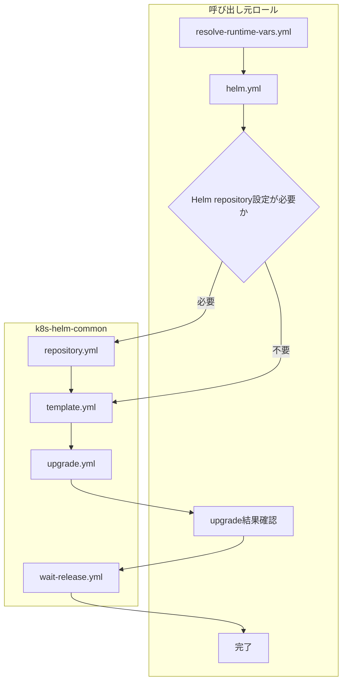

### 既存Helm Chartを使用して導入後検証を行う場合

代表例は`elastic-agent-k8s`, `elastic-agent-k8s-audit`, `k8s-whereabouts`です。前節の処理に加えて, `wait-release.yml`成功後に`verify.yml`でHelm Chart固有資源を検証します。

ロール作成者は次の作業を実施します。

1. 必要に応じてHelm repositoryを設定します。
2. valuesファイルが必要な場合は呼び出し元ロールで生成します。
3. `template.yml`で実変更前にHelm Chartを事前描画します。
4. `upgrade.yml`でHelm導入識別名を導入又は更新します。
5. `k8s_helm_upgrade_result.rc`を確認します。
6. `wait-release.yml`で`deployed`状態を確認します。
7. `verify.yml`でHelm Chart固有のKubernetes資源を検証します。

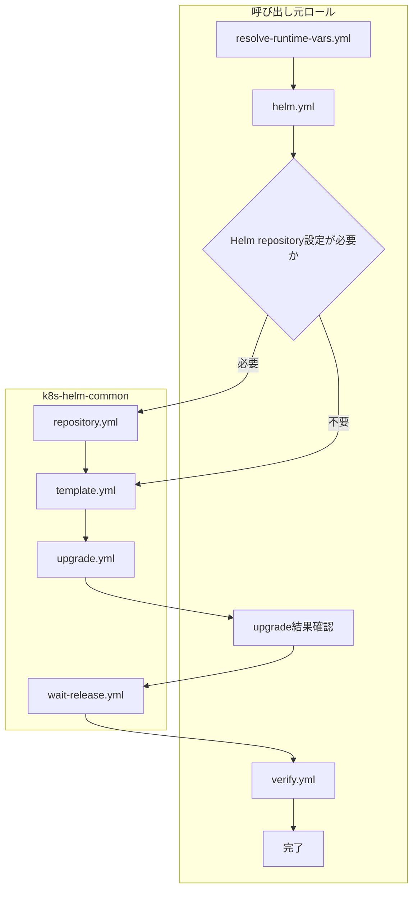

`verify.yml`では, DaemonSet, Deployment, Pod等について対象Helm Chartが要求する正常条件を確認します。確認方法は[verify.ymlの設計指針](#verifyymlの設計指針)を参照します。

#### 既存Helm Chart + 導入後検証の具体例

`k8s-whereabouts`ロールは公式OCI Chartを使用するためHelm repository登録を行わず, `template.yml`, `upgrade.yml`, upgrade結果確認, `wait-release.yml`の順に処理した後, `verify.yml`でDaemonSetとPodを確認します。この例は「既存Chartの取得方式がrepositoryとは限らない」ことも示しています。

```yaml
1: - name: Install Whereabouts Helm release via k8s-helm-common
2:   vars:
3:     k8s_helm_release_name: "{{ k8s_whereabouts_runtime_release_name }}"
4:     k8s_helm_namespace: "{{ k8s_whereabouts_runtime_namespace }}"
5:     k8s_helm_chart_ref: "{{ k8s_whereabouts_runtime_chart_ref }}"
6:     k8s_helm_chart_version: "{{ k8s_whereabouts_runtime_chart_version }}"
7:     k8s_helm_kubeconfig_path: "{{ k8s_whereabouts_runtime_kubeconfig_path }}"
8:     k8s_helm_values_files: []
9:   block:
10:     - name: Render Whereabouts Helm template
11:       ansible.builtin.include_role:
12:         name: k8s-helm-common
13:         tasks_from: template.yml
14:     - name: Install or upgrade Whereabouts Helm release
15:       ansible.builtin.include_role:
16:         name: k8s-helm-common
17:         tasks_from: upgrade.yml
18:     - name: Validate Whereabouts Helm upgrade result
19:       ansible.builtin.assert:
20:         that:
21:           - k8s_helm_upgrade_result.rc | default(1) | int == 0
22:       when: not ansible_check_mode
23:     - name: Wait for Whereabouts Helm release
24:       ansible.builtin.include_role:
25:         name: k8s-helm-common
26:         tasks_from: wait-release.yml
```

`wait-release.yml`成功後は`verify.yml`でWhereaboutsのDaemonSet/Podを検証します。具体的なDaemonSet/Pod検証は付録の[DaemonSet検証の具体例](#daemonset検証の具体例)と[Pod検証の具体例](#pod検証の具体例)に示します。

| 行番号 | 設定値 | 有効になる動作 | 設定背景(未設定時/誤設定時の問題と防止理由) |
| --- | --- | --- | --- |
| 3-8 | Whereabouts OCI Chart入力 | repository登録なしで公式OCI Chartを直接参照します。 | 既存Chartでも取得方式に応じて不要なrepository操作を省略するためです。 |
| 10-13 | template | OCI Chartを変更前に描画確認します。 | Chart参照や版数誤りを実変更前に検出するためです。 |
| 14-22 | upgradeと結果確認 | Chartを導入し, 共通処理の戻り値を呼び出し元で判定します。 | 自動回復を持たないため失敗後の誤継続を防止するためです。 |
| 23-26 | wait-release | Helm releaseが`deployed`になるまで待機します。 | Helm状態確認とChart固有資源検証を分離するためです。 |

### 独自Helm Chartを使用する場合

代表例は`k8s-multus`, `netshoot-no-portscan`です。リポジトリで管理するHelm Chart原本を対象ホストへ配置し, その配置先を`k8s_helm_chart_ref`へ渡します。

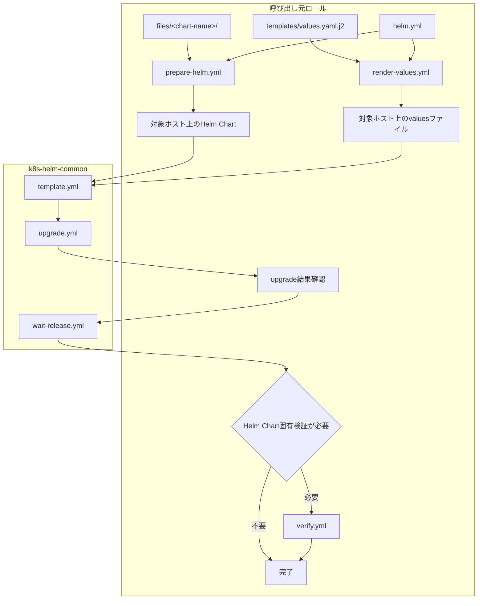

ロール作成者は次の作業を実施します。

1. `files/<chart-name>/`に`Chart.yaml`, `templates/`, 必要な`values.yaml`を配置します。
2. `prepare-helm.yml`等でHelm Chart原本を対象ホストへ配置します。
3. 実行環境固有のvaluesが必要な場合は`render-values.yml`で生成します。
4. 対象ホスト上のHelm Chartディレクトリを`k8s_helm_chart_ref`へ設定します。
5. ローカルHelm Chartでは必要に応じて`k8s_helm_chart_version`を空文字列とし, `Chart.yaml`側の版数を使用します。
6. `template.yml`で実変更前に独自Helm Chartを事前描画します。
7. `upgrade.yml`でHelm導入識別名を導入又は更新します。
8. `k8s_helm_upgrade_result.rc`を確認します。
9. `wait-release.yml`で`deployed`状態を確認します。
10. Helm Chart固有の導入後検証が必要な場合は`verify.yml`でKubernetes資源を確認します。

#### 独自Helm Chart導入の具体例

`k8s-multus`ロールでは, `roles/k8s-multus/files/multus-chart/`で管理するlocal Chartを対象ホストへコピーし, Multus固有valuesを生成してから`helm.yml`で共通Helm処理を実行します。
Chart原本の管理・配置とvalues生成は呼び出し元ロール, Helm操作は, `k8s-helm-common`に委譲して実施します。

```yaml
1: - name: Copy Multus Helm Chart to remote host
2:   ansible.builtin.copy:
3:     src: "{{ k8s_multus_helm_chart_source }}/"
4:     dest: "{{ k8s_multus_runtime_helm_chart_path }}/"
5:     owner: root
6:     group: root
7:     mode: preserve
8:   become: true
9:
10: - name: Setup Multus Helm values file
11:   ansible.builtin.template:
12:     src: multus-values.yml.j2
13:     dest: "{{ k8s_multus_runtime_values_file }}"
14:     owner: root
15:     group: root
16:     mode: '0644'
17:     backup: false
18:
19: - name: "Helm Multus"
20:   ansible.builtin.include_tasks: helm.yml
21:   when:
22:     - k8s_multus_enabled | default(false) | bool
23:     - not (k8s_multus_kubectl_apply_enabled | default(false) | bool)
24:     - not ansible_check_mode
```

| 行番号 | 設定値 | 有効になる動作 | 設定背景(未設定時/誤設定時の問題と防止理由) |
| --- | --- | --- | --- |
| 1-8 | local Chartのコピー | リポジトリで管理するChart原本を対象ホスト上のHelm参照先へ配置します。 | `k8s-helm-common`が対象ホスト上のChart pathを参照できるようにするためです。 |
| 10-17 | Multus values生成 | 実行環境固有のMultus設定をvaluesファイルへ描画します。 | Chart固有設定を共通ロールへ持ち込まないためです。 |
| 19-24 | `helm.yml` | Chart/values準備後にのみHelm操作を開始します。 | 未生成ファイル参照とcheck modeでの実変更を防止するためです。 |

### 既存Helm導入識別名の設定を変更する場合

代表例は`k8s-hubble-ui`です。変更対象以外の既存valuesを保持する必要がある場合は, `get-values.yml`で現在設定を取得し, 変更内容と合成して同じHelm導入識別名へ適用します。

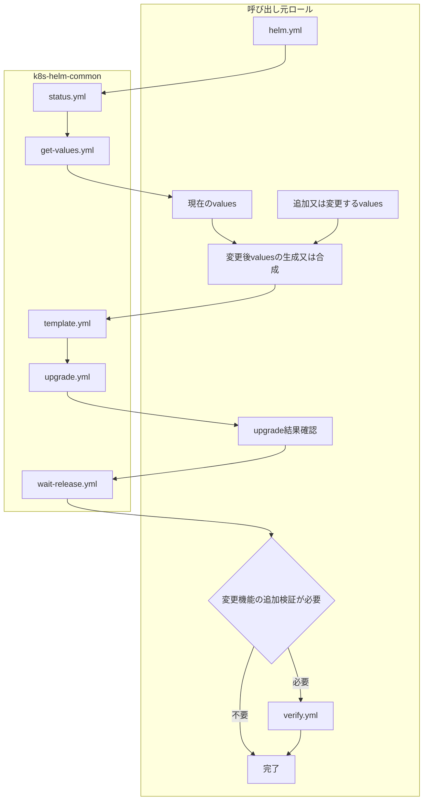

ロール作成者は次の作業を実施します。

1. 操作対象の既存Helm導入識別名を特定します。
2. 必要に応じて`status.yml`で存在を確認します。
3. 既存設定を保持する必要がある場合は`get-values.yml`でvaluesを取得します。
4. 変更対象以外の既存設定を保持するよう変更後valuesを生成します。
5. `template.yml`で変更後のHelm Chartを事前描画します。
6. `upgrade.yml`を同じHelm導入識別名へ実行します。
7. `k8s_helm_upgrade_result.rc`を確認します。
8. `wait-release.yml`で`deployed`状態を確認します。
9. 必要に応じて`verify.yml`で変更機能のKubernetes資源を確認します。

#### 既存Helm導入識別名設定変更の具体例

`k8s-hubble-ui`ロールでは, 既存Cilium releaseの利用者設定valuesを取得し, Hubble UI用valuesを右側優先でマージしてから同じCilium releaseへ`upgrade.yml`を実行します。

本例は, 変更対象以外の既存設定を保持する必要がある場合の具体例です。

```yaml
1: - name: Get Cilium Helm values with common role
2:   ansible.builtin.include_role:
3:     name: k8s-helm-common
4:     tasks_from: get-values.yml
5:
6: - name: Save existing values to file
7:   ansible.builtin.copy:
8:     content: "{{ k8s_helm_release_values_yaml }}"
9:     dest: "{{ k8s_hubble_ui_config_dir }}/cilium-existing-values.yml"
10:     mode: '0644'
11:
12: - name: Merge existing values with Hubble UI values
13:   ansible.builtin.shell: |
14:     set -o pipefail
15:     {{ yq_command }} eval-all '. as $item ireduce ({}; . * $item)' \\
16:       "{{ k8s_hubble_ui_config_dir }}/cilium-existing-values.yml" \\
17:       "{{ k8s_hubble_ui_config_dir }}/hubble-ui-values.yml" \\
18:       > "{{ k8s_hubble_ui_config_dir }}/hubble-ui-values-merged.yml"
19:   args:
20:     executable: /bin/bash
21:
22: - name: Install or upgrade Cilium Helm release for Hubble UI
23:   ansible.builtin.include_role:
24:     name: k8s-helm-common
25:     tasks_from: upgrade.yml
```

| 行番号 | 設定値 | 有効になる動作 | 設定背景(未設定時/誤設定時の問題と防止理由) |
| --- | --- | --- | --- |
| 1-4 | `get-values.yml` | 既存Cilium releaseの利用者設定valuesを取得します。 | 変更対象外の既存設定を保持するためです。 |
| 6-10 | 既存values保存 | 共通ロール出力を後続マージ処理で利用可能にします。 | 取得結果と新規valuesを明示的に分離するためです。 |
| 12-20 | `yq eval-all` | 既存valuesへHubble UI設定を右側優先でマージします。 | 新規変更を適用しつつ既存Cilium設定を保持するためです。 |
| 22-25 | `upgrade.yml` | マージ後valuesで同じCilium releaseを更新します。 | 新しいreleaseを作らず既存導入単位の設定変更として適用するためです。 |

## トラブルシューティング

### 1. Helm kubeconfig file does not exist or is not a regular fileで停止する場合

**実施対象ホスト**: Helm実行対象ホスト

**実行するコマンド**:

```bash
ls -l /home/ansible/.kube/config
readlink -f /home/ansible/.kube/config
test -f /home/ansible/.kube/config
```

**確認ポイント**:

- `test -f /home/ansible/.kube/config`が終了状態0となることを確認することで, `kubeconfig`の参照先が通常ファイルであることを確認します。
- `readlink -f /home/ansible/.kube/config`が実在するファイルを表示することを確認することで, シンボリックリンクの参照先が有効であることを確認します。

### 2. Helm runtime user cannot read kubeconfigで停止する場合

**実施対象ホスト**: Helm実行対象ホスト

**実行するコマンド**:

```bash
sudo -u ansible test -r /home/ansible/.kube/config
namei -l /home/ansible/.kube/config
```

**確認ポイント**:

- `sudo -u ansible test -r /home/ansible/.kube/config`が終了状態0となることを確認することで, Helm実行ユーザから`kubeconfig`を読み取れることを確認します。
- `namei -l /home/ansible/.kube/config`の出力結果中の各親ディレクトリに通過権限があることを確認することで, ファイル自体の権限だけではない経路上の問題を確認します。

### 3. `upgrade.yml`実行後に`k8s_helm_upgrade_result.rc`が非0となる場合

**実施対象ホスト**: Helm実行対象ホスト

**実行するコマンド**:

```bash
helm status <release-name> --namespace <namespace> --kubeconfig <kubeconfig>
helm history <release-name> --namespace <namespace> --kubeconfig <kubeconfig>
```

**確認ポイント**:

- `helm status`の出力結果中の状態を確認することで, 失敗後にHelm導入識別名が`failed`又は`pending-*`等の状態になっていることを確認します。
- `helm history`の出力結果中のHelm revisionと状態を確認することで, 回復対象の履歴を確認します。
- 変更操作の成否が不明な場合は無条件に同じ変更操作を再実行せず, 現在状態を確認してから回復方法を決定します。

### 4. `wait-release.yml`で`deployed`状態にならない場合

**実施対象ホスト**: Helm実行対象ホスト

**実行するコマンド**:

```bash
helm status <release-name> --namespace <namespace> --kubeconfig <kubeconfig>
helm history <release-name> --namespace <namespace> --kubeconfig <kubeconfig>
```

**確認ポイント**:

- `helm status`の出力結果中の状態を確認することで, Helm導入識別名が更新途中, 失敗又は復旧途中のいずれであることを確認します。
- `helm history`の出力結果中の直近Helm revisionを確認することで, 直前の変更操作と現在状態の対応を確認します。

## 注意事項

- `clear-repositories.yml`は指定したOSユーザのHelm repositoryをすべて削除するため, 通常のHelm Chart導入ロールで個別repository削除用途には使用しません。
- `template.yml`の成功はKubernetesへの導入成功を保証しません。変更操作には`upgrade.yml`を使用し, 最終状態を`wait-release.yml`で確認します。
- `upgrade.yml`は変更操作失敗時も実行結果を呼び出し元へ返します。自動回復処理を持たないロールは`k8s_helm_upgrade_result.rc`を必ず確認します。
- `rollback.yml`は成否不明状態での重複Helm revision生成を防止するため自動再試行しません。
- `wait-release.yml`はHelm導入識別名自身の`deployed`状態だけを確認します。Helm Chart固有のKubernetes資源の正常条件は呼び出し元ロールで確認します。
- Helm repository設定はOSユーザごとのHelm設定へ保存されるため, `repository.yml`では対象OSユーザ一覧を明示します。
- Helm操作を新規ロールへ実装する場合は原則として`tasks/helm.yml`を作成し, `tasks/config.yml`へHelm操作を混在させません。
- Helm操作が複雑になる場合は, 処理の責務ごとにサブタスク化し, `helm.yml`から呼び出します。

## 付録

### `verify.yml`の設計指針

#### `verify.yml`の責務

`verify.yml`は, `wait-release.yml`が確認するHelm導入識別名の状態より上位の, Helm Chart固有のKubernetes資源の完了条件を確認します。対象Helm Chartが生成するKubernetes資源と各資源の公式API仕様を確認し, 資源種別ごとに完了条件を定義します。

`verify.yml`は`wait-release.yml`成功後に呼び出されることを前提とし, Helm導入識別名自身の`deployed`状態を重複確認するのではなく, Helm Chart固有のKubernetes資源を検証します。

本節の標準パターンでは, 特定Helm Chartへ依存しない処理構造を示すため`example_*`変数を使用します。続く具体例では既存ロールの実装を題材とし, 実際の変数名, Kubernetes資源名, 判定条件を使って実装方法を示します。

#### `verify.yml`共通処理の実装例

Kubernetes資源の実行時検証では, Ansible check modeで実クラスタ状態を検証しないことと, Kubernetes APIへの要求を開始する前に時間制御値を検証することを基本とします。

標準パターンでは次の処理を行います。

```yaml
1: # チェックモードでは実行時検証を行わない。
2: - name: Skip example runtime verification in check mode
3:   ansible.builtin.debug:
4:     msg: >-
5:       Check mode: skipping runtime verification for example.
6:   when: ansible_check_mode | bool
7:
8: # 導入後検証で使用する時間制御値を事前に検証する。
9: - name: Validate example runtime verification timing inputs
10:   ansible.builtin.assert:
11:     that:
12:       - example_verify_request_timeout_seconds | int > 0
13:       - example_verify_retry_interval_seconds | int >= 0
14:       - example_verify_retries | int > 0
15:     fail_msg: >-
16:       Example runtime verification timing values are invalid.
17:   when: not (ansible_check_mode | bool)
```

| 行番号 | 設定値 | 有効になる動作 | 設定背景(未設定時/誤設定時の問題と防止理由) |
| --- | --- | --- | --- |
| 2-6 | check mode判定 | Ansible check modeでは実クラスタの実行時検証を行いません。 | check modeで変更後のKubernetes資源状態を前提にすると, 未適用状態を誤って失敗と判定するためです。 |
| 9-10 | `ansible.builtin.assert` | 外部コマンドを実行する前に検証用時間制御値を確認します。 | 不正な時間制御値による即時失敗又は意図しない待機を防止するためです。 |
| 12 | `example_verify_request_timeout_seconds` | Kubernetes API要求1回の時間上限が正数であることを確認します。 | `0`以下では有効な要求時間上限にならないためです。 |
| 13 | `example_verify_retry_interval_seconds` | 再取得間隔が0以上であることを確認します。 | 負数の待機時間を指定しないためです。 |
| 14 | `example_verify_retries` | 最大試行回数が正数であることを確認します。 | 1回も検証しない設定を防止するためです。 |
| 15-17 | `fail_msg`, `when` | 不正値を明示的な理由付きで停止し, check modeでは検証を実行しません。 | 不正値による後続処理の不明瞭な失敗を防止するためです。 |

具体例として`k8s-hubble-ui`ロールでは, DeploymentのReplica数も導入後検証の前提値として同時に検証しています。

```yaml
1: - name: Validate Hubble UI runtime verification timing inputs
2:   ansible.builtin.assert:
3:     that:
4:       - k8s_hubble_ui_verify_request_timeout_seconds | int > 0
5:       - k8s_hubble_ui_verify_retry_interval_seconds | int >= 0
6:       - k8s_hubble_ui_verify_retries | int > 0
7:       - hubble_ui_replicas | int > 0
8:     fail_msg: >-
9:       Hubble UI runtime verification timing values or replica count are invalid.
10:   when: not (ansible_check_mode | bool)
```

この例では, Kubernetes APIへの時間制御値だけでなく, Deploymentの完了判定に使用する`hubble_ui_replicas`が正数であることも外部コマンド実行前に確認しています。

| 行番号 | 設定値 | 有効になる動作 | 設定背景(未設定時/誤設定時の問題と防止理由) |
| --- | --- | --- | --- |
| 1-2 | Hubble UI検証値の事前検証 | Deployment取得前に検証条件を確定します。 | 実行後に入力値不正と判明することを防止するためです。 |
| 4-6 | timeout, retry interval, retries | Kubernetes API状態取得の時間制御値を検証します。 | 無効な時間制御値による即時失敗を防止するためです。 |
| 7 | `hubble_ui_replicas` | Deploymentに期待するReplica数が1以上であることを確認します。 | Replica数0を正常な稼働状態として待機しないためです。 |
| 8-10 | `fail_msg`, `when` | 不正値の場合だけ通常実行時に明示的に停止します。 | check modeでは実行時状態を検証しない方針と整合させるためです。 |

#### Kubernetes資源の検証順序

典型的な検証順序を次に示します。

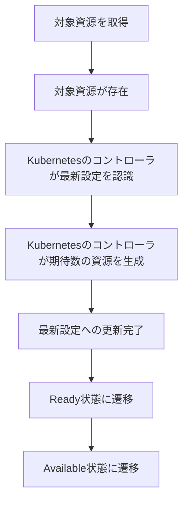

すべてのKubernetes資源が同じ状態項目を持つわけではありません。対象資源の公式API仕様を確認し, 存在する状態項目だけを使用します。

時間経過によってKubernetesコントローラが収束する状態は`until`で再取得しながら待機します。一方, 取得した資源が存在すること, 配置対象数が0ではないこと等, 取得時点で即時に妥当性を判断できる条件は`ansible.builtin.assert`で検証します。

#### DaemonSetの検証

DaemonSetでは, 代表的に次の状態を確認します。

| 確認内容 | Kubernetes APIの代表項目 | 推奨条件 |
| --- | --- | --- |
| 最新設定認識 | `status.observedGeneration` | `metadata.generation`以上であること。 |
| 配置対象数 | `status.desiredNumberScheduled` | 対象Helm Chartの配置条件に応じた値であり, 常駐Podを要求するDaemonSetでは1以上であること。 |
| 配置済み数 | `status.currentNumberScheduled` | `status.desiredNumberScheduled`と一致すること。 |
| 更新済み数 | `status.updatedNumberScheduled` | `status.desiredNumberScheduled`と一致すること。 |
| Ready数 | `status.numberReady` | `status.desiredNumberScheduled`と一致すること。 |
| Available数 | `status.numberAvailable` | Helm Chartの完了条件として必要な場合は`status.desiredNumberScheduled`と一致すること。 |
| 利用不可数 | `status.numberUnavailable` | 完了条件として利用不可Podを許容しない場合は`0`であること。 |

クラスタ全ノード数ではなく, DaemonSet自身の`status.desiredNumberScheduled`を基準にします。ノード選択条件によって一部ノードだけが配置対象になるHelm Chartでも同じ判定方法を使用できます。

##### DaemonSet検証の標準パターン

次の標準パターンは, 対象DaemonSet名が呼び出し元ロールで確定している場合に, Kubernetes APIから最新状態を再取得し, 全配置対象Podが最新generationへ更新されReady/Availableになるまで待機する処理です。

```yaml
1: - name: Wait for example DaemonSet readiness
2:   ansible.builtin.command:
3:     argv:
4:       - sudo
5:       - -u
6:       - "{{ example_runtime_operator_user }}"
7:       - kubectl
8:       - --kubeconfig
9:       - "{{ example_runtime_kubeconfig_path }}"
10:       - --namespace
11:       - "{{ example_runtime_namespace }}"
12:       - "--request-timeout={{ example_verify_request_timeout_seconds | int }}s"
13:       - get
14:       - daemonset
15:       - "{{ example_runtime_daemonset_name }}"
16:       - --output=json
17:   register: example_verify_daemonset_result
18:   changed_when: false
19:   become: true
20:   until:
21:     - example_verify_daemonset_result.rc | default(1) | int == 0
22:     - >-
23:       ((example_verify_daemonset_result.stdout | default('{}', true) | from_json)
24:        .get('status', {}).get('desiredNumberScheduled', 0) | int) > 0
25:     - >-
26:       ((example_verify_daemonset_result.stdout | default('{}', true) | from_json)
27:        .get('status', {}).get('observedGeneration', 0) | int)
28:       >=
29:       ((example_verify_daemonset_result.stdout | default('{}', true) | from_json)
30:        .get('metadata', {}).get('generation', 0) | int)
31:     - >-
32:       ((example_verify_daemonset_result.stdout | default('{}', true) | from_json)
33:        .get('status', {}).get('updatedNumberScheduled', 0) | int)
34:       ==
35:       ((example_verify_daemonset_result.stdout | default('{}', true) | from_json)
36:        .get('status', {}).get('desiredNumberScheduled', 0) | int)
37:     - >-
38:       ((example_verify_daemonset_result.stdout | default('{}', true) | from_json)
39:        .get('status', {}).get('numberReady', 0) | int)
40:       ==
41:       ((example_verify_daemonset_result.stdout | default('{}', true) | from_json)
42:        .get('status', {}).get('desiredNumberScheduled', 0) | int)
43:     - >-
44:       ((example_verify_daemonset_result.stdout | default('{}', true) | from_json)
45:        .get('status', {}).get('numberAvailable', 0) | int)
46:       ==
47:       ((example_verify_daemonset_result.stdout | default('{}', true) | from_json)
48:        .get('status', {}).get('desiredNumberScheduled', 0) | int)
49:   retries: "{{ example_verify_retries | int }}"
50:   delay: "{{ example_verify_retry_interval_seconds | int }}"
51:   when: not (ansible_check_mode | bool)
```

| 行番号 | 設定値 | 有効になる動作 | 設定背景(未設定時/誤設定時の問題と防止理由) |
| --- | --- | --- | --- |
| 2-16 | `kubectl get daemonset ... --output=json` | 対象DaemonSetの最新状態をJSONで取得します。 | `until`ごとに最新状態を再取得してKubernetesコントローラの収束を確認するためです。 |
| 4-7 | `sudo -u ... kubectl` | Helm/Kubernetes操作用ユーザとして`kubectl`を実行します。 | 呼び出し元ロールで解決した実行ユーザのKubernetes接続環境を使用するためです。 |
| 8-12 | `kubeconfig`, namespace, request timeout | 対象クラスタと名前空間を限定し, API要求1回の時間上限を設定します。 | 誤クラスタ/誤namespaceの検証とAPI要求の無期限停止を防止するためです。 |
| 17-19 | `register`, `changed_when`, `become` | 取得結果を後続条件へ渡し, 読み取り処理を変更扱いにせず実行します。 | 状態取得を冪等な検証処理として扱うためです。 |
| 21 | `rc == 0` | Kubernetes APIから正常に状態を取得できたことを確認します。 | コマンド失敗時の不完全な`stdout`を正常状態として解析しないためです。 |
| 22-24 | `desiredNumberScheduled > 0` | 少なくとも1Podが配置対象であることを確認します。 | nodeSelector等の不整合で配置対象が0件になった状態を正常扱いしないためです。 |
| 25-30 | `observedGeneration >= generation` | DaemonSetコントローラが最新設定を認識したことを確認します。 | 更新前generationの状態を完了扱いしないためです。 |
| 31-36 | `updatedNumberScheduled == desiredNumberScheduled` | 全配置対象Podが最新設定へ更新されたことを確認します。 | 一部Podだけが旧設定のまま残る状態を防止するためです。 |
| 37-42 | `numberReady == desiredNumberScheduled` | 全配置対象PodがReadyになったことを確認します。 | 起動済みでもReadyでないPodが残る状態を正常終了させないためです。 |
| 43-48 | `numberAvailable == desiredNumberScheduled` | 全配置対象PodがAvailableであることを確認します。 | Ready直後等で利用可能条件を満たしていない状態を完了扱いしないためです。 |
| 49-51 | `retries`, `delay`, `when` | 上限付きで状態を再取得し, check modeでは実行しません。 | Kubernetesコントローラの非同期収束を待機しつつ無期限待機を防止するためです。 |

##### DaemonSet検証の具体例

`k8s-whereabouts`ロールでは, Helm Chartが生成したWhereaboutsのDaemonSetごとに最新状態を再取得し, 全配置対象Podが最新generationで更新済みかつReady/Availableになるまで待機します。配置対象ノード数はクラスタノード数から推測せず, DaemonSet自身の`desiredNumberScheduled`を基準にします。

`k8s-whereabouts`ロールでの例の主要部分は次のとおりです。

```yaml
1: - name: Wait for Whereabouts DaemonSet readiness
2:   ansible.builtin.command:
3:     argv:
4:       - sudo
5:       - -u
6:       - "{{ k8s_whereabouts_runtime_operator_user }}"
7:       - kubectl
8:       - --kubeconfig
9:       - "{{ k8s_whereabouts_runtime_kubeconfig_path }}"
10:       - --namespace
11:       - "{{ k8s_whereabouts_runtime_namespace }}"
12:       - "--request-timeout={{ k8s_whereabouts_verify_request_timeout_seconds | int }}s"
13:       - get
14:       - daemonset
15:       - "{{ item.metadata.name }}"
16:       - --output=json
17:   register: k8s_whereabouts_verify_daemonset_ready_result
18:   changed_when: false
19:   become: true
20:   until:
21:     - k8s_whereabouts_verify_daemonset_ready_result.rc | default(1) | int == 0
22:     - >-
23:       ((k8s_whereabouts_verify_daemonset_ready_result.stdout
24:         | default('{}', true) | from_json)
25:        .get('status', {}).get('desiredNumberScheduled', 0) | int) > 0
26:     - >-
27:       ((k8s_whereabouts_verify_daemonset_ready_result.stdout
28:         | default('{}', true) | from_json)
29:        .get('status', {}).get('observedGeneration', 0) | int)
30:       >=
31:       ((k8s_whereabouts_verify_daemonset_ready_result.stdout
32:         | default('{}', true) | from_json)
33:        .get('metadata', {}).get('generation', 0) | int)
34:     - >-
35:       ((k8s_whereabouts_verify_daemonset_ready_result.stdout
36:         | default('{}', true) | from_json)
37:        .get('status', {}).get('updatedNumberScheduled', 0) | int)
38:       ==
39:       ((k8s_whereabouts_verify_daemonset_ready_result.stdout
40:         | default('{}', true) | from_json)
41:        .get('status', {}).get('desiredNumberScheduled', 0) | int)
42:     - >-
43:       ((k8s_whereabouts_verify_daemonset_ready_result.stdout
44:         | default('{}', true) | from_json)
45:        .get('status', {}).get('numberReady', 0) | int)
46:       ==
47:       ((k8s_whereabouts_verify_daemonset_ready_result.stdout
48:         | default('{}', true) | from_json)
49:        .get('status', {}).get('desiredNumberScheduled', 0) | int)
50:     - >-
51:       ((k8s_whereabouts_verify_daemonset_ready_result.stdout
52:         | default('{}', true) | from_json)
53:        .get('status', {}).get('numberUnavailable', 0) | int) == 0
54:   retries: "{{ k8s_whereabouts_verify_retries | int }}"
55:   delay: "{{ k8s_whereabouts_verify_retry_interval_seconds | int }}"
56:   loop: >-
57:     {{ (k8s_whereabouts_verify_daemonsets_result.stdout | from_json)
58:        .get('items', []) | default([], true) }}
59:   loop_control:
60:     label: "{{ item.metadata.name }}"
61:   when: not (ansible_check_mode | bool)
```

| 行番号 | 設定値 | 有効になる動作 | 設定背景(未設定時/誤設定時の問題と防止理由) |
| --- | --- | --- | --- |
| 1-16 | Whereabouts DaemonSet取得 | 事前に取得したWhereabouts DaemonSetを1件ずつ再取得します。 | 一覧取得時点の古い状態ではなく各DaemonSetの最新状態で判定するためです。 |
| 6 | `k8s_whereabouts_runtime_operator_user` | Whereaboutsロールで解決したKubernetes操作ユーザを使用します。 | ロール固有の実行時設定と検証処理を一致させるためです。 |
| 9-12 | kubeconfig, namespace, request timeout | Whereabouts導入先クラスタ/namespaceへ要求し, API要求時間を制限します。 | 誤接続と無期限停止を防止するためです。 |
| 15 | `item.metadata.name` | 一覧取得済みDaemonSetをloopで個別検証します。 | Chartが複数DaemonSetを生成しても同じ条件を適用するためです。 |
| 21 | `rc == 0` | 個別DaemonSetの最新状態を正常取得できたことを確認します。 | 取得失敗を状態不一致として誤処理しないためです。 |
| 22-25 | `desiredNumberScheduled > 0` | Whereabouts Podの配置対象が存在することを確認します。 | 配置条件不整合を早期検出するためです。 |
| 26-33 | generation比較 | DaemonSetコントローラが最新設定を認識したことを確認します。 | 旧generationのReady状態を誤って成功扱いしないためです。 |
| 34-49 | updated/Ready数比較 | 全配置対象Podが更新済みかつReadyであることを確認します。 | 部分更新状態を正常終了させないためです。 |
| 50-53 | `numberUnavailable == 0` | 利用不可Podが残っていないことを確認します。 | Ready数以外からも不完全な展開状態を検出するためです。 |
| 54-55 | retries/delay | Kubernetesコントローラが収束するまで上限付きで再取得します。 | 非同期更新を考慮しつつ無期限待機を防止するためです。 |
| 56-60 | loop/label | Chartが生成した全DaemonSetに同じ検証を適用します。 | 1つだけ正常な状態でロールを成功させないためです。 |
| 61 | check mode判定 | 通常実行時だけ実クラスタ状態を検証します。 | check modeの責務と分離するためです。 |

#### Deploymentの検証

Deploymentでは, 代表的に次の状態を確認します。

| 確認内容 | Kubernetes APIの代表項目 | 推奨条件 |
| --- | --- | --- |
| 最新設定認識 | `status.observedGeneration` | `metadata.generation`以上であること。 |
| 要求数 | `spec.replicas` | Helm Chart設定から期待する値であること。 |
| 更新済み数 | `status.updatedReplicas` | 期待するReplica数と一致すること。 |
| Ready数 | `status.readyReplicas` | 期待するReplica数と一致すること。 |
| Available数 | `status.availableReplicas` | 期待するReplica数と一致すること。 |
| 利用不可数 | `status.unavailableReplicas` | 完了条件として利用不可Podを許容しない場合は`0`であること。 |

単に`availableReplicas`が1以上であることだけでは更新途中のDeploymentを成功と判定する可能性があります。Helm Chartの完了条件に応じて更新済み数, Ready数, Available数を組み合わせて確認します。

##### Deployment検証の標準パターン

次の標準パターンは, 対象Deployment名と期待Replica数が呼び出し元ロールで確定している場合に, 最新generationへ更新された全ReplicaがReady/Availableになるまで待機する処理です。

```yaml
1: - name: Wait for example Deployment readiness
2:   ansible.builtin.command:
3:     argv:
4:       - kubectl
5:       - --kubeconfig
6:       - "{{ example_runtime_kubeconfig_path }}"
7:       - --namespace
8:       - "{{ example_runtime_namespace }}"
9:       - "--request-timeout={{ example_verify_request_timeout_seconds | int }}s"
10:       - get
11:       - deployment
12:       - "{{ example_runtime_deployment_name }}"
13:       - --output=json
14:   register: example_verify_deployment_result
15:   changed_when: false
16:   become: true
17:   until:
18:     - example_verify_deployment_result.rc | default(1) | int == 0
19:     - >-
20:       ((example_verify_deployment_result.stdout | default('{}', true) | from_json)
21:        .get('spec', {}).get('replicas', 0) | int)
22:       == (example_runtime_replicas | int)
23:     - >-
24:       ((example_verify_deployment_result.stdout | default('{}', true) | from_json)
25:        .get('status', {}).get('observedGeneration', 0) | int)
26:       >=
27:       ((example_verify_deployment_result.stdout | default('{}', true) | from_json)
28:        .get('metadata', {}).get('generation', 0) | int)
29:     - >-
30:       ((example_verify_deployment_result.stdout | default('{}', true) | from_json)
31:        .get('status', {}).get('updatedReplicas', 0) | int)
32:       == (example_runtime_replicas | int)
33:     - >-
34:       ((example_verify_deployment_result.stdout | default('{}', true) | from_json)
35:        .get('status', {}).get('readyReplicas', 0) | int)
36:       == (example_runtime_replicas | int)
37:     - >-
38:       ((example_verify_deployment_result.stdout | default('{}', true) | from_json)
39:        .get('status', {}).get('availableReplicas', 0) | int)
40:       == (example_runtime_replicas | int)
41:     - >-
42:       ((example_verify_deployment_result.stdout | default('{}', true) | from_json)
43:        .get('status', {}).get('unavailableReplicas', 0) | int) == 0
44:   retries: "{{ example_verify_retries | int }}"
45:   delay: "{{ example_verify_retry_interval_seconds | int }}"
46:   when: not (ansible_check_mode | bool)
```

| 行番号 | 設定値 | 有効になる動作 | 設定背景(未設定時/誤設定時の問題と防止理由) |
| --- | --- | --- | --- |
| 2-13 | `kubectl get deployment ... --output=json` | 対象Deploymentの最新状態を取得します。 | Kubernetesコントローラの収束状態をAPIのstatusから判定するためです。 |
| 5-9 | kubeconfig, namespace, request timeout | 検証対象クラスタ/namespaceを限定しAPI要求時間を制限します。 | 誤対象の検証とAPI要求の無期限停止を防止するためです。 |
| 14-16 | `register`, `changed_when`, `become` | JSON取得結果を保存し, 読み取り処理を変更扱いにしません。 | 実行結果だけを検証するtaskとして扱うためです。 |
| 18 | `rc == 0` | Deploymentの最新状態を正常取得できたことを確認します。 | 取得失敗時に空値をReplica数0として誤判定しないためです。 |
| 19-22 | `spec.replicas == example_runtime_replicas` | 実際のDeployment設定が期待Replica数と一致することを確認します。 | Chartへの設定反映漏れを検出するためです。 |
| 23-28 | generation比較 | Deploymentコントローラが最新設定を認識したことを確認します。 | 更新前generationの状態を成功扱いしないためです。 |
| 29-32 | `updatedReplicas` | 全期待Replicaが最新設定へ更新されたことを確認します。 | RollingUpdate途中を成功扱いしないためです。 |
| 33-36 | `readyReplicas` | 全期待ReplicaがReadyであることを確認します。 | 起動しただけでReadyになっていないPodを検出するためです。 |
| 37-40 | `availableReplicas` | 全期待ReplicaがAvailableであることを確認します。 | Ready直後等の利用可能条件未達を検出するためです。 |
| 41-43 | `unavailableReplicas == 0` | 利用不可Replicaが残っていないことを確認します。 | 部分稼働状態を正常終了させないためです。 |
| 44-46 | retries/delay/check mode | 上限付きで状態を再取得します。 | Deploymentの非同期更新を考慮しつつ無期限待機を防止するためです。 |

##### Deployment検証の具体例

`k8s-hubble-ui`ロールでは, `hubble-ui` Deploymentが設定値`hubble_ui_replicas`と同じReplica数で最新generationへ更新され, 全ReplicaがReady/Availableになるまで待機します。

```yaml
1: - name: Wait for Hubble UI Deployment readiness
2:   ansible.builtin.command:
3:     argv:
4:       - kubectl
5:       - --kubeconfig
6:       - "{{ k8s_admin_kubeconfig_path }}"
7:       - --namespace
8:       - kube-system
9:       - "--request-timeout={{ k8s_hubble_ui_verify_request_timeout_seconds | int }}s"
10:       - get
11:       - deployment
12:       - hubble-ui
13:       - --output=json
14:   register: k8s_hubble_ui_verify_deployment_result
15:   changed_when: false
16:   become: true
17:   until:
18:     - k8s_hubble_ui_verify_deployment_result.rc | default(1) | int == 0
19:     - >-
20:       ((k8s_hubble_ui_verify_deployment_result.stdout
21:         | default('{}', true) | from_json)
22:        .get('spec', {}).get('replicas', 0) | int)
23:       == (hubble_ui_replicas | int)
24:     - >-
25:       ((k8s_hubble_ui_verify_deployment_result.stdout
26:         | default('{}', true) | from_json)
27:        .get('status', {}).get('observedGeneration', 0) | int)
28:       >=
29:       ((k8s_hubble_ui_verify_deployment_result.stdout
30:         | default('{}', true) | from_json)
31:        .get('metadata', {}).get('generation', 0) | int)
32:     - >-
33:       ((k8s_hubble_ui_verify_deployment_result.stdout
34:         | default('{}', true) | from_json)
35:        .get('status', {}).get('updatedReplicas', 0) | int)
36:       == (hubble_ui_replicas | int)
37:     - >-
38:       ((k8s_hubble_ui_verify_deployment_result.stdout
39:         | default('{}', true) | from_json)
40:        .get('status', {}).get('readyReplicas', 0) | int)
41:       == (hubble_ui_replicas | int)
42:     - >-
43:       ((k8s_hubble_ui_verify_deployment_result.stdout
44:         | default('{}', true) | from_json)
45:        .get('status', {}).get('availableReplicas', 0) | int)
46:       == (hubble_ui_replicas | int)
47:     - >-
48:       ((k8s_hubble_ui_verify_deployment_result.stdout
49:         | default('{}', true) | from_json)
50:        .get('status', {}).get('unavailableReplicas', 0) | int) == 0
51:   retries: "{{ k8s_hubble_ui_verify_retries | int }}"
52:   delay: "{{ k8s_hubble_ui_verify_retry_interval_seconds | int }}"
53:   when: not (ansible_check_mode | bool)
```

| 行番号 | 設定値 | 有効になる動作 | 設定背景(未設定時/誤設定時の問題と防止理由) |
| --- | --- | --- | --- |
| 1-13 | `hubble-ui` Deployment取得 | `kube-system`内の`hubble-ui` DeploymentをJSONで取得します。 | Hubble UIの導入後状態をKubernetes APIで直接確認するためです。 |
| 6-9 | kubeconfig, namespace, request timeout | 管理用kubeconfigで`kube-system`へ要求し, API要求時間を制限します。 | Hubble UIの実配置先と検証対象を一致させるためです。 |
| 18 | `rc == 0` | Deployment取得が成功したことを確認します。 | 通信失敗をReplica状態不一致と混同しないためです。 |
| 19-23 | `spec.replicas == hubble_ui_replicas` | Helmへ設定したReplica数がDeploymentへ反映されたことを確認します。 | 設定値とKubernetes上の期待状態の不一致を検出するためです。 |
| 24-31 | generation比較 | 最新Deployment設定がControllerに認識されたことを確認します。 | 更新前状態でReadyだったDeploymentを成功扱いしないためです。 |
| 32-46 | updated/Ready/Available Replica数 | 全Replicaが最新設定で更新されReady/Availableであることを確認します。 | RollingUpdate途中又は部分稼働を正常終了させないためです。 |
| 47-50 | `unavailableReplicas == 0` | 利用不可Replicaがないことを確認します。 | 利用不能Podを残したまま成功させないためです。 |
| 51-53 | retries/delay/check mode | 上限付きでDeployment状態を再取得します。 | Hubble UI Podの起動・更新時間を考慮するためです。 |

Helm Chartが複数Deploymentを生成する場合は, `elastic-agent-k8s`ロールのように対象Deployment一覧を取得し, `spec.replicas`が1以上であることを事前確認したうえで, 各Deploymentへ同じrollout完了条件をloopで適用します。

##### 複数Deployment検証の具体例

`elastic-agent-k8s`ロールでは, `clusterWide` presetによって生成されたDeploymentをHelm導入識別名のlabelから一覧取得し, Deploymentが1件以上存在することを確認します。次に, 各Deploymentの`spec.replicas`が1以上であることを検証し, 最後に各Deploymentを個別に再取得しながら, 最新generationが認識され, 全要求Replicaが生成済み, 更新済み, Ready, Availableで, `unavailableReplicas`が0になるまで待機します。

この方式ではDeployment名やDeployment数を固定せず, Helm Chartが生成したDeployment集合を実行時に確定します。そのため, Helm Chartの設定によってDeployment数又は名称が変化する場合にも同じ検証処理を適用できます。

```yaml
1: # clusterWide presetで必須となるDeploymentを取得し, 稼働待機対象を確定する。
2: - name: Get elastic-agent-k8s deployment list
3:   ansible.builtin.command:
4:     argv:
5:       - sudo
6:       - -u
7:       - "{{ k8s_runtime_helm_operator_user }}"
8:       - kubectl
9:       - --kubeconfig
10:       - "{{ elastic_agent_k8s_runtime_kubeconfig_path }}"
11:       - --namespace
12:       - "{{ elastic_agent_k8s_runtime_namespace }}"
13:       - "--request-timeout={{ elastic_agent_k8s_verify_request_timeout_seconds | int }}s"
14:       - get
15:       - deployment
16:       - "--selector=app.kubernetes.io/instance={{ elastic_agent_k8s_runtime_release_name }}"
17:       - --output=json
18:   register: elastic_agent_k8s_deployments_result
19:   changed_when: false
20:   become: true
21:   until: elastic_agent_k8s_deployments_result.rc | default(1) | int == 0
22:   retries: "{{ elastic_agent_k8s_verify_retries | int }}"
23:   delay: "{{ elastic_agent_k8s_verify_retry_interval_seconds | int }}"
24:   when: not (ansible_check_mode | bool)
25:
26: # clusterWide preset向けDeploymentが存在することを検証する。
27: - name: Assert elastic-agent-k8s deployment exists for clusterWide preset
28:   ansible.builtin.assert:
29:     that:
30:       - >-
31:         (
32:           (elastic_agent_k8s_deployments_result.stdout | from_json)
33:           .get('items', [])
34:           | default([], true)
35:           | length
36:         ) > 0
37:     fail_msg: >-
38:       No deployment found for elastic-agent-k8s clusterWide preset.
39:   when: not (ansible_check_mode | bool)
40:
41: # 各Deploymentで少なくとも1個以上のPodが要求されていることを確認する。
42: - name: Validate elastic-agent-k8s deployment desired replicas
43:   ansible.builtin.assert:
44:     that:
45:       - item.spec.replicas | default(0) | int > 0
46:     fail_msg: >-
47:       elastic-agent-k8s Deployment {{ item.metadata.name }} has no desired Pods.
48:   loop: >-
49:     {{
50:       (elastic_agent_k8s_deployments_result.stdout | from_json)
51:       .get('items', [])
52:       | default([], true)
53:     }}
54:   loop_control:
55:     label: "{{ item.metadata.name }}"
56:   when: not (ansible_check_mode | bool)
57:
58: # 各Deploymentの最新状態を取得し, 全要求PodがReady/Availableになるまで待機する。
59: - name: Wait for elastic-agent-k8s deployment readiness
60:   ansible.builtin.command:
61:     argv:
62:       - sudo
63:       - -u
64:       - "{{ k8s_runtime_helm_operator_user }}"
65:       - kubectl
66:       - --kubeconfig
67:       - "{{ elastic_agent_k8s_runtime_kubeconfig_path }}"
68:       - --namespace
69:       - "{{ elastic_agent_k8s_runtime_namespace }}"
70:       - "--request-timeout={{ elastic_agent_k8s_verify_request_timeout_seconds | int }}s"
71:       - get
72:       - deployment
73:       - "{{ item.metadata.name }}"
74:       - --output=json
75:   register: elastic_agent_k8s_deployment_ready_result
76:   changed_when: false
77:   become: true
78:   until:
79:     - elastic_agent_k8s_deployment_ready_result.rc | default(1) | int == 0
80:     - >-
81:       ((elastic_agent_k8s_deployment_ready_result.stdout
82:         | default('{}', true) | from_json)
83:        .get('spec', {}).get('replicas', 0) | int) > 0
84:     - >-
85:       ((elastic_agent_k8s_deployment_ready_result.stdout
86:         | default('{}', true) | from_json)
87:        .get('status', {}).get('observedGeneration', 0) | int)
88:       >=
89:       ((elastic_agent_k8s_deployment_ready_result.stdout
90:         | default('{}', true) | from_json)
91:        .get('metadata', {}).get('generation', 0) | int)
92:     - >-
93:       ((elastic_agent_k8s_deployment_ready_result.stdout
94:         | default('{}', true) | from_json)
95:        .get('status', {}).get('replicas', 0) | int)
96:       ==
97:       ((elastic_agent_k8s_deployment_ready_result.stdout
98:         | default('{}', true) | from_json)
99:        .get('spec', {}).get('replicas', 0) | int)
100:     - >-
101:       ((elastic_agent_k8s_deployment_ready_result.stdout
102:         | default('{}', true) | from_json)
103:        .get('status', {}).get('updatedReplicas', 0) | int)
104:       ==
105:       ((elastic_agent_k8s_deployment_ready_result.stdout
106:         | default('{}', true) | from_json)
107:        .get('spec', {}).get('replicas', 0) | int)
108:     - >-
109:       ((elastic_agent_k8s_deployment_ready_result.stdout
110:         | default('{}', true) | from_json)
111:        .get('status', {}).get('readyReplicas', 0) | int)
112:       ==
113:       ((elastic_agent_k8s_deployment_ready_result.stdout
114:         | default('{}', true) | from_json)
115:        .get('spec', {}).get('replicas', 0) | int)
116:     - >-
117:       ((elastic_agent_k8s_deployment_ready_result.stdout
118:         | default('{}', true) | from_json)
119:        .get('status', {}).get('availableReplicas', 0) | int)
120:       ==
121:       ((elastic_agent_k8s_deployment_ready_result.stdout
122:         | default('{}', true) | from_json)
123:        .get('spec', {}).get('replicas', 0) | int)
124:     - >-
125:       ((elastic_agent_k8s_deployment_ready_result.stdout
126:         | default('{}', true) | from_json)
127:        .get('status', {}).get('unavailableReplicas', 0) | int) == 0
128:   retries: "{{ elastic_agent_k8s_verify_retries | int }}"
129:   delay: "{{ elastic_agent_k8s_verify_retry_interval_seconds | int }}"
130:   loop: >-
131:     {{
132:       (elastic_agent_k8s_deployments_result.stdout | from_json)
133:       .get('items', [])
134:       | default([], true)
135:     }}
136:   loop_control:
137:     label: "{{ item.metadata.name }}"
138:   when: not (ansible_check_mode | bool)
```

| 行番号 | 設定値 | 有効になる動作 | 設定背景(未設定時/誤設定時の問題と防止理由) |
| --- | --- | --- | --- |
| 2-17 | Deployment一覧取得 | Helm導入識別名のlabelを使用して`elastic-agent-k8s`が生成したDeployment集合をJSONで取得します。 | Deployment名や個数を固定せず, Chartが実際に生成した対象集合を検証するためです。 |
| 5-13 | 実行ユーザ, kubeconfig, namespace, request timeout | Helm/Kubernetes操作用ユーザで対象クラスタとnamespaceへ接続し, API要求時間を制限します。 | Helm導入時と同じ実行条件で検証し, API要求の無期限停止を防止するためです。 |
| 16 | `app.kubernetes.io/instance` selector | 対象Helm導入識別名に属するDeploymentだけを取得します。 | 同一namespace内の無関係なDeploymentを検証対象へ含めないためです。 |
| 18-24 | register/retry/delay/check mode | Deployment一覧取得を上限付きで再試行します。 | Kubernetes APIの一時的な通信失敗を考慮しつつ無期限待機を防止するためです。 |
| 27-39 | Deployment存在確認 | 対象Deploymentが1件以上生成されていることを確認します。 | Helm導入識別名が`deployed`でも期待するDeploymentが生成されていない状態を検出するためです。 |
| 42-56 | `spec.replicas > 0`の全件確認 | 取得した各Deploymentに少なくとも1個以上のPodが要求されていることを確認します。 | Replica数0のDeploymentを稼働対象として後続のrollout待機へ進めないためです。 |
| 59-74 | Deployment個別再取得 | 一覧取得した各Deploymentを名前指定で再取得します。 | 一覧取得時点の状態ではなく, `until`の各試行で最新状態を確認するためです。 |
| 79 | `rc == 0` | 個別Deploymentの取得成功を確認します。 | 取得失敗時の空値を正常なReplica状態として扱わないためです。 |
| 80-83 | `spec.replicas > 0` | 待機中もDeploymentの要求Replica数が正数であることを確認します。 | 検証開始後にReplica数が0となった状態を正常終了させないためです。 |
| 84-91 | generation比較 | Deploymentコントローラが最新設定を認識したことを確認します。 | 旧generationのReady状態を成功扱いしないためです。 |
| 92-99 | `status.replicas == spec.replicas` | 要求された全Replicaが生成されていることを確認します。 | 更新済み数だけでなく総Replica数も期待値へ収束したことを確認するためです。 |
| 100-107 | `updatedReplicas == spec.replicas` | 全Replicaが最新設定へ更新されたことを確認します。 | RollingUpdate途中を成功扱いしないためです。 |
| 108-115 | `readyReplicas == spec.replicas` | 全ReplicaがReadyであることを確認します。 | 起動済みでもReadyでないPodが残る状態を検出するためです。 |
| 116-123 | `availableReplicas == spec.replicas` | 全ReplicaがAvailableであることを確認します。 | Ready直後等の利用可能条件未達状態を完了扱いしないためです。 |
| 124-127 | `unavailableReplicas == 0` | 利用不可Replicaが残っていないことを確認します。 | 部分稼働状態を正常終了させないためです。 |
| 128-138 | retries/delay/loop/label/check mode | 全Deploymentへ同じrollout完了条件を適用し, 各資源の収束を上限付きで待機します。 | 1つのDeploymentだけ正常な部分稼働状態を成功扱いしないためです。 |

上記の具体例では`app.kubernetes.io/instance` labelが対象Helm Chartで利用可能であることを前提としています。Deployment集合の特定方法はHelm Chartの仕様に依存するため, 新規ロールでは対象Chartが提供する安定した識別情報を確認し, label selector, 資源名, その他のChart固有情報から適切な方法を選択します。

#### Podの検証

Podでは, 対象Helm ChartのPodの用途に応じて次の順序を基本とします。

1. 検証対象Pod集合を特定します。
2. 期待する数のPodが存在することを確認します。
3. 継続動作するPodでは`status.phase`が`Running`であることを確認します。
4. 削除処理中のPodを正常Podとして数えない場合は`metadata.deletionTimestamp`が未定義であることを確認します。
5. Ready条件が必要なPodでは`status.containerStatuses`に対象コンテナが存在し, 必要な全コンテナの`ready`が`true`であることを確認します。

Job等の完了後に終了するPodでは`Running`を正常条件にしません。対象Helm Chartの資源種別と用途に合わせて完了条件を定義します。

Podの特定方法は対象Helm Chartの仕様に従います。label selectorが安定した公開仕様として利用できる場合はlabel selectorを使用できますが, 本Readme.mdではlabel selectorを共通要件とはしません。Controller配下のPodを検証する場合は, ControllerのUIDとPodの`metadata.ownerReferences`を使用して対応関係を確認できます。

##### Pod検証の標準パターン

次の標準パターンは, DaemonSet等のController UID一覧が既に取得済みである場合に, 対象namespaceのPod一覧から`ownerReferences`が対象Controllerを参照するPodだけを抽出し, 全PodがRunningかつ全コンテナReadyであることを確認する処理です。

```yaml
1: - name: Get Pods in example namespace
2:   ansible.builtin.command:
3:     argv:
4:       - sudo
5:       - -u
6:       - "{{ example_runtime_operator_user }}"
7:       - kubectl
8:       - --kubeconfig
9:       - "{{ example_runtime_kubeconfig_path }}"
10:       - --namespace
11:       - "{{ example_runtime_namespace }}"
12:       - "--request-timeout={{ example_verify_request_timeout_seconds | int }}s"
13:       - get
14:       - pods
15:       - --output=json
16:   register: example_verify_namespace_pods_result
17:   changed_when: false
18:   become: true
19:   until: example_verify_namespace_pods_result.rc | default(1) | int == 0
20:   retries: "{{ example_verify_retries | int }}"
21:   delay: "{{ example_verify_retry_interval_seconds | int }}"
22:
23: - name: Initialize example Pod list
24:   ansible.builtin.set_fact:
25:     example_verify_pods: []
26:
27: - name: Resolve example Pods
28:   ansible.builtin.set_fact:
29:     example_verify_pods: "{{ example_verify_pods + [item] }}"
30:   when:
31:     - >-
32:       (item.metadata.ownerReferences | default([])
33:        | map(attribute='uid') | list
34:        | intersect(example_verify_controller_uids) | length) > 0
35:   loop: >-
36:     {{ (example_verify_namespace_pods_result.stdout | from_json)
37:        .get('items', []) | default([], true) }}
38:
39: - name: Validate example Pods
40:   ansible.builtin.assert:
41:     that:
42:       - example_verify_pods | length > 0
43:       - item.status.phase | default('', true) == 'Running'
44:       - item.metadata.deletionTimestamp is not defined
45:       - item.status.containerStatuses | default([], true) | length > 0
46:       - >-
47:         (item.status.containerStatuses | default([], true)
48:          | selectattr('ready', 'equalto', true) | list | length)
49:         ==
50:         (item.status.containerStatuses | default([], true) | length)
51:   loop: "{{ example_verify_pods }}"
52:   loop_control:
53:     label: "{{ item.metadata.name }}"
54:   when: not (ansible_check_mode | bool)
```

| 行番号 | 設定値 | 有効になる動作 | 設定背景(未設定時/誤設定時の問題と防止理由) |
| --- | --- | --- | --- |
| 1-15 | namespace内Pod一覧取得 | 対象namespaceのPodをJSONで取得します。 | label selectorへ依存せずownerReferencesから対象Podを特定できるようにするためです。 |
| 16-21 | register/retry/delay | Pod一覧取得を上限付きで再試行します。 | Kubernetes APIの一時的な通信失敗を考慮しつつ無期限停止を防止するためです。 |
| 23-25 | Pod格納先初期化 | 対象Controller配下Podを格納する空リストを作成します。 | namespace内の全Podと検証対象Podを分離するためです。 |
| 27-34 | ownerReferencesとController UIDの照合 | 対象Controllerが所有するPodだけを抽出します。 | ラベル値を固定前提にせずKubernetesの所有関係で対象Podを特定するためです。 |
| 35-37 | namespace内Pod loop | 取得した全Podを所有関係の判定対象にします。 | 同じnamespaceに別用途Podが存在しても対象だけを抽出するためです。 |
| 39-42 | 対象Pod存在確認 | Controller配下Podが1件以上存在することを確認します。 | 対象Podが生成されていない状態を正常扱いしないためです。 |
| 43 | `status.phase == Running` | 継続動作するPodが実行状態であることを確認します。 | Pending/Failed等を正常稼働とみなさないためです。 |
| 44 | `deletionTimestamp`未定義 | 削除処理中Podを正常Podとして扱いません。 | 置換途中等で消滅予定のPodを成功判定へ含めないためです。 |
| 45 | `containerStatuses`存在 | Ready判定対象となるコンテナ状態が取得できることを確認します。 | コンテナ状態未生成のPodをReady扱いしないためです。 |
| 46-50 | 全`containerStatuses[].ready == true` | Pod内の全コンテナがReadyであることを確認します。 | 一部コンテナだけReadyのPodを正常扱いしないためです。 |
| 51-54 | loop/label/check mode | 対象Pod全件を個別検証します。 | 1Podだけ正常な部分稼働状態を成功扱いしないためです。 |

##### Pod検証の具体例

`k8s-whereabouts`ロールでは, Whereabouts DaemonSetのUID一覧を生成した後, 対象namespaceのPod一覧を取得し, `metadata.ownerReferences`がWhereabouts DaemonSetを参照するPodだけを抽出しています。その後, 抽出した全Podについて`Running`, 削除処理中でないこと, 全コンテナReadyを確認します。

```yaml
1: - name: Resolve Whereabouts DaemonSet UIDs
2:   ansible.builtin.set_fact:
3:     k8s_whereabouts_verify_daemonset_uids: >-
4:       {{ (k8s_whereabouts_verify_daemonsets_result.stdout | from_json)
5:          .get('items', []) | default([], true)
6:          | map(attribute='metadata.uid') | list }}
7:
8: - name: Resolve Whereabouts DaemonSet Pods
9:   ansible.builtin.set_fact:
10:     k8s_whereabouts_verify_daemonset_pods: >-
11:       {{ k8s_whereabouts_verify_daemonset_pods + [item] }}
12:   when:
13:     - >-
14:       (item.metadata.ownerReferences | default([])
15:        | selectattr('kind', 'equalto', 'DaemonSet')
16:        | map(attribute='uid') | list
17:        | intersect(k8s_whereabouts_verify_daemonset_uids) | length) > 0
18:   loop: >-
19:     {{ (k8s_whereabouts_verify_namespace_pods_result.stdout | from_json)
20:        .get('items', []) | default([], true) }}
21:
22: - name: Validate Whereabouts DaemonSet Pods
23:   ansible.builtin.assert:
24:     that:
25:       - (item.status.phase | default('', true)) == 'Running'
26:       - item.metadata.deletionTimestamp is not defined
27:       - item.status.containerStatuses | default([], true) | length > 0
28:       - >-
29:         (item.status.containerStatuses | default([], true)
30:          | selectattr('ready', 'equalto', true) | list | length)
31:         ==
32:         (item.status.containerStatuses | default([], true) | length)
33:     fail_msg: >-
34:       Whereabouts DaemonSet Pod {{ item.metadata.name }} is not ready.
35:   loop: "{{ k8s_whereabouts_verify_daemonset_pods | default([], true) }}"
36:   loop_control:
37:     label: "{{ item.metadata.name }}"
38:   when: not (ansible_check_mode | bool)
```

| 行番号 | 設定値 | 有効になる動作 | 設定背景(未設定時/誤設定時の問題と防止理由) |
| --- | --- | --- | --- |
| 1-6 | DaemonSet UID一覧生成 | 一覧取得済みWhereabouts DaemonSetのUIDを抽出します。 | Pod名やラベルではなくKubernetesの所有関係で対象Podを特定するためです。 |
| 8-20 | DaemonSet配下Pod抽出 | PodのownerReferencesにWhereabouts DaemonSet UIDが含まれるPodだけを抽出します。 | 同じnamespaceに存在する無関係なPodを検証対象から除外するためです。 |
| 14-17 | kind/UID照合 | `kind: DaemonSet`のownerReferenceだけを対象にUIDを照合します。 | 別種ControllerのownerReferenceを誤って一致させないためです。 |
| 22-25 | Pod phase確認 | 各Whereabouts Podが`Running`であることを確認します。 | Pending/Failed等のPodを正常扱いしないためです。 |
| 26 | `deletionTimestamp`未定義 | 削除予定Podを正常Podとして数えません。 | rollout途中の旧Pod等を成功判定へ含めないためです。 |
| 27 | `containerStatuses`存在 | コンテナ状態が生成済みであることを確認します。 | Ready判定不能なPodを正常扱いしないためです。 |
| 28-32 | 全コンテナReady確認 | Pod内の全コンテナの`ready`が`true`であることを確認します。 | sidecar等を含む一部コンテナ未Ready状態を検出するためです。 |
| 33-38 | fail message/loop/label/check mode | 異常Pod名を表示しながら対象Pod全件を検証します。 | 障害箇所を特定しやすくし, 全Podの正常性を保証するためです。 |

#### StatefulSet等のその他資源の扱い

StatefulSet等についても, 対象Kubernetes版の公式API仕様を確認し, 対象Helm Chartが要求する状態項目を使用します。資源種別を無視してDaemonSet又はDeploymentの判定条件を流用しません。

#### timeoutとretryの設計

Kubernetes APIによる状態取得は一時的に更新途中又は通信失敗となることを前提とし, 時間上限と最大試行回数を設定します。通常は既定値を使用し, Helm Chartの起動時間やKubernetes環境の特性に応じて必要な場合だけ変更します。

#### 検証失敗時の扱い

- 一時的な更新途中状態は, 最大試行回数まで再取得します。
- 最大試行回数までに完了条件を満たさない場合は明示的に失敗させます。
- API応答に仕様外の値がある場合は成功扱いにせず停止します。
- 原因が確定していない状態で回復処理を追加しません。

### HTTP API応答別の処理指針

#### HTTP API処理の基本原則

HTTP状態コードだけで回復処理を決定しません。次の4点を確認して処理を決定します。

- HTTP仕様で定義されるHTTP状態コードの意味。
- 対象APIの公式仕様で定義される応答条件。
- 呼び出し元ロールが実行している操作の目的。
- 変更要求を再実行しても重複変更が発生しないこと。

外部APIには時間上限, 最大試行回数, 再試行間隔, 要求間隔を設定し, 利用者が実行環境に応じて変更可能にします。

#### HTTP状態コードごとの原則

| HTTP状態コード又は通信状態 | 原則的な処理 |
| --- | --- |
| `200 OK` | 成功として応答内容を検証します。取得操作では期待する資源又は値が含まれることも確認します。 |
| `201 Created` | 作成成功として, 応答又は再取得結果から作成資源を検証します。 |
| `202 Accepted` | 処理受付として扱い, 対象APIの公式仕様に定義された完了確認方法で最終状態を確認します。 |
| `204 No Content` | 応答本文を必要としない操作の成功として扱い, 必要に応じて再取得で最終状態を確認します。 |
| `400 Bad Request` | 入力値又は要求形式の問題として原則即時停止します。 |
| `401 Unauthorized` | 認証情報の問題として原則即時停止します。 |
| `403 Forbidden` | 操作権限の問題として原則即時停止します。 |
| `404 Not Found` | 操作目的に応じて扱います。取得対象が必須なら失敗, 削除後確認等で不存在が期待状態なら成功とします。 |
| `409 Conflict` | 対象APIが示す競合理由を確認し, 公式仕様に回復手順がある場合だけ再取得又は再試行します。 |
| `429 Too Many Requests` | 上限付き再試行を行い, `Retry-After`が返される場合は対象API仕様と整合する範囲で待機時間へ反映します。 |
| `5xx` | サーバ側状態と変更操作の再実行安全性を確認し, 回復可能である場合だけ上限付き再試行します。 |
| 通信時間超過 | 変更操作が実際には成立した可能性を考慮し, 現在状態を再取得してから再試行可否を判断します。 |
| 接続失敗 | 対象APIへ要求が到達していないことを確認できる場合でも, 上限付き再試行を行います。 |

#### 変更操作失敗後の状態再確認

作成, 更新, 削除等の変更操作では, サーバ側で変更が完了した後に応答だけが失われる可能性があります。変更操作失敗時は, 無条件に同じ要求を再実行せず, 対象資源の現在状態を取得して目的状態へ到達済みであることを確認します。

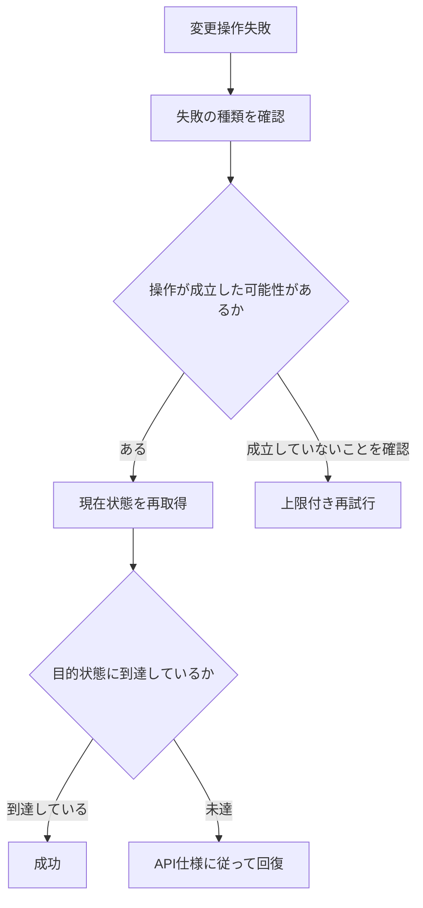

#### 名前付き資源作成時の409 Conflict回復例

API仕様上, 同名資源の存在によって`409 Conflict`が返る場合は, 対象のHelmパッケージの仕様に応じた処理を実装してください。

`409 Conflict`一般の処理規則ではありませんが, 例えば, `fleet-bootstrap`ロールでは, 既存資源を再取得して処理を継続する実装例があります。必要に応じて参照ください。

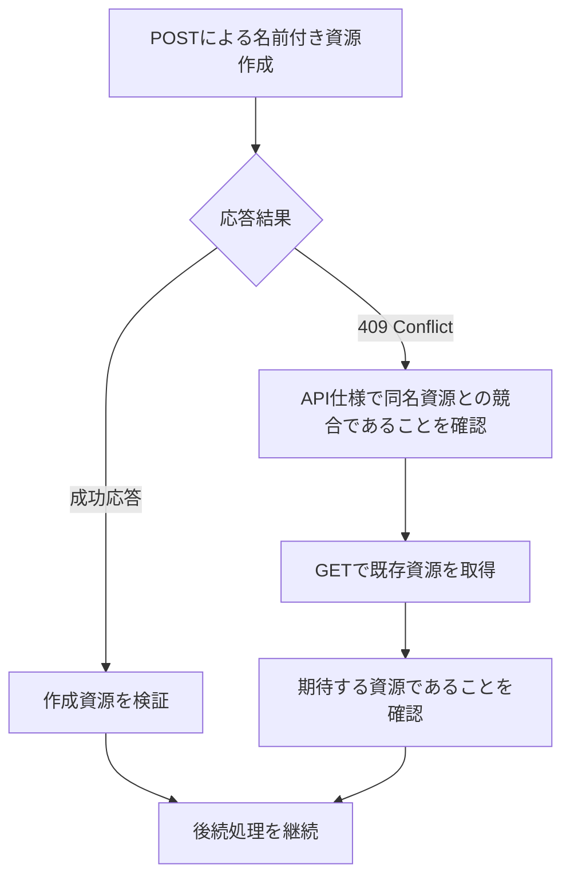

##### `fleet-bootstrap`ロールの409 Conflict具体例

`fleet-bootstrap`ロールでは, Fleet Agent Policyの作成要求で`409 Conflict`が返った場合に同じPOSTを無条件再実行せず, Agent Policy一覧をGETで再取得し, 同名Policyが1件だけ存在することとIDを取得できることを確認して後続処理へ進みます。この回復方法はFleet APIで同名資源作成が競合した場合に限定した具体例です。

```yaml
1: - name: Refresh Fleet agent policy list after create conflict
2:   ansible.builtin.uri:
3:     url: "{{ fleet_bootstrap_kibana_url }}/api/fleet/agent_policies?perPage=10000"
4:     method: GET
5:     headers:
6:       Authorization: "ApiKey {{ fleet_bootstrap_runtime_api_key }}"
7:       kbn-xsrf: "{{ fleet_bootstrap_kibana_xsrf_token }}"
8:     status_code:
9:       - 200
10:       - 400
11:       - 401
12:       - 403
13:       - 404
14:       - 429
15:       - 500
16:       - 502
17:       - 503
18:       - 504
19:     timeout: "{{ fleet_bootstrap_kibana_api_request_timeout_seconds | int }}"
20:   register: fleet_bootstrap_agent_policy_conflict_list
21:   retries: "{{ fleet_bootstrap_kibana_api_retries | int }}"
22:   delay: "{{ fleet_bootstrap_kibana_api_retry_interval_seconds | int }}"
23:   failed_when: >-
24:     fleet_bootstrap_agent_policy_conflict_list.status | default(0) | int != 200
25:   when:
26:     - fleet_bootstrap_agent_policy_create_result.status | default(0) | int == 409
27:
28: - name: Assert Fleet agent policy exists uniquely after create conflict
29:   ansible.builtin.assert:
30:     that:
31:       - >-
32:         (fleet_bootstrap_agent_policy_conflict_list.json['items'] | default([])
33:          | selectattr('name', 'equalto', fleet_bootstrap_agent_policy_profile.policy_name)
34:          | list | length) == 1
35:   when:
36:     - fleet_bootstrap_agent_policy_create_result.status | default(0) | int == 409
```

| 行番号 | 設定値 | 有効になる動作 | 設定背景(未設定時/誤設定時の問題と防止理由) |
| --- | --- | --- | --- |
| 1-4 | Agent Policy一覧GET | POST競合後のサーバ側現在状態を再取得します。 | 作成要求が別実行と競合して成立済みの可能性を確認するためです。 |
| 8-24 | 状態コード, timeout, retry | GET自体の一時障害を上限付きで再試行し, 最終的に200以外なら停止します。 | 409回復処理の途中で新たな通信障害を無制限に許容しないためです。 |
| 25-26 | POST結果が409の場合のみ | この再取得処理を作成競合時だけ実行します。 | 他の失敗理由へFleet固有409回復を誤適用しないためです。 |
| 28-34 | 同名Policyが1件であること | 回復対象を一意に決定できることを確認します。 | 同名資源が0件又は複数件の場合に誤ったPolicyを後続処理へ使用しないためです。 |
| 35-36 | 409条件 | 検証も作成競合時に限定します。 | 通常成功経路と競合回復経路を明確に分離するためです。 |

なお, Helm revision競合, 更新世代競合, 排他制御競合等を示す`409 Conflict`へこの回復方法を適用してはいけません。

## 参考資料

### 公式ドキュメント

- [Helm Documentation](https://helm.sh/docs/) - Helm, Helm Chart, Helm導入識別名の基本概念と利用方法を説明する公式文書です。
- [Helm Commands](https://helm.sh/docs/helm/) - helmコマンドと各サブコマンドの一覧を説明する公式文書です。
- [helm repo](https://helm.sh/docs/helm/helm_repo/) - Helm repositoryの追加, 一覧取得, 削除, 更新操作を説明する公式文書です。
- [helm template](https://helm.sh/docs/helm/helm_template/) - Helm ChartをKubernetesへ適用せずに事前描画する操作を説明する公式文書です。
- [helm upgrade](https://helm.sh/docs/helm/helm_upgrade/) - Helm導入識別名の導入又は更新に使用する操作を説明する公式文書です。
- [helm status](https://helm.sh/docs/helm/helm_status/) - Helm導入識別名の状態取得を説明する公式文書です。
- [helm get values](https://helm.sh/docs/helm/helm_get_values/) - Helm導入識別名へ設定されたvaluesの取得を説明する公式文書です。
- [helm history](https://helm.sh/docs/helm/helm_history/) - Helm revision履歴の取得を説明する公式文書です。
- [helm rollback](https://helm.sh/docs/helm/helm_rollback/) - 過去のHelm revisionへ戻す操作を説明する公式文書です。
- [helm uninstall](https://helm.sh/docs/helm/helm_uninstall/) - Helm導入識別名の削除を説明する公式文書です。
- [Helm Values Files](https://helm.sh/docs/chart_template_guide/values_files/) - valuesファイルと設定値の上書き関係を説明する公式文書です。
- [Helm OCI-based registries](https://helm.sh/docs/topics/registries/) - OCI形式でHelm Chartを取得する方法を説明する公式文書です。
- [Kubernetes kubeconfig](https://kubernetes.io/docs/concepts/configuration/organize-cluster-access-kubeconfig/) - `kubeconfig`の構成とKubernetes接続情報の管理方法を説明する公式文書です。
- [Kubernetes DaemonSet API](https://kubernetes.io/docs/reference/kubernetes-api/apps/daemon-set-v1/) - DaemonSetとDaemonSet状態項目を説明する公式API文書です。
- [Kubernetes Deployment API](https://kubernetes.io/docs/reference/kubernetes-api/apps/deployment-v1/) - DeploymentとDeployment状態項目を説明する公式API文書です。
- [Kubernetes StatefulSet](https://kubernetes.io/docs/concepts/workloads/controllers/statefulset/) - StatefulSetの目的と動作を説明する公式文書です。
- [Kubernetes Pod Lifecycle](https://kubernetes.io/docs/concepts/workloads/pods/pod-lifecycle/) - Podの実行状態とReady条件を説明する公式文書です。
- [Ansible include_role module](https://docs.ansible.com/ansible/latest/collections/ansible/builtin/include_role_module.html) - 呼び出し元ロールから別ロールのタスクファイルを実行する方法を説明する公式文書です。
- [Ansible include_tasks module](https://docs.ansible.com/ansible/latest/collections/ansible/builtin/include_tasks_module.html) - `helm.yml`等から個別taskファイルを読み込む方法を説明する公式文書です。
- [Ansible stat module](https://docs.ansible.com/ansible/latest/collections/ansible/builtin/stat_module.html) - `kubeconfig`のファイル状態確認に使用する機能を説明する公式文書です。
- [Ansible check mode](https://docs.ansible.com/ansible/latest/playbook_guide/playbooks_checkmode.html) - Ansible check modeの動作を説明する公式文書です。
- [GNU Coreutils timeout](https://www.gnu.org/software/coreutils/manual/html_node/timeout-invocation.html) - GNU timeoutコマンドによる外部コマンドの時間制限を説明する公式文書です。
- [RFC 9110 HTTP Semantics](https://www.rfc-editor.org/rfc/rfc9110.html) - `200`, `201`, `202`, `204`, `400`, `401`, `403`, `404`, `409`, `5xx`等のHTTP状態コードの意味を定義する標準文書です。
- [RFC 6585 Additional HTTP Status Codes](https://www.rfc-editor.org/rfc/rfc6585.html) - `429 Too Many Requests`と`Retry-After`を含む追加HTTP状態コードを定義する標準文書です。

### 関連ロール

- [roles/elastic-agent-k8s](../roles/elastic-agent-k8s) 既存Helm Chartを使用し, 導入後にKubernetes資源を検証する実装例です。
- [roles/elastic-agent-k8s-audit](../roles/elastic-agent-k8s-audit) 既存Helm Chart, Helm repository, values生成, 導入後DaemonSet検証を組み合わせる実装例です。
- [roles/k8s-whereabouts](../roles/k8s-whereabouts) OCI形式の既存Helm Chartを使用し, 導入後検証を行う実装例です。
- [roles/k8s-multus](../roles/k8s-multus)  ロール内に独自Helm Chartを保持して導入する実装例です。
- [roles/k8s-hubble-ui](../roles/k8s-hubble-ui) 既存Helm導入識別名のvaluesを取得し, 設定を変更する実装例です。
- [roles/netshoot-no-portscan](../roles/netshoot-no-portscan) 独自Helm Chartの配置, values生成, Helm処理のサブタスク化を行う実装例です。
- [roles/fleet-bootstrap](../roles/fleet-bootstrap)  HTTP APIの`409 Conflict`回復処理を実装している参考例です。
