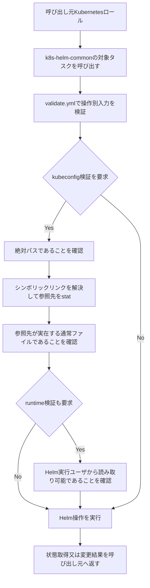

# k8s-helm-common ロール

本ロールは, Kubernetes関連ロールで使用するHelm操作を共通化するための内部共通ロールです。

## 用語

| 正式名称 | 略称 | 意味 |
| --- | --- | --- |
| ユーザ | - | 機能を利用する人, 又は識別された利用主体。 |
| ツール | - | 特定作業を実行するための機能や道具。 |
| リソース | - | 処理に必要な計算機資源やデータ。 |
| クラスタ | - | 複数の機器を連携させて一体運用する構成。 |
| ディストリビューション | - | 基本ソフトウェアと関連部品をまとめた配布形態。 |
| コンテナイメージ | - | コンテナ実行に必要な内容をまとめた保存形式。 |
| プログラム | - | 計算機に処理をさせるための命令列。 |
| コミュニティ | - | 共通目的のもとで継続的に活動する利用者集団。 |
| プラグイン | - | 既存機能へ追加機能を組み込むための拡張部品。 |
| サービスアカウント (Service Account) | - | 自動処理中でサービスを呼び出す側のプログラムを識別するための識別情報。 |
| コンテナランタイム | - | コンテナを起動, 停止, 管理する実行基盤。 |
| リクエスト | - | 処理実行や情報取得を要求する操作。 |
| コントローラ | - | 対象状態を監視し, 期待状態へ調整する制御機能。 |
| メタデータ | - | 対象データの属性や説明を示す付加情報。 |
| バックエンド | - | 利用者画面の背後で処理を実行する側。 |
| ストレージ | - | データを保存する仕組み。 |
| インストール | - | ソフトウェアを導入して利用可能にする作業。 |
| マシン | - | 処理を実行する計算機。 |
| プロビジョニング | - | 利用開始に必要な設定や資源を準備する作業。 |
| ルーティング | - | 宛先までの経路を選択して転送する処理。 |
| オブジェクト | - | ひとかたまりとして扱うデータ単位。 |
| エージェント | - | 指示に従って処理を代行する構成要素。 |
| ストア | - | データや成果物を保存する場所。 |
| ジャーナル | - | 時系列の記録を保持する仕組み。 |
| アカウント | - | 利用者や処理主体を識別する登録情報。 |
| エンドポイント | - | 通信の接続先を表す識別点。 |
| パターン | - | 繰り返し現れる構造や記述形式。 |
| パケット | - | ネットワークで転送するデータ単位。 |
| カーネル | - | 基本ソフトウェアの中核機能。 |
| シェル | - | コマンド入力で計算機を操作する仕組み。 |
| Playbook | - | 自動化処理の実行手順を記述したファイル。 |
| Canonical | - | Ubuntu を提供する組織名。 |
| Key-Value | - | キーと値の組で情報を表す方式。 |
| Internet Protocol | IP | ネットワーク上で宛先を識別し, データを届けるための通信手順。 |
| Structured Query Language | SQL | データベースを操作するための記述言語。 |
| Hypertext Transfer Protocol | HTTP | World Wide Webで情報をやり取りする通信手順。 |
| Hypertext Transfer Protocol Secure | HTTPS | 通信内容を暗号化してWorld Wide Web通信を行う方式。 |
| RPM Package Manager | RPM | RPM形式パッケージの導入, 更新, 削除, 情報参照を行う仕組み。 |
| Virtual Machine | VM | 物理計算機上で動作する仮想的な計算機。 |
| localhost | - | 同一機器自身を指す名前。 |
| root | - | Unix 系システムの最上位権限を持つ管理者識別子。 |
| ソフトウェア | - | 情報処理システムで使用するプログラム, 手順, 規則及び関連文書の全体又は一部分。 |
| システム | - | 複数の要素が連携して目的を実現する仕組み全体。 |
| アプリケーション | - | 利用者の目的を実現するために動作するソフトウェア。 |
| パッケージ | - | ソフトウェア導入に必要なファイルをまとめた配布単位。 |
| リポジトリ | - | ソフトウェアや設定情報を保管し, 取得できるようにした管理場所。 |
| コマンド | - | 実行者が計算機へ処理を指示するための命令。 |
| ホスト | - | 管理対象として識別される個別の計算機。 |
| サーバ | - | 他の機器や利用者へ機能やデータを提供する計算機, 又はその役割。 |
| ノード | - | ネットワークに接続された機器または処理単位。 |
| コンテナ | - | アプリケーションを動かす隔離された実行単位。 |
| ネットワーク | - | 機器同士を接続してデータをやり取りする仕組み。 |
| アドレス | - | 宛先や所在を識別するための情報。 |
| プロトコル | - | 通信やデータ交換の手順を定めた取り決め。 |
| ディレクトリ | - | ファイルを階層的に整理するための入れ物。 |
| ログ | - | 処理の結果や状態を時系列で記録した情報。 |
| コード | - | 処理内容を記述した文字列。 |
| Kubernetes | K8s | コンテナを管理する基盤ソフトウェア。 |
| Pod | - | Kubernetes でコンテナをまとめて管理する最小単位。 |
| Linux | - | 多くの機器で使われる, 基本ソフトウェアの系統。 |
| Debian | - | コミュニティ主導で開発される Linux ディストリビューション。 |
| Ubuntu | - | Canonical が提供する Debian 系の Linux ディストリビューション。 |
| Docker | - | コンテナイメージやコンテナの作成, 実行, 管理を行うコマンド。 |
| Ansible | - | 設定の同一化や導入作業を所定の手順に従って自動化する仕組み。 |
| World Wide Web | WWW | ネットワーク上で文書や情報を相互参照できる仕組み。 |
| Service | - | サービスの英語表記。 |
| Node | - | ノードの英語表記。 |
| Makefile | - | 実行手順を定義したファイル。 |
| Application Programming Interface | API | アプリケーション同士が機能やデータをやり取りするための取り決め。 |
| Uniform Resource Locator | URL | World Wide Web上の資源の場所を示す文字列。 |
| Host Variables | host_vars | ホスト単位の設定値を格納する変数定義。 |
| Ansible Inventory | inventory | 実行対象ホストの一覧と接続情報を管理する定義。 |
| Ansible Task | task | 自動化処理の最小単位となる実行項目。 |
| ansible-playbookコマンド | - | Ansible Playbook を実行して自動構成処理を適用するコマンド。 |
| 制御ホスト | - | Playbook を実行し, 他ホストへの処理指示を行う管理用ホスト。 |
| 対象ホスト | - | Playbook による設定変更や導入処理の適用先となるホスト。 |
| Helm | - | Kubernetes向けパッケージを導入, 更新, 削除するコマンド。 |
| Helm Chart | - | Helmで導入するKubernetesリソース定義のまとまり。 |
| Helm導入識別名 ( Helm release ) | - | Helm が管理する導入単位を識別する名前。 |
| `kubeconfig` | - | Kubernetes 接続設定ファイルを指す名称。kubectl などが参照する。 |
| シンボリックリンク | - | 別のファイル又はディレクトリを参照するために作成する特殊なファイル。 |
| helmコマンド | helm | Kubernetes向けパッケージの導入, 更新, 状態確認を実施するコマンド。 |
| Secure Shell | SSH | 遠隔の計算機へ安全に接続して操作する方式。 |

## 概要

`k8s-helm-common`ロールは, Kubernetes関連ロールから共通利用するHelm操作を集約するための内部共通ロールです。repository設定, Chart描画, release導入・更新, release状態確認, values取得, history取得, rollback, uninstall, release完了待機, 共通入力検証をタスクファイル単位で提供します。

本ロールは利用者が単独でHelm releaseを操作するための手順書を提供することを主目的としません。各Kubernetes関連ロールが同じ入力検証, timeout, 再試行, Helm実行ユーザ, kubeconfig取扱いを共有することで, ロールごとの実装差異を減らします。

## 前提条件

- 呼び出し元ロールが必要な共通変数を設定していること。
- `k8s_runtime_helm_operator_user`又は操作ごとの検証対象ユーザから`helm`と`timeout`を実行可能であること。
- kubeconfigを使用する操作では, `k8s_helm_kubeconfig_path`が絶対パスであること。
- kubeconfigは通常ファイル, 又は通常ファイルを参照するシンボリックリンクであること。
- runtime検証とkubeconfig検証を同時に要求する場合は, Helm実行ユーザからkubeconfigを読み取り可能であること。

## 実行方法

本ロールの`tasks/main.yml`はロールテンプレート共通処理を読み込みます。実際のHelm共通機能は, 呼び出し元ロールが`ansible.builtin.include_role`の`tasks_from`又は`ansible.builtin.include_tasks`で必要なタスクファイルを指定して利用します。

主なタスクファイルは次の通りです。

| タスクファイル | 提供する機能 |
| --- | --- |
| `validate.yml` | 呼び出し元が要求した入力項目だけを共通規則で検証します。 |
| `repository.yml` | OSユーザごとのHelm repositoryを指定状態へ設定します。 |
| `clear-repositories.yml` | 対象Helm repositoryをOSユーザごとに削除し, 削除結果を確認します。 |
| `build-values-argv.yml` | valuesファイル一覧からHelm CLIへ渡す`-f`引数列を入力順に生成します。 |
| `template.yml` | `helm template`を実行してChartを描画します。 |
| `upgrade.yml` | `helm upgrade --install`を実行します。 |
| `status.yml` | releaseの存在, 状態, revisionを取得します。 |
| `get-values.yml` | releaseのvaluesをYAML形式で取得します。 |
| `history.yml` | release履歴を取得します。 |
| `rollback.yml` | 明示指定したrevisionへreleaseを戻します。 |
| `uninstall.yml` | releaseを削除します。 |
| `wait-release.yml` | releaseが`deployed`状態になるまで待機します。 |

## 主要変数

本ロールには操作ごとに呼び出し元が指定するruntime変数があります。代表的な変数を次に示します。

| 変数名 | 意味 | 既定値 | 設定例 |
| --- | --- | --- | --- |
| `k8s_helm_get_values_all` | `helm get values`でChart既定値を含むcomputed valuesを取得する場合に`true`を指定します。 | `false` | `false` |
| `k8s_helm_wait` | `helm upgrade --install`でKubernetes資源のreadinessを待機する場合に`true`を指定します。 | `true` | `true` |
| `k8s_helm_release_name` | 操作対象のHelm release名を指定します。 | 呼び出し元で指定 | `"cilium"` |
| `k8s_helm_namespace` | 操作対象のKubernetes namespaceを指定します。 | 呼び出し元で指定 | `"kube-system"` |
| `k8s_helm_chart_ref` | repository Chart, OCI Chart又はローカルChartの参照先を指定します。 | 呼び出し元で指定 | `"cilium/cilium"` |
| `k8s_helm_chart_version` | Chart版数を必要に応じて指定します。 | 呼び出し元で指定 | `"1.18.9"` |
| `k8s_helm_kubeconfig_path` | HelmがKubernetes APIへ接続するために使用するkubeconfigの絶対パスを指定します。 | 呼び出し元で指定 | `"/home/ansible/.kube/config"` |
| `k8s_helm_values_files` | Helmへ入力するvaluesファイルを上書き順に指定します。 | 呼び出し元で指定 | `["/tmp/values.yaml"]` |
| `k8s_helm_operation_timeout_seconds` | Helm外部コマンド1回の時間上限を秒単位で指定します。 | 呼び出し元で指定 | `600` |
| `k8s_helm_operation_retries` | 再実行可能な操作の最大試行回数を指定します。 | 呼び出し元で指定 | `3` |
| `k8s_helm_operation_retry_interval_seconds` | 操作失敗後の再試行間隔を秒単位で指定します。 | 呼び出し元で指定 | `10` |
| `k8s_helm_operation_request_interval_seconds` | 状態確認などの要求間隔を秒単位で指定します。 | 呼び出し元で指定 | `5` |

## テンプレートと生成ファイル

本ロール自身は固定の設定ファイルを生成しません。`template.yml`, `upgrade.yml`などが参照するvaluesファイルは呼び出し元ロールが生成し, 本ロールへパスを渡します。

## 実行フロー

共通Helm操作は, 操作開始前に`validate.yml`で必要な入力だけを検証し, 検証済み入力を使用してHelm CLIを実行する構造です。



### kubeconfig検証仕様

`k8s_helm_kubeconfig_path`は通常ファイルに限定しません。`ansible.builtin.stat`で`follow: true`を指定し, シンボリックリンクの場合は参照先を解決してから`exists`と`isreg`を確認します。

このため, 次の状態を受け入れます。

- `/etc/kubernetes/admin.conf`のような通常ファイル。
- `/home/ansible/.kube/config -> merged-kubeconfig.conf`のように, 実在する通常ファイルを参照するシンボリックリンク。

次の状態は拒否します。

- 参照先が存在しないシンボリックリンク。
- ディレクトリを参照するシンボリックリンク。
- ディレクトリそのもの。

runtime検証も指定されている場合は, 上記のファイル種別確認に加え, 実際にHelmを実行するOSユーザから`test -r`でkubeconfigを読み取り可能であることを確認します。

## 検証ポイント

### 検証の前提条件

検証を始める前に, 次の条件が満たされていることを確認します。

- Helm実行ユーザが存在すること。
- Helm実行ユーザから`helm`と`timeout`を実行可能であること。
- kubeconfig検証では, 通常ファイル又は通常ファイルを参照するシンボリックリンクを用意できること。

### 検証環境の設定

本節では, 検証用の設定内容について説明します。

本ロールは呼び出し元ロールからruntime変数を受け取る共通機能であるため, 単独の検証用`host_vars`は定義しません。実際に本ロールを使用するKubernetes関連ロールの検証設定を使用します。

### 検証コマンドと期待結果

#### 1. kubeconfigシンボリックリンクの確認

**実施対象ホスト**: Helm実行対象ホスト

**実行するコマンド**:

```bash
readlink -f /home/ansible/.kube/config
test -f /home/ansible/.kube/config
sudo -u ansible test -r /home/ansible/.kube/config
```

**期待される出力**:

```text
/home/ansible/.kube/merged-kubeconfig.conf
```

`test`コマンドは両方とも終了状態0となります。

**実行結果の例**:

```bash
$ readlink -f /home/ansible/.kube/config
/home/ansible/.kube/merged-kubeconfig.conf
```

**確認ポイント**:

- `readlink -f`が実在するkubeconfigを表示することで, シンボリックリンクの参照先が解決可能であることを確認します。
- `test -f`が終了状態0となることで, 参照先が通常ファイルとして利用可能であることを確認します。
- Helm実行ユーザで`test -r`が終了状態0となることで, 実際のHelm実行経路からkubeconfigを読み取り可能であることを確認します。

## トラブルシューティング

### 1. Helm kubeconfig file does not exist or is not a regular fileで停止する場合

**実施対象ホスト**: Helm実行対象ホスト

**実行するコマンド**:

```bash
ls -l /home/ansible/.kube/config
readlink -f /home/ansible/.kube/config
test -f /home/ansible/.kube/config
```

**確認ポイント**:

- 通常ファイルの場合は`test -f`が終了状態0となることを確認します。
- シンボリックリンクの場合は`readlink -f`が実在する通常ファイルを表示し, `test -f`が終了状態0となることを確認します。
- 参照先が存在しない場合はkubeconfig生成側の処理を確認します。

### 2. Helm runtime user cannot read kubeconfigで停止する場合

**実施対象ホスト**: Helm実行対象ホスト

**実行するコマンド**:

```bash
sudo -u ansible test -r /home/ansible/.kube/config
namei -l /home/ansible/.kube/config
```

**確認ポイント**:

- Helm実行ユーザにkubeconfig参照先と親ディレクトリの読み取り, 通過権限があることを確認します。

## 注意事項

- kubeconfigの検証ではシンボリックリンク自体を無条件に許容せず, 参照先が実在する通常ファイルであることを要求します。
- Helm実行ユーザからのreadabilityはファイル種別とは別に検証します。
- `rollback.yml`は成否不明状態での重複revision作成を避けるため自動再試行しません。その他の操作は各タスクの再実行安全性に応じて再試行条件を定義します。
- repository操作はOSユーザごとのHelm設定へ保存されるため, 対象ユーザごとに処理します。

## 参考資料

### 公式ドキュメント

- [Helm Documentation](https://helm.sh/docs/)
- [Helm Commands](https://helm.sh/docs/helm/)
- [Kubernetes kubeconfig](https://kubernetes.io/docs/concepts/configuration/organize-cluster-access-kubeconfig/)
- [Ansible stat module](https://docs.ansible.com/ansible/latest/collections/ansible/builtin/stat_module.html)
- [Ansible include_role module](https://docs.ansible.com/ansible/latest/collections/ansible/builtin/include_role_module.html)
