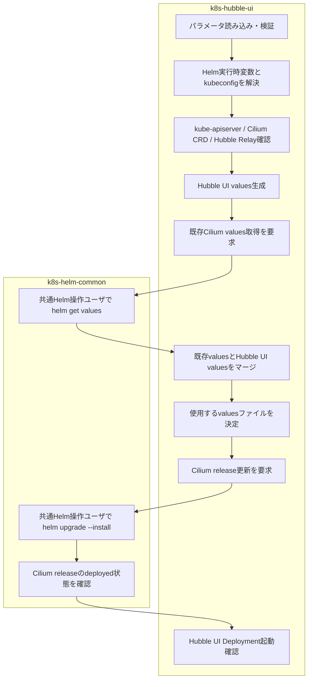

# k8s-hubble-ui ロール

本ロールは, Cilium Hubble UI を Kubernetes クラスタへ導入するロールです。

## 目次

- [k8s-hubble-ui ロール](#k8s-hubble-ui-ロール)
  - [目次](#目次)
  - [用語](#用語)
  - [概要](#概要)
  - [前提条件](#前提条件)
  - [実行方法](#実行方法)
  - [主要変数](#主要変数)
    - [API 待ち合わせ設定](#api-待ち合わせ設定)
    - [Hubble UI 設定](#hubble-ui-設定)
    - [マージ・ネットワーク・Ingress 設定](#マージネットワークingress-設定)
    - [設定例](#設定例)
      - [基本設定 (NodePort)](#基本設定-nodeport)
      - [LoadBalancer を使用する場合](#loadbalancer-を使用する場合)
      - [マージを無効化する場合 (非推奨)](#マージを無効化する場合-非推奨)
      - [特定のバージョンを指定する場合](#特定のバージョンを指定する場合)
  - [アクセス方法](#アクセス方法)
    - [NodePort 経由でのアクセス (既定)](#nodeport-経由でのアクセス-既定)
    - [LoadBalancer 経由でのアクセス](#loadbalancer-経由でのアクセス)
    - [ClusterIP 経由でのアクセス](#clusterip-経由でのアクセス)
  - [テンプレートと生成ファイル](#テンプレートと生成ファイル)
  - [実行フロー](#実行フロー)
  - [検証ポイント](#検証ポイント)
    - [1. Hubble UI Deployment の起動状態確認](#1-hubble-ui-deployment-の起動状態確認)
    - [2. Hubble UI Pod の稼働確認](#2-hubble-ui-pod-の稼働確認)
    - [3. Hubble UI Service の設定確認](#3-hubble-ui-service-の設定確認)
    - [4. Hubble UI Web インターフェースアクセス確認](#4-hubble-ui-web-インターフェースアクセス確認)
    - [5. Helm values の構成確認](#5-helm-values-の構成確認)
  - [トラブルシューティング](#トラブルシューティング)
    - [Hubble UI Pod が起動しない](#hubble-ui-pod-が起動しない)
    - [Web UI にアクセスできない](#web-ui-にアクセスできない)
    - [Helm upgrade が失敗する](#helm-upgrade-が失敗する)
  - [注意事項](#注意事項)
    - [Cilium Pod の再起動について](#cilium-pod-の再起動について)
    - [Helm values ファイルの永続化](#helm-values-ファイルの永続化)
    - [マージ機能について](#マージ機能について)
    - [Helm upgrade と既存設定の保持について](#helm-upgrade-と既存設定の保持について)
      - [対策方法](#対策方法)
      - [Hubble Relay 設定について](#hubble-relay-設定について)
    - [Hubble Relay の依存関係](#hubble-relay-の依存関係)
  - [参考資料](#参考資料)
    - [公式ドキュメント](#公式ドキュメント)


## 用語

| 正式名称 | 略称 | 意味 |
| --- | --- | --- |
| ユーザ | - | 機能を利用する人, 又は識別された利用主体。 |
| ツール | - | 特定作業を実行するための機能や道具。 |
| リソース | - | 処理に必要な計算機資源やデータ。 |
| クラスタ | - | 複数の機器を連携させて一体運用する構成。 |
| ディストリビューション | - | 基本ソフトウェアと関連部品をまとめた配布形態。 |
| コンテナイメージ | - | コンテナ実行に必要な内容をまとめた保存形式。 |
| プログラム | - | 計算機に処理をさせるための命令列。 |
| コミュニティ | - | 共通目的のもとで継続的に活動する利用者集団。 |
| プラグイン | - | 既存機能へ追加機能を組み込むための拡張部品。 |
| サービスアカウント (Service Account) | - | 自動処理中でサービスを呼び出す側のプログラムを識別するための識別情報。 Kubernetesでは, 人間以外の実体をKubernetesクラスタ内で一意に識別するために用いられるアカウントのことを指す。 アプリケーションPod, システムコンポーネント, および, Kubernetesクラスター内外の実体に紐づけられたServiceAccountの認証情報を通して, これらの実体を互いに識別する。 |
| コンテナランタイム | - | コンテナを起動, 停止, 管理する実行基盤。 |
| リクエスト | - | 処理実行や情報取得を要求する操作。 |
| コントローラ | - | 対象状態を監視し, 期待状態へ調整する制御機能。 |
| メタデータ | - | 対象データの属性や説明を示す付加情報。 |
| バックエンド | - | 利用者画面の背後で処理を実行する側。 |
| ストレージ | - | データを保存する仕組み。 |
| インストール | - | ソフトウェアを導入して利用可能にする作業。 |
| マシン | - | 処理を実行する計算機。 |
| プロビジョニング | - | 利用開始に必要な設定や資源を準備する作業。 |
| ルーティング | - | 宛先までの経路を選択して転送する処理。 |
| オブジェクト | - | ひとかたまりとして扱うデータ単位。 |
| エージェント | - | 指示に従って処理を代行する構成要素。 |
| ストア | - | データや成果物を保存する場所。 |
| ジャーナル | - | 時系列の記録を保持する仕組み。 |
| アカウント | - | 利用者や処理主体を識別する登録情報。 |
| エンドポイント | - | 通信の接続先を表す識別点。 |
| パターン | - | 繰り返し現れる構造や記述形式。 |
| パケット | - | ネットワークで転送するデータ単位。 |
| カーネル | - | 基本ソフトウェアの中核機能。 |
| シェル | - | コマンド入力で計算機を操作する仕組み。 |
| Playbook | - | 自動化処理の実行手順を記述したファイル。 |
| Canonical | - | Ubuntu を提供する組織名。 |
| Key-Value | - | キーと値の組で情報を表す方式。 |
| Internet Protocol | IP | ネットワーク上で宛先を識別し, データを届けるための通信手順。 |
| Structured Query Language | SQL | データベースを操作するための記述言語。 |
| Hypertext Transfer Protocol | HTTP | World Wide Webで情報をやり取りする通信手順。 |
| Hypertext Transfer Protocol Secure | HTTPS | 通信内容を暗号化してWorld Wide Web通信を行う方式。 |
| RPM Package Manager | RPM | RPM形式パッケージの導入, 更新, 削除, 情報参照を行う仕組み。 |
| Virtual Machine | VM | 物理計算機上で動作する仮想的な計算機。 |
| localhost | - | 同一機器自身を指す名前。 |
| root | - | Unix 系システムの最上位権限を持つ管理者識別子。 |
| ソフトウェア | - | 情報処理システムで使用するプログラム, 手順, 規則及び関連文書の全体又は一部分。 |
| システム | - | 複数の要素が連携して目的を実現する仕組み全体。 |
| アプリケーション | - | 利用者の目的を実現するために動作するソフトウェア。 |
| パッケージ | - | ソフトウェア導入に必要なファイルをまとめた配布単位。 |
| リポジトリ | - | ソフトウェアや設定情報を保管し, 取得できるようにした管理場所。 |
| コマンド | - | 実行者が計算機へ処理を指示するための命令。 |
| ホスト | - | 管理対象として識別される個別の計算機。 |
| サーバ | - | 他の機器や利用者へ機能やデータを提供する計算機, 又はその役割。 |
| コンテナ | - | アプリケーションを動かす隔離された実行単位。 |
| ネットワーク | - | 機器同士を接続してデータをやり取りする仕組み。 |
| プロトコル | - | 通信やデータ交換の手順を定めた取り決め。 |
| ディレクトリ | - | ファイルを階層的に整理するための入れ物。 |
| ログ | - | 処理の結果や状態を時系列で記録した情報。 |
| コード | - | 処理内容を記述した文字列。 |
| Kubernetes | K8s | コンテナを管理する基盤ソフトウェア。 |
| Pod | - | Kubernetes でコンテナをまとめて管理する最小単位。 |
| Linux | - | 多くの機器で使われる, 基本ソフトウェアの系統。 |
| Debian | - | コミュニティ主導で開発される Linux ディストリビューション。 |
| Ubuntu | - | Canonical が提供する Debian 系の Linux ディストリビューション。 |
| Docker | - | コンテナイメージやコンテナの作成, 実行, 管理を行うコマンド。 |
| Ansible | - | 設定の同一化や導入作業を所定の手順に従って自動化する仕組み。 |
| World Wide Web | WWW | ネットワーク上で文書や情報を相互参照できる仕組み。 |
| Service | - | サービスの英語表記。 |
| Node | - | ノードの英語表記。 |
| Makefile | - | 実行手順を定義したファイル。 |
| Application Programming Interface | API | アプリケーション同士が機能やデータをやり取りするための取り決め。 |
| Uniform Resource Locator | URL | World Wide Web上の資源の場所を示す文字列。 |
| Application Programming Interface | API | アプリケーション同士が機能やデータをやり取りするための取り決め。 |
| Custom Resource Definition | CRD | Kubernetes APIを拡張してユーザ独自のリソース種別を定義する仕組み。 |
| Role-Based Access Control | RBAC | ユーザやサービスアカウントが実行可能な操作を役割(Role)で制限する仕組み。 |
| Service Account | - | Kubernetes内部でPodが他のリソースにアクセスする際に用いる仮想的なアカウント。 |
| ClusterRole | - | Kubernetesクラスタ全体に適用される権限の集合。 |
| ClusterRoleBinding | - | ClusterRoleをユーザやサービスアカウントに紐付ける仕組み。 |
| Role | - | 特定の名前空間内で有効な権限の集合。 |
| RoleBinding | - | Roleをユーザやサービスアカウントに紐付ける仕組み。 |
| 名前空間 ( namespace ) | - | Kubernetes内部でリソースを論理的に分離する単位。 |
| ポッド ( Pod ) | - | Kubernetes上で動作するコンテナの最小単位。 |
| レプリカ ( Replica ) | - | ポッド ( Pod ) の複製。デプロイメント ( Deployment ) などのリソースが高可用性や負荷分散のために複数のレプリカを作成, 管理します。指定されたレプリカ数に基づいて同一の仕様を持つポッドが複数実行される。 |
| デーモンセット ( DaemonSet ) | - | Kubernetesクラスタ内の全ノード(または指定した一部のノード)で必ずPodを1つずつ起動させるリソース。 |
| デプロイ ( Deploy ) | - | 機能や設定を実行環境へ展開し, 利用可能な状態にする作業。 |
| デプロイメント ( Deployment ) | - | 指定した数のPodを維持し, ローリングアップデート等を管理するリソース。 |
| StatefulSet | - | 状態を持つアプリケーションのPodを順序付けて管理するリソース。 |
| サービス ( Service ) | - | Podへのアクセスを抽象化し, 負荷分散やサービスディスカバリを提供するリソース。 |
| Ingress | - | Kubernetesクラスタ外部からHTTP/HTTPS通信を受け付け, 内部のServiceへルーティングする仕組み。 |
| コンフィグマップ ( ConfigMap ) | - | 設定情報を保持し, Podへ環境変数やファイルとして注入するリソース。 |
| シークレット ( Secret ) | - | 機密情報を保持し, Podへ安全に注入するリソース。 |
| PersistentVolume | PV | Kubernetesクラスタ内で利用可能なストレージリソースを表すオブジェクト。 |
| PersistentVolumeClaim | PVC | ユーザがPVを要求する際に利用するリソース。 |
| StorageClass | - | 動的にPVをプロビジョニングする際のストレージ種別を定義するリソース。 |
| Kubernetes ノード ( Kubernetes Node ) | - | Kubernetesクラスタを構成する物理マシンまたは仮想マシン。 |
| コントロールプレーンノード ( Control Plane Node ) | - | Kubernetesクラスタ全体を管理, 制御する中枢ノード群。kube-apiserver, kube-controller-manager, kube-schedulerなどが動作します。 |
| ワーカノード ( Worker Node ) | - | 実際にアプリケーションのPodを実行するノード。 |
| kube-apiserver | - | KubernetesのAPIリクエストを受け付け, etcdへの読み書きを仲介するコンポーネント。 |
| kube-controller-manager | - | Deployment, ReplicaSetなど各種コントローラを実行し, Kubernetesクラスタの状態を監視, 調整するコンポーネント。 |
| kube-scheduler | - | 新規作成されたPodを適切なNodeへ配置するコンポーネント。 |
| kubelet | - | 各Node上で動作し, Podの起動, 停止, 監視を行うエージェント。 |
| kube-proxy | - | 各Node上でServiceのネットワークルールを管理するコンポーネント。 |
| etcd | - | KubernetesのKubernetesクラスタ状態を保存する分散Key-Valueストア。 |
| Container Network Interface | CNI | コンテナ間のネットワーク接続を標準化するプラグイン仕様。 |
| Cilium | - | eBPFを活用した高性能なCNIプラグイン。ネットワークポリシーやサービスメッシュ機能を提供します。 |
| Extended Berkeley Packet Filter | eBPF | Linux カーネル内で安全にプログラムを実行する仕組み。高性能なパケット処理や観測機能の実装に利用される。 |
| Serviceエンドポイント ( Service Endpoint ) | - | Serviceのバックエンドとして通信を受けるPod, または, 当該の通信を受けるPodに加え, 当該の通信を受けるPodへ通信を届けるためのネットワーク上の転送先情報全体を指す。 |
| Serviceエンドポイント情報 ( Service Endpoint Information ) | - | Serviceエンドポイントを特定して転送先を決めるための情報。主にバックエンドPodのIPアドレス, ポート番号, プロトコル, 所属クラスタ名(またはクラスタ識別子)で構成される。 |
| Multus | - | 複数のCNIプラグインを同時に使用できるようにするメタCNIプラグイン。 |
| Container Runtime Interface | CRI | Kubernetesがコンテナランタイムと通信するための標準インターフェース。 |
| containerd | - | Dockerから分離された軽量なコンテナランタイム。 |
| kubeadm | - | Kubernetesクラスタの初期構築と管理を支援する公式ツール。 |
| kubectl | - | Kubernetesクラスタを操作するためのコマンドラインツール。 |
| Helm | - | Kubernetesアプリケーションのパッケージ管理ツール。Chart形式でアプリケーションを配布, インストールします。 |
| Chart | - | Helmで管理されるアプリケーションパッケージの単位。Kubernetes Manifestのテンプレート集。 |
| Operator | - | アプリケーション固有の運用知識をコードで自動化するKubernetesの拡張パターン。 |
| Custom Resource | CR | CRDで定義されたユーザ独自のリソースの実体。 |
| Admission Controller | - | APIリクエストがetcdに保存される前に検証, 変更を行うプラグイン。 |
| Network Policy | - | Pod間の通信を制御するファイアウォールルールを定義するリソース。 |
| Label | - | リソースに付与するKey-Value形式のメタデータ。リソースの分類, 検索に利用される。 |
| Selector | - | Labelを利用してリソースを選択する条件式。 |
| Annotation | - | リソースに付与するKey-Value形式の補足情報。ツールやコントローラが参照するメタデータ。 |
| Taint | - | Kubernetes ノードに設定する特殊なマークで, 特定の条件を満たさないPodの配置を拒否します。 |
| Toleration | - | PodがTaintを持つNodeへ配置されることを許可する設定。 |
| Border Gateway Protocol | BGP | 自律システム間で経路情報を交換する経路制御方式。 |
| HyperText Markup Language | HTML | Web ページの構造を記述するための形式。 |
| Hypertext Transfer Protocol | HTTP | World Wide Webで情報をやり取りする通信手順。 |
| Internet Protocol | IP | ネットワーク上で宛先を識別し, データを届けるための通信手順。 |
| Operating System | OS | 計算機の基本機能を管理し, アプリケーションを動作させる基盤ソフトウェア。 |
| User Interface | UI | 利用者がソフトウェアを操作するための見た目と操作方法。 |
| Uniform Resource Locator | URL | World Wide Web上の資源の場所を示す文字列。 |
| Ansible Task | task | 自動化処理の最小単位となる実行項目。 |
| ansible-playbookコマンド | - | Ansible Playbook を実行して自動構成処理を適用するコマンド。 |
| `curl` | - | URL を指定してデータ送受信を行うコマンド。 |
| `helm` | - | Kubernetesアプリケーションのパッケージ管理ツール。Chart形式でアプリケーションを配布, インストールします。 |
| `yq` | - | YAML を抽出, 変換, 更新するコマンド。 |
| アドレス | - | 宛先や所在を識別するための情報。 |
| サービス | - | 機能を利用者や他システムへ提供する仕組み。 |
| ノード | - | ネットワークに接続された機器または処理単位。 |
| ポート | - | 通信の出入口を識別する番号または接点。 |
| 制御ホスト | - | Playbook を実行し, 他ホストへの処理指示を行う管理用ホスト。 |

## 概要

Cilium Hubble UI を Kubernetes クラスタへ導入するロールです。

主な機能:
- **Helm チャート統合**: `k8s-helm-common` を介して既存の Cilium Helm リリースを `helm upgrade --install` で更新し, `hubble.ui.enabled: true` を追加設定します。
- **既存設定保護 (マージ機能)**: デフォルトで有効な `yq` ベースのマージ機能により, 既存 Cilium 設定を完全に保護しながら Hubble UI 設定を追加できます。
- **CRD 確認と待ち合わせ**: デプロイ前に Cilium CRD の存在確認と kube-apiserver の起動待ち合わせを自動実行します。
- **Service 公開方法の選択**: NodePort/LoadBalancer/ClusterIP を変数で切り替え, 運用環境に応じたアクセス方法を提供します。
- **Hubble Relay 依存性確認**: Hubble UI 動作に必須の Hubble Relay 有効化を事前確認し, 問題を早期に検出します。
- **Deployment 起動確認**: Helm upgrade 後, Hubble UI Deploymentの指定レプリカ数, generation, 更新済みレプリカ数, Readyレプリカ数, Availableレプリカ数をKubernetes APIから取得し, すべての条件を満たすまで上限付きで再試行します。

## 前提条件

- Kubernetes クラスタの全ノード（コントロールプレーンノードとワーカーノード）が稼働し, Cilium によるクラスタ内ネットワークが正常に構成されていること - Hubble UI はクラスタ内のネットワークトラフィックを観測するため, Kubernetes ノードの稼働と Cilium CNI による通信確立が必須です
- Cilium が Helm 経由でインストール済みであること (`k8s-ctrlplane` ロール実行済み)
- Hubble Relay が有効化されていること - Hubble UI は Hubble Relay に依存します (`hubble.relay.enabled: true` を確認)
- `kubectl` コマンドが利用可能であること (Kubernetes リソース操作用)
- Cilium 初期導入時と同じ共通 Helm 操作ユーザ (`k8s_runtime_helm_operator_user`) が利用可能であること
- 共通 Helm 操作ユーザのホームディレクトリへ `k8s-kubeconfig` ロールが `~/.kube/ca-embedded-admin.conf` を配布済みであること
- 共通 Helm 操作ユーザから `helm` コマンドを利用可能であること (Cilium Helm リリース管理用)
- `yq` コマンドが利用可能であること - マージ機能使用時に必須 (既存設定保護)
- Ansible 実行ホストから kube-apiserver へのネットワークアクセスが可能であること

## 実行方法

制御ホストで以下のコマンドを実行します。

```bash
make run_k8s_hubble_ui
```

本 Make ターゲットは `site.yml` を `k8s-hubble-ui` タグで実行します。Helm 操作は本ロールから `k8s-helm-common` へ委譲し, Cilium 初期導入時と同じ共通 Helm 操作ユーザを使用します。

## 主要変数

本ロールで扱う主な変数と用途を示します。変数は `host_vars`, または `vars/all-config.yml` で上書きできます。

### API 待ち合わせ設定

Kubernetes API Server の待ち合わせ条件は [k8s-common ロール](../k8s-common/Readme.md) の共通内部設定を使用します。

### Hubble UI 設定

| 変数名 | 既定値 | 説明 |
| ------ | ------ | ---- |
| `k8s_hubble_ui_config_dir` | `"/home/ansible/kubeadm/hubble-ui"` | Hubble UI 設定ファイル格納ディレクトリ。Helm values ファイル等を保存。 |
| `k8s_hubble_ui_enabled` | `false` | Hubble UI の有効化可否 (true/false)。`true` でインストール。 |
| `hubble_ui_version` | `"1.18.9"` | Hubble UI バージョン。未指定時は Cilium バージョン (`k8s_cilium_version`) と同じ値を使用します。 |
| `hubble_ui_service_type` | `"NodePort"` | Service 公開方法 (NodePort/LoadBalancer/ClusterIP)。 |
| `hubble_ui_nodeport` | `31234` | NodePort 使用時のポート番号。 |
| `hubble_ui_replicas` | `1` | Hubble UI Deployment レプリカ数。 |
| `k8s_hubble_ui_verify_request_timeout_seconds` | `10` | Hubble UI Deployment状態確認のKubernetes API要求1回のtimeout秒数。 |
| `k8s_hubble_ui_verify_retry_interval_seconds` | `5` | Hubble UI Deployment状態確認の再試行間隔秒数。 |
| `k8s_hubble_ui_verify_retries` | `60` | Hubble UI Deployment状態確認の最大再試行回数。 |

### マージ・ネットワーク・Ingress 設定

| 変数名 | 既定値 | 説明 |
| ------ | ------ | ---- |
| `hubble_ui_merge_existing_values` | `true` | 既存 Cilium Helm values とのマージ可否。**既存設定保護のため, デフォルト有効**。 |
| `hubble_ui_service_ipFamilyPolicy` | `"PreferDualStack"` | Service IP ファミリーポリシー (IPv4 優先/IPv6 優先/デュアル)。 |

### 設定例

#### 基本設定 (NodePort)

`vars/all-config.yml` または `host_vars/<hostname>` で以下のように設定します:

```yaml
k8s_hubble_ui_enabled: true
hubble_ui_service_type: "NodePort"
hubble_ui_nodeport: 31234
hubble_ui_replicas: 1
```

この設定で, Hubble UI が NodePort 経由で公開されます。以下は自動設定されるため, 省略可能です:

- `hubble_ui_version`: デフォルトで `k8s_cilium_version` の値を使用
- `hubble_ui_merge_existing_values`: デフォルトで `true`（既存の Cilium 設定を自動保護）

#### LoadBalancer を使用する場合

クラウドプロバイダまたはオンプレミス環境で LoadBalancer サポートがある場合, 以下のように設定します:

```yaml
k8s_hubble_ui_enabled: true
hubble_ui_service_type: "LoadBalancer"
hubble_ui_replicas: 2
```

この場合, Kubernetes クラスタの外部から `EXTERNAL-IP` でアクセス可能になります。LoadBalancer の IP が割り当てられるまで数分待機する場合があります。`kubectl get svc -n kube-system hubble-ui` で `EXTERNAL-IP` を確認してください。

#### マージを無効化する場合 (非推奨)

マージ機能を意図的に無効化する場合は, 以下のように設定します。ただし, この設定は推奨しない:

```yaml
k8s_hubble_ui_enabled: true
hubble_ui_service_type: "NodePort"
hubble_ui_nodeport: 31234
hubble_ui_merge_existing_values: false
```

**注意 - マージを無効化すると, 既存の Cilium 設定が失われます**

マージを無効化すると, 既存の Cilium 設定 (ipam, routing, bgp, kube-proxy置換など) が Helm Chart のデフォルト値に戻ります。その結果, Kubernetesクラスタのネットワーク機能が正常に動作しなくなる可能性があります。特別な理由がない限り, デフォルトのマージ有効状態 (`hubble_ui_merge_existing_values: true`) を維持してください。

#### 特定のバージョンを指定する場合

Hubble UI のバージョンを `k8s_cilium_version` と異なる値で指定する場合:

```yaml
k8s_hubble_ui_enabled: true
hubble_ui_version: "1.16.0"
hubble_ui_service_type: "NodePort"
hubble_ui_nodeport: 31234
```

`hubble_ui_version` を明示的に指定することで, Helm Chart のバージョンを制御できます。通常は `k8s_cilium_version` と同じ値を使用してください。バージョン不一致の場合, Cilium と Hubble UI 間で互換性の問題が生じる可能性があります。

## アクセス方法

### NodePort 経由でのアクセス (既定)

`hubble_ui_service_type: "NodePort"` の場合, 以下の URL でアクセスできます:

```text
http://<node-ip>:31234
```

- `<node-ip>`: Kubernetesクラスタ内の任意のKubernetes ノードの IP アドレス
- ポート番号は `hubble_ui_nodeport` 変数で変更可能である

ブラウザで上記 URL にアクセスすると, Hubble UI のダッシュボードが表示されます。

### LoadBalancer 経由でのアクセス

`hubble_ui_service_type: "LoadBalancer"` に設定した場合, クラウドプロバイダまたはオンプレミス LoadBalancer (MetalLB など) が External IP を割り当てます。

```bash
kubectl --kubeconfig /etc/kubernetes/admin.conf get svc -n kube-system hubble-ui
```

上記コマンドで `EXTERNAL-IP` を確認し, `http://<external-ip>` でアクセスします。

### ClusterIP 経由でのアクセス

`hubble_ui_service_type: "ClusterIP"` に設定した場合, Kubernetesクラスタ内部からのみアクセス可能です。Kubernetesクラスタ外部からアクセスする場合は `kubectl port-forward` を使用します:

```bash
kubectl --kubeconfig /etc/kubernetes/admin.conf port-forward -n kube-system svc/hubble-ui 8080:80
```

その後, `http://localhost:8080` でアクセスします。

## テンプレートと生成ファイル

このロールは `/home/ansible/kubeadm/hubble-ui` (既定値) に以下のファイルを生成します。

| テンプレートファイル名 | 出力先パス | 説明 |
| --- | --- | --- |
| `templates/hubble-ui-values.yml.j2` | `/home/ansible/kubeadm/hubble-ui/hubble-ui-values.yml` | Hubble UI 設定のみを含む Helm values ファイルです。`hubble.ui` セクションのみを上書きする最小限の構成です。 |
| `テンプレート未使用 (ランタイム生成: hubble-ui-values-merged.yml)` | `/home/ansible/kubeadm/hubble-ui/hubble-ui-values-merged.yml` | `hubble_ui_merge_existing_values: true` の場合にのみ生成されます。既存 Cilium Helm values と `hubble-ui-values.yml` を `yq` でマージした結果を格納します。 |
| `テンプレート未使用 (ランタイム生成: cilium-existing-values.yml)` | `/home/ansible/kubeadm/hubble-ui/cilium-existing-values.yml` | `hubble_ui_merge_existing_values: true` の場合にのみ生成されます。`k8s-helm-common/get-values.yml` を介して取得した既存 Cilium values を一時保存します。 |

**既定の動作ではマージ機能が有効**になっており, `hubble-ui-values-merged.yml` が Helm upgrade に使用されます。これにより既存の Cilium 設定が保護されます。マージ機能を無効にした場合 (`hubble_ui_merge_existing_values: false`) は `hubble-ui-values.yml` のみが生成されるが, **既存の Cilium 設定が失われる可能性があるため推奨しない**。

## 実行フロー

本ロールは Hubble UI 固有の設定生成と検証を担当し, Helm release の取得, 更新, 状態確認は `k8s-helm-common` へ委譲します。`k8s-hubble-ui` は Helm CLI 操作を独自実装せず, Cilium 初期導入時と同じ共通 Helm 操作ユーザと kubeconfig を使用します。

ロール間の責務分界を以下に示します。

| ロール | 責務 |
| --- | --- |
| `k8s-hubble-ui` | Hubble UI 固有パラメータの検証, Helm 実行時変数の解決, Hubble UI values 生成, 既存 Cilium values とのマージ, Hubble Relay/Cilium CRD確認, Hubble UI Deployment の起動確認 |
| `k8s-helm-common` | 共通 Helm 操作ユーザによる Helm CLI 実行, `helm get values`, `helm upgrade --install`, release 待ち合わせ・状態確認, timeout/retry制御 |

処理フローと各ロールの担当範囲を以下に示します。



処理の詳細は以下の通りです。

1. **パラメータ読み込み・検証** (`load-params.yml`, `validate.yml`): OS別変数と共通変数を読み込み, `k8s_hubble_ui_enabled` および `hubble_ui_version` を検証します。
2. **Helm実行時変数解決** (`resolve-runtime-vars.yml`): Cilium release名, namespace, Chart, 共通Helm操作ユーザ, timeout/retry設定を解決します。共通Helm操作ユーザのホームディレクトリから `~/.kube/ca-embedded-admin.conf` を実行用kubeconfigとして解決します。
3. **事前状態確認** (`config.yml`): kube-apiserverの起動, Cilium CRD, Hubble Relay Deploymentを確認します。
4. **Hubble UI values生成** (`config.yml`): `templates/hubble-ui-values.yml.j2` から `hubble-ui-values.yml` を生成します。
5. **既存Cilium values取得** (`config.yml` → `k8s-helm-common/get-values.yml`): `hubble_ui_merge_existing_values: true` の場合, 共通Helm操作ユーザで既存Cilium releaseの利用者設定valuesを取得します。
6. **valuesマージ** (`config.yml`): 取得した既存valuesとHubble UI用valuesを `yq` でマージし, `hubble-ui-values-merged.yml` を生成します。取得結果が空の場合などは `hubble-ui-values.yml` を使用します。
7. **Cilium release更新** (`config.yml` → `k8s-helm-common/upgrade.yml`): 共通Helm操作ユーザで `helm upgrade --install` を実行し, Hubble UI設定を既存Cilium releaseへ適用します。
8. **release状態確認** (`config.yml` → `k8s-helm-common/wait-release.yml`): Helm更新完了後, Cilium releaseが `deployed` 状態であることを確認します。
9. **Hubble UI実行時検証** (`verify.yml`): Kubernetes APIからHubble UI Deploymentを取得し, `spec.replicas`が`hubble_ui_replicas`と一致し, `observedGeneration`が最新generation以上, `updatedReplicas`, `readyReplicas`, `availableReplicas`が指定レプリカ数と一致し, `unavailableReplicas`が0になるまでtimeoutとretryを適用して再確認します。

## 検証ポイント

本節では, Hubble UI が正しく導入されていることを検証する手順を説明します。

### 1. Hubble UI Deployment の起動状態確認

**実施ホスト:** コントロールプレーンノード

**コマンド:**

以下のコマンドを実行します:

```bash
kubectl --kubeconfig /etc/kubernetes/admin.conf get deployment -n kube-system hubble-ui
```

**期待される出力:**

```plaintext
NAME        READY   UP-TO-DATE   AVAILABLE   AGE
hubble-ui   1/1     1            1           2m34s
```

**確認ポイント:**
- `READY` 列が `1/1` (または `vars/all-config.yml` で設定した `hubble_ui_replicas` 値) になっていること
- `AVAILABLE` 列が `READY` 値と同じであること (全 Pod が稼働中)
- `AGE` が数分以内であること (最近デプロイされたことを示す)

### 2. Hubble UI Pod の稼働確認

**実施ホスト:** コントロールプレーンノード

**コマンド:**

以下のコマンドを実行します:

```bash
kubectl --kubeconfig /etc/kubernetes/admin.conf get pods -n kube-system -l k8s-app=hubble-ui
```

**期待される出力:**

```plaintext
NAME                        READY   STATUS    RESTARTS   AGE
hubble-ui-b8d9f7f5c-xyz12   1/1     Running   0          2m30s
```

**確認ポイント:**
- `STATUS` 列が `Running` であること
- `READY` 列が `1/1` であること (コンテナが完全に起動)
- `RESTARTS` 列が `0` であること (Pod が再起動されていない)
- Pod が起動失敗している場合は, 名前を控えて `kubectl logs -n kube-system <pod-name>` でログを確認

### 3. Hubble UI Service の設定確認

**実施ホスト:** コントロールプレーンノード

**コマンド:**

以下のコマンドを実行します:

```bash
kubectl --kubeconfig /etc/kubernetes/admin.conf get svc -n kube-system hubble-ui
```

**期待される出力 (NodePort 設定時):**

```plaintext
NAME        TYPE       CLUSTER-IP      EXTERNAL-IP   PORT(S)          AGE
hubble-ui   NodePort   10.96.234.56    <none>        80:31234/TCP     2m
```

**期待される出力 (LoadBalancer 設定時):**

```plaintext
NAME        TYPE           CLUSTER-IP      EXTERNAL-IP    PORT(S)        AGE
hubble-ui   LoadBalancer   10.96.234.56    192.0.2.100    80:31234/TCP   2m
```

**確認ポイント:**
- `TYPE` 列が `vars/all-config.yml` で設定した `hubble_ui_service_type` (NodePort/LoadBalancer/ClusterIP) と一致していること
- NodePort の場合, `PORT(S)` 列に `<内部ポート>:<公開ポート>/TCP` の形式でマッピング表示されること
- LoadBalancer の場合, `EXTERNAL-IP` に外部 IP が割り当てられていること (初期状態は `<pending>` の場合がある)

### 4. Hubble UI Web インターフェースアクセス確認

**実施ホスト:** コントロールプレーンノード (またはクライアントマシン)

**コマンド (NodePort の場合):**

以下のコマンドを実行します:

```bash
curl -s http://<node-ip>:31234/ | head -n 20
```

[Node IP を確認する場合]
```bash
kubectl --kubeconfig /etc/kubernetes/admin.conf get nodes -o wide | head -n 2
```

**期待される出力:**

```plaintext
<!DOCTYPE html>
<html>
<head>
  <meta charset="UTF-8">
  <title>Hubble</title>
  <script src="/api/v1/ui/openapi.json"></script>
  <script src="/dist/js/app.js"></script>
  <link href="/dist/css/app.css" rel="stylesheet">
</head>
<body>
  <div id="app"></div>
</body>
</html>
```

**確認ポイント:**
- HTTP ステータスが 200 であること（curl が特にエラーを出さない）
- HTML ドキュメントが返されること
- ブラウザでアクセスした場合, Hubble UI ダッシュボード（グラフ表示, Pod リスト等）が表示されること
- Web UI が表示されない場合は, Service のポートマッピングと Node のファイアウォール設定を確認

### 5. Helm values の構成確認

**実施ホスト:** コントロールプレーンノード

**コマンド:**

既定の共通 Helm 操作ユーザが `ansible` の場合, 以下のコマンドを実行します。

```bash
sudo -u ansible helm get values cilium \
  --namespace kube-system \
  --kubeconfig /home/ansible/.kube/ca-embedded-admin.conf \
  --output yaml | grep -A 15 "^hubble:"
```

**期待される出力:**

```plaintext
hubble:
  relay:
    enabled: true
  ui:
    enabled: true
    replicas: 1
    service:
      type: NodePort
      nodePort: 31234
      ipFamilyPolicy: PreferDualStack
```

**確認ポイント:**
- `hubble.ui.enabled: true` が設定されていること
- `hubble.relay.enabled: true` が設定されていること
- `hubble.ui.replicas` が `vars/all-config.yml` の `hubble_ui_replicas` 値と一致していること
- `hubble.ui.service.type` が `hubble_ui_service_type` と一致していること
- NodePort 利用時は `hubble.ui.service.nodePort` が設定値と一致していること

## トラブルシューティング

### Hubble UI Pod が起動しない

1. Pod のログを確認します:

   ```bash
   kubectl --kubeconfig /etc/kubernetes/admin.conf logs -n kube-system -l k8s-app=hubble-ui
   ```

2. Hubble Relay が正常に動作していることを確認します:

   ```bash
   kubectl --kubeconfig /etc/kubernetes/admin.conf get pods -n kube-system -l k8s-app=hubble-relay
   ```

3. Hubble Relay が存在しない場合は, `k8s-ctrlplane` ロールで, `hubble.relay.enabled: true` を設定の上, Cilium を再インストールしてください。

### Web UI にアクセスできない

1. Service の状態を確認します:

   ```bash
   kubectl --kubeconfig /etc/kubernetes/admin.conf get svc -n kube-system hubble-ui -o wide
   ```

2. NodePort の場合, ファイアウォールでポートが開放されていることを確認します。

3. LoadBalancer の場合, External IP が正しく割り当てられていることを確認します。

### Helm upgrade が失敗する

以下は, 共通 Helm 操作ユーザが既定の `ansible` の場合の確認例です。共通 Helm 操作ユーザを変更している場合は, `k8s_runtime_helm_operator_user` と対応するホームディレクトリへ読み替えてください。

1. 共通 Helm 操作ユーザから Cilium Helm release を参照できることを確認します:

   ```bash
   sudo -u ansible helm status cilium \
     --namespace kube-system \
     --kubeconfig /home/ansible/.kube/ca-embedded-admin.conf
   ```

2. 共通 Helm 操作ユーザから既存 Cilium values を取得できることを確認します:

   ```bash
   sudo -u ansible helm get values cilium \
     --namespace kube-system \
     --kubeconfig /home/ansible/.kube/ca-embedded-admin.conf \
     --output yaml
   ```

3. `k8s_runtime_helm_operator_user` に設定されたユーザが存在し, そのホームディレクトリに `.kube/ca-embedded-admin.conf` が配布されていることを確認します。

4. `hubble-ui-values.yml` と, マージ機能が有効な場合は `cilium-existing-values.yml` および `hubble-ui-values-merged.yml` の内容を確認します。

`hubble_ui_merge_existing_values: false` への変更は既存 Cilium 設定を失う可能性があるため, Helm upgrade失敗時の一般的な回避策としては使用しません。

## 注意事項

### Hubble UI Deployment検証について

Hubble UI Deploymentの導入後検証では, 単一のAvailable条件だけではなく, 指定レプリカ数, 最新generationへの反映, 更新済みレプリカ数, Readyレプリカ数, Availableレプリカ数, unavailableレプリカ数をまとめて確認します。Kubernetes API要求のtimeout, retry間隔, retry回数は`k8s_hubble_ui_verify_request_timeout_seconds`, `k8s_hubble_ui_verify_retry_interval_seconds`, `k8s_hubble_ui_verify_retries`で変更できます。

### Cilium Pod の再起動について

**このロールは `k8s-helm-common` を介して `helm upgrade` を実行するため, 既存 Cilium Pod が再起動される可能性があります。** Cilium DaemonSet や Operator の再起動により, 一時的なネットワーク断が発生する場合があります。本番環境での実行時は適切なメンテナンスウィンドウを設定してください。

### Helm values ファイルの永続化

生成された Helm values ファイルは `/home/ansible/kubeadm/hubble-ui` に永続的に保存されます。これにより, 後続の Cilium アップグレードやトラブルシューティング時に設定内容を参照できます。

### マージ機能について

**このロールはデフォルトでマージ機能が有効**になっています (`hubble_ui_merge_existing_values: true`)。マージ機能では以下の処理が実行されます:

1. `k8s-helm-common/get-values.yml` を介して, 共通 Helm 操作ユーザで現在の Cilium Helm values を取得
2. 取得した値と `hubble-ui-values.yml` を `yq` でマージ
3. マージ結果を `hubble-ui-values-merged.yml` に保存
4. `k8s-helm-common/upgrade.yml` を介した Helm upgrade 時にマージ結果を使用

既存の Cilium Helm リリースが存在しない場合や `helm get values` が失敗した場合は, マージ処理をスキップして `hubble-ui-values.yml` のみを使用します。

### Helm upgrade と既存設定の保持について

このロールは `k8s-helm-common/upgrade.yml` を介して `helm upgrade --install` コマンドを実行し, Hubble UI を有効化します。Helm の `upgrade` コマンドは `--reuse-values` フラグを指定しない限り, **values ファイルに記載されていない設定は Cilium Helm Chart のデフォルト値に戻ります**。

これは Hubble UI に限らず, Cilium 全体の設定に影響します。例えば:

- 元の Cilium インストール時に設定した `ipam.mode: kubernetes`
- `routingMode: native` や `autoDirectNodeRoutes: true`
- `bgpControlPlane.enabled: true` などの BGP 設定
- `kubeProxyReplacement: true` などの kube-proxy 置換設定

これらの設定が Hubble UI 用の values ファイルに記載されていない場合, Helm upgrade 実行時にチャートのデフォルト値に戻り, **Kubernetesクラスタのネットワーク機能が正常に動作しなくなる可能性があります**。

#### 対策方法

**このロールはデフォルトでマージ機能が有効**になっており, 既存の Cilium 設定を自動的に保護します。特別な設定は不要です。

マージ機能 (`hubble_ui_merge_existing_values: true`) により, 既存の Helm values を取得してマージします。これにより, 既存の Cilium 設定を保持したまま Hubble UI 設定のみを追加できます。

```yaml
k8s_hubble_ui_enabled: true
# hubble_ui_merge_existing_values は既定で true なので設定不要
```

何らかの理由でマージを無効化する場合は `hubble_ui_merge_existing_values: false` を設定できますが, **既存の Cilium 設定が失われる可能性があるため推奨しません**。

#### Hubble Relay 設定について

本ロールでは, Hubble UI 用 values ファイル (`hubble-ui-values.yml.j2`) に `hubble.relay.enabled: true` を明示的に含めています。これは以下の理由によります:

1. Hubble UI は Hubble Relay に依存しており, Relay が無効化されると UI は正常に動作しない
2. 元の Cilium インストール時に `hubble.relay.enabled: true` が設定されていても, マージ機能を使用しない場合はデフォルト値 (`false`) に戻ってしまう
3. マージ機能の有効/無効に関わらず, Hubble Relay が確実に有効化された状態を維持する

**このロールはデフォルトでマージ機能が有効**になっているため, `hubble.relay.enabled: true` を含むすべての既存 Cilium 設定が自動的に保護されます。

### Hubble Relay の依存関係

Hubble UI は Hubble Relay を経由してKubernetesクラスタ内のフロー情報を取得します。Hubble Relay が無効化されている場合, Hubble UI は正常に動作しません。事前に `k8s-ctrlplane` ロールで Cilium をインストールする際に `hubble.relay.enabled: true` が設定されていることを確認してください。

## 参考資料

### 公式ドキュメント

- [Cilium Hubble UI](https://docs.cilium.io/en/stable/observability/hubble/setup/#hubble-ui)
- [Kubernetes - Deployment](https://kubernetes.io/docs/concepts/workloads/controllers/deployment/)
