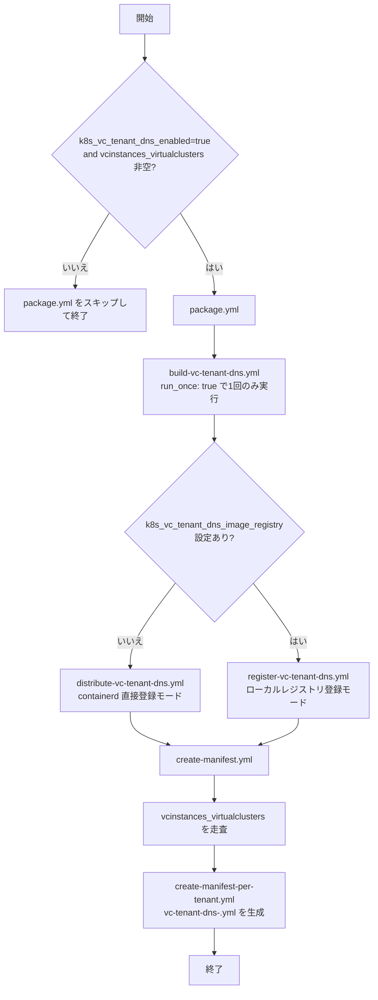

# k8s-vc-tenant-dns ロール

VirtualCluster テナント内で利用する CoreDNS コンテナイメージを構築し, Kubernetes クラスタの各ノード上の Container Runtime Interface (CRI) へ直接登録, または, ローカルレジストリへ登録するロールです。本ロールは CoreDNS のソースコードへ `vc-tenant-dns-support.patch` を適用し, VirtualCluster テナント環境で必要な名前解決動作を反映したコンテナイメージを生成します。

- [k8s-vc-tenant-dns ロール](#k8s-vc-tenant-dns-ロール)
  - [用語](#用語)
  - [前提条件](#前提条件)
  - [概要](#概要)
    - [本ロールの目的](#本ロールの目的)
    - [パッチ適用の概要](#パッチ適用の概要)
  - [実行フロー](#実行フロー)
    - [コンテナイメージの構築と配布の流れ](#コンテナイメージの構築と配布の流れ)
    - [イメージ配布モードの選択](#イメージ配布モードの選択)
      - [containerd 直接登録モード](#containerd-直接登録モード)
      - [ローカルレジストリ登録モード](#ローカルレジストリ登録モード)
  - [主要変数](#主要変数)
  - [テンプレートと生成ファイル](#テンプレートと生成ファイル)
  - [実行方法](#実行方法)
  - [コンテナイメージの利用方法](#コンテナイメージの利用方法)
    - [事前準備](#事前準備)
      - [`vc-tenant-kubeconfig.sh` でテナント用 kubeconfig を生成する](#vc-tenant-kubeconfigsh-でテナント用-kubeconfig-を生成する)
      - [`kubectl port-forward` 等でkubectlコマンドから, テナント内で動作している KubernetesのAPIサーバへ接続可能にする](#kubectl-port-forward-等でkubectlコマンドから-テナント内で動作している-kubernetesのapiサーバへ接続可能にする)
        - [port-forward処理用ターミナルでの作業](#port-forward処理用ターミナルでの作業)
        - [コンテナイメージ投入用ターミナルでの作業](#コンテナイメージ投入用ターミナルでの作業)
    - [ロールが生成したマニフェストを使ってテナント用CoreDNSを展開する](#ロールが生成したマニフェストを使ってテナント用corednsを展開する)
  - [主な処理](#主な処理)
    - [コンテナイメージ構築処理 (`build-vc-tenant-dns.yml`)](#コンテナイメージ構築処理-build-vc-tenant-dnsyml)
    - [containerd 直接登録による配布処理 (`distribute-vc-tenant-dns.yml`)](#containerd-直接登録による配布処理-distribute-vc-tenant-dnsyml)
    - [ローカルレジストリ登録処理 (`register-vc-tenant-dns.yml`)](#ローカルレジストリ登録処理-register-vc-tenant-dnsyml)
  - [検証ポイント](#検証ポイント)
    - [レジストリ登録済みイメージの確認](#レジストリ登録済みイメージの確認)
    - [レジストリ API でタグとリポジトリ一覧を確認](#レジストリ-api-でタグとリポジトリ一覧を確認)
    - [仮想クラスタ側へのコンテナのダウンロードから起動までを確認する手順](#仮想クラスタ側へのコンテナのダウンロードから起動までを確認する手順)
      - [変数を設定する](#変数を設定する)
      - [テナント用 kubeconfig を生成する](#テナント用-kubeconfig-を生成する)
      - [kubeconfig の接続先をローカル転送先へ書き換える](#kubeconfig-の接続先をローカル転送先へ書き換える)
      - [テナント API サーバの 名前空間 ( namespace ) を取得する](#テナント-api-サーバの-名前空間--namespace--を取得する)
      - [別ターミナルで port-forward を開始する](#別ターミナルで-port-forward-を開始する)
      - [元のターミナルで TLS 検証を無効化する](#元のターミナルで-tls-検証を無効化する)
      - [検証用 Pod を作成する](#検証用-pod-を作成する)
      - [Pod が Ready になるまで待機する](#pod-が-ready-になるまで待機する)
      - [Pod のログを確認する](#pod-のログを確認する)
      - [検証用 Pod を削除する](#検証用-pod-を削除する)
      - [導入した Deployment と Service を確認する](#導入した-deployment-と-service-を確認する)
  - [トラブルシューティング](#トラブルシューティング)
    - [Git 取得が失敗する場合](#git-取得が失敗する場合)
    - [Docker ビルドが失敗する場合](#docker-ビルドが失敗する場合)
    - [ローカルレジストリへの push が失敗する場合](#ローカルレジストリへの-push-が失敗する場合)
    - [Kubernetes ノードでの pull が失敗する場合](#kubernetes-ノードでの-pull-が失敗する場合)
    - [CoreDNS が READY 0/1 のまま回復しない場合](#coredns-が-ready-01-のまま回復しない場合)
  - [留意事項](#留意事項)
  - [付録 本ロールから導入されるマニュフェストファイルについて](#付録-本ロールから導入されるマニュフェストファイルについて)
    - [1. ServiceAccount 定義 (10-14行)](#1-serviceaccount-定義-10-14行)
    - [2. ClusterRole 定義 (16-37行)](#2-clusterrole-定義-16-37行)
    - [3. ClusterRoleBinding 定義 (39-50行)](#3-clusterrolebinding-定義-39-50行)
    - [4. ConfigMap 定義 (52-100行)](#4-configmap-定義-52-100行)
    - [5. Service 定義 (102-125行)](#5-service-定義-102-125行)
    - [6. Deployment 定義 (127-238行)](#6-deployment-定義-127-238行)
    - [CoreDNS標準のマニュフェストとの相違](#coredns標準のマニュフェストとの相違)
  - [参考リンク](#参考リンク)

## 用語

| 正式名称 | 略称 | 意味 |
| --- | --- | --- |
| Kubernetes | K8s | コンテナを管理する基盤ソフトウエア。 |
| CoreDNS | - | Kubernetes の Service 名や Pod 名から対応する IP アドレスを返す DNS サーバで, K8sにおけるサービス検出(Service Detection) 機能を提供する。 詳細は, [CoreDNS](https://coredns.io/)を参照。|
| Container Runtime Interface | CRI | Kubernetes がコンテナランタイムと通信するための標準インタフェース。 |
| containerd | - | Kubernetes ノード上で一般的に使われるコンテナランタイム。 |
| ConfigMap | - | 機密情報を含まないデータをキーと値のペアで保存するために使用されるK8sのオブジェクトのこと。詳細は, [ConfigMap](https://kubernetes.io/docs/concepts/configuration/configmap/)を参照。|
| ポッド ( Pod ) | - | Kubernetes の最小展開単位。1 個以上のコンテナ ( Container ) で構成される実行環境。ポッド ( Pod ) 内のすべてのコンテナ ( Container ) は, OS が提供するネットワーク名前空間, および, IP アドレスを共有するため, ループバックアドレス (localhost) の異なるポート番号を使用してプロセス間通信が可能, 共有ストレージによって密接に結合され, 同一ノード上で常に共存, Pod 内のコンテナ群一式が一体となって配置される (スケジューリングの単位として不可分)。 |
| デプロイメント ( Deployment ) | - | Kubernetes リソース。ステートレスなアプリケーション向け。複数のレプリカ(ポッド ( Pod ) の複製)を管理し, 水平スケーリング に対応。 |
| デーモンセット ( DaemonSet ) | - | Kubernetes リソース。Kubernetes クラスタ内の全ノード(またはフィルタ条件を満たすノード)に 1 つのポッド ( Pod ) を配置するリソース。監視やログ収集に適す。 |
| ステートレス ( Stateless ) | - | アプリケーションの性質を表す用語で，アプリケーションから使用される各種データの状態を永続記憶(ストレージ)に保持しなくとも，動作可能なアプリケーションであることを示す。 |
| サービス ( Service ) | - | Kubernetes リソース。ポッド ( Pod ) へのネットワークアクセスを定義。仮想 IP アドレスを提供し, 通信電文 ( トラフィック ) を適切なポッドに転送 ( ルーティング ) する。 |
| Custom Resource Definition | CRD | ユーザ独自に定義したK8s リソースの定義。 |
| Custom Resource | CR | CRDで定義されたK8sリソースの実体。 |
| Label | - | K8s リソースに付与するKey-Value形式のメタデータ。リソースの分類, 検索に利用される。 |
| Selector | - | Labelを利用してK8s リソースを選択する条件式。 |
| Annotation | - | K8s リソースに付与するKey-Value形式の補足情報。ツールやコントローラが参照するメタデータ。 |
|Prometheus| - | K8s環境で, システムおよびサービスの監視に使用されるソフトウエアの一種です。詳細は, [Prometheus公式サイト](https://prometheus.io/)参照。|
| Docker | - | コンテナ仮想化技術を用いたアプリケーション実行環境。本ロールではコンテナイメージの作成と登録に使用する。 |
| ローカルレジストリ | - | 組織内や検証環境内で運用するコンテナイメージ配布用レジストリ。 |
| マニフェスト | - | Kubernetes リソースを YAML 形式で定義したファイル。 |
| 名前空間 ( namespace ) | - | Kubernetes におけるリソースの分離単位。 |
| テナント | - | VirtualCluster 上で独立した Kubernetes API 空間を利用する論理利用者。 |
|サービス (Service) | - | K8sが提供するPodの集合上で実行しているアプリケーションを抽象的に公開する手段のこと。詳細は, [Service](https://kubernetes.io/docs/concepts/services-networking/service/)参照。|
|ClusterIP| - | K8sの各サービスに割り当てられる仮想的なIPアドレスのこと。詳細は, [Virtual IPs and Service Proxies](https://kubernetes.io/docs/reference/networking/virtual-ips/)参照。|

## 前提条件

- 制御ホストとビルドホスト上で Docker が利用可能であること。
- `k8s-register-image` ロールが同一リポジトリ内に存在すること。
- `k8s_vc_tenant_dns_register_to_k8s_nodes_enabled: true` の場合は, 制御ホストから K8s ノードへ Ansible 経由で接続可能であること。
- `k8s_vc_tenant_dns_image_registry` を使用する場合は, 制御ホストの Docker と K8s ノード側の containerd がそのレジストリを参照可能であること。
- CoreDNS ソースコード取得元へ HTTPS で接続可能であること。

## 概要

本ロールは以下の流れで処理します。

1. `k8s_vc_tenant_dns_coredns_source_url` で指定した CoreDNS ソースコードを取得する。
2. `k8s_vc_tenant_dns_version` で指定した版をチェックアウトする。
3. `files/vc-tenant-dns-support.patch` を適用した Dockerfile を用いてコンテナイメージを構築する。
4. 構築したイメージを tar 形式で保存する。
5. `k8s_vc_tenant_dns_image_registry` が空の場合は, `k8s-register-image` ロール経由で K8s ノードの CRI へ登録する。
6. `k8s_vc_tenant_dns_image_registry` に値が設定されている場合は, そのローカルレジストリへ登録する。

### 本ロールの目的

本ロールの目的は, VirtualCluster テナントで利用する CoreDNS イメージを再現可能な手順で構築し, 配布先の K8s 環境で再利用可能な形にすることです。加えて, `vcinstances_virtualclusters` に定義された各テナント向けに, CoreDNS 導入用マニフェストを生成します。なお, 本ロールはマニフェストの自動 `apply` までは行わず, 実際の適用は利用者が `kubectl apply` で実施します。

### パッチ適用の概要

[VirtualCluster - Enabling Kubernetes Hard Multi-tenancy](https://github.com/kubernetes-retired/cluster-api-provider-nested/tree/main/virtualcluster) ( Kubernetes 仮想クラスタ )では, テナント内のPodから参照されるClusterIPには, 実効性のない値(ダミー値)が格納される仕様です(詳細は, [VirtualCluster - Enabling Kubernetes Hard Multi-tenancy](https://github.com/kubernetes-retired/cluster-api-provider-nested/tree/main/virtualcluster) の[Readme.md](https://github.com/kubernetes-retired/cluster-api-provider-nested/blob/main/virtualcluster/README.md)中の["Limitations"](https://github.com/kubernetes-retired/cluster-api-provider-nested/tree/main/virtualcluster#limitations)節を参照)。

VirtualCluster - Enabling Kubernetes Hard Multi-tenancy の Readme.md中のLimitations節より引用:
```plaintext
The cluster IP field in the tenant service spec is a bogus value.
If any tenant controller requires the actual cluster IP that takes effect in the super cluster nodes, a special handling is required.
The syncer will backpopulate the cluster IP used in the super cluster in the annotations of the tenant service object using "transparency.tenancy.x-k8s.io/clusterIP" as the key.
```

該当部分日本語訳:
```plaintext
テナントのService Spec内のclusterIPフィールドには, 無効な値が設定されています。
スーパークラスタのノードで有効となる実際のclusterIPをテナントコントローラーが要求する場合, 特別な処理が必要となります。
syncerは, スーパークラスタで使用されているclusterIPをテナントのServiceSpecオブジェクトのannotation中のキー(Key)"transparency.tenancy.x-k8s.io/clusterIP"に対応する値(Value)に自動的に反映します。
```

訳注:
   - 上記の`Service Spec`とは, Kubernetes APIの[ServiceSpec v1](https://kubernetes.io/docs/reference/generated/kubernetes-api/v1.26/#service-v1-core)オブジェクトのことを指します。
   - [VirtualCluster - Enabling Kubernetes Hard Multi-tenancy](https://github.com/kubernetes-retired/cluster-api-provider-nested/tree/main/virtualcluster)の実装から, 上記文中の`clusterIP`という表現は, [ServiceSpec v1](https://kubernetes.io/docs/reference/generated/kubernetes-api/v1.26/#service-v1-core)オブジェクトのclusterIPフィールドとclusterIPsフィールドの総称の意味で使用されています。
   - 文中の`backpopulate`は, データベース操作において, 複数の項目に対する双方向の関連付けを自動的に実施する操作を意味します。該当部分を要約すると, 「スーパークラスタのclusterIPの値をsyncerが, annotation中のキー(Key)"transparency.tenancy.x-k8s.io/clusterIP"に対応する項目に反映するため, キー(Key):"transparency.tenancy.x-k8s.io/clusterIP"に対する値を取得して, 実際に有効なIPアドレスを得る必要がある。」という意味になります。

このため, テナント内のPodからKubernetesのサービスを検出(Service Detection)するためには, 仮想クラスタ向けに修正されたCoreDNSを使用する必要があります(詳細は, [Tenant DNS Support](https://github.com/kubernetes-retired/cluster-api-provider-nested/blob/main/virtualcluster/doc/tenant-dns.md)を参照)。

`files/vc-tenant-dns-support.patch` は, Kubernetes v1.31と組み合わせて使用されるCoreDNS v1.11.3に, [Tenant DNS Support](https://github.com/kubernetes-retired/cluster-api-provider-nested/blob/main/virtualcluster/doc/tenant-dns.md)に記載されているテナント内CoreDNSを実現するための改造を施すパッチです。

本パッチは, CoreDNS の `plugin/kubernetes/object/service.go` を修正し, テナント内から参照されるServiceの `ClusterIP` (ダミー値)の代わりに, スーパークラスタ側の`ClusterIP` を返すように修正します。

## 実行フロー

### コンテナイメージの構築と配布の流れ



`package.yml` は `k8s_vc_tenant_dns_enabled`が真の場合, かつ `vcinstances_virtualclusters` が空でない場合のみ実行されます。

### イメージ配布モードの選択

`k8s_vc_tenant_dns_image_registry` の設定有無によって配布モードが自動的に選択されます。

- `containerd 直接登録モード` `k8s_vc_tenant_dns_image_registry` が未設定または空文字の場合に選択されます。
- `ローカルレジストリ登録モード` `k8s_vc_tenant_dns_image_registry` が定義され, かつ, 空文字列でない場合に選択されます。

#### containerd 直接登録モード

`k8s_vc_tenant_dns_image_registry` が未設定または空文字の場合に選択されます。`k8s-register-image` ロールを使用して, 制御ホスト上の tar ファイルを各コントロールプレインノード, および, ワーカノードへ転送し, `ctr` コマンドを通して CRI へ登録します。

#### ローカルレジストリ登録モード

`k8s_vc_tenant_dns_image_registry` に値が設定されている場合に選択されます。制御ホスト上で, 以下の処理を行います(括弧内は実行するコマンド):

1. `k8s_vc_tenant_dns_image_file`変数で指定されたコンテナイメージのtar ファイルを Docker に読み込みます (`docker load -i <k8s_vc_tenant_dns_image_file変数の値>`)。
2. `k8s_vc_tenant_dns_image` で指定されたローカルのタグ名を, `k8s_vc_tenant_dns_image_registry` と `k8s_vc_tenant_dns_version` 変数の値を元に構成した登録先タグ名へ付け替えます (`docker tag <k8s_vc_tenant_dns_image変数の値> <k8s_vc_tenant_dns_image_registry変数の値:k8s_vc_tenant_dns_version変数の値>`)。
3. `k8s_vc_tenant_dns_image_registry`で指定されたレジストリへコンテナイメージを登録する (`docker push <k8s_vc_tenant_dns_image_registry変数の値:k8s_vc_tenant_dns_version変数の値>`)。

上記が完了すると, 例えば, `registry1.local:5000/vc-tenant-dns:v1.11.3` のようなタグでローカルレジストリへコンテナイメージが登録されます。

## 主要変数

| 変数名 | 既定値 | 説明 |
| --- | --- | --- |
| `k8s_vc_tenant_dns_enabled` | `false` | 本ロールの有効/無効を切り替える。 |
| `k8s_vc_tenant_dns_coredns_source_url` | `https://github.com/coredns/coredns.git` | CoreDNS ソースコード取得元 URL。 |
| `k8s_vc_tenant_dns_version` | `v1.11.3` | 取得してビルドする CoreDNS の版。 |
| `k8s_vc_tenant_dns_image` | `vc-tenant-dns:{{ k8s_vc_tenant_dns_version }}` | 構築するコンテナイメージ名。 |
| `k8s_vc_tenant_dns_image_file` | `vc-tenant-dns-{{ k8s_vc_tenant_dns_version }}.tar` | tar 形式で保存するコンテナイメージファイル名。 |
| `k8s_vc_tenant_dns_build_host` | `localhost` | コンテナイメージをビルドするホスト。 |
| `k8s_vc_tenant_dns_go_version` | `1.22` | CoreDNS v1.11.3 のビルドに使う Go バージョン。 |
| `k8s_vc_tenant_dns_alpine_version` | `{{ alpine_version\|default('3.20', true) }}` | Dockerfile のベースに使う Alpine Linux のバージョン。 |
| `k8s_vc_tenant_dns_docker_build_network` | `host` | Docker build 時のネットワークモード。 |
| `k8s_vc_tenant_dns_image_registry` | `""` | ローカルレジストリ登録時のイメージ参照先。 |
| `k8s_vc_tenant_dns_register_to_k8s_nodes_enabled` | `{{ (k8s_vc_tenant_dns_image_registry \| default('', true) \| trim \| length) == 0 }}` | 既定値では `k8s_vc_tenant_dns_image_registry` が空なら `true`, 値ありなら `false` になる。必要なら明示上書きも可能。 |
| `k8s_vc_tenant_dns_kubeconfig_path` | `/etc/kubernetes/admin.conf` | ワーカノード自動検出時に参照する kubeconfig パス。 |
| `k8s_vc_tenant_dns_remote_cache_dir` | `/tmp/k8s-vc-tenant-dns-register` | K8s ノード上の一時 tar 配置先。 |
| `k8s_vc_tenant_dns_k8s_manifest_dir` | `{{ k8s_vc_tenant_dns_k8s_manifest_dir_prefix }}/vc-tenant-dns/manifests` | テナント別マニフェストの出力先ディレクトリ。`vc-tenant-dns-<tenant-name>.yml` を生成する。 |
| `k8s_vc_tenant_dns_virtualcluster_namespace` | `{{ virtualcluster_namespace \| default('vc-manager', true) }}` | VirtualCluster カスタムリソースを参照する管理 名前空間 ( namespace )。 |
| `k8s_vc_tenant_dns_supercluster_kubeconfig_path` | `{{ virtualcluster_supercluster_kubeconfig_path \| default('/etc/kubernetes/admin.conf', true) }}` | super cluster 側で VirtualCluster と Secret を参照するための kubeconfig パス。 |

## テンプレートと生成ファイル

| テンプレートファイル | 生成先 | 説明 |
| --- | --- | --- |
| `templates/Dockerfile.j2` | `{{ k8s_vc_tenant_dns_build_dir }}/Dockerfile` | CoreDNS ビルド用の Dockerfile。 |
| `templates/build-vc-tenant-dns.sh.j2` | `{{ k8s_vc_tenant_dns_build_dir }}/build-vc-tenant-dns.sh` | `docker build` と `docker save` を実行するシェルスクリプト。 |

関連入力ファイル:

- `files/vc-tenant-dns-support.patch`: CoreDNS ソースコードへ適用するパッチ。

## 実行方法

`vars/all-config.yml`, または, 対象ホストの `host_vars` 内で必要な変数を設定したうえで, 以下のいずれかで本ロールを実行します。

```bash
# site.yml 経由で実行する
ansible-playbook -i inventory/hosts site.yml

# k8s-management.yml の対象ロールだけ実行する
ansible-playbook -i inventory/hosts k8s-management.yml --tags k8s-vc-tenant-dns

# makeターゲットで本ロールの実行を指示する
make run_k8s_vc_tenant_dns
```

## コンテナイメージの利用方法

本ロールはコンテナイメージの構築と配布を担当し, CoreDNS の Pod や Deployment を自動展開しませんので,
利用者側でテナント利用時に本コンテナイメージを展開する必要があります。

`k8s-vc-tenant-dns` ロールは, `vcinstances_virtualclusters` に定義された各テナント名ごとにマニフェストを生成します。既定値では, `k8s_management` グループ対象ホスト上の `/opt/k8snodes/vc-tenant-dns/manifests` 配下に, `vc-tenant-dns-<tenant-name>.yml` 形式で生成されます。

本節では, 本ロールから生成されたマニュフェストを用いて, コンテナイメージを展開する手順を説明します。 本節の例では, `tenant-alpha`という名前のテナントにコンテナイメージを展開することを前提とした手順(`vc-tenant-dns-tenant-alpha.yml`というマニュフェストファイルを用いたコンテナイメージ展開手順)を記載します。

各作業内でのコマンド意味等の詳細については, [検証ポイント](#検証ポイント) を参照ください。

### 事前準備

本ロールから生成されたコンテナイメージは **スーパークラスタ側ではなく, 仮想クラスタ ( テナント環境 ) 側へ展開する必要があります**。

このため, マニュフェスト投入前に, 以下の事前準備作業を行う必要があります:

1. `vc-tenant-kubeconfig.sh` でテナント用 kubeconfig を生成する。
2. `kubectl port-forward` 等でkubectlコマンドから, テナント内で動作している KubernetesのAPIサーバへ接続可能にする。

本節では, 上記の事前準備作業を行うための手順を説明します。

#### `vc-tenant-kubeconfig.sh` でテナント用 kubeconfig を生成する

1. シェル変数を設定する。

```bash
SUPER_KUBECONFIG=~/.kube/config
TENANT_NAME=tenant-alpha
LOCAL_PORT=16443
```

2. `vc-tenant-kubeconfig.sh` でテナント用 kubeconfig を生成する。

```bash
vc-tenant-kubeconfig.sh "${TENANT_NAME}" -o ~/.kube/${TENANT_NAME}.conf --vc-manager-ns vc-manager
```

3. 生成された kubeconfig の参照先をローカル転送先へ書き換える。

```bash
sed -i "s|server: https://.*:6443|server: https://localhost:${LOCAL_PORT}|" ~/.kube/${TENANT_NAME}.conf
```

4. VirtualCluster からテナント API サーバの実行 名前空間 ( namespace ) を取得する。

```bash
TENANT_NS=$(kubectl --kubeconfig "${SUPER_KUBECONFIG}" get virtualclusters.tenancy.x-k8s.io -n vc-manager "${TENANT_NAME}" -o jsonpath='{.status.clusterNamespace}')
echo "${TENANT_NS}"
```

#### `kubectl port-forward` 等でkubectlコマンドから, テナント内で動作している KubernetesのAPIサーバへ接続可能にする

##### port-forward処理用ターミナルでの作業

コンテナイメージ投入に使用するターミナルとは別のターミナルで以下を実施します:

1. シェル変数を設定する。

```bash
SUPER_KUBECONFIG=~/.kube/config
TENANT_NAME=tenant-alpha
LOCAL_PORT=16443
```

2. VirtualCluster からテナント API サーバの実行 名前空間 ( namespace ) を取得する。

```bash
TENANT_NS=$(kubectl --kubeconfig "${SUPER_KUBECONFIG}" get virtualclusters.tenancy.x-k8s.io -n vc-manager "${TENANT_NAME}" -o jsonpath='{.status.clusterNamespace}')
echo "${TENANT_NS}"
```

3. `port-forward` を開始する。

```bash
kubectl --kubeconfig "${SUPER_KUBECONFIG}" port-forward -n "${TENANT_NS}" svc/apiserver-svc ${LOCAL_PORT}:6443
```

##### コンテナイメージ投入用ターミナルでの作業

コンテナイメージ投入用ターミナル(元のターミナル)で接続確認を実行します:

```bash
kubectl --kubeconfig ~/.kube/${TENANT_NAME}.conf get namespace
```

### ロールが生成したマニフェストを使ってテナント用CoreDNSを展開する

まず, 生成済みマニフェストを確認します。

```bash
sudo ls -l /opt/k8snodes/vc-tenant-dns/manifests/vc-tenant-dns-${TENANT_NAME}.yml
```

出力例:

```text
-rw-r--r-- 1 root root 5xxx Jul 14 12:34 /opt/k8snodes/vc-tenant-dns/manifests/vc-tenant-dns-tenant-alpha.yml
```

続いて, テナント側へマニフェストを適用します。

```bash
kubectl --kubeconfig ~/.kube/${TENANT_NAME}.conf apply -f /opt/k8snodes/vc-tenant-dns/manifests/vc-tenant-dns-${TENANT_NAME}.yml
```

出力例:

```text
serviceaccount/coredns created
clusterrole.rbac.authorization.k8s.io/system:coredns created
clusterrolebinding.rbac.authorization.k8s.io/system:coredns created
configmap/coredns created
service/kube-dns created
deployment.apps/coredns created
```

## 主な処理

### コンテナイメージ構築処理 (`build-vc-tenant-dns.yml`)

このタスクでは, ビルドホスト上に作業ディレクトリを作成し, CoreDNS ソースコードの取得, パッチファイル配置, Dockerfile 生成, ビルドスクリプト生成, テナント内で動作するように修正したCoreDNSバイナリの構築(`docker build`), コンテナイメージの生成()`docker save`), 制御ホストへの tar 回収を実施します。

### containerd 直接登録による配布処理 (`distribute-vc-tenant-dns.yml`)

`k8s-register-image` ロールを用いて, コントロールプレインノードとワーカノードの両方へイメージ tar を配布し, CRI に登録します。ワーカノードは自動検出します。

### ローカルレジストリ登録処理 (`register-vc-tenant-dns.yml`)

制御ホスト上で, 以下の処理を実施します:

1. tar ファイルを Docker に読み込む
2. tar ファイルのタグ名を付け替える
3. ローカルレジストリにコンテナイメージを登録する

## 検証ポイント

本節では, `registry1.local:5000/vc-tenant-dns`を登録先ローカルレジストリとして使用することを前提に検証手順を説明します。

### レジストリ登録済みイメージの確認

制御ホストからローカルレジストリ中に登録されているイメージタグを確認します。

```bash
docker images registry1.local:5000/vc-tenant-dns
```

実行結果の例:

```bash
$ docker images registry1.local:5000/vc-tenant-dns
                                                                     i Info →   U  In Use
IMAGE                                     ID             DISK USAGE   CONTENT SIZE   EXTRA
registry1.local:5000/vc-tenant-dns:v1.11.3
                                          f5f031056034       91.8MB         21.6MB
```

`vc-tenant-dns`を含むコンテナイメージが登録されており, タグ名に指定されている版数が, `k8s_vc_tenant_dns_version`変数で指定した版数と一致していることを確認してください。

### レジストリ API でタグとリポジトリ一覧を確認

ローカルレジストリ上でタグとリポジトリ一覧を確認します。

```bash
curl -k -s http://registry1.local:5000/v2/vc-tenant-dns/tags/list
curl -k -s http://registry1.local:5000/v2/_catalog
```

実行結果の例:

```bash
$ curl -k -s http://registry1.local:5000/v2/vc-tenant-dns/tags/list
{"name":"vc-tenant-dns","tags":["v1.11.3"]}
```

`"name"`に`vc-tenant-dns`が設定され, tagsに`k8s_vc_tenant_dns_version`変数で指定した版数が含まれていることを確認してください。

```bash
$ curl -k -s http://registry1.local:5000/v2/_catalog
{"repositories":["vc-tenant-dns"]}
```
`"repositories"`に`vc-tenant-dns`が含まれることを確認してください。

### 仮想クラスタ側へのコンテナのダウンロードから起動までを確認する手順

本節では, 仮想クラスタ側からのイメージのダウンロード(pull), および, Podの実行までを確認する手順を説明します。
本作業は, コントロールプレインノード上で実施することを想定しています。

#### 変数を設定する

以下のシェル変数を設定します。

|変数名|意味|設定値|
|---|---|---|
|SUPER_KUBECONFIG|スーパークラスタを操作するためのkubeconfigファイルへのパス|~/.kube/config|
|TENANT_NAME|操作対象テナント名|tenant-alpha|
|LOCAL_PORT|ポートフォワーディングで使用する外部ポート(スーパークラスタ側から見たポート)|16443|

実行するコマンドは以下の通りです:

```bash
SUPER_KUBECONFIG=~/.kube/config
TENANT_NAME=tenant-alpha
LOCAL_PORT=16443
```


#### テナント用 kubeconfig を生成する

テナント用のkubeconfigファイルを`roles/k8s-virtual-cluster`から導入される`vc-tenant-kubeconfig.sh`スクリプトを用いて生成します。

```bash
vc-tenant-kubeconfig.sh "${TENANT_NAME}" -o ~/.kube/${TENANT_NAME}.conf --vc-manager-ns vc-manager
```

出力例:

```bash
$ TENANT_NAME=tenant-alpha
$ vc-tenant-kubeconfig.sh "${TENANT_NAME}" -o ~/.kube/${TENANT_NAME}.conf --vc-manager-ns vc-manager
[INFO] ====== kubeconfig生成 ======
[INFO] コンテキスト: cluster1
[INFO] ユーザ: CLUSTER
[INFO] テナント情報:
[INFO]   テナント名: tenant-alpha
[INFO]   VirtualCluster管理 名前空間 ( namespace ): vc-manager
[INFO]   実行時 名前空間 ( namespace ): vc-manager-494ea7-tenant-alpha
[INFO]   クラスタドメイン: tenant-alpha.vc.local
[INFO] kubeconfig生成開始: tenant-alpha
[INFO]   実行時 名前空間 ( namespace ): vc-manager-494ea7-tenant-alpha
[INFO]   クラスタドメイン: tenant-alpha.vc.local
[INFO]   admin-kubeconfigシークレット: 取得済み
[INFO] kubeconfig を出力: /home/kube/.kube/tenant-alpha.conf
[INFO] kubeconfig生成完了
[INFO] ====== 完了 ======
```

#### kubeconfig の接続先をローカル転送先へ書き換える

```bash
sed -i "s|server: https://.*:6443|server: https://localhost:${LOCAL_PORT}|" ~/.kube/${TENANT_NAME}.conf
```

#### テナント API サーバの 名前空間 ( namespace ) を取得する

```bash
TENANT_NS=$(kubectl --kubeconfig "${SUPER_KUBECONFIG}" get virtualclusters.tenancy.x-k8s.io -n vc-manager "${TENANT_NAME}" -o jsonpath='{.status.clusterNamespace}')
```

#### 別ターミナルで port-forward を開始する

```bash
SUPER_KUBECONFIG=~/.kube/config
TENANT_NAME=tenant-alpha
LOCAL_PORT=16443
TENANT_NS=$(kubectl --kubeconfig "${SUPER_KUBECONFIG}" get virtualclusters.tenancy.x-k8s.io -n vc-manager "${TENANT_NAME}" -o jsonpath='{.status.clusterNamespace}')
kubectl --kubeconfig "${SUPER_KUBECONFIG}" port-forward -n "${TENANT_NS}" svc/apiserver-svc ${LOCAL_PORT}:6443
```

出力例:

```text
Forwarding from 127.0.0.1:16443 -> 6443
```

#### 元のターミナルで TLS 検証を無効化する

```bash
KUBECONFIG=~/.kube/${TENANT_NAME}.conf
CTX=$(kubectl --kubeconfig "${KUBECONFIG}" config current-context)
CLUSTER_NAME=$(kubectl --kubeconfig "${KUBECONFIG}" config view -o jsonpath="{.contexts[?(@.name=='${CTX}')].context.cluster}")
kubectl --kubeconfig "${KUBECONFIG}" config set-cluster "${CLUSTER_NAME}" --server="https://localhost:${LOCAL_PORT}" --insecure-skip-tls-verify=true
```

出力例:

```text
Cluster "tenant-alpha" set.
```

#### 検証用 Pod を作成する

```bash
kubectl --kubeconfig ~/.kube/${TENANT_NAME}.conf apply -f - <<'EOF'
apiVersion: v1
kind: Pod
metadata:
  name: vc-tenant-dns-smoke
  namespace: default
spec:
  restartPolicy: Never
  containers:
    - name: vc-tenant-dns
      image: registry1.local:5000/vc-tenant-dns:v1.11.3
      imagePullPolicy: IfNotPresent
      command:
        - /bin/sh
        - -c
        - /coredns -version && sleep 3600
EOF
```

出力例:

```text
pod/vc-tenant-dns-smoke created
```

#### Pod が Ready になるまで待機する

```bash
kubectl --kubeconfig ~/.kube/${TENANT_NAME}.conf wait --for=condition=Ready pod/vc-tenant-dns-smoke -n default --timeout=180s
```

出力例:

```text
pod/vc-tenant-dns-smoke condition met
```

#### Pod のログを確認する

```bash
kubectl --kubeconfig ~/.kube/${TENANT_NAME}.conf logs vc-tenant-dns-smoke -n default --tail=20
```

出力例:

```text
CoreDNS-1.11.3
linux/amd64, go1.22.12,
```

#### 検証用 Pod を削除する

```bash
kubectl --kubeconfig ~/.kube/${TENANT_NAME}.conf delete pod vc-tenant-dns-smoke -n default --wait=true
```

出力例:

```text
pod "vc-tenant-dns-smoke" deleted
```

#### 導入した Deployment と Service を確認する

```bash
kubectl --kubeconfig ~/.kube/${TENANT_NAME}.conf -n kube-system get deployment coredns
```

出力例:

```text
NAME      READY   UP-TO-DATE   AVAILABLE   AGE
coredns   1/1     1            1           2m12s
```

```bash
kubectl --kubeconfig ~/.kube/${TENANT_NAME}.conf -n kube-system get service kube-dns
```

出力例:

```text
NAME       TYPE        CLUSTER-IP     EXTERNAL-IP   PORT(S)                  AGE
kube-dns   ClusterIP   10.32.97.237   <none>        53/UDP,53/TCP,9153/TCP   2m12s
```

テナントの 名前空間 ( namespace ) 側の Pod 状態も確認します。

```bash
SUPER_KUBECONFIG=~/.kube/config
TENANT_NAME=tenant-alpha
BASE_NS=$(kubectl --kubeconfig "${SUPER_KUBECONFIG}" get virtualclusters.tenancy.x-k8s.io -n vc-manager "${TENANT_NAME}" -o jsonpath='{.status.clusterNamespace}')
BACK_NS=${BASE_NS}-kube-system
kubectl --kubeconfig "${SUPER_KUBECONFIG}" -n "${BACK_NS}" get pods -l k8s-app=kube-dns -o wide
kubectl --kubeconfig "${SUPER_KUBECONFIG}" -n "${BACK_NS}" logs -l k8s-app=kube-dns --tail=30
```

出力例:

```text
NAME                       READY   STATUS    RESTARTS   AGE
coredns-7d48b9f7f8-abcde   1/1     Running   0          42s
```

```text
[INFO] plugin/reload: Running configuration SHA512 = <hash>
CoreDNS-1.11.3
linux/amd64, go1.22.12,
```


## トラブルシューティング

### Git 取得が失敗する場合

既定値は HTTPS 取得です。独自 URL を SSH 形式へ変更している場合は, 制御ホスト上で GitHub などへの SSH 鍵設定と `known_hosts` 登録が必要です。

### Docker ビルドが失敗する場合

`golang:<version>-alpine<version>` のタグが存在するか確認してください。`k8s_vc_tenant_dns_go_version` と `k8s_vc_tenant_dns_alpine_version` の組み合わせが Docker Hub 上に存在しないとビルドに失敗します。

```bash
docker pull golang:1.22-alpine3.20
docker pull alpine:3.20
```

### ローカルレジストリへの push が失敗する場合

Docker からレジストリへ接続できることと, `insecure-registries` などの設定が必要な環境では制御ホスト側設定が済んでいることを確認してください。

```bash
curl -k -s http://registry1.local:5000/v2/_catalog
docker images registry1.local:5000/vc-tenant-dns:v1.11.3
```

### Kubernetes ノードでの pull が失敗する場合

`ImagePullBackOff` になる場合は, ノード側の containerd が対象レジストリを参照可能か確認してください。`/etc/containerd/certs.d/<registry>/hosts.toml` の設定や名前解決, 到達性を見直してください。

```bash
kubectl describe pod vc-tenant-dns-smoke -n default
```

また, 仮想クラスタ側へ展開していることを確認してください。スーパークラスタ側へ直接 `kubectl apply` した場合, テナント環境に期待した名前解決設定を検証できません。

### CoreDNS が READY 0/1 のまま回復しない場合

複数の要因がありえるため, 以下の順で確認の上, 問題を切り分けることを推奨します:

1. `x509: certificate signed by unknown authority`
  - 事象: CoreDNS が tenant API へ接続する TLS 検証で失敗する。
  - 確認: ConfigMap `coredns` の `kubeconfig` に tenant 用の CA / クライアント認証情報が入っていることを確認する。

2. `Unauthorized`
  - 事象: 認証情報は読めるが, API 呼び出し権限または資格情報が不一致で失敗する。
  - 確認: `controller-manager-kubeconfig` を利用しているか, 反映後に Pod が再作成されていることを確認する。

3. `dial tcp: lookup apiserver-svc.<clusterNamespace>: no such host`
  - 事象: テナント側の Pod から `apiserver-svc.<clusterNamespace>` を解決できず失敗する。
  - 確認: マニフェスト内 kubeconfig の `server` が `https://kubernetes.default.svc:443` に置換されていることを確認する。

確認コマンド例:

```bash
TENANT_NAME=tenant-alpha
MANIFEST=/opt/k8snodes/vc-tenant-dns/manifests/vc-tenant-dns-${TENANT_NAME}.yml
grep -n 'server:' "${MANIFEST}"
kubectl --kubeconfig ~/.kube/${TENANT_NAME}.conf -n kube-system get configmap coredns -o yaml | grep -n 'server:'
```

`grep -n 'server:' "${MANIFEST}"`の出力に, `server: https://kubernetes.default.svc:443` が含まれること, `kubectl --kubeconfig ~/.kube/${TENANT_NAME}.conf -n kube-system get configmap coredns -o yaml | grep -n 'server:'`コマンドの実行結果中に含まれる対象テナントの名前空間 ( namespace ) 内の Pod が `READY 1/1` になっていることを確認してください。

## 留意事項

- 一方, CoreDNSのコンテナイメージをK8sクラスタに投入する作業は, 利用者側で実施することを想定し, 本ロールはコンテナイメージの構築と配布までを実施します ( テナント用CoreDNS の Pod / Deployment / Service / ConfigMap の自動生成はしません )。
- このイメージを用いた Pod / Deployment の展開先は仮想クラスタ ( テナント環境 ) 側です。スーパークラスタ側へ直接 apply しないでください。
- ローカルレジストリ登録モードでは, 制御ホストだけでなく K8s ノード側のレジストリ設定も必要です。

## 付録 本ロールから導入されるマニュフェストファイルについて

本節では, `roles/k8s-vc-tenant-dns/templates/vc-tenant-dns.yml.j2` から生成されるマニュフェストファイルの設定内容について, テナント`tenant-alpha`用のマニュフェストを例に説明します。

マニュフェスト全体の内容は以下の通りです:

```yaml
    1	#
    2	#  -*- coding:utf-8 mode:bash -*-
    3	#
    4	#
    5   #
    6	#
    7	# テナント内用CoreDNSコンテナのmanifestファイル
    8	#
    9	---
   10	apiVersion: v1
   11	kind: ServiceAccount
   12	metadata:
   13	  name: coredns
   14	  namespace: kube-system
   15	---
   16	apiVersion: rbac.authorization.k8s.io/v1
   17	kind: ClusterRole
   18	metadata:
   19	  name: system:coredns
   20	rules:
   21	  - apiGroups:
   22	      - ""
   23	    resources:
   24	      - endpoints
   25	      - services
   26	      - pods
   27	      - namespaces
   28	    verbs:
   29	      - list
   30	      - watch
   31	  - apiGroups:
   32	      - discovery.k8s.io
   33	    resources:
   34	      - endpointslices
   35	    verbs:
   36	      - list
   37	      - watch
   38	---
   39	apiVersion: rbac.authorization.k8s.io/v1
   40	kind: ClusterRoleBinding
   41	metadata:
   42	  name: system:coredns
   43	roleRef:
   44	  apiGroup: rbac.authorization.k8s.io
   45	  kind: ClusterRole
   46	  name: system:coredns
   47	subjects:
   48	  - kind: ServiceAccount
   49	    name: coredns
   50	    namespace: kube-system
   51	---
   52	apiVersion: v1
   53	kind: ConfigMap
   54	metadata:
   55	  name: coredns
   56	  namespace: kube-system
   57	data:
   58	  Corefile: |
   59	    .:53 {
   60	      errors
   61	      health {
   62	        lameduck 5s
   63	      }
   64	      ready
   65	      kubernetes cluster.local in-addr.arpa ip6.arpa {
   66	        kubeconfig /etc/coredns/kubeconfig
   67	        pods insecure
   68	        fallthrough in-addr.arpa ip6.arpa
   69	        ttl 30
   70	      }
   71	      prometheus :9153
   72	      forward . /etc/resolv.conf {
   73	        max_concurrent 1000
   74	      }
   75	      cache 30
   76	      loop
   77	      reload
   78	      loadbalance
   79	    }
   80	  kubeconfig: |
   81
   82	    kind: Config
   83	    apiVersion: v1
   84	    users:
   85	    - name: system:kube-controller-manager
   86	      user:
   87	        client-certificate-data: 略
   88	        client-key-data: 略
   89	    clusters:
   90	    - name: tenant-alpha
   91	      cluster:
   92	        certificate-authority-data: 略
   93	        server: https://kubernetes.default.svc:443
   94	    contexts:
   95	    - context:
   96	        cluster: tenant-alpha
   97	        user: system:kube-controller-manager
   98	      name: default
   99	    current-context: default
  100	    preferences: {}
  101	---
  102	apiVersion: v1
  103	kind: Service
  104	metadata:
  105	  name: kube-dns
  106	  namespace: kube-system
  107	  annotations:
  108	    prometheus.io/port: "9153"
  109	    prometheus.io/scrape: "true"
  110	  labels:
  111	    k8s-app: kube-dns
  112	    kubernetes.io/name: "CoreDNS"
  113	spec:
  114	  selector:
  115	    k8s-app: kube-dns
  116	  ports:
  117	    - name: dns
  118	      port: 53
  119	      protocol: UDP
  120	    - name: dns-tcp
  121	      port: 53
  122	      protocol: TCP
  123	    - name: metrics
  124	      port: 9153
  125	      protocol: TCP
  126	---
  127	apiVersion: apps/v1
  128	kind: Deployment
  129	metadata:
  130	  name: coredns
  131	  namespace: kube-system
  132	  labels:
  133	    k8s-app: kube-dns
  134	    kubernetes.io/name: "CoreDNS"
  135	spec:
  136	  replicas: 1
  137	  strategy:
  138	    type: RollingUpdate
  139	    rollingUpdate:
  140	      maxUnavailable: 1
  141	  selector:
  142	    matchLabels:
  143	      k8s-app: kube-dns
  144	  template:
  145	    metadata:
  146	      labels:
  147	        k8s-app: kube-dns
  148	    spec:
  149	      # Avoid inheriting super-cluster Service env vars into the tenant-side Pod.
  150	      enableServiceLinks: false
  151	      dnsPolicy: Default
  152	      securityContext:
  153	        seccompProfile:
  154	          type: RuntimeDefault
  155	      serviceAccountName: coredns
  156	      affinity:
  157	        podAntiAffinity:
  158	          preferredDuringSchedulingIgnoredDuringExecution:
  159	            - weight: 100
  160	              podAffinityTerm:
  161	                labelSelector:
  162	                  matchExpressions:
  163	                    - key: k8s-app
  164	                      operator: In
  165	                      values:
  166	                        - kube-dns
  167	                topologyKey: kubernetes.io/hostname
  168	      tolerations:
  169	        - key: "CriticalAddonsOnly"
  170	          operator: "Exists"
  171	      nodeSelector:
  172	        kubernetes.io/os: linux
  173	      containers:
  174	        - name: coredns
  175	          image: registry1.local:5000/vc-tenant-dns:v1.11.3
  176	          imagePullPolicy: IfNotPresent
  177	          args:
  178	            - "-conf"
  179	            - "/etc/coredns/Corefile"
  180	          resources:
  181	            requests:
  182	              cpu: 100m
  183	              memory: 70Mi
  184	            limits:
  185	              memory: 170Mi
  186	          volumeMounts:
  187	            - name: config-volume
  188	              mountPath: /etc/coredns
  189	              readOnly: true
  190	          ports:
  191	            - containerPort: 53
  192	              name: dns
  193	              protocol: UDP
  194	            - containerPort: 53
  195	              name: dns-tcp
  196	              protocol: TCP
  197	            - containerPort: 9153
  198	              name: metrics
  199	              protocol: TCP
  200	          livenessProbe:
  201	            httpGet:
  202	              path: /health
  203	              port: 8080
  204	              scheme: HTTP
  205	            initialDelaySeconds: 60
  206	            timeoutSeconds: 5
  207	            successThreshold: 1
  208	            failureThreshold: 5
  209	          readinessProbe:
  210	            httpGet:
  211	              path: /ready
  212	              port: 8181
  213	              scheme: HTTP
  214	            initialDelaySeconds: 5
  215	            periodSeconds: 5
  216	            timeoutSeconds: 3
  217	            successThreshold: 1
  218	            failureThreshold: 12
  219	          securityContext:
  220	            allowPrivilegeEscalation: false
  221	            readOnlyRootFilesystem: true
  222	            capabilities:
  223	              add:
  224	                - NET_BIND_SERVICE
  225	              drop:
  226	                - ALL
  227	          env:
  228	            - name: KUBERNETES_SERVICE_HOST
  229	              value: kubernetes
  230	      volumes:
  231	        - name: config-volume
  232	          configMap:
  233	            name: coredns
  234	            items:
  235	              - key: Corefile
  236	                path: Corefile
  237	              - key: kubeconfig
  238	                path: kubeconfig
```

### 1. ServiceAccount 定義 (10-14行)

```yaml
   10	apiVersion: v1
   11	kind: ServiceAccount
   12	metadata:
   13	  name: coredns
   14	  namespace: kube-system
```

- 10行目の `apiVersion: v1` と 11行目の `kind: ServiceAccount` は, CoreDNS が利用する ServiceAccount を定義します。
- 13-14行目の `metadata.name: coredns` と `metadata.namespace: kube-system` は, kube-system 名前空間 ( namespace ) に `coredns` という名前の ServiceAccount を作ることを意味します。

この ServiceAccount は, 後続の ClusterRoleBinding から参照され, CoreDNS Pod が Kubernetes API を読むための主体になります。

### 2. ClusterRole 定義 (16-37行)

```yaml
   16	apiVersion: rbac.authorization.k8s.io/v1
   17	kind: ClusterRole
   18	metadata:
   19	  name: system:coredns
   20	rules:
   21	  - apiGroups:
   22	      - ""
   23	    resources:
   24	      - endpoints
   25	      - services
   26	      - pods
   27	      - namespaces
   28	    verbs:
   29	      - list
   30	      - watch
   31	  - apiGroups:
   32	      - discovery.k8s.io
   33	    resources:
   34	      - endpointslices
   35	    verbs:
   36	      - list
   37	      - watch
```

- 16行目の `apiVersion: rbac.authorization.k8s.io/v1` と 17行目の `kind: ClusterRole` は, クラスタ全体に対する権限定義であることを示します。
- 19行目の `metadata.name: system:coredns` は, CoreDNS 用の ClusterRole 名です。
- 21-30行目では, `endpoints`, `services`, `pods`, `namespaces` に対して `list`, `watch` を許可しています。これは, Service 検出と Pod 解決に必要な最低限の読み取り権限です。
- 31-37行目では, `discovery.k8s.io` API の `endpointslices` に対して同じく `list`, `watch` を許可しています。EndpointSlice ベースの Service 検出に必要です。

### 3. ClusterRoleBinding 定義 (39-50行)

```yaml
   39	apiVersion: rbac.authorization.k8s.io/v1
   40	kind: ClusterRoleBinding
   41	metadata:
   42	  name: system:coredns
   43	roleRef:
   44	  apiGroup: rbac.authorization.k8s.io
   45	  kind: ClusterRole
   46	  name: system:coredns
   47	subjects:
   48	  - kind: ServiceAccount
   49	    name: coredns
   50	    namespace: kube-system
```

- 39行目の `kind: ClusterRoleBinding` は, 前項の ClusterRole を ServiceAccount に結び付ける設定です。
- 42行目の `metadata.name: system:coredns` は, 39行目で設定した ClusterRole を ServiceAccount との対応関係につけられる名前(`system:coredns`)を定義しています。
- 43-46行目の `roleRef` で `system:coredns` ClusterRole を参照しています。
- 47-50行目の `subjects` で, `kube-system` 名前空間 ( namespace ) の `coredns` ServiceAccount を対象にしています。

これにより, `coredns` Pod は, 先ほど定義した読み取り権限を持って Kubernetes API を参照できます。

### 4. ConfigMap 定義 (52-100行)

```yaml
   52	apiVersion: v1
   53	kind: ConfigMap
   54	metadata:
   55	  name: coredns
   56	  namespace: kube-system
   57	data:
   58	  Corefile: |
   59	    .:53 {
   60	      errors
   61	      health {
   62	        lameduck 5s
   63	      }
   64	      ready
   65	      kubernetes cluster.local in-addr.arpa ip6.arpa {
   66	        kubeconfig /etc/coredns/kubeconfig
   67	        pods insecure
   68	        fallthrough in-addr.arpa ip6.arpa
   69	        ttl 30
   70	      }
   71	      prometheus :9153
   72	      forward . /etc/resolv.conf {
   73	        max_concurrent 1000
   74	      }
   75	      cache 30
   76	      loop
   77	      reload
   78	      loadbalance
   79	    }
   80	  kubeconfig: |
   81
   82	    kind: Config
   83	    apiVersion: v1
   84	    users:
   85	    - name: system:kube-controller-manager
   86	      user:
   87	        client-certificate-data: 略
   88	        client-key-data: 略
   89	    clusters:
   90	    - name: tenant-alpha
   91	      cluster:
   92	        certificate-authority-data: 略
   93	        server: https://kubernetes.default.svc:443
   94	    contexts:
   95	    - context:
   96	        cluster: tenant-alpha
   97	        user: system:kube-controller-manager
   98	      name: default
   99	    current-context: default
  100	    preferences: {}
```

- 52行目の `kind: ConfigMap` は, CoreDNS の設定ファイルを格納する ConfigMap です。
- 55-56行目の `metadata.name: coredns` と `namespace: kube-system` は, CoreDNS が参照する ConfigMap を示します。
- 58-79行目の `Corefile` は, CoreDNS の動作本体です。
  - 59行目の `.:53` は, DNS の待受ポートを 53 番にすることを示します。
  - 60-64行目の `errors`, `health`, `ready` は, エラーログ, ヘルスチェック, readiness 監視を有効にします。
  - 65-70行目の `kubernetes cluster.local in-addr.arpa ip6.arpa` は, Kubernetes Service 名と Pod 名を名前解決する主要プラグインです。
  - 66行目の `kubeconfig /etc/coredns/kubeconfig` は, 参照する kubeconfig ファイルの場所を指定します。
  - 71行目の `prometheus :9153` は, Prometheus 向け metrics エンドポイントを 9153 番で公開します。
  - 72-74行目の `forward . /etc/resolv.conf` は, それ以外の名前解決をノード側の resolver に転送します。
  - 75-78行目の `cache`, `loop`, `reload`, `loadbalance` は, 応答のキャッシュ, ループ検出, 設定再読込, 負荷分散を有効にします。
- 80-100行目の `kubeconfig` は, CoreDNS が Kubernetes API へ接続するための kubeconfig 本文です。
  - 82-88行目の `users` には, `system:kube-controller-manager` の client certificate, client key が入っています。
  - 89-100行目の `clusters` と `server: https://kubernetes.default.svc:443` は, テナントの 名前空間 ( namespace ) 内の Pod から到達可能な API サーバ接続先を示します。

この ConfigMap が, 前回までの `x509`, `Unauthorized`, `no such host` の切り分けで中心になった設定です。

### 5. Service 定義 (102-125行)

```yaml
  102	apiVersion: v1
  103	kind: Service
  104	metadata:
  105	  name: kube-dns
  106	  namespace: kube-system
  107	  annotations:
  108	    prometheus.io/port: "9153"
  109	    prometheus.io/scrape: "true"
  110	  labels:
  111	    k8s-app: kube-dns
  112	    kubernetes.io/name: "CoreDNS"
  113	spec:
  114	  selector:
  115	    k8s-app: kube-dns
  116	  ports:
  117	    - name: dns
  118	      port: 53
  119	      protocol: UDP
  120	    - name: dns-tcp
  121	      port: 53
  122	      protocol: TCP
  123	    - name: metrics
  124	      port: 9153
  125	      protocol: TCP
```

- 102行目の `kind: Service` は, CoreDNS Pod に対する DNS サービスの公開定義です。
- 105-106行目の `metadata.name: kube-dns` と `namespace: kube-system` は, テナント内の DNS サービス名を示します。
- 107-109行目の annotations は, metrics を Prometheus から収集するための設定です。
- 110-112行目の labels は, 後続の Deployment の selector と整合させるためのラベルです。
- 113-125行目の `spec.ports` は, UDP/TCP 53 番ポートと metrics 収集用に9153 番ポートを公開する設定です。

この Service 定義により, テナント内の Pod は `kube-dns` を DNS サーバとして利用できます。

### 6. Deployment 定義 (127-238行)

Deployment が, テナント側の CoreDNS 実体を構成する本体部分です。

```yaml
  127	apiVersion: apps/v1
  128	kind: Deployment
  129	metadata:
  130	  name: coredns
  131	  namespace: kube-system
  132	  labels:
  133	    k8s-app: kube-dns
  134	    kubernetes.io/name: "CoreDNS"
  135	spec:
  136	  replicas: 1
  137	  strategy:
  138	    type: RollingUpdate
  139	    rollingUpdate:
  140	      maxUnavailable: 1
  141	  selector:
  142	    matchLabels:
  143	      k8s-app: kube-dns
  144	  template:
  145	    metadata:
  146	      labels:
  147	        k8s-app: kube-dns
  148	    spec:
  149	      # Avoid inheriting super-cluster Service env vars into the tenant-side Pod.
  150	      enableServiceLinks: false
  151	      dnsPolicy: Default
  152	      securityContext:
  153	        seccompProfile:
  154	          type: RuntimeDefault
  155	      serviceAccountName: coredns
  156	      affinity:
  157	        podAntiAffinity:
  158	          preferredDuringSchedulingIgnoredDuringExecution:
  159	            - weight: 100
  160	              podAffinityTerm:
  161	                labelSelector:
  162	                  matchExpressions:
  163	                    - key: k8s-app
  164	                      operator: In
  165	                      values:
  166	                        - kube-dns
  167	                topologyKey: kubernetes.io/hostname
  168	      tolerations:
  169	        - key: "CriticalAddonsOnly"
  170	          operator: "Exists"
  171	      nodeSelector:
  172	        kubernetes.io/os: linux
  173	      containers:
  174	        - name: coredns
  175	          image: registry1.local:5000/vc-tenant-dns:v1.11.3
  176	          imagePullPolicy: IfNotPresent
  177	          args:
  178	            - "-conf"
  179	            - "/etc/coredns/Corefile"
  180	          resources:
  181	            requests:
  182	              cpu: 100m
  183	              memory: 70Mi
  184	            limits:
  185	              memory: 170Mi
  186	          volumeMounts:
  187	            - name: config-volume
  188	              mountPath: /etc/coredns
  189	              readOnly: true
  190	          ports:
  191	            - containerPort: 53
  192	              name: dns
  193	              protocol: UDP
  194	            - containerPort: 53
  195	              name: dns-tcp
  196	              protocol: TCP
  197	            - containerPort: 9153
  198	              name: metrics
  199	              protocol: TCP
  200	          livenessProbe:
  201	            httpGet:
  202	              path: /health
  203	              port: 8080
  204	              scheme: HTTP
  205	            initialDelaySeconds: 60
  206	            timeoutSeconds: 5
  207	            successThreshold: 1
  208	            failureThreshold: 5
  209	          readinessProbe:
  210	            httpGet:
  211	              path: /ready
  212	              port: 8181
  213	              scheme: HTTP
  214	            initialDelaySeconds: 5
  215	            periodSeconds: 5
  216	            timeoutSeconds: 3
  217	            successThreshold: 1
  218	            failureThreshold: 12
  219	          securityContext:
  220	            allowPrivilegeEscalation: false
  221	            readOnlyRootFilesystem: true
  222	            capabilities:
  223	              add:
  224	                - NET_BIND_SERVICE
  225	              drop:
  226	                - ALL
  227	          env:
  228	            - name: KUBERNETES_SERVICE_HOST
  229	              value: kubernetes
  230	      volumes:
  231	        - name: config-volume
  232	          configMap:
  233	            name: coredns
  234	            items:
  235	              - key: Corefile
  236	                path: Corefile
  237	              - key: kubeconfig
  238	                path: kubeconfig
```

- 127-140行目の `kind: Deployment` と `replicas: 1` は, CoreDNS を 1 Pod で稼働させ, `RollingUpdate` で更新することを示します。
- 141-147行目の `selector` と `template.metadata.labels` は, `k8s-app: kube-dns` ラベルで Pod を紐付けます。
- 148-155行目では, `enableServiceLinks: false`, `dnsPolicy: Default`, `RuntimeDefault` seccomp, `serviceAccountName: coredns` を設定します。
- 156-167行目の `podAntiAffinity` は, 同一ノード上での偏りを避けるための配置制御です。
- 168-170行目の `tolerations` は, CriticalAddonsOnly を許可します。
- 171-172行目の `nodeSelector` は, Linux ノードへ限定して配置します。
- 173-179行目の `containers` と `args` は, `/etc/coredns/Corefile` を読み込んで CoreDNS を起動する指定です。
- 180-185行目の `resources` は, CPU とメモリの requests/limits を定義します。
- 186-189行目の `volumeMounts` は, ConfigMap を `/etc/coredns` に読み取り専用でマウントします。
- 190-199行目の `ports` は, DNS UDP/TCP と metrics のコンテナポートです。
- 200-218行目の `livenessProbe` と `readinessProbe` は, CoreDNS の生存確認と起動完了確認を行います。
- 219-226行目の `securityContext` は, 権限昇格禁止, 読み取り専用ルートファイルシステム, `NET_BIND_SERVICE` のみ付与を指定します。
- 227-229行目の `KUBERNETES_SERVICE_HOST: kubernetes` は, テナント側の Pod 内での API サービス参照を安定させるための環境変数です。
- 230-238行目の `volumes` は, 80-100行目で定義した ConfigMap を `Corefile` と `kubeconfig` として Pod に供給します。

### CoreDNS標準のマニュフェストとの相違

本ロールから導入されるマニュフェストは, Kubernetes で一般的に利用される CoreDNS 標準マニフェストファイル: [coredns/deployment/kubernetes/coredns.yaml.sed](https://github.com/coredns/deployment/blob/master/kubernetes/coredns.yaml.sed)を土台にし, 標準マニフェストの構造は維持しながら, VirtualCluster テナント環境で確実に動作させるために以下の修正を行っています:

- テナントの 名前空間 ( namespace ) から正しい API へ接続するための kubeconfig 明示化
- イメージ配布方式に応じてイメージ解決方法の切り替え

CoreDNS 標準マニフェストファイル: [coredns/deployment/kubernetes/coredns.yaml.sed](https://github.com/coredns/deployment/blob/master/kubernetes/coredns.yaml.sed)に対して, 以下の差分を加えています:

- `ConfigMap.data.Corefile` の `kubernetes` プラグインで, in-cluster の ServiceAccount 依存ではなく `kubeconfig /etc/coredns/kubeconfig` を明示指定しています。これにより, テナント API サーバに対して意図した資格情報で接続できます。
- `ConfigMap.data.kubeconfig` を同梱し, `controller-manager-kubeconfig` 由来の情報を埋め込んでいます。標準マニフェストでは通常この埋め込みは行いません。
- 上記 `kubeconfig` の接続先 `server` を `https://kubernetes.default.svc:443` に揃えています。`apiserver-svc.<clusterNamespace>` 参照による名前解決失敗を回避するためです。
- `Deployment.spec.template.spec.enableServiceLinks: false` を追加しています。スーパークラスタ側 Service 環境変数の混入を抑止し, テナント側の Pod での動作を安定化します。
- `Deployment.spec.template.spec.env` に `KUBERNETES_SERVICE_HOST=kubernetes` を追加しています。テナント側 API サービス参照先を固定し, 接続先のぶれを防ぎます。
- コンテナイメージ参照をテンプレート変数化し, 配布モードに応じて `image` と `imagePullPolicy` を切り替えています。標準マニフェストは固定イメージ指定が基本ですが, 本ロールでは `containerd` 直接登録モードとローカルレジストリ登録モードの両方に対応します。
- ポート番号や probe 設定, リソース設定の主要項目を変数化しています。標準マニフェストの既定値を踏まえつつ, Ansible 変数で運用時に調整できるようにしています。

## 参考リンク

- [CoreDNS GitHub Repository](https://github.com/coredns/coredns)
- [CoreDNS Official Site](https://coredns.io/)
- [Service](https://kubernetes.io/docs/concepts/services-networking/service/) KubernetesのServiceに関する解説
- [Virtual IPs and Service Proxies](https://kubernetes.io/docs/reference/networking/virtual-ips/) KubernetesのClusterIPに関する解説
- [Kubernetes Image Pull Policy](https://kubernetes.io/docs/concepts/containers/images/)
- Kubernetes API [ServiceSpec v1 core](https://kubernetes.io/docs/reference/generated/kubernetes-api/v1.26/#service-v1-core) Service Spec V1オブジェクトについての記載
- [Prometheus](https://prometheus.io/) Prometheusの公式サイト
- [VirtualCluster - Enabling Kubernetes Hard Multi-tenancy](https://github.com/kubernetes-retired/cluster-api-provider-nested/tree/main/virtualcluster) Kubernetes上にテナント機能を実現するための仮想クラスタ機構
  - ["Limitations"](https://github.com/kubernetes-retired/cluster-api-provider-nested/tree/main/virtualcluster#limitations) [VirtualCluster - Enabling Kubernetes Hard Multi-tenancy](https://github.com/kubernetes-retired/cluster-api-provider-nested/tree/main/virtualcluster)の制限事項(ClusterIPの扱いについて記載)
  - [Tenant DNS Support](https://github.com/kubernetes-retired/cluster-api-provider-nested/blob/main/virtualcluster/doc/tenant-dns.md) テナント内で動作可能なCoreDNSの構築法に関する文書
