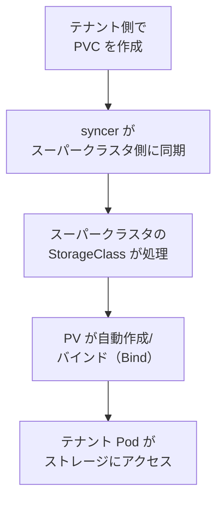
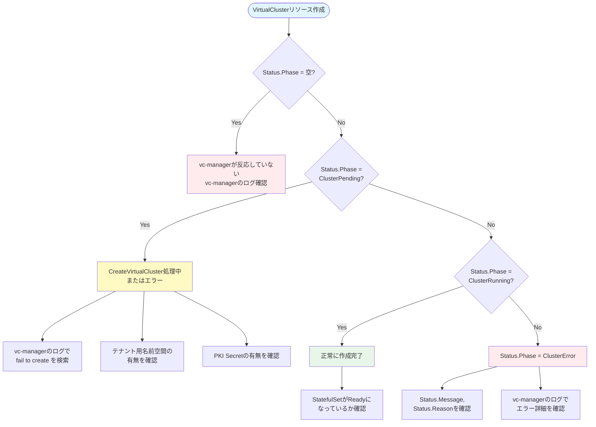

# k8s-virtual-cluster ロール

[VirtualCluster - Enabling Kubernetes Hard Multi-tenancy](https://github.com/kubernetes-retired/cluster-api-provider-nested/tree/main/virtualcluster) (
Kubernetes Virtual Cluster ) の基盤コンポーネントをデプロイするロールです。このロールは, Kubernetes API を仮想化し, 複数の論理的な Kubernetes クラスタを単一のKubernetes クラスタ上で動作させるための基盤を構築します。

## 用語

| 正式名称 | 略称 | 意味 |
| --- | --- | --- |
| Kubernetes | K8s | コンテナを管理する基盤ソフトウエア。 |
| Application Programming Interface | API | 他の仕組みから機能を呼び出すための窓口。 |
| CustomResourceDefinition | CRD | Kubernetes に独自のリソース型を追加する仕組み。 |
| Role Based Access Control | RBAC | 権限を役割単位で制御する仕組み。 |
| Transport Layer Security | TLS | 通信を暗号化する仕組み。 |
| Domain Name System | DNS | 名前と IP アドレスを対応付ける仕組み。 |
| etcd | etcd | Kubernetes の設定情報と状態を保存する分散キーバリューストア。 |
| kube-apiserver | kube-apiserver | Kubernetes API サーバー, API リクエストを受け付けて処理するコンポーネント。 |
| kube-controller-manager | kube-controller-manager | Kubernetes コントローラーマネージャー, リソースの状態を監視して制御するコンポーネント。 |
| kubectl | kubectl | Kubernetes クラスタを操作するコマンドラインツール。API サーバーへのリクエストを送信し, リソースの作成・更新・削除・確認を行う。 |
| コントロールプレーンノード ( Control Plane Node ) | コントロールプレーンノード | Kubernetes コントロールプレーンコンポーネント(API サーバー, スケジューラー, コントローラーマネージャー, etcd など)が動作し, , クラスタ全体の制御と調整を行うノード。|
| ワーカーノード ( Worker Node ) | ワーカーノード | Kubernetes クラスタで実際にアプリケーション(ポッド ( Pod ))が実行されるノード。kubelet と呼ばれるエージェントが動作し, コントロールプレーンからの指示に基づいてコンテナを実行管理する。 |
| コンテナ ( Container ) | コンテナ | アプリケーションと依存関係を一つのパッケージ化したもの。軽量で, どの環境でも一貫して実行可能。 |
| ポッド ( Pod ) | Pod | Kubernetes の最小デプロイメント単位。1 個以上のコンテナ ( Container ) で構成される実行環境。ポッド ( Pod ) 内のすべてのコンテナ ( Container ) は共有ネットワーク(共用 IP・ポート), 共有ストレージによって密接に結合され, 同一ノード上で常に共存・同期スケジュール される。 |
| デプロイメント ( Deployment ) | Deployment | Kubernetes リソース。ステートレスなアプリケーション向け。複数のレプリカ(ポッド ( Pod ) の複製)を管理し, 水平スケーリング に対応。 |
| デーモンセット ( DaemonSet ) | DaemonSet | Kubernetes リソース。Kubernetes クラスタ内の全ノード(またはフィルタ条件を満たすノード)に 1 つのポッド ( Pod ) を配置するリソース。監視やログ収集に適す。 |
| ステートレス ( Stateless ) | ステートレス | アプリケーションの性質を表す用語で，アプリケーションから使用される各種データの状態を永続記憶(ストレージ)に保持しなくとも，動作可能なアプリケーションであることを示す。 |
| ステートフル ( Stateful ) | ステートフル | アプリケーションの性質を表す用語で，アプリケーションから使用される各種データの状態を永続記憶(ストレージ)に保持することを前提として動作するアプリケーションであることを示す。 |
| サービス ( Service ) | Service | Kubernetes リソース。ポッド ( Pod ) へのネットワークアクセスを定義。仮想 IP を提供してトラフィックをルーティング。 |
| PersistentVolume | PV | Kubernetes リソース。クラスタ内の永続ストレージを表すリソース。ボリュームのサイズ, アクセスモード, 回収ポリシー, バックエンド(ローカルストレージ, NFS, ブロック型ストレージなど)を定義。 |
| PersistentVolumeClaim | PVC | Kubernetes リソース。ポッド ( Pod ) がストレージを利用する際の要求リソース。必要なストレージ容量, アクセスモードを指定し, Kubernetes のコントローラーが対応する PersistentVolume にバインドする。 |
| StorageClass | - | Kubernetes リソース。永続ストレージのプロビジョニング方法を定義するリソース。プロビジョナー(ローカルストレージプロビジョナー, AWS EBS, NFS など)とパラメータを指定し, PersistentVolumeClaim の要求に基づいて動的に PersistentVolume を作成する。 |
| バインド ( Bind ) | - | Kubernetes ストレージレイヤーにおける処理。PersistentVolumeClaim の要求条件(容量, アクセスモード)が PersistentVolume の仕様と合致した場合, Kubernetes のコントローラーが両者を紐付ける。バインド後, ポッドは PVC 経由で PV のストレージを利用できるようになる。 |
| プロビジョニング ( Provisioning ) | - | Kubernetes ストレージレイヤーにおける処理。StorageClass で定義されたプロビジョナーが, PersistentVolumeClaim の要求に応じて新しい PersistentVolume を自動的に作成するプロセス。動的プロビジョニングにより, ユーザーが個別に PV を作成する手間を削減できる。静的プロビジョニング(管理者が事前に PV を作成)に対応する概念。 |
| プロビジョナー ( Provisioner ) | - | Kubernetes ストレージスタックのコンポーネント。StorageClass で指定し, PersistentVolumeClaim の要求に基づいて PersistentVolume を自動作成する。実装にはローカルストレージプロビジョナー, AWS EBS CSI ドライバー, NFS などが存在。 |
| emptyDir | - | Kubernetes ボリュームタイプ。ポッドがノードに割り当てられた時に作成される一時的なボリューム。ポッドが存在する限りデータが保持され, ポッド削除時にデータが失われる。開発環境での一時データ保存や Pod 内のコンテナ間でのファイル共有に使用。 |
| コンフィグマップ ( ConfigMap ) | ConfigMap | Kubernetes リソース。設定データをキー・バリューペアで保存し, 非機密情報を管理。 |
| シークレット ( Secret ) | Secret | Kubernetes リソース。パスワード, API キー, 証明書などの機密データを暗号化して安全に保存・管理。 |
| 仮想クラスタ ( Virtual Cluster ) | Virtual Cluster | Kubernetes API を仮想化して提供する論理的な Kubernetes クラスタ。 |
| スーパークラスタ ( Super Cluster ) | Super Cluster | 仮想クラスタ ( Virtual Cluster ) を動作させるホスト側の物理 Kubernetes クラスタ。 |
| Kubernetesのデプロイメント | - | Kubernetes を用いて, アプリケーションプロセスやリソースを配置, 展開, 管理するための操作を意味する。Kubernetes の配置・管理における最小実行単位は, ポッド ( Pod ) となる。 |
| テナント ( Tenant ) | テナント | 互いに独立した Kubernetes コントロールプレーンを持つ論理的な利用者またはチーム。各テナントについて, 専用の仮想クラスタ ( Virtual Cluster ) が割り当てられ, テナントに割り当てられた仮想クラスタ ( Virtual Cluster ) 内のリソース (名前空間, CRD) を他のテナントに影響を与えずに作成できる。物理リソース (ノード) をスーパークラスタ ( Super Cluster ) を通じて他のテナントと共有し, かつ, 仮想リソース (Kubernetes のリソース) は, Kubernetes のコントロールプレーンレベルで分離される。 |
| vc-manager ( Virtual Cluster Manager ) | vc-manager | 仮想クラスタ ( Virtual Cluster ) の制御コンポーネント。スーパークラスタ ( Super Cluster ) 上で仮想クラスタ ( Virtual Cluster ) の管理を行う。 |
| vc-syncer ( Virtual Cluster Syncer ) | vc-syncer | 仮想クラスタ ( Virtual Cluster ) とスーパークラスタ ( Super Cluster ) の状態を同期するコンポーネント。 |
| vn-agent ( Virtual Node Agent ) | vn-agent | ワーカーノード上で仮想クラスタ ( Virtual Cluster ) の通信を中継するエージェント。 |
| webhook | webhook | Kubernetes API 拡張機構。vc-manager では VirtualCluster リソースの検証と変更時の操作を行う際に使用される。 |
| Debian Bookworm Slim | debian:bookworm-slim | Dockerイメージ作成時に使用するDebian 12 (Bookworm)の軽量ベースイメージ。 |
| 名前空間 | namespace | Kubernetes におけるリソースのグループ化と分離の仕組み。 |

## 前提条件

- Kubernetes クラスタが稼働していること。目安は v1.22 以上です。
- `kubectl` コマンドが利用可能であること。
- `k8s-common` と `k8s-ctrlplane` ロールが事前に実行済みであること。
- 仮想クラスタ ( Virtual Cluster ) のコンポーネントは実験環境向けの実装です。
- ビルドノード(デフォルトはAnsibleの制御ノード(localhost), `virtualcluster_build_host`で変更可能)に以下がインストールされていること:
  - Go (バージョン 1.16以上推奨)
  - Make
  - Docker
- Ansibleの制御ノード(localhost)からワーカーノード ( Worker Node ) へAnsible経由で接続可能であること (inventory/hostsまたは動的に検出)。
- ワーカーノード ( Worker Node ) が containerd を使用していること。
- `virtualcluster_auto_detect_supercluster_images: true` (既定値)の場合, Ansible制御ノードから `kubectl` でスーパークラスタに疎通可能であること。

### 永続ストレージに関する前提条件

etcd の永続ストレージを有効にする場合 (`vcinstances_etcd_storage_enabled: true`), スーパークラスタ側で以下の準備が必要です:

1. **StorageClass の存在確認**:
   ```bash
   kubectl get storageclass
   ```
   出力例:
   ```plaintext
   NAME              PROVISIONER       RECLAIMPOLICY   VOLUMEBINDINGMODE   ALLOWVOLUMEEXPANSION   AGE
   fast-ssd          ebs.csi.aws.com   Delete          WaitForFirstConsumer false                  30d
   default (default) kubernetes.io/aws-ebs Delete       WaitForFirstConsumer false                  30d
   ```

2. **デフォルト StorageClass の設定**:
   存在しない場合は, ローカルストレージやCSI プロバイダーなどから StorageClass を作成してください。
   ```bash
   kubectl apply -f - <<EOF
   apiVersion: storage.k8s.io/v1
   kind: StorageClass
   metadata:
     name: local-storage
   provisioner: kubernetes.io/no-provisioner
   volumeBindingMode: WaitForFirstConsumer
   EOF
   ```

**注意**: 本番環境では, データベースの永続化やステートフルアプリケーション対応のため, 専用の StorageClass を準備することを強く推奨します。
  - Docker
- Ansibleの制御ノード(localhost)からワーカーノード ( Worker Node ) へAnsible経由で接続可能であること (inventory/hostsまたは動的に検出)。
- ワーカーノード ( Worker Node ) が containerd を使用していること。
- `virtualcluster_auto_detect_supercluster_images: true` (既定値)の場合, Ansible制御ノードから `kubectl` でスーパークラスタに疎通可能であること。

## 概要

仮想クラスタ ( Virtual Cluster ) により, ホスト Kubernetes クラスタ(以下, スーパークラスタ ( Super Cluster ))上で複数のテナント ( Tenant ) 向けコントロールプレーンノード ( Control Plane Node ) を独立して運用できます。各テナント ( Tenant ) のコントロールプレーン ( Control Plane Node ) はスーパークラスタ ( Super Cluster ) のワーカーノード ( Worker Node ) を共有しながら, API レベルの分離を実現します。

### デプロイされるコンポーネント

本ロールは以下の3つの主要コンポーネントをデプロイします:

1. **vc-manager (Virtual Cluster Manager)**
   - VirtualClusterリソースを監視し, テナント ( Tenant ) に割り当てられた仮想クラスタ ( Virtual Cluster ) のライフサイクルを管理します。
   - Webhook検証によりVirtualClusterリソースの整合性を保証します。
   - Deployment形式でデプロイされ, `vc-manager` 名前空間内で動作します。

2. **vc-syncer (Virtual Cluster Syncer)**
   - 仮想クラスタ ( Virtual Cluster ) とスーパークラスタ ( Super Cluster ) の状態を同期するコンポーネントです。
   - テナント ( Tenant ) に割り当てられた仮想クラスタ ( Virtual Cluster ) のリソース(Pod, Service, ConfigMap等)をスーパークラスタ ( Super Cluster ) 上の実体と関連付けます。
   - Deployment形式でデプロイされ, `vc-manager` 名前空間内で動作します。
   - 広範なRBAC権限(namespaces, nodes, persistentvolumes, storageclasses等への読み書き)を持ちます。

3. **vn-agent (Virtual Node Agent)**
   - ワーカーノード ( Worker Node ) 上で仮想クラスタ ( Virtual Cluster ) の通信を中継するエージェントです。
   - DaemonSet形式でデプロイされ, コントロールプレーンノード ( Control Plane Node ) を除く全ワーカーノード ( Worker Node ) で動作します。

## 実行フロー

1. `validate.yml` で前提条件と API 疎通を検証します。
2. `detect-supercluster-images.yml` でスーパークラスタから稼働中のetcd, kube-apiserver, kube-controller-managerのイメージを自動検出します（デフォルト, `virtualcluster_auto_detect_supercluster_images: true` の場合）。
3. `cleanup.yml` でクリーンビルド時に既存リソースを削除します（`virtualcluster_clean_build: true` の場合）:
   - VirtualClusterインスタンス削除  =>  テナント名前空間消滅待機  =>  ClusterVersionインスタンス削除  =>  vc-manager名前空間削除  =>  CRD削除の順で実行します。
4. `namespace.yml` で `vc-manager` の名前空間を作成します。
5. `crd.yml` で ClusterVersion と VirtualCluster の CRD を登録します。
6. `virtualcluster_build_from_source: true` の場合:
   - `download-source.yml` でソースリポジトリをクローン/更新します（`virtualcluster_clean_build: true` の場合は `force: true` でローカル変更を破棄）。
   - `patch-provisioner.yml`, `patch-virtualcluster-types.yml`, `patch-kubeconfig.yml`, `patch-service-mutate.yml` で4つのunified diff形式パッチを適用します。
   - `build-binaries.yml` で `make build-images` を実行してバイナリをビルドします。
   - `build-kubectl-vc.yml` でkubectl-vcプラグインをビルドします（`virtualcluster_build_kubectl_vc: true` の場合）。
   - `build-docker-images.yml` でDockerイメージをビルドしてtarファイルに保存します。
   - `fetch-images.yml` でビルドノードからAnsibleの制御ノード(localhost)へtarファイルを取得します。
7. `upload-to-ctrlplane.yml` でコントロールプレーンノードへイメージをアップロードします。
8. `distribute-to-workers.yml` でワーカーノード ( Worker Node ) へイメージを配布します:
   - `kubectl get nodes` で実際のワーカーノード ( Worker Node ) リストを取得します。
   - コントロールプレーンノード ( Control Plane Node ) からAnsibleの制御ノード(localhost)へイメージをfetchします。
   - Ansibleの制御ノード(localhost)から各ワーカーノード ( Worker Node ) へイメージをcopyします。
   - 各ワーカーで `ctr -n k8s.io images import` を実行します。
9. `deploy-manager.yml` で vc-manager, vc-syncer, vn-agent をデプロイします。
10. `verify.yml` で CRD と Pod 起動を確認します。

## コンテナイメージ作成と配布の流れ

以下の`<component>`には`virtualcluster_build_components`の各要素を指し, 既定では`manager`, `syncer`, `vn-agent`が入ります。

- `virtualcluster_source_repo`を`virtualcluster_build_host`上の`virtualcluster_source_dir`へクローンまたは更新します。
- `make build-images`でバイナリを生成します。
- 生成したバイナリから, `debian:bookworm-slim`をベースにDockerイメージを作成し, `virtualcluster/<component>-amd64:latest`でタグ付けします。
- ビルドノード上で`docker save`により`/tmp/vc_<component>-amd64.tar`を作成します。
- `fetch-images.yml`でビルドノードからAnsibleの制御ノード(localhost)へtarファイルを転送します。
- `upload-to-ctrlplane.yml`でAnsibleの制御ノード(localhost)からコントロールプレーンノード ( Control Plane Node ) へtarファイルを転送します。
- `distribute-to-workers.yml`で`kubectl get nodes`により`virtualcluster_supercluster_kubeconfig_path`でK8sクラスタ(スーパークラスタ)のワーカーノード一覧を取得します。
- コントロールプレーンノード ( Control Plane Node ) からAnsibleの制御ノード(localhost)へ`fetch`モジュールでtarファイルを転送します。
- Ansibleの制御ノード(localhost)から各ワーカーノード ( Worker Node ) へ`copy`モジュールでtarファイルを転送し, 各ワーカーで`ctr -n k8s.io images import`によりイメージを取り込みます。

### ソース取得からコンテナイメージ作成配布処理中での排他制御について

複数の`k8s_management`ホストが存在する場合でも, 以下は`run_once: true`で1回のみ実行されます。

- ソース取得: `download-source.yml`。
- バイナリ作成: `build-binaries.yml`。
- Dockerイメージ作成とtar出力: `build-docker-images.yml`。
- Ansibleの制御ノード(localhost)への取得とクリーンアップ: `fetch-images.yml`。
- コントロールプレーンへの転送: `upload-to-ctrlplane.yml`。
- ワーカーノードへの配布とクリーンアップ: `distribute-to-workers.yml`。

## 主要変数

| 変数名 | 既定値 | 説明 |
| --- | --- | --- |
| `k8s_virtualcluster_enabled` | `false` | ロールを実行するかどうかを指定します。 |
| `virtualcluster_build_from_source` | `true` | ソースからビルドするか(true), 既存バイナリ/イメージを使用するか(false)を指定します。 |
| `virtualcluster_auto_detect_supercluster_images` | `true` | スーパークラスタから稼働中のetcd, kube-apiserver, kube-controller-managerイメージを動的に検出するかどうか。既定: true。falseの場合は`registry.k8s.io/etcd:<スーパークラスタのETCDメジャーバージョン.マイナーバージョン>.0`等のフォールバック値を使用します。運用環境では自動検出により, バージョンズレを防止できます。 |
| `virtualcluster_build_host` | `"localhost"` | ビルドを実行するホストを指定します (既定: Ansibleの制御ノード)。Docker/Go/Makeがインストール済みである必要があります。 |
| `virtualcluster_source_repo` | `"https://github.com/kubernetes-retired/cluster-api-provider-nested"` | [VirtualCluster - Enabling Kubernetes Hard Multi-tenancy](https://github.com/kubernetes-retired/cluster-api-provider-nested/tree/main/virtualcluster) のソースリポジトリURLです。 |
| `virtualcluster_source_version` | `"main"` | クローンするバージョン/ブランチ/タグです。 |
| `virtualcluster_source_dir` | `"/tmp/cluster-api-provider-nested"` | ソースのダウンロード先ディレクトリです (既定: `/tmp/cluster-api-provider-nested`)。 |
| `virtualcluster_build_components` | `['manager', 'syncer', 'vn-agent']` | ビルド対象コンポーネントのリストです。 |
| `virtualcluster_build_timeout` | `1800` | ビルドタイムアウト(秒)です。 |
| `virtualcluster_local_cache_dir` | `"{{ lookup('env', 'HOME') }}/.ansible/vc-images-cache"` | Ansibleの制御ノード(localhost)上のイメージキャッシュディレクトリです (既定: `~/.ansible/vc-images-cache`)。 |
| `virtualcluster_ctrlplane_cache_dir` | `"/tmp/vc-images"` | コントロールプレーン上のイメージキャッシュディレクトリです (既定: `/tmp/vc-images`)。 |
| `virtualcluster_namespace` | `"vc-manager"` | 仮想クラスタ ( Virtual Cluster ) 管理コンポーネントを展開する名前空間です。 |
| `virtualcluster_config_dir` | `"{{ k8s_kubeadm_config_store }}/virtual-cluster"` | マニフェストの出力先です (既定: `~/kubeadm/virtual-cluster`)。 |
| `virtualcluster_supercluster_kubeconfig_path` | `"/etc/kubernetes/admin.conf"` | K8sクラスタ(スーパークラスタ)操作に使用するkubeconfigのパスです。 |
| `virtualcluster_manager_image` | `"virtualcluster/manager-amd64:latest"` | vc-manager のイメージです。 |
| `virtualcluster_syncer_image` | `"virtualcluster/syncer-amd64:latest"` | syncer のイメージです。 |
| `virtualcluster_vn_agent_image` | `"virtualcluster/vn-agent-amd64:latest"` | vn-agent のイメージです。 |
| `virtualcluster_pod_resource_requests.cpu` | `"500m"` | vc-manager の CPU リクエストです。 |
| `virtualcluster_pod_resource_requests.memory` | `"512Mi"` | vc-manager のメモリリクエストです。 |
| `virtualcluster_pod_resource_limits.cpu` | `"1000m"` | vc-manager の CPU リミットです。 |
| `virtualcluster_pod_resource_limits.memory` | `"1Gi"` | vc-manager のメモリリミットです。 |
| `virtualcluster_clean_build` | `true` | クリーンビルド有効化フラグです。trueの場合, 既存のVirtualCluster/テナント名前空間/ClusterVersion/CRD等を削除してから再構築します。 |
| `virtualcluster_tenant_ns_wait_timeout` | `60` | クリーンビルド時にテナント名前空間の消滅を待機する最大時間(秒)です。 |
| `virtualcluster_tenant_ns_wait_delay` | `5` | クリーンビルド時にテナント名前空間の消滅を確認するポーリング間隔(秒)です。 |
| `k8s_api_wait_host` | `"{{ k8s_ctrlplane_endpoint }}"` | API サーバの待ち受け先です。 |
| `k8s_api_wait_port` | `"{{ k8s_ctrlplane_port }}"` | API サーバの待ち受けポートです。  (規定: `6443`)|
| `virtualcluster_persistent_volumes` | `[]` | 作成するPVのリストです。定義されている場合, 指定されたPVを自動作成します(詳細は「PersistentVolume 設定例」を参照)。 |

## 設定例

```yaml
# host_vars/k8sctrlplane01.local
k8s_virtualcluster_enabled: true

# ソースからビルドする場合
virtualcluster_build_from_source: true
virtualcluster_build_host: "localhost"  # Ansibleの制御ノード(localhost)またはリモートビルドサーバー

# 既存イメージを使用する場合
# virtualcluster_build_from_source: false

# クリーンビルド設定 (デフォルト: true)
virtualcluster_clean_build: true  # 既存リソースを削除してから構築
virtualcluster_tenant_ns_wait_timeout: 60  # テナント名前空間消滅待機時間 (秒)
virtualcluster_tenant_ns_wait_delay: 5  # テナント名前空間消滅確認のポーリング間隔 (秒)

virtualcluster_pod_resource_requests:
  cpu: "1000m"
  memory: "1Gi"
virtualcluster_pod_resource_limits:
  cpu: "2000m"
  memory: "2Gi"
```

### PersistentVolume 設定例

host_vars で `virtualcluster_persistent_volumes` を定義することで, 任意のPVを作成できます。この機能は汎用的で, etcd 以外にも任意の用途のPVを作成できます。

```yaml
# host_vars/k8sctrlplane01.local

# PersistentVolume を作成する場合 (オプション)
virtualcluster_persistent_volumes:
  - name: "pv-etcd-tenant-alpha"
    capacity: "10Gi"
    storage_class: "default-sc"
    host_path: "/mnt/etcd-data/tenant-alpha"
    node_name: "k8sworker0101"
    access_modes: ["ReadWriteOnce"]
    reclaim_policy: "Delete"
    labels:
      type: "local"
      purpose: "etcd"
      tenant: "tenant-alpha"

  - name: "pv-etcd-tenant-beta"
    capacity: "10Gi"
    storage_class: "default-sc"
    host_path: "/mnt/etcd-data/tenant-beta"
    node_name: "k8sworker0102"
    access_modes: ["ReadWriteOnce"]
    reclaim_policy: "Delete"
    labels:
      type: "local"
      purpose: "etcd"
      tenant: "tenant-beta"
```

`virtualcluster_persistent_volumes` は「辞書のリスト」です。各要素(1つの `- ...` ブロック)が1つの PersistentVolume 定義を表します。

| キー | 必須 | 設定する内容 | 設定例 | 既定値 |
| --- | --- | --- | --- | --- |
| `name` | 必須 | 作成する PersistentVolume 名。未設定の場合は当該エントリを無効としてスキップし, 他の有効エントリの処理を継続します。 | `pv-etcd-tenant-alpha` | なし |
| `capacity` | 必須 | PV の容量。Kubernetes Quantity 形式で指定。未設定の場合は当該エントリを無効としてスキップし, 他の有効エントリの処理を継続します。 | `10Gi` | なし |
| `storage_class` | 任意 | 紐付ける StorageClass 名。 | `default-sc` | `local-storage` |
| `host_path` | 必須 | ワーカーノード上のローカルパス。未設定の場合は当該エントリを無効としてスキップし, 他の有効エントリの処理を継続します。 | `/mnt/etcd-data/tenant-alpha` | なし |
| `node_name` | 必須 | PV をバインド（Bind）するノード名。未設定の場合は当該エントリを無効としてスキップし, 他の有効エントリの処理を継続します。 | `k8sworker0101` | なし |
| `access_modes` | 任意 | アクセスモードの配列。 | `["ReadWriteOnce"]` | `["ReadWriteOnce"]` |
| `reclaim_policy` | 任意 | 削除時の回収ポリシー。 | `Delete` | `Delete` |
| `labels` | 任意 | PV に付与するラベル辞書。未設定の場合はテンプレートで `type: local` ラベルのみ付与されます。 | `{ type: "local", purpose: "etcd" }` | なし |
| `mode` | 任意 | `host_path` 作成時のパーミッション。 | `0755` | `0755` |
| `owner` | 任意 | `host_path` 作成時の所有ユーザー。 | `root` | `root` |
| `group` | 任意 | `host_path` 作成時の所有グループ。 | `root` | `root` |

**注意**: etcd用のPVは, `k8s-vc-instances` ロールが作成します。このため, etcd用のPV設定を`virtualcluster_persistent_volumes`に記載する必要はありません。本設定は `k8s-virtual-cluster` ロール単独で使用する場合や, etcd 以外の用途のPVを作成する場合に使用します。

## 実行方法

```bash
make run_k8s_virtual_cluster
```

または,

```bash
# k8s-management.yml を実行
ansible-playbook k8s-management.yml

# 特定ホストのみ対象
ansible-playbook k8s-management.yml -l k8sctrlplane01.local

# 仮想クラスタ ( Virtual Cluster ) タスクのみ実行
ansible-playbook k8s-management.yml -t k8s-virtual-cluster
```

## 主な処理

### クリーンビルド処理 (`virtualcluster_clean_build: true` の場合)

以下の順序で既存リソースを削除します:

1. **VirtualClusterインスタンス削除**: `kubectl delete virtualclusters.tenancy.x-k8s.io --all -n vc-manager --wait=true --timeout=120s`
2. **テナント名前空間消滅待機**: パターン `vc-manager-*` の名前空間が消滅するまで最大 `virtualcluster_tenant_ns_wait_timeout` 秒待機 (ポーリング間隔: `virtualcluster_tenant_ns_wait_delay` 秒)
3. **ClusterVersionインスタンス削除**: `kubectl delete clusterversions.tenancy.x-k8s.io --all --wait=true --timeout=60s`
4. **vc-manager名前空間削除**: `kubectl delete namespace vc-manager --wait=true --timeout=120s`
5. **CRD削除**: `virtualclusters.tenancy.x-k8s.io` と `clusterversions.tenancy.x-k8s.io` を削除

### ビルドとデプロイ処理

- ソースリポジトリからのクローンとビルド(オプション, `virtualcluster_build_from_source: true` の場合)。
  - `virtualcluster_clean_build: true` の場合, `git clone/pull` 時に `force: true` でローカル変更を破棄します。
- **ソースコードパッチ適用**: `ansible.posix.patch` モジュールでunified diff形式のパッチを適用します(詳細は後述)。
- ビルドノードでDockerイメージをビルドしてtarファイルに保存。
- ビルドノード  =>  Ansibleの制御ノード(localhost)  =>  コントロールプレーンノードへの転送。
- コントロールプレーンノードで `kubectl get nodes` から実際のワーカーノード ( Worker Node ) リストを取得。
- SSH経由で各ワーカーノード ( Worker Node ) へイメージを配布し, `ctr -n k8s.io` で取り込み。
- CRD の生成と登録を行います。
- **PersistentVolume の準備** (オプション, `prepare-persistent-volumes.yml`): `virtualcluster_persistent_volumes` が host_vars で定義されている場合, 指定されたPVを作成します。ワーカーノード上にディレクトリを作成し, local-storage タイプの PV を生成します。この機能は汎用的で, etcd 以外にも任意の用途のPVを作成できます。
- vc-manager, vc-syncer, vn-agent のマニフェストを生成して apply します。
- vc-manager の webhook 用証明書をコンテナ内で生成できるように, `/tmp/k8s-webhook-server` を書き込み可能な `emptyDir` で提供します。
- vc-manager の RBAC に `admissionregistration.k8s.io` と `coordination.k8s.io` の権限を付与します。
- vc-manager Pod に `virtualcluster-webhook: "true"` ラベルを付与し, vc-managerが動的に作成するwebhook serviceのselectorと一致させます。
- vc-manager の webhook は 9443 ポートでリッスンし, containerPort もこれに合わせて設定されます。
- vn-agent はコントロールプレインノードを除外します。

### パッチ適用詳細

本ロールでは, cluster-api-provider-nestedのソースコードに対して以下のパッチを適用します。パッチ適用には `ansible.posix.patch` モジュール(unified diff形式)を使用します。

| パッチファイル | 対象ファイル | 修正内容 |
|--------------|------------|----------|
| `provisioner_native.patch` | `virtualcluster/pkg/controller/controllers/provisioner/provisioner_native.go` | 1. `os`パッケージのimport追加<br>2. `genInitialClusterArgs`関数にschemeパラメータ追加<br>3. 環境変数`VIRTUALCLUSTER_ETCD_SCHEME`からスキーム取得 (デフォルト: https)<br>4. etcd `--initial-cluster`のURL形式を`scheme://...`に変更<br>5. controller-managerのService名前空間nilチェック追加 |
| `virtualcluster_types.patch` | `virtualcluster/pkg/apis/tenancy/v1alpha1/virtualcluster_types.go` | `ClusterError`定数の値を`"Error"`から`"Failed"`に変更<br>(CRD定義でphaseの許可値に"Failed"が含まれているが"Error"が含まれていない不一致を修正) |
| `kubeconfig.patch` | `virtualcluster/pkg/controller/kubeconfig/kubeconfig.go` | `generateKubeconfigUseCertAndKey`関数で`net.ParseIP`が`nil`を返す場合 (=ドメイン名) の処理を追加<br>IPv6形式の`[domain]:6443`ではなく通常の`https://domain:6443`形式を使用するように修正 |
| `service_mutate.patch` | `virtualcluster/pkg/syncer/conversion/mutate.go` | `serviceMutator.Mutate`メソッドで`ClusterIP`を空にする際に`ClusterIPs`を空配列`[]string{}`に設定していた問題を修正<br>Kubernetes v1.20以降の検証ルール("clusterIPが未設定の場合clusterIPsもnil"の要求)に準拠するため`ClusterIPs = nil`に変更<br>これによりテナント ( Tenant ) に割り当てられた仮想クラスタ ( Virtual Cluster ) の`default/kubernetes` Serviceの同期エラーを解消 |

**パッチ適用パラメータ**:
- `strip: 1`: unified diffの`a/`, `b/`プレフィックスを除去
- `basedir: "{{ virtualcluster_source_dir }}"`: パッチ適用のベースディレクトリ(デフォルト: `/tmp/cluster-api-provider-nested`)

**冪等性**: `ansible.posix.patch`モジュールは既にパッチが適用済みの場合, 変更なし(`changed=False`)と判定します。

## テンプレートと生成ファイル

以下の表中の~(チルダ記号)は, ansibleアカウントでログイン時のホームディレクトリ(規定: `/home/ansible`)を意味します。

| テンプレート | 出力先 | 説明 |
| --- | --- | --- |
| `templates/namespace.yaml.j2` | `{{ virtualcluster_config_dir }}/namespace.yaml` (既定: `~/kubeadm/virtual-cluster/namespace.yaml`) | 名前空間定義です。 |
| `templates/clusterversion-crd.yaml.j2` | `{{ virtualcluster_config_dir }}/clusterversion-crd.yaml` (既定: `~/kubeadm/virtual-cluster/clusterversion-crd.yaml`) | ClusterVersion CRD です。 |
| `templates/virtualcluster-crd.yaml.j2` | `{{ virtualcluster_config_dir }}/virtualcluster-crd.yaml` (既定: `~/kubeadm/virtual-cluster/virtualcluster-crd.yaml`) | VirtualCluster CRD です。 |
| `templates/all-in-one.yaml.j2` | `{{ virtualcluster_config_dir }}/all-in-one.yaml` (既定: `~/kubeadm/virtual-cluster/all-in-one.yaml`) | vc-manager, syncer, vn-agent のマニフェストです。 |

## 生成されるリソース

| リソース | 説明 |
| --- | --- |
| `Namespace: vc-manager` | 管理コンポーネント用名前空間です。 |
| `CustomResourceDefinition` | `virtualclusters.tenancy.x-k8s.io` を登録します。 |
| `CustomResourceDefinition` | `clusterversions.tenancy.x-k8s.io` を登録します。 |
| `Deployment: vc-manager` | 仮想クラスタ ( Virtual Cluster ) の管理コンポーネントです。 |
| `Deployment: vc-syncer` | 仮想クラスタ ( Virtual Cluster ) とスーパークラスタ ( Super Cluster ) の状態を同期するコンポーネントです。 |
| `DaemonSet: vn-agent` | ワーカーノード ( Worker Node ) の kubelet API プロキシです。 |

## 永続ストレージ対応

### etcd の永続ストレージ

本ロールでは, 仮想クラスタ ( Virtual Cluster ) の etcd をスーパークラスタ ( Super Cluster ) の PersistentVolume (PV) に永続化することが可能です。

#### 設定方法

`host_vars` で以下の変数を設定してください:

```yaml
# host_vars/k8sctrlplane01.local
# etcd 永続ストレージ設定
vcinstances_etcd_storage_enabled: true  # 永続ストレージ有効化 (デフォルト: true)
vcinstances_etcd_storage_size: "10Gi"   # PVC サイズ (デフォルト: 10Gi)
vcinstances_etcd_storage_class: "default-sc"  # StorageClass 名 (デフォルト: "" = デフォルト SC 使用)
```

**設定例** (デフォルト SC を使用する場合):
```yaml
vcinstances_etcd_storage_enabled: true
# vcinstances_etcd_storage_size と vcinstances_etcd_storage_class は省略可能 (デフォルト値が適用)
```

#### 動作原理

- `vcinstances_etcd_storage_enabled: true` の場合, etcd の StatefulSet に `volumeClaimTemplates` が自動追加されます
- 各テナント用仮想クラスタ ( Virtual Cluster ) の etcd Pod は専用 PVC(`etcd-data-etcd-0`) を自動作成
- 割り当てられた PV にバインド（Bind）され, etcd のデータが永続化されます
- `emptyDir` と異なり, Pod の再起動後もデータが保持されます

#### 注意点

- **StorageClass 要件**: スーパークラスタ側に StorageClass が存在する必要があります
  ```bash
  kubectl get storageclass
  ```
- **容量計画**: etcd のデータサイズに応じて `vcinstances_etcd_storage_size` を調整してください
- **クリーンビルド時**: `virtualcluster_clean_build: true` の場合, VirtualCluster インスタンスが削除されると対応する PVC も削除されます

### テナント内での PVC/PV/StorageClass 利用

テナント ( Tenant ) に割り当てられた仮想クラスタ ( Virtual Cluster ) では, テナント側で PersistentVolumeClaim (PVC) を作成し, スーパークラスタ ( Super Cluster ) のストレージを使用することが可能です。

#### 前提条件

1. **Syncer の feature gate 有効化** (本ロールで自動設定):
   - `SyncTenantPVCStatusPhase=true`: テナント側 PVC の Phase (Pending/Bound) を同期

2. **StorageClass のラベル設定** (スーパークラスタ側で手動設定):
   - テナント側から参照可能にするため, `PublicObjectKey=true` ラベルを付与
   ```bash
   # スーパークラスタで実行
   kubectl label storageclasses default PublicObjectKey=true
   kubectl label storageclasses fast-ssd PublicObjectKey=true  # (あれば)
   ```

#### 利用パターン

**パターン1: デフォルト StorageClass を使用**

```yaml
apiVersion: v1
kind: PersistentVolumeClaim
metadata:
  name: app-data
spec:
  accessModes:
    - ReadWriteOnce
  resources:
    requests:
      storage: 5Gi
---
apiVersion: v1
kind: Pod
metadata:
  name: app-pod
spec:
  containers:
  - name: app
    image: busybox
    volumeMounts:
    - name: data
      mountPath: /data
  volumes:
  - name: data
    persistentVolumeClaim:
      claimName: app-data
```

**パターン2: 特定の StorageClass を指定**

```yaml
apiVersion: v1
kind: PersistentVolumeClaim
metadata:
  name: fast-app-data
spec:
  storageClassName: fast-ssd  # ラベル付き SC を指定
  accessModes:
    - ReadWriteOnce
  resources:
    requests:
      storage: 10Gi
```

#### 動作フロー



#### 制限事項と注意点

| 項目 | 制限 | 対処 |
|------|------|------|
| **PV の直接作成** | テナント側では不可 | StorageClass を通じて PVC から自動作成 |
| **StorageClass の可視性** | `PublicObjectKey=true` ラベル付きのみ | スーパークラスタで SC にラベルを付与 |
| **マルチテナント分離** | 完全なストレージクォータなし | 運用の RBAC で予めテナント namespace を制限 |
| **クロステナント PVC** | 他テナントの PVC にはアクセス不可 | namespace 分離で自動的に実現 |
| **PVC status 同期** | Phase sync が必須 | feature gate により自動有効化 |

#### 検証手順

```bash
# 1. syncer の feature gate を確認
kubectl -n vc-manager describe deployment vc-syncer | grep feature-gates

# 2. スーパークラスタで StorageClass にラベルを付与
kubectl label storageclasses default PublicObjectKey=true --overwrite

# 3. テナント側で PVC を作成
TENANT_NS=$(kubectl get virtualclusters -n vc-manager <vc-name> -o jsonpath='{.status.clusterNamespace}')
cat <<EOF | kubectl -n $TENANT_NS apply -f -
apiVersion: v1
kind: PersistentVolumeClaim
metadata:
  name: test-pvc
spec:
  accessModes:
    - ReadWriteOnce
  resources:
    requests:
      storage: 5Gi
EOF

# 4. PVC が Bound 状態になったか確認 (同期に数秒かかる)
kubectl -n $TENANT_NS get pvc test-pvc
sleep 5
kubectl -n $TENANT_NS get pvc test-pvc

# 5. スーパークラスタ側でも PVC が同期されているか確認
kubectl -n $TENANT_NS get pvc test-pvc

# 6. PV が自動作成されているか確認
kubectl get pv
```

#### トラブルシューティング

**症状: PVC が Pending のままになっている**

```bash
# 1. StorageClass にラベルが付いているか確認
kubectl get storageclass -L PublicObjectKey

# 2. テナント側で参照可能な SC があるか確認
TENANT_NS=$(kubectl get virtualclusters -n vc-manager <vc-name> -o jsonpath='{.status.clusterNamespace}')
kubectl -n $TENANT_NS get storageclass

# 3. syncer のログで同期エラーを確認
kubectl -n vc-manager logs -l app=vc-syncer --tail=100 | grep -i pvc
```

**症状: syncer が PVC Status Phase を同期していない**

```bash
# feature gate が有効になっているか確認
kubectl -n vc-manager get deployment vc-syncer -o jsonpath='{.spec.template.spec.containers[0].args}' | grep -o 'feature-gates=[^ ]*'

# 期待する状態: feature-gates=SyncTenantPVCStatusPhase=true
# そうでない場合は, Deployment 再起動で反映されます
```

---

## 検証ポイント

以下の順で確認してください。

1. 名前空間の確認
   - 目的: `vc-manager` が作成されていることを確認します。
   - コマンド:
     ```bash
     kubectl get namespace vc-manager
     ```
   - 実行例:
     ```bash
     $ kubectl get namespace vc-manager
     NAME         STATUS   AGE
     vc-manager   Active   47m
     ```
2. CRD の確認
   - 目的: VirtualCluster と ClusterVersion の CRD が登録済みであることを確認します。
   - コマンド:
     ```bash
     kubectl get crd | grep virtualcluster
     kubectl get crd | grep clusterversion
     ```
   - 実行例:
     ```bash
     $ kubectl get crd | grep virtualcluster
     virtualclusters.tenancy.x-k8s.io                         2026-02-24T19:35:08Z
     $ kubectl get crd | grep clusterversion
     clusterversions.tenancy.x-k8s.io                         2026-02-24T19:35:07Z
     ```

2. ClusterVersion の確認
   - 目的: ClusterVersion CRDが登録され, ClusterVersionインスタンスが作成されていることを確認します。
   - コマンド:
     ```bash
     kubectl get clusterversions
     ```
   - 期待される出力:
     ```plaintext
     NAME          AGE
     cv-k8s-1-31   5m
     ```

3. Pod の確認
   - 目的: vc-manager, vc-syncer, vn-agent の Pod が Running であることを確認します。
   - コマンド:
     ```bash
     kubectl -n vc-manager get pods -o wide
     ```
   - 期待される出力:
     ```plaintext
     NAME                          READY   STATUS    RESTARTS   AGE   IP              NODE            NOMINATED NODE   READINESS GATES
     vc-manager-7997456c85-5wcfb   1/1     Running   0          50m   10.244.2.120    k8sworker0101   <none>           <none>
     vc-syncer-7ff87db54-md4q2     1/1     Running   0          50m   10.244.1.104    k8sworker0102   <none>           <none>
     vn-agent-9ltpf                1/1     Running   0          50m   192.168.30.43   k8sworker0102   <none>           <none>
     vn-agent-rd9w7                1/1     Running   0          50m   192.168.30.42   k8sworker0101   <none>           <none>
     ```

4. vc-syncer の確認
   - 目的: vc-syncer Pod が正常に起動していることを確認します。
   - コマンド:
     ```bash
     kubectl -n vc-manager get pods -l app=vc-syncer -o wide
     kubectl -n vc-manager logs -l app=vc-syncer --tail=50
     ```
   - 実行例:
     ```bash
     $ kubectl -n vc-manager get pods -l app=vc-syncer -o wide
     NAME                        READY   STATUS    RESTARTS   AGE   IP             NODE            NOMINATED NODE   READINESS GATES
     vc-syncer-7ff87db54-md4q2   1/1     Running   0          51m   10.244.1.104   k8sworker0102   <none>           <none>
     $ kubectl -n vc-manager logs -l app=vc-syncer --tail=50
     E0224 21:10:35.677305       1 mccontroller.go:461] default/kube-root-ca.crt dws request reconcile failed: pConfigMap vc-manager-64b627-tenant-alpha-default/kube-root-ca.crt delegated UID is different from updated object.
     ```
    なお, 上記の`default/kube-root-ca.crt dws request reconcile failed: pConfigMap`は,
    vc-managerの既知の問題( テナント ( Tenant ) に割り当てられた仮想クラスタ ( Virtual Cluster ) の`kube-system/kube-root-ca.crt` ConfigMapをスーパークラスタ ( Super Cluster ) に同期する際のUID不一致)であり, `kube-root-ca.crt` ConfigMapの同期が失敗しますが、仮想クラスタ ( Virtual Cluster ) の基本動作には影響しません。

5. DaemonSet の配置確認
   - 目的: vn-agent がワーカーノード ( Worker Node ) のみに配置されていることを確認します。
   - コマンド:
     ```bash
     kubectl -n vc-manager get pods -l app=vn-agent -o wide
     ```
   - 期待される結果: vn-agent Podがワーカーノード ( Worker Node ) 上にのみ存在し, コントロールプレーンノード ( Control Plane Node ) 上には存在しないこと。
   - 実行例:
     ```plaintext
     $ kubectl -n vc-manager get pods -l app=vn-agent -o wide
     NAME             READY   STATUS    RESTARTS   AGE    IP              NODE            NOMINATED NODE   READINESS GATES
     vn-agent-tlqgb   1/1     Running   0          8m8s   192.168.30.43   k8sworker0102   <none>           <none>
     vn-agent-xjsq4   1/1     Running   0          8m8s   192.168.30.42   k8sworker0101   <none>           <none>
     ```

6. イベントの確認
   - 目的: 直近のエラーが残っていないことを確認します。
   - コマンド:
     ```bash
     kubectl -n vc-manager get events --sort-by='.lastTimestamp' | tail -20
     ```
   - 実行例
     ```plaintext
     $ kubectl -n vc-manager get events --sort-by='.lastTimestamp' | tail -20|grep -i err
     $
     ```

7. VirtualCluster作成テスト (オプション)
   - 目的: テナント用仮想クラスタ ( Virtual Cluster ) を作成し, テナント ( Tenant ) に割り当てられた仮想クラスタ ( Virtual Cluster ) が正常に起動することを確認します。
   - コマンド:
     ```bash
     # サンプルVirtualClusterマニフェストを作成
     cat <<EOF | kubectl apply -f -
     apiVersion: tenancy.x-k8s.io/v1alpha1
     kind: VirtualCluster
     metadata:
       name: tenant-test
       namespace: vc-manager
     spec:
       clusterVersionName: cv-k8s-1-31
     EOF

     # VirtualClusterのステータス確認
     kubectl get virtualclusters -n vc-manager tenant-test -o wide

     # テナント名前空間の確認 (vc-manager-xxxxxx-tenant-test形式)
     kubectl get namespaces | grep tenant-test

     # テナント用StatefulSet確認 (etcd, apiserver, controller-manager)
     TENANT_NS=$(kubectl get virtualclusters -n vc-manager tenant-test -o jsonpath='{.status.clusterNamespace}')
     kubectl get statefulsets -n $TENANT_NS

     # テナント用Pod確認
     kubectl get pods -n $TENANT_NS -o wide
     ```
   - 期待される結果:
     - VirtualClusterのStatus.Phaseが`ClusterRunning`になること
     - テナント名前空間内にetcd-0, apiserver-0, controller-manager-0のPodが起動すること
     - 各PodがReady状態になること

8. テナント ( Tenant ) に割り当てられた仮想クラスタ ( Virtual Cluster ) 接続テスト (オプション)
   - 目的: 作成したテナント ( Tenant ) に割り当てられた仮想クラスタ ( Virtual Cluster ) に接続できることを確認します。
   - コマンド:
     ```bash
     # テナント名前空間を取得
     TENANT_NS=$(kubectl get virtualclusters -n vc-manager tenant-test -o jsonpath='{.status.clusterNamespace}')

     # テナント用APIサーバーのServiceを確認
     kubectl get service -n $TENANT_NS

     # ポートフォワーディングでテナント用APIサーバーに接続
     # 別のターミナルで以下を実行し、接続を維持
     kubectl port-forward -n $TENANT_NS service/apiserver-svc 6443:6443 &

     # admin-kubeconfigからkubeconfigを取得
     kubectl get secret admin-kubeconfig -n $TENANT_NS -o jsonpath='{.data.admin\.conf}' | base64 -d > /tmp/tenant-test-kubeconfig.yaml

     # kubeconfigのサーバーアドレスをlocalhostに変更
     sed -i 's|server: https://.*:6443|server: https://localhost:6443|' /tmp/tenant-test-kubeconfig.yaml

     # テナントに割り当てられた仮想クラスタ ( Virtual Cluster ) のノード一覧確認
     kubectl --kubeconfig=/tmp/tenant-test-kubeconfig.yaml get nodes --insecure-skip-tls-verify

     # ポートフォワーディングを停止
     # 上記で起動したport-forwardプロセスを停止してください
     ```
   - 期待される結果: テナント ( Tenant ) に割り当てられた仮想クラスタ ( Virtual Cluster ) 内の仮想ノード一覧が表示されること。
   - 注意:
     - テナント用APIサーバーは、スーパークラスタ ( Super Cluster ) 内のServiceとして動作しているため、外部から直接アクセスするにはポートフォワーディングが必要です。
     - admin-kubeconfigに保存されているサーバーアドレスは、テナント ( Tenant ) に割り当てられた仮想クラスタ ( Virtual Cluster ) 内部用の設定のため、`localhost`に変更する必要があります。
     - 証明書検証をスキップするため、`--insecure-skip-tls-verify`オプションを使用しています。

9. etcd 永続ストレージ動作確認 (オプション, `vcinstances_etcd_storage_enabled: true` の場合)
   - 目的: テナント ( Tenant ) に割り当てられた仮想クラスタ ( Virtual Cluster ) の etcd が PV/PVC に正しく接続され, Pod が起動していることを確認します。
   - コマンド:
     ```bash
     # StorageClass の確認
     kubectl get storageclass

     # etcd PVC が Bound になっていることを確認
     kubectl get pvc -A | grep etcd

     # テナントPod (etcd, apiserver, controller-manager) が Running であることを確認
     kubectl get pods -A | grep tenant

     # PV と Claim の対応を確認
     kubectl get pv
     ```
   - 期待される結果:
     - `vcinstances_etcd_storage_class` で指定した StorageClass で PVC が作成されること。
     - `data-etcd-0` が `Bound` になり, 対応する PV が `Bound` になること。
     - `etcd-0` が `Running` になり, 併せて `apiserver-0`, `controller-manager-0` も `Running` になること。

## トラブルシューティング

### VirtualCluster作成後の診断

VirtualClusterリソースを作成した後, テナント ( Tenant ) に割り当てられた仮想クラスタ ( Virtual Cluster ) の実体が作成されない場合は以下の手順で診断します。

#### 1. VirtualClusterリソースのStatus確認

```bash
# VirtualClusterリソースのStatusフィールドを確認
kubectl get virtualclusters -A -o wide
kubectl get virtualclusters <NAME> -n <NAMESPACE> -o yaml | grep -A 10 status:
```

**期待される遷移**:
- Status.Phase が空  =>  `ClusterPending`  =>  `ClusterRunning` と遷移する必要があります。
- `ClusterPending` で停止している場合, vc-managerのログを確認してください。
- Status.Message, Status.Reason フィールドにエラー情報が記録されます。

#### 2. テナント用名前空間確認

```bash
# VirtualClusterに対応する名前空間が作成されているか確認
# 名前空間名は通常 "default-<vc-uid-prefix>-<vc-name>" の形式
kubectl get namespaces | grep -E "default-.*-"

# 特定のVirtualClusterに対応する名前空間を確認
kubectl get virtualclusters <NAME> -n <NAMESPACE> -o jsonpath='{.status.clusterNamespace}'
```

名前空間が作成されていない場合, CreateVirtualCluster処理が開始されていません。

#### 3. テナント用StatefulSetの確認

```bash
# テナント用のStatefulSet（etcd, apiserver, controller-manager）を確認
kubectl get statefulsets -n <tenant-namespace>

# 詳細確認
kubectl get statefulsets -n <tenant-namespace> -o wide
kubectl describe statefulset etcd -n <tenant-namespace>
kubectl describe statefulset apiserver -n <tenant-namespace>
kubectl describe statefulset controller-manager -n <tenant-namespace>
```

**期待されるリソース**:
- `etcd` StatefulSet (1 replica)
- `apiserver` StatefulSet (1 replica)
- `controller-manager` StatefulSet (1 replica)

これらが存在しない場合, deployComponent処理が失敗しています。

#### 4. vc-managerのログ詳細確認

```bash
# vc-managerの全ログを確認（CreateVirtualCluster処理の詳細）
kubectl -n vc-manager logs deployment/vc-manager | grep -A 20 "will create a VirtualCluster"

# エラーログを確認
kubectl -n vc-manager logs deployment/vc-manager | grep -i "error\|fail"

# 特定のVirtualClusterに関するログを確認
kubectl -n vc-manager logs deployment/vc-manager | grep "<vc-name>"
```

**重要なログメッセージ**:
- `"will create a VirtualCluster"`: VirtualCluster作成処理の開始
- `"VirtualCluster is pending"`: ClusterPending状態での処理
- `"fail to create virtualcluster"`: CreateVirtualCluster処理のエラー
- `"deploying StatefulSet for control plane component"`: 各コンポーネントのデプロイ
- `"VirtualCluster is running"`: 正常に作成完了

#### 5. PKI（証明書）Secretの確認

```bash
# テナント用名前空間にPKI Secretが作成されているか確認
kubectl get secrets -n <tenant-namespace>
```

**期待されるSecret**:
- `root-ca`: ルートCA証明書
- `apiserver-cert`: APIサーバー証明書
- `etcd-cert`: etcd証明書
- `front-proxy-cert`: フロントプロキシ証明書
- `admin-kubeconfig`: 管理者用kubeconfig
- `controller-manager-kubeconfig`: controller-manager用kubeconfig

これらが存在しない場合, createAndApplyPKI処理が失敗しています。

#### 診断フローチャート



#### 6. ログサンプルと期待される出力

**正常なログの例**:
```plaintext
# vc-manager起動時
{"level":"info","ts":"...","msg":"Starting Controller","controller":"virtualcluster"}

# VirtualCluster作成開始
{"level":"info","logger":"Native","msg":"will create a VirtualCluster","vc":"vc-sample-1"}
{"level":"info","logger":"Native","msg":"VirtualCluster is pending","vc":"vc-sample-1"}
{"level":"info","logger":"Native","msg":"setting up control plane for the VirtualCluster","VirtualCluster":"vc-sample-1"}

# 名前空間作成
{"level":"info","logger":"Native","msg":"virtualcluster root ns is created","ns":"default-xxxxx-vc-sample-1"}

# PKI作成
{"level":"info","logger":"Native","msg":"rootCA secret is not found. Creating"}
{"level":"info","logger":"Native","msg":"rootCA pair generated"}

# etcdデプロイ
{"level":"info","logger":"Native","msg":"deploying StatefulSet for control plane component","component":"etcd"}

# apiserverデプロイ
{"level":"info","logger":"Native","msg":"deploying StatefulSet for control plane component","component":"apiserver"}

# controller-managerデプロイ
{"level":"info","logger":"Native","msg":"deploying StatefulSet for control plane component","component":"controller-manager"}

# 作成完了
{"level":"info","logger":"Native","msg":"VirtualCluster is running","vc":"vc-sample-1"}
```

**エラーがある場合のログの例**:
```plaintext
# ClusterVersionが見つからない
{"level":"error","logger":"Native","msg":"fail to create virtualcluster","vc":"vc-sample-1","error":"desired ClusterVersion cv-sample-np not found"}

# StatefulSetのデプロイタイムアウト
{"level":"error","logger":"Native","msg":"fail to create virtualcluster","vc":"vc-sample-1","error":"timeout waiting for StatefulSet etcd to be ready"}

# イメージの取得失敗
{"level":"error","logger":"Native","msg":"fail to create virtualcluster","vc":"vc-sample-1","error":"...ImagePullBackOff..."}
```

#### 7. よくあるエラーパターンと対処方法

**パターン1**: ClusterVersion not found
```plaintext
Error: desired ClusterVersion cv-sample-np not found
```
**対処**: ClusterVersionリソースが存在することを確認してください。
```bash
kubectl get clusterversions
kubectl get clusterversions cv-sample-np -o yaml
```

**パターン2**: StatefulSet timeout
```plaintext
Error: timeout waiting for StatefulSet etcd to be ready
```
**対処**: Pod/StatefulSetの詳細を確認してください。
```bash
kubectl get statefulsets -n <tenant-namespace>
kubectl describe statefulset etcd -n <tenant-namespace>
kubectl get pods -n <tenant-namespace>
kubectl describe pod etcd-0 -n <tenant-namespace>
kubectl logs etcd-0 -n <tenant-namespace>
```

**パターン3**: ImagePullBackOff
```plaintext
Error: ...ImagePullBackOff...
```
**対処**: イメージがワーカーノード ( Worker Node ) に配布されているか確認してください。
```bash
# イメージ配布状態の確認（Ansibleタスクのログ確認）
# ワーカーノードでイメージを確認
ssh <worker-node> "sudo ctr -n k8s.io images ls | grep virtualcluster"
```

**パターン4**: Permissions error
```plaintext
Error: ...forbidden...
```
**対処**: vc-managerのServiceAccountとRBACを確認してください。
```bash
kubectl -n vc-manager get serviceaccount vc-manager
kubectl get clusterrole vc-manager
kubectl get clusterrolebinding vc-manager
```

### ビルドが失敗する場合

```bash
# ビルドノードでGo/Docker/Makeが利用可能か確認
ssh {{ virtualcluster_build_host }} "go version && docker version && make --version"

# ビルドログを確認
# Ansibleのタスク実行ログから build-binaries.yml のstdoutを確認
```

### vc-manager が起動しない場合

```bash
kubectl -n vc-manager logs deployment/vc-manager
kubectl -n vc-manager describe pod -l app=vc-manager
```

### vc-syncer が起動しない場合

```bash
# vc-syncer Podの状態を確認
kubectl -n vc-manager get pods -l app=vc-syncer -o wide

# vc-syncer Deploymentの状態を確認
kubectl -n vc-manager describe deployment vc-syncer

# vc-syncer Podのログを確認
kubectl -n vc-manager logs -l app=vc-syncer --tail=100

# vc-syncer ServiceAccountとRBACを確認
kubectl -n vc-manager get serviceaccount vc-syncer
kubectl get clusterrole vc-syncer
kubectl get clusterrolebinding vc-syncer
```

**よくある問題**:
- ServiceAccount名の不一致: `vc-syncer` ServiceAccountが存在することを確認してください。
- RBAC権限不足: vc-syncerのログに `forbidden` エラーがある場合, ClusterRoleの権限を確認してください。
- イメージの配布失敗: ワーカーノードに `virtualcluster/syncer-amd64:latest` イメージが存在することを確認してください。

```bash
# ワーカーノードでイメージを確認
ssh <worker-node> "sudo ctr -n k8s.io images ls | grep syncer"
```

**vc-syncerの必要な権限**:

vc-syncerは以下のリソースに対する広範な権限を必要とします:
- Core API: configmaps, endpoints, namespaces, pods, secrets, services, serviceaccounts, persistentvolumeclaims (すべての操作)
- クラスタスコープリソース: nodes, persistentvolumes, storageclasses (読み取り専用)
- イベント: events (作成とパッチ)
- ステータスサブリソース: namespaces/status, pods/status, services/status等 (読み取り専用)
- 仮想クラスタ ( Virtual Cluster ) API: virtualclusters, virtualclusters/status (読み取り専用)

vc-syncerのClusterRoleが正しく構成されていることを確認してください:

```bash
# ClusterRoleの権限を確認
kubectl get clusterrole vc-syncer -o yaml
```

### vc-syncerのService同期警告

vc-syncerのログに以下のような警告が出る場合:

```plaintext
E0224 20:26:16.832348       1 dws.go:65] failed reconcile service default/kubernetes CREATE of cluster vc-manager-e74356-tenant-alpha Service "kubernetes" is invalid: spec.clusterIPs: Invalid value: []string{"10.32.0.1"}: must be empty when `clusterIP` is not specified
```

**原因**:
- テナント ( Tenant ) に割り当てられた仮想クラスタ ( Virtual Cluster ) の`default/kubernetes` Serviceをスーパークラスタ ( Super Cluster ) に同期する際のフィールド処理の問題です。
- vc-syncerは`clusterIP`を空文字列に設定しますが、Kubernetes v1.20以降では"`clusterIP`が未設定の場合`clusterIPs`もnil/空でなければならない"という検証ルールがあります。
- `service_mutate.patch`により、`clusterIPs`をnilに設定することで解決されます。

**影響**:
- この警告がある場合、`default/kubernetes` Serviceの同期が失敗します。
- テナント ( Tenant ) に割り当てられた仮想クラスタ ( Virtual Cluster ) 内のPodがKubernetes APIにアクセスできない可能性があります。

**確認方法**:
```bash
# テナント名前空間内のServiceを確認
TENANT_NS=$(kubectl get virtualclusters -n vc-manager <vc-name> -o jsonpath='{.status.clusterNamespace}')
kubectl get services -n $TENANT_NS kubernetes
```

本ロールでは`service_mutate.patch`を適用することでこの問題が解決されています。既存環境で警告が出る場合は、クリーンビルド(`virtualcluster_clean_build: true`)でvc-syncerを再デプロイしてください。

### CRD 登録が失敗する場合

```bash
kubectl get crd virtualclusters.tenancy.x-k8s.io -o yaml
kubectl logs -n kube-system -l component=kube-apiserver --tail=50
```

### webhook 検証が失敗する場合

VirtualClusterリソース作成時に `failed calling webhook "virtualcluster.validating.webhook"` のようなエラーが発生する場合, 以下を確認してください:

```bash
# webhook serviceのendpointsが正しく設定されているか確認
kubectl -n vc-manager get endpoints virtualcluster-webhook-service

# webhook serviceのselectorとPodラベルが一致しているか確認
kubectl -n vc-manager describe service virtualcluster-webhook-service | grep -E "Selector|Endpoints"
kubectl -n vc-manager get pod -l app=vc-manager -o jsonpath='{.items[0].metadata.labels}' | jq .

# vc-manager Podのwebhookポート設定を確認
kubectl -n vc-manager get pod -l app=vc-manager -o jsonpath='{.items[0].spec.containers[0].ports}' | jq .

# vc-managerのログでwebhook起動を確認
kubectl -n vc-manager logs -l app=vc-manager | grep webhook
```

**期待される設定:**
- webhook serviceのselector: `virtualcluster-webhook=true`
- vc-manager Podのラベル: `app: vc-manager` と `virtualcluster-webhook: "true"` の両方
- vc-manager containerPort: `9443` (webhook)
- webhook serviceのendpoints: `<Pod IP>:9443`

### イメージ配布に失敗する場合

#### Ansible接続の確認

本ロールでは, Ansibleの制御ノード(localhost)からワーカーノードへAnsible経由で接続可能であることを前提としています。
以下のように, ansibleコマンドでワーカーノードへ接続できることを確認してください:

```bash
# Ansibleの制御ノードからワーカーへの接続を確認
ansible <worker-node-name> -i inventory/hosts -m ping
```

ワーカーノードがinventory/hostsに登録されていない場合でも, Kubernetesクラスタから動的に検出され, 実行時にインベントリへ追加されます。

#### コンテナイメージの確認

本ロールでは, 仮想クラスタ ( Virtual Cluster ) を構成するために必要なコンテナイメージをワーカーノード上に配布し, containerdにコンテナイメージを登録します。

各ワーカーノード上で, コンテナイメージが登録されていることを以下のコマンドにより確認してください。

```bash
# ワーカーノードでイメージを確認
sudo ctr -n k8s.io images ls | grep virtualcluster
```

実行例を以下に示します:

```bash
$ sudo ctr -n k8s.io images ls | grep virtualcluster
docker.io/virtualcluster/manager-amd64:latest                                                                    application/vnd.oci.image.index.v1+json                   sha256:2e8dc650dc067fcc7f2d6444511b4473c58357d1f4e6c57630839a89274b0d51 37.1 MiB  linux/amd64                                                                  io.cri-containerd.image=managed
docker.io/virtualcluster/manager-amd64@sha256:3dd6190a87b41592d897862f47b3c0318c338e15978f25bd4f2af065334a9168   application/vnd.docker.distribution.manifest.v2+json      sha256:3dd6190a87b41592d897862f47b3c0318c338e15978f25bd4f2af065334a9168 26.3 MiB  linux/amd64                                                                  io.cri-containerd.image=managed
docker.io/virtualcluster/syncer-amd64:latest                                                                     application/vnd.oci.image.index.v1+json                   sha256:79ffe0c8a1adce6abcff9f44eea474b2a28bc14d477ee835f46ab831ae87e840 39.4 MiB  linux/amd64                                                                  io.cri-containerd.image=managed
docker.io/virtualcluster/vn-agent-amd64:latest                                                                   application/vnd.oci.image.index.v1+json                   sha256:dd6af8306a682f2052cbea4403290c79614b7f45b00eed2bdc0ec0edc9e8b75c 37.3 MiB  linux/amd64                                                                  io.cri-containerd.image=managed
docker.io/virtualcluster/vn-agent-amd64@sha256:6e0415c7690e034a1cd9a45243508ff180fa3053364442579e166708cf641511  application/vnd.docker.distribution.manifest.v2+json      sha256:6e0415c7690e034a1cd9a45243508ff180fa3053364442579e166708cf641511 27.0 MiB  linux/amd64                                                                  io.cri-containerd.image=managed
$
```

#### 配布タスクのログ確認

本ロールでは, 仮想クラスタ ( Virtual Cluster ) を構成するために必要なコンテナイメージをワーカーノード上に配布する処理をAnsibleタスク([distribute-to-workers.yml](tasks/distribute-to-workers.yml))によって実施します。

[roles/k8s-virtual-cluster/tasks/distribute-to-workers.yml](tasks/distribute-to-workers.yml)の動作状況を, ansibleの実行ログから確認し, 適切にコンテナイメージの配布が行えていることを確認してください。

配布処理は以下のタスクファイルで実行されます:
- [distribute-to-workers.yml](tasks/distribute-to-workers.yml): ワーカーノードリスト取得, イメージfetch, 配布オーケストレーション
- [distribute-to-single-worker.yml](tasks/distribute-to-single-worker.yml): 単一ワーカーノードへの配布ループ
- [distribute-single-image.yml](tasks/distribute-single-image.yml): 単一イメージの転送とインポート

正常に成功した場合, 各ワーカーノードへのイメージ転送とインポートが順次実行され, 処理完了メッセージ(`Completed: <component> on <worker>`)が表示されます。

```plaintext
  Transferring vn-agent-amd64.tar to k8sworker0101...,
  Importing vn-agent-amd64.tar on k8sworker0101...,
docker.io/virtualcluster/vn-agent-amd64:latest,
unpacking docker.io/virtualcluster/vn-agent-amd64:latest (sha256:dd6af8306a682f2052cbea4403290c79614b7f45b00eed2bdc0ec0edc9e8b75c)...done,
  Completed: vn-agent on k8sworker0101,
--- Worker k8sworker0101 completed ---,
--- Processing worker: k8sworker0102 ---,
  Transferring manager-amd64.tar to k8sworker0102...,
  Importing manager-amd64.tar on k8sworker0102...,
docker.io/virtualcluster/manager-amd64:latest,
unpacking docker.io/virtualcluster/manager-amd64:latest (sha256:2e8dc650dc067fcc7f2d6444511b4473c58357d1f4e6c57630839a89274b0d51)...done,
  Completed: manager on k8sworker0102,
  Transferring syncer-amd64.tar to k8sworker0102...,
  Importing syncer-amd64.tar on k8sworker0102...,
docker.io/virtualcluster/syncer-amd64:latest,
unpacking docker.io/virtualcluster/syncer-amd64:latest (sha256:79ffe0c8a1adce6abcff9f44eea474b2a28bc14d477ee835f46ab831ae87e840)...done,
  Completed: syncer on k8sworker0102,
  Transferring vn-agent-amd64.tar to k8sworker0102...,
  Importing vn-agent-amd64.tar on k8sworker0102...,
docker.io/virtualcluster/vn-agent-amd64:latest,
unpacking docker.io/virtualcluster/vn-agent-amd64:latest (sha256:dd6af8306a682f2052cbea4403290c79614b7f45b00eed2bdc0ec0edc9e8b75c)...done,
  Completed: vn-agent on k8sworker0102,
--- Worker k8sworker0102 completed ---,
=== All images distributed successfully ===,
Completed at: 2026年  2月 24日 火曜日 01:23:22 JST
```

### パッチ適用に失敗する場合

`ansible.posix.patch`モジュールによるパッチ適用が失敗した場合, 以下の手順で診断してください。

#### 1. パッチ適用タスクのエラー確認

```bash
# Ansibleタスク実行ログから patch タスクのエラーを確認
# 例: "Patch provisioner for etcd scheme control" タスクの失敗ログ
```

**よくあるエラーパターン**:
- `patch: **** malformed patch at line ...`: パッチファイルの形式が不正
- `patch: **** can't find file to patch at ...`: 対象ファイルが見つからない (basedir設定ミスまたはソース構造変更)
- `Reversed (or previously applied) patch detected`: パッチが既に適用済み (冪等性により変更なしとなる)

#### 2. ソースコードの状態確認

```bash
# ビルドノード上でソースコードの状態を確認
ssh {{ virtualcluster_build_host }} "cd {{ virtualcluster_source_dir }} && git status"

# パッチ対象ファイルの存在確認
ssh {{ virtualcluster_build_host }} "ls -la {{ virtualcluster_source_dir }}/virtualcluster/pkg/controller/controllers/provisioner/provisioner_native.go"
ssh {{ virtualcluster_build_host }} "ls -la {{ virtualcluster_source_dir }}/virtualcluster/pkg/apis/tenancy/v1alpha1/virtualcluster_types.go"
ssh {{ virtualcluster_build_host }} "ls -la {{ virtualcluster_source_dir }}/virtualcluster/pkg/controller/kubeconfig/kubeconfig.go"
```

#### 3. パッチファイルの内容確認

```bash
# パッチファイルの内容を確認
cat roles/k8s-virtual-cluster/files/provisioner_native.patch
cat roles/k8s-virtual-cluster/files/virtualcluster_types.patch
cat roles/k8s-virtual-cluster/files/kubeconfig.patch
```

パッチファイルがunified diff形式 (`--- a/...`, `+++ b/...`) であることを確認してください。

#### 4. 手動パッチ適用テスト

```bash
# ビルドノード上で手動でパッチ適用をテスト
ssh {{ virtualcluster_build_host }} "cd {{ virtualcluster_source_dir }} && patch -p1 --dry-run < /path/to/provisioner_native.patch"
```

`--dry-run`オプションで事前確認し, エラーがなければ`--dry-run`を外して実際に適用します。

#### 5. クリーンビルドによる解決

パッチ適用の問題が解決しない場合, クリーンビルドを実行してソースを初期状態に戻してください:

```bash
# virtualcluster_clean_build: true でロールを実行
ansible-playbook k8s-management.yml -t k8s-virtual-cluster -e "virtualcluster_clean_build=true"
```

これにより, ローカル変更が破棄され, クリーンなソースに対してパッチが適用されます。

## 留意事項

- `k8s_virtualcluster_enabled` が `true` の場合のみロールが実行されます。
- `virtualcluster_build_from_source: false` を設定すると, ビルド処理をスキップして既存のイメージからの配布のみを実行できます。
- `virtualcluster_clean_build` がデフォルトで `true` に設定されており, 既存のVirtualCluster/テナント名前空間/ClusterVersion/CRD等を削除してから再構築します。既存リソースを維持したい場合は `virtualcluster_clean_build: false` に設定してください。
- クリーンビルド時, テナント名前空間の消滅を最大 `virtualcluster_tenant_ns_wait_timeout` 秒待機します。大量のテナント ( Tenant ) が存在する場合や削除に時間がかかる場合は, この値を増やしてください。
- ワーカーノードリストは `kubectl get nodes` から動的に取得されるため, inventory/hosts の設定は不要です。
- ビルドノードとしてリモートサーバーを指定する場合, `virtualcluster_build_host` を適切に設定してください。
- vc-manager Pod には `virtualcluster-webhook: "true"` ラベルが自動的に付与され, vc-manager自身が起動時に作成するwebhook serviceのselectorと一致するよう設定されています。
- vc-manager の webhook は 9443 ポートでリッスンします。containerPort定義とwebhook serviceのtargetPortはこれに合わせて設定されています。
- 本ロールは実験環境向けに作成されており, 実運用環境での設計の妥当性については考慮していません。

## 参考リンク

- [VirtualCluster - Enabling Kubernetes Hard Multi-tenancy](https://github.com/kubernetes-retired/cluster-api-provider-nested/tree/main/virtualcluster)
