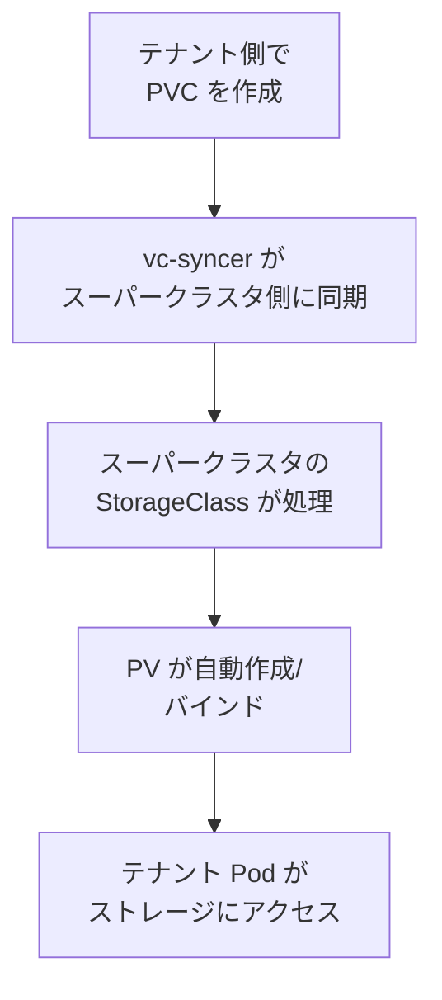
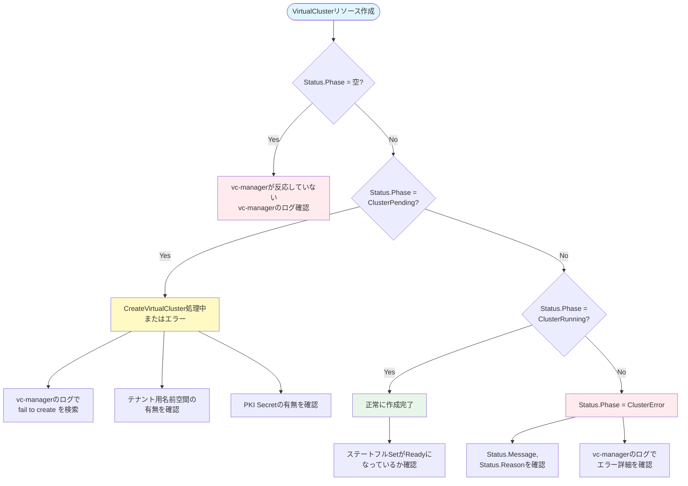

# k8s-virtual-cluster ロール

[VirtualCluster - Enabling Kubernetes Hard Multi-tenancy](https://github.com/kubernetes-retired/cluster-api-provider-nested/tree/main/virtualcluster) (
Kubernetes 仮想クラスタ ) の基盤コンポーネントをデプロイするロールです。このロールは, Kubernetes API を仮想化し, 複数の論理的な Kubernetes クラスタを単一のKubernetes クラスタ上で動作させるための基盤を構築します。

- [k8s-virtual-cluster ロール](#k8s-virtual-cluster-ロール)
  - [用語](#用語)
  - [前提条件](#前提条件)
    - [永続ストレージに関する前提条件](#永続ストレージに関する前提条件)
  - [概要](#概要)
    - [デプロイされるコンポーネント](#デプロイされるコンポーネント)
  - [実行フロー](#実行フロー)
    - [コンテナイメージ作成と配布の流れ](#コンテナイメージ作成と配布の流れ)
      - [ソース取得からコンテナイメージ作成配布処理中での排他制御について](#ソース取得からコンテナイメージ作成配布処理中での排他制御について)
    - [既存のコンテナイメージをコントロールプレイン/ワーカーノードに配布して仮想クラスタ環境を構築する場合の流れ](#既存のコンテナイメージをコントロールプレインワーカーノードに配布して仮想クラスタ環境を構築する場合の流れ)
      - [前提](#前提)
      - [処理フロー](#処理フロー)
    - [優先順位と昇格保存のルール](#優先順位と昇格保存のルール)
    - [設定例](#設定例)
      - [例1: explicit モード(明示指定)](#例1-explicit-モード明示指定)
      - [例2: cache モード(既定キャッシュ再利用)](#例2-cache-モード既定キャッシュ再利用)
  - [主要変数](#主要変数)
    - [既定の起動引数の意味](#既定の起動引数の意味)
      - [vc-manager (`virtualcluster_vc_manager_args`)](#vc-manager-virtualcluster_vc_manager_args)
      - [vc-syncer (`virtualcluster_vc_syncer_args`)](#vc-syncer-virtualcluster_vc_syncer_args)
      - [vn-agent (`virtualcluster_vn_agent_args`)](#vn-agent-virtualcluster_vn_agent_args)
  - [仮想クラスタ定義関連設定](#仮想クラスタ定義関連設定)
    - [テンプレートと生成ファイル](#テンプレートと生成ファイル)
      - [VirtualCluster CRD specで指定可能なキー](#virtualcluster-crd-specで指定可能なキー)
        - [同一プレフィックスがtransparentMetaPrefixesとopaqueMetaPrefixesの両方に指定された場合の挙動について](#同一プレフィックスがtransparentmetaprefixesとopaquemetaprefixesの両方に指定された場合の挙動について)
      - [生成されるリソース](#生成されるリソース)
    - [仮想クラスタ(テナント環境)上で永続ストレージを使用するための設定](#仮想クラスタテナント環境上で永続ストレージを使用するための設定)
      - [etcdの永続ストレージ設定](#etcdの永続ストレージ設定)
        - [設定方法](#設定方法)
        - [動作原理](#動作原理)
        - [注意点](#注意点)
      - [テナント内での PVC/PV/StorageClass 利用](#テナント内での-pvcpvstorageclass-利用)
        - [前提条件](#前提条件-1)
        - [利用パターン](#利用パターン)
        - [動作フロー](#動作フロー)
        - [制限事項と注意点](#制限事項と注意点)
        - [検証手順](#検証手順)
        - [トラブルシューティング](#トラブルシューティング)
  - [仮想クラスタ/テナント設定例](#仮想クラスタテナント設定例)
    - [PersistentVolume 設定例](#persistentvolume-設定例)
  - [実行方法](#実行方法)
  - [主な処理](#主な処理)
    - [クリーンビルド処理 (`virtualcluster_clean_build: true` の場合)](#クリーンビルド処理-virtualcluster_clean_build-true-の場合)
    - [ビルドとデプロイ処理](#ビルドとデプロイ処理)
    - [パッチ適用詳細](#パッチ適用詳細)
  - [テナント操作補助スクリプト](#テナント操作補助スクリプト)
    - [スクリプト配置](#スクリプト配置)
    - [スクリプト一覧](#スクリプト一覧)
    - [コマンドライン仕様](#コマンドライン仕様)
    - [共通オプション](#共通オプション)
    - [スクリプト固有オプション](#スクリプト固有オプション)
    - [実行時の情報表示](#実行時の情報表示)
    - [実行例](#実行例)
      - [例1: busybox Pod の配置と確認](#例1-busybox-pod-の配置と確認)
      - [例2: Deployment の展開と確認](#例2-deployment-の展開と確認)
      - [例3: 実行中の Pod でコマンド実行](#例3-実行中の-pod-でコマンド実行)
      - [例4: PersistentVolumeClaim の確認](#例4-persistentvolumeclaim-の確認)
      - [例5: カスタム管理 名前空間 ( namespace ) の指定](#例5-カスタム管理-名前空間--namespace--の指定)
    - [シェル補完機能](#シェル補完機能)
      - [補完機能の有効化設定](#補完機能の有効化設定)
      - [補完ファイル配置先](#補完ファイル配置先)
      - [補完機能の使用方法](#補完機能の使用方法)
      - [補完の動作](#補完の動作)
      - [補完機能のトラブルシューティング](#補完機能のトラブルシューティング)
    - [トラブルシューティング](#トラブルシューティング-1)
  - [検証ポイント](#検証ポイント)
  - [トラブルシューティング](#トラブルシューティング-2)
    - [VirtualCluster作成後の診断](#virtualcluster作成後の診断)
      - [1. VirtualClusterリソースのStatus確認](#1-virtualclusterリソースのstatus確認)
      - [2. テナント用名前空間確認](#2-テナント用名前空間確認)
      - [3. テナント用ステートフルSetの確認](#3-テナント用ステートフルsetの確認)
      - [4. vc-managerのログ詳細確認](#4-vc-managerのログ詳細確認)
      - [5. PKI ( 証明書 ) Secretの確認](#5-pki--証明書--secretの確認)
      - [診断フローチャート](#診断フローチャート)
      - [6. ログサンプルと期待される出力](#6-ログサンプルと期待される出力)
      - [7. よくあるエラーパターンと対処方法](#7-よくあるエラーパターンと対処方法)
    - [ビルドが失敗する場合](#ビルドが失敗する場合)
    - [vc-manager が起動しない場合](#vc-manager-が起動しない場合)
    - [vc-syncer が起動しない場合](#vc-syncer-が起動しない場合)
    - [vc-syncerのService同期警告](#vc-syncerのservice同期警告)
    - [CRD 登録が失敗する場合](#crd-登録が失敗する場合)
    - [webhook 検証が失敗する場合](#webhook-検証が失敗する場合)
    - [イメージ配布に失敗する場合](#イメージ配布に失敗する場合)
      - [Ansible接続の確認](#ansible接続の確認)
      - [コンテナイメージの確認](#コンテナイメージの確認)
      - [配布タスクのログ確認](#配布タスクのログ確認)
    - [パッチ適用に失敗する場合](#パッチ適用に失敗する場合)
      - [1. パッチ適用タスクのエラー確認](#1-パッチ適用タスクのエラー確認)
      - [2. ソースコードの状態確認](#2-ソースコードの状態確認)
      - [3. パッチファイルの内容確認](#3-パッチファイルの内容確認)
      - [4. 手動パッチ適用テスト](#4-手動パッチ適用テスト)
      - [5. クリーンビルドによる解決](#5-クリーンビルドによる解決)
  - [テナント kubeconfig 生成スクリプト](#テナント-kubeconfig-生成スクリプト)
    - [スクリプトの概要](#スクリプトの概要)
    - [使用方法](#使用方法)
    - [オプション](#オプション)
    - [テナント kubeconfig の使用](#テナント-kubeconfig-の使用)
      - [kubectl port-forward を使用したポートフォワーディング](#kubectl-port-forward-を使用したポートフォワーディング)
      - [テナント操作用kubeconfig の生成](#テナント操作用kubeconfig-の生成)
      - [実行例](#実行例-1)
      - [ポートフォワード操作の例](#ポートフォワード操作の例)
      - [テナント環境へアクセスするためのkubeconfig の生成例](#テナント環境へアクセスするためのkubeconfig-の生成例)
    - [注意事項](#注意事項)
  - [留意事項](#留意事項)
  - [参考リンク](#参考リンク)


## 用語

| 正式名称 | 略称 | 意味 |
| --- | --- | --- |
| Kubernetes | K8s | コンテナを管理する基盤ソフトウエア。 |
| Application Programming Interface | API | 他の仕組みから機能を呼び出すための窓口。 |
| Custom Resource Definition | CRD | Kubernetes に独自のリソース型を追加する仕組み。 |
| Role-Based Access Control | RBAC | 権限を役割単位で制御する仕組み。 |
| Transport Layer Security | TLS | 通信を暗号化する仕組み。 |
| Domain Name System | DNS | 名前と IP アドレスを対応付ける仕組み。 |
| トラフィック ( Traffic ) | - | ネットワーク上で送受信される通信電文。Kubernetes では主に HTTP, TCP, UDP などの通信手順に基づいて送受信される通信データを指す。 |
| etcd | - | Kubernetes の設定情報と状態を保存する分散キーバリューストア。 |
| kube-apiserver | - | KubernetesのAPIリクエストを受け付けて処理するコンポーネント。 |
| kube-controller-manager | - | Kubernetes コントローラマネージャ, リソースの状態を監視して制御するコンポーネント。 |
| kubectl | - | Kubernetes クラスタを操作するコマンドラインツール。kube-apiserverへのリクエストを送信し, リソースの作成, 更新, 削除, 確認を行う。 |
| コントロールプレーンノード ( Control Plane Node ) | - | Kubernetesクラスタを制御するためのコンポーネント(kube-apiserver, kube-scheduler, kube-controller-manager, etcd など)が動作し, クラスタ全体の制御と調整を行うノード。|
| ワーカノード ( Worker Node ) | - | Kubernetes クラスタで実際にアプリケーション(ポッド ( Pod ))が実行されるノード。kubelet と呼ばれるエージェントが動作し, コントロールプレーンノードからの指示に基づいてコンテナを実行管理する。 |
| コンテナ ( Container ) | - | アプリケーションと依存関係を一つのパッケージ化したもの。軽量で, どの環境でも一貫して実行可能。 |
| ポッド ( Pod ) | - | Kubernetes の最小展開単位。1 個以上のコンテナ ( Container ) で構成される実行環境。ポッド ( Pod ) 内のすべてのコンテナ ( Container ) は, OS が提供するネットワーク名前空間, および, IP アドレスを共有するため, ループバックアドレス (localhost) の異なるポート番号を使用してプロセス間通信が可能, 共有ストレージによって密接に結合され, 同一ノード上で常に共存, Pod 内のコンテナ群一式が一体となって配置される (スケジューリングの単位として不可分)。 |
| レプリカ ( Replica ) | - | ポッド ( Pod ) の複製。デプロイメント ( Deployment ) などのリソースが高可用性や負荷分散のために複数のレプリカを作成, 管理する。指定されたレプリカ数に基づいて同一の仕様を持つポッドが複数実行される。 |
| デプロイメント ( Deployment ) | - | Kubernetes リソース。ステートレスなアプリケーション向け。複数のレプリカ(ポッド ( Pod ) の複製)を管理し, 水平スケーリング に対応。 |
| デーモンセット ( DaemonSet ) | - | Kubernetes リソース。Kubernetes クラスタ内の全ノード(またはフィルタ条件を満たすノード)に 1 つのポッド ( Pod ) を配置するリソース。監視やログ収集に適す。 |
| ステートレス ( Stateless ) | - | アプリケーションの性質を表す用語で，アプリケーションから使用される各種データの状態を永続記憶(ストレージ)に保持しなくとも，動作可能なアプリケーションであることを示す。 |
| ステートフル ( Stateful ) | - | アプリケーションの性質を表す用語で，アプリケーションから使用される各種データの状態を永続記憶(ストレージ)に保持することを前提として動作するアプリケーションであることを示す。 |
| サービス ( Service ) | - | Kubernetes リソース。ポッド ( Pod ) へのネットワークアクセスを定義。仮想 IP アドレスを提供し, 通信電文 ( トラフィック ) を適切なポッドに転送 ( ルーティング ) する。 |
| PersistentVolume | PV | Kubernetes リソース。クラスタ内の永続ストレージを表すリソース。ボリュームのサイズ, アクセスモード, 回収ポリシ, バックエンド(ローカルストレージ, NFS, ブロック型ストレージなど)を定義。 |
| PersistentVolumeClaim | PVC | Kubernetes リソース。ポッド ( Pod ) がストレージを利用する際の要求リソース。必要なストレージ容量, アクセスモードを指定し, Kubernetes のコントローラが対応する PersistentVolume にバインドする。 |
| StorageClass | - | Kubernetes リソース。永続ストレージのプロビジョニング方法を定義するリソース。プロビジョナ(ローカルストレージプロビジョナ, AWS EBS, NFS など)とパラメータを指定し, PersistentVolumeClaim の要求に基づいて動的に PersistentVolume を作成する。 |
| バインド ( Bind ) | - | Kubernetes ストレージレイヤにおける処理。PersistentVolumeClaim の要求条件(容量, アクセスモード)が PersistentVolume の仕様と合致した場合, Kubernetes のコントローラが両者を紐付ける。バインド後, ポッドは PVC 経由で PV のストレージを利用できるようになる。 |
| プロビジョニング ( Provisioning ) | - | Kubernetes ストレージレイヤにおける処理。StorageClass で定義されたプロビジョナが, PersistentVolumeClaim の要求に応じて新しい PersistentVolume を自動的に作成するプロセス。動的プロビジョニングにより, ユーザが個別に PV を作成する手間を削減できる。静的プロビジョニング(管理者が事前に PV を作成)に対応する概念。 |
| プロビジョナ ( Provisioner ) | - | Kubernetes ストレージスタックのコンポーネント。StorageClass で指定し, PersistentVolumeClaim の要求に基づいて PersistentVolume を自動作成する。実装にはローカルストレージプロビジョナ, AWS EBS CSI ドライバ, NFS などが存在。 |
| emptyDir | - | Kubernetes ボリュームタイプ。ポッドがノードに割り当てられた時に作成される一時的なボリューム。ポッドが存在する限りデータが保持され, ポッド削除時にデータが失われる。開発環境での一時データ保存や Pod 内のコンテナ間でのファイル共有に使用。 |
| コンフィグマップ ( ConfigMap ) | - | Kubernetes リソース。設定データをキー, バリューペアで保存し, 非機密情報を管理。 |
| シークレット ( Secret ) | - | Kubernetes リソース。パスワード, API キー, 証明書などの機密データを暗号化して安全に保存, 管理。 |
| 仮想クラスタ ( Virtual Cluster ) | - | Kubernetes API を仮想化して提供する論理的な Kubernetesクラスタ。各テナントに独立した専用Kubernetesクラスタとして見える環境を提供する。 |
| スーパークラスタ ( Super Cluster ) | - | 仮想クラスタ ( Virtual Cluster ) を動作させるホスト側の物理Kubernetesクラスタ。実際のノードリソースを提供する。 |
| テナント ( Tenant ) | - | 互いに独立した Kubernetes コントロールプレーンノードを持つ論理的な利用者またはチーム。各テナントについて, 専用の仮想クラスタ ( Virtual Cluster ) が割り当てられ, テナントに割り当てられた仮想クラスタ ( Virtual Cluster ) 内のリソース (名前空間 ( namespace ) , CRD) を他のテナントに影響を与えずに作成できる。物理リソース (ノード) をスーパークラスタ ( Super Cluster ) を通じて他のテナントと共有し, かつ, 仮想リソース (Kubernetes のリソース) は, Kubernetes のコントロールプレーンノードレベルで分離される。 |
| vc-manager ( Virtual Cluster Manager ) | vc-manager | 仮想クラスタ ( Virtual Cluster ) の制御コンポーネント。スーパークラスタ ( Super Cluster ) 上で仮想クラスタ ( Virtual Cluster ) の管理を行う。 |
| vc-syncer ( Virtual Cluster Syncer ) | vc-syncer | 仮想クラスタ ( Virtual Cluster ) とスーパークラスタ ( Super Cluster ) の状態を同期するコンポーネント。 |
| vn-agent ( Virtual Node Agent ) | vn-agent | ワーカノード上で仮想クラスタ ( Virtual Cluster ) の通信を中継するエージェント。 |
| feature gate | - | Kubernetesやその関連プロジェクトで使用される機能制御スイッチ。実験的または段階的に導入される機能を個別に有効化/無効化するための仕組み。`--feature-gates=FeatureName=true/false`形式でコマンドライン引数として指定する。これにより, 安定版に到達していない機能などを選択的に有効化可能。VirtualClusterでは, vc-syncerの`SyncTenantPVCStatusPhase=true`などが該当する。 |
| Phase sync | - | VirtualCluster固有の機能。テナント側で作成された PersistentVolumeClaim (PVC) の状態(Phase: Pending, Bound等)をスーパークラスタ側と同期する仕組み。vc-syncer の feature gate (`SyncTenantPVCStatusPhase=true`)で有効化され, テナント側から PVC の実際の状態を確認可能にする。この同期により, テナント内で PVC が正常にバインドされたかどうかをリアルタイムで把握できる。 |
| webhook | - | Kubernetes API 拡張機構。vc-manager では VirtualCluster リソースの検証と変更時の操作を行う際に使用される。 |
| Debian Bookworm Slim | debian:bookworm-slim | Dockerイメージ作成時に使用するDebian 12 (Bookworm)の軽量ベースイメージ。 |
| 名前空間 ( namespace ) | - | Kubernetes におけるリソースのグループ化と分離の仕組み。 |
| ラベル ( label ) | - | リソースに対する付加情報の一種で, key=value 形式で指定される。典型的には, リソースの検索, 選別 ( selector ) のために用いられる。 |
| アノテーション ( annotation ) | - | リソースに対する付加情報の一種で, key: value 形式で指定される。リソースの検索, 選別 ( selector ) を目的としない用途の付加情報を指定するために用いられる。 |
| セレクタ ( selector ) | - | Kubernetes において, ラベル ( label ) に基づいてリソースを識別, 選択するための仕組み。たとえば, Service が特定のラベルを持つ Pod を選択して通信電文を転送する際に使用される。 |

## 前提条件

- Kubernetesクラスタが稼働していること。目安は v1.22 以上です。
- `kubectl` コマンドが利用可能であること。
- `k8s-common` と `k8s-ctrlplane` ロールが事前に実行済みであること。
- 仮想クラスタ のコンポーネントは実験環境向けの実装です。
- ビルドノード(デフォルトはAnsibleの制御ノード(localhost), `virtualcluster_build_host`で変更可能)に以下がインストールされていること:
  - Go (バージョン 1.16以上推奨)
  - Make
  - Docker
- Ansibleの制御ノード(localhost)からワーカノード へAnsible経由で接続可能であること (inventory/hostsまたは動的に検出)。
- ワーカノード が containerd を使用していること。
- `virtualcluster_auto_detect_supercluster_images: true` (既定値)の場合, Ansible制御ノードから `kubectl` でスーパークラスタに疎通可能であること。

### 永続ストレージに関する前提条件

etcd の永続ストレージを有効にする場合 (`vcinstances_etcd_storage_enabled: true`), スーパークラスタ側で以下の準備が必要です:

1. **StorageClass の存在確認**:
   ```bash
   kubectl get storageclass
   ```
   出力例:
   ```plaintext
   NAME              PROVISIONER       RECLAIMPOLICY   VOLUMEBINDINGMODE   ALLOWVOLUMEEXPANSION   AGE
   fast-ssd          ebs.csi.aws.com   Delete          WaitForFirstConsumer false                  30d
   default (default) kubernetes.io/aws-ebs Delete       WaitForFirstConsumer false                  30d
   ```

2. **デフォルト StorageClass の設定**:
   存在しない場合は, ローカルストレージやCSI プロバイダなどから StorageClass を作成してください。
   ```bash
   kubectl apply -f - <<EOF
   apiVersion: storage.k8s.io/v1
   kind: StorageClass
   metadata:
     name: local-storage
   provisioner: kubernetes.io/no-provisioner
   volumeバインドingMode: WaitForFirstConsumer
   EOF
   ```

**注意**: 本番環境では, データベースの永続化やステートフルアプリケーション対応のため, 専用の StorageClass を準備することを強く推奨します。

## 概要

仮想クラスタにより, ホストKubernetesクラスタ (以下, スーパークラスタ) 上で複数のテナント向けコントロールプレーンノードを独立して運用できます。各テナントのコントロールプレーンノードはスーパークラスタのワーカノードを共有しながら, APIレベルの分離を実現します。

### デプロイされるコンポーネント

本ロールは以下の3つの主要コンポーネントをデプロイします:

1. **vc-manager (Virtual Cluster Manager)**
   - VirtualClusterリソースを監視し, テナント に割り当てられた仮想クラスタ のライフサイクルを管理します。
   - Webhook検証によりVirtualClusterリソースの整合性を保証します。
   - Deployment形式でデプロイされ, `vc-manager` 名前空間 ( namespace ) 内で動作します。

2. **vc-syncer (Virtual Cluster Syncer)**
   - 仮想クラスタ とスーパークラスタ の状態を同期するコンポーネントです。
   - テナント に割り当てられた仮想クラスタ のリソース(Pod, Service, ConfigMap等)をスーパークラスタ 上の実体と関連付けます。
   - Deployment形式でデプロイされ, `vc-manager` 名前空間 ( namespace ) 内で動作します。
   - 広範なRBAC権限(namespaces, nodes, persistentvolumes, storageclasses等への読み書き)を持ちます。

3. **vn-agent (Virtual Node Agent)**
   - ワーカノード 上で仮想クラスタ の通信を中継するエージェントです。
   - DaemonSet形式でデプロイされ, コントロールプレーンノード を除く全ワーカノード で動作します。

## 実行フロー

1. `validate.yml` で前提条件と API 疎通を検証します。
2. `detect-supercluster-images.yml` でスーパークラスタから稼働中のetcd, kube-apiserver, kube-controller-managerのイメージを自動検出します ( デフォルト, `virtualcluster_auto_detect_supercluster_images: true` の場合 ) 。
3. `cleanup.yml` でクリーンビルド時に既存リソースを削除します ( `virtualcluster_clean_build: true` の場合 ) :
   - VirtualClusterインスタンス削除  =>  テナント名前空間 ( namespace ) 消滅待機  =>  ClusterVersionインスタンス削除  =>  vc-manager名前空間 ( namespace ) 削除  =>  CRD削除の順で実行します。
4. `namespace.yml` で `vc-manager` の名前空間 ( namespace ) を作成します。
5. `crd.yml` で ClusterVersion と VirtualCluster の CRD を登録します。
6. コンテナイメージ成果物の入力を次の優先順位で判定します: `explicit` > `cache` > `build`。
  - `explicit`: `virtualcluster_manager_image_tar_path`, `virtualcluster_syncer_image_tar_path`, `virtualcluster_vn_agent_image_tar_path` の3つがすべて指定され, ファイルが存在する場合。
  - `cache`: `{{ virtualcluster_image_cache_dir }}/latest/images/` に3つのtarファイルが存在する場合。
  - `build`: 上記2つを満たさず, かつ `virtualcluster_build_from_source: true` の場合。
  - ただし, `virtualcluster_clean_build: true` かつ `virtualcluster_build_from_source: true` かつ `virtualcluster_skip_cache_on_clean_build: true` の場合は, 古いキャッシュ再利用を避けるため `cache` をスキップして `build` を優先します。
7. `virtualcluster_build_from_source: true` の場合:
   - `download-source.yml` でソースリポジトリをクローン/更新します ( `virtualcluster_clean_build: true` の場合は `force: true` でローカル変更を破棄 ) 。
  - `patch-provisioner.yml`, `patch-virtualcluster-types.yml`, `patch-kubeconfig.yml`, `patch-service-mutate.yml`, `patch-vn-agent-options.yml` で5つのunified diff形式パッチを適用します。
   - `build-binaries.yml` で `make build-images` を実行してバイナリをビルドします。
   - `build-kubectl-vc.yml` でkubectl-vcプラグインをビルドします ( `virtualcluster_build_kubectl_vc: true` の場合 ) 。
  - `build-docker-images.yml` でDockerイメージをビルドしてtarファイルに保存します。
  - `fetch-images.yml` でビルドノードからAnsibleの制御ノード(localhost)へtarファイルを取得します。
8. `upload-to-ctrlplane.yml` でコントロールプレーンノード へイメージをアップロードします。
9. `distribute-to-workers.yml` でワーカノード へイメージを配布します:
   - `kubectl get nodes` で実際のワーカノード リストを取得します。
   - コントロールプレーンノード からAnsibleの制御ノード(localhost)へイメージをfetchします。
   - Ansibleの制御ノード(localhost)から各ワーカノード へイメージをcopyします。
   - 各ワーカノードで `ctr -n k8s.io images import` を実行します。
10. `deploy-manager.yml` で vc-manager, vc-syncer, vn-agent をデプロイします。
11. `verify.yml` で CRD と Pod 起動を確認します。
12. Build成功かつVerify成功時のみ, イメージtarとマニフェストを最新バンドルとして昇格保存します。

### コンテナイメージ作成と配布の流れ

以下の`<component>`には`virtualcluster_build_components`の各要素を指し, 既定では`manager`, `vc-syncer`, `vn-agent`が入ります。

- `virtualcluster_source_repo`を`virtualcluster_build_host`上の`virtualcluster_source_dir`へクローンまたは更新します。
- `make build-images`でバイナリを生成します。
- 生成したバイナリから, `debian:bookworm-slim`をベースにDockerイメージを作成し, `virtualcluster/<component>-amd64:latest`でタグ付けします。
- ビルドノード上で`docker save`により`/tmp/vc_<component>-amd64.tar`を作成します。
- `fetch-images.yml`でビルドノードからAnsibleの制御ノード(localhost)へtarファイルを転送します。
- `upload-to-ctrlplane.yml`でAnsibleの制御ノード(localhost)からコントロールプレーンノード へtarファイルを転送します。
- `distribute-to-workers.yml`で`kubectl get nodes`により`virtualcluster_supercluster_kubeconfig_path`でK8sクラスタ(スーパークラスタ)のワーカノード一覧を取得します。
- コントロールプレーンノード からAnsibleの制御ノード(localhost)へ`fetch`モジュールでtarファイルを転送します。
- Ansibleの制御ノード(localhost)から各ワーカノード へ`copy`モジュールでtarファイルを転送し, 各ワーカノードで`ctr -n k8s.io images import`によりイメージを取り込みます。

#### ソース取得からコンテナイメージ作成配布処理中での排他制御について

複数の`k8s_management`ホストが存在する場合でも, 以下は`run_once: true`で1回のみ実行されます。

- ソース取得: `download-source.yml`。
- バイナリ作成: `build-binaries.yml`。
- Dockerイメージ作成とtar出力: `build-docker-images.yml`。
- Ansibleの制御ノード(localhost)への取得とクリーンアップ: `fetch-images.yml`。
- コントロールプレーンノードへの転送: `upload-to-ctrlplane.yml`。
- ワーカノードへの配布とクリーンアップ: `distribute-to-workers.yml`。

### 既存のコンテナイメージをコントロールプレイン/ワーカーノードに配布して仮想クラスタ環境を構築する場合の流れ

この節では, 既存のコンテナイメージtarを利用して, ソースビルドを行わずに仮想クラスタ環境を構築する手順を示します。実装上の入力優先順位は `explicit > cache > build` です。ただし, `virtualcluster_clean_build: true` かつ `virtualcluster_build_from_source: true` かつ `virtualcluster_skip_cache_on_clean_build: true` の場合は `cache` をスキップし, `explicit > build` の優先順位で判定します。

#### 前提

- `k8s_virtualcluster_enabled: true` を設定してロールを有効化していること。
- 配布対象の3コンポーネント(`manager`, `syncer`, `vn-agent`)に対応するtarファイルが利用可能であること。
- ワーカノードが containerd を使用し, Ansible の制御ノード(localhost)から接続可能であること。

#### 処理フロー

1. `prepare-image-artifacts.yml` で入力ソースを判定し, 動作モードを判定します。
  - `explicit` モード: `virtualcluster_manager_image_tar_path`, `virtualcluster_syncer_image_tar_path`, `virtualcluster_vn_agent_image_tar_path` の3つがすべて指定され, かつファイルが存在する場合。
  - `cache` モード: `{{ virtualcluster_image_cache_dir }}/latest/images/` に3つのtarが存在する場合。
  - `build` モード: 上記のいずれも成立しない場合。
2. `explicit` または `cache` の場合, 選択されたtarを `virtualcluster_local_cache_dir` に集約します。`build`モードの場合, ソースから構築したコンテナイメージを`virtualcluster_local_cache_dir` に集約します。
3. `upload-to-ctrlplane.yml` でコントロールプレーンノードへtarを転送します。
4. `distribute-to-workers.yml` でワーカノード一覧を取得し, 各ワーカノードへtarを転送して `ctr -n k8s.io images import` で取り込みます。
5. `deploy-manager.yml` で vc-manager, vc-syncer, vn-agent をデプロイします。
6. `verify.yml` で CRD と Pod 起動を確認します。

### 優先順位と昇格保存のルール

`vc-manager`, `vc-syncer`, `vn-agent`の3コンポーネントのtarが揃っていない場合は, キャッシュモードを`build` に設定(フォールバック)し, ソースからのコンテナイメージ生成を試みます。この時, `virtualcluster_build_from_source: false` の場合は, ソースコードからの構築を明示的に抑止しているものとみなし, playbookを停止(fail)します。

`tasks/main.yml`中の `Promote Latest Image Bundle` タスクで, ソースから構築したコンテナイメージと仮想クラスタ構築に使用したマニュフェストからなるバンドルを`{{ virtualcluster_image_cache_dir }}/latest/images/`配下にキャッシュとして保存する処理を行います (本処理を`昇格保存`と呼びます)。

`build`モードで, 以下の条件を満たした場合にのみ, 使用したマニュフェストとコンテナイメージが最新バンドルへ昇格保存されます:

- コンテナイメージ構築に成功し, かつ,
- コントロールプレイン/ワーカーノードへのコンテナ展開に成功し,
- 展開されたコンテナイメージの確認に成功

なお, 昇格保存処理は, `build`モード(`virtualcluster_image_source_mode == 'build'`) の場合, かつ,
`virtualcluster_build_from_source: true` の場合にのみ実施されます。
このため, 既存イメージ利用時(`virtualcluster_image_source_mode`が, `explicit`, または, `cache`の場合)は, 最新バンドルの昇格保存処理は実行されません。

### 設定例

#### 例1: explicit モード(明示指定)

```yaml
k8s_virtualcluster_enabled: true
virtualcluster_build_from_source: false

virtualcluster_manager_image_tar_path: "/srv/images/manager-amd64.tar"
virtualcluster_syncer_image_tar_path: "/srv/images/syncer-amd64.tar"
virtualcluster_vn_agent_image_tar_path: "/srv/images/vn-agent-amd64.tar"
```

#### 例2: cache モード(既定キャッシュ再利用)

```yaml
k8s_virtualcluster_enabled: true
virtualcluster_build_from_source: false

# 既定値。必要に応じて変更可能。
virtualcluster_image_cache_dir: "/opt/virtual-cluster/caches/images"
```

cache モードでは, 以下の3ファイルが存在することが条件です。

- `{{ virtualcluster_image_cache_dir }}/latest/images/manager-amd64.tar`
- `{{ virtualcluster_image_cache_dir }}/latest/images/syncer-amd64.tar`
- `{{ virtualcluster_image_cache_dir }}/latest/images/vn-agent-amd64.tar`

## 主要変数

| 変数名 | 既定値 | 説明 |
| --- | --- | --- |
| `k8s_virtualcluster_enabled` | `false` | ロールを実行するかどうかを指定します。 |
| `virtualcluster_build_from_source` | `true` | ソースからビルドするか(true), 既存バイナリ/イメージを使用するか(false)を指定します。 |
| `virtualcluster_auto_detect_supercluster_images` | `true` | スーパークラスタから稼働中のetcd, kube-apiserver, kube-controller-managerイメージを動的に検出するかどうか。既定: true。falseの場合は`registry.k8s.io/etcd:<スーパークラスタのETCDメジャーバージョン.マイナーバージョン>.0`等のフォールバック値を使用します。運用環境では自動検出により, バージョンズレを防止できます。 |
| `virtualcluster_build_host` | `"localhost"` | ビルドを実行するホストを指定します (既定: Ansibleの制御ノード)。Docker/Go/Makeがインストール済みである必要があります。 |
| `virtualcluster_source_repo` | `"https://github.com/kubernetes-retired/cluster-api-provider-nested"` | [VirtualCluster - Enabling Kubernetes Hard Multi-tenancy](https://github.com/kubernetes-retired/cluster-api-provider-nested/tree/main/virtualcluster) のソースリポジトリURLです。 |
| `virtualcluster_source_version` | `"main"` | クローンするバージョン/ブランチ/タグです。 |
| `virtualcluster_source_dir` | `"/tmp/cluster-api-provider-nested"` | ソースのダウンロード先ディレクトリです (既定: `/tmp/cluster-api-provider-nested`)。 |
| `virtualcluster_build_components` | `['manager', 'syncer', 'vn-agent']` | ビルド対象コンポーネントのリストです。 |
| `virtualcluster_build_timeout` | `1800` | ビルドタイムアウト(秒)です。 |
| `virtualcluster_manager_image_tar_path` | `""` | vc-manager イメージtarの明示指定パスです。`explicit` 判定では3コンポーネントすべての指定が必要です。 |
| `virtualcluster_syncer_image_tar_path` | `""` | vc-syncer イメージtarの明示指定パスです。`explicit` 判定では3コンポーネントすべての指定が必要です。 |
| `virtualcluster_vn_agent_image_tar_path` | `""` | vn-agent イメージtarの明示指定パスです。`explicit` 判定では3コンポーネントすべての指定が必要です。 |
| `virtualcluster_image_cache_dir` | `"/opt/virtual-cluster/caches/images"` | 成功した最新バンドル(イメージtar/マニフェスト)の保存先です。`cache` 判定では `{{ virtualcluster_image_cache_dir }}/latest/images/` を参照します。 |
| `virtualcluster_manifest_cache_dir` | `"{{ virtualcluster_image_cache_dir }}/manifests"` | 成功した最新マニフェストの保存先です。 |
| `virtualcluster_keep_image_cache` | `false` | 実行後にlocalhost作業用一時生成ファイル群 (`virtualcluster_local_cache_dir`に配置されるコンテナイメージ群) を保持するよう指定します。 |
| `virtualcluster_local_cache_dir` | `"{{ lookup('env', 'HOME') }}/.ansible/vc-images-cache"` | Ansibleの制御ノード(localhost)上のイメージキャッシュディレクトリです (既定: `~/.ansible/vc-images-cache`)。 |
| `virtualcluster_ctrlplane_cache_dir` | `"/tmp/vc-images"` | コントロールプレーンノード上のイメージキャッシュディレクトリです (既定: `/tmp/vc-images`)。 |
| `k8s_kubeadm_config_store` | `"/home/ansible/kubeadm"` | kubeadm 生成設定の保存先ディレクトリです。`virtualcluster_config_dir` の基準パスとして使用されます。 |
| `virtualcluster_namespace` | `"vc-manager"` | 仮想クラスタ ( Virtual Cluster ) 管理コンポーネントを展開する名前空間 ( namespace ) です。 |
| `virtualcluster_config_dir` | `"{{ k8s_kubeadm_config_store }}/virtual-cluster"` | マニフェストの出力先です (既定: `~/kubeadm/virtual-cluster`)。 |
| `virtualcluster_all_in_one_manifest_path` | `""` | vc-manager, vc-syncer, vn-agent をまとめて展開するために使用するマニフェストファイルへのansible制御ノード上でのファイルパスです。空文字の場合はテンプレートから生成したマニフェストを使用します。 |
| `virtualcluster_supercluster_kubeconfig_path` | `"/etc/kubernetes/admin.conf"` | K8sクラスタ(スーパークラスタ)操作に使用するkubeconfigのパスです。 |
| `virtualcluster_manager_image` | `"virtualcluster/manager-amd64:latest"` | vc-manager のイメージです。 |
| `virtualcluster_syncer_image` | `"virtualcluster/syncer-amd64:latest"` | syncer のイメージです。 |
| `virtualcluster_vn_agent_image` | `"virtualcluster/vn-agent-amd64:latest"` | vn-agent のイメージです。 |
| `virtualcluster_unqualified_image_registry` | `"docker.io"` | `virtualcluster/...` のような未修飾イメージ名に対して, contianerd などのContainer Runtime Interface (CRI)が解決する既定レジストリ名です。環境に応じて `registry.example.local` などへ変更できます。 |
| `virtualcluster_manager_cmd_path` | `"/app"` | vc-manager コンテナで実行するコマンドパスです。 |
| `virtualcluster_vc_manager_args` | `["--enable-webhook=true", "--leader-election=true"]` | vc-manager の起動引数です。規定では, webhook機能とleader-election機能を有効にします。|
| `virtualcluster_syncer_cmd_path` | `"/app"` | vc-syncer コンテナで実行するコマンドパスです。 |
| `virtualcluster_vc_syncer_args` | `["syncer", "--leader-elect-resource-lock=leases"]` | vc-syncer の起動引数です。先頭の `syncer` は実行モード(サブコマンド)を指定する必須値であり, 省略すると期待した同期処理が開始されません。既定では Leader Election のロック種別として `leases`を指定します。|
| `virtualcluster_vn_agent_cmd_path` | `"/app"` | vn-agent コンテナで実行するコマンドパスです。 |
| `virtualcluster_vn_agent_args` | `[]` | vn-agent の起動引数です。 |
| `virtualcluster_syncer_feature_gates` | `["SyncTenantPVCStatusPhase=true"]` | vc-syncer に渡す feature gate の一覧です。既定では PVC Phase 同期を有効化します。必要に応じて host_vars で上書きします。 |
| `virtualcluster_manager_resource_requests` | `{ cpu: "500m", memory: "512Mi" }` | vc-manager Pod のリソースリクエスト設定です。CPU またはメモリのみの個別指定も可能です。 |
| `virtualcluster_manager_resource_limits` | `{ cpu: "1000m", memory: "1Gi" }` | vc-manager Pod のリソースリミット設定です。CPU またはメモリのみの個別指定も可能です。 |
| `virtualcluster_syncer_resource_requests` | `{}` | vc-syncer Pod のリソースリクエスト設定です。既定では未指定です。 |
| `virtualcluster_syncer_resource_limits` | `{}` | vc-syncer Pod のリソースリミット設定です。既定では未指定です。 |
| `virtualcluster_vn_agent_resource_requests` | `{ cpu: "100m", memory: "128Mi" }` | vn-agent Pod のリソースリクエスト設定です。CPU またはメモリのみの個別指定も可能です。 |
| `virtualcluster_vn_agent_resource_limits` | `{ cpu: "500m", memory: "512Mi" }` | vn-agent Pod のリソースリミット設定です。CPU またはメモリのみの個別指定も可能です。 |
| `virtualcluster_etcd_replicas` | `1` | virtual cluster の etcd StatefulSet のレプリカ数です。 |
| `virtualcluster_apiserver_replicas` | `1` | virtual cluster の apiserver StatefulSet のレプリカ数です。 |
| `virtualcluster_controller_manager_replicas` | `1` | virtual cluster の controller-manager StatefulSet のレプリカ数です。 |
| `virtualcluster_clean_build` | `true` | クリーンビルド有効化フラグです。trueの場合, 既存のVirtualCluster/テナント名前空間 ( namespace ) /ClusterVersion/CRD等を削除してから再構築します。 |
| `virtualcluster_skip_cache_on_clean_build` | `false` | クリーンビルド時にキャッシュ(過去に生成されたコンテナイメージ)の使用を抑止します。`virtualcluster_clean_build: true` かつ `virtualcluster_build_from_source: true` のときに `cache` モードをスキップし, ソースからコンテナイメージを再構築します(強制的に`build`モードで動作します)。 |
| `virtualcluster_tenant_ns_wait_timeout` | `60` | クリーンビルド時にテナント名前空間 ( namespace ) の消滅を待機する最大時間(秒)です。 |
| `virtualcluster_tenant_ns_wait_delay` | `5` | クリーンビルド時にテナント名前空間 ( namespace ) の消滅を確認するポーリング間隔(秒)です。 |
| `k8s_api_wait_host` | 各host_varsの`k8s_ctrlplane_endpoint`変数で指定したコントロールプレーンAPIエンドポイント | kube-apiserverの待ち受け先です。 |
| `k8s_api_wait_port` | `6443` | kube-apiserverの待ち受けポートです。 |
| `k8s_api_wait_timeout` | `600` | Kubernetes APIサーバ待ち合わせ時間(秒)です。 |
| `k8s_api_wait_delay` | `2` | Kubernetes APIサーバ待ち合わせ時の開始遅延時間(秒)です。 |
| `k8s_api_wait_sleep` | `1` | Kubernetes APIサーバ待ち合わせ時のポーリング間隔(秒)です。 |
| `k8s_api_wait_delegate_to` | `"localhost"` | Kubernetes APIサーバ待機タスクの実行元ホストです。 |
| `virtualcluster_kubectl_vc_install_dir` | `"/usr/local/bin"` | kubectl-vc プラグインのインストール先ディレクトリです。 |
| `virtualcluster_kubectl_vc_binary` | `"kubectl-vc"` | kubectl-vc プラグインのバイナリ名です。 |
| `virtualcluster_build_kubectl_vc` | `true` | kubectl-vc プラグインをソースからビルドするかどうかを指定します。 |
| `virtualcluster_persistent_volumes` | `[]` | 作成するPVのリストです。定義されている場合, 指定されたPVを自動作成します(詳細は「PersistentVolume 設定例」を参照)。 |

### 既定の起動引数の意味

`virtualcluster_vc_manager_args`, `virtualcluster_vc_syncer_args`, `virtualcluster_vn_agent_args` の既定値は次の意味を持ちます。

#### vc-manager (`virtualcluster_vc_manager_args`)

| 引数 | 意味 |
| --- | --- |
| `--enable-webhook=true` | VirtualCluster の検証/変換に使う webhook 機能を有効化します。 |
| `--leader-election=true` | 複数レプリカを想定した leader election 機能を有効化します。 |

- `--enable-webhook=true`は, VirtualCluster の検証/変換に使うwebhookによるコールバック機能を有効化します。
- `--leader-election=true` vc-manager のリーダー選出機能を有効にします。本機能は, 複数のvc-manager Podを生成し, そのうちの1つのPod(リーダPod)で処理を実施の上, リーダPod故障時に他のPodに処理を引き継ぐことで処理の継続を試みる機能です。

#### vc-syncer (`virtualcluster_vc_syncer_args`)

| 引数 | 意味 |
| --- | --- |
| `syncer` | `/app` バイナリの `syncer` サブコマンドを実行します。 |
| `--leader-elect-resource-lock=leases` | leader election のロック種別を `Lease` リソースに設定します。 |

既定では, K8sのリーダ選出処理用オブジェクトである`Lease`を使用してリーダーPodの異常を検出するよう指示します。 `Lease`オブジェクトを使用することで, リーダーPodが`Lease`オブジェクトを一定間隔で更新し, 更新停止をもってリーダーPodに異常が発生したこと検出します。

#### vn-agent (`virtualcluster_vn_agent_args`)

- 既定値は `[]` です。
- 既定状態では追加引数なしで `vn-agent` を起動します。

## 仮想クラスタ定義関連設定

### テンプレートと生成ファイル

以下の表中の~(チルダ記号)は, ansibleアカウントでログイン時のホームディレクトリ(規定: `/home/ansible`)を意味します。

| テンプレート | 出力先 | 説明 |
| --- | --- | --- |
| `templates/namespace.yaml.j2` | `{{ virtualcluster_config_dir }}/namespace.yaml` (既定: `~/kubeadm/virtual-cluster/namespace.yaml`) | 名前空間 ( namespace ) 定義です。 |
| `templates/clusterversion-crd.yaml.j2` | `{{ virtualcluster_config_dir }}/clusterversion-crd.yaml` (既定: `~/kubeadm/virtual-cluster/clusterversion-crd.yaml`) | ClusterVersion CRD (カスタムリソース定義) です。 |
| `templates/virtualcluster-crd.yaml.j2` | `{{ virtualcluster_config_dir }}/virtualcluster-crd.yaml` (既定: `~/kubeadm/virtual-cluster/virtualcluster-crd.yaml`) | VirtualCluster CRD (カスタムリソース定義) です。 |
| `templates/all-in-one.yaml.j2` | `{{ virtualcluster_config_dir }}/all-in-one.yaml` (既定: `~/kubeadm/virtual-cluster/all-in-one.yaml`) | vc-manager, vc-syncer, vn-agent のマニフェストです。 |

#### VirtualCluster CRD specで指定可能なキー

VirtualCluster CRD (`virtualclusters.tenancy.x-k8s.io`) の `spec` セクションで指定可能なキーを以下に示します。

| キー | 型 | 必須/任意 | 既定値 | 説明 |
| --- | --- | --- | --- | --- |
| `clusterVersionName` | string | 必須 | なし | 使用するClusterVersionインスタンス名です。 |
| `clusterDomain` | string | 任意 | なし | テナントDNSドメインです。 |
| `kubeConfigSecretName` | string | 任意 | なし | kubeconfig Secret名です。 |
| `transparentMetaPrefixes` | array[string] | 任意 | なし | スーパークラスタ ( Super Cluster ) 側で保持されるラベル/アノテーションのうち, 指定されたプレフィックスに一致するラベル/アノテーションのキーを持つものを仮想クラスタ ( Virtual Cluster ) に反映するための指定です。スーパークラスタ ( Super Cluster )側で保持されるラベル/アノテーションのうち, 仮想クラスタ ( Virtual Cluster ) 側でも参照可能にすべきもの ( 運用上必要なメタデータ )を指定して仮想クラスタ側に反映するために用いられます。スーパークラスタ ( Super Cluster ) 側から仮想クラスタ ( Virtual Cluster ) 側への同期で, 一致するキーのみを反映します。未指定時は, 空配列を指定したものとして扱われます。 |
| `opaqueMetaPrefixes` | array[string] | 任意 | なし | 仮想クラスタ ( Virtual Cluster ) 側に保持されているラベル/アノテーションのうち, 指定されたプレフィックスに一致するラベル/アノテーションのキーを持つものをスーパークラスタ ( Super Cluster ) に同期しないための指定です。指定されたラベル/アノテーションは, 仮想クラスタ ( Virtual Cluster ) 側からスーパークラスタ ( Super Cluster ) 側への反映が行われないため, スーパークラスタ ( Super Cluster ) 側からは参照不能となります。仮想クラスタ ( Virtual Cluster ) 側からスーパークラスタ ( Super Cluster ) 側への同期で, 一致するキーを除外します。未指定時は, 空配列を指定したものとして扱われます。 |

##### 同一プレフィックスがtransparentMetaPrefixesとopaqueMetaPrefixesの両方に指定された場合の挙動について

同一プレフィックスが`transparentMetaPrefixes`と`opaqueMetaPrefixes`の両方に指定された場合, 仮想クラスタ 側からスーパークラスタ 側への同期で除外対象となります。意図しない動作を避けるため, 同一プレフィックスを両方に指定しないことを推奨します。

#### 生成されるリソース

| リソース | 説明 |
| --- | --- |
| `Namespace: vc-manager` | 管理コンポーネント用名前空間 ( namespace ) です。 |
| `Custom Resource Definition` | `virtualclusters.tenancy.x-k8s.io` を登録します。 |
| `Custom Resource Definition` | `clusterversions.tenancy.x-k8s.io` を登録します。 |
| `Deployment: vc-manager` | 仮想クラスタ ( Virtual Cluster ) の管理コンポーネントです。 |
| `Deployment: vc-syncer` | 仮想クラスタ ( Virtual Cluster ) とスーパークラスタ ( Super Cluster ) の状態を同期するコンポーネントです。 |
| `DaemonSet: vn-agent` | ワーカノード ( Worker Node ) の kubelet API プロキシです。 |

### 仮想クラスタ(テナント環境)上で永続ストレージを使用するための設定

#### etcdの永続ストレージ設定

本ロールでは, 仮想クラスタ の etcd をスーパークラスタ の PersistentVolume (PV) に永続化することが可能です。

##### 設定方法

`host_vars` で以下の変数を設定してください:

```yaml
# host_vars/k8sctrlplane01.local
# etcd 永続ストレージ設定
vcinstances_etcd_storage_enabled: true  # 永続ストレージ有効化 (デフォルト: true)
vcinstances_etcd_storage_size: "10Gi"   # PVC サイズ (デフォルト: 10Gi)
vcinstances_etcd_storage_class: "default-sc"  # StorageClass 名 (デフォルト: "" = デフォルト SC 使用)
```

**設定例** (デフォルト SC を使用する場合):
```yaml
vcinstances_etcd_storage_enabled: true
# vcinstances_etcd_storage_size と vcinstances_etcd_storage_class は省略可能 (デフォルト値が適用)
```

##### 動作原理

- `vcinstances_etcd_storage_enabled: true` の場合, etcd の ステートフルSet に `volumeClaimTemplates` が自動追加されます
- 各テナント用仮想クラスタ の etcd Pod は専用 PVC(`etcd-data-etcd-0`) を自動作成
- 割り当てられた PV にバインド され, etcd のデータが永続化されます
- `emptyDir` と異なり, Pod の再起動後もデータが保持されます

##### 注意点

- **StorageClass 要件**: スーパークラスタ側に StorageClass が存在する必要があります
  ```bash
  kubectl get storageclass
  ```
- **容量計画**: etcd のデータサイズに応じて `vcinstances_etcd_storage_size` を調整してください
- **クリーンビルド時**: `virtualcluster_clean_build: true` の場合, VirtualCluster インスタンスが削除されると対応する PVC も削除されます

#### テナント内での PVC/PV/StorageClass 利用

テナント に割り当てられた仮想クラスタ では, テナント側で PersistentVolumeClaim (PVC) を作成し, スーパークラスタ のストレージを使用することが可能です。

##### 前提条件

1. **Syncer の feature gate 有効化** (本ロールで自動設定):
   - `SyncTenantPVCStatusPhase=true`: テナント側 PVC の Phase (Pending/Bound) を同期

2. **StorageClass のラベル設定** (スーパークラスタ側で手動設定):
   - テナント側から参照可能にするため, `PublicObjectKey=true` ラベルを付与
   ```bash
   # スーパークラスタで実行
   kubectl label storageclasses default PublicObjectKey=true
   kubectl label storageclasses fast-ssd PublicObjectKey=true  # (あれば)
   ```

##### 利用パターン

**パターン1: デフォルト StorageClass を使用**

```yaml
apiVersion: v1
kind: PersistentVolumeClaim
metadata:
  name: app-data
spec:
  accessModes:
    - ReadWriteOnce
  resources:
    requests:
      storage: 5Gi
---
apiVersion: v1
kind: Pod
metadata:
  name: app-pod
spec:
  containers:
  - name: app
    image: busybox
    volumeMounts:
    - name: data
      mountPath: /data
  volumes:
  - name: data
    persistentVolumeClaim:
      claimName: app-data
```

**パターン2: 特定の StorageClass を指定**

```yaml
apiVersion: v1
kind: PersistentVolumeClaim
metadata:
  name: fast-app-data
spec:
  storageClassName: fast-ssd  # ラベル付き SC を指定
  accessModes:
    - ReadWriteOnce
  resources:
    requests:
      storage: 10Gi
```

##### 動作フロー


```mermaid
flowchart TD
    A["テナント側で<br/>PVC を作成"] --> B["vc-syncer が<br/>スーパークラスタ側に同期"]
    B --> C["スーパークラスタの<br/>StorageClass が処理"]
    C --> D["PV が自動作成/<br/>バインド "]
    D --> E["テナント Pod が<br/>ストレージにアクセス"]
```

##### 制限事項と注意点

| 項目 | 制限 | 対処 |
|------|------|------|
| **PV の直接作成** | テナント側では不可 | StorageClass を通じて PVC から自動作成 |
| **StorageClass の可視性** | `PublicObjectKey=true` ラベル付きのみ | スーパークラスタで SC にラベルを付与 |
| **マルチテナント分離** | 完全なストレージクォータなし | 運用の RBAC で予めテナント 名前空間 ( namespace ) を制限 |
| **クロステナント PVC** | 他テナントの PVC にはアクセス不可 | 名前空間 ( namespace ) 分離で自動的に実現 |
| **PVC status 同期** | Phase sync が必須 | feature gate により自動有効化 |

##### 検証手順

```bash
# 1. vc-syncer の feature gate を確認
kubectl -n vc-manager describe deployment vc-syncer | grep feature-gates

# 2. スーパークラスタで StorageClass にラベルを付与
kubectl label storageclasses default PublicObjectKey=true --overwrite

# 3. テナント側で PVC を作成
TENANT_NS=$(kubectl get virtualclusters -n vc-manager <vc-name> -o jsonpath='{.status.clusterNamespace}')
cat <<EOF | kubectl -n $TENANT_NS apply -f -
apiVersion: v1
kind: PersistentVolumeClaim
metadata:
  name: test-pvc
spec:
  accessModes:
    - ReadWriteOnce
  resources:
    requests:
      storage: 5Gi
EOF

# 4. PVC が Bound 状態になったか確認 (同期に数秒かかる)
kubectl -n $TENANT_NS get pvc test-pvc
sleep 5
kubectl -n $TENANT_NS get pvc test-pvc

# 5. スーパークラスタ側でも PVC が同期されているか確認
kubectl -n $TENANT_NS get pvc test-pvc

# 6. PV が自動作成されているか確認
kubectl get pv
```

##### トラブルシューティング

**症状: PVC が Pending のままになっている**

```bash
# 1. StorageClass にラベルが付いているか確認
kubectl get storageclass -L PublicObjectKey

# 2. テナント側で参照可能な SC があるか確認
TENANT_NS=$(kubectl get virtualclusters -n vc-manager <vc-name> -o jsonpath='{.status.clusterNamespace}')
kubectl -n $TENANT_NS get storageclass

# 3. vc-syncer のログで同期エラーを確認
kubectl -n vc-manager logs -l app=vc-syncer --tail=100 | grep -i pvc
```

**症状: vc-syncer が PVC Status Phase を同期していない**

```bash
# feature gate が有効になっているか確認
kubectl -n vc-manager get deployment vc-syncer -o jsonpath='{.spec.template.spec.containers[0].args}' | grep -o 'feature-gates=[^ ]*'
```

**期待する状態:** feature-gates=SyncTenantPVCStatusPhase=true
そうでない場合は, Deployment 再起動で反映されます。

## 仮想クラスタ/テナント設定例

```yaml
# host_vars/k8sctrlplane01.local
k8s_virtualcluster_enabled: true

# ソースからビルドする場合
virtualcluster_build_from_source: true
virtualcluster_build_host: "localhost"  # Ansibleの制御ノード(localhost)またはリモートビルドサーバ

# 既存イメージを使用する場合
# virtualcluster_build_from_source: false

# クリーンビルド設定 (デフォルト: true)
virtualcluster_clean_build: true  # 既存リソースを削除してから構築
virtualcluster_tenant_ns_wait_timeout: 60  # テナント名前空間消滅待機時間 (秒)
virtualcluster_tenant_ns_wait_delay: 5  # テナント名前空間消滅確認のポーリング間隔 (秒)

virtualcluster_manager_resource_requests:
  cpu: "1000m"
  memory: "1Gi"
virtualcluster_manager_resource_limits:
  cpu: "2000m"
  memory: "2Gi"
```

### PersistentVolume 設定例

host_vars で `virtualcluster_persistent_volumes` を定義することで, 任意のPVを作成できます。この機能は汎用的で, etcd 以外にも任意の用途のPVを作成できます。

```yaml
# host_vars/k8sctrlplane01.local

# PersistentVolume を作成する場合 (オプション)
virtualcluster_persistent_volumes:
  - name: "pv-etcd-tenant-alpha"
    capacity: "10Gi"
    storage_class: "default-sc"
    host_path: "/mnt/etcd-data/tenant-alpha"
    node_name: "k8sworker0101"
    access_modes: ["ReadWriteOnce"]
    reclaim_policy: "Delete"
    labels:
      type: "local"
      purpose: "etcd"
      tenant: "tenant-alpha"

  - name: "pv-etcd-tenant-beta"
    capacity: "10Gi"
    storage_class: "default-sc"
    host_path: "/mnt/etcd-data/tenant-beta"
    node_name: "k8sworker0102"
    access_modes: ["ReadWriteOnce"]
    reclaim_policy: "Delete"
    labels:
      type: "local"
      purpose: "etcd"
      tenant: "tenant-beta"
```

`virtualcluster_persistent_volumes` は「辞書のリスト」です。各要素(1つの `- ...` ブロック)が1つの PersistentVolume 定義を表します。

| キー | 必須 | 設定する内容 | 設定例 | 既定値 |
| --- | --- | --- | --- | --- |
| `name` | 必須 | 作成する PersistentVolume 名。未設定の場合は当該エントリを無効としてスキップし, 他の有効エントリの処理を継続します。 | `pv-etcd-tenant-alpha` | なし |
| `capacity` | 必須 | PV の容量。Kubernetes Quantity 形式で指定。未設定の場合は当該エントリを無効としてスキップし, 他の有効エントリの処理を継続します。 | `10Gi` | なし |
| `storage_class` | 任意 | 紐付ける StorageClass 名。 | `default-sc` | `local-storage` |
| `host_path` | 必須 | ワーカノード上のローカルパス。未設定の場合は当該エントリを無効としてスキップし, 他の有効エントリの処理を継続します。 | `/mnt/etcd-data/tenant-alpha` | なし |
| `node_name` | 必須 | PV をバインド ( Bind ) するKubernetes ノード名。未設定の場合は当該エントリを無効としてスキップし, 他の有効エントリの処理を継続します。 | `k8sworker0101` | なし |
| `access_modes` | 任意 | アクセスモードの配列。 | `["ReadWriteOnce"]` | `["ReadWriteOnce"]` |
| `reclaim_policy` | 任意 | 削除時の回収ポリシ。 | `Delete` | `Delete` |
| `labels` | 任意 | PV に付与するラベル辞書。未設定の場合はテンプレートで `type: local` ラベルのみ付与されます。 | `{ type: "local", purpose: "etcd" }` | なし |
| `mode` | 任意 | `host_path` 作成時のパーミッション。 | `0755` | `0755` |
| `owner` | 任意 | `host_path` 作成時の所有ユーザ。 | `root` | `root` |
| `group` | 任意 | `host_path` 作成時の所有グループ。 | `root` | `root` |

**注意**: etcd用のPVは, `k8s-vc-instances` ロールが作成します。このため, etcd用のPV設定を`virtualcluster_persistent_volumes`に記載する必要はありません。本設定は `k8s-virtual-cluster` ロール単独で使用する場合や, etcd 以外の用途のPVを作成する場合に使用します。

## 実行方法

```bash
make run_k8s_virtual_cluster
```

または,

```bash
# k8s-management.yml を実行
ansible-playbook k8s-management.yml

# 特定ホストのみ対象
ansible-playbook k8s-management.yml -l k8sctrlplane01.local

# 仮想クラスタ タスクのみ実行
ansible-playbook k8s-management.yml -t k8s-virtual-cluster
```

## 主な処理

### クリーンビルド処理 (`virtualcluster_clean_build: true` の場合)

以下の順序で既存リソースを削除します:

1. **VirtualClusterインスタンス削除**: `kubectl delete virtualclusters.tenancy.x-k8s.io --all -n vc-manager --wait=true --timeout=120s`
2. **テナント名前空間消滅待機**: パターン `vc-manager-*` の名前空間 ( namespace ) が消滅するまで最大 `virtualcluster_tenant_ns_wait_timeout` 秒待機 (ポーリング間隔: `virtualcluster_tenant_ns_wait_delay` 秒)
3. **ClusterVersionインスタンス削除**: `kubectl delete clusterversions.tenancy.x-k8s.io --all --wait=true --timeout=60s`
4. **vc-manager名前空間削除**: `kubectl delete namespace vc-manager --wait=true --timeout=120s`
5. **CRD削除**: `virtualclusters.tenancy.x-k8s.io` と `clusterversions.tenancy.x-k8s.io` を削除

### ビルドとデプロイ処理

- ソースリポジトリからのクローンとビルド(オプション, `virtualcluster_build_from_source: true` の場合)。
  - `virtualcluster_clean_build: true` の場合, `git clone/pull` 時に `force: true` でローカル変更を破棄します。
- **ソースコードパッチ適用**: `ansible.posix.patch` モジュールでunified diff形式のパッチを適用します(詳細は後述)。
- ビルドノードでDockerイメージをビルドしてtarファイルに保存。
- ビルドノード  =>  Ansibleの制御ノード(localhost)  =>  コントロールプレーンノード への転送。
- コントロールプレーンノード で `kubectl get nodes` から実際のワーカノード リストを取得。
- SSH経由で各ワーカノード へイメージを配布し, `ctr -n k8s.io` で取り込み。
- CRD の生成と登録を行います。
- **PersistentVolume の準備** (オプション, `prepare-persistent-volumes.yml`): `virtualcluster_persistent_volumes` が host_vars で定義されている場合, 指定されたPVを作成します。ワーカノード上にディレクトリを作成し, local-storage タイプの PV を生成します。この機能は汎用的で, etcd 以外にも任意の用途のPVを作成できます。
- vc-manager, vc-syncer, vn-agent のマニフェストを生成して apply します。
- vc-manager の webhook 用証明書をコンテナ内で生成できるように, `/tmp/k8s-webhook-server` を書き込み可能な `emptyDir` で提供します。
- vc-manager の RBAC に `admissionregistration.k8s.io` と `coordination.k8s.io` の権限を付与します。
- vc-manager Pod に `virtualcluster-webhook: "true"` ラベルを付与し, vc-managerが動的に作成するwebhook serviceのselectorと一致させます。
- vc-manager の webhook は 9443 ポートでリッスンし, containerPort もこれに合わせて設定されます。
- vn-agent はコントロールプレーンノードを除外します。

### パッチ適用詳細

本ロールでは, cluster-api-provider-nestedのソースコードに対して以下の5つのパッチを適用します。パッチ適用には `ansible.posix.patch` モジュール(unified diff形式)を使用します。

| パッチファイル | 対象ファイル | 修正内容 |
|--------------|------------|----------|
| `provisioner_native.patch` | `virtualcluster/pkg/controller/controllers/provisioner/provisioner_native.go` | 1. `os`パッケージのimport追加<br>2. `genInitialClusterArgs`関数にschemeパラメータ追加<br>3. 環境変数`VIRTUALCLUSTER_ETCD_SCHEME`からスキーム取得 (デフォルト: https)<br>4. etcd `--initial-cluster`のURL形式を`scheme://...`に変更<br>5. controller-managerのService名前空間 ( namespace ) のnilチェック追加 |
| `virtualcluster_types.patch` | `virtualcluster/pkg/apis/tenancy/v1alpha1/virtualcluster_types.go` | `ClusterError`定数の値を`"Error"`から`"Failed"`に変更<br>(CRD定義でphaseの許可値に"Failed"が含まれているが"Error"が含まれていない不一致を修正) |
| `kubeconfig.patch` | `virtualcluster/pkg/controller/kubeconfig/kubeconfig.go` | `generateKubeconfigUseCertAndKey`関数で`net.ParseIP`が`nil`を返す場合 (=ドメイン名) の処理を追加<br>IPv6形式の`[domain]:6443`ではなく通常の`https://domain:6443`形式を使用するように修正 |
| `service_mutate.patch` | `virtualcluster/pkg/syncer/conversion/mutate.go` | `serviceMutator.Mutate`メソッドで`ClusterIP`を空にする際に`ClusterIPs`を空配列`[]string{}`に設定していた問題を修正<br>Kubernetes v1.20以降の検証ルール("clusterIPが未設定の場合clusterIPsもnil"の要求)に準拠するため`ClusterIPs = nil`に変更<br>これによりテナント ( Tenant ) に割り当てられた仮想クラスタ ( Virtual Cluster ) の`default/kubernetes` Serviceの同期エラーを解消 |
| `vn_agent_options.patch` | `virtualcluster/cmd/vn-agent/app/options/options.go` | `fileNotExistOrEmpty`で`os.Stat`のエラーを無視して`fi.Size()`を参照していた問題を修正<br>証明書ファイル未配置時にnil参照でpanicする不具合を防ぐため, `os.Stat`が失敗した場合は`true` (未存在または空) を返すように変更 |

**パッチ適用パラメータ**:
- `strip: 1`: unified diffの`a/`, `b/`プレフィックスを除去
- `basedir: "{{ virtualcluster_source_dir }}"`: パッチ適用のベースディレクトリ(デフォルト: `/tmp/cluster-api-provider-nested`)

**冪等性**: `ansible.posix.patch`モジュールは既にパッチが適用済みの場合, 変更なし(`changed=False`)と判定します。

## テナント操作補助スクリプト

このロールによってデプロイされるテナント操作補助スクリプトは, VirtualCluster テナント環境へのリソース操作を簡略化します。

### スクリプト配置

Ansible ロール実行時に以下のスクリプトが自動配置されます。

| 変数名 | デフォルト値 | 説明 |
|-------|-----------|------|
| `virtualcluster_tenant_tools_enabled` | `true` | スクリプト配置の有効/無効切り替え |
| `virtualcluster_tenant_tools_install_dir` | `/usr/local/bin` | スクリプト配置先ディレクトリ |

### スクリプト一覧

| スクリプト名 | 説明 | 対応コマンド |
|-----------|------|-----------|
| `vc-tenant-apply.sh` | テナント内へマニフェストを適用 | `kubectl apply` |
| `vc-tenant-get.sh` | テナント内のリソースを取得表示 | `kubectl get` |
| `vc-tenant-delete.sh` | テナント内のリソースを削除 | `kubectl delete` |
| `vc-tenant-exec.sh` | テナント Pod 内でコマンド実行 | `kubectl exec` |
| `vc-tenant-logs.sh` | テナント Pod のログを取得表示 | `kubectl logs` |
| `vc-tenant-kubeconfig.sh` | テナント用 kubeconfig を生成 | kubeconfig 出力 |

### コマンドライン仕様

各スクリプトは以下の基本形式で使用します。

```bash
# テナント内へリソース適用
vc-tenant-apply.sh <テナント名> -f <マニフェストファイル> [kubectlオプション...]

# テナント内のリソース取得
vc-tenant-get.sh <テナント名> <リソース型> [kubectlオプション...]

# テナント内のリソース削除
vc-tenant-delete.sh <テナント名> <リソース型> [リソース名] [kubectlオプション...]

# テナント Pod でコマンド実行
vc-tenant-exec.sh <テナント名> <Pod名> -- <コマンド> [コマンド引数...]

# テナント Pod のログ取得
vc-tenant-logs.sh <テナント名> <Pod名> [kubectlオプション...]

# テナント用 kubeconfig を生成
vc-tenant-kubeconfig.sh <テナント名> [-o <出力ファイル>]
```

### 共通オプション

すべてのスクリプトで以下のオプションが使用可能です。

| オプション | 説明 |
|----------|------|
| `-h, --help` | ヘルプメッセージを表示して終了 |
| `--vc-manager-ns NS` | VirtualCluster 管理 名前空間 ( namespace ) (デフォルト: `vc-manager`) |

### スクリプト固有オプション

**vc-tenant-apply.sh**

| オプション | 説明 |
|----------|------|
| `-f, --filename FILE` | マニフェストファイルパス(複数指定可) |

**vc-tenant-get.sh**

| オプション | 説明 |
|----------|------|
| `<リソース型>` | `pods`, `svc`, `deploy`, `pvc` など |

**vc-tenant-delete.sh**

| オプション | 説明 |
|----------|------|
| `--all` | 全リソース削除(確認なし) |
| `--grace-period=N` | Graceful 削除の猶予時間(秒) |

**vc-tenant-kubeconfig.sh**

| オプション | 説明 |
|----------|------|
| `-o, --output FILE` | 出力先ファイル(指定しない場合は標準出力) |

**vc-tenant-exec.sh**

| オプション | 説明 |
|----------|------|
| `-i, --stdin` | stdin を保持(対話実行に必須) |
| `-t, --tty` | tty を割り当て(対話実行に必須) |
| `-c, --container NAME` | 対象コンテナを指定 |

**vc-tenant-logs.sh**

| オプション | 説明 |
|----------|------|
| `-c, --container NAME` | 対象コンテナを指定 |
| `-f, --follow` | ログをリアルタイム表示 |
| `--tail N` | 直近 N 行を表示 |
| `--since TIME` | 指定時刻以降のログを表示 |

### 実行時の情報表示

すべてのスクリプトは実行時に以下の情報を表示します:

- **コンテキスト**: 現在の kubectl コンテキスト
- **ユーザ**: 現在の kubectl ユーザ
- **テナント**: 指定したテナント名
- **名前空間**: テナントに対応する実際の名前空間

実行例:

```bash
$ vc-tenant-get.sh tenant-alpha pods
コンテキスト: cluster1
ユーザ: admin-cluster1
テナント: tenant-alpha
名前空間: vc-manager-ccb4a8-tenant-alpha
NAME                   READY   STATUS    RESTARTS   AGE
apiserver-0            1/1     Running   0          21m
controller-manager-0   1/1     Running   0          21m
etcd-0                 1/1     Running   0          21m
```

これにより, どのKubernetesクラスタ(コンテキスト)に対して操作を行っているかが明確になります。

### 実行例

本節では, テナント操作補助スクリプトとSuper Clusterを操作するためのkubeconfigを使用して, Podの展開, 削除を行う手順の例を記載します。

本節では, テナント操作補助スクリプトとSuper Clusterを操作するためのkubeconfigを使用して, テナント環境を操作することを「Super Cluster側で実施」と記載します。

#### 例1: busybox Pod の配置と確認

本節では,テナント(tenant-alpha)へ簡単なbusybox Podをデプロイし, 状態確認やログ取得,削除までの一連の操作フローを示します。

**ステップA: マニフェストファイルの作成**

簡単なbusybox Podのマニフェストを作成します。このPodは5秒待機してから完了します。

以下の操作は, Super Cluster側で実施します:

```bash
cat > /tmp/busybox-demo.yaml <<'EOF'
apiVersion: v1
kind: Pod
metadata:
  name: busybox-demo
spec:
  restartPolicy: Never
  containers:
    - name: busybox
      image: busybox:1.36
      command: ["sh", "-c", "echo 'Hello from tenant!' && sleep 5"]
      resources:
        requests:
          cpu: "100m"
          memory: "64Mi"
        limits:
          cpu: "200m"
          memory: "128Mi"
EOF
```

**ステップB: Pod をテナントに適用**

作成したマニフェストをテナント(tenant-alpha)に適用します。
以下の操作は, Super Cluster側で実施します:
```bash
vc-tenant-apply.sh tenant-alpha -f /tmp/busybox-demo.yaml
```

出力結果:

```
コンテキスト: cluster1
ユーザ: admin-cluster1
テナント: tenant-alpha
名前空間: vc-manager-ccb4a8-tenant-alpha
pod/busybox-demo created
```

出力結果のメッセージが「pod/busybox-demo created」であることを確認して, Pod が正常に作成されていることを確認してください。

実行結果の例:
```shell
$ cat > /tmp/busybox-demo.yaml <<'EOF'
apiVersion: v1
kind: Pod
metadata:
  name: busybox-demo
spec:
  restartPolicy: Never
  containers:
    - name: busybox
      image: busybox:1.36
      command: ["sh", "-c", "echo 'Hello from tenant!' && sleep 5"]
      resources:
        requests:
          cpu: "100m"
          memory: "64Mi"
        limits:
          cpu: "200m"
          memory: "128Mi"
EOF
tkato@vmlinux3:~/linux-configs/ubuntu-setup/ansible$ vc-tenant-apply.sh tenant-alpha -f /tmp/busybox-demo.yaml
コンテキスト: cluster1
ユーザ: admin-cluster1
テナント: tenant-alpha
名前空間: vc-manager-fa7698-tenant-alpha
pod/busybox-demo created
```

**ステップC: Pod の状態を確認 ( 作成直後 )**

Pod の現在の状態を確認します。Podは作成直後のため, ContainerCreatingの状態です。
以下の操作は, Super Cluster側で実施します:

```bash
vc-tenant-get.sh tenant-alpha pods
```

出力結果:

```
コンテキスト: cluster1
ユーザ: admin-cluster1
テナント: tenant-alpha
名前空間: vc-manager-ccb4a8-tenant-alpha
NAME          READY   STATUS              RESTARTS   AGE
apiserver-0              1/1     Running             0          23m
busybox-demo             0/1     ContainerCreating   0          0s
controller-manager-0     1/1     Running             0          23m
etcd-0                   1/1     Running             0          23m
```

出力結果のSTATUSが「ContainerCreating」または「Completed」(処理完了している場合)であることを確認して, Pod が起動中であることを確認してください。

実行結果の例:
```shell
$ vc-tenant-get.sh tenant-alpha pods
コンテキスト: cluster1
ユーザ: admin-cluster1
テナント: tenant-alpha
名前空間: vc-manager-fa7698-tenant-alpha
NAME                   READY   STATUS      RESTARTS   AGE
apiserver-0            1/1     Running     0          138m
busybox-demo           0/1     Completed   0          43s
controller-manager-0   1/1     Running     0          138m
etcd-0                 1/1     Running     0          138m
```

**ステップD: ログを取得 ( 起動中エラー )**

Podの起動が完了する前にログを取得しようとするとエラーが発生します。これは正常な動作です。

```bash
vc-tenant-logs.sh tenant-alpha busybox-demo
```

Pod起動前にログを採取しようとした場合の出力例:

```
コンテキスト: cluster1
ユーザ: admin-cluster1
テナント: tenant-alpha
名前空間: vc-manager-fa7698-tenant-alpha
Error from server (BadRequest): container "busybox" in pod "busybox-demo" is waiting to start: ContainerCreating
```

出力結果のエラーメッセージ「BadRequest」から, Podがまだ起動中のためログアクセスができていないことを確認してください。次のステップで起動を待機します。

**ステップE: Pod の起動完了を待機**

Pod が Running 状態に遷移するまで数秒待機します。

```bash
sleep 10
```

**ステップF: ログを取得 ( 起動完了後 )**

Pod が起動完了したので,ログを取得します。
以下の操作は, Super Cluster側で実施します:

```bash
vc-tenant-logs.sh tenant-alpha busybox-demo
```

出力結果(期待される出力):

```
コンテキスト: cluster1
ユーザ: admin-cluster1
テナント: tenant-alpha
名前空間: vc-manager-fa7698-tenant-alpha
Hello from tenant!
```

出力結果に「Hello from tenant!」というメッセージが表示されていることを確認して, Pod 内のコマンドが正常に実行されていることを確認してください。

**ステップG: Pod の最終状態確認**

Pod が完了状態に遷移したことを確認します。
以下の操作は, Super Cluster側で実施します:

```bash
vc-tenant-get.sh tenant-alpha pods
```

出力結果(期待される出力):

```
コンテキスト: cluster1
ユーザ: admin-cluster1
テナント: tenant-alpha
名前空間: vc-manager-fa7698-tenant-alpha
NAME          READY   STATUS      RESTARTS   AGE
apiserver-0              1/1     Running     0          23m
busybox-demo             0/1     Completed   0          12s
controller-manager-0     1/1     Running     0          23m
etcd-0                   1/1     Running     0          23m
```

出力結果のSTATUSが「Completed」に遷移していることを確認してください。

**ステップH: Pod を削除**

不要になった Pod を削除します。
以下の操作は, Super Cluster側で実施します:

```bash
vc-tenant-delete.sh tenant-alpha pod busybox-demo
```

出力結果:

```
コンテキスト: cluster1
ユーザ: admin-cluster1
テナント: tenant-alpha
名前空間: vc-manager-fa7698-tenant-alpha
pod "busybox-demo" deleted
```

出力結果のメッセージが「pod \"busybox-demo\" deleted」であることを確認して, Pod が正常に削除されていることを確認してください。

実行結果の例:
```shell
$ vc-tenant-delete.sh tenant-alpha pod busybox-demo
コンテキスト: cluster1
ユーザ: admin-cluster1
テナント: tenant-alpha
名前空間: vc-manager-fa7698-tenant-alpha
pod "busybox-demo" deleted
```

#### 例2: Deployment の展開と確認

本節では,テナント(tenant-alpha)へnginx Deploymentを展開し,スケールアウト状態の確認,削除までの操作フローを示します。

**ステップA: マニフェストファイルの作成**

2つのレプリカを持つnginx Deploymentのマニフェストを作成します。
以下の操作は, Super Cluster側で実施します:

```bash
cat > /tmp/nginx-deploy.yaml <<'EOF'
apiVersion: apps/v1
kind: Deployment
metadata:
  name: test-webserver
spec:
  replicas: 2
  selector:
    matchLabels:
      app: test-web
  template:
    metadata:
      labels:
        app: test-web
    spec:
      containers:
        - name: web
          image: nginx:latest
          ports:
            - containerPort: 80
          resources:
            requests:
              cpu: "100m"
              memory: "128Mi"
            limits:
              cpu: "500m"
              memory: "256Mi"
EOF
ls -la /tmp/nginx-deploy.yaml
```

実行結果の例:
```shell
$ cat > /tmp/nginx-deploy.yaml <<'EOF'
apiVersion: apps/v1
kind: Deployment
metadata:
  name: test-webserver
spec:
  replicas: 2
  selector:
    matchLabels:
      app: test-web
  template:
    metadata:
      labels:
        app: test-web
    spec:
      containers:
        - name: web
          image: nginx:latest
          ports:
            - containerPort: 80
          resources:
            requests:
              cpu: "100m"
              memory: "128Mi"
            limits:
EOF
$ ls -la /tmp/nginx-deploy.yaml
-rw-rw-r-- 1 tkato tkato 503  6月 30 19:19 /tmp/nginx-deploy.yaml
```

**ステップB: Deployment をテナントに適用**

作成したマニフェストをテナント(tenant-alpha)に適用します。
以下の操作は, Super Cluster側で実施します:

```bash
vc-tenant-apply.sh tenant-alpha -f /tmp/nginx-deploy.yaml
```

出力結果:

```
コンテキスト: cluster1
ユーザ: admin-cluster1
テナント: tenant-alpha
名前空間: vc-manager-fa7698-tenant-alpha
deployment.apps "test-webserver" created
```

出力結果のメッセージが「deployment.apps \"test-webserver\" created」であることを確認して, Deployment が正常に作成されていることを確認してください。

実行結果の例:
```shell
$ vc-tenant-apply.sh tenant-alpha -f /tmp/nginx-deploy.yaml
コンテキスト: cluster1
ユーザ: admin-cluster1
テナント: tenant-alpha
名前空間: vc-manager-fa7698-tenant-alpha
deployment.apps/test-webserver created
```

**ステップC: Deployment の詳細情報を確認**

作成直後のDeploymentの状態を詳細に確認します。レプリカはまだ起動中(ContainerCreating)です。
以下の操作は, Super Cluster側で実施します:

```bash
vc-tenant-get.sh tenant-alpha deployments -o wide
```

出力結果:

```
コンテキスト: cluster1
ユーザ: admin-cluster1
テナント: tenant-alpha
名前空間: vc-manager-fa7698-tenant-alpha
NAME             READY   UP-TO-DATE   AVAILABLE   AGE   CONTAINERS   IMAGES         SELECTOR
test-webserver   0/2     2            0           0s    web          nginx:latest   app=test-web
```

出力結果のREADYが「0/2」であることを確認して, 2つのレプリカがまだ起動中であることを確認してください。起動が完了すると以下の実行結果の例に示すようにREADYが「2/2」になります。

実行結果の例:
```
$ vc-tenant-get.sh tenant-alpha deployments -o wide
コンテキスト: cluster1
ユーザ: admin-cluster1
テナント: tenant-alpha
名前空間: vc-manager-fa7698-tenant-alpha
NAME             READY   UP-TO-DATE   AVAILABLE   AGE   CONTAINERS   IMAGES         SELECTOR
test-webserver   2/2     2            2           37s   web          nginx:latest   app=test-web
```

**ステップD: 生成された Pod の状態確認**

Deployment によって生成された Pod の詳細を確認します。
以下の操作は, Super Cluster側で実施します:

```bash
vc-tenant-get.sh tenant-alpha pods
```

出力結果:

```
コンテキスト: cluster1
ユーザ: admin-cluster1
テナント: tenant-alpha
名前空間: vc-manager-fa7698-tenant-alpha
NAME                              READY   STATUS              RESTARTS   AGE
apiserver-0                       1/1     Running             0          23m
controller-manager-0              1/1     Running             0          23m
etcd-0                            1/1     Running             0          23m
test-webserver-6947c798c8-g7k2b   0/1     ContainerCreating   0          0s
test-webserver-6947c798c8-rb8xh   0/1     ContainerCreating   0          0s
```

出力結果のSTATUSが「ContainerCreating」または「Running」であることを確認して, 2つのPod が起動中であることを確認してください。

実行結果の例:
```shell
$ vc-tenant-get.sh tenant-alpha pods
コンテキスト: cluster1
ユーザ: admin-cluster1
テナント: tenant-alpha
名前空間: vc-manager-fa7698-tenant-alpha
NAME                             READY   STATUS    RESTARTS   AGE
apiserver-0                      1/1     Running   0          150m
controller-manager-0             1/1     Running   0          150m
etcd-0                           1/1     Running   0          150m
test-webserver-cbbfffb76-dwr5z   1/1     Running   0          70s
test-webserver-cbbfffb76-l72kw   1/1     Running   0          70s
```

**ステップE: Deployment を削除**

テスト完了後,Deployment を削除します。
以下の操作は, Super Cluster側で実施します:

```bash
vc-tenant-delete.sh tenant-alpha deployment test-webserver
```

出力結果:

```
コンテキスト: cluster1
ユーザ: admin-cluster1
テナント: tenant-alpha
名前空間: vc-manager-fa7698-tenant-alpha
deployment.apps "test-webserver" deleted
```

出力結果のメッセージが「deployment.apps \"test-webserver\" deleted」であることを確認して, Deployment と関連するすべてのPodが削除されていることを確認してください。

実行結果の例:
```shell
$ vc-tenant-delete.sh tenant-alpha deployment test-webserver
コンテキスト: cluster1
ユーザ: admin-cluster1
テナント: tenant-alpha
名前空間: vc-manager-fa7698-tenant-alpha
deployment.apps "test-webserver" deleted
$ vc-tenant-get.sh tenant-alpha pods
コンテキスト: cluster1
ユーザ: admin-cluster1
テナント: tenant-alpha
名前空間: vc-manager-fa7698-tenant-alpha
NAME                   READY   STATUS    RESTARTS   AGE
apiserver-0            1/1     Running   0          153m
controller-manager-0   1/1     Running   0          153m
etcd-0                 1/1     Running   0          153m
```

上記の実行結果では, `vc-tenant-get.sh tenant-alpha pods`実行時に, `test-webserver`関連のDeploymentが削除されていることが確認できます。

#### 例3: 実行中の Pod でコマンド実行

本節では,テナント内の実行中のPod に対してリモートコマンドを実行する方法を示します。

**事前準備: 実行中の Pod を用意**

まず,実行中のPod を用意する必要があります。以下のコマンドで簡単なnginx Podを起動します。以下の操作をSuper Cluster側で実施します:

```bash
cat > /tmp/nginx-pod.yaml <<'EOF'
apiVersion: v1
kind: Pod
metadata:
  name: nginx-demo
spec:
  containers:
    - name: nginx
      image: nginx:latest
      ports:
        - containerPort: 80
EOF

vc-tenant-apply.sh tenant-alpha -f /tmp/nginx-pod.yaml
```

Pod が Running 状態に遷移するまで待機します。

```bash
sleep 5
```

実行結果の例:
```shell
$ cat > /tmp/nginx-pod.yaml <<'EOF'
apiVersion: v1
kind: Pod
metadata:
  name: nginx-demo
spec:
  containers:
    - name: nginx
      image: nginx:latest
      ports:
        - containerPort: 80
EOF
$ vc-tenant-apply.sh tenant-alpha -f /tmp/nginx-pod.yaml
コンテキスト: cluster1
ユーザ: admin-cluster1
テナント: tenant-alpha
名前空間: vc-manager-fa7698-tenant-alpha
pod/nginx-demo created
$ sleep 5
```

**ステップA: 簡単なコマンド実行**

実行中のPod 内で簡単なシェルコマンドを実行します。
以下の操作は, Super Cluster側で実施します:

```bash
vc-tenant-exec.sh tenant-alpha nginx-demo -- sh -c 'echo "Hello from container"'
```

出力結果:

```
コンテキスト: cluster1
ユーザ: admin-cluster1
テナント: tenant-alpha
名前空間: vc-manager-fa7698-tenant-alpha
Hello from container
```

出力結果に「Hello from container」というメッセージが表示されていることを確認して, コマンドが正常に実行されていることを確認してください。

実行結果の例:
```shell
$ vc-tenant-exec.sh tenant-alpha nginx-demo -- sh -c 'echo "Hello from container"'
コンテキスト: cluster1
ユーザ: admin-cluster1
テナント: tenant-alpha
名前空間: vc-manager-fa7698-tenant-alpha
Hello from container
```

**ステップB: 複数コマンドの実行**

複数のコマンドを実行する場合は, `sh -c` で複数コマンドをまとめます。
以下の操作は, Super Cluster側で実施します:

```bash
vc-tenant-exec.sh tenant-alpha nginx-demo -- sh -c 'ls /; echo "---"; pwd'
```

出力結果(期待される出力):

```
コンテキスト: cluster1
ユーザ: admin-cluster1
テナント: tenant-alpha
名前空間: vc-manager-fa76988-tenant-alpha
bin
boot
dev
etc
home
lib
---
/
```

実行結果の例:
```shell
$ vc-tenant-exec.sh tenant-alpha nginx-demo -- sh -c 'ls /; echo "---"; pwd'
コンテキスト: cluster1
ユーザ: admin-cluster1
テナント: tenant-alpha
名前空間: vc-manager-fa7698-tenant-alpha
bin
boot
dev
docker-entrypoint.d
docker-entrypoint.sh
etc
home
lib
lib64
media
mnt
opt
proc
root
run
sbin
srv
sys
tmp
usr
var
---
/
```

出力結果に「---」セパレータが表示されていることを確認して, 複数のコマンドが順序通り実行されていることを確認してください。

**ステップC: 対話型シェルセッション**

Pod 内で対話的にシェルを使用する場合は, `-it` オプションを指定します。以下の操作は, Super Cluster側で実施します:

```bash
vc-tenant-exec.sh tenant-alpha nginx-demo -it -- /bin/sh
```

実行後, Pod 内のシェルプロンプトが表示されます:

```
コンテキスト: cluster1
ユーザ: admin-cluster1
テナント: tenant-alpha
名前空間: vc-manager-fa7698-tenant-alpha
/ #
```

この状態でコマンドを入力できます。出力結果に「/ # 」プロンプトが表示されていることを確認して, 対話型シェルが正常に起動していることを確認してください。終了する場合は `exit` と入力するか, `Ctrl+D` を使用します。

```bash
/ # exit
```

実行結果の例:
```shell
$ vc-tenant-exec.sh tenant-alpha nginx-demo -it -- /bin/sh
コンテキスト: cluster1
ユーザ: admin-cluster1
テナント: tenant-alpha
名前空間: vc-manager-fa7698-tenant-alpha
# exit
```

**クリーンアップ**

テスト用のPod を削除します。
以下の操作は, Super Cluster側で実施します:

```bash
vc-tenant-delete.sh tenant-alpha pod nginx-demo
```

実行結果の例:
```shell
$ vc-tenant-delete.sh tenant-alpha pod nginx-demo
コンテキスト: cluster1
ユーザ: admin-cluster1
テナント: tenant-alpha
名前空間: vc-manager-fa7698-tenant-alpha
pod "nginx-demo" deleted
```

#### 例4: PersistentVolumeClaim の確認

テナント内でストレージを使用している場合,PVC(PersistentVolumeClaim)の状態を確認する方法を示します。以下の操作は, Super Cluster側で実施します:

```bash
vc-tenant-get.sh tenant-alpha pvc
```

出力結果:

```
コンテキスト: cluster1
ユーザ: admin-cluster1
テナント: tenant-alpha
名前空間: vc-manager-fa7698-tenant-alpha
NAME          STATUS   VOLUME                   CAPACITY   ACCESS MODES   STORAGECLASS   VOLUMEATTRIBUTESCLASS   AGE
data-etcd-0   Bound    pv-etcd-tenant-alpha-0   10Gi       RWO            default-sc     <unset>                 117s
```

出力結果のSTATUSが「Bound」であることを確認して, PVC が正常に PersistentVolume にバインド(結合)されていることを確認してください。

実行結果の例:
```shell
$ vc-tenant-get.sh tenant-alpha pvc
コンテキスト: cluster1
ユーザ: admin-cluster1
テナント: tenant-alpha
名前空間: vc-manager-fa7698-tenant-alpha
NAME          STATUS   VOLUME                   CAPACITY   ACCESS MODES   STORAGECLASS   VOLUMEATTRIBUTESCLASS   AGE
data-etcd-0   Bound    pv-etcd-tenant-alpha-0   10Gi       RWO            default-sc     <unset>                 165m
```

#### 例5: カスタム管理 名前空間 ( namespace ) の指定

デフォルトでは `vc-manager` 名前空間 ( namespace ) を使用してテナント情報を取得します。環境によって異なる 名前空間 ( namespace ) を使用する場合は, `--vc-manager-ns` オプションで明示的に指定します。

```bash
vc-tenant-get.sh tenant-alpha pods --vc-manager-ns custom-vc-manager
```

出力結果:

```
コンテキスト: cluster1
ユーザ: admin-cluster1
テナント: tenant-alpha
名前空間: custom-vc-manager-xxxxxx-tenant-alpha
NAME                   READY   STATUS    RESTARTS   AGE
apiserver-0            1/1     Running   0          21m
controller-manager-0   1/1     Running   0          21m
etcd-0                 1/1     Running   0          21m
```

出力結果のPodリストが表示されていることを確認して, カスタム名前空間 ( namespace ) 内のテナント情報が正常に取得されていることを確認してください。

以下の実行結果では, デフォルトの仮想クラスタ名前空間である`vc-manager`を明示的に指定して実行しています:

```shell
$ vc-tenant-get.sh tenant-alpha pods --vc-manager-ns vc-manager
コンテキスト: cluster1
ユーザ: admin-cluster1
テナント: tenant-alpha
名前空間: vc-manager-fa7698-tenant-alpha
NAME                   READY   STATUS    RESTARTS   AGE
apiserver-0            1/1     Running   0          174m
controller-manager-0   1/1     Running   0          174m
etcd-0                 1/1     Running   0          174m
```

指定した名前空間が存在しない場合は, 以下のようなエラーメッセージが表示されます:
```shell
$ vc-tenant-get.sh tenant-alpha pods --vc-manager-ns custom-vc-manager
エラー: テナント 'tenant-alpha' が見つかりません
以下のコマンドで利用可能なテナントを確認してください:
  kubectl get virtualclusters.tenancy.x-k8s.io -n custom-vc-manager
```

### シェル補完機能

テナント操作補助スクリプトには, bash および zsh 用のシェル補完機能が提供されています。補完機能を使用することで, テナント名, リソース型, リソース名, Pod 名, コンテナ名などをタブキーで補完できます。

#### 補完機能の有効化設定

| 変数名 | デフォルト値 | 説明 |
|-------|-----------|------|
| `virtualcluster_tenant_tools_bash_completion_enabled` | `true` | bash補完の有効/無効切り替え |
| `virtualcluster_tenant_tools_zsh_completion_enabled` | `true` | zsh補完の有効/無効切り替え |

#### 補完ファイル配置先

| シェル | ディストリビューション | 配置先パス |
|-------|-------------------|-----------|
| bash | Debian/Ubuntu | `/etc/bash_completion.d/vc-tenant-completion` |
| bash | RHEL/CentOS | `/etc/bash_completion.d/vc-tenant-completion` |
| zsh | Debian/Ubuntu | `/usr/share/zsh/vendor-completions/_vc-tenant-completion` |
| zsh | RHEL/CentOS | `/usr/share/zsh/site-functions/_vc-tenant-completion` |

#### 補完機能の使用方法

新しいシェルセッションを開始すると自動的に補完機能が有効化されます。既存のセッションで有効化する場合は以下を実行します。

**bash の場合:**

```bash
# 補完ファイルを現在のセッションで読み込み
source /etc/bash_completion.d/vc-tenant-completion
```

**zsh の場合:**

zshの場合は, 新しいターミナルセッションを開始しなおしてください。

#### 補完の動作

シェル補完は以下の情報を動的に取得して補完候補を提示します。

1. **テナント名の補完**: VirtualCluster CRD から取得したテナント名一覧
   ```bash
   vc-tenant-get.sh <Tab>    # テナント名が補完される
   ```

2. **リソース型の補完**: `kubectl api-resources` から取得したリソース型一覧
   ```bash
   vc-tenant-get.sh tenant-alpha <Tab>    # pods, services, deployments など
   ```

3. **リソース名の補完**: 指定テナント内の実際のリソース名
   ```bash
   vc-tenant-delete.sh tenant-alpha pod <Tab>    # Pod名が補完される
   ```

4. **コンテナ名の補完**: Pod 内のコンテナ名
   ```bash
   vc-tenant-exec.sh tenant-alpha busybox -c <Tab>    # コンテナ名が補完される
   ```

#### 補完機能のトラブルシューティング

**補完が動作しない場合:**

1. 補完ファイルが配置されているか確認
   ```bash
   # bash
   ls -l /etc/bash_completion.d/vc-tenant-completion

   # zsh
   ls -l /usr/share/zsh/vendor-completions/_vc-tenant-completion  # Debian/Ubuntu
   ls -l /usr/share/zsh/site-functions/_vc-tenant-completion     # RHEL/CentOS
   ```

2. kubectl が正常に動作するか確認
   ```bash
   # 補完機能は kubectl を使用してテナント情報を取得します
   kubectl get virtualclusters.tenancy.x-k8s.io -n vc-manager
   ```

3. 新しいシェルセッションを開始
   ```bash
   # bash/zsh ともに新しいターミナルセッションで自動的に有効化されます
   ```

### トラブルシューティング

**エラー: テナント 'tenant-name' が見つかりません**

```bash
# 利用可能なテナントを確認
kubectl get virtualclusters.tenancy.x-k8s.io -n vc-manager

# テナント名が正しいか確認
vc-tenant-get.sh <正しいテナント名> pods
```

**異なるKubernetesクラスタ(コンテキスト)で操作したい**

スクリプトは現在の kubectl コンテキストを使用します。別のKubernetesクラスタで操作する場合は, 事前にコンテキストを切り替えてください。

```bash
# 利用可能なコンテキストを確認
kubectl config get-contexts

# コンテキストを切り替え
kubectl config use-context cluster1

# 現在のコンテキストを確認
kubectl config current-context

# スクリプト実行時にコンテキストとユーザが表示される
vc-tenant-get.sh tenant-alpha pods
# 出力:
# コンテキスト: cluster1
# ユーザ: admin-cluster1
# テナント: tenant-alpha
# 名前空間: vc-manager-fa7698-tenant-alpha
# (Pod 一覧が表示される)
```

**注意**: スクリプト内で `--context` オプションを明示的に指定することはできません。必ず `kubectl config use-context` でコンテキストを切り替えてから実行してください。

**Pod ファイアウォール/ネットワークが応答しない**

一部の環境では IPv6 接続が不安定な場合があります。その場合は以下の代替手段を使用してください。

```bash
# スーパークラスタから直接 名前空間 ( namespace ) を指定してアクセス
TENANT_NS=$(kubectl get virtualclusters.tenancy.x-k8s.io -n vc-manager <tenant-name> \
  -o jsonpath='{.status.clusterNamespace}')

# スーパークラスタで直接操作
kubectl -n $TENANT_NS get pods
kubectl -n $TENANT_NS apply -f manifest.yaml
```

---

## 検証ポイント


以下の順で確認してください。

1. 名前空間 ( namespace ) の確認
   - 目的: `vc-manager` が作成されていることを確認します。
   - コマンド:
     ```bash
     kubectl get namespace vc-manager
     ```
   - 実行例:
     ```bash
     $ kubectl get namespace vc-manager
     NAME         STATUS   AGE
     vc-manager   Active   47m
     ```
2. CRD の確認
   - 目的: VirtualCluster と ClusterVersion の CRD が登録済みであることを確認します。
   - コマンド:
     ```bash
     kubectl get crd | grep virtualcluster
     kubectl get crd | grep clusterversion
     ```
   - 実行例:
     ```bash
     $ kubectl get crd | grep virtualcluster
     virtualclusters.tenancy.x-k8s.io                         2026-02-24T19:35:08Z
     $ kubectl get crd | grep clusterversion
     clusterversions.tenancy.x-k8s.io                         2026-02-24T19:35:07Z
     ```

3. ClusterVersion の確認
   - 目的: ClusterVersion CRDが登録され, ClusterVersionインスタンスが作成されていることを確認します。
   - コマンド:
     ```bash
     kubectl get clusterversions
     ```
   - 期待される出力:
     ```plaintext
     NAME          AGE
     cv-k8s-1-31   5m
     ```

4. Pod の確認
   - 目的: vc-manager, vc-syncer, vn-agent の Pod が Running であることを確認します。
   - コマンド:
     ```bash
     kubectl -n vc-manager get pods -o wide
     ```
   - 期待される出力:
     ```plaintext
     NAME                          READY   STATUS    RESTARTS   AGE   IP              NODE            NOMINATED NODE   READINESS GATES
     vc-manager-7997456c85-5wcfb   1/1     Running   0          50m   10.244.2.120    k8sworker0101   <none>           <none>
     vc-syncer-7ff87db54-md4q2     1/1     Running   0          50m   10.244.1.104    k8sworker0102   <none>           <none>
     vn-agent-9ltpf                1/1     Running   0          50m   192.168.30.43   k8sworker0102   <none>           <none>
     vn-agent-rd9w7                1/1     Running   0          50m   192.168.30.42   k8sworker0101   <none>           <none>
     ```

5. vc-syncer の確認
   - 目的: vc-syncer Pod が正常に起動していることを確認します。
   - コマンド:
     ```bash
     kubectl -n vc-manager get pods -l app=vc-syncer -o wide
     kubectl -n vc-manager logs -l app=vc-syncer --tail=50
     ```
   - 実行例:
     ```bash
     $ kubectl -n vc-manager get pods -l app=vc-syncer -o wide
     NAME                        READY   STATUS    RESTARTS   AGE   IP             NODE            NOMINATED NODE   READINESS GATES
     vc-syncer-7ff87db54-md4q2   1/1     Running   0          51m   10.244.1.104   k8sworker0102   <none>           <none>
     $ kubectl -n vc-manager logs -l app=vc-syncer --tail=50
     E0224 21:10:35.677305       1 mccontroller.go:461] default/kube-root-ca.crt dws request reconcile failed: pConfigMap vc-manager-64b627-tenant-alpha-default/kube-root-ca.crt delegated UID is different from updated object.
     ```
    なお, 上記の`default/kube-root-ca.crt dws request reconcile failed: pConfigMap`は,
    vc-managerの既知の問題( テナント に割り当てられた仮想クラスタ の`kube-system/kube-root-ca.crt` ConfigMapをスーパークラスタ に同期する際のUID不一致)であり, `kube-root-ca.crt` ConfigMapの同期が失敗しますが, 仮想クラスタ の基本動作には影響しません。

6. DaemonSet の配置確認
   - 目的: vn-agent がワーカノード のみに配置されていることを確認します。
   - コマンド:
     ```bash
     kubectl -n vc-manager get pods -l app=vn-agent -o wide
     ```
   - 期待される結果: vn-agent Podがワーカノード 上にのみ存在し, コントロールプレーンノード 上には存在しないこと。
   - 実行例:
     ```plaintext
     $ kubectl -n vc-manager get pods -l app=vn-agent -o wide
     NAME             READY   STATUS    RESTARTS   AGE    IP              NODE            NOMINATED NODE   READINESS GATES
     vn-agent-tlqgb   1/1     Running   0          8m8s   192.168.30.43   k8sworker0102   <none>           <none>
     vn-agent-xjsq4   1/1     Running   0          8m8s   192.168.30.42   k8sworker0101   <none>           <none>
     ```

7. イベントの確認
   - 目的: 直近のエラーが残っていないことを確認します。
   - コマンド:
     ```bash
     kubectl -n vc-manager get events --sort-by='.lastTimestamp' | tail -20
     ```
   - 実行例
     ```plaintext
     $ kubectl -n vc-manager get events --sort-by='.lastTimestamp' | tail -20|grep -i err
     $
     ```

8. VirtualCluster作成テスト (オプション)
   - 目的: テナント用仮想クラスタ を作成し, テナント に割り当てられた仮想クラスタ が正常に起動することを確認します。
   - コマンド:
     ```bash
     # サンプルVirtualClusterマニフェストを作成
     cat <<EOF | kubectl apply -f -
     apiVersion: tenancy.x-k8s.io/v1alpha1
     kind: VirtualCluster
     metadata:
       name: tenant-test
       namespace: vc-manager
     spec:
       clusterVersionName: cv-k8s-1-31
       # transparentMetaPrefixesとopaqueMetaPrefixesの併用例
       transparentMetaPrefixes:
         - "operation.example.org/"  # スーパークラスタ側の運用メタデータを可視化
         - "monitoring.example.org/"  # 監視用メタデータを可視化
       opaqueMetaPrefixes:
         - "internal.tenant.local/"   # テナント内部メタデータを隠ぺい
     EOF

     # VirtualClusterのステータス確認
     kubectl get virtualclusters -n vc-manager tenant-test -o wide

     # テナント名前空間の確認 (vc-manager-xxxxxx-tenant-test形式)
     kubectl get namespaces | grep tenant-test

     # テナント用ステートフルSet確認 (etcd, apiserver, controller-manager)
     TENANT_NS=$(kubectl get virtualclusters -n vc-manager tenant-test -o jsonpath='{.status.clusterNamespace}')
     kubectl get statefulsets -n $TENANT_NS

     # テナント用Pod確認
     kubectl get pods -n $TENANT_NS -o wide
     ```
   - 期待される結果:
     - VirtualClusterのStatus.Phaseが`ClusterRunning`になること
     - テナント名前空間 ( namespace ) 内にetcd-0, apiserver-0, controller-manager-0のPodが起動すること
     - 各PodがReady状態になること

9. テナント に割り当てられた仮想クラスタ 接続テスト (オプション)
   - 目的: 作成したテナント に割り当てられた仮想クラスタ に接続できることを確認します。
   - コマンド:
     ```bash
     # テナント名前空間を取得
     TENANT_NS=$(kubectl get virtualclusters -n vc-manager tenant-test -o jsonpath='{.status.clusterNamespace}')

     # テナント用kube-apiserverのServiceを確認
     kubectl get service -n $TENANT_NS

     # ポートフォワーディングでテナント用kube-apiserverに接続
     # 別のターミナルで以下を実行し, 接続を維持
     LOCAL_PORT=16443
     kubectl port-forward -n $TENANT_NS service/apiserver-svc ${LOCAL_PORT}:6443 &

     # admin-kubeconfigからkubeconfigを取得
     kubectl get secret admin-kubeconfig -n $TENANT_NS -o jsonpath='{.data.admin\.conf}' | base64 -d > /tmp/tenant-test-kubeconfig.yaml

     # kubeconfigのサーバーアドレスをlocalhostに変更
     sed -i "s|server: https://.*:6443|server: https://localhost:${LOCAL_PORT}|" /tmp/tenant-test-kubeconfig.yaml

     # 実験環境向け: TLS証明書の厳密検証を無効化
     CLUSTER_NAME=$(kubectl config get-clusters --kubeconfig /tmp/tenant-test-kubeconfig.yaml | sed -n '2p')
     kubectl config set-cluster "${CLUSTER_NAME}" \
       --insecure-skip-tls-verify=true \
       --kubeconfig /tmp/tenant-test-kubeconfig.yaml

     # テナントに割り当てられた仮想クラスタ のKubernetes ノード一覧確認
     kubectl --kubeconfig=/tmp/tenant-test-kubeconfig.yaml get nodes

     # ポートフォワーディングを停止
     # 上記で起動したport-forwardプロセスを停止してください
     ```
   - 期待される結果: テナント に割り当てられた仮想クラスタ 内の仮想ノード一覧が表示されること。
   - 注意:
     - テナント用kube-apiserverは, スーパークラスタ 内のServiceとして動作しているため, 外部から直接アクセスするにはポートフォワーディングが必要です。
     - admin-kubeconfigに保存されているサーバーアドレスは, テナント に割り当てられた仮想クラスタ 内部用の設定のため, `localhost`に変更する必要があります。
     - 本READMEは実験環境向け手順のため, kubeconfig に `insecure-skip-tls-verify=true` を設定しています。

10. etcd 永続ストレージ動作確認 (オプション, `vcinstances_etcd_storage_enabled: true` の場合)
   - 目的: テナント に割り当てられた仮想クラスタ の etcd が PV/PVC に正しく接続され, Pod が起動していることを確認します。
   - コマンド:
     ```bash
     # etcd PVC が Bound になっていることを確認
     kubectl get pvc -A | grep etcd

     # テナントPod (etcd, apiserver, controller-manager) が Running であることを確認
     kubectl get pods -A | grep tenant

     # PV と Claim の対応を確認
     kubectl get pv
     ```
   - 期待される結果:
     - `vcinstances_etcd_storage_class` で指定した StorageClass で PVC が作成されること。
     - `data-etcd-0` が `Bound` になり, 対応する PV が `Bound` になること。
     - `etcd-0` が `Running` になり, 併せて `apiserver-0`, `controller-manager-0` も `Running` になること。
     実行結果の例:
      ```shell
      $ kubectl get pvc -A | grep etcd
      vc-manager-406fdc-tenant-beta    data-etcd-0   Bound    pv-etcd-tenant-beta-0    10Gi       RWO            default-sc     <unset>                 2m42s
      vc-manager-8e5a66-tenant-alpha   data-etcd-0   Bound    pv-etcd-tenant-alpha-0   10Gi       RWO            default-sc     <unset>                 2m42s
      $ kubectl get pods -A | grep tenant
      vc-manager-406fdc-tenant-beta    apiserver-0                                                1/1     Running   0             2m56s
      vc-manager-406fdc-tenant-beta    controller-manager-0                                       1/1     Running   0             2m54s
      vc-manager-406fdc-tenant-beta    etcd-0                                                     1/1     Running   0             3m
      vc-manager-8e5a66-tenant-alpha   apiserver-0                                                1/1     Running   0             2m56s
      vc-manager-8e5a66-tenant-alpha   controller-manager-0                                       1/1     Running   0             2m54s
      vc-manager-8e5a66-tenant-alpha   etcd-0                                                     1/1     Running   0             3m
     ```
11. イメージソース判定の総合検証 (オプション)
     - 目的: 動作モードの優先順位(`explicit > cache > build` の順位で動作すること)と, 各モードでの動作が実装どおりであることを確認します。
     - 前提:
       - 対象ホストは `k8sctrlplane01.local` を例とします。
       - 以降のコマンドは Ansible の制御ノードで実行します。
       - 以下を本プレイブックのトップディレクトリで実行することを想定しています。
     - コマンド:
       ```bash
       # 0) 検証前のキャッシュ/ソースコードを削除して初期化
       sudo rm -rf /opt/virtual-cluster/caches/images/latest /opt/virtual-cluster/caches/images/bundles
       sudo rm -rf /tmp/cluster-api-provider-nested

       # 1) build モード検証 (明示指定なし, キャッシュなし)
       ansible-playbook -i inventory/hosts k8s-management.yml \
         -l k8sctrlplane01.local -t k8s-virtual-cluster \
         -e '{"k8s_virtualcluster_enabled":true,"virtualcluster_build_from_source":true,"virtualcluster_manager_image_tar_path":"","virtualcluster_syncer_image_tar_path":"","virtualcluster_vn_agent_image_tar_path":""}' \
         -vv | tee /tmp/vc-step1-build.log

       # 2) cache モード検証 (step1で作成された latest を再利用)
       ansible-playbook -i inventory/hosts k8s-management.yml \
         -l k8sctrlplane01.local -t k8s-virtual-cluster \
         -e '{"k8s_virtualcluster_enabled":true,"virtualcluster_build_from_source":false,"virtualcluster_manager_image_tar_path":"","virtualcluster_syncer_image_tar_path":"","virtualcluster_vn_agent_image_tar_path":""}' \
         -vv | tee /tmp/vc-step2-cache.log

       # 3) cache削除後の build モード再検証
       sudo rm -rf /opt/virtual-cluster/caches/images/latest
       ansible-playbook -i inventory/hosts k8s-management.yml \
         -l k8sctrlplane01.local -t k8s-virtual-cluster \
         -e '{"k8s_virtualcluster_enabled":true,"virtualcluster_build_from_source":true,"virtualcluster_manager_image_tar_path":"","virtualcluster_syncer_image_tar_path":"","virtualcluster_vn_agent_image_tar_path":""}' \
         -vv | tee /tmp/vc-step3-rebuild.log

       # 4) explicit モード検証用 tar を準備
       mkdir -p /tmp/vc-explicit-images
       cp -f /opt/virtual-cluster/caches/images/latest/images/manager-amd64.tar /tmp/vc-explicit-images/manager-amd64.tar
       cp -f /opt/virtual-cluster/caches/images/latest/images/syncer-amd64.tar /tmp/vc-explicit-images/syncer-amd64.tar
       cp -f /opt/virtual-cluster/caches/images/latest/images/vn-agent-amd64.tar /tmp/vc-explicit-images/vn-agent-amd64.tar

       # 5) explicit モード検証
       ansible-playbook -i inventory/hosts k8s-management.yml \
         -l k8sctrlplane01.local -t k8s-virtual-cluster \
         -e '{"k8s_virtualcluster_enabled":true,"virtualcluster_build_from_source":false,"virtualcluster_manager_image_tar_path":"/tmp/vc-explicit-images/manager-amd64.tar","virtualcluster_syncer_image_tar_path":"/tmp/vc-explicit-images/syncer-amd64.tar","virtualcluster_vn_agent_image_tar_path":"/tmp/vc-explicit-images/vn-agent-amd64.tar"}' \
         -vv | tee /tmp/vc-step4-explicit.log
       ```
     - 期待される結果:
       - step1 のログに `Selected image source mode: build` が出力されること。
       - step2 のログに `Selected image source mode: cache` が出力されること。
       - step3 のログに `Selected image source mode: build` が出力されること。
       - step4 のログに `Selected image source mode: explicit` が出力されること。
       - `cache` または `explicit` モードでは, `Build image tar files when explicit/cache is unavailable` タスクが `skipping` になること。
       - `build` モード成功後に以下が存在すること。
         - `/opt/virtual-cluster/caches/images/latest/images/manager-amd64.tar`
         - `/opt/virtual-cluster/caches/images/latest/images/syncer-amd64.tar`
         - `/opt/virtual-cluster/caches/images/latest/images/vn-agent-amd64.tar`
         - `/opt/virtual-cluster/caches/images/latest/manifests/all-in-one.yaml`
     - 補足: 本項目の手順は, 入力ソース判定(`explicit > cache > build`)の回帰検証手順としてそのまま再利用できます。

## トラブルシューティング

### VirtualCluster作成後の診断

VirtualClusterリソースを作成した後, テナント に割り当てられた仮想クラスタ の実体が作成されない場合は以下の手順で診断します。

#### 1. VirtualClusterリソースのStatus確認

```bash
# VirtualClusterリソースのStatusフィールドを確認
kubectl get virtualclusters -A -o wide
kubectl get virtualclusters <NAME> -n <NAMESPACE> -o yaml | grep -A 10 status:
```

**期待される遷移**:
- Status.Phase が空  =>  `ClusterPending`  =>  `ClusterRunning` と遷移する必要があります。
- `ClusterPending` で停止している場合, vc-managerのログを確認してください。
- Status.Message, Status.Reason フィールドにエラー情報が記録されます。

#### 2. テナント用名前空間確認

```bash
# VirtualClusterに対応する名前空間が作成されているか確認
# 名前空間名は通常 "default-<vc-uid-prefix>-<vc-name>" の形式
kubectl get namespaces | grep -E "default-.*-"

# 特定のVirtualClusterに対応する名前空間を確認
kubectl get virtualclusters <NAME> -n <NAMESPACE> -o jsonpath='{.status.clusterNamespace}'
```

名前空間 ( namespace ) が作成されていない場合, CreateVirtualCluster処理が開始されていません。

#### 3. テナント用ステートフルSetの確認

```bash
# テナント用のステートフルSet ( etcd, apiserver, controller-manager ) を確認
kubectl get statefulsets -n <tenant-namespace>

# 詳細確認
kubectl get statefulsets -n <tenant-namespace> -o wide
kubectl describe statefulset etcd -n <tenant-namespace>
kubectl describe statefulset apiserver -n <tenant-namespace>
kubectl describe statefulset controller-manager -n <tenant-namespace>
```

**期待されるリソース**:
- `etcd` ステートフルSet (1 replica)
- `apiserver` ステートフルSet (1 replica)
- `controller-manager` ステートフルSet (1 replica)

これらが存在しない場合, deployComponent処理が失敗しています。

#### 4. vc-managerのログ詳細確認

```bash
# vc-managerの全ログを確認 ( CreateVirtualCluster処理の詳細 )
kubectl -n vc-manager logs deployment/vc-manager | grep -A 20 "will create a VirtualCluster"

# エラーログを確認
kubectl -n vc-manager logs deployment/vc-manager | grep -i "error\|fail"

# 特定のVirtualClusterに関するログを確認
kubectl -n vc-manager logs deployment/vc-manager | grep "<vc-name>"
```

**重要なログメッセージ**:
- `"will create a VirtualCluster"`: VirtualCluster作成処理の開始
- `"VirtualCluster is pending"`: ClusterPending状態での処理
- `"fail to create virtualcluster"`: CreateVirtualCluster処理のエラー
- `"deploying ステートフルSet for control plane component"`: 各コンポーネントのデプロイ
- `"VirtualCluster is running"`: 正常に作成完了

#### 5. PKI ( 証明書 ) Secretの確認

```bash
# テナント用名前空間にPKI Secretが作成されているか確認
kubectl get secrets -n <tenant-namespace>
```

**期待されるSecret**:
- `root-ca`: ルートCA証明書
- `apiserver-cert`: kube-apiserver証明書
- `etcd-cert`: etcd証明書
- `front-proxy-cert`: フロントプロキシ証明書
- `admin-kubeconfig`: 管理者用kubeconfig
- `controller-manager-kubeconfig`: controller-manager用kubeconfig

これらが存在しない場合, createAndApplyPKI処理が失敗しています。

#### 診断フローチャート


```mermaid
flowchart TD
    Start([VirtualClusterリソース作成]) --> CheckPhaseEmpty{Status.Phase = 空?}

    CheckPhaseEmpty -->|Yes| ErrorNoResponse[vc-managerが反応していない<br/>vc-managerのログ確認]

    CheckPhaseEmpty -->|No| CheckPending{Status.Phase =<br/>ClusterPending?}

    CheckPending -->|Yes| PendingState[CreateVirtualCluster処理中<br/>またはエラー]
    PendingState --> PendingCheck1[vc-managerのログで<br/>fail to create を検索]
    PendingState --> PendingCheck2[テナント用名前空間の<br/>有無を確認]
    PendingState --> PendingCheck3[PKI Secretの有無を確認]

    CheckPending -->|No| CheckRunning{Status.Phase =<br/>ClusterRunning?}

    CheckRunning -->|Yes| SuccessState[正常に作成完了]
    SuccessState --> SuccessCheck[ステートフルSetがReadyに<br/>なっているか確認]

    CheckRunning -->|No| ErrorState[Status.Phase = ClusterError]
    ErrorState --> ErrorCheck1[Status.Message,<br/>Status.Reasonを確認]
    ErrorState --> ErrorCheck2[vc-managerのログで<br/>エラー詳細を確認]

    style Start fill:#e1f5ff
    style ErrorNoResponse fill:#ffebee
    style ErrorState fill:#ffebee
    style SuccessState fill:#e8f5e9
    style PendingState fill:#fff9c4
```

#### 6. ログサンプルと期待される出力

**正常なログの例**:
```plaintext
# vc-manager起動時
{"level":"info","ts":"...","msg":"Starting Controller","controller":"virtualcluster"}

# VirtualCluster作成開始
{"level":"info","logger":"Native","msg":"will create a VirtualCluster","vc":"vc-sample-1"}
{"level":"info","logger":"Native","msg":"VirtualCluster is pending","vc":"vc-sample-1"}
{"level":"info","logger":"Native","msg":"setting up control plane for the VirtualCluster","VirtualCluster":"vc-sample-1"}

# 名前空間作成
{"level":"info","logger":"Native","msg":"virtualcluster root ns is created","ns":"default-xxxxx-vc-sample-1"}

# PKI作成
{"level":"info","logger":"Native","msg":"rootCA secret is not found. Creating"}
{"level":"info","logger":"Native","msg":"rootCA pair generated"}

# etcdデプロイ
{"level":"info","logger":"Native","msg":"deploying ステートフルSet for control plane component","component":"etcd"}

# apiserverデプロイ
{"level":"info","logger":"Native","msg":"deploying ステートフルSet for control plane component","component":"apiserver"}

# controller-managerデプロイ
{"level":"info","logger":"Native","msg":"deploying ステートフルSet for control plane component","component":"controller-manager"}

# 作成完了
{"level":"info","logger":"Native","msg":"VirtualCluster is running","vc":"vc-sample-1"}
```

**エラーがある場合のログの例**:
```plaintext
# ClusterVersionが見つからない
{"level":"error","logger":"Native","msg":"fail to create virtualcluster","vc":"vc-sample-1","error":"desired ClusterVersion cv-sample-np not found"}

# ステートフルSetのデプロイタイムアウト
{"level":"error","logger":"Native","msg":"fail to create virtualcluster","vc":"vc-sample-1","error":"timeout waiting for ステートフルSet etcd to be ready"}

# イメージの取得失敗
{"level":"error","logger":"Native","msg":"fail to create virtualcluster","vc":"vc-sample-1","error":"...ImagePullBackOff..."}
```

#### 7. よくあるエラーパターンと対処方法

**パターン1**: ClusterVersion not found
```plaintext
Error: desired ClusterVersion cv-sample-np not found
```
**対処**: ClusterVersionリソースが存在することを確認してください。
```bash
kubectl get clusterversions
kubectl get clusterversions cv-sample-np -o yaml
```

**パターン2**: ステートフルSet timeout
```plaintext
Error: timeout waiting for ステートフルSet etcd to be ready
```
**対処**: Pod/ステートフルSetの詳細を確認してください。
```bash
kubectl get statefulsets -n <tenant-namespace>
kubectl describe statefulset etcd -n <tenant-namespace>
kubectl get pods -n <tenant-namespace>
kubectl describe pod etcd-0 -n <tenant-namespace>
kubectl logs etcd-0 -n <tenant-namespace>
```

**パターン3**: ImagePullBackOff
```plaintext
Error: ...ImagePullBackOff...
```
**対処**: イメージがワーカノード に配布されているか確認してください。
```bash
# イメージ配布状態の確認 ( Ansibleタスクのログ確認 )
# ワーカノードでイメージを確認
ssh <worker-node> "sudo ctr -n k8s.io images ls | grep virtualcluster"
```

**パターン4**: Permissions error
```plaintext
Error: ...forbidden...
```
**対処**: vc-managerのServiceAccountとRBACを確認してください。
```bash
kubectl -n vc-manager get serviceaccount vc-manager
kubectl get clusterrole vc-manager
kubectl get clusterrolebinding vc-manager
```

### ビルドが失敗する場合

```bash
# ビルドノードでGo/Docker/Makeが利用可能か確認
ssh {{ virtualcluster_build_host }} "go version && docker version && make --version"

# ビルドログを確認
# Ansibleのタスク実行ログから build-binaries.yml のstdoutを確認
```

### vc-manager が起動しない場合

```bash
kubectl -n vc-manager logs deployment/vc-manager
kubectl -n vc-manager describe pod -l app=vc-manager
```

### vc-syncer が起動しない場合

```bash
# vc-syncer Podの状態を確認
kubectl -n vc-manager get pods -l app=vc-syncer -o wide

# vc-syncer Deploymentの状態を確認
kubectl -n vc-manager describe deployment vc-syncer

# vc-syncer Podのログを確認
kubectl -n vc-manager logs -l app=vc-syncer --tail=100

# vc-syncer ServiceAccountとRBACを確認
kubectl -n vc-manager get serviceaccount vc-syncer
kubectl get clusterrole vc-syncer
kubectl get clusterrolebinding vc-syncer
```

**よくある問題**:
- ServiceAccount名の不一致: `vc-syncer` ServiceAccountが存在することを確認してください。
- RBAC権限不足: vc-syncerのログに `forbidden` エラーがある場合, ClusterRoleの権限を確認してください。
- イメージの配布失敗: ワーカノードに `virtualcluster/syncer-amd64:latest` イメージが存在することを確認してください。

```bash
# ワーカノードでイメージを確認
ssh <worker-node> "sudo ctr -n k8s.io images ls | grep syncer"
```

**vc-syncerの必要な権限**:

vc-syncerは以下のリソースに対する広範な権限を必要とします:
- Core API: configmaps, endpoints, namespaces, pods, secrets, services, serviceaccounts, persistentvolumeclaims (すべての操作)
- Kubernetesクラスタスコープリソース: nodes, persistentvolumes, storageclasses (読み取り専用)
- イベント: events (作成とパッチ)
- ステータスサブリソース: namespaces/status, pods/status, services/status等 (読み取り専用)
- 仮想クラスタ API: virtualclusters, virtualclusters/status (読み取り専用)

vc-syncerのClusterRoleが正しく構成されていることを確認してください:

```bash
# ClusterRoleの権限を確認
kubectl get clusterrole vc-syncer -o yaml
```

### vc-syncerのService同期警告

vc-syncerのログに以下のような警告が出る場合:

```plaintext
E0224 20:26:16.832348       1 dws.go:65] failed reconcile service default/kubernetes CREATE of cluster vc-manager-e74356-tenant-alpha Service "kubernetes" is invalid: spec.clusterIPs: Invalid value: []string{"10.32.0.1"}: must be empty when `clusterIP` is not specified
```

**原因**:
- テナント に割り当てられた仮想クラスタ の`default/kubernetes` Serviceをスーパークラスタ に同期する際のフィールド処理の問題です。
- vc-syncerは`clusterIP`を空文字列に設定しますが, Kubernetes v1.20以降では"`clusterIP`が未設定の場合`clusterIPs`もnil/空でなければならない"という検証ルールがあります。
- `service_mutate.patch`により, `clusterIPs`をnilに設定することで解決されます。

**影響**:
- この警告がある場合, `default/kubernetes` Serviceの同期が失敗します。
- テナント に割り当てられた仮想クラスタ 内のPodがKubernetes APIにアクセスできない可能性があります。

**確認方法**:
```bash
# テナント名前空間内のServiceを確認
TENANT_NS=$(kubectl get virtualclusters -n vc-manager <vc-name> -o jsonpath='{.status.clusterNamespace}')
kubectl get services -n $TENANT_NS kubernetes
```

本ロールでは`service_mutate.patch`を適用することでこの問題が解決されています。既存環境で警告が出る場合は, 以下の順で再デプロイしてください。

1. クリーンビルドでキャッシュを使わない設定を有効化します:
  - `virtualcluster_clean_build: true`
  - `virtualcluster_build_from_source: true`
  - `virtualcluster_skip_cache_on_clean_build: true`
2. 必要に応じて旧キャッシュを削除します。

```bash
sudo rm -rf /opt/virtual-cluster/caches/images/latest
```

3. ソースコードを削除します。

```bash
sudo rm -rf /tmp/cluster-api-provider-nested
```

4. ロールを再実行してvc-syncerを再デプロイします。

### CRD 登録が失敗する場合

```bash
kubectl get crd virtualclusters.tenancy.x-k8s.io -o yaml
kubectl logs -n kube-system -l component=kube-apiserver --tail=50
```

### webhook 検証が失敗する場合

VirtualClusterリソース作成時に `failed calling webhook "virtualcluster.validating.webhook"` のようなエラーが発生する場合, 以下を確認してください:

```bash
# webhook serviceのendpointsが正しく設定されているか確認
kubectl -n vc-manager get endpoints virtualcluster-webhook-service

# webhook serviceのselectorとPodラベルが一致しているか確認
kubectl -n vc-manager describe service virtualcluster-webhook-service | grep -E "Selector|Endpoints"
kubectl -n vc-manager get pod -l app=vc-manager -o jsonpath='{.items[0].metadata.labels}' | jq .

# vc-manager Podのwebhookポート設定を確認
kubectl -n vc-manager get pod -l app=vc-manager -o jsonpath='{.items[0].spec.containers[0].ports}' | jq .

# vc-managerのログでwebhook起動を確認
kubectl -n vc-manager logs -l app=vc-manager | grep webhook
```

**期待される設定:**
- webhook serviceのselector: `virtualcluster-webhook=true`
- vc-manager Podのラベル: `app: vc-manager` と `virtualcluster-webhook: "true"` の両方
- vc-manager containerPort: `9443` (webhook)
- webhook serviceのendpoints: `<Pod IP>:9443`

### イメージ配布に失敗する場合

#### Ansible接続の確認

本ロールでは, Ansibleの制御ノード(localhost)からワーカノードへAnsible経由で接続可能であることを前提としています。
以下のように, ansibleコマンドでワーカノードへ接続できることを確認してください:

```bash
# Ansibleの制御ノードからワーカへの接続を確認
ansible <worker-node-name> -i inventory/hosts -m ping
```

ワーカノードがinventory/hostsに登録されていない場合でも, Kubernetesクラスタから動的に検出され, 実行時にインベントリへ追加されます。

#### コンテナイメージの確認

本ロールでは, 仮想クラスタ を構成するために必要なコンテナイメージをワーカノード上に配布し, containerdにコンテナイメージを登録します。

各ワーカノード上で, コンテナイメージが登録されていることを以下のコマンドにより確認してください。

```bash
# ワーカノードでイメージを確認
sudo ctr -n k8s.io images ls | grep virtualcluster
```

実行例を以下に示します:

```bash
$ sudo ctr -n k8s.io images ls | grep virtualcluster
docker.io/virtualcluster/manager-amd64:latest                                                                    application/vnd.oci.image.index.v1+json                   sha256:2e8dc650dc067fcc7f2d6444511b4473c58357d1f4e6c57630839a89274b0d51 37.1 MiB  linux/amd64                                                                  io.cri-containerd.image=managed
docker.io/virtualcluster/manager-amd64@sha256:3dd6190a87b41592d897862f47b3c0318c338e15978f25bd4f2af065334a9168   application/vnd.docker.distribution.manifest.v2+json      sha256:3dd6190a87b41592d897862f47b3c0318c338e15978f25bd4f2af065334a9168 26.3 MiB  linux/amd64                                                                  io.cri-containerd.image=managed
docker.io/virtualcluster/syncer-amd64:latest                                                                     application/vnd.oci.image.index.v1+json                   sha256:79ffe0c8a1adce6abcff9f44eea474b2a28bc14d477ee835f46ab831ae87e840 39.4 MiB  linux/amd64                                                                  io.cri-containerd.image=managed
docker.io/virtualcluster/vn-agent-amd64:latest                                                                   application/vnd.oci.image.index.v1+json                   sha256:dd6af8306a682f2052cbea4403290c79614b7f45b00eed2bdc0ec0edc9e8b75c 37.3 MiB  linux/amd64                                                                  io.cri-containerd.image=managed
docker.io/virtualcluster/vn-agent-amd64@sha256:6e0415c7690e034a1cd9a45243508ff180fa3053364442579e166708cf641511  application/vnd.docker.distribution.manifest.v2+json      sha256:6e0415c7690e034a1cd9a45243508ff180fa3053364442579e166708cf641511 27.0 MiB  linux/amd64                                                                  io.cri-containerd.image=managed
$
```

#### 配布タスクのログ確認

本ロールでは, 仮想クラスタ を構成するために必要なコンテナイメージをワーカノード上に配布する処理をAnsibleタスク([distribute-to-workers.yml](tasks/distribute-to-workers.yml))によって実施します。

[roles/k8s-virtual-cluster/tasks/distribute-to-workers.yml](tasks/distribute-to-workers.yml)の動作状況を, ansibleの実行ログから確認し, 適切にコンテナイメージの配布が行えていることを確認してください。

配布処理は以下のタスク/ロールで実行されます:
- [distribute-to-workers.yml](tasks/distribute-to-workers.yml): ワーカノードリスト取得, control plane から localhost へのイメージ取得, worker 配布オーケストレーション
- [register-workers.yml](../k8s-register-image/tasks/register-workers.yml): worker ノード単位での登録ループ
- [register-single-node.yml](../k8s-register-image/tasks/register-single-node.yml): 単一ノードへの tar 転送, import, 後始末
- [import-image-on-cri.sh](../k8s-register-image/files/import-image-on-cri.sh): containerd への import とタグ整合処理

正常に成功した場合, `Register images on worker nodes via k8s-register-image` 配下で各 worker ノードへの転送と import が順次実行されます。

```plaintext
  Transferring vn-agent-amd64.tar to k8sworker0101...,
  Importing vn-agent-amd64.tar on k8sworker0101...,
docker.io/virtualcluster/vn-agent-amd64:latest,
unpacking docker.io/virtualcluster/vn-agent-amd64:latest (sha256:dd6af8306a682f2052cbea4403290c79614b7f45b00eed2bdc0ec0edc9e8b75c)...done,
  Completed: vn-agent on k8sworker0101,
--- Worker k8sworker0101 completed ---,
--- Processing worker: k8sworker0102 ---,
  Transferring manager-amd64.tar to k8sworker0102...,
  Importing manager-amd64.tar on k8sworker0102...,
docker.io/virtualcluster/manager-amd64:latest,
unpacking docker.io/virtualcluster/manager-amd64:latest (sha256:2e8dc650dc067fcc7f2d6444511b4473c58357d1f4e6c57630839a89274b0d51)...done,
  Completed: manager on k8sworker0102,
  Transferring syncer-amd64.tar to k8sworker0102...,
  Importing syncer-amd64.tar on k8sworker0102...,
docker.io/virtualcluster/syncer-amd64:latest,
unpacking docker.io/virtualcluster/syncer-amd64:latest (sha256:79ffe0c8a1adce6abcff9f44eea474b2a28bc14d477ee835f46ab831ae87e840)...done,
  Completed: syncer on k8sworker0102,
  Transferring vn-agent-amd64.tar to k8sworker0102...,
  Importing vn-agent-amd64.tar on k8sworker0102...,
docker.io/virtualcluster/vn-agent-amd64:latest,
unpacking docker.io/virtualcluster/vn-agent-amd64:latest (sha256:dd6af8306a682f2052cbea4403290c79614b7f45b00eed2bdc0ec0edc9e8b75c)...done,
  Completed: vn-agent on k8sworker0102,
--- Worker k8sworker0102 completed ---,
=== All images distributed successfully ===,
Completed at: 2026年  2月 24日 火曜日 01:23:22 JST
```

### パッチ適用に失敗する場合

`ansible.posix.patch`モジュールによるパッチ適用が失敗した場合, 以下の手順で診断してください。

#### 1. パッチ適用タスクのエラー確認

```bash
# Ansibleタスク実行ログから patch タスクのエラーを確認
# 例: "Patch provisioner for etcd scheme control" タスクの失敗ログ
```

**よくあるエラーパターン**:
- `patch: **** malformed patch at line ...`: パッチファイルの形式が不正
- `patch: **** can't find file to patch at ...`: 対象ファイルが見つからない (basedir設定ミスまたはソース構造変更)
- `Reversed (or previously applied) patch detected`: パッチが既に適用済み (冪等性により変更なしとなる)

#### 2. ソースコードの状態確認

```bash
# ビルドノード上でソースコードの状態を確認
ssh {{ virtualcluster_build_host }} "cd {{ virtualcluster_source_dir }} && git status"

# パッチ対象ファイルの存在確認
ssh {{ virtualcluster_build_host }} "ls -la {{ virtualcluster_source_dir }}/virtualcluster/pkg/controller/controllers/provisioner/provisioner_native.go"
ssh {{ virtualcluster_build_host }} "ls -la {{ virtualcluster_source_dir }}/virtualcluster/pkg/apis/tenancy/v1alpha1/virtualcluster_types.go"
ssh {{ virtualcluster_build_host }} "ls -la {{ virtualcluster_source_dir }}/virtualcluster/pkg/controller/kubeconfig/kubeconfig.go"
```

#### 3. パッチファイルの内容確認

```bash
# パッチファイルの内容を確認
cat roles/k8s-virtual-cluster/files/provisioner_native.patch
cat roles/k8s-virtual-cluster/files/virtualcluster_types.patch
cat roles/k8s-virtual-cluster/files/kubeconfig.patch
```

パッチファイルがunified diff形式 (`--- a/...`, `+++ b/...`) であることを確認してください。

#### 4. 手動パッチ適用テスト

```bash
# ビルドノード上で手動でパッチ適用をテスト
ssh {{ virtualcluster_build_host }} "cd {{ virtualcluster_source_dir }} && patch -p1 --dry-run < /path/to/provisioner_native.patch"
```

`--dry-run`オプションで事前確認し, エラーがなければ`--dry-run`を外して実際に適用します。

#### 5. クリーンビルドによる解決

パッチ適用の問題が解決しない場合, クリーンビルドを実行してソースを初期状態に戻してください:

```bash
# virtualcluster_clean_build: true でロールを実行
ansible-playbook k8s-management.yml -t k8s-virtual-cluster -e "virtualcluster_clean_build=true"
```

これにより, ローカル変更が破棄され, クリーンなソースに対してパッチが適用されます。

## テナント kubeconfig 生成スクリプト

`roles/k8s-virtual-cluster/files/vc-tenant-kubeconfig.sh` スクリプトは, VirtualCluster テナント用の kubeconfig を生成するツールです。このスクリプトを使用することで, テナント管理者がテナント専用の Kubernetes クラスタにアクセスするための kubeconfig を簡単に取得できます。

### スクリプトの概要

- VirtualCluster リソースからテナント用 Pod namespace を特定
- テナント namespace 内の `admin-kubeconfig` シークレットから kubeconfig を抽出
- kubeconfig を標準出力またはファイルに出力

### 使用方法

```bash
# 基本的な使用法: kubeconfigを標準出力に表示
vc-tenant-kubeconfig.sh tenant-alpha

# kubeconfigをファイルに保存
vc-tenant-kubeconfig.sh -o ~/.kube/tenant-alpha.conf tenant-alpha

# 複数のオプションを指定
vc-tenant-kubeconfig.sh -o ~/.kube/config --vc-manager-ns vc-manager tenant-alpha
```

### オプション

| オプション | 説明 |
| --- | --- |
| `-h, --help` | このヘルプメッセージを表示して終了 |
| `-o, --output FILE` | 出力先ファイル(指定しない場合は標準出力) |
| `--vc-manager-ns NS` | VirtualCluster 管理 namespace(デフォルト: vc-manager) |

### テナント kubeconfig の使用

本節では, テナント用のkubeconfigを使用してテナントごとに独立した仮想クラスタを操作する方法について説明します。

本節の説明では, コントロールプレインノード上でテナント/仮想クラスタ環境を操作することを前提にしています。

#### kubectl port-forward を使用したポートフォワーディング

生成された kubeconfig でテナント側の Kubernetes クラスタにアクセスするには, **ポートフォワーディングが必要です**。これは, テナント用 API サーバーが VirtualCluster スーパークラスタ内部の Pod として実行されているためです。

スーパークラスタ内部のAPIサーバにアクセスするようにport-forwardを設定する際のkubectlコマンドの書式は以下の通りです:

```bash
# 別のターミナルで kubectl port-forward を開始
LOCAL_PORT=<ローカルポート番号>
kubectl port-forward -n <テナント実行namespace> svc/apiserver-svc ${LOCAL_PORT}:6443
```

- ローカルポート番号は, 仮想クラスタ内のK8s APIサーバにつなぐためのポート番号(コントロールプレインノード上のポート番号)です。
- テナント実行namespace は通常, `vc-manager-<ハッシュ>-<テナント名>` の形式です。

例えば, ローカルポート番号16433から仮想クラスタ内のAPIサーバに接続し, ハッシュが, `fa7698`で, テナント名が, `tenant-alpha` の場合, 以下のようにコマンドを実行します:

```bash
kubectl port-forward -n vc-manager-fa7698-tenant-alpha svc/apiserver-svc 16443:6443
```

#### テナント操作用kubeconfig の生成

ポートフォワードを実施したターミナルとは, 別のターミナルで以下のコマンドを実行し, テナント操作用のkubeconfigファイルを作成します。

```bash
# 環境変数をクリア
unset KUBECONFIG
# kubeconfig を生成
LOCAL_PORT=16443
vc-tenant-kubeconfig.sh tenant-alpha -o ~/.kube/tenant-alpha.conf
# sed で localhost に置き換え
sed -i "s|server: https://.*:6443|server: https://localhost:${LOCAL_PORT}|" ~/.kube/tenant-alpha.conf
# パーミッション確認
ls -la ~/.kube/tenant-alpha.conf
```

#### 実行例

#### ポートフォワード操作の例

ローカルポート番号16433から仮想クラスタ内のAPIサーバに接続し, ハッシュが, `fa7698`で, テナント名が, `tenant-alpha` の場合のポートフォワード設定作業の実行結果例を以下に示します:

```shell
$ LOCAL_PORT=16443
$ kubectl port-forward -n vc-manager-fa7698-tenant-alpha svc/apiserver-svc 16443:6443
Forwarding from 127.0.0.1:16443 -> 6443
Forwarding from [::1]:16443 -> 6443
```

上記の `kubectl port-forward` は同一マシンからのアクセスのみを想定しているため, リモートマシンからアクセスする場合は別途設定が必要です。

#### テナント環境へアクセスするためのkubeconfig の生成例

テナント環境へアクセスするための kubeconfig を生成する手順を例示します。

**ステップA: kubeconfig を標準出力に表示**

kubeconfig を標準出力に表示して確認する作業を例示します。

実行するコマンドは以下の通りです:

```bash
unset KUBECONFIG
vc-tenant-kubeconfig.sh tenant-alpha
```

以下のような出力がコンソール上に得られます:

```yaml
apiVersion: v1
kind: Config
clusters:
- cluster:
    certificate-authority-data: LS0tLS1CRUdJTi...
    server: https://tenant-alpha.vc.local:6443
  name: virtualcluster-tenant-alpha
contexts:
- context:
    cluster: virtualcluster-tenant-alpha
    user: virtualcluster-tenant-alpha
  name: virtualcluster-tenant-alpha
current-context: virtualcluster-tenant-alpha
users:
- name: virtualcluster-tenant-alpha
  user:
    token: eyJhbGc...
```

実行結果の例を以下に示します:
```shell
$ unset KUBECONFIG
$ vc-tenant-kubeconfig.sh tenant-alpha
[INFO] ====== kubeconfig生成 ======
[INFO] コンテキスト: cluster1
[INFO] ユーザ: CLUSTER
[INFO] テナント情報:
[INFO]   テナント名: tenant-alpha
[INFO]   VirtualCluster管理namespace: vc-manager
[INFO]   実行時namespace: vc-manager-fa7698-tenant-alpha
[INFO]   クラスタドメイン: tenant-alpha.vc.local
[INFO] kubeconfig生成開始: tenant-alpha
[INFO]   実行時namespace: vc-manager-fa7698-tenant-alpha
[INFO]   クラスタドメイン: tenant-alpha.vc.local
[INFO]   admin-kubeconfigシークレット: 取得済み

kind: Config
apiVersion: v1
users:
- name: admin
  user:
    client-certificate-data: LS0tLS1CRUdJTiBDRVJUSUZJQ0FURS0tLS0tCk1JSURUakNDQWphZ0F3SUJBZ0lJWVUvTlMxZWRiTjB3RFFZSktvWklodmNOQVFFTEJRQXdXekZFTUVJR0ExVUUKQ2hNN2EzVmlaWEp1WlhSbGN5MXphV2N1YTNWaVpYSnVaWFJsY3kxemFXZHpMMjExYkhScExYUmxibUZ1WTNrdQpkbWx5ZEhWaGJHTnNkWE4wWlhJeEV6QVJCZ05WQkFNVENtdDFZbVZ5Ym1WMFpYTXdIaGNOTWpZd05qTXdNRGMxCk1USXdXaGNOTWpjd05qTXdNRGMxTVRJeFdqQXBNUmN3RlFZRFZRUUtFdzV6ZVhOMFpXMDZiV0Z6ZEdWeWN6RU8KTUF3R0ExVUVBeE1GWVdSdGFXNHdnZ0VpTUEwR0NTcUdTSWIzRFFFQkFRVUFBNElCRHdBd2dnRUtBb0lCQVFDcgpNNFRsR3JYTTVlVjg5NFJYWDJaN01LT2ZoTytNeldsemtWNTd4NXVtKy90UldOellQQ2Y5cWp3SGQ5ZTZFNE9wCjBkZmQ0WTFuZmQzZU50amxPQ1p0K0xHRUJXUDIrbjBOUEFRNklySUJkR3Q2bmxkZURFbnh4M25YczhKWlV0eHEKWFMwRDlEWWdHdWhaa01neGR0SWtOMzRnNVRidE1xMkhzRnJkc2ZMdnE1Wi9VZmovTnZRdkhOVzZsOE8zTDRqcQpOakFKemR2c3lvdjZUNFhtK2t2RFNCM3E2SGJvRE9JVDkwMEprVlB2TTRaeEFrV0R1UDgxb2E0ODZPdjFtMFVRCmRjVkQrN0d6TUFveTFEUnBxdGhKd2d3a0dZTmV4K0ltM29pbDArN09xdGMyN29QSC9XL25xeXhiNHBISS9OakgKSmVIVXIzTFNqbnBiVHRZaDVRTzFBZ01CQUFHalNEQkdNQTRHQTFVZER3RUIvd1FFQXdJRm9EQVRCZ05WSFNVRQpEREFLQmdnckJnRUZCUWNEQWpBZkJnTlZIU01FR0RBV2dCVFVGSWZhSUpRRlNlU1NwU2EyWHhuWFVKcU1rREFOCkJna3Foa2lHOXcwQkFRc0ZBQU9DQVFFQUxuOWxPdUlEYkd0RENZR3BFT21QSG52QXYyR3VrRk03QmlxamFTYTIKbm1rdStDM3BYUDZZVzh5bU9wVGt5SlJsdkFyTkhZZ3lBR214bW1md0g2YjVGMi9xdFVGa2FWRGJQejVFMDRBWApHWWV6VFVqb0diWmllSmRFR1lCK25INnJiekcrS0s2VlF6UUNrNzd6NHUzbUNpekYxbXJPVUNMSHNDUkpHK1RMCjhpSHhZd2F6UXZCR1l6bWU0TkxDQWt3YllRZm5razhFWExldEVCWk04NWtEZUdEVk1nbWg2K2NqQlpmTjlCN0kKenlWRU5LOEd6cDRuUXk3bHNxOU00aVlDb1IwM3U3bTZZOCtuSzNKczdiYXBBTno1VHFXeUozQ1FEV3BLZlR4dwpLN2VuN01yckEvZE9iV1VKZ3Q0ZDdoTDlzakdjSnphVWdSNXFZNDNSZk96dURBPT0KLS0tLS1FTkQgQ0VSVElGSUNBVEUtLS0tLQo=
    client-key-data: LS0tLS1CRUdJTiBSU0EgUFJJVkFURSBLRVktLS0tLQpNSUlFb3dJQkFBS0NBUUVBcXpPRTVScTF6T1hsZlBlRVYxOW1lekNqbjRUdmpNMXBjNUZlZThlYnB2djdVVmpjCjJEd24vYW84QjNmWHVoT0RxZEhYM2VHTlozM2QzamJZNVRnbWJmaXhoQVZqOXZwOURUd0VPaUt5QVhScmVwNVgKWGd4SjhjZDUxN1BDV1ZMY2FsMHRBL1EySUJyb1daRElNWGJTSkRkK0lPVTI3VEt0aDdCYTNiSHk3NnVXZjFINAovemIwTHh6VnVwZkR0eStJNmpZd0NjM2I3TXFMK2srRjV2cEx3MGdkNnVoMjZBemlFL2ROQ1pGVDd6T0djUUpGCmc3ai9OYUd1UE9qcjladEZFSFhGUS91eHN6QUtNdFEwYWFyWVNjSU1KQm1EWHNmaUp0NklwZFB1enFyWE51NkQKeC8xdjU2c3NXK0tSeVB6WXh5WGgxSzl5MG81NlcwN1dJZVVEdFFJREFRQUJBb0lCQUdhUVFNZDRUdjNucEtwUApKcXVwYlozVHI5SzdNei9wTjRtU3gwWGtlVzE2ZkQ5cHV6U1lKV1VrZlQ0RUgrdE1FWTdGTmt1bytxdkxqZ1c0CldneElyVTBvdGtCZmNsbmVDdGpJNGNkcVRiWHRadzVZbWdLdjNnVEkra2V0VzN0ajFzU3ArWFBxOUJvYnhLTVQKeDd0S2NlNWNpR1Z3ckkxQjFRLzdLUlN6ck5URHZpVkI0TnhncW1vQXZqRE9FMHk1VmNLRk1hQW9GZHRZc2daYQp0U0hXVHhiMFFmMGNPOEVTQUJ2Q1lJYUpFWit4MktiN1NzMmdiWFJNMUhzRWczbzB4NVpVdTJrbUJRdzhZNGNoCnh5emJtS2RJQkdqTUJOdjZJOER2d2tZR29XWllLb2RxNGNEZ1JNbUE1dFZ1RlJqdmx4VlJjYzMzN1paRFYydU4KWTVIa0M4RUNnWUVBMmVZNzJpVy9nTzJSclVlOFVad3BuQlJqQmNXT3ZyV2oxV25KQ3ZJcVY0U3VMTlpyRzJaSQphamZPR0Vwb1Rqc3FYTEFHeG5zaWRyQjZjdm1TNmZiVHBKWlg0ejYrVklaaUZiTzIwTVZWVUlmL3hIbFNUYzg5CnU4MDR5a1M4a2lJN0JUWlRJdW1WZkFmd2IvbkdheXBGdVZqQjdqVTFvYkRRRHJHWDBsL1pwbDBDZ1lFQXlTTHoKa3orSjJHaFlTUTJZWUpMallKK3BPY0FBOHhKcGlZcWpwSFlDV1paOGRyeTg4QkhvSTd5V0pUV2NVNEwwVmNLdApsSDRNdWVuRnpOSzhxUUJoMGZ3a2VGY1phT1dYN2UxZFUwV1cwSkhoNnlBdURMUmNHdTdCdnpweU1ZcStJdTlmCkFYM05HUVBhbXRxTUJkRDB6Zi95TjU3V3JwS3VzaGJpc1lDcFRUa0NnWUJ1eFNBQUVkaDhqa2pVTWZlRjlVRWgKMnl0THI5YVZGSG1vOEJJSHdudkw2ZU14WC84cStxQXRmeGtDT0RFMk05V2hNTXNBODIvZHJuRlJLWmFKNGJSTgpvekFpa2E3b0FUaXpsNXlFSFF6MTEyMHFVQktMQTZONmFTVkpqZy9lcWhBZTRqTDVPSTJKYysvQ3ZOTWxmMlBhCmlVaHM5QmZEanNMMTlVb2M1Q1VjOFFLQmdIcE1kMEI4Yk91YUhyeGt1TmRYMlV2Q0tScUZSYzZHem9ja05uWmsKanU4OFVuZThNVUhrRVh2UlNwWmJiNjlUdkE5OWJTQVNPTmkrYlZncWR5NW5uaE1aTm0rNXZpaUxHZ05BeGZOQgpKLyt3QkdkOFRLUEs4d29wVE1OaTNWYUVYekpNekQ3UzZHZWljVVNoU0d5czduMW5lRGNickx1L1V0dlVrSWlQCmkrSDVBb0dCQUxsc01vTXlFL2FKeFV0a3Y0OFhYdUlyNHA1ejZVUkEveDVHMzBYVUN6Y3QwWk5MRGJJaW55ZzUKNFREREpLUDc0WjJpUW45TWt2eVBpVG5KOXNPcS9STm5Xc216VkFxQ1ZMSFNyWUMyTTF1TVVxTkZTN05XdHpNdwpBa2F1djF2K3dGODdMVndFMEhHUEgwRWQzNU1ObXlJWjkxaS9mVGRPRWJ3d3d2bHpaNndJCi0tLS0tRU5EIFJTQSBQUklWQVRFIEtFWS0tLS0tCg==
clusters:
- name: tenant-alpha
  cluster:
    certificate-authority-data: LS0tLS1CRUdJTiBDRVJUSUZJQ0FURS0tLS0tCk1JSURjekNDQWx1Z0F3SUJBZ0lCQURBTkJna3Foa2lHOXcwQkFRc0ZBREJiTVVRd1FnWURWUVFLRXp0cmRXSmwKY201bGRHVnpMWE5wWnk1cmRXSmxjbTVsZEdWekxYTnBaM012YlhWc2RHa3RkR1Z1WVc1amVTNTJhWEowZFdGcwpZMngxYzNSbGNqRVRNQkVHQTFVRUF4TUthM1ZpWlhKdVpYUmxjekFlRncweU5qQTJNekF3TnpVeE1qQmFGdzB6Ck5qQTJNamN3TnpVeE1qQmFNRnN4UkRCQ0JnTlZCQW9UTzJ0MVltVnlibVYwWlhNdGMybG5MbXQxWW1WeWJtVjAKWlhNdGMybG5jeTl0ZFd4MGFTMTBaVzVoYm1ONUxuWnBjblIxWVd4amJIVnpkR1Z5TVJNd0VRWURWUVFERXdwcgpkV0psY201bGRHVnpNSUlCSWpBTkJna3Foa2lHOXcwQkFRRUZBQU9DQVE4QU1JSUJDZ0tDQVFFQTB0TEhuZTVuCi8yWlR4N0t1MGlHUjIzSEsyeUF3YXhGWWYvNzFXdDVIMnNlK1FuQXRxRHRQeTk1RUNPeHFXY0NEakhGN0tZL3EKWWFKSlZPem5aRDdKT0lXVDk1ZS9OWGJUeVBSbGRWOThhbHgxWmhEQTZUMmtadzMxbWFvVW1HZG1yazl3YWhNRgozQ3J4VFRLd3FDNC9qOVB6TXF1Qi9yS0VQU0FoTW9nMUpHY0xWcnZwYm1ISzAzWXhqNXFwSG5zeHY1b2NnVjdBCjB1MU1WWHNMRU42NElSYU5XR2dCbmgwVkFIQ2htNFdGUXQ0NW5saHVJM0tyb3JFUktMcVd5eHZyVmFNbzdIWi8KTDltR09UTk83T3MrNXNhTzZKSyttdnVlNE5CaU1ETVNZWFFzRnUwNVhJMElPZTJzVklTUWJCdTFvb050NFBrNQpTVUNJWlF0S1dVaU9Ud0lEQVFBQm8wSXdRREFPQmdOVkhROEJBZjhFQkFNQ0FxUXdEd1lEVlIwVEFRSC9CQVV3CkF3RUIvekFkQmdOVkhRNEVGZ1FVMUJTSDJpQ1VCVW5ra3FVbXRsOFoxMUNhakpBd0RRWUpLb1pJaHZjTkFRRUwKQlFBRGdnRUJBSXI1dGdRaHd4ekdZcktaa0ZhdW13aUFncE9WMnJ6V1Q5UTF3eXJsbnVxc3R5eEF4NTdiYjhHcwpiVTJQdm4vS2ZqUFV5MXQ5NjNwMU5UUkZBVmN0Y1crYnBnNVp6NGcxeHMzaXBWNnhiMVhxZW9hczNEdXlYWXY2Ckw2dkJROVZFTjNOZmRwR0owdzIwZUx1UGcwUEw2ZVN3K01XYzBLTnhXU0dvanFTcmR1akRiT1FTNTQrRWw4MTcKLzZqbHE1d0VXT21nZm5EYkY4RklHSkFValhuMXNGM0FHbE5HVysvRklzMk1USmRPa3ZWZ0JSTk5XNDFZdmI3VQpZcitrcnZRSmRhRDRiVmlPS2R0VFZLUER4WTRUK0pRY2ltMFVnNjhFTCt5NitoNmo0aVpqc0wzaWVvZlRpeHV6CkhwaFhiaFlFVDdFa1FEYnRsNlpMRXB2OWZtWEMxVE09Ci0tLS0tRU5EIENFUlRJRklDQVRFLS0tLS0K
    server: https://apiserver-svc.vc-manager-fa7698-tenant-alpha:6443
contexts:
- context:
    cluster: tenant-alpha
    user: admin
  name: default
current-context: default
preferences: {}
[INFO] kubeconfig生成完了
[INFO] ====== 完了 ======
```

**ステップB: kubeconfig をファイルに保存**

本節では, テナント環境へアクセスするための kubeconfig をファイルに保存する手順を例示します。

```bash
# 接続先ポートをLOCAL_PORT変数に設定
LOCAL_PORT=16443
# 環境変数をクリア
unset KUBECONFIG
# kubeconfig をファイルに保存
vc-tenant-kubeconfig.sh tenant-alpha -o ~/.kube/tenant-alpha.conf
# kubeconfigのサーバーアドレスをlocalhostに変更
sed -i "s|server: https://.*:6443|server: https://localhost:${LOCAL_PORT}|" ~/.kube/tenant-alpha.conf
```

実行結果の例を以下に示します:
```shell
$ LOCAL_PORT=16443
$ unset KUBECONFIG
$ vc-tenant-kubeconfig.sh tenant-alpha -o ~/.kube/tenant-alpha.conf
[INFO] ====== kubeconfig生成 ======
[INFO] コンテキスト: cluster1
[INFO] ユーザ: CLUSTER
[INFO] テナント情報:
[INFO]   テナント名: tenant-alpha
[INFO]   VirtualCluster管理namespace: vc-manager
[INFO]   実行時namespace: vc-manager-fa7698-tenant-alpha
[INFO]   クラスタドメイン: tenant-alpha.vc.local
[INFO] kubeconfig生成開始: tenant-alpha
[INFO]   実行時namespace: vc-manager-fa7698-tenant-alpha
[INFO]   クラスタドメイン: tenant-alpha.vc.local
[INFO]   admin-kubeconfigシークレット: 取得済み
[INFO] kubeconfig を出力: /home/tkato/.kube/tenant-alpha.conf
[INFO] kubeconfig生成完了
[INFO] ====== 完了 ======
$ sed -i "s|server: https://.*:6443|server: https://localhost:${LOCAL_PORT}|" ~/.kube/tenant-alpha.conf
$ ls -la ~/.kube/tenant-alpha.conf
-rw------- 1 kube kube 5899  6月 30 15:40 /home/kube/.kube/tenant-alpha.conf
```

**ステップC: テナント環境で kubectl を実行**

ポートフォワーディングが確立後, ポートフォワーディングを実施したターミナルとは, 別のターミナルで以下を実行します:

```bash
LOCAL_PORT=16443
# 環境変数KUBECONFIGを指定してテナント環境にアクセス
export KUBECONFIG=~/.kube/tenant-alpha.conf

# クラスタ名を設定
CLUSTER_NAME=$(kubectl config get-clusters | sed -n '2p')
# 操作対象クラスタを設定
kubectl --insecure-skip-tls-verify=true config set-cluster "${CLUSTER_NAME}" \

# テナント内のリソースを確認
kubectl --insecure-skip-tls-verify=true  get nodes
kubectl --insecure-skip-tls-verify=true  get pods
kubectl --insecure-skip-tls-verify=true  get svc
kubectl --insecure-skip-tls-verify=true cluster-info dump
```

実行結果の例:
```shell
$ export KUBECONFIG=~/.kube/tenant-alpha.conf
$ CLUSTER_NAME=$(kubectl config get-clusters | sed -n '2p')
$ kubectl --insecure-skip-tls-verify=true config set-cluster "${CLUSTER_NAME}"
Cluster "tenant-alpha" set.
$ kubectl get nodes
No resources found
$ kubectl get pods
No resources found in default namespace.
$ kubectl get svc
NAME         TYPE        CLUSTER-IP   EXTERNAL-IP   PORT(S)   AGE
kubernetes   ClusterIP   10.32.0.1    <none>        443/TCP   3h26m
{
    "kind": "NodeList",
    "apiVersion": "v1",
    "metadata": {
        "resourceVersion": "2994"
    },
    "items": []
}
{
    "kind": "EventList",
    "apiVersion": "v1",
    "metadata": {
        "resourceVersion": "2994"
    },
    "items": []
}
{
    "kind": "ReplicationControllerList",
    "apiVersion": "v1",
    "metadata": {
        "resourceVersion": "2994"
    },
    "items": []
}
{
    "kind": "ServiceList",
    "apiVersion": "v1",
    "metadata": {
        "resourceVersion": "2994"
    },
    "items": []
}
{
    "kind": "DaemonSetList",
    "apiVersion": "apps/v1",
    "metadata": {
        "resourceVersion": "2994"
    },
    "items": []
}
{
    "kind": "DeploymentList",
    "apiVersion": "apps/v1",
    "metadata": {
        "resourceVersion": "2994"
    },
    "items": []
}
{
    "kind": "ReplicaSetList",
    "apiVersion": "apps/v1",
    "metadata": {
        "resourceVersion": "2994"
    },
    "items": []
}
{
    "kind": "PodList",
    "apiVersion": "v1",
    "metadata": {
        "resourceVersion": "2994"
    },
    "items": []
}
{
    "kind": "EventList",
    "apiVersion": "v1",
    "metadata": {
        "resourceVersion": "2994"
    },
    "items": []
}
{
    "kind": "ReplicationControllerList",
    "apiVersion": "v1",
    "metadata": {
        "resourceVersion": "2994"
    },
    "items": []
}
{
    "kind": "ServiceList",
    "apiVersion": "v1",
    "metadata": {
        "resourceVersion": "2994"
    },
    "items": [
        {
            "metadata": {
                "name": "kubernetes",
                "namespace": "default",
                "uid": "cd976215-ee00-4ca0-a7f5-1abca17526db",
                "resourceVersion": "203",
                "creationTimestamp": "2026-06-30T06:35:11Z",
                "labels": {
                    "component": "apiserver",
                    "provider": "kubernetes"
                }
            },
            "spec": {
                "ports": [
                    {
                        "name": "https",
                        "protocol": "TCP",
                        "port": 443,
                        "targetPort": 6443
                    }
                ],
                "clusterIP": "10.32.0.1",
                "clusterIPs": [
                    "10.32.0.1"
                ],
                "type": "ClusterIP",
                "sessionAffinity": "None",
                "ipFamilies": [
                    "IPv4"
                ],
                "ipFamilyPolicy": "SingleStack",
                "internalTrafficPolicy": "Cluster"
            },
            "status": {
                "loadBalancer": {}
            }
        }
    ]
}
{
    "kind": "DaemonSetList",
    "apiVersion": "apps/v1",
    "metadata": {
        "resourceVersion": "2994"
    },
    "items": []
}
{
    "kind": "DeploymentList",
    "apiVersion": "apps/v1",
    "metadata": {
        "resourceVersion": "2994"
    },
    "items": []
}
{
    "kind": "ReplicaSetList",
    "apiVersion": "apps/v1",
    "metadata": {
        "resourceVersion": "2994"
    },
    "items": []
}
{
    "kind": "PodList",
    "apiVersion": "v1",
    "metadata": {
        "resourceVersion": "2994"
    },
    "items": []
}
```

上記の例では, podを展開する前の状態のため, 仮想クラスタ内にpodなどのリソースが割り当てられていない状態として表示されます。

**認証証明書の検証エラーについて**

kubeconfig の server エンドポイントを `localhost` に変更すると, 証明書のホスト名検証で以下のエラーが発生することがあります:

```
x509: certificate is valid for kubernetes, kubernetes.default, ..., apiserver-svc.vc-manager-fa7698-tenant-alpha, ..., not localhost
```

この場合は, kubeconfig で以下のいずれかの対応を実施してください:

1. **証明書検証をスキップ**:
```bash
# kubeconfig を編集
kubectl config set-cluster virtualcluster-tenant-alpha --insecure-skip-tls-verify=true \
  --kubeconfig ~/.kube/tenant-alpha.conf
```

本稿では, 実験環境向けにTLS証明書の厳密検証を無効化することを前提とした検証手順を記載しています。

2. **API サーバーの FQDN で接続**:

本手順では, port-forward で localhost:6443 にフォワードしているので, APIサーバのFQDNにより接続したい場合は, kubeconfig はそのまま `apiserver-svc.vc-manager-fa7698-tenant-alpha:6443` で保持し, ローカルマシンの `/etc/hosts` に以下を追加することで, DNS 解決を localhost に向けるようにしてください:

```
127.0.0.1 apiserver-svc.vc-manager-fa7698-tenant-alpha
```

3. **別マシンからのアクセス**:

`kubectl port-forward` は同一マシンからのアクセスのみを想定しているため, リモートマシンからアクセスする場合は, スーパークラスタのロードバランサーまたはゲートウェイ経由でアクセスするように, kubeconfig の server を `https://<loadbalancer-ip>:6443` に変更するなどの対処を行ってください。

### 注意事項

- Apache License 2.0 で保護された kubeconfig には, テナント管理者用の認証情報(証明書とキー)が含まれます。安全に保管, 配布してください。
- テナント API サーバーへのアクセスには port-forward やロードバランサーなど, 別途ネットワーク経路の確立が必要です。スーパークラスタの外部からのダイレクトアクセスはサポートされていません。
- API サーバー Endpoint (`apiserver-svc.vc-manager-*-tenant-name`) は スーパークラスタ内部の Kubernetes Service FQDN のため, スーパークラスタ独自の DNS 名前解決が必要です。

## 留意事項

- `k8s_virtualcluster_enabled` が `true` の場合のみロールが実行されます。
- `virtualcluster_build_from_source: false` を設定すると, `build` モードでの動作を行いません。この場合, `explicit` または `cache` モードで動作可能(明示的なコンテナイメージの指定, または, 過去に構築済みのコンテナイメージとマニュフェストの組(バンドル)が利用可能)である必要があります。
- `virtualcluster_clean_build` がデフォルトで `true` に設定されており, 既存のVirtualCluster/テナント名前空間 ( namespace ) /ClusterVersion/CRD等を削除してから再構築します。既存リソースを維持したい場合は `virtualcluster_clean_build: false` に設定してください。
- クリーンビルド時, テナント名前空間 ( namespace ) の消滅を最大 `virtualcluster_tenant_ns_wait_timeout` 秒待機します。大量のテナント が存在する場合や削除に時間がかかる場合は, この値を増やしてください。
- ワーカノードリストは `kubectl get nodes` から動的に取得されるため, inventory/hosts の設定は不要です。
- ビルドノードとしてリモートサーバを指定する場合, `virtualcluster_build_host` を適切に設定してください。
- vc-manager Pod には `virtualcluster-webhook: "true"` ラベルが自動的に付与され, vc-manager自身が起動時に作成するwebhook serviceのselectorと一致するよう設定されています。
- vc-manager の webhook は 9443 ポートでリッスンします。containerPort定義とwebhook serviceのtargetPortはこれに合わせて設定されています。
- 本ロールは実験環境向けに作成されており, 実運用環境での設計の妥当性については考慮していません。

## 参考リンク

- [VirtualCluster - Enabling Kubernetes Hard Multi-tenancy](https://github.com/kubernetes-retired/cluster-api-provider-nested/tree/main/virtualcluster)
