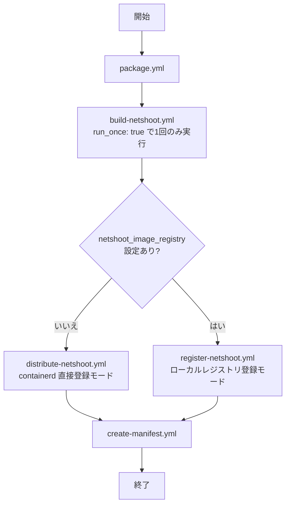

# netshoot-no-portscan ロール

[nicolaka/netshoot](https://github.com/nicolaka/netshoot) をベースに, ポートスキャンツール (nmap, nmap-nping, nmap-scripts) を除去した安全なネットワーク診断用コンテナイメージを構築し, Kubernetes クラスタに配布するロールです。このロールは, セキュリティポリシー上 nmap 等のポートスキャンツールを搭載できない環境においても, tcpdump, ping, curl 等のネットワーク検証ツールを Pod として使用可能にします。

本ロールは, `inventory/hosts`内の`k8s_management`グループに記載されたノード(Kubernetesコントロールプレインノード)の構築処理の一環として実行されます。


- [netshoot-no-portscan ロール](#netshoot-no-portscan-ロール)
  - [用語](#用語)
  - [前提条件](#前提条件)
  - [概要](#概要)
    - [ポートスキャンツール除去の仕組み](#ポートスキャンツール除去の仕組み)
  - [実行フロー](#実行フロー)
    - [コンテナイメージの構築と配布の流れ](#コンテナイメージの構築と配布の流れ)
    - [イメージ配布モードの選択](#イメージ配布モードの選択)
      - [containerd 直接登録モード](#containerd-直接登録モード)
      - [ローカルレジストリ登録モード](#ローカルレジストリ登録モード)
  - [主要変数](#主要変数)
  - [テンプレートと生成ファイル](#テンプレートと生成ファイル)
    - [コンテナイメージをK8sクラスタに展開するためのマニフェストの生成](#コンテナイメージをk8sクラスタに展開するためのマニフェストの生成)
      - [生成されるマニュフェストの仕様](#生成されるマニュフェストの仕様)
      - [`netshoot_image_registry` 変数によるイメージ参照先とpullポリシーの切り替え](#netshoot_image_registry-変数によるイメージ参照先とpullポリシーの切り替え)
  - [実行方法](#実行方法)
  - [コンテナイメージの展開(デプロイ)方法](#コンテナイメージの展開デプロイ方法)
  - [主な処理](#主な処理)
    - [コンテナイメージ構築処理 (`build-netshoot.yml`)](#コンテナイメージ構築処理-build-netshootyml)
    - [containerd 直接登録による配布処理 (`distribute-netshoot.yml`)](#containerd-直接登録による配布処理-distribute-netshootyml)
    - [ローカルレジストリ登録処理 (`register-netshoot.yml`)](#ローカルレジストリ登録処理-register-netshootyml)
    - [マニフェスト作成処理 (`create-manifest.yml`)](#マニフェスト作成処理-create-manifestyml)
  - [検証ポイント](#検証ポイント)
  - [トラブルシューティング](#トラブルシューティング)
    - [Docker ビルドが失敗する場合](#docker-ビルドが失敗する場合)
    - [containerd へのイメージ登録が失敗する場合](#containerd-へのイメージ登録が失敗する場合)
    - [ローカルレジストリへの push が失敗する場合](#ローカルレジストリへの-push-が失敗する場合)
    - [Pod が起動しない場合](#pod-が起動しない場合)
        - [containerdの設定確認](#containerdの設定確認)
  - [留意事項](#留意事項)
  - [参考リンク](#参考リンク)


## 用語

| 正式名称 | 略称 | 意味 |
| --- | --- | --- |
| Kubernetes | K8s | コンテナを管理する基盤ソフトウエア。 |
| Container Runtime Interface | CRI | Kubernetes がコンテナランタイムと通信するための標準インタフェース。 |
| containerd | - | Kubernetes が使用する標準コンテナランタイム。CRI を実装し, コンテナイメージの管理と実行を担う。 |
| ポッド ( Pod ) | - | Kubernetes の最小展開単位。1 個以上のコンテナで構成される実行環境。 |
| コントロールプレーンノード ( Control Plane Node ) | - | Kubernetes クラスタを制御するコンポーネントが動作するノード。 |
| ワーカノード ( Worker Node ) | - | Kubernetes クラスタで実際に Pod が実行されるノード。 |
| kubeconfig | - | kubectl がKubernetes クラスタへ接続するための設定ファイル。クラスタの接続先 URL, 認証情報, 名前空間などを定義する。 |
| マニフェスト ( Manifest ) | - | Kubernetes のリソース ( Pod, Deployment など ) を YAML 形式で定義したファイル。`kubectl apply` コマンドでクラスタに適用することで, 定義されたリソースが作成される。 |
| 名前空間 ( namespace ) | - | Kubernetes におけるリソースのグループ化と分離の仕組み。 |
|制御ホスト| - | Ansible 実行ホストや仮想マシン(VM)を指す。 localhostを意味する。|
|構築ホスト| - | 公式のソースを元にパッケージ構築処理を実施する際に使用するホスト。 本ロールの制御変数`go_build_host`で定義したホストを意味する。 |
| Docker | - | コンテナイメージの構築と実行を行うツール。このロールでは制御ホスト上でのイメージビルドと tar 形式への保存に使用する。 |
| nmap | - | ネットワーク上のホストやポートを探索 ( スキャン ) するツール。本ロールでは, セキュリティポリシー上 nmap 等のポートスキャンツールを搭載できない環境での使用を想定し, nmap関連ツールをコンテナイメージから除去している。 |
| nicolaka/netshoot | netshoot | ネットワーク診断ツールを多数搭載した公開コンテナイメージ。 詳細は, [netshootのGithub](https://github.com/nicolaka/netshoot)を参照。|
| imagePullPolicy | - | Kubernetes がコンテナイメージを取得する際の方針を指定するフィールド。`Never` はK8sの各ノードのCRI内の既存イメージのみ使用, `IfNotPresent` はノード上に存在しない場合のみ取得, `Always` は常に取得を行う。 |

## 前提条件

- 制御ホストと構築ホスト上に Docker がインストールされていること
- 制御ホストから Kubernetes クラスタの各ノードへ SSH 接続可能であること
- `k8s-register-image` ロールが同一リポジトリ内に存在すること (containerd 直接登録モードで必要)
- ローカルレジストリ登録モードを使用する場合は, 制御ホストの `/etc/docker/daemon.json` に `insecure-registries` が設定されていること (詳細は, `[roles/docker-ce/Readme.md](../roles/docker-ce/Readme.md)参照)
- Kubernetes コントロールプレイン/ワーカノードの containerdのレジストリ設定 ( `/etc/containerd/certs.d/<レジストリ名>/hosts.toml` )が, ローカルレジストリを参照可能なように設定されていること (詳細は, `[roles/k8s-common/Readme.md](../roles/k8s-common/Readme.md)参照)


## 概要

このロールは以下の手順でコンテナイメージを構築し, Kubernetes クラスタへ配布します。

1. [nicolaka/netshoot](https://github.com/nicolaka/netshoot) のソースコードを GitHub から取得する
2. `netshoot-no-portscan.patch` を Dockerfile に適用して nmap 系パッケージを除去する
3. Docker を使用してコンテナイメージをビルドし, tar ファイルとして保存する
4. 構築したイメージを以下のいずれかの方法で Kubernetes ノードへ配布する
   - containerd 直接登録モード: `k8s-register-image` ロールを使用してコントロールプレーン/ワーカノードの containerd に直接インポートする
   - ローカルレジストリ登録モード: Docker でローカルレジストリへ push する
5. Kubernetes 向けのデバッグ用 Pod マニフェストファイルを生成する

### ポートスキャンツール除去の仕組み

`files/netshoot-no-portscan.patch` を [nicolaka/netshoot](https://github.com/nicolaka/netshoot) の Dockerfile に適用することで, 以下の3パッケージの Alpine Linux `apk` インストール行を削除します。

```
- nmap
- nmap-nping
- nmap-scripts
```

## 実行フロー

### コンテナイメージの構築と配布の流れ



`tasks/package.yml`を起点に, コンテナイメージファイルの作成からK8sノード上のCRIへのコンテナイメージ登録, または, ローカルレジストリへのコンテナイメージ登録を実施する。

|ファイル|機能|
|---|---|
|`tasks/package.yml`|コンテナイメージの構築からローカルレジストリへの登録, または, 各K8sノード上のCRIへのコンテナイメージ登録までの処理フローを定義|
|`tasks/build-netshoot.yml`|[nicolaka/netshoot](https://github.com/nicolaka/netshoot) のコンテナイメージファイルを作成する処理を定義。 本処理は, 複数ホストへの並列実行時でも構築ホスト上でのビルドが1回だけ実行されるよう`run_once: true`を指定して実行される。|
|`tasks/distribute-netshoot.yml`|`tasks/build-netshoot.yml`で作成したコンテナイメージをK8sノード(コントロールプレイン/ワーカノード)上で動作しているCRIに登録する処理を定義。`netshoot_image_registry`変数が未定義, または, 空文字列の場合に実行される。|
|`tasks/register-netshoot.yml`|`tasks/build-netshoot.yml`で作成したコンテナイメージをローカルレジストリに登録する処理を定義。`netshoot_image_registry`変数が定義されており, かつ, 空文字列でない場合に実行される。|
|`tasks/create-manifest.yml`|[nicolaka/netshoot](https://github.com/nicolaka/netshoot) のコンテナをK8sクラスタに展開(デプロイ)するためのサンプルマニュフェストファイルを生成する処理を定義。|


### イメージ配布モードの選択

`netshoot_image_registry` の設定有無によって配布モードが自動的に選択されます。

- `containerd 直接登録モード` `netshoot_image_registry` が未定義または空文字の場合に選択されるモードです。K8sクラスタを構成するノード(コントロールプレイン/ワーカーノード)上のCRIにコンテナイメージを登録します。
- `ローカルレジストリ登録モード` `netshoot_image_registry` が定義され, かつ, 空文字列でない場合に選択されるモードです。ローカルレジストリにコンテナイメージを登録します。

#### containerd 直接登録モード

`netshoot_image_registry` が未設定または空文字の場合に選択されます。`k8s-register-image` ロールを使用して, 制御ホスト上の tar ファイルを SSH 経由で各ノードに転送し, `ctr` コマンドで containerd に直接登録(インポート)します。

コントロールプレーンノードへの登録後, `kubectl` でワーカノード一覧を自動検出し, 各ワーカノードにも同様に登録します。

生成されるマニフェストの `imagePullPolicy` は `Never` となり, ノード上にキャッシュ済みのイメージを使用します。

#### ローカルレジストリ登録モード

`netshoot_image_registry` に値が設定されている場合に選択されます。制御ホスト上で, dockerコマンド( `docker load`, `docker tag`, `docker push` )を実行することで, `netshoot_image_registry`で指定されたローカルレジストリにコンテナイメージを登録します。

`netshoot_image_registry`の設定例は以下の通り:

```yaml
netshoot_image_registry: "registry1.local:5000/netshoot"
```

上記設定の場合, 本ロールで作成されたコンテナイメージは, `registry1.local:5000/netshoot:v0.16` としてレジストリに登録されます。なお, `v0.16`部分は, `netshoot_no_portscan_version`変数の値に応じて設定されます。

生成されるマニフェストの `imagePullPolicy` は `IfNotPresent` となり, ローカルレジストリからのイメージ取得を行います。


## 主要変数

| 変数名 | 既定値 | 説明 |
| --- | --- | --- |
| `netshoot_no_portscan_enabled` | `false` | `true` に設定するとロールの処理が有効になる。 |
| `netshoot_no_portscan_version` | `"v0.16"` | 使用する netshoot のバージョン。 使用する版数に応じて設定することを想定。|
| `netshoot_no_portscan_image` | `"nicolaka/netshoot:v0.16"` | ビルドするコンテナイメージ名。 `netshoot_no_portscan_version`変数に基づいて設定される内部変数であり変更しないこと。|
| `netshoot_no_portscan_image_file` | `"nicolaka-netshoot-v0.16.tar"` | tar 形式で保存するコンテナイメージファイル名。 `netshoot_no_portscan_version`変数に基づいて設定される内部変数であり変更しないこと。|
| `netshoot_src_url` | `"https://github.com/nicolaka/netshoot"` | netshoot ソースコードの取得元 URL。 |
| `netshoot_build_host` | `"localhost"` | コンテナイメージをビルドするホスト。 |
| `netshoot_work_dir` | `"/tmp/netshoot-work"` | ビルドホスト上の作業ディレクトリ。 |
| `netshoot_build_dir` | `"{{ netshoot_work_dir }}/build"` | Dockerfile が配置されるディレクトリ。 |
| `netshoot_output_dir` | `"{{ netshoot_work_dir }}/output"` | ビルドホスト上のイメージ出力先ディレクトリ。 |
| `netshoot_output_dir_on_control_host` | `"{{ netshoot_work_dir }}/artifacts"` | 制御ホスト上のイメージ保管先ディレクトリ。 |
| `netshoot_docker_build_network` | `"host"` | `docker build` 時のネットワークモード。`host` を指定するとビルドコンテナがホストの DNS 設定を引き継ぎ, `apk` の名前解決失敗を防ぐ。 |
| `netshoot_unqualified_image_registry` | `"registry1.local"` | 未修飾名イメージ参照時に補完するレジストリ名。 |
| `netshoot_remote_cache_dir` | `"/tmp/netshoot-register"` | 各 K8s ノード上のイメージ転送先一時ディレクトリ。 |
| `netshoot_kubeconfig_path` | `"/etc/kubernetes/admin.conf"` | ワーカノード自動検出に使用する kubeconfig のパス。 |
| `netshoot_image_registry` | `""` | ローカルレジストリ登録モードで使用するレジストリの URL。未設定の場合は containerd 直接登録モードを使用する。設定例: `"registry1.local:5000/netshoot"` `vars/all-config.yml`, または, K8sコントロールプレインのhost_varsファイルで設定することを想定しています。|
| `netshoot_k8s_manifest_dir` | `"/opt/maintenance/netshoot/manifests"` | K8sコントロールノード上のマニフェストファイルの格納先ディレクトリ。 |
| `netshoot_manifest_file_path` | `"{{ netshoot_k8s_manifest_dir }}/netshoot-no-portscan.yml"` | 生成されるマニフェストファイルのパス。 |
| `netshoot_k8s_namespace` | `"default"` | Pod を展開する Kubernetes の名前空間 ( namespace )。 |
| `netshoot_k8s_pod_name` | `"netshoot"` | 展開する Pod の名前。 |


## テンプレートと生成ファイル

| テンプレートファイル | 生成先 | 説明 |
| --- | --- | --- |
| `templates/netshoot-no-portscan.yml.j2` | `{{ netshoot_manifest_file_path }}` | netshoot Pod のマニフェストファイル。`imagePullPolicy` と参照イメージを自動選択する。 |
| `templates/build-netshoot.sh.j2` | `{{ netshoot_build_dir }}/build-netshoot.sh` | `docker build` と `docker save` を実行するシェルスクリプト。 |

### コンテナイメージをK8sクラスタに展開するためのマニフェストの生成

本ロールでは, 生成したコンテナイメージを投入するためのマニュフェストファイルをコントロールプレイン上に保存します。本マニュフェストは,
`templates/netshoot-no-portscan.yml.j2` テンプレートファイルから生成されます。


#### 生成されるマニュフェストの仕様

生成されるマニフェストの Pod 仕様は以下の通りです。

- `NET_ADMIN`, `NET_RAW` ケーパビリティを付与し, `ip`, `tcpdump` 等のネットワークツールが使用可能
- コマンドは `sleep infinity` で Pod を起動し続け, `kubectl exec` で接続して使用する
- `restartPolicy: Never` で自動再起動しない
- `hostNetwork: false`, `dnsPolicy: ClusterFirst` で Pod 間通信のデバッグに適した設定

マニュフェストの適用例, [nicolaka/netshoot](https://github.com/nicolaka/netshoot)のPodに接続するコマンドの例を以下に示します:

```yaml
# マニフェスト適用例
kubectl apply -f /opt/maintenance/netshoot/manifests/netshoot-no-portscan.yml

# Pod に接続してネットワーク診断を実行する例
kubectl exec -it netshoot -- /bin/bash
```


#### `netshoot_image_registry` 変数によるイメージ参照先とpullポリシーの切り替え

本ロールでは, `netshoot_image_registry`変数の定義に基づいてイメージ参照先とイメージ取得方法(`imagePullPolicy`)を以下のように出力します:

| 条件 | イメージ参照先 | imagePullPolicy |
| --- | --- | --- |
| `netshoot_image_registry` が定義されており, かつ, 空文字列でない | ローカルレジストリからイメージを取得(pull)するよう設定(`{{ netshoot_image_registry }}:{{ netshoot_no_portscan_version }}`) | `IfNotPresent` |
| `netshoot_image_registry` が未定義, または, 空文字列 | 各K8sノードのCRI内に登録されるイメージ名を設定(`{{ netshoot_no_portscan_image }}`) | `Never` |


## 実行方法

`vars/all-config.yml`, または, K8sコントロールプレインノードのhost_varsファイル内で, `netshoot_no_portscan_enabled` を `true` に設定したうえで, 本ロールを実行します。
本ロールの実行手順は以下の通りです:

```bash
# site.yml 経由で実行する
ansible-playbook -i inventory/hosts site.yml

# ロールを単独で対象ホストに実行する
ansible-playbook -i inventory/hosts site.yml --tags netshoot-no-portscan

# makeターゲットで本ロールの実行を指示する
make run_netshoot_no_portscan
```

## コンテナイメージの展開(デプロイ)方法

本ロール実行後, コントロールプレーンノードで以下のコマンドでマニフェストを適用することで, 本ロールで作成したコンテナイメージをK8sクラスタに展開します。

```bash
kubectl apply -f /opt/maintenance/netshoot/manifests/netshoot-no-portscan.yml
kubectl get pod netshoot
```


## 主な処理

### コンテナイメージ構築処理 (`build-netshoot.yml`)

`run_once: true` で指定されており, 複数ホストへの並列実行時でも1回のみ実行されます。

1. 作業ディレクトリ (`netshoot_work_dir`) を削除して再作成する
2. GitHub から netshoot ソースコードを `git clone` する
3. `netshoot-no-portscan.patch` を Dockerfile に適用して nmap 系パッケージを除去する
4. `build-netshoot.sh.j2` テンプレートからシェルスクリプトを生成する
5. シェルスクリプトを実行して `docker build` と `docker save` を行う
6. 生成された tar ファイルを制御ホストの `netshoot_output_dir_on_control_host` に転送する


### containerd 直接登録による配布処理 (`distribute-netshoot.yml`)

`netshoot_image_registry` が未設定の場合に実行されます。`k8s-register-image` ロールを使用します。

1. コントロールプレーンノードへの登録:
   - インベントリの `k8s_ctrlplane` グループからコントロールプレーンホスト一覧を自動解決する
   - 制御ホストから各コントロールプレーンノードへ tar ファイルを転送し, containerd にインポートする
2. ワーカノードの自動検出:
   - `netshoot_kubeconfig_path` に指定した kubeconfig を参照し, `kubectl` でワーカノード一覧を取得する
   - 検出したワーカノードを動的インベントリに追加する
3. ワーカノードへの登録:
   - 動的インベントリのワーカノードへ tar ファイルを転送し, containerd にインポートする
   - `netshoot_cleanup_remote_tar` が `true` の場合, インポート後に一時 tar ファイルを削除する


### ローカルレジストリ登録処理 (`register-netshoot.yml`)

`netshoot_image_registry` が設定されている場合に実行されます。全タスクが `delegate_to: localhost` と `run_once: true` で制御ホスト上で1回のみ実行されます。

1. `docker load` で制御ホスト上の tar ファイルからイメージをロードする
2. `docker tag` で `{{ netshoot_image_registry }}:{{ netshoot_no_portscan_version }}` のタグを付与する
3. `docker push` でローカルレジストリへ push する


### マニフェスト作成処理 (`create-manifest.yml`)

マニフェスト格納先ディレクトリを作成し, `netshoot-no-portscan.yml.j2` テンプレートからマニフェストファイルを生成します。このタスクは配布モードに関わらず常に実行されます。

## 検証ポイント

**コンテナイメージのビルド確認**

playbook実行に成果物であるコンテナイメージtarファイルが作成されていることを確認するためのコマンド例を以下に示します:

```bash
# 制御ホスト上で tar ファイルが生成されたことを確認する
ls -la /tmp/netshoot-work/output/
ls -la /tmp/netshoot-work/artifacts/
```

実行結果の例:
```bash
$ ls -la /tmp/netshoot-work/output/
合計 207072
drwxr-xr-x 2 root root      4096  7月 12 14:33 .
drwxr-xr-x 5 root root      4096  7月 12 14:33 ..
-rw-r--r-- 1 root root 212026880  7月 12 14:33 nicolaka-netshoot-v0.16.tar
$ ls -la /tmp/netshoot-work/artifacts/
合計 207072
drwxrwxrwx 2 root root      4096  7月 12 14:33 .
drwxr-xr-x 5 root root      4096  7月 12 14:33 ..
-rw-r--r-- 1 root root 212026880  7月 12 14:33 nicolaka-netshoot-v0.16.tar

```

**ローカルレジストリへの登録確認 (ローカルレジストリ登録モードの場合)**

ローカルレジストリのエンドポイントが`http://registry1.local:5000`の場合の例を以下に示します:

レジストリ上のリポジトリ一覧を確認するコマンド例は以下の通り:
```bash
curl http://registry1.local:5000/v2/_catalog
```

期待される出力("repositories"のリストに"netshoot"が含まれること):
```json
{"repositories":["netshoot"]}
```

レジストリ上のnetshoot のタグ一覧を確認するコマンド例は以下の通り:
```bash
curl http://registry1.local:5000/v2/netshoot/tags/list
```

期待される出力:
```json
{"name":"netshoot","tags":["v0.16"]}
```

実行結果の例:
```bash
$ curl http://registry1.local:5000/v2/_catalog
{"repositories":["netshoot"]}
$ curl http://registry1.local:5000/v2/netshoot/tags/list
{"name":"netshoot","tags":["v0.16"]}
```

**containerd への登録確認 (containerd 直接登録モードの場合)**

containerdへのコンテナイメージ登録が正常に行われていることを
K8sのコントロールプレーンノードとワーカーノードで確認するためのコマンド例を以下に示します:

```bash
sudo crictl images | grep netshoot
```

コントロールプレーンノードで確認する
```bash

ssh ansible@k8sctrlplane01 "sudo crictl images | grep netshoot"

# ワーカノードで確認する
ssh ansible@k8sworker0101 "sudo crictl images | grep netshoot"
```

期待される出力の例:
```bash
docker.io/nicolaka/netshoot                v0.16               c52d5254f8d9f       212MB
registry1.local/nicolaka/netshoot          v0.16               c52d5254f8d9f       212MB
```
以下の点を確認します:
- nicolaka/netshootを含むエントリが出力されること(上記の場合, `docker.io/nicolaka/netshoot`, `registry1.local/nicolaka/netshoot`の2件のエントリ)
- コンテナイメージの版数が`netshoot_no_portscan_version`変数で指定した版数と一致すること(上記の場合, `v0.16`)
- `netshoot_unqualified_image_registry`変数で指定したエンドポイントと一致するエントリが含まれること(上記の場合, `docker.io/nicolaka/netshoot`で始まるエントリ)
- レジストリのエンドポイントが`netshoot_image_registry`変数で指定したエンドポイントと一致するエントリが含まれること(上記の場合, `registry1.local/nicolaka/netshoot`で始まるエントリ)

実行結果の例:
```bash
$ sudo crictl images | grep netshoot
docker.io/nicolaka/netshoot                v0.16               c52d5254f8d9f       212MB
registry1.local/nicolaka/netshoot          v0.16               c52d5254f8d9f       212MB
```

**マニフェストの適用と Pod の起動確認**

コントロールプレインノード上で, 本ロールにより配置されたマニュフェスト(規定では, `/opt/maintenance/netshoot/manifests/netshoot-no-portscan.yml`)を用いて, Podの展開(デプロイ)から起動までを確認する手順を以下に示します(括弧内はコマンド例):

1. Podを展開し, `pod/netshoot configured`と表示されること(`kubectl apply -f /opt/maintenance/netshoot/manifests/netshoot-no-portscan.yml`)
2. Podの状態を確認し, STATUSが`Running`と表示されること(`kubectl get pod netshoot -o wide`)
3. Podの詳細情報を確認し, エラーメッセージが出ていないこと(`kubectl describe pod netshoot`)

上記のコマンド例をまとめると以下のようになります:
```bash
kubectl apply -f /opt/maintenance/netshoot/manifests/netshoot-no-portscan.yml
kubectl get pod netshoot -o wide
kubectl describe pod netshoot
```

実行結果の例:
```bash
$ kubectl apply -f /opt/maintenance/netshoot/manifests/netshoot-no-portscan.yml
pod/netshoot configured
$ kubectl get pod netshoot -o wide
NAME       READY   STATUS    RESTARTS   AGE   IP                         NODE            NOMINATED NODE   READINESS GATES
netshoot   1/1     Running   0          8h    fdb6:6e92:3cfb:208::4862   k8sworker0101   <none>           <none>
$ kubectl describe pod netshoot
Name:             netshoot
Namespace:        default
Priority:         0
Service Account:  default
Node:             k8sworker0101/fdad:ba50:248b:1::42
Start Time:       Sun, 12 Jul 2026 17:12:52 +0900
Labels:           app=netshoot
Annotations:      k8s.v1.cni.cncf.io/network-status:
                    [{
                        "name": "cilium",
                        "interface": "eth0",
                        "ips": [
                            "fdb6:6e92:3cfb:208::4862",
                            "10.244.8.40"
                        ],
                        "mac": "22:30:80:e9:fd:bd",
                        "default": true,
                        "dns": {},
                        "gateway": [
                            "fdb6:6e92:3cfb:208::fa41",
                            "10.244.8.153"
                        ]
                    }]
Status:           Running
IP:               fdb6:6e92:3cfb:208::4862
IPs:
  IP:  fdb6:6e92:3cfb:208::4862
  IP:  10.244.8.40
Containers:
  netshoot:
    Container ID:  containerd://20def482111801c80f65d7a0fc701328de62b688b4202e22b33a5c939c270955
    Image:         registry1.local:5000/netshoot:v0.16
    Image ID:      registry1.local:5000/netshoot@sha256:8a7b3c33919b02ed46e5448b2bab1b870a0ef59e8435b3b2cb2855e8c96e4cc9
    Port:          <none>
    Host Port:     <none>
    Command:
      /bin/bash
      -c
      trap : TERM INT; sleep infinity & wait
    State:          Running
      Started:      Sun, 12 Jul 2026 17:13:31 +0900
    Ready:          True
    Restart Count:  0
    Limits:
      cpu:     500m
      memory:  512Mi
    Requests:
      cpu:        100m
      memory:     128Mi
    Environment:  <none>
    Mounts:
      /var/run/secrets/kubernetes.io/serviceaccount from kube-api-access-gp65z (ro)
Conditions:
  Type                        Status
  PodReadyToStartContainers   True
  Initialized                 True
  Ready                       True
  ContainersReady             True
  PodScheduled                True
Volumes:
  kube-api-access-gp65z:
    Type:                    Projected (a volume that contains injected data from multiple sources)
    TokenExpirationSeconds:  3607
    ConfigMapName:           kube-root-ca.crt
    ConfigMapOptional:       <nil>
    DownwardAPI:             true
QoS Class:                   Burstable
Node-Selectors:              <none>
Tolerations:                 node.kubernetes.io/not-ready:NoExecute op=Exists for 300s
                             node.kubernetes.io/unreachable:NoExecute op=Exists for 300s
Events:                      <none>
```

**[nicolaka/netshoot](https://github.com/nicolaka/netshoot)をPod内でネットワークツールが使用可能であることの確認方法**

Pod に接続してネットワークツールが使用可能であることを確認するためには, コンテナイメージ名(`netshoot`)を指定して, `kubectl exec -it`コマンドにより, コンテナ内に入り, [nicolaka/netshoot](https://github.com/nicolaka/netshoot)同梱のコマンド(pingなど)を実行します。

コマンド例を以下に示します:
```bash
kubectl exec -it netshoot -- ping -c 3 8.8.8.8
kubectl exec -it netshoot -- curl -I https://example.com
```

実行結果の例:
```bash
$ kubectl exec -it netshoot -- ping -c 3 8.8.8.8

PING 8.8.8.8 (8.8.8.8) 56(84) bytes of data.
64 bytes from 8.8.8.8: icmp_seq=1 ttl=115 time=6.35 ms
64 bytes from 8.8.8.8: icmp_seq=2 ttl=115 time=4.55 ms
64 bytes from 8.8.8.8: icmp_seq=3 ttl=115 time=5.10 ms

--- 8.8.8.8 ping statistics ---
3 packets transmitted, 3 received, 0% packet loss, time 2003ms
rtt min/avg/max/mdev = 4.553/5.334/6.353/0.753 ms
$ kubectl exec -it netshoot -- curl -I https://example.com
HTTP/2 200
date: Sun, 12 Jul 2026 17:11:40 GMT
content-type: text/html
server: cloudflare
last-modified: Wed, 01 Jul 2026 17:50:18 GMT
allow: GET, HEAD
accept-ranges: bytes
age: 5
cf-cache-status: HIT
cf-ray: a1a1ab1f891f264a-NRT
```


## トラブルシューティング

### Docker ビルドが失敗する場合

Alpine の `apk update` で DNS 解決に失敗するエラーが発生する場合は, `netshoot_docker_build_network: "host"` が設定されていることを確認します(`defaults/main.yml`中での規定値は, `"host"`です)。
`host` を指定することでビルドコンテナがホストの DNS 設定を引き継ぎます。

なお, 制御ホストの DNS 解決が正常であることを確認するコマンド例は以下のようになります:
```bash
nslookup dl-cdn.alpinelinux.org
```
または,
```bash
dig dl-cdn.alpinelinux.org
```
または,
```bash
getent hosts dl-cdn.alpinelinux.org
```

### containerd へのイメージ登録が失敗する場合

各K8sノードで `crictl images|grep netshoot` を実行してイメージが正しく登録されていることを確認した際に, [nicolaka/netshoot](https://github.com/nicolaka/netshoot)のコンテナイメージが見つからなかった場合は, 以下のコマンドによりcontainerd のログを確認し, エラーメッセージが出ていないことを確認し, エラーの内容に応じて対処してください:

```bash
sudo journalctl -u containerd -n 50
```

### ローカルレジストリへの push が失敗する場合

ローカルレジストリが HTTP (非 TLS) で動作している場合, 制御ホストの Docker が HTTPS で接続しようとしてエラーになります。 以下のコマンドにより`/etc/docker/daemon.json` の `insecure-registries` にローカルレジストリのエントリポイントが登録されていることを確認してください。

```bash
# Docker の設定を確認する
cat /etc/docker/daemon.json
docker info | grep -A5 "Insecure Registries"
```

`/etc/docker/daemon.json` の `insecure-registries`の記載例は以下の通りです。リスト中に`netshoot_image_registry`変数で指定したエンドポイント(下記の場合, `"registry1.local:5000"`)が含まれることを確認してください:
```json
{
  "insecure-registries": ["registry1.local:5000", "registry2.local:5000"]
}
```

`docker info | grep -A5 "Insecure Registries`コマンドで確認した場合の例:
```bash
$ docker info | grep -A5 "Insecure Registries"
 Insecure Registries:
  registry1.local:5000
  registry2.local:5000
  ::1/128
  127.0.0.0/8
 Live Restore Enabled: false
```

`/etc/docker/daemon.json`を適切に修正の上, 以下のコマンドによりDocker デーモンを再起動して設定を反映させてください:
```bash
sudo systemctl restart docker
```


### Pod が起動しない場合

`ErrImagePull` や `ImagePullBackOff` が発生する場合は, ワーカノードの containerd レジストリ設定を確認します。

##### containerdの設定確認

ワーカーノード上で以下のコマンドを実行し, ローカルレジストリからのイメージ取得を可能に設定されていることを確認してください(以下の`<ローカルレジストリのエンドポイント>`の部分は, `netshoot_image_registry`変数で指定したエンドポイントに合わせて修正してください):
```bash
cat /etc/containerd/certs.d/<ローカルレジストリのエンドポイント>/hosts.toml
```

実行結果の例:
```bash
$ cat /etc/containerd/certs.d/registry1.local:5000/hosts.toml
#
#  -*- coding:utf-8 mode:toml -*-
# This file is generated by ansible.
# last update: 2026-07-12 17:09:19 JST
#
#
# registry1.local:5000用のコンテナレジストリ設定
#
# コンテナレジストリサーバ
server = "http://registry1.local:5000"

[host."http://registry1.local:5000"]
  capabilities = ["pull", "resolve", "push"]
  skip_verify = true
```

確認項目は以下の通りです:

- `capabilities`に`"pull"`が含まれること
- `skip_verify = true`に設定されていること

設定を適切に修正したら, 以下のコマンドによりcontainerd を再起動して設定を反映してください:
```bash
sudo systemctl restart containerd
```

その後, コントロールプレインノード上で, 以下のコマンドを実行し, 既存のpodを削除後, podを再度展開(デプロイ)してください。

```bash
# 既存のPodを削除する
kubectl delete pod netshoot
# Pod を再展開(デプロイ)する
kubectl apply -f /opt/maintenance/netshoot/manifests/netshoot-no-portscan.yml
# podの状態を一定周期ごとに出力する
kubectl get pod netshoot -w
```

`imagePullPolicy: Never` なのにイメージが見つからない場合は, 対象ノードに containerd 直接登録が完了しているか確認します。Kubernetes スケジューラが別のノードに Pod を配置した可能性があります。
Pod が配置されたノードを確認するには以下のコマンドを実行してください:

```bash
kubectl get pod netshoot -o wide
```

実行結果の例:
```bash
$ kubectl get pod netshoot -o wide
NAME       READY   STATUS    RESTARTS   AGE   IP                         NODE            NOMINATED NODE   READINESS GATES
netshoot   1/1     Running   0          9h    fdb6:6e92:3cfb:208::4862   k8sworker0101   <none>           <none>
```

対象ノードにイメージが存在することを確認するためには, Podが配置されたノード(上記の出力例の場合, `k8sworker0101`)にログイン後, 以下のコマンドを実行します:
```bash
sudo crictl images | grep netshoot
```

実行結果の例:
```bash
$ sudo crictl images | grep netshoot
registry1.local:5000/netshoot              v0.16               c52d5254f8d9f       212MB
```


## 留意事項

- コンテナイメージファイルの生成は, `netshoot_build_host`変数で指定された構築ホスト(規定は, Ansibleの制御ホスト(`localhost`))上で実施します。コンテナイメージファイルの生成処理中で, dockerコマンドを使用するため, 構築ホストに Docker がインストールされていない場合はビルドに失敗します。
- 複数ホストに同時に Playbook を適用した場合でも, ビルドおよびレジストリへの 登録(`push`) は1回のみ実行されます(playbook中で, `run_once: true` を指定することで, 代表となるノードでのみ実施),。
- マニュフェスト中のイメージ取得方式指定に, `imagePullPolicy: Never` が指定されている場合, イメージが各ノードの containerd に登録されていることが前提となります。新しいノードを追加した場合は, ロールを再実行して登録してください。
- マニュフェスト中のイメージ取得方式指定に, `imagePullPolicy: IfNotPresent` が指定されている場合, ローカルレジストリからk8sノードへのコンテナイメージをダウンロード可能となっていることが前提となります。Podの展開対象となる各K8sノードからローカルレジストリへアクセスできることを確認してください。


## 参考リンク

- [nicolaka/netshoot](https://github.com/nicolaka/netshoot) - ネットワーク診断コンテナイメージ, 本ロールでは, [nicolaka/netshoot](https://github.com/nicolaka/netshoot) から提供されるコンテナイメージ中に含まれるポートスキャン系ツールを除去したコンテナイメージファイルを生成する。
- [containerd hosts configuration](https://github.com/containerd/containerd/blob/main/docs/hosts.md) - containerd のレジストリ設定マニュアル
- [kubectl exec](https://kubernetes.io/docs/reference/kubectl/generated/kubectl_exec/) - Pod への接続コマンドマニュアル
- [roles/docker-ce/Readme.md](../roles/docker-ce/Readme.md) - 本playbook中のローカルレジストリの設定について記載した文書
- [roles/k8s-common/Readme.md](../roles/k8s-common/Readme.md) - 本playbook中のローカルレジストリをK8sのノードから使用するための設定について記載した文書
