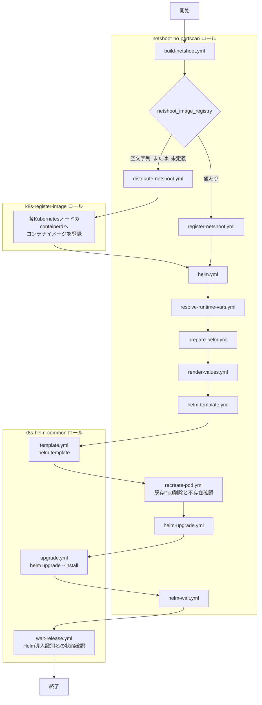

# netshoot-no-portscan ロール

本ロールは, [nicolaka/netshoot](https://github.com/nicolaka/netshoot)を基に, ポートスキャンなどに使用されるツール群を除去したネットワーク診断用コンテナイメージを構築します。構築したコンテナイメージをKubernetesクラスタで利用可能にし, ロール内に保持するHelm Chartを`k8s-helm-common`ロール経由で適用して`netshoot` Podを導入します。

## 目次

- [netshoot-no-portscan ロール](#netshoot-no-portscan-ロール)
  - [目次](#目次)
  - [用語](#用語)
  - [概要](#概要)
    - [標準のnicolaka/netshootとの相違](#標準のnicolakanetshootとの相違)
    - [ポートスキャンツール除去の仕組み](#ポートスキャンツール除去の仕組み)
    - [主な処理](#主な処理)
  - [前提条件](#前提条件)
  - [実行方法](#実行方法)
  - [主要変数](#主要変数)
    - [設定例](#設定例)
  - [テンプレートと生成ファイル](#テンプレートと生成ファイル)
  - [実行フロー](#実行フロー)
  - [検証ポイント](#検証ポイント)
    - [検証の前提条件](#検証の前提条件)
    - [検証環境の設定](#検証環境の設定)
    - [検証コマンドと期待結果](#検証コマンドと期待結果)
      - [1. Helm導入識別名状態](#1-helm導入識別名状態)
      - [2. netshoot Pod状態](#2-netshoot-pod状態)
      - [3. ローカルレジストリ上のコンテナイメージ](#3-ローカルレジストリ上のコンテナイメージ)
      - [4. containerd直接登録方式のコンテナイメージ](#4-containerd直接登録方式のコンテナイメージ)
      - [5. Pod内のネットワーク診断コマンド](#5-pod内のネットワーク診断コマンド)
  - [トラブルシューティング](#トラブルシューティング)
    - [1. コンテナイメージの構築が失敗する場合](#1-コンテナイメージの構築が失敗する場合)
    - [2. containerdへのコンテナイメージ登録が失敗する場合](#2-containerdへのコンテナイメージ登録が失敗する場合)
    - [3. ローカルレジストリへのコンテナイメージ登録が失敗する場合](#3-ローカルレジストリへのコンテナイメージ登録が失敗する場合)
    - [4. Helm導入又は更新が失敗する場合](#4-helm導入又は更新が失敗する場合)
    - [5. netshoot Podが起動しない場合](#5-netshoot-podが起動しない場合)
  - [注意事項](#注意事項)
  - [参考資料](#参考資料)
    - [公式ドキュメント](#公式ドキュメント)
    - [関連ロール](#関連ロール)

## 用語

| 正式名称 | 略称 | 意味 |
| --- | --- | --- |
| ユーザ | - | 機能を利用する人, 又は識別された利用主体。 |
| ツール | - | 特定作業を実行するための機能や道具。 |
| リソース | - | 処理に必要な計算機資源やデータ。 |
| クラスタ | - | 複数の機器を連携させて一体運用する構成。 |
| ディストリビューション | - | 基本ソフトウェアと関連部品をまとめた配布形態。 |
| コンテナイメージ | - | コンテナ実行に必要な内容をまとめた保存形式。 |
| プログラム | - | 計算機に処理をさせるための命令列。 |
| コミュニティ | - | 共通目的のもとで継続的に活動する利用者集団。 |
| プラグイン | - | 既存機能へ追加機能を組み込むための拡張部品。 |
| サービスアカウント (Service Account) | - | 自動処理中でサービスを呼び出す側のプログラムを識別するための識別情報。 |
| コンテナランタイム | - | コンテナを起動, 停止, 管理する実行基盤。 |
| リクエスト | - | 処理実行や情報取得を要求する操作。 |
| コントローラ | - | 対象状態を監視し, 期待状態へ調整する制御機能。 |
| メタデータ | - | 対象データの属性や説明を示す付加情報。 |
| バックエンド | - | 利用者画面の背後で処理を実行する側。 |
| ストレージ | - | データを保存する仕組み。 |
| インストール | - | ソフトウェアを導入して利用可能にする作業。 |
| マシン | - | 処理を実行する計算機。 |
| プロビジョニング | - | 利用開始に必要な設定や資源を準備する作業。 |
| ルーティング | - | 宛先までの経路を選択して転送する処理。 |
| オブジェクト | - | ひとかたまりとして扱うデータ単位。 |
| エージェント | - | 指示に従って処理を代行する構成要素。 |
| ストア | - | データや成果物を保存する場所。 |
| ジャーナル | - | 時系列の記録を保持する仕組み。 |
| アカウント | - | 利用者や処理主体を識別する登録情報。 |
| エンドポイント | - | 通信の接続先を表す識別点。 |
| ローカルレジストリエンドポイント | - | 制御ホストから接続するローカルレジストリの接続先情報。 |
| パターン | - | 繰り返し現れる構造や記述形式。 |
| パケット | - | ネットワークで転送するデータ単位。 |
| カーネル | - | 基本ソフトウェアの中核機能。 |
| シェル | - | コマンド入力で計算機を操作する仕組み。 |
| Playbook | - | 自動化処理の実行手順を記述したファイル。 |
| Canonical | - | Ubuntu を提供する組織名。 |
| Key-Value | - | キーと値の組で情報を表す方式。 |
| Internet Protocol | IP | ネットワーク上で宛先を識別し, データを届けるための通信手順。 |
| Structured Query Language | SQL | データベースを操作するための記述言語。 |
| Hypertext Transfer Protocol | HTTP | World Wide Webで情報をやり取りする通信手順。 |
| Hypertext Transfer Protocol Secure | HTTPS | 通信内容を暗号化してWorld Wide Web通信を行う方式。 |
| RPM Package Manager | RPM | RPM形式パッケージの導入, 更新, 削除, 情報参照を行う仕組み。 |
| Virtual Machine | VM | 物理計算機上で動作する仮想的な計算機。 |
| localhost | - | 同一機器自身を指す名前。 |
| root | - | Unix 系システムの最上位権限を持つ管理者識別子。 |
| ソフトウェア | - | 情報処理システムで使用するプログラム, 手順, 規則及び関連文書の全体又は一部分。 |
| システム | - | 複数の要素が連携して目的を実現する仕組み全体。 |
| アプリケーション | - | 利用者の目的を実現するために動作するソフトウェア。 |
| パッケージ | - | ソフトウェア導入に必要なファイルをまとめた配布単位。 |
| リポジトリ | - | ソフトウェアや設定情報を保管し, 取得できるようにした管理場所。 |
| コマンド | - | 実行者が計算機へ処理を指示するための命令。 |
| ホスト | - | 管理対象として識別される個別の計算機。 |
| サーバ | - | 他の機器や利用者へ機能やデータを提供する計算機, 又はその役割。 |
| コンテナ | - | アプリケーションを動かす隔離された実行単位。 |
| ネットワーク | - | 機器同士を接続してデータをやり取りする仕組み。 |
| アドレス | - | 宛先や所在を識別するための情報。 |
| プロトコル | - | 通信やデータ交換の手順を定めた取り決め。 |
| ディレクトリ | - | ファイルを階層的に整理するための入れ物。 |
| ログ | - | 処理の結果や状態を時系列で記録した情報。 |
| コード | - | 処理内容を記述した文字列。 |
| Pod | - | Kubernetes でコンテナをまとめて管理する最小単位。 |
| Linux | - | 多くの機器で使われる, 基本ソフトウェアの系統。 |
| Debian | - | コミュニティ主導で開発される Linux ディストリビューション。 |
| Ubuntu | - | Canonical が提供する Debian 系の Linux ディストリビューション。 |
| Ansible | - | 設定の同一化や導入作業を所定の手順に従って自動化する仕組み。 |
| World Wide Web | WWW | ネットワーク上で文書や情報を相互参照できる仕組み。 |
| Service | - | サービスの英語表記。 |
| Node | - | ノードの英語表記。 |
| Makefile | - | 実行手順を定義したファイル。 |
| Application Programming Interface | API | アプリケーション同士が機能やデータをやり取りするための取り決め。 |
| Uniform Resource Locator | URL | World Wide Web上の資源の場所を示す文字列。 |
| ポートスキャン (port scan) | - | ネットワーク上のサーバなどの機器の各ポート(通信端点)にデータを送り, その応答から​​開いているポートや稼働しているサービスを調べること。悪意を持ったポートスキャンを避ける目的から, 本ロールでは, ポートスキャンツール(nmap関連ツール, スクリプト)を除去している。 |
| Denial of Service 攻撃 ( Denial of Service Attack ) | DoS攻撃 | 大量のリクエストを標的のサーバに送り付け、Webサイトやサービスを機能停止に追い込む攻撃方法。 |
| フラッディング攻撃 (Flooding Attack) | - | 大量の送信データを一気に送ることにより洪水(flood)を起こさせる攻撃。DoS攻撃の一種。本攻撃用途に使用されることを避ける目的から本ロールでは, 任意パケット生成に使用されるツール(scapy)などを除去している。 |
| Kubernetes | K8s | コンテナを管理する基盤ソフトウェア。 |
| Container Runtime Interface | CRI | Kubernetesがコンテナランタイムと通信するための標準インターフェース。 |
| containerd | - | Dockerから分離された軽量なコンテナランタイム。 |
| ポッド ( Pod ) | - | Kubernetes上で動作するコンテナの最小単位。 |
| デプロイ ( Deploy ) | - | 機能や設定を実行環境へ展開し, 利用可能な状態にする作業。 |
| コントロールプレーンノード ( Control Plane Node ) | - | Kubernetesクラスタ全体を管理, 制御する中枢ノード群。kube-apiserver, kube-controller-manager, kube-schedulerなどが動作します。 |
| ワーカノード ( Worker Node ) | - | 実際にアプリケーションのPodを実行するノード。 |
| kubeconfig | - | Kubernetes 接続設定ファイルを指す名称。kubectl などが参照する。 |
| マニフェスト ( Manifest ) | - | Kubernetes のリソース ( Pod, Deployment など ) を YAML 形式で定義したファイル。`kubectl apply` コマンドでクラスタに適用することで, 定義されたリソースが作成される。 |
| 名前空間 ( namespace ) | - | Kubernetes内部でリソースを論理的に分離する単位。 |
| 制御ホスト | - | Playbook を実行し, 他ホストへの処理指示を行う管理用ホスト。 |
| 構築ホスト | - | パッケージや実行資材を生成する構築処理を担当するホスト。 |
| Docker | - | コンテナイメージやコンテナの作成, 実行, 管理を行うコマンド。 |
| nmap | - | ネットワーク上のホストやポートを探索 ( スキャン ) するツール。本ロールでは, セキュリティポリシー上 nmap 等のポートスキャンツールを搭載できない環境での使用を想定し, nmap関連ツールをコンテナイメージから除去している。 |
| nicolaka/netshoot | netshoot | ネットワーク診断ツールを多数搭載した公開コンテナイメージ。 詳細は, [netshootのGithub](https://github.com/nicolaka/netshoot)を参照。 |
| imagePullPolicy | - | Kubernetes がコンテナイメージを取得する際の方針を指定するフィールド。`Never` はK8sの各ノードのCRI内の既存イメージのみ使用, `IfNotPresent` はノード上に存在しない場合のみ取得, `Always` は常に取得を行う。 |
| Border Gateway Protocol | BGP | 自律システム間で経路情報を交換する経路制御方式。 |
| Domain Name System | DNS | 名前と IP アドレスを対応付ける仕組み。 |
| Hypertext Transfer Protocol | HTTP | World Wide Webで情報をやり取りする通信手順。 |
| Hypertext Transfer Protocol Secure | HTTPS | 通信内容を暗号化してWorld Wide Web通信を行う方式。 |
| Open Shortest Path First | OSPF | ルータ同士が内部ネットワークの到達経路を交換するための経路制御方式。 |
| Secure Shell | SSH | 遠隔の計算機へ安全に接続して操作する方式。 |
| Transport Layer Security | TLS | 通信経路でデータを暗号化して保護する仕組み。 |
| Uniform Resource Locator | URL | World Wide Web上の資源の場所を示す文字列。 |
| BIRD Internet Routing Daemon | BIRD | 複数の経路制御方式を扱う経路制御ソフトウェア。 |
| Simple Mail Transfer Protocol | SMTP | 電子メール送信で使う通信手順。 |
| ansible-playbookコマンド | - | Ansible Playbook を実行して自動構成処理を適用するコマンド。 |
| `cat` | - | ファイル内容を標準出力へ表示するコマンド。 |
| `curl` | - | URL を指定してデータ送受信を行うコマンド。 |
| `dig` | - | DNS 問い合わせ結果を詳細表示するコマンド。 |
| `docker` | - | コンテナイメージやコンテナの作成, 実行, 管理を行うコマンド。 |
| `getent` | - | システムの名前解決データベースを参照するコマンド。 |
| `journalctl` | - | systemd ジャーナルのログを参照するコマンド。 |
| `kubectl` | - | Kubernetesクラスタを操作するためのコマンドラインツール。 |
| `ls` | - | ファイルやディレクトリの一覧を表示するコマンド。 |
| makeコマンド | make | Makefile に定義された処理を実行するコマンド。 |
| `nslookup` | - | 名前解決結果を確認するコマンド。 |
| `sleep` | - | 指定秒数だけ処理を待機するコマンド。 |
| `ssh` | - | 遠隔ホストへ安全に接続して操作するコマンド。 |
| `systemctl` | - | systemd 管理下のサービスを起動, 停止, 状態確認するコマンド。 |
| `trap` | - | シェルスクリプトでシグナル受信時の処理を設定するコマンド。 |
| デバッグ | - | 不具合の原因を調査し修正する作業。 |
| ノード | - | ネットワークに接続された機器または処理単位。 |
| ログイン | - | 利用者認証を行って利用を開始する操作。 |
| ロード | - | 記憶媒体から実行環境へ読み込む処理。 |
| ローカルレジストリ | - | 実行中ホストまたは同一環境内で運用する成果物保管先。 |
| 対象ホスト | - | Playbook による設定変更や導入処理の適用先となるホスト。 |
| sudoコマンド | sudo | 一時的に管理者権限でコマンドを実行するためのコマンド。 |
| Helm | - | Kubernetes向けパッケージを導入, 更新, 削除するコマンド。 |
| Helm Chart | - | Helmで導入するKubernetesリソース定義のまとまり。 |
| Helm導入識別名 ( Helm release ) | - | Helm が管理する導入単位を識別する名前。 |
| values ファイル | - | Helm Chartへ渡す設定値を定義したYAMLファイル。 |
| helmコマンド | helm | Kubernetes向けパッケージの導入, 更新, 状態確認を実施するコマンド。 |
| timeoutコマンド | timeout | 指定した時間を上限として別のコマンドを実行するコマンド。 |
| crictlコマンド | crictl | Kubernetesノード上のコンテナランタイムへ問い合わせてコンテナイメージなどを確認するコマンド。 |
| grepコマンド | grep | テキストの中から条件に一致する行を抽出して表示するコマンド。 |
| pingコマンド | ping | 指定した宛先への通信到達性を確認するコマンド。 |
| kubectlコマンド | kubectl | Kubernetes API と通信してリソースを操作, 参照するコマンド。 |
| journalctlコマンド | journalctl | systemd ジャーナルのログを参照するコマンド。 |
| getentコマンド | getent | システムの名前解決データベースを参照するコマンド。 |
| dockerコマンド | docker | コンテナイメージやコンテナの作成, 実行, 管理を行うコマンド。 |
| curlコマンド | curl | URL を指定して通信結果を取得するコマンド。 |

## 概要

本ロールは, [nicolaka/netshoot](https://github.com/nicolaka/netshoot)のソースコードを取得し, `files/netshoot-no-portscan.patch`を適用して, ポートスキャンや大量パケット送信などに使用されるツール群を除去したコンテナイメージを構築します。

本ロールは, `inventory/hosts`の`k8s_management`グループに登録したKubernetesコントロールプレーンノードの構築処理の一部として実行します。本リポジトリでは, 1つのKubernetesクラスタにつき1つのコントロールプレーンノードを構成する前提で使用します。

構築したコンテナイメージの配布方法は, `netshoot_image_registry`の設定値により次の2方式から選択します。

- `netshoot_image_registry`が空文字列の場合は, `k8s-register-image`ロールを使用して各Kubernetesノードのcontainerdへコンテナイメージを直接登録します。
- `netshoot_image_registry`が空文字列でない場合は, 制御ホストからローカルレジストリへコンテナイメージを登録し, Kubernetesノードから取得可能にします。

コンテナイメージの配布後は, `files/netshoot-no-portscan-chart/`に保持するHelm Chartと, `templates/netshoot-values.yml.j2`から生成するvalues ファイルを使用します。`helm template`, `helm upgrade --install`, Helm導入識別名の`deployed`状態確認は`k8s-helm-common`ロールへ委譲します。

本ロールのHelm Chartは`netshoot`を単体Podとして管理します。Podでは`imagePullPolicy`など一部のフィールドを作成後に変更できないため, `tasks/recreate-pod.yml`で既存Podを削除し, Podが存在しないことを確認してから`helm upgrade --install`を実行します。これにより, `netshoot_image_registry`の設定変更によって`imagePullPolicy`が`Never`と`IfNotPresent`の間で切り替わる場合もPodを再作成して設定を反映します。

Helm導入識別名は既定で`netshoot-no-portscan`, Kubernetes名前空間は既定で`default`, Pod名は既定で`netshoot`です。再実行時は既存Podを削除してから`helm upgrade --install`を実行し, 最終的にHelm導入識別名が`deployed`状態であることを確認します。本ロールでは, 厳密な意味でのAnsibleの冪等性を独立した品質要件とはせず, 安定した再実行性, エラー時の検出性, タイムアウトと再試行, 最終状態の検証を重視します。

### 標準のnicolaka/netshootとの相違

ポートスキャン, フラッディング攻撃, DoS攻撃などに使用される可能性がある次のツール群を除去します。

| ツール | 機能概要 | 参考資料 |
| --- | --- | --- |
| nmap, nmap-nping, nmap-scripts | ポートスキャンに使用するツール群です。 | [nmap公式サイト](https://nmap.org/) |
| bird | BGP及びOSPFを扱う経路制御ソフトウェアです。 | [The BIRD Internet Routing Daemon](https://bird.network.cz/) |
| fping | 複数宛先へ並行して到達性を確認するツールです。 | [fping公式サイト](https://fping.org/) |
| scapy | 任意のパケットを生成, 送受信するためのプログラム部品です。 | [scapy公式サイト](https://scapy.net/) |
| swaks | SMTP通信を確認するツールです。 | [Swaks - Swiss Army Knife for SMTP](https://github.com/jetmore/swaks) |
| fortio | HTTPなどの通信負荷を生成するツールです。 | [Fortio公式サイト](https://fortio.org/) |

### ポートスキャンツール除去の仕組み

`files/netshoot-no-portscan.patch`を[nicolaka/netshoot](https://github.com/nicolaka/netshoot)のDockerfileへ適用し, nmap関連パッケージなどの導入処理とfortioの導入処理を削除します。

対象は次のとおりです。

```text
nmap
nmap-nping
nmap-scripts
bird
fping
scapy
swaks
fortio
```

### 主な処理

本ロールの主な処理は次のとおりです。

1. `tasks/build-netshoot.yml`で作業ディレクトリを再作成し, nicolaka/netshootのソースコードを取得します。
2. `files/netshoot-no-portscan.patch`をDockerfileへ適用し, `templates/build-netshoot.sh.j2`からコンテナイメージ構築用シェルスクリプトを生成します。
3. 構築ホストでコンテナイメージを構築し, tar形式のファイルを制御ホストへ転送します。
4. `netshoot_image_registry`が空文字列の場合は, `tasks/distribute-netshoot.yml`から`k8s-register-image`ロールを呼び出して各Kubernetesノードのcontainerdへコンテナイメージを登録します。
5. `netshoot_image_registry`が空文字列でない場合は, `tasks/register-netshoot.yml`でローカルレジストリへコンテナイメージを登録します。
6. `tasks/resolve-runtime-vars.yml`でHelm実行ユーザ, Helm導入識別名, Kubernetes名前空間, kubeconfig, values ファイル配置先, Helm操作時間に関する値, コンテナイメージ参照先を解決します。
7. `tasks/prepare-helm.yml`でロール内のHelm ChartをHelm実行ユーザのホームディレクトリ配下へ配置します。
8. `tasks/render-values.yml`で`templates/netshoot-values.yml.j2`からvalues ファイルを生成します。
9. `tasks/helm-template.yml`から`k8s-helm-common`ロールの`template.yml`を呼び出し, Helm Chartを事前描画します。
10. `tasks/recreate-pod.yml`で既存の`netshoot` Podを削除し, Kubernetes APIでPodが存在しないことを確認します。初回導入時にPodが存在しない場合は削除済みとして処理を継続します。
11. `tasks/helm-upgrade.yml`から`k8s-helm-common`ロールの`upgrade.yml`を呼び出し, `helm upgrade --install`で`netshoot` Podを導入又は更新します。
12. `tasks/helm-wait.yml`から`k8s-helm-common`ロールの`wait-release.yml`を呼び出し, Helm導入識別名が`deployed`状態であることを確認します。

## 前提条件

本ロールを実行する前に, 次の条件が満たされていることを確認します。

- 制御ホスト及び`netshoot_build_host`で指定した構築ホストからDockerを実行可能であること。
- `k8s_management`グループの各対象ホストからKubernetes APIへ接続可能であること。
- `k8s_runtime_helm_operator_user`で指定されたHelm実行ユーザからhelmコマンドとtimeoutコマンドを実行可能であること。
- Helm実行ユーザのホームディレクトリ配下に`.kube/ca-embedded-admin.conf`が存在し, Helm実行ユーザから読み取り可能であること。
- containerd直接登録方式を使用する場合は, `k8s-register-image`ロールが同一リポジトリ内に存在し, 制御ホストからKubernetesノードへSSH接続可能であること。
- ローカルレジストリ方式を使用する場合は, 制御ホストから`netshoot_image_registry`で指定したローカルレジストリへ接続可能であること。
- ローカルレジストリ方式を使用する場合は, Kubernetesノードのcontainerdが当該ローカルレジストリからコンテナイメージを取得可能であること。

## 実行方法

`vars/all-config.yml`又はKubernetesコントロールプレーンノードの`host_vars`で`netshoot_no_portscan_enabled: true`を設定します。

本ロールだけを対象として実行する場合は, 制御ホストで次のmakeコマンドを実行します。

```bash
make run_netshoot_no_portscan
```

本ロールはHelm Chartの配置, values ファイル生成, `helm template`, 既存`netshoot` Podの削除と削除完了確認, `helm upgrade --install`, Helm導入識別名の状態確認まで自動的に実行します。旧方式のように, ロール実行後にマニフェストを手動で適用する操作は不要です。

## 主要変数

| 変数名 | 意味 | 既定値 | 設定例 |
| --- | --- | --- | --- |
| `netshoot_no_portscan_enabled` | 本ロールの処理を有効化します。 | `false` | `true` |
| `netshoot_no_portscan_version` | 使用するnicolaka/netshootの版数を指定します。 | `"v0.16"` | `"v0.16"` |
| `netshoot_no_portscan_helm_timeout_seconds` | helmコマンド全体及びHelmの待機処理に使用するタイムアウト時間を秒単位で指定します。 | `300` | `300` |
| `netshoot_no_portscan_helm_retries` | Helm操作失敗時に共通Helm処理で使用する再試行回数を指定します。 | `3` | `3` |
| `netshoot_no_portscan_helm_retry_interval_seconds` | Helm操作を再試行するまでの待機時間を秒単位で指定します。 | `5` | `5` |
| `netshoot_no_portscan_helm_request_interval_seconds` | Kubernetes API及びHelm状態を繰り返し確認する際の実行間隔を秒単位で指定します。 | `5` | `5` |
| `netshoot_no_portscan_image` | 構築するコンテナイメージ名です。`netshoot_no_portscan_version`から決定する内部変数です。 | `"nicolaka/netshoot:v0.16"` | 変更しません。 |
| `netshoot_no_portscan_image_file` | 制御ホストへ保存するtar形式のコンテナイメージファイル名です。 | `"nicolaka-netshoot-v0.16.tar"` | 変更しません。 |
| `netshoot_src_url` | nicolaka/netshootのソースコード取得先を指定します。 | `"https://github.com/nicolaka/netshoot"` | `"https://github.com/nicolaka/netshoot"` |
| `netshoot_build_host` | コンテナイメージを構築するホストを指定します。 | `"localhost"` | `"localhost"` |
| `netshoot_work_dir` | 構築作業用ディレクトリを指定します。 | `"/tmp/netshoot-work"` | `"/tmp/netshoot-work"` |
| `netshoot_build_dir` | nicolaka/netshootのソースコードを配置するディレクトリを指定します。 | `"{{ netshoot_work_dir }}/build"` | `"{{ netshoot_work_dir }}/build"` |
| `netshoot_output_dir` | 構築ホスト上のコンテナイメージ出力先を指定します。 | `"{{ netshoot_work_dir }}/output"` | `"{{ netshoot_work_dir }}/output"` |
| `netshoot_output_dir_on_control_host` | 制御ホスト上のコンテナイメージ保存先を指定します。 | `"{{ netshoot_work_dir }}/artifacts"` | `"{{ netshoot_work_dir }}/artifacts"` |
| `netshoot_docker_build_network` | コンテナイメージ構築時にDockerへ渡すネットワーク指定を設定します。 | `"host"` | `"host"` |
| `netshoot_unqualified_image_registry` | 未修飾コンテナイメージ名へ補完するレジストリ名を指定します。 | `"registry01.local"` | `"registry01.local"` |
| `netshoot_remote_cache_dir` | Kubernetesノードへコンテナイメージファイルを一時配置するディレクトリを指定します。 | `"/tmp/netshoot-register"` | `"/tmp/netshoot-register"` |
| `netshoot_kubeconfig_path` | containerd直接登録方式でワーカノードを検出する際に使用するkubeconfigを指定します。 | `"/etc/kubernetes/admin.conf"` | `"/etc/kubernetes/admin.conf"` |
| `netshoot_registry_wait_timeout` | ローカルレジストリエンドポイント確認処理のタイムアウト時間を秒単位で指定します。 | `120` | `120` |
| `netshoot_registry_wait_delay` | ローカルレジストリエンドポイント確認開始までの待機時間を秒単位で指定します。 | `2` | `2` |
| `netshoot_registry_wait_sleep` | ローカルレジストリエンドポイント確認処理の再試行間隔を秒単位で指定します。 | `2` | `2` |
| `netshoot_registry_wait_connect_timeout` | ローカルレジストリエンドポイントへの1回の接続処理のタイムアウト時間を秒単位で指定します。 | `3` | `3` |
| `netshoot_registry_wait_delegate_to` | ローカルレジストリエンドポイント確認処理を実行するホストを指定します。 | `"localhost"` | `"localhost"` |
| `netshoot_registry_wait_retries` | ローカルレジストリエンドポイント確認処理の再試行回数を指定します。 | `5` | `5` |
| `netshoot_image_registry` | 空文字列の場合はcontainerd直接登録方式を使用し, 値を設定した場合はローカルレジストリ方式を使用します。 | `""` | `"registry01.local:5000/netshoot"` |
| `netshoot_k8s_namespace` | Helm Chartで`netshoot` Podを導入するKubernetes名前空間を指定します。 | `"default"` | `"default"` |
| `netshoot_k8s_pod_name` | Helm Chartで作成するPod名を指定します。 | `"netshoot"` | `"netshoot"` |

### 設定例

ローカルレジストリ方式で本ロールを有効化する設定例を示します。

```yaml
1: netshoot_no_portscan_enabled: true
2: netshoot_image_registry: "registry01.local:5000/netshoot"
3: netshoot_k8s_namespace: "default"
4: netshoot_k8s_pod_name: "netshoot"
5: netshoot_no_portscan_helm_timeout_seconds: 300
6: netshoot_no_portscan_helm_retries: 3
7: netshoot_no_portscan_helm_retry_interval_seconds: 5
8: netshoot_no_portscan_helm_request_interval_seconds: 5
```

| 行番号 | 設定値 | 有効になる動作 | 設定背景(未設定時/誤設定時の問題と防止理由) |
| --- | --- | --- | --- |
| 1 | `netshoot_no_portscan_enabled: true` | netshoot-no-portscanロールの処理を実行します。 | `false`の場合は本ロールの処理を実行しないため, 検証対象のPodを導入できません。 |
| 2 | `netshoot_image_registry: "registry01.local:5000/netshoot"` | 構築したコンテナイメージをローカルレジストリへ登録し, Helm Chartから`IfNotPresent`で参照します。 | 接続不能なレジストリを指定すると, コンテナイメージ登録又はPod起動時の取得処理が失敗するため, Kubernetesノードから到達可能な接続先を指定します。 |
| 3 | `netshoot_k8s_namespace: "default"` | `default`名前空間へHelm導入識別名とPodを配置します。 | 異なる名前空間を指定すると, 検証コマンドの対象と実際の配置先が一致しなくなるためです。 |
| 4 | `netshoot_k8s_pod_name: "netshoot"` | Pod名を`netshoot`に設定します。 | 異なるPod名を指定すると, 検証コマンドと実際のPod名が一致しなくなるためです。 |
| 5 | `netshoot_no_portscan_helm_timeout_seconds: 300` | Helm操作の最大実行時間を300秒に設定します。 | 短すぎる値では正常処理を途中で失敗と判定し, 長すぎる値では停止状態の検出が遅れるため, 実行環境に応じて設定します。 |
| 6 | `netshoot_no_portscan_helm_retries: 3` | 一時的なHelm操作失敗に対する再試行回数を3回に設定します。 | 再試行回数が不足すると一時的な障害から復旧できず, 過大な値では恒久障害の検出が遅れるためです。 |
| 7 | `netshoot_no_portscan_helm_retry_interval_seconds: 5` | Helm操作失敗後の再試行間隔を5秒に設定します。 | 間隔が短すぎると障害中の操作を連続実行し, 長すぎると一時的な障害からの復旧確認が遅れるためです。 |
| 8 | `netshoot_no_portscan_helm_request_interval_seconds: 5` | Kubernetes API及びHelm状態確認の実行間隔を5秒に設定します。 | 間隔が短すぎると不要な問い合わせが増え, 長すぎると状態変化の検出が遅れるためです。 |

この設定例は, 「検証コマンドと期待結果」のHelm導入識別名, Pod及びローカルレジストリ確認で使用できます。

## テンプレートと生成ファイル

| 入力 | 出力又は配置先 | 目的 |
| --- | --- | --- |
| `templates/build-netshoot.sh.j2` | `{{ netshoot_build_dir }}/build-netshoot.sh` | nicolaka/netshootのコンテナイメージを構築し, tar形式で保存するシェルスクリプトを生成します。 |
| `templates/netshoot-values.yml.j2` | `<Helm実行ユーザのホームディレクトリ>/kubeadm/netshoot-no-portscan/values.yaml` | Helm Chartへ渡すコンテナイメージ参照先, imagePullPolicy及びPod名を設定します。 |
| `files/netshoot-no-portscan-chart/Chart.yaml` | `<Helm実行ユーザのホームディレクトリ>/kubeadm/netshoot-no-portscan/chart/Chart.yaml` | ローカルHelm Chartの名前と版数を定義します。 |
| `files/netshoot-no-portscan-chart/values.yaml` | `<Helm実行ユーザのホームディレクトリ>/kubeadm/netshoot-no-portscan/chart/values.yaml` | Helm Chartの既定値を定義します。 |
| `files/netshoot-no-portscan-chart/templates/_helpers.tpl` | `<Helm実行ユーザのホームディレクトリ>/kubeadm/netshoot-no-portscan/chart/templates/_helpers.tpl` | Helm管理用ラベルを生成します。 |
| `files/netshoot-no-portscan-chart/templates/pod.yaml` | `<Helm実行ユーザのホームディレクトリ>/kubeadm/netshoot-no-portscan/chart/templates/pod.yaml` | `netshoot` PodのKubernetesリソース定義を生成します。 |

Helm実行ユーザはKubernetes共通設定の`k8s_runtime_helm_operator_user` (既定値:`ansible`)を使用します。既定では, values ファイル, Helm Chartは以下の通り配置されます:

- values ファイル: `/home/ansible/kubeadm/netshoot-no-portscan/values.yaml`
- Helm Chart : `/home/ansible/kubeadm/netshoot-no-portscan/chart`

既定では, `kubectl` 実行時の `kubeconfig` ファイルとして, `/home/ansible/.kube/ca-embedded-admin.conf`を使用します。

Helm Chartが生成するPodの主な仕様は次のとおりです:

- Pod名は`netshoot_k8s_pod_name`で指定します。
- `NET_ADMIN`及び`NET_RAW`を追加します。
- コンテナ内では`/bin/bash -c 'trap : TERM INT; sleep infinity & wait'`を実行し, Podを継続して起動します。
- CPU要求値は`100m`, CPU上限値は`500m`です。
- メモリ要求値は`128Mi`, メモリ上限値は`512Mi`です。
- `restartPolicy`は`Never`です。
- `hostNetwork`は`false`です。
- `dnsPolicy`は`ClusterFirst`です。
- `netshoot_image_registry`が空文字列の場合は`imagePullPolicy: Never`を使用します。
- `netshoot_image_registry`が空文字列でない場合は`imagePullPolicy: IfNotPresent`を使用します。

## 実行フロー


```mermaid
flowchart TD
    START[開始]

    subgraph NETSHOOT["netshoot-no-portscan ロール"]
        BUILD[build-netshoot.yml]
        SELECT{netshoot_image_registry}
        DIST[distribute-netshoot.yml]
        REG[register-netshoot.yml]
        HELM[helm.yml]
        RESOLVE[resolve-runtime-vars.yml]
        PREPARE[prepare-helm.yml]
        VALUES[render-values.yml]
        TEMPLATE_CALL[helm-template.yml]
        RECREATE[recreate-pod.yml\n既存Pod削除と不存在確認]
        UPGRADE_CALL[helm-upgrade.yml]
        WAIT_CALL[helm-wait.yml]
    end

    subgraph REGISTER["k8s-register-image ロール"]
        REGISTER_IMAGE[各Kubernetesノードのcontainerdへ\nコンテナイメージを登録]
    end

    subgraph HELM_COMMON["k8s-helm-common ロール"]
        TEMPLATE[template.yml\nhelm template]
        UPGRADE[upgrade.yml\nhelm upgrade --install]
        WAIT[wait-release.yml\nHelm導入識別名の状態確認]
    end

    END[終了]

    START --> BUILD
    BUILD --> SELECT
    SELECT -- 空文字列, または, 未定義 --> DIST
    SELECT -- 値あり --> REG

    DIST --> REGISTER_IMAGE
    REGISTER_IMAGE --> HELM
    REG --> HELM

    HELM --> RESOLVE
    RESOLVE --> PREPARE
    PREPARE --> VALUES
    VALUES --> TEMPLATE_CALL
    TEMPLATE_CALL --> TEMPLATE
    TEMPLATE --> RECREATE
    RECREATE --> UPGRADE_CALL
    UPGRADE_CALL --> UPGRADE
    UPGRADE --> WAIT_CALL
    WAIT_CALL --> WAIT
    WAIT --> END
```

`tasks/package.yml`は, コンテナイメージの構築及び配布処理の後に`tasks/helm.yml`を呼び出します。`tasks/helm.yml`はHelm固有処理を順番に呼び出し, 同じHelm Chart, values ファイル, Kubernetes名前空間及びkubeconfigを`helm template`, 既存Podの削除, `helm upgrade --install`, 最終状態確認で使用します。`recreate-pod.yml`は`netshoot-no-portscan`ロール自身の処理であり, Helm Chartの事前描画後, `k8s-helm-common`ロールのupgrade処理を呼び出す前に実行します。

## 検証ポイント

### 検証の前提条件

検証を始める前に, 次の条件が満たされていることを確認します。

- `make run_netshoot_no_portscan`が`failed=0`及び`unreachable=0`で終了していること。
- Helm実行ユーザからhelmコマンドを実行可能であること。
- Helm実行ユーザから`/home/ansible/.kube/ca-embedded-admin.conf`を読み取り可能であること。
- ローカルレジストリ方式を使用する場合は, `netshoot_image_registry`で指定した接続先へ制御ホスト及びKubernetesノードから接続可能であること。
- containerd直接登録方式を使用する場合は, 対象Kubernetesノードのcontainerdへ`netshoot`コンテナイメージが登録されていること。

### 検証環境の設定

本節では, 検証用の設定内容について説明します。

**検証用の vars/all-config.yml**:

```yaml
1: netshoot_no_portscan_enabled: true
2: netshoot_image_registry: "registry01.local:5000/netshoot"
3: netshoot_k8s_namespace: "default"
4: netshoot_k8s_pod_name: "netshoot"
5: netshoot_no_portscan_helm_timeout_seconds: 300
6: netshoot_no_portscan_helm_retries: 3
7: netshoot_no_portscan_helm_retry_interval_seconds: 5
8: netshoot_no_portscan_helm_request_interval_seconds: 5
```

| 行番号 | 設定値 | 有効になる動作 | 設定背景(未設定時/誤設定時の問題と防止理由) |
| --- | --- | --- | --- |
| 1 | `netshoot_no_portscan_enabled: true` | 本ロールを実行します。 | `false`の場合は検証対象を導入できないためです。 |
| 2 | `netshoot_image_registry: "registry01.local:5000/netshoot"` | ローカルレジストリ方式を使用し, Podの`imagePullPolicy`を`IfNotPresent`に設定します。 | 接続不能な値ではコンテナイメージ登録又は取得に失敗するためです。 |
| 3 | `netshoot_k8s_namespace: "default"` | `default`名前空間を使用します。 | 検証コマンドの名前空間と実際の配置先を一致させるためです。 |
| 4 | `netshoot_k8s_pod_name: "netshoot"` | `netshoot`というPod名を使用します。 | 検証コマンドのPod名と実際のPod名を一致させるためです。 |
| 5-8 | Helm操作時間に関する4変数 | タイムアウト, 再試行回数, 再試行間隔及び状態確認間隔を設定します。 | 一時的な障害への耐性と恒久障害の早期検出を両立するためです。 |

containerd直接登録方式を検証する場合は, 上記設定の2行目だけを次のように変更します。

```yaml
2: netshoot_image_registry: ""
```

この場合は`k8s-register-image`ロールを使用して各Kubernetesノードのcontainerdへコンテナイメージを直接登録し, Podのコンテナイメージ参照先を`nicolaka/netshoot:v0.16`, `imagePullPolicy`を`Never`に設定します。ローカルレジストリ方式とcontainerd直接登録方式を切り替えて再実行する場合も, 既存Podを削除してから新しい設定で再作成します。

### 検証コマンドと期待結果

#### 1. Helm導入識別名状態

**実施対象ホスト**: 対象ホスト

**実行するコマンド**:

```bash
helm status netshoot-no-portscan --namespace default --kubeconfig /home/ansible/.kube/ca-embedded-admin.conf
```

**期待される出力**:

```text
NAME: netshoot-no-portscan
NAMESPACE: default
STATUS: deployed
REVISION: <実行時のrevision>
```

Helm導入識別名のrevisionは実行回数により増加するため, 特定の値への一致は要求しません。

**実行結果の例**:

```bash
$ helm status netshoot-no-portscan --namespace default --kubeconfig /home/ansible/.kube/ca-embedded-admin.conf
NAME: netshoot-no-portscan
NAMESPACE: default
STATUS: deployed
REVISION: 6
```

**確認ポイント**:

- helmコマンドの出力結果中のHelm導入識別名が`netshoot-no-portscan`であることを確認することで, 対象のHelm導入識別名を参照していることを確認します。
- helmコマンドの出力結果中の状態が`deployed`であることを確認することで, Helmによる導入又は更新が完了していることを確認します。
- 再実行後も`deployed`であることを確認することで, 同じ処理を繰り返しても安定して運用可能であることを確認します。
- `netshoot_image_registry`を空文字列とローカルレジストリ指定の間で切り替えた場合も`deployed`であることを確認することで, `imagePullPolicy`変更を伴うPod再作成が正常に完了していることを確認します。

#### 2. netshoot Pod状態

**実施対象ホスト**: 対象ホスト

**実行するコマンド**:

```bash
kubectl --kubeconfig /home/ansible/.kube/ca-embedded-admin.conf --namespace default get pod netshoot -o wide
kubectl --kubeconfig /home/ansible/.kube/ca-embedded-admin.conf --namespace default describe pod netshoot
```

**期待される出力**:

```text
NAME       READY   STATUS
netshoot   1/1     Running
```

`kubectl describe`の出力では, `Image`が設定したコンテナイメージ参照先と一致し, CPU要求値`100m`, CPU上限値`500m`, メモリ要求値`128Mi`, メモリ上限値`512Mi`であることを確認します。

**実行結果の例**:

```bash
$ kubectl --kubeconfig /home/ansible/.kube/ca-embedded-admin.conf --namespace default get pod netshoot
NAME       READY   STATUS    RESTARTS   AGE
netshoot   1/1     Running   0          5m
```

**確認ポイント**:

- kubectlコマンドの出力結果中の`READY`が`1/1`であることを確認することで, コンテナが利用可能な状態であることを確認します。
- kubectlコマンドの出力結果中の`STATUS`が`Running`であることを確認することで, Podが起動中であることを確認します。
- `kubectl describe`の出力結果中のコンテナイメージ参照先及びリソース設定がHelm Chartの設定値と一致することを確認することで, values ファイルとHelm Chartが意図したPodを生成していることを確認します。
- ローカルレジストリ方式では`Image`が`registry01.local:5000/netshoot:v0.16`, `Image Pull Policy`が`IfNotPresent`であることを確認します。
- containerd直接登録方式では`Image`が`nicolaka/netshoot:v0.16`, `Image Pull Policy`が`Never`であることを確認します。

#### 3. ローカルレジストリ上のコンテナイメージ

**実施対象ホスト**: 制御ホスト

**実行するコマンド**:

```bash
curl http://registry01.local:5000/v2/netshoot/tags/list
```

**期待される出力**:

```json
{"name":"netshoot","tags":["v0.16"]}
```

**実行結果の例**:

```bash
$ curl http://registry01.local:5000/v2/netshoot/tags/list
{"name":"netshoot","tags":["v0.16"]}
```

**確認ポイント**:

- curlコマンドの出力結果中の`name`が`netshoot`であることを確認することで, 対象コンテナイメージの保管先を参照していることを確認します。
- curlコマンドの出力結果中の`tags`に`netshoot_no_portscan_version`で指定した`v0.16`が含まれることを確認することで, 対象版数のコンテナイメージが登録済みであることを確認します。

#### 4. containerd直接登録方式のコンテナイメージ

**実施対象ホスト**: 対象ホスト

**実行するコマンド**:

```bash
sudo crictl images | grep netshoot
```

**期待される出力**:

```text
docker.io/nicolaka/netshoot                v0.16
```

**実行結果の例**:

```bash
$ sudo crictl images | grep netshoot
docker.io/nicolaka/netshoot                v0.16               c52d5254f8d9f       212MB
```

**確認ポイント**:

- crictlコマンドの出力結果中に`nicolaka/netshoot`が含まれることを確認することで, 対象ホストのコンテナランタイムへコンテナイメージが登録されていることを確認します。
- crictlコマンドの出力結果中の版数が`netshoot_no_portscan_version`と一致することを確認することで, Podが参照する版数を利用可能であることを確認します。

#### 5. Pod内のネットワーク診断コマンド

**実施対象ホスト**: 対象ホスト

**実行するコマンド**:

```bash
kubectl --kubeconfig /home/ansible/.kube/ca-embedded-admin.conf --namespace default exec netshoot -- ping -c 3 8.8.8.8
```

**期待される出力**:

```text
3 packets transmitted, 3 received, 0% packet loss
```

**実行結果の例**:

```bash
$ kubectl --kubeconfig /home/ansible/.kube/ca-embedded-admin.conf --namespace default exec netshoot -- ping -c 3 8.8.8.8
3 packets transmitted, 3 received, 0% packet loss
```

**確認ポイント**:

- pingコマンドの出力結果中で送信数と受信数が一致することを確認することで, netshoot Podから指定した宛先へ通信可能であることを確認します。
- `0% packet loss`と表示されることを確認することで, 検証時点の3回の送信でパケット損失が発生していないことを確認します。

## トラブルシューティング

### 1. コンテナイメージの構築が失敗する場合

**実施対象ホスト**: 制御ホスト, 構築ホスト

**実行するコマンド**:

```bash
getent hosts dl-cdn.alpinelinux.org
docker info
```

**確認ポイント**:

- getentコマンドの出力結果にIPアドレスが表示されることを確認することで, nicolaka/netshootのコンテナイメージ構築時に必要な名前解決を実行可能であることを確認します。
- dockerコマンドが正常終了することを確認することで, 構築ホストからDockerを操作可能であることを確認します。

### 2. containerdへのコンテナイメージ登録が失敗する場合

**実施対象ホスト**: Kubernetesコントロールプレーンノード, ワーカノード

**実行するコマンド**:

```bash
sudo crictl images | grep netshoot
sudo journalctl -u containerd -n 50 --no-pager
```

**確認ポイント**:

- crictlコマンドの出力結果に`netshoot`が含まれることを確認することで, containerdへのコンテナイメージ登録結果を確認します。
- journalctlコマンドの出力結果にコンテナイメージの読み込み失敗を示すメッセージがないことを確認することで, containerd側の障害有無を確認します。

### 3. ローカルレジストリへのコンテナイメージ登録が失敗する場合

**実施対象ホスト**: 制御ホスト

**実行するコマンド**:

```bash
curl http://registry01.local:5000/v2/
docker info
```

**確認ポイント**:

- curlコマンドが正常終了することを確認することで, 制御ホストからローカルレジストリエンドポイントへ通信可能であることを確認します。
- dockerコマンドの出力結果に対象ローカルレジストリの設定が反映されていることを確認することで, Dockerから当該接続先を利用可能であることを確認します。

### 4. Helm導入又は更新が失敗する場合

**実施対象ホスト**: 対象ホスト

**実行するコマンド**:

```bash
helm status netshoot-no-portscan --namespace default --kubeconfig /home/ansible/.kube/ca-embedded-admin.conf
helm template netshoot-no-portscan /home/ansible/kubeadm/netshoot-no-portscan/chart --namespace default --kubeconfig /home/ansible/.kube/ca-embedded-admin.conf -f /home/ansible/kubeadm/netshoot-no-portscan/values.yaml
```

**確認ポイント**:

- helmコマンドの状態確認結果からHelm導入識別名の現在状態を確認することで, 導入処理が完了済み又は失敗状態であることを確認します。
- `helm template`が正常終了することを確認することで, 配置済みHelm Chartとvalues ファイルの組み合わせを描画可能であることを確認します。
- `tasks/recreate-pod.yml`の削除処理又はPod不存在確認で停止している場合は, kubectlコマンドの出力とKubernetes APIへの接続状態を確認します。
- 原因を確定できない場合はHelm導入識別名やPodを手動で削除せず, Playbookログとhelmコマンド及びkubectlコマンドの出力結果から原因を確定します。

### 5. netshoot Podが起動しない場合

**実施対象ホスト**: 対象ホスト

**実行するコマンド**:

```bash
kubectl --kubeconfig /home/ansible/.kube/ca-embedded-admin.conf --namespace default get pod netshoot -o wide
kubectl --kubeconfig /home/ansible/.kube/ca-embedded-admin.conf --namespace default describe pod netshoot
```

**確認ポイント**:

- kubectlコマンドの出力結果中のPod状態を確認することで, コンテナイメージ取得失敗, 配置失敗又はコンテナ起動失敗のいずれであるかを確認します。
- `ErrImagePull`又は`ImagePullBackOff`の場合は, `netshoot_image_registry`とKubernetesノードのcontainerd側ローカルレジストリ設定が一致することを確認します。
- `imagePullPolicy: Never`を使用する場合は, Podが配置されたノードのcontainerdへ対象コンテナイメージが登録済みであることを確認します。

## 注意事項

- 本ロールは, コンテナイメージ構築処理だけを`run_once: true`で実行します。Helm操作は`k8s_management`グループの各対象ホストで実行します。本リポジトリでは, 各対象ホストが別々のKubernetesクラスタを管理する構成を前提とします。
- 本ロールのHelm Chartは外部Helmリポジトリから取得せず, `roles/netshoot-no-portscan/files/netshoot-no-portscan-chart/`に保持します。
- `netshoot_image_registry`が空文字列の場合は`imagePullPolicy: Never`となるため, Podが配置されるノードのcontainerdへ対象コンテナイメージが登録済みであることが必要です。
- `netshoot_image_registry`が空文字列でない場合は`imagePullPolicy: IfNotPresent`となるため, Kubernetesノードから指定したローカルレジストリへ接続可能であることが必要です。
- 再実行時は`helm upgrade --install`が実行され, Helm導入識別名のrevisionが増加する場合があります。revisionの増加自体を異常とは判定せず, 最終的なHelm導入識別名が`deployed`状態であることを確認します。
- `netshoot`は単体PodとしてHelm管理するため, 本ロールはHelm upgrade前に既存Podを削除して再作成します。このため, 再実行中は`netshoot` Podを利用できない時間が発生します。
- Pod削除処理では`--ignore-not-found=true`を使用するため, 初回導入時にPodが存在しない場合も同じ実行フローを使用します。

## 参考資料

### 公式ドキュメント

- [nicolaka/netshoot](https://github.com/nicolaka/netshoot) - `nicolaka/netshoot`のソースコード及び利用方法です。
- [Helm Documentation](https://helm.sh/docs/v3/) - Helmの公式文書です。
- [Helm Chart](https://helm.sh/docs/v3/topics/charts/) - Helm Chartの構成を説明する公式文書です。
- [Helm Values Files](https://helm.sh/docs/v3/chart_template_guide/values_files/) - values ファイルとHelm Chartへの設定値の渡し方を説明する公式文書です。
- [helm template](https://helm.sh/docs/v3/helm/helm_template/) - Helm ChartをKubernetesへ適用せずに描画するhelmコマンドの公式文書です。
- [helm upgrade](https://helm.sh/docs/v3/helm/helm_upgrade/) - Helm導入識別名を導入又は更新するhelmコマンドの公式文書です。
- [helm status](https://helm.sh/docs/v3/helm/helm_status/) - Helm導入識別名の状態を確認するhelmコマンドの公式文書です。
- [Kubernetes kubeconfig](https://kubernetes.io/docs/concepts/configuration/organize-cluster-access-kubeconfig/) - kubeconfigの公式文書です。
- [kubectl get](https://kubernetes.io/docs/reference/kubectl/generated/kubectl_get/) - Kubernetesリソースを参照するkubectlコマンドの公式文書です。
- [kubectl describe](https://kubernetes.io/docs/reference/kubectl/generated/kubectl_describe/) - Kubernetesリソースの詳細情報を参照するkubectlコマンドの公式文書です。
- [kubectl exec](https://kubernetes.io/docs/reference/kubectl/generated/kubectl_exec/) - Pod内でコマンドを実行するkubectlコマンドの公式文書です。
- [containerd hosts configuration](https://github.com/containerd/containerd/blob/main/docs/hosts.md) - containerdのローカルレジストリ設定に関する公式文書です。
- [Docker command-line reference](https://docs.docker.com/reference/cli/docker/) - dockerコマンドの公式文書です。
- [GNU Coreutils timeout](https://www.gnu.org/software/coreutils/manual/html_node/timeout-invocation.html) - timeoutコマンドの公式文書です。

### 関連ロール

- [roles/docker-ce/Readme.md](../docker-ce/Readme.md) - 本リポジトリ内のDocker設定を説明する文書です。
- [roles/k8s-common/Readme.md](../k8s-common/Readme.md) - Kubernetesノードからローカルレジストリを利用する設定を説明する文書です。
- [roles/k8s-helm-common/Readme.md](../k8s-helm-common/Readme.md) - 本ロールが利用する共通Helm操作を説明する文書です。
