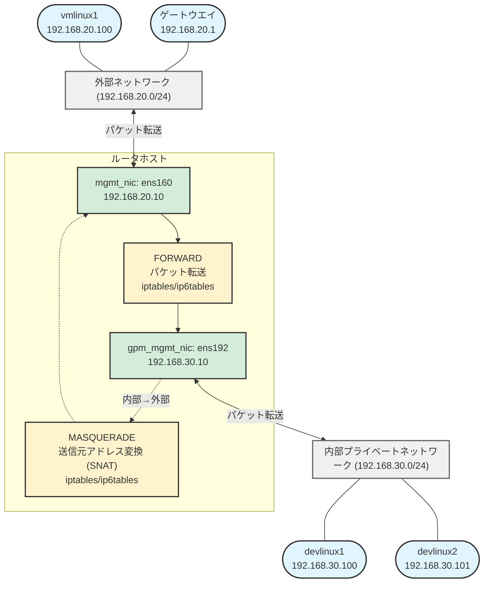

# router-config ロール

本ロールは, 複合ネットワーク環境で管理ネットワークと外部ネットワーク間のトラフィック中継を実現するためのルータホストの設定を行います。
本ロールでは, IPv4/IPv6 パケット転送の有効化, Reverse Path Filtering (RPF) の設定, パケット転送ルール (iptables/ip6tables) の設定, および sysctl 設定ファイルを生成, 配置します。

## 動作モード

- 純粋なルーティング (デフォルト): NAT無しの双方向パケット転送 (`config-forward.yml`)
- NAT動作: MASQUERADE による送信元アドレス変換 (`config-nat.yml`)

## 前提条件

ロールの実行には以下の変数が必須です :

- `gpm_mgmt_nic` 仮想環境内部管理ネットワークのインターフェース名
- `mgmt_nic` 物理サーバ/管理用ネットワークのインターフェース名
- `gpm_mgmt_ipv4_network_cidr` 管理ネットワークの IPv4 CIDR
- `gpm_mgmt_ipv6_network_cidr` 管理ネットワークの IPv6 CIDR

これらが未定義, または, 指定されたインターフェースがシステムに存在しない場合, 本ロールは実行されません。

## ネットワーク構成とIPアドレスの役割

このロールが対象とするネットワークは, 以下の2つの独立したネットワークセグメントで構成されます。ルータホストはこれら2つのネットワークを中継し, パケット転送やNATを行います。

### ネットワークの分類

| ネットワーク | 本稿で例示する際に使用するネットワークCIDR | 用途 | インターフェース | 説明 |
| --- | --- | --- | --- | --- |
| 外部向けネットワーク | `192.168.20.0/24` | 物理サーバ/管理用 | `mgmt_nic` (ens160) | 物理ホスト, 管理ネットワーク, 外部ネットワークに接続するための NIC。 |
| 内部プライベート | `192.168.30.0/24` | 内部管理 | `gpm_mgmt_nic` (ens192) | 内部で隔離されたプライベートネットワーク。 |

### IPアドレスの例

本節では, 本稿で例示に使用するIPアドレスの例について説明します。

#### 192.168.20.0/24 ネットワーク (外部向け)

- `192.168.20.1` - 仮想環境ホストから外部のネットワークに出るためのゲートウェイ
- `192.168.20.10` - ルータホスト上で外部向けネットワークに接続されているNIC (mgmt_nic)のIPアドレス

#### 192.168.30.0/24 ネットワーク (仮想環境内プライベート)

- `192.168.30.10` - ルータホスト上で内部プライベートネットワークに接続されているNIC(gpm_mgmt_nic)のIPアドレス
- `192.168.30.100`, `192.168.30.101` - 内部プライベートネットワークに接続されているテスト対象ホスト

### トラフィックの流れ



このロールにより, ルータホストが 192.168.20.0/24 <=> 192.168.30.0/24 間のパケット転送 を制御します。

## 変数一覧

| 変数名 | 既定値 | 説明 |
| --- | --- | --- |
| `router_forwarding_enabled` | `false` | 純粋なルーティング (NAT 無し) を有効化するフラグ。host_vars で `true` に設定すると config-forward.yml が実行される。`router_nat_enabled` との同時設定は不可。 |
| `router_nat_enabled` | `false` | NAT 動作を有効化するフラグ。`router_forwarding_enabled` または `additional_network_routes` 定義時は無視される。host_vars で `true` に設定すると NAT モードで動作。 |
| `additional_network_routes` | (未定義) | additional-routes ロールで定義される追加ルート情報。定義済みの場合, 本ロールは NAT 無しの純粋なルーティング動作となり, `router_nat_enabled` は無視される。 |
| `iptables_persistent_package` | OS 依存 | インストールする iptables 永続化パッケージ。Debian 系: `iptables-persistent`, RHEL 系: `iptables-services`。 |
| `iptables_persistent_service` | OS 依存 | 有効化する iptables サービス名。Debian 系: `netfilter-persistent`, RHEL 系: `iptables`。 |
| `iptables_persistent_ipv6_service` | OS 依存 | 有効化する ip6tables サービス名。RHEL 系のみ: `ip6tables`。 |
| `mgmt_nic` | (必須) | 物理サーバ/管理ネットワークのインターフェース名 (例: `ens160`)。 |
| `gpm_mgmt_nic` | (必須) | 仮想環境内部管理ネットワークのインターフェース名 (例: `ens192`)。 |
| `network_ipv4_network_address` | (必須) | 物理ネットワークの IPv4 アドレス (例: `192.168.20.0`)。 |
| `network_ipv4_prefix_len` | (必須) | 物理ネットワークの IPv4 プレフィックス長 (例: `24`)。 |
| `network_ipv6_network_address` | (必須) | 物理ネットワークの IPv6 プレフィックス (例: `fd69:6684:61a:1::`)。 |
| `network_ipv6_prefix_len` | (必須) | 物理ネットワークの IPv6 プレフィックス長 (例: `64`)。 |
| `gpm_mgmt_ipv4_network_cidr` | (必須) | 管理ネットワークの IPv4 CIDR (例: `192.168.30.0/24`)。 |
| `gpm_mgmt_ipv6_network_cidr` | (必須) | 管理ネットワークの IPv6 CIDR (例: `fdad:ba50:248b:1::/64`)。 |

OS 別の詳細は [vars/cross-distro.yml](../../vars/cross-distro.yml) を参照してください。

## ロール内の動作

1. [tasks/load-params.yml](tasks/load-params.yml) で OS ごとのパッケージ名, ディストロ差異吸収変数, 共通ネットワーク設定を読み込みます。
2. 以降のタスク実行は `gpm_mgmt_nic` と `mgmt_nic` が定義済みかつシステムに存在するという条件で進みます。
3. [tasks/package.yml](tasks/package.yml) で `iptables_persistent_package` をインストールします。
4. [tasks/config-sysctl.yml](tasks/config-sysctl.yml) で [templates/95-ipfoward.j2](templates/95-ipfoward.j2) を `/etc/sysctl.d/95-ipfoward.conf` に展開します。テンプレートは以下の設定を行います :
   - IPv4 パケット転送の有効化 (`net.ipv4.ip_forward=1`)
   - IPv4 Reverse Path Filtering をルーズモードに設定 (`net.ipv4.conf.all.rp_filter=2`, `.default.rp_filter=2`)
   - IPv6 パケット転送の有効化 (`net.ipv6.conf.all.forwarding=1`, `.default.forwarding=1`)
   - 管理インターフェースでのルーター広告受け入れ (`net.ipv6.conf.{{ mgmt_nic }}.accept_ra=2`)
5. 設定変更時はハンドラ `bastion_config_reload_sysctl` で `sysctl --system` を実行します。
6. パケット転送ルールの設定 (条件分岐):
   - `router_forwarding_enabled: true` または `additional_network_routes` 定義時: [tasks/config-forward.yml](tasks/config-forward.yml) を実行
     - 物理ネットワーク (192.168.20.0/24) <=> 管理ネットワーク (192.168.30.0/24) 間の双方向 FORWARD ルール設定
     - NAT 無し, 送信元 IP アドレス保持
     - IPv4/IPv6 双方に対応
     - `router_nat_enabled` が `true` の場合は config-forward.yml が優先され, NAT は実行されない
   - `router_nat_enabled: true` かつ上記条件未満時: [tasks/config-nat.yml](tasks/config-nat.yml) を実行
     - IPv4 NAT: 管理ネットワークから外部ネットワークへのトラフィックを MASQUERADE で変換
     - IPv4 FORWARD: 管理 => 外部 (全許可), 外部 => 管理 (ESTABLISHED/RELATED + 新規セッション許可)
     - IPv6 FORWARD/NAT: 管理<=>外部の双方向パケット転送 + MASQUERADE
   - どちらも該当しない場合: パケット転送ルール設定をスキップ
   - OS ごとの永続化: Debian/Ubuntu は `netfilter-persistent save`, RHEL/CentOS は `iptables-save` / `ip6tables-save` を実行
7. [tasks/service.yml](tasks/service.yml) でサービスを有効化します ( RHEL 系のみ, Debian 系は netfilter-persistent が自動処理 ) 。

## 利用の流れ

### 設定値による動作の違い

設定値の違いによる動作の違いを以下に示します。
以下の表では, `enable_firewall`変数に`false`が設定されていることを前提としています。

|`router_forwarding_enabled`|`router_nat_enabled`|`additional_network_routes`|動作|
|---|---|---|---|
|false|false|未定義, または, 空リストを定義|FORWARD/NAT設定なし|
|false|false|`additional_network_routes`リストの長さが1以上|iptables/ip6tablesによるFORWARD設定を実施(純粋ルーティング)|
|false|true|未定義, または, 空リストを定義|SNAT (MASQUERADE) によるアドレス変換とFORWARDルール設定を実施|
|false|true|`additional_network_routes`リストの長さが1以上|設定値矛盾のため, FORWARD/NAT設定なし|
|true|false|未定義, または, 空リストを定義|iptables/ip6tablesによるFORWARD設定を実施(純粋ルーティング)|
|true|false|`additional_network_routes`リストの長さが1以上|iptables/ip6tablesによるFORWARD設定を実施(純粋ルーティング)|
|true|true|未定義, または, 空リストを定義|設定値矛盾のため, FORWARD/NAT設定なし|
|true|true|`additional_network_routes`リストの長さが1以上|設定値矛盾のため, FORWARD/NAT設定なし|

### 純粋なルーティング構成

#### 方法1: router_forwarding_enabled を使用

1. host_vars内のルータホストの設定に `router_forwarding_enabled: true` を設定します。
2. ルータホストに対してplaybookをmakeなどで実行します。
3. sysctl 設定は即座に反映され, 双方向の FORWARD ルールが設定されます (NAT 無し)。

#### 方法2: additional_network_routes を使用

1. 外部向けネットワークに接続されているホストの host_vars または group_vars に `additional_network_routes` を定義します (additional-routes ロールと連携)。
2. ルータホストに対してplaybookをmakeなどで実行します。
3. ルータホストが `additional_network_routes` を検出し, sysctl 設定は即座に反映され, 双方向の FORWARD ルールが設定されます (NAT 無し)。

### NAT 構成

1. host_vars内のルータホストの設定に `router_nat_enabled: true` を設定します。
2. `router_forwarding_enabled` が `false` または未定義であることを確認します。
3. `additional_network_routes` が未定義であることを確認します。
4. ルータホストに対してplaybookをmakeなどで実行します。
5. MASQUERADE による NAT ルールが設定されます。

## Makeターゲット`run_router_clear_rules`によるiptablesルールのクリア手順

### 概要

`make run_router_clear_rules` ターゲットは, router-config ロールによって設定された既存の iptables/ip6tables ルールをクリアします。このターゲットは以下の処理を実行します:

- 純粋なルーティング構成（双方向 FORWARD ルール）のクリア
- NAT 構成（MASQUERADE ルールと NAT 用 FORWARD ルール）のクリア
- 設定の永続化（クリア後の状態を保存）

### 利用用途

このターゲットは, ルーティング構成を変更する前や, 設定を完全にやり直す際に使用します:

- NAT から 純粋なルーティング構成への切り替え前: NAT の MASQUERADE ルールを削除
- 純粋なルーティング構成 から NAT への切り替え前: 既存の双方向 FORWARD ルールを削除
- 設定の完全無効化: 両方の変数を `false` に設定する前にルールをクリア

### 実行方法

```bash
make run_router_clear_rules
```

実行ログは `build-router-clear-rules.log` に保存されます。

### 留意事項

- 上記実行後, 新しい設定を適用するためにrouterホストに対して, playbookを再実行してください。
- クリア処理は `tasks/config-clear-rules.yml` タスクを実行し, 永続化まで行います
- 既存のルールが存在しない場合でもエラーにはなりません（`|| true` で処理を継続）

## 検証ポイント

### 共通

- `/etc/sysctl.d/95-ipfoward.conf` が正しく生成され, パケット転送およびフォワーディング設定が期待どおりか。
- `sysctl net.ipv4.ip_forward` などで現在のカーネル設定が `1` になっているか。
- Debian 系: `sudo iptables-save` で永続化ルールが確認できるか。
- RHEL 系: `systemctl status iptables` および `systemctl status ip6tables` でサービスが `enabled` かつ `active` か。

### 純粋なルーティング構成 (config-forward.yml)

```bash
# 双方向 FORWARD ルール確認
sudo iptables -L FORWARD -nv --line-numbers | grep -E '192\.168\.20\.0/24|192\.168\.30\.0/24'
sudo ip6tables -L FORWARD -nv --line-numbers | grep -E 'fd69:6684:61a:1::/64|fdad:ba50:248b:1::/64'

# NAT 無し確認
sudo iptables -t nat -L POSTROUTING -nv | grep -E '192\.168\.20\.0/24|192\.168\.30\.0/24'
# 外部向けネットワーク(192.168.20.0/24) <=> 内部プライベートネットワーク(192.168.30.0/24) 間の MASQUERADE ルールが無いこと

# 疎通確認 ( 外部向けネットワーク(192.168.20.0/24) のノードから実施 )
ping -c3 192.168.30.100  # 送信元 IP が保持されること
```

### NAT 構成 (config-nat.yml)

```bash
# NAT ルール確認
sudo iptables -t nat -L POSTROUTING -nv | grep MASQUERADE

# FORWARD ルール確認
sudo iptables -L FORWARD -nv | grep -E '192\.168\.30\.0/24'

# 疎通確認 (内部プライベートネットワークネットワークから外部)
ping -c3 8.8.8.8  # 内部プライベートネットワークからインターネットへ到達
```

### 検証作業の例

#### 純粋なルーティング構成の場合 (router_forwarding_enabled: true に設定時, または, `additional_network_routes`リストの長さを1以上に設定時)

ルータホスト上で以下を実行して, パケットのフォワードが意図通りに動作していることを確認してください。

```bash
# 双方向のFORWARDルールが設定されているか確認
$ sudo iptables -L FORWARD -nv
Chain FORWARD (policy ACCEPT 9 packets, 684 bytes)
 pkts bytes target     prot opt in     out     source               destination
    0     0 ACCEPT     0    --  ens160   ens192    192.168.20.0/24      192.168.30.0/24
    9   662 ACCEPT     0    --  ens192   ens160    192.168.30.0/24      192.168.20.0/24

# 外部向けネットワーク(192.168.20.0/24)から内部プライベートネットワーク(192.168.30.0/24)のホストへpingを実行

# パケットカウンタが増加しているか確認
$ sudo iptables -L FORWARD -nv
Chain FORWARD (policy ACCEPT 9 packets, 684 bytes)
 pkts bytes target     prot opt in     out     source               destination
    4   240 ACCEPT     0    --  ens160   ens192    192.168.20.0/24      192.168.30.0/24
   13   902 ACCEPT     0    --  ens192   ens160    192.168.30.0/24      192.168.20.0/24

# MASQUERADEルールが設定されていないことを確認
$ sudo iptables -t nat -L POSTROUTING -nv
Chain POSTROUTING (policy ACCEPT 0 packets, 0 bytes)
 pkts bytes target     prot opt in     out     source               destination
```

疎通不可の場合は, 双方向のFORWARDルールが設定されているか, パケットカウンタ（pkts列）が増加しているか確認してください。

#### NAT構成の場合 (router_nat_enabled: true に設定時)

ルータホスト上で以下を実行して, NATとパケットのフォワードが意図通りに動作していることを確認してください。

```bash
# FORWARDルールが設定されているか確認
$ sudo iptables -L FORWARD -nv
Chain FORWARD (policy ACCEPT 0 packets, 0 bytes)
 pkts bytes target     prot opt in     out     source               destination
   21  1754 ACCEPT     0    --  ens192   ens160    192.168.30.0/24      0.0.0.0/0
   21  3112 ACCEPT     0    --  ens160   ens192    0.0.0.0/0            192.168.30.0/24      ctstate RELATED,ESTABLISHED
    0     0 ACCEPT     0    --  ens160   ens192    0.0.0.0/0            192.168.30.0/24

# MASQUERADEルールが設定されているか確認
$ sudo iptables -t nat -L POSTROUTING -nv
Chain POSTROUTING (policy ACCEPT 54 packets, 7044 bytes)
 pkts bytes target     prot opt in     out     source               destination
   38  3094 MASQUERADE  0    --  *      ens160    192.168.30.0/24      0.0.0.0/0
```

疎通不可の場合は, 以下を確認してください:

- 内部 => 外部, 外部 => 内部のFORWARDルールが設定されていること
- パケットカウンタ（pkts列）が増加していること
- MASQUERADEルールが設定されていること

NAT動作を詳細に確認する場合は, ルータホスト上で以下を実行してください:

```bash
# ルータホスト上で外部向けNICをキャプチャ（別ターミナルで実行）
$ sudo tcpdump -i ens160 -n icmp
tcpdump: verbose output suppressed, use -v[v]... for full protocol decode
listening on ens160, link-type EN10MB (Ethernet), snapshot length 262144 bytes
22:44:01.046180 IP 192.168.20.10 > 192.168.20.1: ICMP echo request, id 15304, seq 1, length 64
22:44:01.047075 IP 192.168.20.1 > 192.168.20.10: ICMP echo reply, id 15304, seq 1, length 64
22:44:02.047332 IP 192.168.20.10 > 192.168.20.1: ICMP echo request, id 15304, seq 2, length 64
22:44:02.047585 IP 192.168.20.1 > 192.168.20.10: ICMP echo reply, id 15304, seq 2, length 64
22:44:03.055337 IP 192.168.20.10 > 192.168.20.1: ICMP echo request, id 15304, seq 3, length 64
22:44:03.055590 IP 192.168.20.1 > 192.168.20.10: ICMP echo reply, id 15304, seq 3, length 64
```

上記tcpdump実行中に, 内部プライベートネットワーク上のホスト(例では, 192.168.30.103)から外部ネットワーク上のホスト(例では, 192.168.20.1)に向けてpingを実行:

```bash
# 内部プライベートネットワークのホスト(192.168.30.103)で実行
$ ping -c 3 192.168.20.1
PING 192.168.20.1 (192.168.20.1) 56(84) bytes of data.
64 bytes from 192.168.20.1: icmp_seq=1 ttl=254 time=0.630 ms
64 bytes from 192.168.20.1: icmp_seq=2 ttl=254 time=0.391 ms
64 bytes from 192.168.20.1: icmp_seq=3 ttl=254 time=0.398 ms

--- 192.168.20.1 ping statistics ---
3 packets transmitted, 3 received, 0% packet loss, time 2080ms
rtt min/avg/max/mdev = 0.391/0.473/0.630/0.111 ms
```

tcpdumpの出力で, 送信元IPが192.168.30.103ではなく192.168.20.10(ルータの外部NIC)になっていることから, MASQUERADEによるNAT変換が正しく動作していることが確認できます。

#### 意図的にパケット転送を無効化している場合

本節では, 以下のような純粋ルーティング(FORWARDING), NAT双方を無効にする設定にしている場合の検証例を示します。

- router_forwarding_enabled: false に設定, または, `additional_network_routes`未定義, `additional_network_routes`が空リストで, かつ, router_nat_enabled: falseに設定
- router_forwarding_enabled, router_nat_enabled共にtrueに設定しているなど設定内容が無効な場合

ルータホスト上で以下を確認してください:

```bash
# FORWARDルールが設定されていないことを確認
$ sudo iptables -L FORWARD -nv
Chain FORWARD (policy ACCEPT 0 packets, 0 bytes)
 pkts bytes target     prot opt in     out     source               destination

# MASQUERADEルールが設定されていないことを確認
$ sudo iptables -t nat -L POSTROUTING -nv
Chain POSTROUTING (policy ACCEPT 0 packets, 0 bytes)
 pkts bytes target     prot opt in     out     source               destination
```

この構成では, ルータホストを経由したネットワーク間の通信は行われません。

意図的にパケット転送を無効化しているにも関わらず, FORWARDINGルールやPOSTROUTINGルールが残っている場合は, `make run_router_clear_rules`を実行するなどにより, 既存のルールを削除してください。
