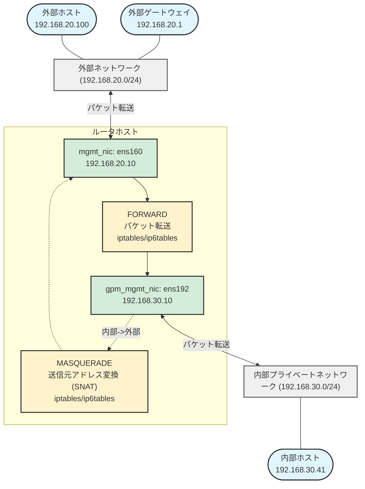

# router-config ロール

本ロールは, ルータホストで IPv4/IPv6 パケット転送と Network Address Translation (NAT) を制御する設定を行います。実装では, sysctl 設定ファイルの生成, iptables/ip6tables ルール投入, OS 別の永続化, サービス有効化, およびノード再起動を実施します。

## 用語

| 正式名称 | 略称 | 意味 |
| --- | --- | --- |
| Operating System | OS | 基本ソフトウエア。 |
| Ansible | - | 構成管理ツール。宣言的なタスク定義でホスト設定を自動化する。 |
| systemd | - | Linux のサービス管理基盤。 |
| Network Address Translation | NAT | IP アドレスを変換する仕組み。 |
| Source Network Address Translation | SNAT | 送信元アドレスを変換する NAT 方式。 |
| Masquerading | MASQUERADE | iptables の SNAT ターゲット。送信元を送信インターフェースのアドレスへ変換する。 |
| Reverse Path Filtering | RPF | 送信元アドレスの到達可能性を検査するカーネル機能。 |
| Internet Protocol version 4 | IPv4 | 32 ビットアドレスを使う通信方式。 |
| Internet Protocol version 6 | IPv6 | 128 ビットアドレスを使う通信方式。 |
| Classless Inter-Domain Routing | CIDR | `192.168.30.0/24` のようにネットワーク範囲を表す方式。 |
| Network Interface Card | NIC | ホストのネットワーク接続口。 |
| iptables | - | Linux の IPv4 パケットフィルタ設定ツール。 |
| ip6tables | - | Linux の IPv6 パケットフィルタ設定ツール。 |
| FORWARD chain | FORWARD | 転送パケットを評価するフィルタチェーン。 |
| POSTROUTING chain | POSTROUTING | 送信直前パケットを評価する NAT チェーン。 |
| Connection Tracking | conntrack | 接続状態を追跡する機能。 |
| Connection State | ESTABLISHED, RELATED | 既存接続, または既存接続に関連する通信状態。 |
| conntrack state match | ctstate | `-m conntrack --ctstate ...` で接続状態を条件指定する機能。 |
| netfilter-persistent | - | Debian 系で iptables/ip6tables ルールを保存, 復元する仕組み。 |
| iptables-services | - | RedHat 系で iptables/ip6tables を管理するパッケージ。 |
| systemctl | - | systemd サービスを操作するコマンド。 |
| sysctl | - | Linux カーネルパラメータを参照, 設定する仕組み。 |
| Handler | - | Ansible で `notify` により実行される処理。 |
| Role | - | Ansible の機能単位。tasks, templates, defaults などをまとめた構成。 |
| Playbook | - | Ansible の実行手順を記述した YAML ファイル。 |
| Yet Another Markup Language | YAML | 可読性を重視したデータ記述形式。 |
| Tag | - | Ansible 実行対象を絞り込むラベル。 |
| Inventory | - | Ansible が接続先ホスト群を定義する設定。 |
| Docker Community Edition | Docker CE | コンテナ実行基盤 Docker のコミュニティ版。 |
| become | - | Ansible の権限昇格指定。管理者権限でタスクを実行する。 |
| tcpdump | - | パケットをキャプチャして通信を確認するコマンド。 |
| Graceful reboot | - | 稼働中サービスへの影響を抑えて実行するノード再起動方式。 |

## 前提条件

- 対象 OS: Debian/Ubuntu系 (Ubuntu 24.04を想定), RHEL9 系 (Rocky Linux, AlmaLinux など, AlmaLinux 9.6を想定)
- Ansible 2.15 以降, ansibleメタパッケージをディストリビューションから導入していることを想定
- Ansible から対象ホストへ接続可能であること。
- 対象ホストで管理者権限へ昇格して実行できること (`become: true`)。
- 以下の変数が定義済みであること。
  - `gpm_mgmt_nic`
  - `mgmt_nic`
  - `gpm_mgmt_ipv4_network_cidr`
  - `gpm_mgmt_ipv6_network_cidr`
- `gpm_mgmt_nic` と `mgmt_nic` が, 対象ホストのインターフェース一覧に存在すること。

これらの NIC 条件を満たさない場合, `Load Params` 以外のタスクは実行されません。

## 実行フロー

`roles/router-config/tasks/main.yml` は次の順序で処理します。

1. **Load Params** (`tasks/load-params.yml`)
- OS 別パッケージ変数, `cross-distro.yml`, `all-config.yml`, `k8s-api-address.yml` を読み込みます。

2. **Package** (`tasks/package.yml`)
- `iptables_persistent_package` をインストールします。

3. **Directory** (`tasks/directory.yml`)
- 現在の実装は空タスクです。

4. **User Group** (`tasks/user_group.yml`)
- 現在の実装は空タスクです。

5. **Service** (`tasks/service.yml`)
- RedHat 系で `iptables_persistent_service`, `iptables_persistent_ipv6_service` を `enabled: true` にします。

6. **Config Sysctl** (`tasks/config-sysctl.yml`)
- `templates/95-ipfoward.j2` を `/etc/sysctl.d/95-ipfoward.conf` に配置します。
- 変更時はハンドラ `bastion_config_reload_sysctl` を通知します。

7. **Config Clear Rules** (`tasks/config-clear-rules.yml`)
- `router_forwarding_enabled`, `router_nat_enabled`, `additional_network_routes` のいずれかが有効な場合に既存ルールを削除します。

8. **Config Forward** (`tasks/config-forward.yml`)
- 実行条件: `(router_forwarding_enabled == true or additional_network_routes が定義済み) and router_nat_enabled == false`。
- IPv4/IPv6 双方向 FORWARD ルールを設定します。

9. **Config Nat** (`tasks/config-nat.yml`)
- 実行条件: `router_nat_enabled == true and router_forwarding_enabled == false and (additional_network_routes 未定義または空)`。
- IPv4/IPv6 の FORWARD ルールと POSTROUTING MASQUERADE ルールを設定します。

10. **Config** (`tasks/config.yml`)
- 現在の実装は空タスクです。

11. **Reboot** (`tasks/reboot.yml`)
- `reboot_timeout_sec` を使ってノードの graceful reboot を実行します。

## 主要変数

### 動作制御

| 変数名 | 既定値 | 説明 |
| --- | --- | --- |
| `router_forwarding_enabled` | `true` | NAT 無しの双方向 FORWARD ルールを有効化します。`true` の場合は NAT より優先されます。 |
| `router_nat_enabled` | `false` | NAT 構成を有効化します。`router_forwarding_enabled: true` または `additional_network_routes` 定義時は実行されません。 |
| `additional_network_routes` | 未定義 | `additional-routes` ロールと連携する追加ルート定義です。定義時は FORWARD 構成が優先されます。 |

### パッケージ, サービス, ノード再起動

| 変数名 | 既定値 | 説明 |
| --- | --- | --- |
| `iptables_persistent_package` | OS 依存 | Debian 系は `iptables-persistent`, RedHat 系は `iptables-services`。 |
| `iptables_persistent_service` | OS 依存 | Debian 系は `iptables-persistent`, RedHat 系は `iptables`。 |
| `iptables_persistent_ipv6_service` | OS 依存 | Debian 系は `iptables-persistent`, RedHat 系は `ip6tables`。 |
| `etc_default_dir` | OS 依存 | Debian 系は `/etc/default`, RedHat 系は `/etc/sysconfig`。 |
| `reboot_timeout_sec` | `600` | ノード再起動後の応答待ちタイムアウト (秒)。 |

### ネットワーク関連 (必須)

| 変数名 | 既定値 | 説明 |
| --- | --- | --- |
| `mgmt_nic` | 必須 | 外部向けネットワーク側 NIC。 |
| `gpm_mgmt_nic` | 必須 | 内部プライベートネットワーク側 NIC。 |
| `network_ipv4_network_address` | 必須 | 外部向け IPv4 ネットワークアドレス。 |
| `network_ipv4_prefix_len` | 必須 | 外部向け IPv4 プレフィックス長。 |
| `network_ipv6_network_address` | 必須 | 外部向け IPv6 ネットワークアドレス。 |
| `network_ipv6_prefix_len` | 必須 | 外部向け IPv6 プレフィックス長。 |
| `gpm_mgmt_ipv4_network_cidr` | 必須 | 内部プライベート側 IPv4 CIDR。 |
| `gpm_mgmt_ipv6_network_cidr` | 必須 | 内部プライベート側 IPv6 CIDR。 |

## 主な処理

- `95-ipfoward.conf` を配置し, IPv4/IPv6 転送と RPF ルーズモードを有効化します。
- ルール投入前に既存 FORWARD/POSTROUTING ルールを削除し, モード切替時のルール残骸を防ぎます。
- 純粋ルーティングモードでは, 外部向けネットワーク <=> 内部プライベートネットワークの双方向 FORWARD ルールを投入します。
- NAT モードでは, FORWARD ルールに加えて POSTROUTING MASQUERADE を投入します。
- ルールは `iptables`, `ip6tables` コマンド実行時に即座にカーネルへ適用され, 直ちに有効化されます。
- 再起動後も設定を維持するため, OS 別方式でルールをファイルへ永続化します。
  - Debian 系: `netfilter-persistent save` で `/etc/iptables/rules.v4` (IPv4), `/etc/iptables/rules.v6` (IPv6) へ保存
  - RedHat 系: `iptables-save`, `ip6tables-save` で `{{ etc_default_dir }}/iptables` (`/etc/sysconfig/iptables`), `{{ etc_default_dir }}/ip6tables` (`/etc/sysconfig/ip6tables`) へ保存後, `iptables`, `ip6tables` サービスを再起動してファイルから再読み込み

## テンプレート / 出力ファイル

| テンプレートまたは生成物 | 出力先 | 説明 |
| --- | --- | --- |
| `templates/95-ipfoward.j2` | `/etc/sysctl.d/95-ipfoward.conf` | IPv4/IPv6 転送, RPF, `accept_ra` を設定します。 |
| 永続化処理 (Debian 系, IPv4) | `/etc/iptables/rules.v4` | `netfilter-persistent save` で IPv4 ルールを保存します。 |
| 永続化処理 (Debian 系, IPv6) | `/etc/iptables/rules.v6` | `netfilter-persistent save` で IPv6 ルールを保存します。 |
| 永続化処理 (RedHat 系, IPv4) | `{{ etc_default_dir }}/iptables` (`/etc/sysconfig/iptables`) | `iptables-save` の出力先。 |
| 永続化処理 (RedHat 系, IPv6) | `{{ etc_default_dir }}/ip6tables` (`/etc/sysconfig/ip6tables`) | `ip6tables-save` の出力先。 |

## ハンドラ

### bastion_config_reload_sysctl (`handlers/reload-sysctl.yml`)

- `listen`: `bastion_config_reload_sysctl`
- 実行コマンド: `sysctl --system`
- 起動条件: `config-sysctl.yml` でテンプレート更新が発生した場合

## OS差異

| 項目 | Debian/Ubuntu | RedHat系 |
| --- | --- | --- |
| 永続化パッケージ | `iptables-persistent` | `iptables-services` |
| IPv4 サービス変数 | `iptables-persistent` | `iptables` |
| IPv6 サービス変数 | `iptables-persistent` | `ip6tables` |
| 永続化コマンド | `netfilter-persistent save` | `iptables-save`, `ip6tables-save` |
| ルール保存先ディレクトリ | `/etc/iptables` | `/etc/sysconfig` |
| service.yml の有効化処理 | 実質なし | `iptables`, `ip6tables` を有効化 |

## 実行方法

### 前提

- インベントリに対象ルータホストが含まれていること。
- `router.yml` では `docker-ce` の後に `router-config` が実行されます。
- モード切替時は, 必要に応じて先にクリアルールを実行します。

### Make ターゲットで実行

```bash
# router-config ロール実行
make run_router_config

# 既存ルールクリア
make run_router_clear_rules
```

`run_router_clear_rules` は `router-clear-rules.yml` を `hosts: all` で実行します。必要に応じて, ansible-playbook で直接実行し, `-l router.local` で対象ホストを限定してください。

### ansible-playbook で直接実行

```bash
# router プレイブック全体
ansible-playbook -i inventory/hosts router.yml

# site.yml から router-config タグのみ
ansible-playbook -i inventory/hosts site.yml --tags "router-config"

# ホスト限定で実行
ansible-playbook -i inventory/hosts site.yml --tags "router-config" -l router.local

# クリア専用プレイブック
ansible-playbook -i inventory/hosts router-clear-rules.yml
```

### 推奨実行順序 (モード切替時)

1. `make run_router_clear_rules` で既存ルールを削除します。
2. 変数 (`router_forwarding_enabled`, `router_nat_enabled`, `additional_network_routes`) を調整します。
3. `make run_router_config` で新モードを適用します。

## 検証

### 1. ネットワーク構成とルータホストの役割

本セクションの検証手順で使用するネットワーク構成とIPアドレスについて説明します。

#### ネットワークの分類

| ネットワーク | 本稿で例示するネットワーク CIDR | 用途 | インターフェース | 説明 |
| --- | --- | --- | --- | --- |
| 外部向けネットワーク | `192.168.20.0/24` | 物理サーバ/管理用 | `mgmt_nic` (ens160) | 外部接続側 NIC。 |
| 内部プライベート | `192.168.30.0/24` | 内部管理 | `gpm_mgmt_nic` (ens192) | 内部接続側 NIC。 |

#### IP アドレスの例

- 外部向け `192.168.20.0/24`
  - `192.168.20.1`: 外部ゲートウェイ
  - `192.168.20.10`: ルータホスト `mgmt_nic`
  - `192.168.20.100`: 外部ホスト (外部ゲートウェイと同一L2ネットワーク上に設置されているホスト)

- 内部プライベート `192.168.30.0/24`
  - `192.168.30.10`: ルータホスト `gpm_mgmt_nic`
  - `192.168.30.41`: 内部ホスト ( 内部プライベートネットワークのみに接続されているホスト )

#### トラフィックの流れ


```mermaid
graph TD
    I([外部ゲートウェイ<br/>192.168.20.1])
    J([外部ホスト<br/>192.168.20.100])
    subgraph ExtNet["外部ネットワーク (192.168.20.0/24)"]
    end

    subgraph Router["ルータホスト"]
        B["mgmt_nic: ens160<br/>192.168.20.10"]
        C["FORWARD<br/>パケット転送<br/>iptables/ip6tables"]
        C2["MASQUERADE<br/>送信元アドレス変換 (SNAT)<br/>iptables/ip6tables"]
        D["gpm_mgmt_nic: ens192<br/>192.168.30.10"]
        B --> C
        C --> D
        D -.->|内部->外部| C2
        C2 -.-> B
    end

    subgraph IntNet["内部プライベートネットワーク (192.168.30.0/24)"]
    end

    F([内部ホスト<br/>192.168.30.41])

    I --- ExtNet
    J --- ExtNet
    ExtNet <-->|パケット転送| B
    D <-->|パケット転送| IntNet

    IntNet --- F

    classDef hostStyle fill:#e1f5ff,stroke:#333,stroke-width:2px
    classDef nicStyle fill:#d4edda,stroke:#333,stroke-width:2px
    classDef controlStyle fill:#fff3cd,stroke:#333,stroke-width:2px
    classDef networkStyle fill:#f0f0f0,stroke:#666,stroke-width:2px

    class F,I,J hostStyle
    class B,D nicStyle
    class C,C2 controlStyle
    class ExtNet,IntNet networkStyle
```

### 2. 共通検証

#### 2.1 sysctl 設定確認

**実施ノード**: ルータホスト

**コマンド**:
```bash
cat /etc/sysctl.d/95-ipfoward.conf
sysctl net.ipv4.ip_forward net.ipv4.conf.all.rp_filter net.ipv6.conf.all.forwarding
```

**期待される出力例**:
```bash
$ cat /etc/sysctl.d/95-ipfoward.conf
#
#  -*- coding:utf-8 mode:bash -*-
# This file is generated by ansible.
# last update: 2026-03-01 15:19:44 JST

#
# IPv4 Forwarding設定
#
# ipv4フォワーディングを有効化
net.ipv4.ip_forward=1
# ソースルーティングパケットの処理設定を変更
# Reverse Path Filtering（RPF）をルーズモードに設定し,
# 受信パケットのソースアドレスが, どのネットワークインターフェースからでも
# 到達可能であればパケットを受け入れる。
net.ipv4.conf.all.rp_filter=2
# デフォルトインターフェースのソースルーティングパケットの処理設定を
# Reverse Path Filtering（RPF）をルーズモードに設定することで,
# 作成されるネットワークインターフェースのデフォルトのRP_Filter値を
# ルーズモードにする。
net.ipv4.conf.default.rp_filter=2

#
# IPv6 Forwarding設定
#
# ipv6フォワーディングを有効化
net.ipv6.conf.all.forwarding=1
# デフォルトインターフェースのipv6フォワーディングを有効化
# 作成されるネットワークインターフェースのデフォルトの
# ipv6フォワーディング値を有効化する。
net.ipv6.conf.default.forwarding=1
# 管理インターフェースでルーター広告(RA)を受け入れる
# フォワーディングが有効でもRAを受け入れるようにする
net.ipv6.conf.ens160.accept_ra=2

$ sysctl net.ipv4.ip_forward net.ipv4.conf.all.rp_filter net.ipv6.conf.all.forwarding
net.ipv4.ip_forward = 1
net.ipv4.conf.all.rp_filter = 2
net.ipv6.conf.all.forwarding = 1
```

**確認ポイント**:
- `/etc/sysctl.d/95-ipfoward.conf` が存在し, ファイル内で以下が設定されていること。
  - `net.ipv4.ip_forward=1` (IPv4 転送有効)
  - `net.ipv4.conf.all.rp_filter=2` (RPF ルーズモード)
  - `net.ipv6.conf.all.forwarding=1` (IPv6 転送有効)
- `sysctl` コマンドで実行中カーネルの値が以下と一致すること。
  - `net.ipv4.ip_forward = 1`
  - `net.ipv4.conf.all.rp_filter = 2`
  - `net.ipv6.conf.all.forwarding = 1`

#### 2.2 永続化状態確認

**実施ノード**: ルータホスト

**コマンド** (Debian/Ubuntu の場合):
```bash
systemctl status netfilter-persistent
systemctl is-enabled netfilter-persistent
```

**期待される出力例** (Debian/Ubuntu):
```bash
$ systemctl status netfilter-persistent
● netfilter-persistent.service - netfilter persistent configuration
     Loaded: loaded (/usr/lib/systemd/system/netfilter-persistent.service; enabled; preset: enabled)
    Drop-In: /usr/lib/systemd/system/netfilter-persistent.service.d
             └─iptables.conf
     Active: active (exited) since Sun 2026-03-01 15:28:31 JST; 5 days ago
       Docs: man:netfilter-persistent(8)
   Main PID: 571 (code=exited, status=0/SUCCESS)
        CPU: 13ms

 3月 01 15:28:31 router systemd[1]: Starting netfilter-persistent.service - netfilter persistent configuration...
 3月 01 15:28:31 router netfilter-persistent[592]: run-parts: executing /usr/share/netfilter-persistent/plugins.d/15-ip4tables start
 3月 01 15:28:31 router netfilter-persistent[592]: run-parts: executing /usr/share/netfilter-persistent/plugins.d/25-ip6tables start
 3月 01 15:28:31 router systemd[1]: Finished netfilter-persistent.service - netfilter persistent configuration.

$ systemctl is-enabled netfilter-persistent
enabled
```

**確認ポイント** (Debian/Ubuntu):
- サービスが `Active: active (exited)` 状態であること (正常終了を示す)。
- `Loaded:` 行に `enabled` が含まれ, システム起動時の自動起動が有効であること。
- `systemctl is-enabled` コマンドで `enabled` が返ること。

**コマンド** (RedHat系 の場合):
```bash
sudo systemctl status iptables
sudo systemctl status ip6tables
sudo systemctl is-enabled iptables
sudo systemctl is-enabled ip6tables
```

**確認ポイント** (RedHat系):
- `iptables`, `ip6tables` サービスが `Active: active (running)` であること。
- 両サービスが `enabled` で自動起動が有効であること。

### 3. 純粋ルーティング構成の検証 (config-forward.yml)

#### 3.1 FORWARD ルール確認

**実施ノード**: ルータホスト

**コマンド**:
```bash
sudo iptables -L FORWARD -nv --line-numbers
sudo ip6tables -L FORWARD -nv --line-numbers
```

**期待される出力例** (純粋ルーティングモードの場合):
```bash
$ sudo iptables -L FORWARD -nv --line-numbers
Chain FORWARD (policy DROP 0 packets, 0 bytes)
num   pkts bytes target     prot opt in     out     source               destination
1      22M   60G DOCKER-USER  0    --  *      *       0.0.0.0/0            0.0.0.0/0
2      22M   60G DOCKER-FORWARD  0    --  *      *       0.0.0.0/0            0.0.0.0/0
3    8457K  492M ACCEPT     0    --  ens192   ens160    192.168.30.0/24      0.0.0.0/0
4      14M   60G ACCEPT     0    --  ens160   ens192    0.0.0.0/0            192.168.30.0/24      ctstate RELATED,ESTABLISHED
5        0     0 ACCEPT     0    --  ens160   ens192    0.0.0.0/0            192.168.30.0/24

$ sudo ip6tables -L FORWARD -nv --line-numbers
Chain FORWARD (policy ACCEPT 0 packets, 0 bytes)
num   pkts bytes target     prot opt in     out     source               destination
1     8938 1001K DOCKER-USER  0    --  *      *       ::/0                 ::/0
2     8938 1001K DOCKER-FORWARD  0    --  *      *       ::/0                 ::/0
3     4486  390K ACCEPT     0    --  ens192   ens160    fdad:ba50:248b:1::/64  ::/0
4     4449  611K ACCEPT     0    --  ens160   ens192    ::/0                 fdad:ba50:248b:1::/64  ctstate RELATED,ESTABLISHED
5        0     0 ACCEPT     0    --  ens160   ens192    ::/0                 fdad:ba50:248b:1::/64
```

**確認ポイント**:
- IPv4 FORWARD チェーンで以下のルールが存在すること。
  - 行 3: 内部 (`ens192`) から外部 (`ens160`) への, 内部プライベート IPv4 ネットワーク (`192.168.30.0/24`) からのパケットを `ACCEPT`
  - 行 4-5: 外部 (`ens160`) から内部 (`ens192`) への, 内部プライベート IPv4 ネットワーク宛 (`192.168.30.0/24`) のパケットを `ACCEPT` (行4の`ESTABLISHED,RELATED` は既存接続とその戻り通信(`ESTABLISHED`), または関連通信(`RELATED`)を許可し, 行 5 で新規接続を許可)
- IPv6 FORWARD チェーンで以下のルールが存在すること。
  - 行 3: 内部 (`ens192`) から外部 (`ens160`) への, 内部プライベート IPv6 ネットワーク (`fdad:ba50:248b:1::/64`) からのパケットを `ACCEPT`
  - 行 4-5: 外部 (`ens160`) から内部 (`ens192`) への, 内部プライベート IPv6 ネットワーク宛 (`fdad:ba50:248b:1::/64`) のパケットを `ACCEPT` (行4の`ESTABLISHED,RELATED` は既存接続とその戻り通信(`ESTABLISHED`), または関連通信(`RELATED`)を許可し, 行 5 で新規接続を許可)
- 疎通試験の実行前後で同じコマンドを少なくとも 2 回実行し, `pkts` (パケット数) と `bytes` (バイト数) のカウンタが増加していることを確認することで, 実際にトラフィックが転送されていることを確認。

#### 3.2 NAT 不在確認

**実施ノード**: ルータホスト

**コマンド**:
```bash
sudo iptables -t nat -L POSTROUTING -nv --line-numbers
sudo ip6tables -t nat -L POSTROUTING -nv --line-numbers
```

**期待される出力例** (純粋ルーティングモードの場合):
```bash
$ sudo iptables -t nat -L POSTROUTING -nv --line-numbers
Chain POSTROUTING (policy ACCEPT 808 packets, 65136 bytes)
num   pkts bytes target     prot opt in     out     source               destination
1        0     0 MASQUERADE  0    --  *      !docker0  172.17.0.0/16        0.0.0.0/0

$ sudo ip6tables -t nat -L POSTROUTING -nv --line-numbers
Chain POSTROUTING (policy ACCEPT 21 packets, 2822 bytes)
num   pkts bytes target     prot opt in     out     source               destination
```

**確認ポイント**:
- 純粋ルーティングモードでは, 管理対象の内部プライベートネットワーク IPv4 (`192.168.30.0/24`) と IPv6 (`fdad:ba50:248b:1::/64`) に対する MASQUERADE ルールが存在しないこと。
- Docker 関連の MASQUERADE ルール (例: `172.17.0.0/16`) は存在しても問題なし (Docker が独自に管理)。

#### 3.3 疎通確認 (送信元保持)

**実施ノード**: 外部ホスト (外部ゲートウェイと同一L2ネットワーク上に設置されているホスト, `192.168.20.100`)

**コマンド**:
```bash
ping -c3 192.168.30.41
```

**期待される出力例**:
```bash
$ ping -c3 192.168.30.41
PING 192.168.30.41 (192.168.30.41) 56(84) bytes of data.
64 bytes from 192.168.30.41: icmp_seq=1 ttl=63 time=0.64 ms
64 bytes from 192.168.30.41: icmp_seq=2 ttl=63 time=0.58 ms
64 bytes from 192.168.30.41: icmp_seq=3 ttl=63 time=0.61 ms

--- 192.168.30.41 ping statistics ---
3 packets transmitted, 3 received, 0% packet loss, time 2002ms
rtt min/avg/max/mdev = 0.580/0.610/0.640/0.025 ms
```

**確認ポイント**:
- 外部向けネットワークのホストから内部ホスト (`192.168.30.41`) への通信が成功すること。
- `3 packets transmitted, 3 received, 0% packet loss` で全パケットが到達していること。
- 応答が返ってくること (`64 bytes from 192.168.30.41`) で, ルーティングが正常に機能していることを確認。
- 送信元 IP が NAT 変換されず保持されること (tcpdump で確認)。

### 4. NAT 構成の検証 (config-nat.yml)

#### 4.1 FORWARD, POSTROUTING ルール確認

**実施ノード**: ルータホスト

**コマンド**:
```bash
sudo iptables -L FORWARD -nv --line-numbers | grep -E "ens|Chain"
sudo iptables -t nat -L POSTROUTING -nv --line-numbers | grep -E "MASQUERADE|Chain"
sudo ip6tables -L FORWARD -nv --line-numbers | grep -E "ens|Chain"
sudo ip6tables -t nat -L POSTROUTING -nv --line-numbers | grep -E "MASQUERADE|Chain"
```

**期待される出力例** (NAT モードの場合):
```bash
$ sudo iptables -L FORWARD -nv --line-numbers | grep -E "ens|Chain"
Chain FORWARD (policy DROP 197 packets, 19012 bytes)
3    8457K  492M ACCEPT     0    --  ens192   ens160    192.168.30.0/24      0.0.0.0/0
4      14M   60G ACCEPT     0    --  ens160   ens192    0.0.0.0/0            192.168.30.0/24      ctstate RELATED,ESTABLISHED
5        0     0 ACCEPT     0    --  ens160   ens192    0.0.0.0/0            192.168.30.0/24

$ sudo iptables -t nat -L POSTROUTING -nv --line-numbers | grep -E "MASQUERADE|Chain"
Chain POSTROUTING (policy ACCEPT 808 packets, 65136 bytes)
1        0     0 MASQUERADE  0    --  *      !docker0  172.17.0.0/16        0.0.0.0/0
2     174K   13M MASQUERADE  0    --  *      ens160    192.168.30.0/24      0.0.0.0/0

$ sudo ip6tables -L FORWARD -nv --line-numbers | grep -E "ens|Chain"
Chain FORWARD (policy ACCEPT 3 packets, 264 bytes)
3     4486  390K ACCEPT     0    --  ens192   ens160    fdad:ba50:248b:1::/64  ::/0
4     4449  611K ACCEPT     0    --  ens160   ens192    ::/0                 fdad:ba50:248b:1::/64  ctstate RELATED,ESTABLISHED
5        0     0 ACCEPT     0    --  ens160   ens192    ::/0                 fdad:ba50:248b:1::/64

$ sudo ip6tables -t nat -L POSTROUTING -nv --line-numbers | grep -E "MASQUERADE|Chain"
Chain POSTROUTING (policy ACCEPT 21 packets, 2822 bytes)
1     2469  214K MASQUERADE  0    --  *      ens160    fdad:ba50:248b:1::/64  ::/0
```

**確認ポイント**:
- **IPv4 FORWARD ルール**: 内部プライベート IPv4 ネットワーク (`192.168.30.0/24`) から外部 (`ens160`) への転送, および戻りトラフィックの ACCEPT ルールが存在すること。
- **IPv4 POSTROUTING MASQUERADE**: 行 2 で内部プライベート IPv4 ネットワーク (`192.168.30.0/24`) から `ens160` への送信パケットに MASQUERADE が適用されていること。疎通試験中に同じコマンドを2回実行し, `pkts` カウンタ (例: `174K`) が増加していることを確認することで NAT 変換が実行されていることを確認する。
- **IPv6 FORWARD ルール**: 内部プライベート IPv6 ネットワーク (`fdad:ba50:248b:1::/64`) から外部への転送ルールが存在すること。
- **IPv6 POSTROUTING MASQUERADE**: 行 1 で内部プライベート IPv6 ネットワーク (`fdad:ba50:248b:1::/64`) から `ens160` への送信パケットに MASQUERADE が適用されていること。

#### 4.2 疎通確認 (NAT 変換)

**実施ノード**: 内部プライベートネットワークのホスト

**コマンド**:
```bash
ping -c3 8.8.8.8
```

**期待される出力例**:
```bash
$ ping -c3 8.8.8.8
PING 8.8.8.8 (8.8.8.8) 56(84) bytes of data.
64 bytes from 8.8.8.8: icmp_seq=1 ttl=117 time=5.14 ms
64 bytes from 8.8.8.8: icmp_seq=2 ttl=117 time=5.84 ms
64 bytes from 8.8.8.8: icmp_seq=3 ttl=117 time=4.70 ms

--- 8.8.8.8 ping statistics ---
3 packets transmitted, 3 received, 0% packet loss, time 2001ms
rtt min/avg/max/mdev = 4.697/5.226/5.841/0.470 ms
```

**確認ポイント**:
- 内部ホスト (`192.168.30.41`) から外部インターネット (`8.8.8.8`) への通信が成功すること。
- `3 packets transmitted, 3 received, 0% packet loss` で全パケットが到達していること。
- 応答が返ってくること (`64 bytes from 8.8.8.8`) で, NAT 変換とルーティングが正常に機能していることを確認。

#### 4.3 tcpdump による SNAT 確認

**実施ノード**: ルータホスト

**前提**: 内部プライベートネットワークのホスト (192.168.30.41) から外部 (例: 8.8.8.8) への ping を実行中。

**コマンド**:
```bash
sudo tcpdump -i ens160 -n icmp and host 8.8.8.8 -c10
```

**期待される出力例**:
```bash
$ sudo tcpdump -i ens160 -n icmp and host 8.8.8.8 -c10
tcpdump: verbose output suppressed, use -v[v]... for full protocol decode
listening on ens160, link-type EN10MB (Ethernet), snapshot length 262144 bytes
10:15:23.456789 IP 192.168.20.10 > 8.8.8.8: ICMP echo request, id 12345, seq 1, length 64
10:15:23.461234 IP 8.8.8.8 > 192.168.20.10: ICMP echo reply, id 12345, seq 1, length 64
10:15:24.457890 IP 192.168.20.10 > 8.8.8.8: ICMP echo request, id 12345, seq 2, length 64
10:15:24.462123 IP 8.8.8.8 > 192.168.20.10: ICMP echo reply, id 12345, seq 2, length 64
10:15:25.458901 IP 192.168.20.10 > 8.8.8.8: ICMP echo request, id 12345, seq 3, length 64
10:15:25.463234 IP 8.8.8.8 > 192.168.20.10: ICMP echo reply, id 12345, seq 3, length 64
6 packets captured
```

**確認ポイント**:
- **送信元アドレスの変換**: 外部インターフェース (`ens160`) で観測されるパケットの送信元 IP が, 内部ホスト (`192.168.30.41`) ではなく, ルータの外部 NIC IP (`192.168.20.10`) に変換されていること。
- **MASQUERADE 動作**: ICMP echo request の送信元がルータの外部 NIC IP (`192.168.20.10`) になっていることで, SNAT (MASQUERADE) が正常に機能していることを確認。
- **戻りトラフィック**: ICMP echo reply の宛先がルータの外部 NIC IP (`192.168.20.10`) で, ルータが NAT 変換テーブルを使って内部ホストへ正しく転送していることを確認。

### 5. 意図的にパケット転送を無効化している場合

#### 5.1 ルール未設定確認

**実施ノード**: ルータホスト

**コマンド**:
```bash
sudo iptables -L FORWARD -nv --line-numbers | grep -E "192.168.30|Chain"
sudo iptables -t nat -L POSTROUTING -nv --line-numbers | grep -E "192.168.30|Chain"
```

**期待される出力例** (転送無効化の場合):
```bash
$ sudo iptables -L FORWARD -nv --line-numbers | grep -E "192.168.30|Chain"
Chain FORWARD (policy DROP 0 packets, 0 bytes)
(192.168.30 に関連するルールが表示されない)

$ sudo iptables -t nat -L POSTROUTING -nv --line-numbers | grep -E "192.168.30|Chain"
Chain POSTROUTING (policy ACCEPT 808 packets, 65136 bytes)
(192.168.30 に関連するルールが表示されない)
```

**確認ポイント**:
- FORWARD チェーンに, 内部プライベート IPv4 ネットワーク (`192.168.30.0/24`) に関連する ACCEPT ルールが存在しないこと。
- POSTROUTING チェーンに, 内部プライベート IPv4 ネットワーク (`192.168.30.0/24`) に対する MASQUERADE ルールが存在しないこと。
- Docker 関連のルールは存在しても問題なし (別途管理されている)。

#### 5.2 ルール残骸がある場合の対処

**実施条件**: 設定変更後にルールが残っている場合。

**実施ノード**: ansible-playbookコマンドを実行するホスト (Ansible 制御ホスト)

**コマンド**:
```bash
# 既存ルールをクリア
make run_router_clear_rules

# 新しい設定を適用
make run_router_config
```

**期待される動作**:
```bash
$ make run_router_clear_rules
ansible-playbook -i inventory/hosts router-clear-rules.yml \
    $(OPT_COMMON) |tee build-router-clear-rules.log
...
TASK [router-config : Clear IPv4 FORWARD rules] ********************************
changed: [router.local]

TASK [router-config : Clear IPv6 FORWARD rules] ********************************
changed: [router.local]

TASK [router-config : Clear IPv4 NAT POSTROUTING rules] ************************
changed: [router.local]

TASK [router-config : Clear IPv6 NAT POSTROUTING rules] ************************
changed: [router.local]
...

$ make run_router_config
ansible-playbook -i inventory/hosts site.yml --tags "router-config" \
    $(OPT_COMMON) |tee build-router-config.log
...
PLAY RECAP **********************************************************************
router.local               : ok=15   changed=3    unreachable=0    failed=0
```

**確認ポイント**:
- `run_router_clear_rules` でルール削除タスクが `changed` 状態で実行されること。
- `run_router_config` 実行後, 意図した設定 (転送無効化, 純粋ルーティング, NAT のいずれか) が適用されること。
- 再度 `sudo iptables -L FORWARD -nv` および `sudo iptables -t nat -L POSTROUTING -nv` で確認し, 期待通りのルール構成になっていること。

## 補足

### 動作モード

本ロールでルータノードに設定可能な動作モードは以下の通り:

- 純粋なルーティング (デフォルト): NAT 無しの双方向パケット転送 (`config-forward.yml`)。
- NAT 動作: MASQUERADE による送信元アドレス変換 (`config-nat.yml`)。

### 設定値による動作の違い

`enable_firewall` が `false` である前提で, 設定値とルータノードの挙動の対応関係は以下のようになります:

| `router_forwarding_enabled` | `router_nat_enabled` | `additional_network_routes` | 動作 |
| --- | --- | --- | --- |
| `false` | `false` | 未定義, または空リスト | FORWARD/NAT 設定なし |
| `false` | `false` | 長さ 1 以上 | FORWARD 設定を実施 (純粋ルーティング) |
| `false` | `true` | 未定義, または空リスト | SNAT (MASQUERADE) と FORWARD 設定を実施 |
| `false` | `true` | 長さ 1 以上 | 設定値矛盾のため, FORWARD/NAT 設定なし |
| `true` | `false` | 未定義, または空リスト | FORWARD 設定を実施 (純粋ルーティング) |
| `true` | `false` | 長さ 1 以上 | FORWARD 設定を実施 (純粋ルーティング) |
| `true` | `true` | 未定義, または空リスト | 設定値矛盾のため, FORWARD/NAT 設定なし |
| `true` | `true` | 長さ 1 以上 | 設定値矛盾のため, FORWARD/NAT 設定なし |

### makeターゲット `run_router_clear_rules`の処理内容

ルータノードで設定している各種ルールを削除するためのmakeターゲットとして, `run_router_clear_rules`ターゲットを用意しています。
本makeターゲット実行時の処理内容は以下の通りです:

- NAT から純粋ルーティングへ切替える前に NAT ルールを削除します。
- 純粋ルーティングから NAT へ切替える前に FORWARD ルールを削除します。
- ルーティング機能を停止する前に, ルール残骸を削除します。
- クリア処理は削除対象ルールが存在しない場合でも `|| true` により継続されます。
- `make run_router_clear_rules` 実行時のログは `build-router-clear-rules.log` に保存されます。
