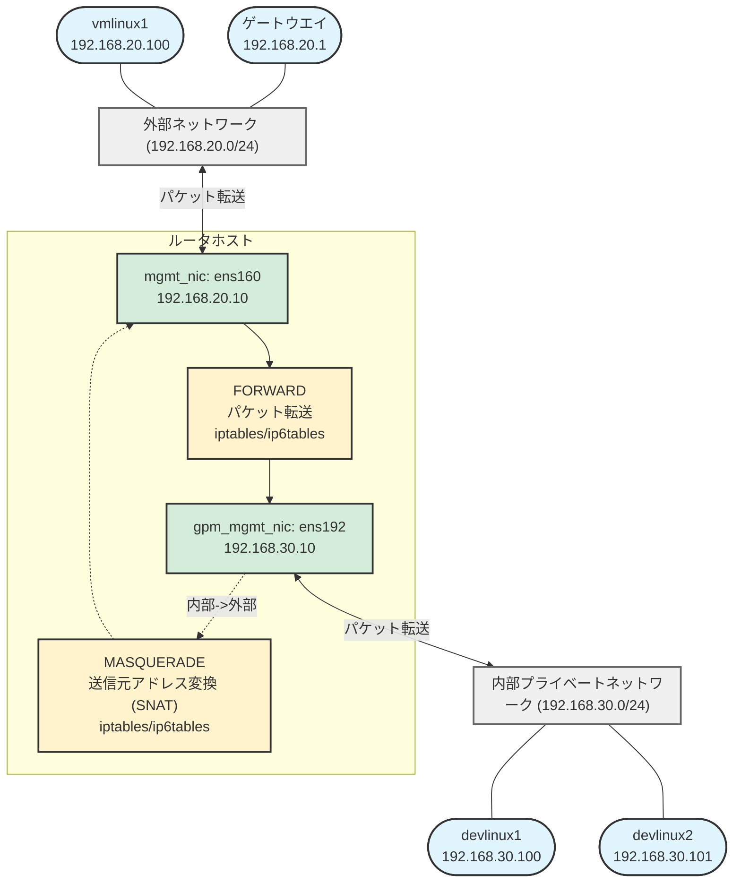

# router-config ロール

本ロールは, ルータホストで IPv4/IPv6 パケット転送と Network Address Translation (NAT) を制御する設定を行います。実装では, sysctl 設定ファイルの生成, iptables/ip6tables ルール投入, OS 別の永続化, サービス有効化, および再起動を実施します。

## 用語

| 正式名称 | 略称 | 意味 |
| --- | --- | --- |
| Operating System | OS | 基本ソフトウエア。 |
| Ansible | - | 構成管理ツール。宣言的なタスク定義でホスト設定を自動化する。 |
| systemd | - | Linux のサービス管理基盤。 |
| Network Address Translation | NAT | IP アドレスを変換する仕組み。 |
| Source Network Address Translation | SNAT | 送信元アドレスを変換する NAT 方式。 |
| Masquerading | MASQUERADE | iptables の SNAT ターゲット。送信元を送信インターフェースのアドレスへ変換する。 |
| Reverse Path Filtering | RPF | 送信元アドレスの到達可能性を検査するカーネル機能。 |
| Internet Protocol version 4 | IPv4 | 32 ビットアドレスを使う通信方式。 |
| Internet Protocol version 6 | IPv6 | 128 ビットアドレスを使う通信方式。 |
| Classless Inter-Domain Routing | CIDR | `192.168.30.0/24` のようにネットワーク範囲を表す方式。 |
| Network Interface Card | NIC | ホストのネットワーク接続口。 |
| iptables | - | Linux の IPv4 パケットフィルタ設定ツール。 |
| ip6tables | - | Linux の IPv6 パケットフィルタ設定ツール。 |
| FORWARD chain | FORWARD | 転送パケットを評価するフィルタチェーン。 |
| POSTROUTING chain | POSTROUTING | 送信直前パケットを評価する NAT チェーン。 |
| Connection Tracking | conntrack | 接続状態を追跡する機能。 |
| Connection State | ESTABLISHED, RELATED | 既存接続, または既存接続に関連する通信状態。 |
| conntrack state match | ctstate | `-m conntrack --ctstate ...` で接続状態を条件指定する機能。 |
| netfilter-persistent | - | Debian 系で iptables/ip6tables ルールを保存, 復元する仕組み。 |
| iptables-services | - | RedHat 系で iptables/ip6tables を管理するパッケージ。 |
| systemctl | - | systemd サービスを操作するコマンド。 |
| sysctl | - | Linux カーネルパラメータを参照, 設定する仕組み。 |
| Handler | - | Ansible で `notify` により実行される処理。 |
| Role | - | Ansible の機能単位。tasks, templates, defaults などをまとめた構成。 |
| Playbook | - | Ansible の実行手順を記述した YAML ファイル。 |
| Yet Another Markup Language | YAML | 可読性を重視したデータ記述形式。 |
| Tag | - | Ansible 実行対象を絞り込むラベル。 |
| Inventory | - | Ansible が接続先ホスト群を定義する設定。 |
| Docker Community Edition | Docker CE | コンテナ実行基盤 Docker のコミュニティ版。 |
| become | - | Ansible の権限昇格指定。管理者権限でタスクを実行する。 |
| tcpdump | - | パケットをキャプチャして通信を確認するコマンド。 |
| Graceful reboot | - | 稼働中サービスへの影響を抑えて実行する再起動方式。 |

## 前提条件

- 対象 OS: Debian/Ubuntu 系または RedHat/CentOS 系。
- Ansible から対象ホストへ接続可能であること。
- 対象ホストで管理者権限へ昇格して実行できること (`become: true`)。
- 以下の変数が定義済みであること。
  - `gpm_mgmt_nic`
  - `mgmt_nic`
  - `gpm_mgmt_ipv4_network_cidr`
  - `gpm_mgmt_ipv6_network_cidr`
- `gpm_mgmt_nic` と `mgmt_nic` が, 対象ホストのインターフェース一覧に存在すること。

これらの NIC 条件を満たさない場合, `Load Params` 以外のタスクは実行されません。

## 実行フロー

`roles/router-config/tasks/main.yml` は次の順序で処理します。

1. **Load Params** (`tasks/load-params.yml`)
- OS 別パッケージ変数, `cross-distro.yml`, `all-config.yml`, `k8s-api-address.yml` を読み込みます。

2. **Package** (`tasks/package.yml`)
- `iptables_persistent_package` をインストールします。

3. **Directory** (`tasks/directory.yml`)
- 現在の実装は空タスクです。

4. **User Group** (`tasks/user_group.yml`)
- 現在の実装は空タスクです。

5. **Service** (`tasks/service.yml`)
- RedHat 系で `iptables_persistent_service`, `iptables_persistent_ipv6_service` を `enabled: true` にします。

6. **Config Sysctl** (`tasks/config-sysctl.yml`)
- `templates/95-ipfoward.j2` を `/etc/sysctl.d/95-ipfoward.conf` に配置します。
- 変更時はハンドラ `bastion_config_reload_sysctl` を通知します。

7. **Config Clear Rules** (`tasks/config-clear-rules.yml`)
- `router_forwarding_enabled`, `router_nat_enabled`, `additional_network_routes` のいずれかが有効な場合に既存ルールを削除します。

8. **Config Forward** (`tasks/config-forward.yml`)
- 実行条件: `(router_forwarding_enabled == true or additional_network_routes が定義済み) and router_nat_enabled == false`。
- IPv4/IPv6 双方向 FORWARD ルールを設定します。

9. **Config Nat** (`tasks/config-nat.yml`)
- 実行条件: `router_nat_enabled == true and router_forwarding_enabled == false and (additional_network_routes 未定義または空)`。
- IPv4/IPv6 の FORWARD ルールと POSTROUTING MASQUERADE ルールを設定します。

10. **Config** (`tasks/config.yml`)
- 現在の実装は空タスクです。

11. **Reboot** (`tasks/reboot.yml`)
- `reboot_timeout_sec` を使って graceful reboot を実行します。

## 主要変数

### 動作制御

| 変数名 | 既定値 | 説明 |
| --- | --- | --- |
| `router_forwarding_enabled` | `true` | NAT 無しの双方向 FORWARD ルールを有効化します。`true` の場合は NAT より優先されます。 |
| `router_nat_enabled` | `false` | NAT 構成を有効化します。`router_forwarding_enabled: true` または `additional_network_routes` 定義時は実行されません。 |
| `additional_network_routes` | 未定義 | `additional-routes` ロールと連携する追加ルート定義です。定義時は FORWARD 構成が優先されます。 |

### パッケージ, サービス, 再起動

| 変数名 | 既定値 | 説明 |
| --- | --- | --- |
| `iptables_persistent_package` | OS 依存 | Debian 系は `iptables-persistent`, RedHat 系は `iptables-services`。 |
| `iptables_persistent_service` | OS 依存 | Debian 系は `iptables-persistent`, RedHat 系は `iptables`。 |
| `iptables_persistent_ipv6_service` | OS 依存 | Debian 系は `iptables-persistent`, RedHat 系は `ip6tables`。 |
| `etc_default_dir` | OS 依存 | Debian 系は `/etc/default`, RedHat 系は `/etc/sysconfig`。 |
| `reboot_timeout_sec` | `600` | 再起動後の応答待ちタイムアウト (秒)。 |

### ネットワーク関連 (必須)

| 変数名 | 既定値 | 説明 |
| --- | --- | --- |
| `mgmt_nic` | 必須 | 外部向けネットワーク側 NIC。 |
| `gpm_mgmt_nic` | 必須 | 内部プライベートネットワーク側 NIC。 |
| `network_ipv4_network_address` | 必須 | 外部向け IPv4 ネットワークアドレス。 |
| `network_ipv4_prefix_len` | 必須 | 外部向け IPv4 プレフィックス長。 |
| `network_ipv6_network_address` | 必須 | 外部向け IPv6 ネットワークアドレス。 |
| `network_ipv6_prefix_len` | 必須 | 外部向け IPv6 プレフィックス長。 |
| `gpm_mgmt_ipv4_network_cidr` | 必須 | 内部プライベート側 IPv4 CIDR。 |
| `gpm_mgmt_ipv6_network_cidr` | 必須 | 内部プライベート側 IPv6 CIDR。 |

## 主な処理

- `95-ipfoward.conf` を配置し, IPv4/IPv6 転送と RPF ルーズモードを有効化します。
- ルール投入前に既存 FORWARD/POSTROUTING ルールを削除し, モード切替時のルール残骸を防ぎます。
- 純粋ルーティングモードでは, 外部向けネットワーク <=> 内部プライベートネットワークの双方向 FORWARD ルールを投入します。
- NAT モードでは, FORWARD ルールに加えて POSTROUTING MASQUERADE を投入します。
- ルールは OS 別方式で永続化します。
  - Debian 系: `netfilter-persistent save`
  - RedHat 系: `iptables-save`, `ip6tables-save` で `{{ etc_default_dir }}/iptables`, `{{ etc_default_dir }}/ip6tables` へ保存
- RedHat 系では保存後に `iptables`, `ip6tables` サービスを再起動して即時反映します。

## テンプレート / 出力ファイル

| テンプレートまたは生成物 | 出力先 | 説明 |
| --- | --- | --- |
| `templates/95-ipfoward.j2` | `/etc/sysctl.d/95-ipfoward.conf` | IPv4/IPv6 転送, RPF, `accept_ra` を設定します。 |
| 永続化処理 (Debian 系) | `netfilter-persistent` 管理下 | `netfilter-persistent save` でルールを保存します。 |
| 永続化処理 (RedHat 系, IPv4) | `{{ etc_default_dir }}/iptables` | `iptables-save` の出力先。 |
| 永続化処理 (RedHat 系, IPv6) | `{{ etc_default_dir }}/ip6tables` | `ip6tables-save` の出力先。 |

## ハンドラ

### bastion_config_reload_sysctl (`handlers/reload-sysctl.yml`)

- `listen`: `bastion_config_reload_sysctl`
- 実行コマンド: `sysctl --system`
- 起動条件: `config-sysctl.yml` でテンプレート更新が発生した場合

## OS差異

| 項目 | Debian/Ubuntu | RedHat/CentOS |
| --- | --- | --- |
| 永続化パッケージ | `iptables-persistent` | `iptables-services` |
| IPv4 サービス変数 | `iptables-persistent` | `iptables` |
| IPv6 サービス変数 | `iptables-persistent` | `ip6tables` |
| 永続化コマンド | `netfilter-persistent save` | `iptables-save`, `ip6tables-save` |
| 保存先ディレクトリ | `/etc/default` | `/etc/sysconfig` |
| service.yml の有効化処理 | 実質なし | `iptables`, `ip6tables` を有効化 |

## 実行方法

### 前提

- インベントリに対象ルータホストが含まれていること。
- `router.yml` では `docker-ce` の後に `router-config` が実行されます。
- モード切替時は, 必要に応じて先にクリアルールを実行します。

### Make ターゲットで実行

```bash
# router-config ロール実行
make run_router_config

# 既存ルールクリア
make run_router_clear_rules
```

`run_router_clear_rules` は `router-clear-rules.yml` を `hosts: all` で実行します。必要に応じて `-l router.local` で対象ホストを限定してください。

### ansible-playbook で直接実行

```bash
# router プレイブック全体
ansible-playbook -i inventory/hosts router.yml

# site.yml から router-config タグのみ
ansible-playbook -i inventory/hosts site.yml --tags "router-config"

# ホスト限定で実行
ansible-playbook -i inventory/hosts site.yml --tags "router-config" -l router.local

# クリア専用プレイブック
ansible-playbook -i inventory/hosts router-clear-rules.yml
```

### 推奨実行順序 (モード切替時)

1. `make run_router_clear_rules` で既存ルールを削除します。
2. 変数 (`router_forwarding_enabled`, `router_nat_enabled`, `additional_network_routes`) を調整します。
3. `make run_router_config` で新モードを適用します。

## 検証

### 1. 共通検証

#### 1.1 sysctl 設定確認

**実施ノード**: ルータホスト

**コマンド**:
```bash
cat /etc/sysctl.d/95-ipfoward.conf
sysctl net.ipv4.ip_forward
sysctl net.ipv4.conf.all.rp_filter
sysctl net.ipv6.conf.all.forwarding
```

**確認ポイント**:
- `95-ipfoward.conf` が存在し, `ip_forward=1`, `rp_filter=2`, `ipv6 forwarding=1` が設定されていること。
- 実行中カーネル値も期待通りであること。

#### 1.2 永続化状態確認

**実施ノード**: ルータホスト

**コマンド**:
```bash
# Debian/Ubuntu
sudo netfilter-persistent save

# RedHat/CentOS
sudo systemctl status iptables
sudo systemctl status ip6tables
sudo cat /etc/sysconfig/iptables
sudo cat /etc/sysconfig/ip6tables
```

**確認ポイント**:
- Debian 系では `netfilter-persistent save` が成功すること。
- RedHat 系では `iptables`, `ip6tables` が `enabled` かつ `active` であること。

### 2. 純粋ルーティング構成の検証 (config-forward.yml)

#### 2.1 FORWARD ルール確認

**実施ノード**: ルータホスト

**コマンド**:
```bash
sudo iptables -L FORWARD -nv --line-numbers | grep -E '192\.168\.20\.0/24|192\.168\.30\.0/24'
sudo ip6tables -L FORWARD -nv --line-numbers | grep -E 'fd69:6684:61a:1::/64|fdad:ba50:248b:1::/64'
```

**確認ポイント**:
- 外部向け <=> 内部プライベートの双方向 ACCEPT ルールが存在すること。

#### 2.2 NAT 不在確認

**実施ノード**: ルータホスト

**コマンド**:
```bash
sudo iptables -t nat -L POSTROUTING -nv
sudo ip6tables -t nat -L POSTROUTING -nv
```

**確認ポイント**:
- 純粋ルーティングモードでは MASQUERADE ルールが存在しないこと。

#### 2.3 疎通確認 (送信元保持)

**実施ノード**: 外部向けネットワークのホスト

**コマンド**:
```bash
ping -c3 192.168.30.100
```

**確認ポイント**:
- 疎通が成功すること。
- 送信元 IP が NAT 変換されず保持されること。

### 3. NAT 構成の検証 (config-nat.yml)

#### 3.1 FORWARD, POSTROUTING ルール確認

**実施ノード**: ルータホスト

**コマンド**:
```bash
sudo iptables -L FORWARD -nv
sudo iptables -t nat -L POSTROUTING -nv | grep MASQUERADE
sudo ip6tables -L FORWARD -nv
sudo ip6tables -t nat -L POSTROUTING -nv | grep MASQUERADE
```

**確認ポイント**:
- IPv4/IPv6 の FORWARD ルールが存在すること。
- IPv4/IPv6 の POSTROUTING に MASQUERADE が存在すること。

#### 3.2 疎通確認 (NAT 変換)

**実施ノード**: 内部プライベートネットワークのホスト

**コマンド**:
```bash
ping -c3 8.8.8.8
```

**確認ポイント**:
- 内部から外部への通信が成功すること。

#### 3.3 tcpdump による SNAT 確認

**実施ノード**: ルータホスト

**コマンド**:
```bash
sudo tcpdump -i <外部向けNIC> -n icmp
```

**確認ポイント**:
- 外向きパケットの送信元が, 内部ホスト IP ではなくルータ外部 NIC の IP で観測されること。

### 4. 意図的にパケット転送を無効化している場合

#### 4.1 ルール未設定確認

**実施ノード**: ルータホスト

**コマンド**:
```bash
sudo iptables -L FORWARD -nv
sudo iptables -t nat -L POSTROUTING -nv
```

**確認ポイント**:
- FORWARD ルールと MASQUERADE ルールが存在しないこと。

#### 4.2 ルール残骸がある場合の対処

**実施ノード**: Ansible 実行ホスト

**コマンド**:
```bash
make run_router_clear_rules
make run_router_config
```

**確認ポイント**:
- クリア後の再適用で, 意図した無効化ポリシーが維持されること。

## 補足

### 動作モード

- 純粋なルーティング (デフォルト): NAT 無しの双方向パケット転送 (`config-forward.yml`)。
- NAT 動作: MASQUERADE による送信元アドレス変換 (`config-nat.yml`)。

### 設定値による動作の違い

以下の表は, `enable_firewall` が `false` である前提での挙動です。

| `router_forwarding_enabled` | `router_nat_enabled` | `additional_network_routes` | 動作 |
| --- | --- | --- | --- |
| `false` | `false` | 未定義, または空リスト | FORWARD/NAT 設定なし |
| `false` | `false` | 長さ 1 以上 | FORWARD 設定を実施 (純粋ルーティング) |
| `false` | `true` | 未定義, または空リスト | SNAT (MASQUERADE) と FORWARD 設定を実施 |
| `false` | `true` | 長さ 1 以上 | 設定値矛盾のため, FORWARD/NAT 設定なし |
| `true` | `false` | 未定義, または空リスト | FORWARD 設定を実施 (純粋ルーティング) |
| `true` | `false` | 長さ 1 以上 | FORWARD 設定を実施 (純粋ルーティング) |
| `true` | `true` | 未定義, または空リスト | 設定値矛盾のため, FORWARD/NAT 設定なし |
| `true` | `true` | 長さ 1 以上 | 設定値矛盾のため, FORWARD/NAT 設定なし |

### run_router_clear_rules の利用用途

- NAT から純粋ルーティングへ切替える前に NAT ルールを削除します。
- 純粋ルーティングから NAT へ切替える前に FORWARD ルールを削除します。
- ルーティング機能を停止する前に, ルール残骸を削除します。
- クリア処理は削除対象ルールが存在しない場合でも `|| true` により継続されます。
- `make run_router_clear_rules` 実行時のログは `build-router-clear-rules.log` に保存されます。

### ネットワーク構成とルータホストの役割

#### ネットワークの分類

| ネットワーク | 本稿で例示するネットワーク CIDR | 用途 | インターフェース | 説明 |
| --- | --- | --- | --- | --- |
| 外部向けネットワーク | `192.168.20.0/24` | 物理サーバ/管理用 | `mgmt_nic` (ens160) | 外部接続側 NIC。 |
| 内部プライベート | `192.168.30.0/24` | 内部管理 | `gpm_mgmt_nic` (ens192) | 内部接続側 NIC。 |

#### IP アドレスの例

- 外部向け `192.168.20.0/24`
- `192.168.20.1`: 外部ゲートウェイ
- `192.168.20.10`: ルータホスト `mgmt_nic`

- 内部プライベート `192.168.30.0/24`
- `192.168.30.10`: ルータホスト `gpm_mgmt_nic`
- `192.168.30.100`, `192.168.30.101`: 内部側テストホスト

#### トラフィックの流れ


```mermaid
graph TD
    I([ゲートウエイ<br/>192.168.20.1])
    J([vmlinux1<br/>192.168.20.100])
    subgraph ExtNet["外部ネットワーク (192.168.20.0/24)"]
    end

    subgraph Router["ルータホスト"]
        B["mgmt_nic: ens160<br/>192.168.20.10"]
        C["FORWARD<br/>パケット転送<br/>iptables/ip6tables"]
        C2["MASQUERADE<br/>送信元アドレス変換 (SNAT)<br/>iptables/ip6tables"]
        D["gpm_mgmt_nic: ens192<br/>192.168.30.10"]
        B --> C
        C --> D
        D -.->|内部->外部| C2
        C2 -.-> B
    end

    subgraph IntNet["内部プライベートネットワーク (192.168.30.0/24)"]
    end

    F([devlinux1<br/>192.168.30.100])
    G([devlinux2<br/>192.168.30.101])

    I --- ExtNet
    J --- ExtNet
    ExtNet <-->|パケット転送| B
    D <-->|パケット転送| IntNet

    IntNet --- F
    IntNet --- G

    classDef hostStyle fill:#e1f5ff,stroke:#333,stroke-width:2px
    classDef nicStyle fill:#d4edda,stroke:#333,stroke-width:2px
    classDef controlStyle fill:#fff3cd,stroke:#333,stroke-width:2px
    classDef networkStyle fill:#f0f0f0,stroke:#666,stroke-width:2px

    class F,G,I,J hostStyle
    class B,D nicStyle
    class C,C2 controlStyle
    class ExtNet,IntNet networkStyle
```

## 参考リンク

- `roles/router-config/tasks/main.yml`
- `roles/router-config/tasks/config-forward.yml`
- `roles/router-config/tasks/config-nat.yml`
- `roles/router-config/tasks/config-clear-rules.yml`
- `roles/router-config/tasks/config-sysctl.yml`
- `roles/router-config/handlers/reload-sysctl.yml`
- `roles/router-config/templates/95-ipfoward.j2`
- `router.yml`
- `router-clear-rules.yml`
- `Makefile`
